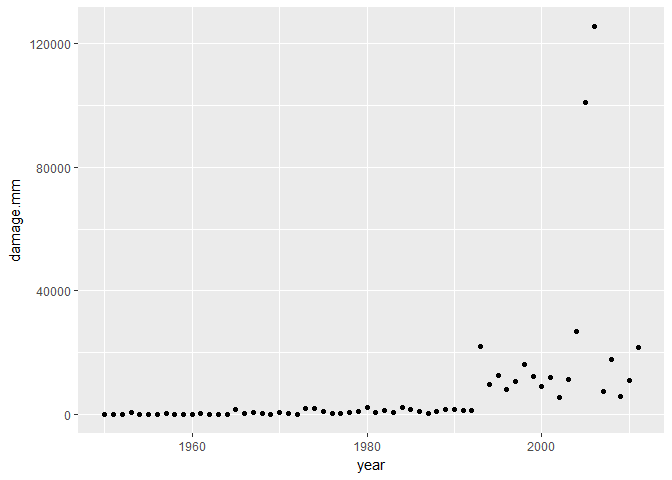
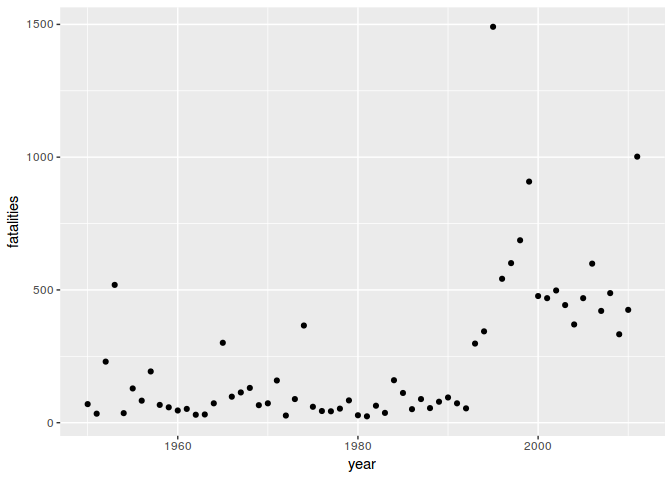

# main


## Questions

1. Across the United States, which types of events (as indicated in the EVTYPE variable) are most harmful with respect to population health?

2. Across the United States, which types of events have the greatest economic consequences?

## Synopsis


## Data Processing


```r
library(dplyr)
library(ggplot2)
library(gridExtra)
library(stringr)
library(rprojroot)
library(R.utils)
library(lubridate)
```

### Set up project folders with `rprojroot`

```r
# package rprojroot required
root <- rprojroot::is_rstudio_project
root_file <- root$make_fix_file()
# root$find_file("REAME.md")
root_file()
cat("Setting up the project folders:\n")
project.data <- root_file("data")
project.extdata <- root_file("inst/extdata")
project.R <- root_file("R")

project.data
project.extdata
project.R
```

```
[1] "/home/superuser/git.projects/RR-PeerAsmnt2-NOAA_Storm"
Setting up the project folders:
[1] "/home/superuser/git.projects/RR-PeerAsmnt2-NOAA_Storm/data"
[1] "/home/superuser/git.projects/RR-PeerAsmnt2-NOAA_Storm/inst/extdata"
[1] "/home/superuser/git.projects/RR-PeerAsmnt2-NOAA_Storm/R"
```

### Downloading the data
We found a problem while trying to download the data file from the internet. The `bunzip2` format is not properly managed by the `download.file` function. So, we have to add a new function `bunzip2` from the package `R.utils` to download and unpack the compresed file. Of course, this could have been done by using the `read.csv` function to read the data file directly but that would be a "one-off" operation. To make the function `downloadZip` reusable for the future we used `bunzip2`. There is a flag in the function that allows the selection of that particular compression format.


```r
downloadZip <- function(fileUrl, outDir="./data", bzip2 = FALSE) {
  # function to download zipped and bunzip2 files and unpack
  temp <- tempfile()
  download.file(fileUrl, temp, mode = "wb")
  if (bzip2 == FALSE) {
    unzip(temp, exdir = outDir)
  }
  else {
    destfile <- paste(outDir, "dataset.csv", sep = "/")  # provide a filename
    bunzip2(temp, destname = destfile, overwrite = TRUE) # unpack bunzip2 file
  }
}
```


```r
# URL of the dataset file
fileUrl <- "https://d396qusza40orc.cloudfront.net/repdata%2Fdata%2FStormData.csv.bz2"
cat("Unpacking the raw data file:\n")
```

```
Unpacking the raw data file:
```

```r
outDir <- project.extdata             # folder for raw data
downloadZip(fileUrl, outDir = outDir, bzip2 = TRUE)   # download and unpack file
```


```r
# read the CSV file to memory
dataFile <- paste(project.extdata, "dataset.csv", sep = "/")
stormdata.raw <- read.csv(dataFile)
```

```
Warning in file(file, "rt"): cannot open file '/home/superuser/
git.projects/RR-PeerAsmnt2-NOAA_Storm/inst/extdata/dataset.csv': No such
file or directory
```

```
Error in file(file, "rt"): cannot open the connection
```

```r
# stormdata <- stormdata.raw          # for the moment we will use a shorter name
```


```r
# properties of the dataset
dims <- dim(stormdata.raw)
```

```
Error in eval(expr, envir, enclos): object 'stormdata.raw' not found
```

```r
dims
```

```
Error in eval(expr, envir, enclos): object 'dims' not found
```

```r
# There are `r dims[1]` observations and `r dims[2]` variables.
```


The names of the variables are:

```r
names(stormdata.raw)
```

```
Error in eval(expr, envir, enclos): object 'stormdata.raw' not found
```


```r
#str(stormdata.raw)
summary(stormdata.raw)
```

```
Error in summary(stormdata.raw): object 'stormdata.raw' not found
```

### What variables do we keep for our analysis?

These are the variable that we consider important for the analysis:

        REFNUM, BGN_DATE, STATE, COUNTY, COUNTYNAME, EVTYPE, 
        FATALITIES, INJURIES, PROPDMG, PROPDMGEXP, CROPDMG, CROPDMGEXP, REMARKS


```r
stormdata <- stormdata.raw %>%
  select(REFNUM, BGN_DATE, STATE, COUNTY, COUNTYNAME, EVTYPE, FATALITIES, INJURIES, PROPDMG, PROPDMGEXP, CROPDMG, CROPDMGEXP, REMARKS)
```

```
Error in eval(expr, envir, enclos): object 'stormdata.raw' not found
```

If we save this data frame `stormdata` as an .rda file the size is 46 megabytes. On the other hand, if we omit the remarks, the new dataset shrinks to only 4.6 megabytes.


```r
# REFNUM is the record id of the observation and is unique.
length(unique(stormdata$REFNUM))
```

```
Error in unique(stormdata$REFNUM): object 'stormdata' not found
```

```r
range(unique(stormdata$REFNUM))
```

```
Error in unique(stormdata$REFNUM): object 'stormdata' not found
```


```r
head(stormdata)
```

```
Error in head(stormdata): object 'stormdata' not found
```

### Clean up the dataset


```r
stormdata.small <- stormdata %>%
    select(REFNUM, BGN_DATE, STATE, COUNTY, COUNTYNAME, EVTYPE, FATALITIES, INJURIES, PROPDMG, PROPDMGEXP, CROPDMG, CROPDMGEXP) %>%
  mutate(DATE = mdy_hms(as.character(BGN_DATE))) %>%
  select(REFNUM, DATE, STATE, COUNTY, COUNTYNAME, EVTYPE, FATALITIES, INJURIES, PROPDMG, PROPDMGEXP, CROPDMG, CROPDMGEXP) 
```

```
Error in eval(expr, envir, enclos): object 'stormdata' not found
```

```r
stormdata.small
```

```
Error in eval(expr, envir, enclos): object 'stormdata.small' not found
```


```r
# save unique events by year
save(stormdata.small, file = paste(project.data, "stormdata.small.rda", sep = "/"))
```

```
Error in save(stormdata.small, file = paste(project.data, "stormdata.small.rda", : object 'stormdata.small' not found
```

### Event Types `EVTYPE`


```r
# want to know how levels this factor has
head(unique(stormdata.raw$EVTYPE), 10)
```

```
Error in unique(stormdata.raw$EVTYPE): object 'stormdata.raw' not found
```

```r
# There are `r length(unique(stormdata$EVTYPE))` different type of events.
```


We want to find now which type of events is more harmful to population health. We could group by `EVTYPE` and showing the variables FATALITIES and INJURIES.


```r
byEvent.0 <- stormdata %>%
  select(EVTYPE, FATALITIES, INJURIES) %>%
  group_by(EVTYPE) %>%
  summarize(fatal.sum = sum(FATALITIES), injur.sum = sum(INJURIES)) %>%
  arrange(desc(fatal.sum), desc(injur.sum))
```

```
Error in eval(expr, envir, enclos): object 'stormdata' not found
```

```r
byEvent.0
```

```
Error in eval(expr, envir, enclos): object 'byEvent.0' not found
```


```r
byEvent.1 <- stormdata %>%
  select(EVTYPE, FATALITIES, INJURIES) %>%
  group_by(EVTYPE) %>%
  summarize(injur.sum = sum(INJURIES), fatal.sum = sum(FATALITIES)) %>%
  arrange(desc(injur.sum), desc(fatal.sum))
```

```
Error in eval(expr, envir, enclos): object 'stormdata' not found
```

```r
byEvent.1
```

```
Error in eval(expr, envir, enclos): object 'byEvent.1' not found
```

We plot now the top 5 events that cause more harm on the population:


```r
byEvent.005 <- byEvent.0[1:5, ]
```

```
Error in eval(expr, envir, enclos): object 'byEvent.0' not found
```

```r
p1 <- ggplot(byEvent.005, aes(x = EVTYPE, y = fatal.sum)) +
  geom_bar(stat = "identity") +
  xlab("Event Type") + ylab("Fatalities") +
  geom_text(aes(label=fatal.sum, vjust = -0.25))
```

```
Error in ggplot(byEvent.005, aes(x = EVTYPE, y = fatal.sum)): object 'byEvent.005' not found
```

```r
p2 <- ggplot(byEvent.005, aes(EVTYPE, injur.sum)) +
  geom_bar(stat = "identity") +
  xlab("Event Type") + ylab("Injuries") +
  geom_text(aes(label=injur.sum, vjust = -0.25))
```

```
Error in ggplot(byEvent.005, aes(EVTYPE, injur.sum)): object 'byEvent.005' not found
```

```r
gridExtra::grid.arrange(p1, p2)
```

```
Error in arrangeGrob(...): object 'p1' not found
```

Tornados, Excessive heat, flash floods, heat and lightning are the weather events most harmful to the population accross the United States.

## Economic Damage
The property and crop damage are not in a unique monetary units; they use thousands, millions and billions. They are specified in the variables `PROPDMGEXP` and `CROPDMGEXP`.

We will start by converting the monetary damages to a consistent units. We will choose thousands.


```r
byDamage <- stormdata %>%
  select(EVTYPE, PROPDMG, PROPDMGEXP, CROPDMG, CROPDMGEXP) %>%
  group_by(EVTYPE) %>%
  mutate(PROPDMGEXP = as.factor(toupper(str_trim(PROPDMGEXP))), 
         CROPDMGEXP = as.factor(toupper(str_trim(CROPDMGEXP)))) %>%
  mutate(PROPDMG.K = ifelse(PROPDMGEXP == "K", PROPDMG * 1,
                                    ifelse(PROPDMGEXP == "M", PROPDMG * 1000,
                                           ifelse(PROPDMGEXP == "B", PROPDMG * 1E6, 0)))) %>%
  mutate(CROPDMG.K = ifelse(CROPDMGEXP == "K", CROPDMG * 1,
                                    ifelse(CROPDMGEXP == "M", CROPDMG * 1000,
                                           ifelse(CROPDMGEXP == "B", CROPDMG * 1E6, 0))))
```

```
Error in eval(expr, envir, enclos): object 'stormdata' not found
```

```r
byDamage
```

```
Error in eval(expr, envir, enclos): object 'byDamage' not found
```

We converts the thousands to millions of US$ and only one variable, the total economic damage.


```r
byDamage.m <- byDamage %>%
  
  summarize(propdmg.k = sum(PROPDMG.K), cropdmg.k = sum(CROPDMG.K)) %>%
  mutate(propdmg.m = propdmg.k / 1000, cropdmg.m = cropdmg.k / 1000) %>%
  select(EVTYPE, propdmg.m, cropdmg.m) %>%
  mutate(totaldmg.m = propdmg.m + cropdmg.m) %>%
  # arrange(desc(propdmg.m), desc(cropdmg.m))
  arrange(desc(totaldmg.m))
```

```
Error in eval(expr, envir, enclos): object 'byDamage' not found
```

```r
byDamage.m
```

```
Error in eval(expr, envir, enclos): object 'byDamage.m' not found
```

Get the top 5 and top 10 causes of economic damage.

```r
byDamage.m.top5 <- byDamage.m[1:5, ]
```

```
Error in eval(expr, envir, enclos): object 'byDamage.m' not found
```

```r
byDamage.m.top5
```

```
Error in eval(expr, envir, enclos): object 'byDamage.m.top5' not found
```

```r
byDamage.m.top10 <- byDamage.m[1:10, ]
```

```
Error in eval(expr, envir, enclos): object 'byDamage.m' not found
```

```r
byDamage.m.top10
```

```
Error in eval(expr, envir, enclos): object 'byDamage.m.top10' not found
```


```r
ggplot(byDamage.m.top5, aes(EVTYPE, totaldmg.m)) +
  geom_bar(stat = "identity")
```

```
Error in ggplot(byDamage.m.top5, aes(EVTYPE, totaldmg.m)): object 'byDamage.m.top5' not found
```


### Multiple identifiers for monetary units
There are some unspecified units in `PROPDMGEXP` and `CROPDMGEXP`.
There is no a reasonable way to determine the units or damage value from the remarks. Sometimes is thousands or in 10K, or other. Besides the identifiers `B`, `M` and `K`, there are additional characters and numbers entered in this variable. Since there is no way to etermine the units for the property or crop damage we are not considering these amounts. In two cases, we found that instead of "M" for millions the lowercase version of it "m" was used. We converted them to uppercase before summarizing the data.

Other characters or digits did not bring a special meaning to the dollar amount, so we didn't convert them even thoiugh we read the remarks to find some relationship.


```r
unique(byDamage$PROPDMGEXP)
```

```
Error in unique(byDamage$PROPDMGEXP): object 'byDamage' not found
```


```r
unique(byDamage$CROPDMGEXP)
```

```
Error in unique(byDamage$CROPDMGEXP): object 'byDamage' not found
```


```r
summary(byDamage)
```

```
Error in summary(byDamage): object 'byDamage' not found
```


Here is how we know how many observations do not carry the "K", "M" and "B" identifiers.


```r
unknown <- stormdata %>%
  select(STATE, EVTYPE, PROPDMGEXP, CROPDMGEXP, REMARKS) %>%
  filter(!toupper(PROPDMGEXP) %in% c("K", "M", "B") | !toupper(CROPDMGEXP) %in% c("K", "M", "B"))
```

```
Error in eval(expr, envir, enclos): object 'stormdata' not found
```

```r
dim(unknown)[1]
```

```
Error in eval(expr, envir, enclos): object 'unknown' not found
```

```r
# There are `r dim(unknown)[1]` observations which dollar amount units are not properly identified in `PROPDMGEXP` and `CROPDMGEXP` variables.
```


### Saving some data
We save few datasets that are much smaller in size than the original dataset.

1. byYearEvent: is a dataset that contains a summary of the events, fatalities, injuries, economic losses in property and crops in millions of US$. TO-DO: convert dates to year.

2. byYearSummary: a dataset showing the year and the wather impact on life and the economy. Four variables: year, fatalities, injured and economy losses in millions of USD.


```r
# By year, by event
byYearEvent <- stormdata %>%
  group_by(BGN_DATE, EVTYPE) %>%
  mutate(PROPDMGEXP = as.factor(toupper(str_trim(PROPDMGEXP))), 
         CROPDMGEXP = as.factor(toupper(str_trim(CROPDMGEXP))))     %>%
  mutate(PROPDMG.K = ifelse(PROPDMGEXP == "K", PROPDMG * 1,
                     ifelse(PROPDMGEXP == "M", PROPDMG * 1000,
                     ifelse(PROPDMGEXP == "B", PROPDMG * 1E6, 0)))) %>%
  mutate(CROPDMG.K = ifelse(CROPDMGEXP == "K", CROPDMG * 1,
                     ifelse(CROPDMGEXP == "M", CROPDMG * 1000,
                     ifelse(CROPDMGEXP == "B", CROPDMG * 1E6, 0)))) %>%
  summarize(fatalities = sum(FATALITIES), 
            injuries   = sum(INJURIES),
            propdmg.M  = sum(PROPDMG.K) / 1000,
            cropdmg.M  = sum(CROPDMG.K) /1000
            )
```

```
Error in eval(expr, envir, enclos): object 'stormdata' not found
```

```r
byYearEvent
```

```
Error in eval(expr, envir, enclos): object 'byYearEvent' not found
```


```r
# save unique events by year
save(byYearEvent, file = paste(project.data, "byYearEvent.rda", sep = "/"))
```

```
Error in save(byYearEvent, file = paste(project.data, "byYearEvent.rda", : object 'byYearEvent' not found
```

### Have the number of fatalities and injuries increased over the years?


```r
load(paste(project.data, "byYearEvent.rda", sep = "/"))  # load the data

byYearSummary <- byYearEvent %>%
  mutate(year = year(mdy_hms(as.character(BGN_DATE)))) %>%
  group_by(year) %>%
  summarize(fatalities = sum(fatalities), 
            injuries = sum(injuries),
            damage.mm = sum(propdmg.M) + sum(cropdmg.M)
            )

byYearSummary
```

```
# A tibble: 62 × 4
    year fatalities injuries damage.mm
   <dbl>      <dbl>    <dbl>     <dbl>
1   1950         70      659  34.48165
2   1951         34      524  65.50599
3   1952        230     1915  94.10224
4   1953        519     5131 596.10470
5   1954         36      715  85.80532
6   1955        129      926  82.66063
7   1956         83     1355 116.91235
8   1957        193     1976 224.38889
9   1958         67      535 128.99461
10  1959         58      734  87.45304
# ... with 52 more rows
```


```r
ggplot(byYearSummary, aes(x = year, y = damage.mm)) +
  geom_point()
```

<!-- -->


```r
ggplot(byYearSummary, aes(x = year, y = fatalities)) +
  geom_point()
```

<!-- -->


```r
ggplot(byYearSummary, aes(x = year, y = injuries)) +
  geom_point()
```

<!-- -->


```r
# save losses by year
save(byYearSummary, file = paste(project.data, "byYearSummary.rda", sep = "/"))
```

## Results

## Figures
Maximum: 03. Can use panels.

## Code
