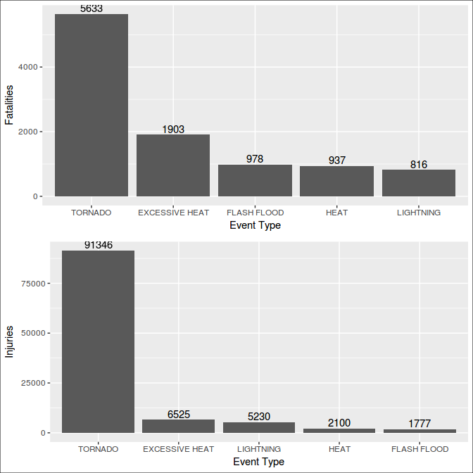
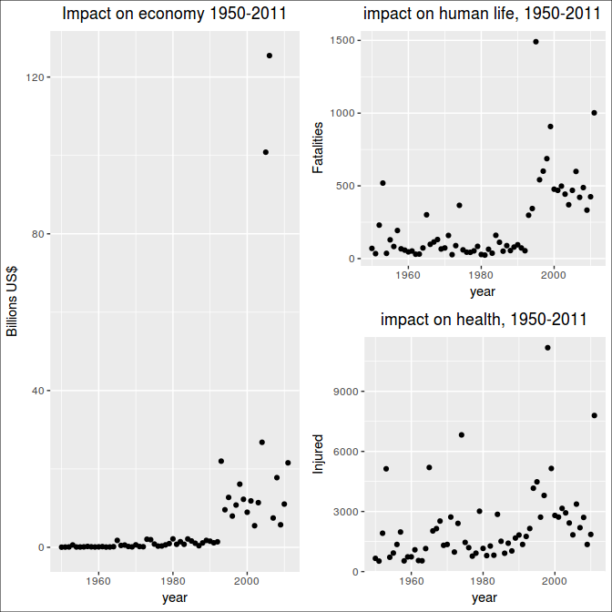

# main
Alfonso R. Reyes  


## Questions

1. Across the United States, which types of events (as indicated in the EVTYPE variable) are most harmful with respect to population health?

2. Across the United States, which types of events have the greatest economic consequences?

## Synopsis


## Data Processing
The data processing consisted in the following steps:

1. Download the raw data file from the internet using the `download.file` function.
2. Unpack the downloaded file (500+ MB) into a CSV file.
3. Load the CSV file in the object `stormdata.raw`.
4. Perform a quick analysis of the dataset `stormdata.raw` before applying data transformations.
5. Create a simplified dataset `stormdata` where some non-relevant variables have been removed but all observations kept.
6. Create a small dataset `stormdata.small` with only 12 variables remaining and all observations still in place. The size of this file is around 6 MB.
7. Clear the object `stormdata.raw` to save memory.
8. Create the data frames to respond the first question.
9. Create the data frame to respond to the second question.
10. Save an additional dataset to address other questions in the future.


```r
library(dplyr)
library(ggplot2)
library(gridExtra)
library(stringr)
library(rprojroot)
library(R.utils)
library(lubridate)
```

### Set up project folders with `rprojroot` package

```r
# package rprojroot required
root <- rprojroot::is_rstudio_project
root_file <- root$make_fix_file()
# root$find_file("REAME.md")
root_file()
cat("Setting up the project folders:\n")
project.data <- root_file("data")
project.extdata <- root_file("inst/extdata")
project.R <- root_file("R")

project.data
project.extdata
project.R
```

```
[1] "/home/superuser/git.projects/RR-PeerAsmnt2-NOAA_Storm"
Setting up the project folders:
[1] "/home/superuser/git.projects/RR-PeerAsmnt2-NOAA_Storm/data"
[1] "/home/superuser/git.projects/RR-PeerAsmnt2-NOAA_Storm/inst/extdata"
[1] "/home/superuser/git.projects/RR-PeerAsmnt2-NOAA_Storm/R"
```


### Downloading the data
We found a problem while trying to download the data file from the internet. The `bunzip2` format is not properly managed by the `download.file` function. So, we have to add a new function `bunzip2` from the package `R.utils` to download and unpack the compresed file. Of course, this could have been done by using the `read.csv` function to read the data file directly but that would be a "one-off" operation. To make the function `downloadZip` reusable for the future we used `bunzip2`. There is a flag in the function that allows the selection of that particular compression format.


```r
downloadZip <- function(fileUrl, outDir="./data", bzip2 = FALSE) {
  # function to download zipped and bunzip2 files and unpack
  temp <- tempfile()
  download.file(fileUrl, temp, mode = "wb")
  if (bzip2 == FALSE) {
    unzip(temp, exdir = outDir)
  }
  else {
    destfile <- paste(outDir, "dataset.csv", sep = "/")  # provide a filename
    bunzip2(temp, destname = destfile, overwrite = TRUE) # unpack bunzip2 file
  }
}
```


```r
# URL of the dataset file
fileUrl <- "https://d396qusza40orc.cloudfront.net/repdata%2Fdata%2FStormData.csv.bz2"
cat("Unpacking the raw data file:\n")
```

```
Unpacking the raw data file:
```

```r
outDir <- project.extdata             # folder for raw data
downloadZip(fileUrl, outDir = outDir, bzip2 = TRUE)   # download and unpack file
```


```r
# read the CSV file to memory
dataFile <- paste(project.extdata, "dataset.csv", sep = "/")
stormdata.raw <- read.csv(dataFile)
# stormdata <- stormdata.raw          # for the moment we will use a shorter name
```

### How our raw data look?

```r
# properties of the dataset
dims <- dim(stormdata.raw)
```

There are 902297 observations and 37 variables.

The names of the variables are:

```r
names(stormdata.raw)
```

```
 [1] "STATE__"    "BGN_DATE"   "BGN_TIME"   "TIME_ZONE"  "COUNTY"    
 [6] "COUNTYNAME" "STATE"      "EVTYPE"     "BGN_RANGE"  "BGN_AZI"   
[11] "BGN_LOCATI" "END_DATE"   "END_TIME"   "COUNTY_END" "COUNTYENDN"
[16] "END_RANGE"  "END_AZI"    "END_LOCATI" "LENGTH"     "WIDTH"     
[21] "F"          "MAG"        "FATALITIES" "INJURIES"   "PROPDMG"   
[26] "PROPDMGEXP" "CROPDMG"    "CROPDMGEXP" "WFO"        "STATEOFFIC"
[31] "ZONENAMES"  "LATITUDE"   "LONGITUDE"  "LATITUDE_E" "LONGITUDE_"
[36] "REMARKS"    "REFNUM"    
```


```r
as_data_frame(stormdata.raw)
```

```
# A tibble: 902,297 × 37
   STATE__           BGN_DATE BGN_TIME TIME_ZONE COUNTY COUNTYNAME  STATE
     <dbl>             <fctr>   <fctr>    <fctr>  <dbl>     <fctr> <fctr>
1        1  4/18/1950 0:00:00     0130       CST     97     MOBILE     AL
2        1  4/18/1950 0:00:00     0145       CST      3    BALDWIN     AL
3        1  2/20/1951 0:00:00     1600       CST     57    FAYETTE     AL
4        1   6/8/1951 0:00:00     0900       CST     89    MADISON     AL
5        1 11/15/1951 0:00:00     1500       CST     43    CULLMAN     AL
6        1 11/15/1951 0:00:00     2000       CST     77 LAUDERDALE     AL
7        1 11/16/1951 0:00:00     0100       CST      9     BLOUNT     AL
8        1  1/22/1952 0:00:00     0900       CST    123 TALLAPOOSA     AL
9        1  2/13/1952 0:00:00     2000       CST    125 TUSCALOOSA     AL
10       1  2/13/1952 0:00:00     2000       CST     57    FAYETTE     AL
# ... with 902,287 more rows, and 30 more variables: EVTYPE <fctr>,
#   BGN_RANGE <dbl>, BGN_AZI <fctr>, BGN_LOCATI <fctr>, END_DATE <fctr>,
#   END_TIME <fctr>, COUNTY_END <dbl>, COUNTYENDN <lgl>, END_RANGE <dbl>,
#   END_AZI <fctr>, END_LOCATI <fctr>, LENGTH <dbl>, WIDTH <dbl>, F <int>,
#   MAG <dbl>, FATALITIES <dbl>, INJURIES <dbl>, PROPDMG <dbl>,
#   PROPDMGEXP <fctr>, CROPDMG <dbl>, CROPDMGEXP <fctr>, WFO <fctr>,
#   STATEOFFIC <fctr>, ZONENAMES <fctr>, LATITUDE <dbl>, LONGITUDE <dbl>,
#   LATITUDE_E <dbl>, LONGITUDE_ <dbl>, REMARKS <fctr>, REFNUM <dbl>
```


### What variables do we keep for our analysis?

These are the variable that we consider important for the analysis:

        REFNUM, BGN_DATE, STATE, COUNTY, COUNTYNAME, EVTYPE, 
        FATALITIES, INJURIES, PROPDMG, PROPDMGEXP, CROPDMG, CROPDMGEXP, REMARKS


```r
stormdata <- stormdata.raw %>%
  select(REFNUM, BGN_DATE, STATE, COUNTY, COUNTYNAME, EVTYPE, FATALITIES, INJURIES, PROPDMG, PROPDMGEXP, CROPDMG, CROPDMGEXP, REMARKS)

rm(stormdata.raw)     # release big dataset
```

To save memory we release now the 'stormdata.raw`  object.


We have an observation ID with the variable `REFNUM`. We check if all its values are unique:


```r
# REFNUM is the record id of the observation and is unique.
length(unique(stormdata$REFNUM))
range(unique(stormdata$REFNUM))
```

```
[1] 902297
[1]      1 902297
```

This is a view of the data frame that we will use in our analysis.

```r
as_data_frame(stormdata)
```

```
# A tibble: 902,297 × 13
   REFNUM           BGN_DATE  STATE COUNTY COUNTYNAME  EVTYPE FATALITIES
    <dbl>             <fctr> <fctr>  <dbl>     <fctr>  <fctr>      <dbl>
1       1  4/18/1950 0:00:00     AL     97     MOBILE TORNADO          0
2       2  4/18/1950 0:00:00     AL      3    BALDWIN TORNADO          0
3       3  2/20/1951 0:00:00     AL     57    FAYETTE TORNADO          0
4       4   6/8/1951 0:00:00     AL     89    MADISON TORNADO          0
5       5 11/15/1951 0:00:00     AL     43    CULLMAN TORNADO          0
6       6 11/15/1951 0:00:00     AL     77 LAUDERDALE TORNADO          0
7       7 11/16/1951 0:00:00     AL      9     BLOUNT TORNADO          0
8       8  1/22/1952 0:00:00     AL    123 TALLAPOOSA TORNADO          0
9       9  2/13/1952 0:00:00     AL    125 TUSCALOOSA TORNADO          1
10     10  2/13/1952 0:00:00     AL     57    FAYETTE TORNADO          0
# ... with 902,287 more rows, and 6 more variables: INJURIES <dbl>,
#   PROPDMG <dbl>, PROPDMGEXP <fctr>, CROPDMG <dbl>, CROPDMGEXP <fctr>,
#   REMARKS <fctr>
```

### Clean up the dataset
We will transform the variable `BGN_DATE` from a factor to a date variable. We will later use it for our summaries. We will also take out some variables that are not relevant to our study.


```r
stormdata.small <- stormdata %>% 
  select(REFNUM, BGN_DATE, STATE, COUNTY, COUNTYNAME, EVTYPE, # take out
           FATALITIES, INJURIES, PROPDMG, PROPDMGEXP, CROPDMG, CROPDMGEXP) %>%
  mutate(DATE = mdy_hms(as.character(BGN_DATE))) %>%    # convert to date
  select(REFNUM, DATE, STATE, COUNTY, COUNTYNAME, EVTYPE,     # reorder
         FATALITIES, INJURIES, PROPDMG, PROPDMGEXP, CROPDMG, CROPDMGEXP) 

as_data_frame(stormdata.small)
```

```
# A tibble: 902,297 × 12
   REFNUM       DATE  STATE COUNTY COUNTYNAME  EVTYPE FATALITIES INJURIES
    <dbl>     <dttm> <fctr>  <dbl>     <fctr>  <fctr>      <dbl>    <dbl>
1       1 1950-04-18     AL     97     MOBILE TORNADO          0       15
2       2 1950-04-18     AL      3    BALDWIN TORNADO          0        0
3       3 1951-02-20     AL     57    FAYETTE TORNADO          0        2
4       4 1951-06-08     AL     89    MADISON TORNADO          0        2
5       5 1951-11-15     AL     43    CULLMAN TORNADO          0        2
6       6 1951-11-15     AL     77 LAUDERDALE TORNADO          0        6
7       7 1951-11-16     AL      9     BLOUNT TORNADO          0        1
8       8 1952-01-22     AL    123 TALLAPOOSA TORNADO          0        0
9       9 1952-02-13     AL    125 TUSCALOOSA TORNADO          1       14
10     10 1952-02-13     AL     57    FAYETTE TORNADO          0        0
# ... with 902,287 more rows, and 4 more variables: PROPDMG <dbl>,
#   PROPDMGEXP <fctr>, CROPDMG <dbl>, CROPDMGEXP <fctr>
```


### Saving a portion of the dataset
If we save the data frame `stormdata` as an .rda file the size is 46 megabytes. On the other hand, if we omit the `REMARKS` variable, the new dataset shrinks to only 4.6 megabytes. We will take this route of saving the smaller file.


```r
# save unique events by year
save(stormdata.small, file = paste(project.data, "stormdata.small.rda", sep = "/"))
```


### Event Types `EVTYPE`


```r
# want to know how many levels this factor has
as_data_frame(unique(stormdata$EVTYPE), 10)
```

```
Warning in as.data.frame.factor(value, stringsAsFactors = FALSE, ...):
'row.names' is not a character vector of length 985 -- omitting it. Will be
an error!
```

```
# A tibble: 985 × 1
                       value
                      <fctr>
1                    TORNADO
2                  TSTM WIND
3                       HAIL
4              FREEZING RAIN
5                       SNOW
6      ICE STORM/FLASH FLOOD
7                   SNOW/ICE
8               WINTER STORM
9  HURRICANE OPAL/HIGH WINDS
10        THUNDERSTORM WINDS
# ... with 975 more rows
```

There are 985 different type of events.

### Create data frames for 1st question
We want to find now which type of events is more harmful to population health. We could group by `EVTYPE` and showing the variables FATALITIES and INJURIES.


```r
# byEvent.0: dataset where main sort criteria is FATALITIES
byEvent.0 <- stormdata %>%
  select(EVTYPE, FATALITIES, INJURIES) %>%
  group_by(EVTYPE) %>%
  summarize(fatal.sum = sum(FATALITIES), injur.sum = sum(INJURIES)) %>%
  arrange(desc(fatal.sum), desc(injur.sum))

byEvent.0
```

```
# A tibble: 985 × 3
           EVTYPE fatal.sum injur.sum
           <fctr>     <dbl>     <dbl>
1         TORNADO      5633     91346
2  EXCESSIVE HEAT      1903      6525
3     FLASH FLOOD       978      1777
4            HEAT       937      2100
5       LIGHTNING       816      5230
6       TSTM WIND       504      6957
7           FLOOD       470      6789
8     RIP CURRENT       368       232
9       HIGH WIND       248      1137
10      AVALANCHE       224       170
# ... with 975 more rows
```


```r
# byEvent.1: dataset where the main sort criteria is INJURIES
byEvent.1 <- stormdata %>%
  select(EVTYPE, FATALITIES, INJURIES) %>%
  group_by(EVTYPE) %>%
  summarize(injur.sum = sum(INJURIES), fatal.sum = sum(FATALITIES)) %>%
  arrange(desc(injur.sum), desc(fatal.sum))

byEvent.1
```

```
# A tibble: 985 × 3
              EVTYPE injur.sum fatal.sum
              <fctr>     <dbl>     <dbl>
1            TORNADO     91346      5633
2          TSTM WIND      6957       504
3              FLOOD      6789       470
4     EXCESSIVE HEAT      6525      1903
5          LIGHTNING      5230       816
6               HEAT      2100       937
7          ICE STORM      1975        89
8        FLASH FLOOD      1777       978
9  THUNDERSTORM WIND      1488       133
10              HAIL      1361        15
# ... with 975 more rows
```

     
We plot now the top 5 events that cause more harm on the population:


```r
byEvent.005 <- byEvent.0[1:5, ]

p1 <- ggplot(byEvent.005, aes(x = EVTYPE, y = fatal.sum)) +
  geom_bar(stat = "identity") +
  xlab("Event Type") + ylab("Fatalities") +
  geom_text(aes(label=fatal.sum, vjust = -0.25))

p2 <- ggplot(byEvent.005, aes(EVTYPE, injur.sum)) +
  geom_bar(stat = "identity") +
  xlab("Event Type") + ylab("Injuries") +
  geom_text(aes(label=injur.sum, vjust = -0.25))

gridExtra::grid.arrange(p1, p2)
```

<!-- -->

Tornados, Excessive heat, flash floods, heat and lightning are the weather events most harmful to the population accross the United States.

## Assessing the Economic Damage
The property and crop damage are not in a unique monetary units; they use thousands, millions and billions. They are specified in the variables `PROPDMGEXP` and `CROPDMGEXP`.

We will start by converting the monetary damages to a consistent units. We will choose thousands.


```r
byDamage <- stormdata %>%
  select(EVTYPE, PROPDMG, PROPDMGEXP, CROPDMG, CROPDMGEXP) %>%
  group_by(EVTYPE) %>%
  mutate(PROPDMGEXP = as.factor(toupper(str_trim(PROPDMGEXP))), 
         CROPDMGEXP = as.factor(toupper(str_trim(CROPDMGEXP)))) %>%
  mutate(PROPDMG.K = ifelse(PROPDMGEXP == "K", PROPDMG * 1,
                                    ifelse(PROPDMGEXP == "M", PROPDMG * 1000,
                                           ifelse(PROPDMGEXP == "B", PROPDMG * 1E6, 0)))) %>%
  mutate(CROPDMG.K = ifelse(CROPDMGEXP == "K", CROPDMG * 1,
                                    ifelse(CROPDMGEXP == "M", CROPDMG * 1000,
                                           ifelse(CROPDMGEXP == "B", CROPDMG * 1E6, 0))))
byDamage
```

```
Source: local data frame [902,297 x 7]
Groups: EVTYPE [985]

    EVTYPE PROPDMG PROPDMGEXP CROPDMG CROPDMGEXP PROPDMG.K CROPDMG.K
    <fctr>   <dbl>     <fctr>   <dbl>     <fctr>     <dbl>     <dbl>
1  TORNADO    25.0          K       0                 25.0         0
2  TORNADO     2.5          K       0                  2.5         0
3  TORNADO    25.0          K       0                 25.0         0
4  TORNADO     2.5          K       0                  2.5         0
5  TORNADO     2.5          K       0                  2.5         0
6  TORNADO     2.5          K       0                  2.5         0
7  TORNADO     2.5          K       0                  2.5         0
8  TORNADO     2.5          K       0                  2.5         0
9  TORNADO    25.0          K       0                 25.0         0
10 TORNADO    25.0          K       0                 25.0         0
# ... with 902,287 more rows
```

We convert the thousands to millions of US$ and only one variable, the total economic damage.


```r
byDamage.m <- byDamage %>%
  
  summarize(propdmg.k = sum(PROPDMG.K), cropdmg.k = sum(CROPDMG.K)) %>%
  mutate(propdmg.m = propdmg.k / 1000, cropdmg.m = cropdmg.k / 1000) %>%
  select(EVTYPE, propdmg.m, cropdmg.m) %>%
  mutate(totaldmg.m = propdmg.m + cropdmg.m) %>%
  # arrange(desc(propdmg.m), desc(cropdmg.m))
  arrange(desc(totaldmg.m))

byDamage.m
```

```
# A tibble: 985 × 4
              EVTYPE  propdmg.m  cropdmg.m totaldmg.m
              <fctr>      <dbl>      <dbl>      <dbl>
1              FLOOD 144657.710  5661.9685 150319.678
2  HURRICANE/TYPHOON  69305.840  2607.8728  71913.713
3            TORNADO  56937.160   414.9531  57352.114
4        STORM SURGE  43323.536     0.0050  43323.541
5               HAIL  15732.267  3025.9545  18758.221
6        FLASH FLOOD  16140.812  1421.3171  17562.129
7            DROUGHT   1046.106 13972.5660  15018.672
8          HURRICANE  11868.319  2741.9100  14610.229
9        RIVER FLOOD   5118.945  5029.4590  10148.405
10         ICE STORM   3944.928  5022.1135   8967.041
# ... with 975 more rows
```

Get the top 5 and top 10 causes of economic damage.

```r
byDamage.m.top5 <- byDamage.m[1:5, ]
byDamage.m.top5
```

```
# A tibble: 5 × 4
             EVTYPE propdmg.m cropdmg.m totaldmg.m
             <fctr>     <dbl>     <dbl>      <dbl>
1             FLOOD 144657.71 5661.9685  150319.68
2 HURRICANE/TYPHOON  69305.84 2607.8728   71913.71
3           TORNADO  56937.16  414.9531   57352.11
4       STORM SURGE  43323.54    0.0050   43323.54
5              HAIL  15732.27 3025.9545   18758.22
```


```r
ggplot(byDamage.m.top5, aes(EVTYPE, totaldmg.m)) +
  geom_bar(stat = "identity")
```

<!-- -->


### Multiple identifiers for monetary units
There are some unspecified units in `PROPDMGEXP` and `CROPDMGEXP`.
There is no a reasonable way to determine the units or damage value from the remarks. Sometimes is thousands or in 10K, or other. Besides the identifiers `B`, `M` and `K`, there are additional characters and numbers entered in this variable. Since there is no way to etermine the units for the property or crop damage we are not considering these amounts. In two cases, we found that instead of "M" for millions the lowercase version of it "m" was used. We converted them to uppercase before summarizing the data.

Other characters or digits did not bring a special meaning to the dollar amount, so we didn't convert them even thoiugh we read the remarks to find some relationship.


```r
unique(byDamage$PROPDMGEXP)
```

```
 [1] K M   B + 0 5 6 ? 4 2 3 H 7 - 1 8
Levels: K  M + ? 0 4 5 7 B 1 2 8 H - 3 6
```


```r
unique(byDamage$CROPDMGEXP)
```

```
[1]   M K B ? 0 2
Levels:  M K 0 B ? 2
```


```r
summary(byDamage)
```

```
               EVTYPE          PROPDMG          PROPDMGEXP    
 HAIL             :288661   Min.   :   0.00          :465934  
 TSTM WIND        :219940   1st Qu.:   0.00   K      :424665  
 THUNDERSTORM WIND: 82563   Median :   0.00   M      : 11337  
 TORNADO          : 60652   Mean   :  12.06   0      :   216  
 FLASH FLOOD      : 54277   3rd Qu.:   0.50   B      :    40  
 FLOOD            : 25326   Max.   :5000.00   5      :    28  
 (Other)          :170878                     (Other):    77  
    CROPDMG        CROPDMGEXP   PROPDMG.K          CROPDMG.K      
 Min.   :  0.000    :618413   Min.   :0.00e+00   Min.   :      0  
 1st Qu.:  0.000   M:  1995   1st Qu.:0.00e+00   1st Qu.:      0  
 Median :  0.000   K:281853   Median :0.00e+00   Median :      0  
 Mean   :  1.527   0:    19   Mean   :4.74e+02   Mean   :     54  
 3rd Qu.:  0.000   B:     9   3rd Qu.:0.00e+00   3rd Qu.:      0  
 Max.   :990.000   ?:     7   Max.   :1.15e+08   Max.   :5000000  
                   2:     1                                       
```


Here is how we know how many observations do not carry the "K", "M" and "B" identifiers.


```r
unknown <- stormdata %>%
  select(STATE, EVTYPE, PROPDMGEXP, CROPDMGEXP, REMARKS) %>%
  filter(!toupper(PROPDMGEXP) %in% c("K", "M", "B") | !toupper(CROPDMGEXP) %in% c("K", "M", "B"))
```

There are 622760 observations which dollar amount units are not properly identified in `PROPDMGEXP` and `CROPDMGEXP` variables.


### Preparing the data for other questions
We save few datasets that are much smaller in size than the original dataset.

1. byYearEvent: is a dataset that contains a summary of the events, fatalities, injuries, economic losses in property and crops in millions of US$. TO-DO: convert dates to year.

2. byYearSummary: a dataset showing the year and the wather impact on life and the economy. Four variables: year, fatalities, injured and economy losses in millions of USD.


```r
# By year, by event
byYearEvent <- stormdata %>%
  group_by(BGN_DATE, EVTYPE) %>%
  mutate(PROPDMGEXP = as.factor(toupper(str_trim(PROPDMGEXP))), 
         CROPDMGEXP = as.factor(toupper(str_trim(CROPDMGEXP))))     %>%
  mutate(PROPDMG.K = ifelse(PROPDMGEXP == "K", PROPDMG * 1,
                     ifelse(PROPDMGEXP == "M", PROPDMG * 1000,
                     ifelse(PROPDMGEXP == "B", PROPDMG * 1E6, 0)))) %>%
  mutate(CROPDMG.K = ifelse(CROPDMGEXP == "K", CROPDMG * 1,
                     ifelse(CROPDMGEXP == "M", CROPDMG * 1000,
                     ifelse(CROPDMGEXP == "B", CROPDMG * 1E6, 0)))) %>%
  summarize(fatalities = sum(FATALITIES), 
            injuries   = sum(INJURIES),
            propdmg.M  = sum(PROPDMG.K) / 1000,
            cropdmg.M  = sum(CROPDMG.K) /1000
            )

byYearEvent
```

```
Source: local data frame [83,144 x 6]
Groups: BGN_DATE [?]

             BGN_DATE    EVTYPE fatalities injuries propdmg.M cropdmg.M
               <fctr>    <fctr>      <dbl>    <dbl>     <dbl>     <dbl>
1  10/10/1954 0:00:00   TORNADO          0        0    0.0250         0
2  10/10/1958 0:00:00   TORNADO          2        7    0.2500         0
3  10/10/1958 0:00:00 TSTM WIND          0        0    0.0000         0
4  10/10/1959 0:00:00      HAIL          0        0    0.0000         0
5  10/10/1959 0:00:00   TORNADO          0        0    0.2750         0
6  10/10/1959 0:00:00 TSTM WIND          0        0    0.0000         0
7  10/10/1960 0:00:00      HAIL          0        0    0.0000         0
8  10/10/1961 0:00:00   TORNADO          0        0    0.0025         0
9  10/10/1962 0:00:00      HAIL          0        0    0.0000         0
10 10/10/1962 0:00:00   TORNADO          0        0    0.0250         0
# ... with 83,134 more rows
```


```r
# save unique events by year
save(byYearEvent, file = paste(project.data, "byYearEvent.rda", sep = "/"))
```

### Have the number of fatalities and injuries increased over the years?


```r
load(paste(project.data, "byYearEvent.rda", sep = "/"))  # load the data

byYearSummary <- byYearEvent %>%
  mutate(year = year(mdy_hms(as.character(BGN_DATE)))) %>%
  group_by(year) %>%
  summarize(fatalities = sum(fatalities), 
            injuries = sum(injuries),
            damage.mm = sum(propdmg.M) + sum(cropdmg.M)
            )

byYearSummary
```

```
# A tibble: 62 × 4
    year fatalities injuries damage.mm
   <dbl>      <dbl>    <dbl>     <dbl>
1   1950         70      659  34.48165
2   1951         34      524  65.50599
3   1952        230     1915  94.10224
4   1953        519     5131 596.10470
5   1954         36      715  85.80532
6   1955        129      926  82.66063
7   1956         83     1355 116.91235
8   1957        193     1976 224.38889
9   1958         67      535 128.99461
10  1959         58      734  87.45304
# ... with 52 more rows
```


```r
ggplot(byYearSummary, aes(x = year, y = damage.mm)) +
  geom_point()
```

<!-- -->


```r
ggplot(byYearSummary, aes(x = year, y = fatalities)) +
  geom_point()
```

<!-- -->


```r
ggplot(byYearSummary, aes(x = year, y = injuries)) +
  geom_point()
```

<!-- -->


```r
# save losses by year
save(byYearSummary, file = paste(project.data, "byYearSummary.rda", sep = "/"))
```

## Results

## Figures
Maximum: 03. Can use panels.

## Code
