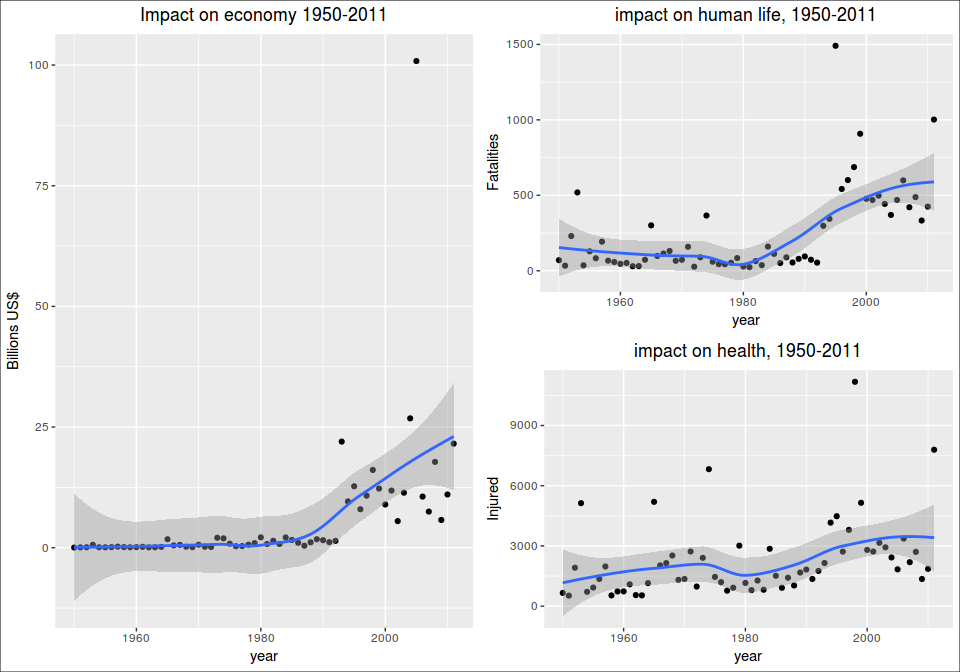

# Analysis of weather impact on people and the economy
Alfonso R. Reyes  


## Questions

1. Across the United States, which types of events (as indicated in the EVTYPE variable) are most harmful with respect to population health?

2. Across the United States, which types of events have the greatest economic consequences?

## Synopsis
<ten sentences>
weather impact on the economy: property and crops.
Does not take into account other effects such as defferred revenue, no income,
Years recorded from 1950 till 2011.
Investigate how much is the impact of the weather
Impact on the popuplation: fatalities, injured.
For the 1st question we will use the variables: EVTYPE, FATALITIES and INJURIES.
For the 2nd question, we will use the variables: EVTYPE, PROPDMG, CROPDMG, PROPDMGEXP and CROPDMGEXP.
Other analysis can later be performed such as if the weather effects have been improving or worsening, what states have suffered the largest impact, what counties have the highest economic loss, etc.


## Data Processing
The data processing consists in the following steps:

1. Download the raw data file from the internet theme(axis.text.x = element_text(angle = 30, hjust = 1))using the `download.file` function.
2. Unpack the downloaded file (535+ MB) with the function `bunzip` into a CSV file named as `dataset.csv`.
3. Load the CSV file in the object `stormdata.raw`: 902,297 observations and 37 variables.
4. Perform a quick analysis of the dataset `stormdata.raw` before applying data transformations.
5. Create a simplified dataset `stormdata` where some non-relevant variables have been removed but all observations kept. 902,297 observations and 13 variables.
6. Create a small dataset `stormdata.small` with only 12 variables and all observations still in place. The variable `BGN_DATE` converted to date type and renamed to `DATE`. The size of this file `stormdata.small.rda` is around 6 MB.
7. Clear the object `stormdata.raw` to save memory. Use only the new and smaller data frame `stormdata`
8. Create the data frames to respond the first question.
9. Create the data frame to respond to the second question.
10. Save an additional dataset to address other questions in the future.


```r
library(dplyr)
library(ggplot2)
library(gridExtra)
library(grid)
library(stringr)
library(rprojroot)
library(R.utils)
library(lubridate)
```

### Set up project folders with `rprojroot` package

```r
# package rprojroot required
root <- rprojroot::is_rstudio_project
root_file <- root$make_fix_file()
# root$find_file("REAME.md")
root_file()
cat("Setting up the project folders:\n")
project.data <- root_file("data")
project.extdata <- root_file("inst/extdata")
project.R <- root_file("R")

project.data
project.extdata
project.R
```

```
[1] "/home/superuser/git.projects/RR-PeerAsmnt2-NOAA_Storm"
Setting up the project folders:
[1] "/home/superuser/git.projects/RR-PeerAsmnt2-NOAA_Storm/data"
[1] "/home/superuser/git.projects/RR-PeerAsmnt2-NOAA_Storm/inst/extdata"
[1] "/home/superuser/git.projects/RR-PeerAsmnt2-NOAA_Storm/R"
```


### Downloading the data
We found a problem while trying to download the data file from the internet. The `bunzip2` format is not properly managed by the `download.file` function. So, we have to add a new function `bunzip2` from the package `R.utils` to download and unpack the compresed file. Of course, this could have been done by using the `read.csv` function to read the data file directly but that would be a "one-off" operation. To make the function `downloadZip` reusable for the future we used `bunzip2`. There is a flag in the function that allows the selection of that particular compression format.


```r
downloadZip <- function(fileUrl, outDir="./data", bzip2 = FALSE) {
  # function to download zipped and bunzip2 files and unpack
  temp <- tempfile()
  download.file(fileUrl, temp, mode = "wb")
  if (bzip2 == FALSE) {
    unzip(temp, exdir = outDir)
  }
  else {
    destfile <- paste(outDir, "dataset.csv", sep = "/")  # provide a filename
    bunzip2(temp, destname = destfile, overwrite = TRUE) # unpack bunzip2 file
  }
}
```


```r
# URL of the dataset file
fileUrl <- "https://d396qusza40orc.cloudfront.net/repdata%2Fdata%2FStormData.csv.bz2"
cat("Unpacking the raw data file:\n")
```

```
Unpacking the raw data file:
```

```r
outDir <- project.extdata             # folder for raw data
downloadZip(fileUrl, outDir = outDir, bzip2 = TRUE)   # download and unpack file
```


```r
# read the CSV file to memory
dataFile <- paste(project.extdata, "dataset.csv", sep = "/")
stormdata.raw <- read.csv(dataFile)
# stormdata <- stormdata.raw          # for the moment we will use a shorter name
```

### How our raw data look?

```r
# properties of the dataset
dims <- dim(stormdata.raw)
```

There are 902297 observations and 37 variables.

The names of the variables are:

```r
names(stormdata.raw)
```

```
 [1] "STATE__"    "BGN_DATE"   "BGN_TIME"   "TIME_ZONE"  "COUNTY"    
 [6] "COUNTYNAME" "STATE"      "EVTYPE"     "BGN_RANGE"  "BGN_AZI"   
[11] "BGN_LOCATI" "END_DATE"   "END_TIME"   "COUNTY_END" "COUNTYENDN"
[16] "END_RANGE"  "END_AZI"    "END_LOCATI" "LENGTH"     "WIDTH"     
[21] "F"          "MAG"        "FATALITIES" "INJURIES"   "PROPDMG"   
[26] "PROPDMGEXP" "CROPDMG"    "CROPDMGEXP" "WFO"        "STATEOFFIC"
[31] "ZONENAMES"  "LATITUDE"   "LONGITUDE"  "LATITUDE_E" "LONGITUDE_"
[36] "REMARKS"    "REFNUM"    
```


```r
as_data_frame(stormdata.raw)
```

```
# A tibble: 902,297 × 37
   STATE__           BGN_DATE BGN_TIME TIME_ZONE COUNTY COUNTYNAME  STATE
     <dbl>             <fctr>   <fctr>    <fctr>  <dbl>     <fctr> <fctr>
1        1  4/18/1950 0:00:00     0130       CST     97     MOBILE     AL
2        1  4/18/1950 0:00:00     0145       CST      3    BALDWIN     AL
3        1  2/20/1951 0:00:00     1600       CST     57    FAYETTE     AL
4        1   6/8/1951 0:00:00     0900       CST     89    MADISON     AL
5        1 11/15/1951 0:00:00     1500       CST     43    CULLMAN     AL
6        1 11/15/1951 0:00:00     2000       CST     77 LAUDERDALE     AL
7        1 11/16/1951 0:00:00     0100       CST      9     BLOUNT     AL
8        1  1/22/1952 0:00:00     0900       CST    123 TALLAPOOSA     AL
9        1  2/13/1952 0:00:00     2000       CST    125 TUSCALOOSA     AL
10       1  2/13/1952 0:00:00     2000       CST     57    FAYETTE     AL
# ... with 902,287 more rows, and 30 more variables: EVTYPE <fctr>,
#   BGN_RANGE <dbl>, BGN_AZI <fctr>, BGN_LOCATI <fctr>, END_DATE <fctr>,
#   END_TIME <fctr>, COUNTY_END <dbl>, COUNTYENDN <lgl>, END_RANGE <dbl>,
#   END_AZI <fctr>, END_LOCATI <fctr>, LENGTH <dbl>, WIDTH <dbl>, F <int>,
#   MAG <dbl>, FATALITIES <dbl>, INJURIES <dbl>, PROPDMG <dbl>,
#   PROPDMGEXP <fctr>, CROPDMG <dbl>, CROPDMGEXP <fctr>, WFO <fctr>,
#   STATEOFFIC <fctr>, ZONENAMES <fctr>, LATITUDE <dbl>, LONGITUDE <dbl>,
#   LATITUDE_E <dbl>, LONGITUDE_ <dbl>, REMARKS <fctr>, REFNUM <dbl>
```


### What variables do we keep for our analysis?

These are the variable that we consider important for the analysis:

        REFNUM, BGN_DATE, STATE, COUNTY, COUNTYNAME, EVTYPE, 
        FATALITIES, INJURIES, PROPDMG, PROPDMGEXP, CROPDMG, CROPDMGEXP, REMARKS

### Clean up the dataset
We will transform the variable `BGN_DATE` from a factor to a date variable. We will later use it for our summaries. We will also take out some variables that are not relevant to our study.


```r
# read the raw data from original source and load to object stormdata
# stormdata will be cleaned up, some variables converted and some corrections made.
stormdata <- stormdata.raw %>%
  select(REFNUM, BGN_DATE, STATE, COUNTY, COUNTYNAME, EVTYPE, 
         FATALITIES, INJURIES, PROPDMG, PROPDMGEXP, CROPDMG, CROPDMGEXP, REMARKS) %>%
  # convert BGN_DATE to date format
  mutate(DATE = mdy_hms(as.character(BGN_DATE))) %>%    # convert to date
  select(REFNUM, DATE, STATE, COUNTY, COUNTYNAME, EVTYPE, 
         FATALITIES, INJURIES, PROPDMG, PROPDMGEXP, CROPDMG, CROPDMGEXP, REMARKS) %>%
  # convert *EXP to uppercase and remove trailing spaces
  mutate(PROPDMGEXP = as.factor(toupper(str_trim(PROPDMGEXP))),      # clean the string
         CROPDMGEXP = as.factor(toupper(str_trim(CROPDMGEXP)))) %>%
  mutate(REMARKS = as.character(REMARKS))
  
# rm(stormdata.raw)     # release big dataset
# save(stormdata, file = paste(project.data, "stormdata.rda", sep = "/"))
```


We have an observation ID with the variable `REFNUM`. We check if all its values are unique:

```r
# REFNUM is the record id of the observation and is unique.
length(unique(stormdata$REFNUM))
range(unique(stormdata$REFNUM))
```

```
[1] 902297
[1]      1 902297
```


There is a typo in one of the observations in the California flood 2005/2006. We noticed this while plotting the economic impact of the weather events. This code below will filter the event that started on Christmas 2005 and persisted around 2006 New Year.

We are saving the correction in `stormdata.rda`. So, if the reader wants to reproduce the error, it wil be necessary to load the data from scratch, starting with downloading the file from the original source. The code above wll reproduce the steps necessary. To see the observation with the typo (it was writen "B" instead of "M" in the variable `PROPDMGEXP`), it corresponds to observation 605943 as identified by the variable `REFNUM`.


```r
# floods in California from Xmas 2005 to around New Year 2006
# one record improperly entered as Billions instead of millions REFNUM=605943
ca.flood <- stormdata %>%
  filter(DATE >= "2005-12-25" & DATE <= "2006-01-02" & STATE == "CA" & PROPDMG > 0) %>%
  arrange(DATE) %>%
  select(REFNUM, DATE, STATE, PROPDMG, PROPDMGEXP, CROPDMG, CROPDMGEXP, REMARKS)

as_data_frame(ca.flood)
```

```
# A tibble: 59 × 8
   REFNUM       DATE  STATE PROPDMG PROPDMGEXP CROPDMG CROPDMGEXP
    <dbl>     <dttm> <fctr>   <dbl>     <fctr>   <dbl>     <fctr>
1  567175 2005-12-26     CA    20.0          K       0           
2  567179 2005-12-28     CA    55.9          M       0           
3  567180 2005-12-28     CA    10.0          K       0           
4  567184 2005-12-29     CA    60.8          M       8          M
5  567185 2005-12-29     CA     5.0          K       0           
6  567186 2005-12-30     CA     5.0          K       0           
7  567187 2005-12-30     CA     5.0          K       0           
8  567193 2005-12-30     CA     1.0          M       0           
9  567197 2005-12-31     CA     1.0          M       0           
10 567198 2005-12-31     CA     1.0          M       0           
# ... with 49 more rows, and 1 more variables: REMARKS <chr>
```


Event occurring in January 2006 (id=605943) has been improperly recorded as economic losses of 150 Billion US dollars. After some research we found that the numbers are more in the 300 million dollars range. See paper USGS _____.

Replace the "B" of billions by "M" (millons):

```r
stormdata[stormdata$REFNUM==605943, c("PROPDMGEXP")] <- "M"
stormdata[stormdata$REFNUM==605943, c("PROPDMGEXP")]
```

```
[1] M
Levels:  - ? + 0 1 2 3 4 5 6 7 8 B H K M
```


Add a new comment on correction to the `REMARKS` variable:

```r
# Get the remark if stormdata.raw was loaded
remarks.605943 <- stormdata[stormdata$REFNUM==605943, c("REMARKS")]
remarks.605943
```

```
[1] "Major flooding continued into the early hours of January 1st, before the Napa River finally fell below flood stage and the water receeded. Flooding was severe in Downtown Napa from the Napa Creek and the City and Parks Department was hit with $6 million in damage alone. The City of Napa had 600 homes with moderate damage, 150 damaged businesses with costs of at least $70 million."
```

```r
text.was <- "Major flooding continued into the early hours of January 1st, before the Napa River finally fell below flood stage and the water receeded. Flooding was severe in Downtown Napa from the Napa Creek and the City and Parks Department was hit with $6 million in damage alone. The City of Napa had 600 homes with moderate damage, 150 damaged businesses with costs of at least $70 million."

# this is the new remark
remarks.605943 <- paste("Correct typo in property damage from 'B' (biilion) to 'M' (million).", text.was, sep = "| ")

# impute the new remark
stormdata[stormdata$REFNUM==605943, c("REMARKS")] <- remarks.605943

# save stormdata after corrections
save(stormdata, file = paste(project.data, "stormdata.rda", sep = "/"))
```


This is a view of the data frame that we will use in our analysis.

```r
as_data_frame(stormdata)
```

```
# A tibble: 902,297 × 13
   REFNUM       DATE  STATE COUNTY COUNTYNAME  EVTYPE FATALITIES INJURIES
    <dbl>     <dttm> <fctr>  <dbl>     <fctr>  <fctr>      <dbl>    <dbl>
1       1 1950-04-18     AL     97     MOBILE TORNADO          0       15
2       2 1950-04-18     AL      3    BALDWIN TORNADO          0        0
3       3 1951-02-20     AL     57    FAYETTE TORNADO          0        2
4       4 1951-06-08     AL     89    MADISON TORNADO          0        2
5       5 1951-11-15     AL     43    CULLMAN TORNADO          0        2
6       6 1951-11-15     AL     77 LAUDERDALE TORNADO          0        6
7       7 1951-11-16     AL      9     BLOUNT TORNADO          0        1
8       8 1952-01-22     AL    123 TALLAPOOSA TORNADO          0        0
9       9 1952-02-13     AL    125 TUSCALOOSA TORNADO          1       14
10     10 1952-02-13     AL     57    FAYETTE TORNADO          0        0
# ... with 902,287 more rows, and 5 more variables: PROPDMG <dbl>,
#   PROPDMGEXP <fctr>, CROPDMG <dbl>, CROPDMGEXP <fctr>, REMARKS <chr>
```


```r
load(paste(project.data, "stormdata.rda", sep = "/"))  # load the data
```

Create a small data frame without the `REMARKS` variable.

```r
stormdata.small <- stormdata %>% 
  select(REFNUM, DATE, STATE, COUNTY, COUNTYNAME, EVTYPE,     # reorder
         FATALITIES, INJURIES, PROPDMG, PROPDMGEXP, CROPDMG, CROPDMGEXP) 

as_data_frame(stormdata.small)
```

```
# A tibble: 902,297 × 12
   REFNUM       DATE  STATE COUNTY COUNTYNAME  EVTYPE FATALITIES INJURIES
    <dbl>     <dttm> <fctr>  <dbl>     <fctr>  <fctr>      <dbl>    <dbl>
1       1 1950-04-18     AL     97     MOBILE TORNADO          0       15
2       2 1950-04-18     AL      3    BALDWIN TORNADO          0        0
3       3 1951-02-20     AL     57    FAYETTE TORNADO          0        2
4       4 1951-06-08     AL     89    MADISON TORNADO          0        2
5       5 1951-11-15     AL     43    CULLMAN TORNADO          0        2
6       6 1951-11-15     AL     77 LAUDERDALE TORNADO          0        6
7       7 1951-11-16     AL      9     BLOUNT TORNADO          0        1
8       8 1952-01-22     AL    123 TALLAPOOSA TORNADO          0        0
9       9 1952-02-13     AL    125 TUSCALOOSA TORNADO          1       14
10     10 1952-02-13     AL     57    FAYETTE TORNADO          0        0
# ... with 902,287 more rows, and 4 more variables: PROPDMG <dbl>,
#   PROPDMGEXP <fctr>, CROPDMG <dbl>, CROPDMGEXP <fctr>
```

## Other questions
### what is the worst weather event in 2005?

```r
# what is the worst weather event in 2005?
worst <- stormdata.small %>%
  select(REFNUM, DATE, STATE, EVTYPE, PROPDMG, PROPDMGEXP) %>%
  arrange(desc(PROPDMG))

worst
```

```
       REFNUM       DATE STATE                         EVTYPE PROPDMG
1      778558 2009-07-26    NC              THUNDERSTORM WIND 5000.00
2      808182 2010-05-13    IL                    FLASH FLOOD 5000.00
3      808183 2010-05-13    IL                    FLASH FLOOD 5000.00
4      900646 2011-10-29    AM                     WATERSPOUT 5000.00
5      791393 2009-12-25    PR                      LANDSLIDE 4800.00
6      750915 2009-03-28    TN                        TORNADO 4410.00
7      762379 2009-05-12    OK              THUNDERSTORM WIND 3500.00
8      815064 2010-06-24    CT              THUNDERSTORM WIND 3200.00
9      749008 2009-02-11    IL                      HIGH WIND 3000.00
10     755010 2009-04-29    IN                          FLOOD 3000.00
11     881000 2011-06-20    KY                    FLASH FLOOD 3000.00
12     848581 2011-03-24    CA                      LANDSLIDE 1584.00
13     789393 2009-11-05    AK                  COASTAL FLOOD 1000.00
14     811934 2010-06-02    NC                      LIGHTNING 1000.00
15     815187 2010-06-05    IL                        TORNADO 1000.00
16     821163 2010-07-23    IL                    FLASH FLOOD 1000.00
17     823161 2010-07-22    IL                    FLASH FLOOD 1000.00
18     823245 2010-07-23    IL                    FLASH FLOOD 1000.00
19     844639 2011-02-25    NC                    STRONG WIND 1000.00
20     848498 2011-03-22    KS                       WILDFIRE 1000.00
21     878621 2011-06-20    KY                          FLOOD 1000.00
22     900958 2011-11-16    SC                        TORNADO 1000.00
23     621511 2006-04-01    MN                          FLOOD  996.00
24     631931 2006-02-17    OH                      HIGH WIND  995.00
25     376192 1999-08-31    TX                      TSTM WIND  990.00
26     656090 2007-02-24    IA                      ICE STORM  989.00
27     449455 2002-05-12    AK                          FLOOD  988.00
28     488842 2003-10-29    CO                      HIGH WIND  979.00
29     365994 1999-09-16    NY                          FLOOD  975.00
30     469452 2002-08-14    NY                      TSTM WIND  975.00
31     482669 2002-06-22    WI                          FLOOD  975.00
32     631336 2006-04-01    ND                          FLOOD  975.00
33     890501 2011-08-13    IN              THUNDERSTORM WIND  975.00
34     899199 2011-09-08    TX                       WILDFIRE  975.00
35     585974 2005-12-31    NV                          FLOOD  973.00
36     861470 2011-05-25    TN              THUNDERSTORM WIND  973.00
37     471206 2002-03-09    OH                      HIGH WIND  971.00
38     340339 1998-01-15    TN                   WINTER STORM  970.00
39     713553 2008-06-12    MI                    FLASH FLOOD  970.00
40     777598 2009-07-24    IA                           HAIL  970.00
41     477146 2002-11-10    TN                        TORNADO  968.00
42     779935 2009-07-24    IA                           HAIL  964.00
43     360053 1999-05-02    MI               WILD/FOREST FIRE  960.00
44     393046 2000-05-09    MI                      TSTM WIND  960.00
45     561392 2004-05-14    WI                          FLOOD  960.00
46     573126 2005-05-13    IA                          FLOOD  960.00
47     690725 2008-03-15    AL                        TORNADO  960.00
48     710351 2008-09-14    KY                      HIGH WIND  957.00
49     430754 2001-11-28    MS                          FLOOD  955.00
50     508031 2003-05-06    NC                    FLASH FLOOD  954.00
51     837742 2010-12-14    ME                          FLOOD  954.00
52     570373 2005-12-15    GA                      ICE STORM  952.50
53     346907 1998-06-18    WI                      TSTM WIND  950.00
54     347127 1998-06-27    WI                      TSTM WIND  950.00
55     350443 1999-02-11    CA                      HIGH WIND  950.00
56     400004 2000-12-12    NY                      HIGH WIND  950.00
57     437948 2001-12-28    OH                     HEAVY SNOW  950.00
58     507163 2003-02-04    NY                      HIGH WIND  950.00
59     530178 2004-09-07    GA                          FLOOD  950.00
60     576466 2005-01-07    KY                          FLOOD  950.00
61     632560 2006-06-22    OH                      TSTM WIND  950.00
62     674538 2007-01-06    OH                          FLOOD  950.00
63     796785 2010-03-10    AR                        TORNADO  950.00
64     852793 2011-04-05    NC              THUNDERSTORM WIND  950.00
65     892863 2011-08-06    WV                    FLASH FLOOD  950.00
66     894640 2011-08-17    HI                       WILDFIRE  950.00
67     585998 2005-04-03    NH                          FLOOD  945.00
68     283150 1997-09-24    CA               WILD/FOREST FIRE  940.00
69     718387 2008-06-04    MO                          FLOOD  940.00
70     421259 2001-10-24    IN                        TORNADO  936.00
71     489550 2003-06-21    FL                          FLOOD  935.00
72     537065 2004-07-24    KS                    FLASH FLOOD  935.00
73     830534 2010-08-13    WI                    FLASH FLOOD  934.30
74     368641 1999-04-23    OK                          FLOOD  932.00
75     621520 2006-04-01    MN                          FLOOD  932.00
76     656483 2007-05-06    IA                          FLOOD  932.00
77     656497 2007-05-06    IA                          FLOOD  932.00
78     569397 2005-02-21    GA                           HAIL  930.00
79     598237 2005-08-14    TX                          FLOOD  930.00
80     529307 2004-08-13    FL                      HIGH WIND  929.00
81     388430 2000-12-18    IA                       BLIZZARD  925.00
82     529562 2004-01-25    GA                      ICE STORM  925.00
83     589548 2005-01-01    OH                          FLOOD  925.00
84     365997 1999-09-16    NY                          FLOOD  920.00
85     525190 2004-09-16    AL                      HIGH WIND  920.00
86     800697 2010-04-24    MS                        TORNADO  920.00
87     863533 2011-05-25    IL                        TORNADO  920.00
88     302115 1997-07-23    SC                        TORNADO  917.00
89     561609 2004-06-23    WI                        TORNADO  915.00
90     833347 2010-09-23    MN                          FLOOD  915.00
91     864466 2011-05-22    WI                        TORNADO  915.00
92     866668 2011-05-22    WI                        TORNADO  915.00
93     346809 1998-05-31    WI                      TSTM WIND  914.00
94     368259 1999-03-08    OK                        TORNADO  910.00
95     590233 2005-08-30    OH                          FLOOD  910.00
96     762930 2009-05-22    AK                          FLOOD  901.60
97     187604 1995-03-20    AL                      DENSE FOG  900.00
98     230472 1995-07-16    PA             THUNDERSTORM WINDS  900.00
99     244258 1995-06-22    VA                    FLASH FLOOD  900.00
100    245275 1995-06-28    VA                    FLASH FLOOD  900.00
101    259445 1996-02-01    LA                      ICE STORM  900.00
102    261250 1996-05-19    MN                      TSTM WIND  900.00
103    266762 1996-11-08    NY                    FLASH FLOOD  900.00
104    267899 1996-09-05    NC                      HIGH WIND  900.00
105    278360 1996-01-19    VA                    FLASH FLOOD  900.00
106    279685 1996-05-16    WV                    FLASH FLOOD  900.00
107    280089 1996-05-19    WI                      TSTM WIND  900.00
108    299799 1997-05-25    OK                        TORNADO  900.00
109    305456 1997-05-27    TX                        TORNADO  900.00
110    314127 1998-02-17    FL                      TSTM WIND  900.00
111    319886 1998-06-21    IA                          FLOOD  900.00
112    320055 1998-06-28    IA                          FLOOD  900.00
113    320193 1998-07-06    IA                          FLOOD  900.00
114    322449 1998-02-03    KY                     HEAVY SNOW  900.00
115    339965 1998-05-30    SD                        TORNADO  900.00
116    344464 1998-02-21    UT                   WINTER STORM  900.00
117    344532 1998-07-22    UT                    FLASH FLOOD  900.00
118    359747 1999-09-16    MD                 TROPICAL STORM  900.00
119    365987 1999-09-16    NY                          FLOOD  900.00
120    378240 1999-06-13    WI                          FLOOD  900.00
121    379345 2000-03-10    AL                      TSTM WIND  900.00
122    395519 2000-04-20    MO                      TSTM WIND  900.00
123    405103 2000-11-21    PA                     HEAVY SNOW  900.00
124    411810 2000-08-23    WA                      LIGHTNING  900.00
125    411902 2000-02-18    WV                    FLASH FLOOD  900.00
126    418522 2001-09-14    FL                          FLOOD  900.00
127    440616 2001-09-24    PA                        TORNADO  900.00
128    446717 2001-08-12    WA               WILD/FOREST FIRE  900.00
129    450997 2002-11-25    CA                      HIGH WIND  900.00
130    468906 2002-01-31    NY                     HEAVY SNOW  900.00
131    507571 2003-11-13    NY                      HIGH WIND  900.00
132    509782 2003-06-12    OH                          FLOOD  900.00
133    510395 2003-07-27    OH                          FLOOD  900.00
134    513376 2003-07-21    PA                    FLASH FLOOD  900.00
135    525323 2004-11-24    AL                        TORNADO  900.00
136    525507 2004-08-01    AK                       WILDFIRE  900.00
137    529317 2004-08-13    FL                 TROPICAL STORM  900.00
138    539594 2004-07-12    MD                    FLASH FLOOD  900.00
139    546489 2004-09-18    NJ                          FLOOD  900.00
140    552112 2004-01-14    PA                   WINTER STORM  900.00
141    552179 2004-03-16    PA                     HEAVY SNOW  900.00
142    557259 2004-06-01    TX                      TSTM WIND  900.00
143    561080 2004-07-26    WV                    FLASH FLOOD  900.00
144    564736 2005-07-10    AL                 TROPICAL STORM  900.00
145    578122 2005-03-08    MA                      HIGH WIND  900.00
146    583869 2005-06-20    MT                           HAIL  900.00
147    593648 2005-12-15    SC                      ICE STORM  900.00
148    595076 2005-04-22    TN                      TSTM WIND  900.00
149    600017 2005-08-29    WV                    FLASH FLOOD  900.00
150    605953 2006-01-01    CA                          FLOOD  900.00
151    623458 2006-03-09    MO                        TORNADO  900.00
152    623810 2006-03-12    MO                           HAIL  900.00
153    627826 2006-02-12    NJ                  COASTAL FLOOD  900.00
154    630753 2006-07-13    NC                      TSTM WIND  900.00
155    639606 2006-04-06    TX                       WILDFIRE  900.00
156    643820 2006-04-07    WV                      TSTM WIND  900.00
157    644023 2006-07-13    WV                    FLASH FLOOD  900.00
158    645264 2006-10-04    WI                           HAIL  900.00
159    664155 2007-03-19    MN                          FLOOD  900.00
160    670383 2007-04-16    NH                          FLOOD  900.00
161    714654 2008-06-06    MN                    FLASH FLOOD  900.00
162    717449 2008-03-18    MO                          FLOOD  900.00
163    742474 2008-06-04    WV                          FLOOD  900.00
164    743356 2008-06-08    WI                          FLOOD  900.00
165    746012 2008-12-09    GU               STORM SURGE/TIDE  900.00
166    746625 2009-01-07    WA                          FLOOD  900.00
167    756048 2009-04-10    GA                        TORNADO  900.00
168    756397 2009-04-10    GA                           HAIL  900.00
169    756490 2009-04-23    GA                           HAIL  900.00
170    777599 2009-07-24    IA                           HAIL  900.00
171    784735 2009-08-17    OK              THUNDERSTORM WIND  900.00
172    794904 2010-02-25    ME                          FLOOD  900.00
173    822870 2010-07-28    FL              THUNDERSTORM WIND  900.00
174    832236 2010-09-24    WI                          FLOOD  900.00
175    834635 2010-10-05    AZ                           HAIL  900.00
176    836374 2010-11-30    MS                        TORNADO  900.00
177    836727 2010-11-29    MS                        TORNADO  900.00
178    844718 2011-02-01    IL                   WINTER STORM  900.00
179    851107 2011-04-05    SC              THUNDERSTORM WIND  900.00
180    856585 2011-04-25    NC                      LIGHTNING  900.00
181    857041 2011-04-27    MS                        TORNADO  900.00
182    857206 2011-04-04    MS              THUNDERSTORM WIND  900.00
183    858940 2011-04-16    TX                       WILDFIRE  900.00
184    859117 2011-04-27    MS                        TORNADO  900.00
185    859630 2011-04-27    MS                        TORNADO  900.00
186    891234 2011-08-28    NH                          FLOOD  900.00
187    216246 1995-05-28    NE                          FLOOD  897.00
188    820502 2010-07-27    KY                    FLASH FLOOD  892.00
189    355749 1999-03-17    IA                      HIGH WIND  890.00
190    656088 2007-02-24    IA                      ICE STORM  890.00
191    447228 2001-04-06    WI                          FLOOD  888.00
192    848077 2011-03-26    GA                           HAIL  888.00
193    631326 2006-04-01    ND                          FLOOD  887.00
194    312417 1998-02-06    CA                          FLOOD  880.00
195    470052 2002-07-02    NC                      LIGHTNING  880.00
196    517978 2003-05-14    TX                           HAIL  880.00
197    561525 2004-06-11    WI                          FLOOD  876.00
198    346823 1998-05-31    WI                      TSTM WIND  875.00
199    398931 2000-12-12    NJ                      HIGH WIND  875.00
200    651767 2007-07-04    FL                      LIGHTNING  875.00
201    797399 2010-03-10    AR                        TORNADO  875.00
202    801360 2010-04-30    MO                        TORNADO  875.00
203    377294 1999-09-16    VA                          FLOOD  870.00
204    598649 2005-11-27    TX                       WILDFIRE  870.00
205    567036 2005-09-28    CA                       WILDFIRE  868.50
206    798457 2010-04-05    IL                           HAIL  868.00
207    858846 2011-04-27    AL                        TORNADO  865.00
208    807375 2010-05-12    IA                    FLASH FLOOD  859.00
209    848491 2011-03-25    CA                      LANDSLIDE  855.00
210    203547 1995-05-23    KS                          FLOOD  850.00
211    253503 1996-12-27    FL                            FOG  850.00
212    257086 1996-05-26    KS                        TORNADO  850.00
213    268069 1996-05-16    ND                      TSTM WIND  850.00
214    306050 1997-06-13    TX                      TSTM WIND  850.00
215    314416 1998-03-21    FL           URBAN/SML STREAM FLD  850.00
216    322147 1998-09-27    KS                      TSTM WIND  850.00
217    366000 1999-09-16    NY                          FLOOD  850.00
218    395260 2000-03-08    MO               WILD/FOREST FIRE  850.00
219    402679 2000-11-21    OH                     HEAVY SNOW  850.00
220    411449 2000-08-08    VA                    FLASH FLOOD  850.00
221    411896 2000-02-18    WV                    FLASH FLOOD  850.00
222    412675 2000-06-13    WI                    FLASH FLOOD  850.00
223    440666 2001-12-28    PA                     HEAVY SNOW  850.00
224    472132 2002-11-10    OH                        TORNADO  850.00
225    472193 2002-11-10    OH                        TORNADO  850.00
226    507514 2003-09-19    NY                      HIGH WIND  850.00
227    519378 2003-08-11    TX                      TSTM WIND  850.00
228    550048 2004-08-28    OH                    FLASH FLOOD  850.00
229    552250 2004-05-10    PA                           HAIL  850.00
230    560555 2004-09-17    VA                        TORNADO  850.00
231    579027 2005-01-21    MN                      HIGH WIND  850.00
232    623896 2006-03-12    MO                        TORNADO  850.00
233    631343 2006-04-18    ND                   WINTER STORM  850.00
234    696466 2008-05-29    FL                       WILDFIRE  850.00
235    743311 2008-06-08    WI                          FLOOD  850.00
236    762597 2009-05-06    AL                        TORNADO  850.00
237    762892 2009-05-06    AR                    FLASH FLOOD  850.00
238    776995 2009-07-30    AR                        TORNADO  850.00
239    832371 2010-09-23    MN                          FLOOD  850.00
240    836574 2010-11-29    MS                        TORNADO  850.00
241    844619 2011-02-01    CT                   WINTER STORM  850.00
242    893980 2011-08-28    PA                          FLOOD  850.00
243    894657 2011-08-28    PA                          FLOOD  850.00
244    898068 2011-09-05    NC                        TORNADO  850.00
245    347060 1998-06-25    WI                        TORNADO  845.00
246    416396 2001-07-06    CA                      LIGHTNING  840.00
247    450572 2002-01-03    CA                            FOG  830.00
248    325371 1998-07-21    MI                      TSTM WIND  825.00
249    411913 2000-02-19    WV                          FLOOD  825.00
250    422216 2001-06-12    IA                          FLOOD  825.00
251    550097 2004-09-17    OH                          FLOOD  825.00
252    578110 2005-01-23    MA                    STORM SURGE  825.00
253    589606 2005-03-01    OH                   WINTER STORM  825.00
254    748572 2009-02-18    GA                        TORNADO  825.00
255    808921 2010-05-18    MI                       WILDFIRE  825.00
256    487971 2003-09-05    CA                       WILDFIRE  824.00
257    684652 2007-07-16    TX                    FLASH FLOOD  823.00
258    462076 2002-01-30    MI                      ICE STORM  820.00
259    437423 2001-04-12    OH                      HIGH WIND  815.00
260    753618 2009-03-23    MN                      ICE STORM  815.00
261    760550 2009-05-11    NC              THUNDERSTORM WIND  813.00
262    216710 1995-04-12    NV                     HEAVY SNOW  810.00
263    321653 1998-06-27    KS                        TORNADO  810.00
264    487753 2003-07-03    CA                       WILDFIRE  810.00
265    682316 2007-04-21    TX                        TORNADO  810.00
266    777597 2009-07-24    IA                           HAIL  810.00
267    487990 2003-10-01    CA                       WILDFIRE  806.77
268    195603 1995-06-05    FL                        TORNADO  800.00
269    205415 1995-05-18    KY                        TORNADO  800.00
270    216875 1995-11-12    NH         RIVER AND STREAM FLOOD  800.00
271    216882 1995-10-21    NH                    RIVER FLOOD  800.00
272    222347 1995-07-15    OH                    FLASH FLOOD  800.00
273    223381 1995-12-19    OH                       BLIZZARD  800.00
274    223804 1995-06-27    OH                    FLASH FLOOD  800.00
275    230476 1995-07-17    PA              FLOOD/FLASH FLOOD  800.00
276    232486 1995-11-07    SC                        TORNADO  800.00
277    244282 1995-06-28    VA                    FLASH FLOOD  800.00
278    245253 1995-06-27    VA              FLOOD/FLASH FLOOD  800.00
279    245792 1995-06-27    VA              FLOOD/FLASH FLOOD  800.00
280    248845 1996-03-06    AL                        TORNADO  800.00
281    252200 1996-08-08    CO                    FLASH FLOOD  800.00
282    254030 1996-01-25    HI                    FLASH FLOOD  800.00
283    256064 1996-05-09    IA                      TSTM WIND  800.00
284    256600 1996-04-27    KS                      TSTM WIND  800.00
285    260651 1996-04-19    MI                          FLOOD  800.00
286    260661 1996-04-20    MI                          FLOOD  800.00
287    260805 1996-06-22    MI                    FLASH FLOOD  800.00
288    261244 1996-05-19    MN                      TSTM WIND  800.00
289    264879 1996-07-27    NE                           HAIL  800.00
290    271827 1996-04-12    PA                      TSTM WIND  800.00
291    273370 1996-07-12    SC                      HURRICANE  800.00
292    275382 1996-04-19    TX                           HAIL  800.00
293    278383 1996-01-19    VA                          FLOOD  800.00
294    279672 1996-05-16    WV                    FLASH FLOOD  800.00
295    280030 1996-04-19    WI                      TSTM WIND  800.00
296    280088 1996-05-19    WI                      TSTM WIND  800.00
297    285346 1997-12-13    FL                    RIVER FLOOD  800.00
298    290046 1997-03-01    KY                    FLASH FLOOD  800.00
299    295806 1997-08-21    NE                           HAIL  800.00
300    298513 1997-03-01    OH                    FLASH FLOOD  800.00
301    301481 1997-08-15    PA                        TORNADO  800.00
302    303985 1997-02-20    TX                        TORNADO  800.00
303    305774 1997-06-06    TX                          FLOOD  800.00
304    306878 1997-08-10    TX                      TSTM WIND  800.00
305    308192 1997-08-14    WA               WILD/FOREST FIRE  800.00
306    309891 1998-03-08    AL                          FLOOD  800.00
307    310020 1998-04-08    AL                        TORNADO  800.00
308    314372 1998-03-09    FL                        TORNADO  800.00
309    317240 1998-04-13    IL                        TORNADO  800.00
310    318530 1998-06-11    IN                        TORNADO  800.00
311    318531 1998-06-11    IN                        TORNADO  800.00
312    319789 1998-06-18    IA                        TORNADO  800.00
313    320109 1998-06-29    IA                      TSTM WIND  800.00
314    325387 1998-08-06    MI                          FLOOD  800.00
315    329824 1998-05-29    NE                      TSTM WIND  800.00
316    331859 1998-05-31    NY                        TORNADO  800.00
317    332947 1998-05-07    NC                        TORNADO  800.00
318    337271 1998-10-04    OK                        TORNADO  800.00
319    345137 1998-03-20    VA                        TORNADO  800.00
320    345182 1998-04-01    VA                        TORNADO  800.00
321    346180 1998-06-16    WV                           HAIL  800.00
322    347827 1998-10-28    PR                    FLASH FLOOD  800.00
323    347967 1999-02-27    AL                      TSTM WIND  800.00
324    349436 1999-03-05    AR                           HAIL  800.00
325    354433 1999-01-22    IL                        TORNADO  800.00
326    355796 1999-04-08    IA                        TORNADO  800.00
327    356944 1999-05-16    KS                           HAIL  800.00
328    356948 1999-05-16    KS                           HAIL  800.00
329    359658 1999-08-14    MD                        TORNADO  800.00
330    361861 1999-04-14    MS                        TORNADO  800.00
331    367248 1999-07-27    ND                        TORNADO  800.00
332    368785 1999-05-03    OK                           HAIL  800.00
333    390377 2000-01-03    KY                    FLASH FLOOD  800.00
334    391696 2000-04-23    LA                        TORNADO  800.00
335    396250 2000-08-19    MO                      TSTM WIND  800.00
336    404056 2000-09-08    OK               WILD/FOREST FIRE  800.00
337    408324 2000-04-02    TX                      TSTM WIND  800.00
338    414501 2001-06-26    AK               WILD/FOREST FIRE  800.00
339    414269 2001-11-24    AL                        TORNADO  800.00
340    414271 2001-11-24    AL                        TORNADO  800.00
341    414294 2001-11-24    AL                        TORNADO  800.00
342    414309 2001-11-24    AL                        TORNADO  800.00
343    416468 2001-08-17    CA               WILD/FOREST FIRE  800.00
344    426326 2001-08-04    KY                    FLASH FLOOD  800.00
345    428184 2001-06-12    MI                      LIGHTNING  800.00
346    441000 2001-07-06    SC                        TORNADO  800.00
347    446790 2001-12-13    WA                      HIGH WIND  800.00
348    447421 2001-06-11    WI                      TSTM WIND  800.00
349    451067 2002-12-16    CA                      HIGH WIND  800.00
350    455428 2002-04-28    IN                        TORNADO  800.00
351    457875 2002-05-07    KS                        TORNADO  800.00
352    463361 2002-06-25    MN                    FLASH FLOOD  800.00
353    465486 2002-05-12    MO                    FLASH FLOOD  800.00
354    467504 2002-07-06    NE                    FLASH FLOOD  800.00
355    472167 2002-11-10    OH                        TORNADO  800.00
356    479389 2002-07-06    TX                          FLOOD  800.00
357    479390 2002-07-06    TX                    FLASH FLOOD  800.00
358    479531 2002-07-27    TX                      TSTM WIND  800.00
359    482205 2002-07-19    WV                    FLASH FLOOD  800.00
360    485336 2003-05-02    AL                      TSTM WIND  800.00
361    487741 2003-06-26    CA                       WILDFIRE  800.00
362    489037 2003-08-30    DE                      LIGHTNING  800.00
363    494609 2003-06-10    IA                      HIGH WIND  800.00
364    506547 2003-02-17    NJ                    STRONG WIND  800.00
365    510544 2003-08-21    OH                      TSTM WIND  800.00
366    513761 2003-11-12    PA                      HIGH WIND  800.00
367    518469 2003-06-03    TX                           HAIL  800.00
368    520292 2003-02-16    VA                    FLASH FLOOD  800.00
369    521413 2003-10-20    WA                     HEAVY RAIN  800.00
370    521417 2003-10-20    WA                     HEAVY RAIN  800.00
371    531905 2004-07-13    IL                      TSTM WIND  800.00
372    539197 2004-11-23    LA                        TORNADO  800.00
373    545048 2004-05-22    NE                      TSTM WIND  800.00
374    550087 2004-09-08    OH                    FLASH FLOOD  800.00
375    552130 2004-01-27    PA                   WINTER STORM  800.00
376    553534 2004-08-12    SC                        TORNADO  800.00
377    555747 2004-10-18    TN                        TORNADO  800.00
378    555996 2004-03-04    TX                        TORNADO  800.00
379    556607 2004-04-23    TX                           HAIL  800.00
380    557734 2004-06-09    TX                    FLASH FLOOD  800.00
381    559841 2004-07-12    VT                    FLASH FLOOD  800.00
382    565273 2005-11-18    AK                     HEAVY RAIN  800.00
383    566440 2005-01-08    CA         ASTRONOMICAL HIGH TIDE  800.00
384    566677 2005-03-20    CA                        TORNADO  800.00
385    570250 2005-08-29    GA                      TSTM WIND  800.00
386    571887 2005-01-05    IN                          FLOOD  800.00
387    573850 2005-11-12    IA                        TORNADO  800.00
388    576394 2005-11-27    KS                        TORNADO  800.00
389    577364 2005-04-22    LA                      TSTM WIND  800.00
390    580487 2005-09-21    MN                           HAIL  800.00
391    580793 2005-03-22    MS                        TORNADO  800.00
392    581218 2005-04-22    MS                           HAIL  800.00
393    581622 2005-09-24    MS                        TORNADO  800.00
394    581675 2005-09-25    MS                    FLASH FLOOD  800.00
395    587912 2005-01-14    NC                    FLASH FLOOD  800.00
396    591800 2005-12-27    OK                       WILDFIRE  800.00
397    592025 2005-01-01    PA                          FLOOD  800.00
398    600859 2005-08-18    WI                        TORNADO  800.00
399    602802 2005-02-20    PR                       WILDFIRE  800.00
400    603659 2006-04-22    AL                      LIGHTNING  800.00
401    604767 2006-01-08    AR                       WILDFIRE  800.00
402    611947 2006-09-22    IL                        TORNADO  800.00
403    618850 2006-09-23    KY                    FLASH FLOOD  800.00
404    622528 2006-03-09    MS                      TSTM WIND  800.00
405    623839 2006-03-12    MO                        TORNADO  800.00
406    623992 2006-03-13    MO                        TORNADO  800.00
407    624022 2006-03-30    MO                        TORNADO  800.00
408    643461 2006-01-05    WA                     HEAVY RAIN  800.00
409    649076 2007-10-03    AR                    FLASH FLOOD  800.00
410    652918 2007-07-20    GA                      LIGHTNING  800.00
411    654590 2007-08-23    IL              THUNDERSTORM WIND  800.00
412    661833 2007-04-16    ME                          FLOOD  800.00
413    670382 2007-04-16    NH                          FLOOD  800.00
414    676644 2007-08-19    OK                    FLASH FLOOD  800.00
415    684628 2007-07-14    TX                    FLASH FLOOD  800.00
416    691891 2008-07-30    AK                  COASTAL FLOOD  800.00
417    693792 2008-09-01    AR                 TROPICAL STORM  800.00
418    694122 2008-01-25    CA                    FLASH FLOOD  800.00
419    697513 2008-03-15    GA                           HAIL  800.00
420    698344 2008-07-22    GA                           HAIL  800.00
421    699431 2008-03-18    IL                          FLOOD  800.00
422    703915 2008-06-05    IA                          FLOOD  800.00
423    711112 2008-09-01    LA                 TROPICAL STORM  800.00
424    715701 2008-01-29    MS                      HIGH WIND  800.00
425    716979 2008-12-09    MS                        TORNADO  800.00
426    727674 2008-07-19    ND                           HAIL  800.00
427    731881 2008-03-07    PA                   WINTER STORM  800.00
428    739229 2008-07-24    TX                        TORNADO  800.00
429    742124 2008-11-12    WA                     HEAVY RAIN  800.00
430    742975 2008-04-25    WI                    FLASH FLOOD  800.00
431    743301 2008-06-07    WI                          FLOOD  800.00
432    743313 2008-06-08    WI                          FLOOD  800.00
433    751408 2009-03-26    MS                        TORNADO  800.00
434    767812 2009-06-14    NM              THUNDERSTORM WIND  800.00
435    776764 2009-07-29    NJ                        TORNADO  800.00
436    784962 2009-09-21    TX              THUNDERSTORM WIND  800.00
437    789913 2009-12-25    PR                    FLASH FLOOD  800.00
438    791675 2009-12-18    WV                     HEAVY SNOW  800.00
439    792271 2010-01-25    PA                    FLASH FLOOD  800.00
440    805853 2010-05-02    MS                    FLASH FLOOD  800.00
441    806262 2010-05-02    TN                          FLOOD  800.00
442    812067 2010-06-07    ID                    FLASH FLOOD  800.00
443    815312 2010-06-17    ND                    FLASH FLOOD  800.00
444    819075 2010-07-14    WI                        TORNADO  800.00
445    821689 2010-07-19    WY                           HAIL  800.00
446    827958 2010-08-19    MS                    FLASH FLOOD  800.00
447    830475 2010-08-30    NE              THUNDERSTORM WIND  800.00
448    838290 2010-12-19    UT                          FLOOD  800.00
449    837807 2010-12-01    PA                          FLOOD  800.00
450    840266 2011-01-02    CA                          FLOOD  800.00
451    843600 2011-02-24    MS                        TORNADO  800.00
452    845522 2011-02-01    IL                      ICE STORM  800.00
453    855711 2011-04-25    AR                        TORNADO  800.00
454    855731 2011-04-16    NC                        TORNADO  800.00
455    856156 2011-04-01    SD                          FLOOD  800.00
456    856743 2011-04-15    MS                        TORNADO  800.00
457    856857 2011-04-27    NY                    FLASH FLOOD  800.00
458    857038 2011-04-26    TX              THUNDERSTORM WIND  800.00
459    858529 2011-04-28    NY                      HIGH WIND  800.00
460    862766 2011-05-29    TX                       WILDFIRE  800.00
461    864327 2011-05-29    TX                       WILDFIRE  800.00
462    868992 2011-05-01    MO                          FLOOD  800.00
463    885644 2011-07-10    ND                        TORNADO  800.00
464    888328 2011-07-11    WI              THUNDERSTORM WIND  800.00
465    889383 2011-08-13    IL                           HAIL  800.00
466    891237 2011-08-28    NH                          FLOOD  800.00
467    895309 2011-08-27    NC                 TROPICAL STORM  800.00
468    896302 2011-08-31    TX                       WILDFIRE  800.00
469    896929 2011-09-07    PA                          FLOOD  800.00
470    897433 2011-09-07    PA                          FLOOD  800.00
471    897496 2011-09-07    PA                          FLOOD  800.00
472    898564 2011-09-07    NY                          FLOOD  800.00
473    899585 2011-09-07    PA                          FLOOD  800.00
474    267880 1996-09-04    NC                      HURRICANE  792.15
475    413397 2000-11-01    WY                       BLIZZARD  787.00
476    441146 2001-04-07    SD                          FLOOD  785.00
477    617362 2006-12-29    KS                   WINTER STORM  785.00
478    273371 1996-07-12    SC                      HURRICANE  780.00
479    462106 2002-03-09    MI                      HIGH WIND  780.00
480    521900 2003-09-18    WV                      HIGH WIND  780.00
481    697735 2008-05-11    GA              THUNDERSTORM WIND  780.00
482    416449 2001-08-01    CA               WILD/FOREST FIRE  777.80
483    691979 2008-01-27    AZ                          FLOOD  777.00
484    321289 1998-06-13    KS                      TSTM WIND  775.00
485    473998 2002-04-28    PA                        TORNADO  775.00
486    560435 2004-08-12    VA                        TORNADO  775.00
487    610866 2006-04-16    IL                      TSTM WIND  775.00
488    653243 2007-08-24    GA                      LIGHTNING  775.00
489    675491 2007-01-01    OK                        DROUGHT  775.00
490    863306 2011-05-26    GA                           HAIL  775.00
491    307868 1997-07-04    VA                      TSTM WIND  770.00
492    481906 2002-07-07    WA                      TSTM WIND  770.00
493    777699 2009-07-24    IA                           HAIL  770.00
494    853204 2011-04-16    NC                        TORNADO  767.00
495    324061 1998-10-10    ME                COASTAL EROSION  766.00
496    454587 2002-05-01    IL                          FLOOD  762.00
497    437937 2001-10-25    OH                      HIGH WIND  760.00
498    643678 2006-11-04    WA                          FLOOD  760.00
499    790923 2009-12-09    VA                      HIGH WIND  760.00
500    530276 2004-09-27    GA                    STRONG WIND  758.25
501    355137 1999-08-18    IL                           HAIL  758.00
502    393070 2000-05-09    MI                      TSTM WIND  755.00
503    656087 2007-02-24    IA                   WINTER STORM  755.00
504    867872 2011-05-01    AR                          FLOOD  752.00
505    202666 1995-05-16    KS                           HAIL  750.00
506    203901 1995-04-16    KS                           HAIL  750.00
507    203981 1995-05-16    KS                    FLASH FLOOD  750.00
508    204418 1995-05-23    KS                          FLOOD  750.00
509    207303 1995-05-08    LA             THUNDERSTORM WINDS  750.00
510    212979 1995-04-16    MO                           HAIL  750.00
511    220995 1995-08-27    NC                 FLASH FLOODING  750.00
512    239877 1995-05-18    TX                        TORNADO  750.00
513    239878 1995-05-18    TX                        TORNADO  750.00
514    244714 1995-01-14    VA              FLOOD/FLASH FLOOD  750.00
515    256025 1996-04-25    IA                      HIGH WIND  750.00
516    260287 1996-09-06    MD                    STORM SURGE  750.00
517    260328 1996-11-08    MD                        TORNADO  750.00
518    261721 1996-10-26    MN                        TORNADO  750.00
519    262415 1996-01-18    MO                        TORNADO  750.00
520    264081 1996-01-31    NE                   EXTREME COLD  750.00
521    265050 1996-08-10    NE                        TORNADO  750.00
522    268278 1996-08-03    ND                        TORNADO  750.00
523    268362 1996-01-02    OH                   WINTER STORM  750.00
524    268748 1996-05-16    OH                    FLASH FLOOD  750.00
525    268971 1996-06-23    OH                    FLASH FLOOD  750.00
526    269981 1996-04-21    OK                        TORNADO  750.00
527    272863 1996-08-24    RI                      TSTM WIND  750.00
528    273655 1996-05-31    SD                        TORNADO  750.00
529    274922 1996-01-17    TX                        TORNADO  750.00
530    274923 1996-01-17    TX                        TORNADO  750.00
531    276588 1996-06-10    TX                      LIGHTNING  750.00
532    279908 1996-09-06    WV                    FLASH FLOOD  750.00
533    282297 1997-03-01    AR                        TORNADO  750.00
534    282139 1997-09-14    AZ                      TSTM WIND  750.00
535    283151 1997-09-24    CA               WILD/FOREST FIRE  750.00
536    285357 1997-12-13    FL                          FLOOD  750.00
537    285476 1997-03-13    GA                        TORNADO  750.00
538    287445 1997-03-28    IN                        TORNADO  750.00
539    287774 1997-01-15    IA              EXTREME WINDCHILL  750.00
540    287791 1997-02-18    IA                          FLOOD  750.00
541    289939 1997-03-01    KY                    FLASH FLOOD  750.00
542    291703 1997-01-24    MI                     HEAVY SNOW  750.00
543    292212 1997-07-26    MI                      LIGHTNING  750.00
544    294524 1997-07-23    MO                      TSTM WIND  750.00
545    295141 1997-02-19    NE                          FLOOD  750.00
546    295275 1997-06-11    NE                        TORNADO  750.00
547    295455 1997-06-21    NE                           HAIL  750.00
548    296712 1997-08-17    NM                      TSTM WIND  750.00
549    298514 1997-03-01    OH                    FLASH FLOOD  750.00
550    298526 1997-03-02    OH                    FLASH FLOOD  750.00
551    298531 1997-03-02    OH                          FLOOD  750.00
552    308088 1997-03-15    WA                     HEAVY RAIN  750.00
553    312122 1998-11-10    AR                        TORNADO  750.00
554    314392 1998-03-19    FL                    RIVER FLOOD  750.00
555    315093 1998-08-14    FL                      LIGHTNING  750.00
556    314304 1998-03-01    FL                    RIVER FLOOD  750.00
557    315288 1998-09-29    FL                    FLASH FLOOD  750.00
558    316747 1998-09-29    GA                        TORNADO  750.00
559    319631 1998-05-30    IA                           HAIL  750.00
560    323521 1998-02-22    LA                      TSTM WIND  750.00
561    329534 1998-05-15    NE                        TORNADO  750.00
562    331556 1998-02-05    NY                  COASTAL FLOOD  750.00
563    334471 1998-05-19    OH                      LIGHTNING  750.00
564    334676 1998-06-02    OH                           HAIL  750.00
565    335066 1998-06-27    OH                      TSTM WIND  750.00
566    335337 1998-07-21    OH                      TSTM WIND  750.00
567    340704 1998-04-16    TN                        TORNADO  750.00
568    341065 1998-06-09    TN                           HAIL  750.00
569    341856 1998-02-10    TX                        TORNADO  750.00
570    346201 1998-06-16    WV                           HAIL  750.00
571    346320 1998-06-28    WV                    FLASH FLOOD  750.00
572    346344 1998-06-28    WV                    FLASH FLOOD  750.00
573    348178 1999-05-13    AL                      TSTM WIND  750.00
574    348555 1999-02-03    AK                         SEICHE  750.00
575    352933 1999-08-14    FL                      TSTM WIND  750.00
576    354800 1999-06-01    IL                        TORNADO  750.00
577    355186 1999-01-21    IN                          FLOOD  750.00
578    355970 1999-05-16    IA                    FLASH FLOOD  750.00
579    356375 1999-07-19    IA                    FLASH FLOOD  750.00
580    356741 1999-05-03    KS                        TORNADO  750.00
581    357380 1999-06-04    KS                        TORNADO  750.00
582    359002 1999-03-13    LA                    FLASH FLOOD  750.00
583    361365 1999-08-09    MN                           HAIL  750.00
584    362398 1999-04-08    MO                        TORNADO  750.00
585    363659 1999-05-03    NE                        TORNADO  750.00
586    364032 1999-06-05    NE                        TORNADO  750.00
587    364949 1999-01-18    NJ                      HIGH WIND  750.00
588    372793 1999-01-17    TN                        TORNADO  750.00
589    373000 1999-04-03    TN                      TSTM WIND  750.00
590    373580 1999-01-01    TX                        TORNADO  750.00
591    374754 1999-05-11    TX                        TORNADO  750.00
592    382458 2000-07-05    CO                        TORNADO  750.00
593    383139 2000-02-13    FL                        TORNADO  750.00
594    383147 2000-02-23    FL               WILD/FOREST FIRE  750.00
595    384156 2000-12-16    FL                        TORNADO  750.00
596    385028 2000-12-16    GA                        TORNADO  750.00
597    385274 2000-08-10    ID               WILD/FOREST FIRE  750.00
598    385488 2000-04-20    IL                      TSTM WIND  750.00
599    390509 2000-02-18    KY                    FLASH FLOOD  750.00
600    391702 2000-04-23    LA                        TORNADO  750.00
601    391726 2000-04-23    LA                        TORNADO  750.00
602    392628 2000-08-07    MD                      LIGHTNING  750.00
603    393536 2000-09-10    MI                     HEAVY RAIN  750.00
604    397491 2000-05-17    NE                        TORNADO  750.00
605    399856 2000-08-09    NY                    FLASH FLOOD  750.00
606    404063 2000-09-19    OK               WILD/FOREST FIRE  750.00
607    404498 2000-05-10    PA                    FLASH FLOOD  750.00
608    405705 2000-09-18    SC                    FLASH FLOOD  750.00
609    407696 2000-03-07    TX                      HIGH WIND  750.00
610    418335 2001-08-06    FL                          FLOOD  750.00
611    418499 2001-09-14    FL                          FLOOD  750.00
612    418558 2001-10-13    FL                        TORNADO  750.00
613    421229 2001-10-24    IN                        TORNADO  750.00
614    423355 2001-04-11    KS                      HIGH WIND  750.00
615    426561 2001-11-24    KY                        TORNADO  750.00
616    428512 2001-10-24    MI                        TORNADO  750.00
617    428547 2001-10-24    MI                        TORNADO  750.00
618    430402 2001-06-11    MS                    FLASH FLOOD  750.00
619    432223 2001-11-23    MO                        TORNADO  750.00
620    432421 2001-06-03    MT                     HEAVY SNOW  750.00
621    442955 2001-02-16    TX                      LIGHTNING  750.00
622    443329 2001-04-10    TX                        TORNADO  750.00
623    444965 2001-08-31    TX                    FLASH FLOOD  750.00
624    445372 2001-10-12    TX                        TORNADO  750.00
625    447735 2001-07-18    WI                      LIGHTNING  750.00
626    450517 2002-12-18    AR                      TSTM WIND  750.00
627    450904 2002-08-27    CA               WILD/FOREST FIRE  750.00
628    451066 2002-12-16    CA                      HIGH WIND  750.00
629    453885 2002-12-24    GA                        TORNADO  750.00
630    454477 2002-04-24    IL                           HAIL  750.00
631    454505 2002-04-24    IL                           HAIL  750.00
632    454511 2002-04-24    IL                           HAIL  750.00
633    460161 2002-04-28    KY                        TORNADO  750.00
634    461272 2002-10-29    LA                        TORNADO  750.00
635    463422 2002-06-25    MN                      TSTM WIND  750.00
636    469038 2002-05-29    NY                    FLASH FLOOD  750.00
637    469645 2002-03-16    NC                      TSTM WIND  750.00
638    471228 2002-03-20    OH                          FLOOD  750.00
639    471670 2002-06-05    OH                    FLASH FLOOD  750.00
640    472181 2002-11-10    OH                        TORNADO  750.00
641    473947 2002-04-28    PA                        TORNADO  750.00
642    473972 2002-04-28    PA                        TORNADO  750.00
643    475124 2002-10-11    SC                        TORNADO  750.00
644    476411 2002-04-28    TN                        TORNADO  750.00
645    477023 2002-11-09    TN                        TORNADO  750.00
646    481074 2002-04-28    VA                        TORNADO  750.00
647    481664 2002-07-25    VA                    FLASH FLOOD  750.00
648    483063 2002-09-02    WI                        TORNADO  750.00
649    487754 2003-07-03    CA                       WILDFIRE  750.00
650    488117 2003-12-25    CA                    FLASH FLOOD  750.00
651    490146 2003-03-20    GA                        TORNADO  750.00
652    504747 2003-03-12    MT                          FLOOD  750.00
653    507431 2003-08-09    NY                    FLASH FLOOD  750.00
654    507433 2003-08-09    NY                    FLASH FLOOD  750.00
655    507438 2003-08-09    NY                    FLASH FLOOD  750.00
656    507463 2003-08-11    NY                    FLASH FLOOD  750.00
657    508228 2003-05-31    NC                      TSTM WIND  750.00
658    509185 2003-07-02    ND                      TSTM WIND  750.00
659    509977 2003-07-07    OH                          FLOOD  750.00
660    510345 2003-07-21    OH                    FLASH FLOOD  750.00
661    510398 2003-07-27    OH                    FLASH FLOOD  750.00
662    510466 2003-08-04    OH                    FLASH FLOOD  750.00
663    511799 2003-05-16    OK                      TSTM WIND  750.00
664    515988 2003-05-04    TN                        TORNADO  750.00
665    516011 2003-05-04    TN                        TORNADO  750.00
666    517267 2003-04-05    TX                           HAIL  750.00
667    519730 2003-10-05    TX                        TORNADO  750.00
668    521497 2003-02-14    WV                     HEAVY SNOW  750.00
669    529018 2004-06-26    FL                      LIGHTNING  750.00
670    532867 2004-07-17    IN                          FLOOD  750.00
671    538715 2004-12-22    KY                      ICE STORM  750.00
672    539216 2004-11-24    LA                        TORNADO  750.00
673    549486 2004-05-21    OH                      TSTM WIND  750.00
674    549494 2004-05-21    OH                    FLASH FLOOD  750.00
675    549405 2004-05-21    OH                    FLASH FLOOD  750.00
676    549477 2004-05-21    OH                      TSTM WIND  750.00
677    549514 2004-05-21    OH                    FLASH FLOOD  750.00
678    549556 2004-05-22    OH                    FLASH FLOOD  750.00
679    549557 2004-05-22    OH                    FLASH FLOOD  750.00
680    551679 2004-08-10    OK                      TSTM WIND  750.00
681    552488 2004-06-14    PA                      TSTM WIND  750.00
682    553369 2004-06-27    SC                      LIGHTNING  750.00
683    556037 2004-03-04    TX                      TSTM WIND  750.00
684    557847 2004-06-12    TX                      TSTM WIND  750.00
685    560536 2004-09-17    VA                        TORNADO  750.00
686    560970 2004-05-27    WV                    FLASH FLOOD  750.00
687    564137 2005-03-22    AL                        TORNADO  750.00
688    568746 2005-04-01    FL                          FLOOD  750.00
689    569201 2005-08-28    FL                    STORM SURGE  750.00
690    570104 2005-07-11    GA                    FLASH FLOOD  750.00
691    570152 2005-07-28    GA                      LIGHTNING  750.00
692    570200 2005-08-13    GA                      LIGHTNING  750.00
693    570248 2005-08-29    GA                        TORNADO  750.00
694    570366 2005-12-05    GA                        TORNADO  750.00
695    572779 2005-11-06    IN                      TSTM WIND  750.00
696    573852 2005-11-12    IA                        TORNADO  750.00
697    575356 2005-06-29    KS                      TSTM WIND  750.00
698    576820 2005-06-28    KY                      LIGHTNING  750.00
699    583472 2005-11-12    MO                        TORNADO  750.00
700    583492 2005-11-15    MO                    FLASH FLOOD  750.00
701    585629 2005-08-17    NE                      TSTM WIND  750.00
702    587770 2005-11-06    NY                      HIGH WIND  750.00
703    588846 2005-06-07    ND                    FLASH FLOOD  750.00
704    590250 2005-09-22    OH                      TSTM WIND  750.00
705    590097 2005-07-26    OH                      TSTM WIND  750.00
706    592396 2005-06-06    PA                      LIGHTNING  750.00
707    604127 2006-11-15    AL                        TORNADO  750.00
708    604616 2006-07-31    AZ                    FLASH FLOOD  750.00
709    604958 2006-03-12    AR                      TSTM WIND  750.00
710    608431 2006-01-02    GA                        TORNADO  750.00
711    613628 2006-10-02    IN                      LIGHTNING  750.00
712    615445 2006-04-06    KS                        TORNADO  750.00
713    618943 2006-02-02    LA                        TORNADO  750.00
714    621191 2006-07-28    MI                           HAIL  750.00
715    623315 2006-11-15    MS                        TORNADO  750.00
716    623662 2006-03-12    MO                           HAIL  750.00
717    625579 2006-09-23    MO                          FLOOD  750.00
718    627402 2006-12-30    NE                   WINTER STORM  750.00
719    627604 2006-05-13    NH                          FLOOD  750.00
720    628098 2006-09-15    NJ                    FLASH FLOOD  750.00
721    629281 2006-10-12    NY               LAKE-EFFECT SNOW  750.00
722    629536 2006-01-14    NC                        TORNADO  750.00
723    632424 2006-06-21    OH                    FLASH FLOOD  750.00
724    632566 2006-06-22    OH                        TORNADO  750.00
725    632817 2006-07-27    OH                    FLASH FLOOD  750.00
726    633212 2006-03-12    OK                        TORNADO  750.00
727    635554 2006-07-31    PA                    FLASH FLOOD  750.00
728    639316 2006-01-02    TX                       WILDFIRE  750.00
729    640626 2006-05-10    TX                      TSTM WIND  750.00
730    641733 2006-10-16    TX                    FLASH FLOOD  750.00
731    641986 2006-12-29    TX                        TORNADO  750.00
732    643341 2006-10-07    VA                    FLASH FLOOD  750.00
733    643752 2006-12-14    WA                    FLASH FLOOD  750.00
734    644041 2006-07-18    WV                           HAIL  750.00
735    647449 2007-04-14    AL                        TORNADO  750.00
736    647845 2007-10-22    AL                        TORNADO  750.00
737    649073 2007-09-26    AR                    FLASH FLOOD  750.00
738    651013 2007-04-15    CT                          FLOOD  750.00
739    652329 2007-03-02    GA                        TORNADO  750.00
740    652911 2007-07-20    GA              THUNDERSTORM WIND  750.00
741    653326 2007-12-15    GA                        TORNADO  750.00
742    654369 2007-07-09    IL                    FLASH FLOOD  750.00
743    656466 2007-05-06    IA                           HAIL  750.00
744    656839 2007-06-22    IA                    FLASH FLOOD  750.00
745    658633 2007-05-06    KS                          FLOOD  750.00
746    658701 2007-05-07    KS                          FLOOD  750.00
747    665085 2007-08-19    MN                          FLOOD  750.00
748    665840 2007-06-19    MS                    FLASH FLOOD  750.00
749    666379 2007-03-01    MO                        TORNADO  750.00
750    666825 2007-05-07    MO                          FLOOD  750.00
751    670991 2007-07-29    NJ              THUNDERSTORM WIND  750.00
752    673150 2007-06-12    NC                      LIGHTNING  750.00
753    678280 2007-08-17    PA                           HAIL  750.00
754    684221 2007-06-26    TX                          FLOOD  750.00
755    684259 2007-06-27    TX                          FLOOD  750.00
756    684502 2007-07-06    TX                    FLASH FLOOD  750.00
757    684878 2007-08-16    TX                    FLASH FLOOD  750.00
758    685746 2007-07-11    VT                    FLASH FLOOD  750.00
759    685752 2007-07-11    VT                    FLASH FLOOD  750.00
760    685760 2007-07-27    VT                      LIGHTNING  750.00
761    687088 2007-10-18    WA                      HIGH WIND  750.00
762    687142 2007-12-03    WA                      LANDSLIDE  750.00
763    687251 2007-04-15    WV                          FLOOD  750.00
764    687254 2007-04-15    WV                          FLOOD  750.00
765    688411 2007-08-19    WI                    FLASH FLOOD  750.00
766    688413 2007-08-19    WI                    FLASH FLOOD  750.00
767    693866 2008-09-13    AR                 TROPICAL STORM  750.00
768    696241 2008-02-17    FL                        TORNADO  750.00
769    696251 2008-02-21    FL                          FLOOD  750.00
770    696328 2008-03-07    FL                        TORNADO  750.00
771    697728 2008-05-11    GA                        TORNADO  750.00
772    697928 2008-05-24    GA              THUNDERSTORM WIND  750.00
773    698576 2008-08-26    GA                        TORNADO  750.00
774    699428 2008-03-18    IL                          FLOOD  750.00
775    701377 2008-01-29    IN              THUNDERSTORM WIND  750.00
776    701442 2008-02-05    IN                          FLOOD  750.00
777    704187 2008-06-08    IA                          FLOOD  750.00
778    703697 2008-05-30    IA                        TORNADO  750.00
779    703774 2008-06-01    IA                          FLOOD  750.00
780    704143 2008-06-07    IA                          FLOOD  750.00
781    704175 2008-06-08    IA                    FLASH FLOOD  750.00
782    704183 2008-06-08    IA                          FLOOD  750.00
783    704198 2008-06-08    IA                          FLOOD  750.00
784    706179 2008-04-24    KS                        TORNADO  750.00
785    706709 2008-05-22    KS                        TORNADO  750.00
786    706799 2008-05-23    KS                        TORNADO  750.00
787    710656 2008-03-30    LA                        TORNADO  750.00
788    711127 2008-09-01    LA                 TROPICAL STORM  750.00
789    711207 2008-12-09    LA                        TORNADO  750.00
790    713253 2008-04-24    MI                       WILDFIRE  750.00
791    713462 2008-06-08    MI              THUNDERSTORM WIND  750.00
792    713557 2008-06-12    MI                    FLASH FLOOD  750.00
793    714006 2008-09-13    MI                          FLOOD  750.00
794    714020 2008-09-14    MI                          FLOOD  750.00
795    714691 2008-06-07    MN                    FLASH FLOOD  750.00
796    714698 2008-06-08    MN                          FLOOD  750.00
797    715265 2008-07-29    MN              THUNDERSTORM WIND  750.00
798    717170 2008-01-08    MO                        TORNADO  750.00
799    717705 2008-04-10    MO                    FLASH FLOOD  750.00
800    720615 2008-04-23    NE                           HAIL  750.00
801    720967 2008-05-29    NE                        TORNADO  750.00
802    722764 2008-09-06    NH                    FLASH FLOOD  750.00
803    723881 2008-01-09    NY                      HIGH WIND  750.00
804    728100 2008-03-04    OH                   WINTER STORM  750.00
805    728132 2008-03-07    OH                   WINTER STORM  750.00
806    728228 2008-05-31    OH                        TORNADO  750.00
807    728295 2008-06-04    OH                          FLOOD  750.00
808    730738 2008-06-05    OK              THUNDERSTORM WIND  750.00
809    730741 2008-06-05    OK              THUNDERSTORM WIND  750.00
810    732583 2008-09-28    PA                    FLASH FLOOD  750.00
811    736856 2008-03-03    TX                        TORNADO  750.00
812    738133 2008-05-14    TX              THUNDERSTORM WIND  750.00
813    739533 2008-09-13    TX                      HURRICANE  750.00
814    739539 2008-09-13    TX                 TROPICAL STORM  750.00
815    739651 2008-12-08    TX                        TORNADO  750.00
816    740122 2008-06-14    VT                    FLASH FLOOD  750.00
817    740194 2008-08-06    VT                    FLASH FLOOD  750.00
818    742308 2008-03-04    WV                    FLASH FLOOD  750.00
819    742415 2008-06-04    WV                    FLASH FLOOD  750.00
820    743242 2008-06-07    WI                          FLOOD  750.00
821    743305 2008-06-08    WI                    FLASH FLOOD  750.00
822    743308 2008-06-08    WI                    FLASH FLOOD  750.00
823    743314 2008-06-08    WI                          FLOOD  750.00
824    743348 2008-06-08    WI                          FLOOD  750.00
825    749285 2009-02-10    TX                        TORNADO  750.00
826    747795 2009-01-27    OH                   WINTER STORM  750.00
827    747797 2009-01-27    OH                   WINTER STORM  750.00
828    749523 2009-02-11    AR              THUNDERSTORM WIND  750.00
829    750291 2009-02-11    OH                      HIGH WIND  750.00
830    751772 2009-03-28    MS                    FLASH FLOOD  750.00
831    754224 2009-04-28    TX                    FLASH FLOOD  750.00
832    755471 2009-04-09    TX                        TORNADO  750.00
833    757070 2009-04-02    GA                          FLOOD  750.00
834    757452 2009-04-28    TX                    FLASH FLOOD  750.00
835    761681 2009-05-08    MO              THUNDERSTORM WIND  750.00
836    765060 2009-06-14    KS              THUNDERSTORM WIND  750.00
837    765110 2009-06-12    CO                           HAIL  750.00
838    768367 2009-06-11    TX                      LIGHTNING  750.00
839    768912 2009-06-11    TX                    FLASH FLOOD  750.00
840    769881 2009-06-15    KS              THUNDERSTORM WIND  750.00
841    771152 2009-06-26    CT                        TORNADO  750.00
842    774366 2009-07-23    VA                    FLASH FLOOD  750.00
843    775788 2009-07-01    FL                      LIGHTNING  750.00
844    777190 2009-07-10    IA              THUNDERSTORM WIND  750.00
845    778741 2009-07-30    MS                        TORNADO  750.00
846    784599 2009-08-21    TX                      LIGHTNING  750.00
847    787502 2009-10-03    CA                       WILDFIRE  750.00
848    789228 2009-11-01    LA                          FLOOD  750.00
849    789451 2009-12-24    AR                    FLASH FLOOD  750.00
850    789480 2009-12-24    AR                          FLOOD  750.00
851    790194 2009-12-18    WV                     HEAVY SNOW  750.00
852    790231 2009-12-24    AR                    FLASH FLOOD  750.00
853    790874 2009-12-09    PA                      HIGH WIND  750.00
854    791557 2009-12-09    PA                      HIGH WIND  750.00
855    791668 2009-12-09    OH                      HIGH WIND  750.00
856    792330 2010-01-20    TX                        TORNADO  750.00
857    793288 2010-01-20    CA                      HIGH WIND  750.00
858    794117 2010-01-03    OH               LAKE-EFFECT SNOW  750.00
859    796925 2010-03-28    NC                        TORNADO  750.00
860    799265 2010-04-05    IL              THUNDERSTORM WIND  750.00
861    800524 2010-04-30    MO                        TORNADO  750.00
862    801332 2010-04-25    SC                        TORNADO  750.00
863    806260 2010-05-02    KY                          FLOOD  750.00
864    805765 2010-05-14    MD                           HAIL  750.00
865    807456 2010-05-01    AR                    FLASH FLOOD  750.00
866    808063 2010-05-02    MS                    FLASH FLOOD  750.00
867    808151 2010-05-02    MS                    FLASH FLOOD  750.00
868    808488 2010-05-13    OK                        TORNADO  750.00
869    808516 2010-05-01    MS                    FLASH FLOOD  750.00
870    808837 2010-05-02    KY                          FLOOD  750.00
871    814972 2010-06-21    IL              THUNDERSTORM WIND  750.00
872    815446 2010-06-24    NM                    FLASH FLOOD  750.00
873    816467 2010-06-05    IL                        TORNADO  750.00
874    817468 2010-06-23    IN              THUNDERSTORM WIND  750.00
875    817681 2010-06-21    SD              THUNDERSTORM WIND  750.00
876    818184 2010-06-16    SD                        TORNADO  750.00
877    820166 2010-07-23    IA                        TORNADO  750.00
878    820585 2010-07-13    ND                           HAIL  750.00
879    825371 2010-07-13    ND                           HAIL  750.00
880    827380 2010-08-18    LA                    FLASH FLOOD  750.00
881    829085 2010-08-13    MN                        TORNADO  750.00
882    831111 2010-09-08    TX                    FLASH FLOOD  750.00
883    831405 2010-09-16    OH                        TORNADO  750.00
884    832225 2010-09-08    TX                        TORNADO  750.00
885    834108 2010-10-23    TX              THUNDERSTORM WIND  750.00
886    834329 2010-10-01    PA                          FLOOD  750.00
887    836292 2010-11-29    LA                        TORNADO  750.00
888    837817 2010-12-31    MO                        TORNADO  750.00
889    838018 2010-12-22    NV                    FLASH FLOOD  750.00
890    842131 2011-02-28    OH                          FLOOD  750.00
891    842595 2011-02-28    OH                          FLOOD  750.00
892    842718 2011-02-28    OH                          FLOOD  750.00
893    842901 2011-02-28    OH                          FLOOD  750.00
894    843448 2011-02-24    LA                        TORNADO  750.00
895    848043 2011-03-31    FL                        TORNADO  750.00
896    849130 2011-04-05    GA              THUNDERSTORM WIND  750.00
897    851247 2011-04-27    MS                        TORNADO  750.00
898    851642 2011-04-19    IN              THUNDERSTORM WIND  750.00
899    852069 2011-04-27    MO                           HAIL  750.00
900    854786 2011-04-28    NY                    FLASH FLOOD  750.00
901    855174 2011-04-26    AR                          FLOOD  750.00
902    855762 2011-04-27    VT                          FLOOD  750.00
903    857005 2011-04-26    VT                          FLOOD  750.00
904    857775 2011-04-27    TN                        TORNADO  750.00
905    857897 2011-04-26    AR                          FLOOD  750.00
906    858786 2011-04-27    GA                        TORNADO  750.00
907    858860 2011-04-28    GA                        TORNADO  750.00
908    859526 2011-04-26    VT                    FLASH FLOOD  750.00
909    860160 2011-04-16    NJ                  COASTAL FLOOD  750.00
910    860179 2011-04-27    TN                        TORNADO  750.00
911    862669 2011-05-01    AR                          FLOOD  750.00
912    862678 2011-05-01    AR                          FLOOD  750.00
913    862679 2011-05-01    AR                          FLOOD  750.00
914    862720 2011-05-24    TX                        TORNADO  750.00
915    862985 2011-05-01    AR                          FLOOD  750.00
916    867678 2011-05-01    MS                          FLOOD  750.00
917    868077 2011-05-01    TN                          FLOOD  750.00
918    868078 2011-05-01    TN                          FLOOD  750.00
919    868101 2011-05-01    TN                          FLOOD  750.00
920    868407 2011-05-30    ND                        TORNADO  750.00
921    868753 2011-05-26    VT                    FLASH FLOOD  750.00
922    868765 2011-05-30    NE              THUNDERSTORM WIND  750.00
923    869196 2011-05-01    TN                          FLOOD  750.00
924    869541 2011-05-01    MS                          FLOOD  750.00
925    869575 2011-05-01    AR                          FLOOD  750.00
926    874122 2011-06-28    TX              THUNDERSTORM WIND  750.00
927    876834 2011-06-30    IL                           HAIL  750.00
928    877371 2011-06-20    NE                        TORNADO  750.00
929    878427 2011-06-09    NY                           HAIL  750.00
930    878821 2011-06-21    IL              THUNDERSTORM WIND  750.00
931    884057 2011-07-04    AZ              THUNDERSTORM WIND  750.00
932    884120 2011-07-05    AZ              THUNDERSTORM WIND  750.00
933    884496 2011-07-11    IA              THUNDERSTORM WIND  750.00
934    887476 2011-07-15    ND                        TORNADO  750.00
935    888183 2011-07-01    MN              THUNDERSTORM WIND  750.00
936    892630 2011-08-28    PA                          FLOOD  750.00
937    892760 2011-08-07    SD                           HAIL  750.00
938    896042 2011-08-28    PA                          FLOOD  750.00
939    896253 2011-08-28    VT                      HIGH WIND  750.00
940    896443 2011-08-15    TX                       WILDFIRE  750.00
941    897550 2011-09-06    NC                    FLASH FLOOD  750.00
942    898395 2011-09-14    KY                           HAIL  750.00
943    898621 2011-09-13    PR                          FLOOD  750.00
944    898773 2011-09-13    AZ                    FLASH FLOOD  750.00
945    751887 2009-03-06    ND                          FLOOD  748.00
946    583616 2005-04-09    MT                      HIGH WIND  746.00
947    331460 1998-01-08    NY                          FLOOD  745.00
948    575548 2005-07-03    KS                           HAIL  740.00
949    898837 2011-09-02    IA              THUNDERSTORM WIND  740.00
950    372113 1999-09-15    SC                      TSTM WIND  738.00
951    263597 1996-02-07    MT                          FLOOD  733.40
952    858879 2011-04-27    AL                        TORNADO  730.00
953    711293 2008-04-29    ME                          FLOOD  727.00
954    711295 2008-04-29    ME                          FLOOD  727.00
955    711285 2008-04-29    ME                          FLOOD  727.00
956    711299 2008-04-30    ME                          FLOOD  727.00
957    711305 2008-04-30    ME                          FLOOD  727.00
958    711307 2008-04-30    ME                          FLOOD  727.00
959    711308 2008-05-01    ME                          FLOOD  727.00
960    711312 2008-05-01    ME                          FLOOD  727.00
961    711313 2008-05-01    ME                          FLOOD  727.00
962    711315 2008-05-01    ME                          FLOOD  727.00
963    711316 2008-05-01    ME                          FLOOD  727.00
964    711317 2008-05-01    ME                          FLOOD  727.00
965    505799 2003-06-23    NE                    STRONG WIND  725.00
966    585976 2005-12-31    NV                          FLOOD  724.00
967    265825 1996-05-25    NM                           HAIL  720.00
968    452072 2002-01-05    FL                      TSTM WIND  720.00
969    461049 2002-06-24    LA                      TSTM WIND  720.00
970    480616 2002-01-27    UT                   WINTER STORM  720.00
971    864316 2011-05-26    NH                    FLASH FLOOD  716.00
972    761799 2009-05-06    AK                          FLOOD  715.00
973    446537 2001-08-11    VA                      LIGHTNING  713.00
974    508805 2003-08-17    NC                      LIGHTNING  710.00
975    834776 2010-10-27    NC                        TORNADO  710.00
976    559326 2004-11-21    TX                    FLASH FLOOD  706.00
977    529483 2004-09-25    FL                      HIGH WIND  702.00
978    583715 2005-06-02    MT                          FLOOD  701.00
979    195826 1995-07-18    FL                          FLOOD  700.00
980    204419 1995-05-23    KS                     HEAVY RAIN  700.00
981    207200 1995-12-17    LA             THUNDERSTORM WINDS  700.00
982    213884 1995-06-06    MO                    RIVER FLOOD  700.00
983    213901 1995-04-18    MO                     HIGH WINDS  700.00
984    216912 1995-04-05    NH                     HIGH WINDS  700.00
985    222852 1995-06-07    OH             THUNDERSTORM WINDS  700.00
986    229549 1995-06-25    PA                    FLASH FLOOD  700.00
987    248842 1996-03-06    AL                        TORNADO  700.00
988    248961 1996-03-18    AL                        TORNADO  700.00
989    254714 1996-05-03    IL                           HAIL  700.00
990    255522 1996-05-10    IN                    FLASH FLOOD  700.00
991    261838 1996-02-19    MS                        TORNADO  700.00
992    262559 1996-04-19    MO                        TORNADO  700.00
993    266612 1996-08-08    NY                    FLASH FLOOD  700.00
994    267020 1996-02-01    NC                      ICE STORM  700.00
995    272227 1996-06-22    PA                        TORNADO  700.00
996    273464 1996-09-05    SC                      HIGH WIND  700.00
997    278031 1996-11-16    TX               Coastal Flooding  700.00
998    278364 1996-01-19    VA                    FLASH FLOOD  700.00
999    279229 1996-09-06    VA                    FLASH FLOOD  700.00
1000   279770 1996-06-23    WV                    FLASH FLOOD  700.00
1001   279875 1996-07-31    WV                    FLASH FLOOD  700.00
1002   280034 1996-04-19    WI                      TSTM WIND  700.00
1003   281846 1997-10-04    AK                    STORM SURGE  700.00
1004   287342 1997-08-24    IL                      TSTM WIND  700.00
1005   293958 1997-11-21    MS                        TORNADO  700.00
1006   298208 1997-07-10    ND                      TSTM WIND  700.00
1007   301689 1997-04-01    RI                     HEAVY SNOW  700.00
1008   308250 1997-03-01    WV                    FLASH FLOOD  700.00
1009   308282 1997-03-02    WV                          FLOOD  700.00
1010   308292 1997-03-02    WV                          FLOOD  700.00
1011   312875 1998-11-07    CA                      HIGH WIND  700.00
1012   315259 1998-09-25    FL                        TORNADO  700.00
1013   316180 1998-06-05    GA                      TSTM WIND  700.00
1014   321743 1998-06-29    KS                      TSTM WIND  700.00
1015   329949 1998-06-13    NE                      TSTM WIND  700.00
1016   343925 1998-09-14    TX                      TSTM WIND  700.00
1017   343985 1998-10-02    TX                        TORNADO  700.00
1018   344518 1998-06-16    UT                      HIGH WIND  700.00
1019   358741 1999-01-02    LA                        TORNADO  700.00
1020   364295 1999-07-02    NE                        TORNADO  700.00
1021   366113 1999-03-03    NC                      HIGH WIND  700.00
1022   366675 1999-09-15    NC                        TORNADO  700.00
1023   367744 1999-07-09    OH                      TSTM WIND  700.00
1024   368683 1999-04-25    OK                          FLOOD  700.00
1025   369529 1999-06-01    OK                        TORNADO  700.00
1026   373969 1999-03-12    TX                           HAIL  700.00
1027   376435 1999-09-03    UT                        TORNADO  700.00
1028   386892 2000-06-14    IN                        TORNADO  700.00
1029   387315 2000-04-05    IA                      HIGH WIND  700.00
1030   390507 2000-02-18    KY                    FLASH FLOOD  700.00
1031   398610 2000-06-25    NH                      LIGHTNING  700.00
1032   400175 2000-04-15    NC                        TORNADO  700.00
1033   401733 2000-02-18    OH                    FLASH FLOOD  700.00
1034   409451 2000-06-04    TX                    FLASH FLOOD  700.00
1035   411912 2000-02-19    WV                          FLOOD  700.00
1036   418328 2001-08-04    FL                 TROPICAL STORM  700.00
1037   430099 2001-03-12    MS                        TORNADO  700.00
1038   431503 2001-06-03    MO                    FLASH FLOOD  700.00
1039   447502 2001-06-11    WI                        TORNADO  700.00
1040   446917 2001-05-17    WV                    FLASH FLOOD  700.00
1041   448437 2001-07-01    GU                 TROPICAL STORM  700.00
1042   465531 2002-05-12    MO                          FLOOD  700.00
1043   467178 2002-05-26    NE                           HAIL  700.00
1044   468419 2002-06-02    NJ               WILD/FOREST FIRE  700.00
1045   479896 2002-09-08    TX                    FLASH FLOOD  700.00
1046   482013 2002-04-28    WV                           HAIL  700.00
1047   482676 2002-06-22    WI                          FLOOD  700.00
1048   484826 2002-08-30    PR                    FLASH FLOOD  700.00
1049   485537 2003-05-07    AL                    FLASH FLOOD  700.00
1050   485539 2003-05-07    AL                    FLASH FLOOD  700.00
1051   486210 2003-07-25    AZ                      TSTM WIND  700.00
1052   486933 2003-05-16    AR                      TSTM WIND  700.00
1053   494579 2003-05-30    IA                      HIGH WIND  700.00
1054   510244 2003-07-10    OH                    FLASH FLOOD  700.00
1055   513736 2003-10-15    PA                      HIGH WIND  700.00
1056   519237 2003-07-15    TX                 TROPICAL STORM  700.00
1057   521264 2003-11-19    VA                    FLASH FLOOD  700.00
1058   525179 2004-09-16    AL                      HIGH WIND  700.00
1059   527171 2004-10-20    CA                    FLASH FLOOD  700.00
1060   548439 2004-09-07    NC                        TORNADO  700.00
1061   548560 2004-09-28    NC                    FLASH FLOOD  700.00
1062   549460 2004-05-21    OH                      TSTM WIND  700.00
1063   570090 2005-07-10    GA                    FLASH FLOOD  700.00
1064   570834 2005-01-05    IL                          FLOOD  700.00
1065   574699 2005-06-04    KS                          FLOOD  700.00
1066   576297 2005-10-02    KS                    FLASH FLOOD  700.00
1067   577184 2005-03-13    LA                           HAIL  700.00
1068   580978 2005-04-06    MS                        TORNADO  700.00
1069   580983 2005-04-06    MS                        TORNADO  700.00
1070   581093 2005-04-06    MS                      TSTM WIND  700.00
1071   586497 2005-05-06    NM                           HAIL  700.00
1072   588099 2005-04-02    NC                      HIGH WIND  700.00
1073   592034 2005-01-06    PA                          FLOOD  700.00
1074   596153 2005-03-31    TX                      TSTM WIND  700.00
1075   604918 2006-03-09    AR                      TSTM WIND  700.00
1076   605938 2006-01-01    CA                          FLOOD  700.00
1077   611723 2006-07-27    IL                      TSTM WIND  700.00
1078   619206 2006-07-19    LA                      TSTM WIND  700.00
1079   619395 2006-10-19    LA                    FLASH FLOOD  700.00
1080   622558 2006-03-09    MS                      TSTM WIND  700.00
1081   622714 2006-04-07    MS                           HAIL  700.00
1082   622825 2006-05-04    MS                      TSTM WIND  700.00
1083   623272 2006-10-17    MS                        TORNADO  700.00
1084   623286 2006-10-27    MS                        TORNADO  700.00
1085   623817 2006-03-12    MO                        TORNADO  700.00
1086   623917 2006-03-12    MO                        TORNADO  700.00
1087   626350 2006-03-19    NE                   WINTER STORM  700.00
1088   628193 2006-01-01    NM                       WILDFIRE  700.00
1089   628296 2006-07-08    NM                    FLASH FLOOD  700.00
1090   634011 2006-06-21    OK                        TORNADO  700.00
1091   633178 2006-03-11    OK                        TORNADO  700.00
1092   643460 2006-01-05    WA                     HEAVY RAIN  700.00
1093   643462 2006-01-05    WA                     HEAVY RAIN  700.00
1094   643464 2006-01-05    WA                     HEAVY RAIN  700.00
1095   644085 2006-08-11    WV                    FLASH FLOOD  700.00
1096   648093 2007-12-01    AK                          FLOOD  700.00
1097   652301 2007-03-01    GA                        TORNADO  700.00
1098   656803 2007-06-22    IA                        TORNADO  700.00
1099   658994 2007-05-24    KS                    FLASH FLOOD  700.00
1100   660561 2007-04-03    KY                        TORNADO  700.00
1101   661636 2007-06-28    LA                      LIGHTNING  700.00
1102   661610 2007-06-18    LA                        TORNADO  700.00
1103   666177 2007-12-20    MS                        TORNADO  700.00
1104   670375 2007-04-16    NH                          FLOOD  700.00
1105   670381 2007-04-16    NH                          FLOOD  700.00
1106   690624 2008-02-17    AL                        TORNADO  700.00
1107   697528 2008-03-15    GA                           HAIL  700.00
1108   697558 2008-03-15    GA                           HAIL  700.00
1109   697618 2008-04-04    GA                           HAIL  700.00
1110   699949 2008-06-04    IL                          FLOOD  700.00
1111   714415 2008-05-25    MN                        TORNADO  700.00
1112   715926 2008-02-22    MS                    FLASH FLOOD  700.00
1113   715936 2008-02-22    MS                    FLASH FLOOD  700.00
1114   716289 2008-05-15    MS                        TORNADO  700.00
1115   716512 2008-06-25    MS              THUNDERSTORM WIND  700.00
1116   716924 2008-12-09    MS                        TORNADO  700.00
1117   716925 2008-12-09    MS                        TORNADO  700.00
1118   717015 2008-12-10    MS                        TORNADO  700.00
1119   722707 2008-08-07    NH                    FLASH FLOOD  700.00
1120   734078 2008-10-24    SC                      HIGH WIND  700.00
1121   739406 2008-08-18    TX                          FLOOD  700.00
1122   740528 2008-04-28    VA                        TORNADO  700.00
1123   742976 2008-04-25    WI                          FLOOD  700.00
1124   747689 2009-01-27    PA                   WINTER STORM  700.00
1125   747923 2009-01-09    OH                   WINTER STORM  700.00
1126   748856 2009-02-18    GA                           HAIL  700.00
1127   749912 2009-02-18    GA                           HAIL  700.00
1128   755578 2009-04-25    WY                           HAIL  700.00
1129   763837 2009-05-10    LA              THUNDERSTORM WIND  700.00
1130   764224 2009-06-16    FL                      LIGHTNING  700.00
1131   770535 2009-06-26    ID                    FLASH FLOOD  700.00
1132   771550 2009-06-24    ND                        TORNADO  700.00
1133   772520 2009-06-02    TX                           HAIL  700.00
1134   785178 2009-09-15    AR                    FLASH FLOOD  700.00
1135   785437 2009-09-21    GA                          FLOOD  700.00
1136   786783 2009-10-29    AR                    FLASH FLOOD  700.00
1137   790250 2009-12-18    WV                     HEAVY SNOW  700.00
1138   790438 2009-12-05    CA                      DENSE FOG  700.00
1139   794330 2010-01-07    TX                 WINTER WEATHER  700.00
1140   796879 2010-03-13    WV                          FLOOD  700.00
1141   804721 2010-05-15    TX                    FLASH FLOOD  700.00
1142   812816 2010-06-02    TX              THUNDERSTORM WIND  700.00
1143   814312 2010-06-27    MI                        TORNADO  700.00
1144   821475 2010-07-19    WY                           HAIL  700.00
1145   828982 2010-08-12    ND                        TORNADO  700.00
1146   831976 2010-09-23    WI                    FLASH FLOOD  700.00
1147   836409 2010-11-29    MS                        TORNADO  700.00
1148   838112 2010-12-12    WA                          FLOOD  700.00
1149   838624 2010-12-31    MS                        TORNADO  700.00
1150   842576 2011-02-28    OH                          FLOOD  700.00
1151   843914 2011-02-24    MS              THUNDERSTORM WIND  700.00
1152   844581 2011-02-03    MS                      ICE STORM  700.00
1153   845491 2011-02-01    IL                   WINTER STORM  700.00
1154   847126 2011-03-11    NJ                          FLOOD  700.00
1155   851390 2011-04-20    MS                    FLASH FLOOD  700.00
1156   852048 2011-04-23    IL                        TORNADO  700.00
1157   852853 2011-04-04    KY                        TORNADO  700.00
1158   856749 2011-04-25    AR                        TORNADO  700.00
1159   856834 2011-04-16    VA                        TORNADO  700.00
1160   858208 2011-04-27    AL                        TORNADO  700.00
1161   858806 2011-04-27    MS                        TORNADO  700.00
1162   863591 2011-05-22    MO                        TORNADO  700.00
1163   873640 2011-06-16    MS                      LIGHTNING  700.00
1164   879757 2011-06-26    NM                       WILDFIRE  700.00
1165   887194 2011-07-20    MN              THUNDERSTORM WIND  700.00
1166   890572 2011-08-18    SD                           HAIL  700.00
1167   893830 2011-08-28    PA                          FLOOD  700.00
1168   895303 2011-08-27    PA                 TROPICAL STORM  700.00
1169   896120 2011-08-28    PA                          FLOOD  700.00
1170   896379 2011-08-27    PA                 TROPICAL STORM  700.00
1171   488002 2003-10-25    CA                       WILDFIRE  696.40
1172   290712 1997-04-01    LA                          FLOOD  693.40
1173   742174 2008-12-20    WA                   WINTER STORM  691.00
1174   355933 1999-05-16    IA                        TORNADO  690.00
1175   863081 2011-05-15    OR                          FLOOD  688.00
1176   742176 2008-12-20    WA                   WINTER STORM  686.00
1177   855894 2011-04-19    TN              THUNDERSTORM WIND  685.00
1178   702755 2008-09-14    IN                      HIGH WIND  684.00
1179   264303 1996-05-23    NE                    FLASH FLOOD  680.00
1180   487769 2003-07-08    CA                       WILDFIRE  680.00
1181   581597 2005-09-24    MS                        TORNADO  680.00
1182   593337 2005-06-07    SC                      LIGHTNING  680.00
1183   854968 2011-04-19    TN              THUNDERSTORM WIND  676.00
1184   856993 2011-04-28    NY                          FLOOD  676.00
1185   244693 1995-06-27    VA                    FLASH FLOOD  675.00
1186   309532 1997-08-11    GU                      HIGH WIND  675.00
1187   428623 2001-04-06    MN                          FLOOD  675.00
1188   561621 2004-06-23    WI                        TORNADO  675.00
1189   631838 2006-08-24    ND                      TSTM WIND  675.00
1190   717442 2008-03-18    MO                          FLOOD  675.00
1191   272188 1996-06-19    PA                    FLASH FLOOD  670.00
1192   293966 1997-01-08    MO                     HEAVY SNOW  670.00
1193   317893 1998-06-29    IL                        TORNADO  670.00
1194   706136 2008-04-24    KS                           HAIL  670.00
1195   832531 2010-09-23    WI                          FLOOD  670.00
1196   880166 2011-06-15    GA                           HAIL  667.00
1197   382102 2000-12-25    CA                      HIGH WIND  665.00
1198   570096 2005-07-10    GA                          FLOOD  665.00
1199   609393 2006-08-05    GA                      LIGHTNING  665.00
1200   381985 2000-09-13    CA               WILD/FOREST FIRE  662.00
1201   530278 2004-09-27    GA                          FLOOD  661.00
1202   631928 2006-02-04    OH                   WINTER STORM  660.00
1203   304904 1997-04-25    TX                  Coastal Flood  655.00
1204   377299 1999-09-16    VA                          FLOOD  654.00
1205   197504 1995-01-28    GA                           HAIL  650.00
1206   201647 1995-05-09    IA                        TORNADO  650.00
1207   220819 1995-01-07    NC             THUNDERSTORM WINDS  650.00
1208   235551 1994-09-07    TX                      LIGHTNING  650.00
1209   249350 1996-11-07    AL                        TORNADO  650.00
1210   256850 1996-05-09    KS                           HAIL  650.00
1211   293372 1997-03-01    MS                        TORNADO  650.00
1212   309266 1997-09-19    WI                        TORNADO  650.00
1213   310534 1998-07-26    AL                      TSTM WIND  650.00
1214   316708 1998-09-03    GA                 TROPICAL STORM  650.00
1215   324122 1998-02-04    MD               COASTAL FLOODING  650.00
1216   331052 1998-05-31    NJ                      TSTM WIND  650.00
1217   332149 1998-07-08    NY                    FLASH FLOOD  650.00
1218   332730 1998-03-20    NC                        TORNADO  650.00
1219   335437 1998-08-24    OH                           HAIL  650.00
1220   377285 1999-09-16    VA                          FLOOD  650.00
1221   377286 1999-09-16    VA                          FLOOD  650.00
1222   377505 1999-08-03    WA                      LIGHTNING  650.00
1223   387841 2000-06-24    IA                          FLOOD  650.00
1224   393370 2000-07-27    MI                      LIGHTNING  650.00
1225   411059 2000-06-13    VA                      TSTM WIND  650.00
1226   411834 2000-12-15    WA                    STORM SURGE  650.00
1227   421420 2001-03-15    IA                     HEAVY SNOW  650.00
1228   470901 2002-08-11    ND                        TORNADO  650.00
1229   487818 2003-07-30    CA                       WILDFIRE  650.00
1230   508889 2003-09-23    NC                    FLASH FLOOD  650.00
1231   521186 2003-09-18    VA                          FLOOD  650.00
1232   549179 2004-01-14    OH                   WINTER STORM  650.00
1233   553141 2004-12-19    PA                     HEAVY SNOW  650.00
1234   566598 2005-02-21    CA                        TORNADO  650.00
1235   569321 2005-12-24    FL                        TORNADO  650.00
1236   592090 2005-01-22    PA                   WINTER STORM  650.00
1237   595711 2005-11-15    TN                        TORNADO  650.00
1238   599821 2005-01-05    WV                          FLOOD  650.00
1239   606173 2006-04-02    CA                     HEAVY RAIN  650.00
1240   608597 2006-04-08    GA                      TSTM WIND  650.00
1241   623906 2006-03-12    MO                        TORNADO  650.00
1242   631346 2006-04-19    ND                       BLIZZARD  650.00
1243   647302 2007-03-01    AL                        TORNADO  650.00
1244   665484 2007-02-24    MS                        TORNADO  650.00
1245   668623 2007-11-12    MT                      HIGH WIND  650.00
1246   669203 2007-05-06    NE                          FLOOD  650.00
1247   683048 2007-05-10    TX                    FLASH FLOOD  650.00
1248   728138 2008-03-07    OH                   WINTER STORM  650.00
1249   737421 2008-04-10    TX              THUNDERSTORM WIND  650.00
1250   752263 2009-03-30    TX                           HAIL  650.00
1251   798943 2010-04-24    MS                        TORNADO  650.00
1252   800417 2010-04-24    MS                        TORNADO  650.00
1253   800519 2010-04-29    NE                        TORNADO  650.00
1254   825690 2010-07-14    ND              THUNDERSTORM WIND  650.00
1255   835033 2010-10-25    GA                           HAIL  650.00
1256   851113 2011-04-04    AR              THUNDERSTORM WIND  650.00
1257   852801 2011-04-27    WV              THUNDERSTORM WIND  650.00
1258   856858 2011-04-28    NY                    FLASH FLOOD  650.00
1259   495112 2003-08-01    IA                        DROUGHT  645.15
1260   315086 1998-08-12    FL                      LIGHTNING  645.00
1261   521899 2003-09-18    WV                          FLOOD  645.00
1262   859437 2011-04-27    AL                        TORNADO  645.00
1263   854967 2011-04-19    TN              THUNDERSTORM WIND  643.90
1264   578283 2005-10-25    MA                      HIGH WIND  643.00
1265   346841 1998-05-31    WI                      TSTM WIND  642.00
1266   266045 1996-01-07    NY                     HEAVY SNOW  640.00
1267   296001 1997-01-01    NV                          FLOOD  640.00
1268   355859 1999-05-10    IA                      HIGH WIND  640.00
1269   373666 1999-01-21    TX                      TSTM WIND  640.00
1270   641182 2006-06-22    TX                     DUST STORM  640.00
1271   643788 2006-01-14    WV                      HIGH WIND  640.00
1272   780837 2009-08-22    NH                    FLASH FLOOD  640.00
1273   711560 2008-08-08    ME                          FLOOD  639.00
1274   273536 1996-02-10    SD                      HIGH WIND  635.00
1275   631325 2006-04-01    ND                          FLOOD  632.00
1276   822638 2010-07-24    IL                    FLASH FLOOD  632.00
1277   212954 1995-05-13    MO                        TORNADO  630.00
1278   324961 1998-05-31    MI                      TSTM WIND  630.00
1279   344708 1998-05-31    VT                        TORNADO  630.00
1280   384982 2000-09-21    GA                      LIGHTNING  625.00
1281   418553 2001-10-13    FL                        TORNADO  625.00
1282   528620 2004-07-12    DE                    FLASH FLOOD  625.00
1283   533015 2004-12-22    IN                     HEAVY SNOW  625.00
1284   586104 2005-10-15    NH                          FLOOD  625.00
1285   588797 2005-06-01    ND                    FLASH FLOOD  625.00
1286   616272 2006-06-16    KS                      TSTM WIND  625.00
1287   743345 2008-06-08    WI                     HEAVY RAIN  625.00
1288   748614 2009-02-18    GA                        TORNADO  625.00
1289   797153 2010-03-17    NE                          FLOOD  625.00
1290   857842 2011-04-28    NY                        TORNADO  625.00
1291   627413 2006-01-01    NV                          FLOOD  623.00
1292   529382 2004-09-04    FL              HURRICANE/TYPHOON  621.00
1293   264304 1996-05-23    NE                    FLASH FLOOD  620.00
1294   269103 1996-07-18    OH                      LIGHTNING  620.00
1295   295140 1997-02-18    NE                          FLOOD  620.00
1296   817204 2010-06-21    WI                        TORNADO  620.00
1297   192271 1993-11-01    CA                     WILD FIRES  619.00
1298   756515 2009-04-06    ME                          FLOOD  619.00
1299   377287 1999-09-16    VA                          FLOOD  617.00
1300   859629 2011-04-15    AL                        TORNADO  615.00
1301   530164 2004-09-06    GA                    STRONG WIND  613.00
1302   675880 2007-05-05    OK                        TORNADO  612.00
1303   324954 1998-05-31    MI                      TSTM WIND  610.00
1304   361375 1999-08-09    MN                        TORNADO  610.00
1305   577823 2005-10-08    ME                          FLOOD  610.00
1306   751087 2009-03-08    IL                        TORNADO  610.00
1307   417195 2001-07-23    CO                           HAIL  606.00
1308   550105 2004-09-17    OH                          FLOOD  605.00
1309   732959 2008-03-15    SC                        TORNADO  605.00
1310   437744 2001-07-17    OH                    FLASH FLOOD  604.00
1311   580309 2005-09-04    MN                      LIGHTNING  604.00
1312   751957 2009-03-06    ND                          FLOOD  603.00
1313   327468 1998-09-27    MS                      HURRICANE  602.00
1314   194958 1995-08-23    FL           TROPICAL STORM JERRY  600.00
1315   196441 1995-06-05    GA                        TORNADO  600.00
1316   196707 1995-05-19    GA             THUNDERSTORM WINDS  600.00
1317   201364 1995-05-09    IA             THUNDERSTORM WINDS  600.00
1318   216914 1995-10-21    NH           HEAVY RAIN AND FLOOD  600.00
1319   220607 1995-01-07    NC             THUNDERSTORM WINDS  600.00
1320   220411 1995-11-07    NC                     TORNADO F2  600.00
1321   222344 1995-07-13    OH             THUNDERSTORM WINDS  600.00
1322   223294 1995-05-24    OH                     TORNADO F1  600.00
1323   223349 1995-07-12    OH                      HEAT WAVE  600.00
1324   223431 1995-01-28    OH                 HEAVY SNOW/ICE  600.00
1325   236788 1995-05-07    TX                        TORNADO  600.00
1326   251467 1996-03-13    CO                   WINTER STORM  600.00
1327   253435 1996-10-07    FL                    FLASH FLOOD  600.00
1328   254051 1996-03-03    HI                      HIGH WIND  600.00
1329   255957 1996-01-26    IA                     HEAVY SNOW  600.00
1330   256108 1996-05-17    IA                           HAIL  600.00
1331   257341 1996-06-05    KS                        TORNADO  600.00
1332   259452 1996-02-04    LA                   EXTREME COLD  600.00
1333   261229 1996-05-19    MN                      TSTM WIND  600.00
1334   262291 1996-09-16    MS                        TORNADO  600.00
1335   266166 1996-01-27    NY                          FLOOD  600.00
1336   266755 1996-11-08    NY                    FLASH FLOOD  600.00
1337   267479 1996-05-29    NC                           HAIL  600.00
1338   274518 1996-06-09    TN                      TSTM WIND  600.00
1339   278125 1996-05-29    UT                        TORNADO  600.00
1340   278327 1996-01-06    VA                     HEAVY SNOW  600.00
1341   278390 1996-01-19    VA                    FLASH FLOOD  600.00
1342   279206 1996-09-03    VA                    FLASH FLOOD  600.00
1343   279247 1996-09-06    VA                    FLASH FLOOD  600.00
1344   281400 1997-05-02    AL                        TORNADO  600.00
1345   285382 1997-12-27    FL                    RIVER FLOOD  600.00
1346   285428 1997-02-21    GA                      TSTM WIND  600.00
1347   286843 1997-02-20    IL                          FLOOD  600.00
1348   287644 1997-07-02    IN                        TORNADO  600.00
1349   292073 1997-07-02    MI                        TORNADO  600.00
1350   292319 1997-10-05    MI                      TSTM WIND  600.00
1351   292428 1997-04-17    MN                          FLOOD  600.00
1352   293898 1997-10-25    MS                           HAIL  600.00
1353   295523 1997-06-30    NE                           HAIL  600.00
1354   296603 1997-06-04    NM                      TSTM WIND  600.00
1355   304163 1997-03-02    TX                      TSTM WIND  600.00
1356   304427 1997-04-04    TX                           HAIL  600.00
1357   315291 1998-09-29    FL                        TORNADO  600.00
1358   315505 1998-03-31    GA                      TSTM WIND  600.00
1359   325727 1998-05-15    MN                      TSTM WIND  600.00
1360   330813 1998-06-13    NH                          FLOOD  600.00
1361   332823 1998-04-17    NC                    FLASH FLOOD  600.00
1362   332508 1998-01-27    NC                   WINTER STORM  600.00
1363   332729 1998-03-20    NC                        TORNADO  600.00
1364   333350 1998-06-04    NC                    FLASH FLOOD  600.00
1365   333607 1998-07-19    NC                      TSTM WIND  600.00
1366   335379 1998-07-21    OH                      LIGHTNING  600.00
1367   337344 1998-10-04    OK                           HAIL  600.00
1368   337619 1998-01-10    OR                   WINTER STORM  600.00
1369   343807 1998-08-23    TX                    FLASH FLOOD  600.00
1370   346063 1998-05-24    WV                        TORNADO  600.00
1371   346232 1998-06-19    WV                    FLASH FLOOD  600.00
1372   349441 1999-03-05    AR                           HAIL  600.00
1373   349762 1999-05-04    AR                        TORNADO  600.00
1374   353070 1999-09-27    FL                          FLOOD  600.00
1375   353103 1999-10-16    FL                      HURRICANE  600.00
1376   355088 1999-07-27    IL                      TSTM WIND  600.00
1377   356376 1999-07-19    IA                    FLASH FLOOD  600.00
1378   362386 1999-04-08    MO                        TORNADO  600.00
1379   365448 1999-08-02    NM                    FLASH FLOOD  600.00
1380   365989 1999-09-16    NY                          FLOOD  600.00
1381   367269 1999-08-08    ND                           HAIL  600.00
1382   367388 1999-01-02    OH                   WINTER STORM  600.00
1383   374534 1999-05-04    TX                        TORNADO  600.00
1384   375812 1999-06-11    TX                           HAIL  600.00
1385   376316 1999-12-02    TX                        TORNADO  600.00
1386   377305 1999-09-16    VA                          FLOOD  600.00
1387   385489 2000-04-20    IL                      TSTM WIND  600.00
1388   401730 2000-02-18    OH                    FLASH FLOOD  600.00
1389   402411 2000-08-06    OH                      TSTM WIND  600.00
1390   403354 2000-05-06    OK                    FLASH FLOOD  600.00
1391   403567 2000-05-26    OK                      TSTM WIND  600.00
1392   405114 2000-12-12    PA                      HIGH WIND  600.00
1393   407907 2000-03-16    TX                           HAIL  600.00
1394   409336 2000-05-27    TX                           HAIL  600.00
1395   410597 2000-07-16    VT                    FLASH FLOOD  600.00
1396   411898 2000-02-18    WV                    FLASH FLOOD  600.00
1397   413505 2000-09-05    GU                 TROPICAL STORM  600.00
1398   413625 2001-01-19    AL                      TSTM WIND  600.00
1399   414267 2001-11-24    AL                        TORNADO  600.00
1400   416227 2001-03-04    CA                      HIGH WIND  600.00
1401   417168 2001-07-13    CO                    FLASH FLOOD  600.00
1402   420346 2001-09-08    IL                      TSTM WIND  600.00
1403   423301 2001-04-10    KS                        TORNADO  600.00
1404   430760 2001-11-29    MS                    FLASH FLOOD  600.00
1405   433636 2001-04-22    NE                        TORNADO  600.00
1406   435222 2001-04-06    NM                      HIGH WIND  600.00
1407   435384 2001-02-25    NY                      HIGH WIND  600.00
1408   439699 2001-10-09    OK                        TORNADO  600.00
1409   445822 2001-11-24    UT                   WINTER STORM  600.00
1410   446370 2001-06-22    VA                    FLASH FLOOD  600.00
1411   446466 2001-07-26    VA                    FLASH FLOOD  600.00
1412   446778 2001-12-01    WA                      HIGH WIND  600.00
1413   447456 2001-06-11    WI                      TSTM WIND  600.00
1414   450438 2002-11-09    AR                        TORNADO  600.00
1415   451118 2002-12-30    CA                      HIGH WIND  600.00
1416   452766 2002-12-31    FL                        TORNADO  600.00
1417   456144 2002-04-18    IA                      HIGH WIND  600.00
1418   464808 2002-01-30    MO                   WINTER STORM  600.00
1419   469083 2002-05-31    NY                        TORNADO  600.00
1420   471500 2002-05-25    OH                           HAIL  600.00
1421   472185 2002-11-10    OH                      TSTM WIND  600.00
1422   485143 2003-04-25    AL                      TSTM WIND  600.00
1423   489082 2003-06-12    DC                      TSTM WIND  600.00
1424   490821 2003-06-17    GA                    FLASH FLOOD  600.00
1425   494874 2003-07-07    IA                      TSTM WIND  600.00
1426   501472 2003-04-06    MS                        TORNADO  600.00
1427   506809 2003-09-23    NJ                        TORNADO  600.00
1428   509118 2003-06-24    ND                      TSTM WIND  600.00
1429   509970 2003-07-07    OH                          FLOOD  600.00
1430   513496 2003-08-10    PA                    FLASH FLOOD  600.00
1431   518622 2003-06-05    TX                        TORNADO  600.00
1432   519400 2003-08-11    TX                      TSTM WIND  600.00
1433   520041 2003-08-23    UT                    FLASH FLOOD  600.00
1434   521641 2003-06-14    WV                    FLASH FLOOD  600.00
1435   525182 2004-09-16    AL                      HIGH WIND  600.00
1436   534774 2004-09-15    IA                          FLOOD  600.00
1437   536428 2004-06-17    KS                      TSTM WIND  600.00
1438   541447 2004-07-12    MN                        TORNADO  600.00
1439   542762 2004-04-24    MO                        TORNADO  600.00
1440   546635 2004-05-15    NM                       WILDFIRE  600.00
1441   549510 2004-05-21    OH                    FLASH FLOOD  600.00
1442   564737 2005-07-10    AL                 TROPICAL STORM  600.00
1443   565274 2005-11-18    AK                     HEAVY RAIN  600.00
1444   566424 2005-01-07    CA                    STRONG WIND  600.00
1445   568614 2005-02-27    FL                        TORNADO  600.00
1446   569356 2005-02-21    GA                      LIGHTNING  600.00
1447   575075 2005-06-11    KS                          FLOOD  600.00
1448   580784 2005-03-22    MS                      TSTM WIND  600.00
1449   581092 2005-04-06    MS                      TSTM WIND  600.00
1450   581573 2005-08-29    MS                    FLASH FLOOD  600.00
1451   587045 2005-04-02    NY                          FLOOD  600.00
1452   588933 2005-06-19    ND                      TSTM WIND  600.00
1453   592118 2005-03-01    PA                   WINTER STORM  600.00
1454   595718 2005-11-15    TN                        TORNADO  600.00
1455   600870 2005-08-18    WI                        TORNADO  600.00
1456   600244 2005-06-04    WI                        TORNADO  600.00
1457   606174 2006-04-02    CA                     HEAVY RAIN  600.00
1458   608659 2006-04-19    GA                           HAIL  600.00
1459   618953 2006-02-03    LA                           HAIL  600.00
1460   622603 2006-03-09    MS                      TSTM WIND  600.00
1461   623247 2006-10-16    MS                    FLASH FLOOD  600.00
1462   627910 2006-06-28    NJ                          FLOOD  600.00
1463   628379 2006-08-16    NM                    FLASH FLOOD  600.00
1464   632445 2006-06-21    OH                    FLASH FLOOD  600.00
1465   632713 2006-07-10    OH                    FLASH FLOOD  600.00
1466   634896 2006-01-14    PA                      HIGH WIND  600.00
1467   635195 2006-06-25    PA                    FLASH FLOOD  600.00
1468   643336 2006-10-07    VA                    FLASH FLOOD  600.00
1469   643458 2006-01-05    WA                     HEAVY RAIN  600.00
1470   644434 2006-06-06    WI                        TORNADO  600.00
1471   651720 2007-06-24    FL                      LIGHTNING  600.00
1472   652328 2007-03-02    GA                        TORNADO  600.00
1473   655846 2007-10-18    IN                        TORNADO  600.00
1474   658626 2007-05-06    KS                    FLASH FLOOD  600.00
1475   658691 2007-05-06    KS                    FLASH FLOOD  600.00
1476   658720 2007-05-07    KS                          FLOOD  600.00
1477   661826 2007-04-16    ME                          FLOOD  600.00
1478   665064 2007-08-18    MN                    FLASH FLOOD  600.00
1479   665090 2007-08-19    MN                          FLOOD  600.00
1480   665429 2007-01-05    MS                        TORNADO  600.00
1481   665435 2007-01-05    MS              THUNDERSTORM WIND  600.00
1482   665847 2007-06-19    MS              THUNDERSTORM WIND  600.00
1483   666009 2007-07-20    MS                    FLASH FLOOD  600.00
1484   667315 2007-08-20    MO                    FLASH FLOOD  600.00
1485   684288 2007-06-27    TX                    FLASH FLOOD  600.00
1486   684565 2007-07-08    TX                    FLASH FLOOD  600.00
1487   685811 2007-08-25    VT              THUNDERSTORM WIND  600.00
1488   687093 2007-11-12    WA                      HIGH WIND  600.00
1489   687253 2007-04-15    WV                          FLOOD  600.00
1490   687994 2007-06-18    WI              THUNDERSTORM WIND  600.00
1491   692094 2008-07-12    AZ                    FLASH FLOOD  600.00
1492   692418 2008-02-05    AR                           HAIL  600.00
1493   692802 2008-03-19    AR                          FLOOD  600.00
1494   692806 2008-03-19    AR                          FLOOD  600.00
1495   692810 2008-03-19    AR                          FLOOD  600.00
1496   692815 2008-03-20    AR                          FLOOD  600.00
1497   693773 2008-08-12    AR                    FLASH FLOOD  600.00
1498   695826 2008-05-27    CT                    FLASH FLOOD  600.00
1499   698388 2008-07-28    GA                           HAIL  600.00
1500   698674 2008-12-10    GA                        TORNADO  600.00
1501   704146 2008-06-07    IA                          FLOOD  600.00
1502   705906 2008-04-08    KS              THUNDERSTORM WIND  600.00
1503   707990 2008-06-11    KS                           HAIL  600.00
1504   710636 2008-03-14    LA                           HAIL  600.00
1505   711147 2008-09-02    LA                        TORNADO  600.00
1506   713391 2008-06-07    MI                    FLASH FLOOD  600.00
1507   713472 2008-06-08    MI              THUNDERSTORM WIND  600.00
1508   713480 2008-06-08    MI              THUNDERSTORM WIND  600.00
1509   714726 2008-06-12    MN                          FLOOD  600.00
1510   716275 2008-05-15    MS                    FLASH FLOOD  600.00
1511   716666 2008-07-29    MS                    FLASH FLOOD  600.00
1512   716750 2008-08-02    MS              THUNDERSTORM WIND  600.00
1513   723100 2008-07-23    NJ                      LIGHTNING  600.00
1514   728135 2008-03-07    OH                   WINTER STORM  600.00
1515   730276 2008-05-10    OK                        TORNADO  600.00
1516   731883 2008-03-07    PA                   WINTER STORM  600.00
1517   736168 2008-05-27    TN                    FLASH FLOOD  600.00
1518   742190 2008-12-20    WA                     HEAVY SNOW  600.00
1519   742197 2008-12-21    WA                     HEAVY SNOW  600.00
1520   743006 2008-04-25    WI                        TORNADO  600.00
1521   743306 2008-06-08    WI                          FLOOD  600.00
1522   751987 2009-03-26    MS              THUNDERSTORM WIND  600.00
1523   752575 2009-03-28    GA                           HAIL  600.00
1524   756164 2009-04-10    GA                           HAIL  600.00
1525   756674 2009-04-13    AL                      HIGH WIND  600.00
1526   757793 2009-04-09    AR                        TORNADO  600.00
1527   758057 2009-04-13    AL                      HIGH WIND  600.00
1528   758135 2009-04-12    AL                      HIGH WIND  600.00
1529   762275 2009-05-04    AR                          FLOOD  600.00
1530   763716 2009-05-06    AR                    FLASH FLOOD  600.00
1531   772843 2009-06-12    AR              THUNDERSTORM WIND  600.00
1532   778597 2009-07-13    GA                      LIGHTNING  600.00
1533   785190 2009-09-07    ND                           HAIL  600.00
1534   785441 2009-09-18    MS                    FLASH FLOOD  600.00
1535   785617 2009-09-05    AZ                    FLASH FLOOD  600.00
1536   786696 2009-09-08    AL                      LIGHTNING  600.00
1537   786973 2009-10-22    LA                        TORNADO  600.00
1538   787920 2009-10-29    AR                    FLASH FLOOD  600.00
1539   788129 2009-10-16    FL              THUNDERSTORM WIND  600.00
1540   788487 2009-10-29    AR                    FLASH FLOOD  600.00
1541   793942 2010-01-01    OH               LAKE-EFFECT SNOW  600.00
1542   794141 2010-01-01    AR                COLD/WIND CHILL  600.00
1543   795454 2010-02-11    TX                     HEAVY SNOW  600.00
1544   804859 2010-05-02    TN                        TORNADO  600.00
1545   805747 2010-05-29    SD                           HAIL  600.00
1546   808032 2010-05-02    TN                          FLOOD  600.00
1547   813009 2010-06-12    WV                    FLASH FLOOD  600.00
1548   814832 2010-06-09    TX                      LIGHTNING  600.00
1549   816508 2010-06-05    IL                        TORNADO  600.00
1550   817189 2010-06-14    OK                    FLASH FLOOD  600.00
1551   834036 2010-10-01    DE                          FLOOD  600.00
1552   840192 2011-01-01    MS                        TORNADO  600.00
1553   843052 2011-02-24    KY                        TORNADO  600.00
1554   842814 2011-02-28    OH                          FLOOD  600.00
1555   845552 2011-02-01    IL                      ICE STORM  600.00
1556   847667 2011-03-08    MS                    FLASH FLOOD  600.00
1557   854736 2011-04-09    IA                           HAIL  600.00
1558   855520 2011-04-11    TX              THUNDERSTORM WIND  600.00
1559   855637 2011-04-26    AR                          FLOOD  600.00
1560   855792 2011-04-15    AR                        TORNADO  600.00
1561   857072 2011-04-27    AL                        TORNADO  600.00
1562   857354 2011-04-27    MS                        TORNADO  600.00
1563   857749 2011-04-15    MS                    FLASH FLOOD  600.00
1564   857807 2011-04-26    AR                          FLOOD  600.00
1565   857935 2011-04-27    MS                        TORNADO  600.00
1566   859034 2011-04-02    ID                          FLOOD  600.00
1567   862341 2011-05-30    MN                        TORNADO  600.00
1568   863770 2011-05-30    ND                        TORNADO  600.00
1569   882882 2011-07-05    AZ              THUNDERSTORM WIND  600.00
1570   887515 2011-07-20    MN              THUNDERSTORM WIND  600.00
1571   887841 2011-07-01    MT                          FLOOD  600.00
1572   891165 2011-08-28    NH                          FLOOD  600.00
1573   896836 2011-09-07    PA                          FLOOD  600.00
1574   899041 2011-09-07    PA                          FLOOD  600.00
1575   899172 2011-09-02    LA               STORM SURGE/TIDE  600.00
1576   899289 2011-09-02    CA                       WILDFIRE  600.00
1577   798939 2010-04-24    AL                        TORNADO  598.00
1578   248797 1996-02-01    AL                   WINTER STORM  595.00
1579   326765 1998-11-10    MN                      HIGH WIND  595.00
1580   259941 1996-01-19    ME                          FLOOD  594.00
1581   600664 2005-07-23    WI                      TSTM WIND  592.00
1582   367380 1999-11-01    ND                      HIGH WIND  590.00
1583   639553 2006-03-30    TX                       WILDFIRE  590.00
1584   698984 2008-07-10    ID                      HIGH WIND  590.00
1585   792472 2010-01-28    TX              THUNDERSTORM WIND  590.00
1586   437741 2001-07-17    OH                    FLASH FLOOD  586.00
1587   305105 1997-05-08    TX                           HAIL  585.00
1588   589556 2005-01-05    OH                          FLOOD  585.00
1589   412567 2000-06-01    WI                    FLASH FLOOD  583.00
1590   711566 2008-08-08    ME                          FLOOD  581.00
1591   471892 2002-07-29    OH                      TSTM WIND  580.00
1592   573861 2005-11-12    IA                        TORNADO  580.00
1593   640313 2006-05-05    TX                      LIGHTNING  580.00
1594   822345 2010-07-07    IA                    FLASH FLOOD  580.00
1595   853624 2011-04-16    NC                        TORNADO  580.00
1596   482664 2002-06-22    WI                    FLASH FLOOD  577.00
1597   697191 2008-11-30    FL                        TORNADO  576.00
1598   332402 1998-11-10    NY                      HIGH WIND  575.00
1599   342775 1998-05-15    TX                      TSTM WIND  575.00
1600   368145 1999-12-23    OH                     HEAVY SNOW  575.00
1601   392051 2000-12-16    LA                      HIGH WIND  575.00
1602   402404 2000-08-06    OH                      TSTM WIND  575.00
1603   480293 2002-10-28    TX                    FLASH FLOOD  575.00
1604   552959 2004-09-17    PA                          FLOOD  575.00
1605   857029 2011-04-28    NY                        TORNADO  575.00
1606   857218 2011-04-28    NY                          FLOOD  572.00
1607   194952 1995-10-04    FL                 HURRICANE OPAL  571.00
1608   364876 1999-09-16    NH                          FLOOD  570.45
1609   259955 1996-04-16    ME                      Landslump  570.00
1610   324520 1998-06-13    MA                          FLOOD  570.00
1611   324521 1998-06-13    MA                          FLOOD  570.00
1612   324522 1998-06-13    MA                          FLOOD  570.00
1613   324523 1998-06-13    MA                          FLOOD  570.00
1614   324524 1998-06-13    MA                          FLOOD  570.00
1615   324525 1998-06-13    MA                          FLOOD  570.00
1616   324526 1998-06-13    MA                          FLOOD  570.00
1617   324527 1998-06-13    MA                          FLOOD  570.00
1618   324528 1998-06-13    MA                          FLOOD  570.00
1619   324529 1998-06-13    MA                          FLOOD  570.00
1620   324530 1998-06-13    MA                          FLOOD  570.00
1621   324531 1998-06-13    MA                          FLOOD  570.00
1622   324532 1998-06-13    MA                          FLOOD  570.00
1623   324533 1998-06-13    MA                          FLOOD  570.00
1624   324534 1998-06-13    MA                          FLOOD  570.00
1625   324535 1998-06-13    MA                          FLOOD  570.00
1626   324536 1998-06-13    MA                          FLOOD  570.00
1627   324537 1998-06-13    MA                          FLOOD  570.00
1628   324538 1998-06-14    MA                          FLOOD  570.00
1629   324539 1998-06-14    MA                          FLOOD  570.00
1630   324540 1998-06-14    MA                          FLOOD  570.00
1631   324541 1998-06-14    MA                          FLOOD  570.00
1632   324542 1998-06-14    MA                          FLOOD  570.00
1633   778411 2009-07-17    VA                        TORNADO  570.00
1634   844399 2011-02-27    TX                       WILDFIRE  570.00
1635   643686 2006-11-06    WA                          FLOOD  569.00
1636   416364 2001-06-23    CA               WILD/FOREST FIRE  565.00
1637   821993 2010-07-21    CT                        TORNADO  565.00
1638   259945 1996-01-27    ME                          FLOOD  561.00
1639   278310 1996-12-07    VT                   WINTER STORM  560.00
1640   320380 1998-10-17    IA                          FLOOD  560.00
1641   326370 1998-06-27    MN                      TSTM WIND  560.00
1642   393592 2000-12-17    MI                     HEAVY SNOW  560.00
1643   445820 2001-11-22    UT                   WINTER STORM  560.00
1644   763603 2009-05-05    AZ                       WILDFIRE  560.00
1645   818397 2010-06-05    IL                        TORNADO  560.00
1646   754309 2009-04-01    ND                          FLOOD  558.00
1647   854481 2011-04-19    TN              THUNDERSTORM WIND  557.50
1648   399163 2000-01-25    NY                   WINTER STORM  557.00
1649   681038 2007-08-24    TN              THUNDERSTORM WIND  556.00
1650   757039 2009-04-01    ND                          FLOOD  555.00
1651   453879 2002-12-13    GA                      HIGH WIND  554.00
1652   751934 2009-03-06    ND                          FLOOD  553.00
1653   621523 2006-04-01    MN                          FLOOD  552.00
1654   844808 2011-02-01    MA                   WINTER STORM  552.00
1655   257671 1996-06-21    KS                      TSTM WIND  550.00
1656   286840 1997-02-20    IL                          FLOOD  550.00
1657   296978 1997-07-03    NY                        TORNADO  550.00
1658   316735 1998-09-29    GA                        TORNADO  550.00
1659   324724 1998-03-28    MI                      TSTM WIND  550.00
1660   330816 1998-06-14    NH                          FLOOD  550.00
1661   331207 1998-09-07    NJ                        TORNADO  550.00
1662   346275 1998-06-26    WV                    FLASH FLOOD  550.00
1663   347275 1998-08-05    WI                    FLASH FLOOD  550.00
1664   350843 1999-10-17    CA               WILD/FOREST FIRE  550.00
1665   355833 1999-04-08    IA                        TORNADO  550.00
1666   362332 1999-04-03    MO                      TSTM WIND  550.00
1667   387302 2000-02-17    IA                      ICE STORM  550.00
1668   400058 2000-12-31    NY                     HEAVY SNOW  550.00
1669   405113 2000-12-12    PA                      HIGH WIND  550.00
1670   446942 2001-05-18    WV                    FLASH FLOOD  550.00
1671   450972 2002-11-08    CA                      HIGH WIND  550.00
1672   452650 2002-09-25    FL                        TORNADO  550.00
1673   453510 2002-07-23    GA                      LIGHTNING  550.00
1674   473831 2002-03-09    PA                      HIGH WIND  550.00
1675   490504 2003-05-06    GA                          FLOOD  550.00
1676   499654 2003-01-04    MA                    STORM SURGE  550.00
1677   518621 2003-06-05    TX                      TSTM WIND  550.00
1678   519408 2003-08-11    TX                      LIGHTNING  550.00
1679   519871 2003-11-17    TX                        TORNADO  550.00
1680   520072 2003-11-21    UT                   WINTER STORM  550.00
1681   530479 2004-03-14    HI                    FLASH FLOOD  550.00
1682   549778 2004-06-13    OH                    FLASH FLOOD  550.00
1683   553134 2004-12-13    PA                     HEAVY SNOW  550.00
1684   569423 2005-02-21    GA                           HAIL  550.00
1685   601279 2005-10-04    WY                   WINTER STORM  550.00
1686   608319 2006-08-31    FL                      LIGHTNING  550.00
1687   608668 2006-04-19    GA                           HAIL  550.00
1688   609151 2006-06-22    GA                      LIGHTNING  550.00
1689   613720 2006-01-24    IA                      HIGH WIND  550.00
1690   617787 2006-04-07    KY                           HAIL  550.00
1691   669613 2007-07-13    NE                           HAIL  550.00
1692   693809 2008-09-02    AR                    FLASH FLOOD  550.00
1693   697307 2008-02-17    GA                        TORNADO  550.00
1694   698570 2008-08-26    GA                        TORNADO  550.00
1695   703929 2008-06-05    IA                          FLOOD  550.00
1696   769405 2009-06-07    KS              THUNDERSTORM WIND  550.00
1697   771486 2009-06-22    GA              THUNDERSTORM WIND  550.00
1698   785741 2009-09-03    KS                           HAIL  550.00
1699   814207 2010-06-26    IA                      LIGHTNING  550.00
1700   857023 2011-04-27    MS                        TORNADO  550.00
1701   858062 2011-04-04    MS                        TORNADO  550.00
1702   861434 2011-05-22    UT                          FLOOD  550.00
1703   867691 2011-05-01    AR                          FLOOD  550.00
1704   873747 2011-06-19    IL                        TORNADO  550.00
1705   881150 2011-06-01    NE                          FLOOD  550.00
1706   893774 2011-08-28    MD                          FLOOD  550.00
1707   893851 2011-08-28    MD                          FLOOD  550.00
1708   894305 2011-08-28    MD                          FLOOD  550.00
1709   894881 2011-08-28    MD                          FLOOD  550.00
1710   898717 2011-09-07    NY                    FLASH FLOOD  550.00
1711   426329 2001-08-04    KY                    FLASH FLOOD  548.00
1712   359745 1999-09-16    MD                      HIGH WIND  547.00
1713   381995 2000-09-29    CA               WILD/FOREST FIRE  547.00
1714   381996 2000-10-01    CA               WILD/FOREST FIRE  547.00
1715   579246 2005-06-07    MN                          FLOOD  545.00
1716   648460 2007-01-13    AR                    FLASH FLOOD  542.00
1717   299330 1997-02-20    OK                      TSTM WIND  540.00
1718   363598 1999-04-08    NE                        TORNADO  540.00
1719   388435 2000-12-21    IA                       BLIZZARD  540.00
1720   609138 2006-06-22    GA                           HAIL  540.00
1721   659516 2007-07-01    KS                    FLASH FLOOD  540.00
1722   785578 2009-09-21    GA                          FLOOD  540.00
1723   831983 2010-09-23    MN                          FLOOD  540.00
1724   286361 1997-01-19    HI                    FLASH FLOOD  536.00
1725   335629 1998-11-10    OH                      HIGH WIND  535.00
1726   530732 2004-07-18    ID                    FLASH FLOOD  535.00
1727   509126 2003-06-24    ND                      TSTM WIND  534.00
1728   604287 2006-05-28    AK                          FLOOD  531.10
1729   499561 2003-09-18    MD                 TROPICAL STORM  530.47
1730   256159 1996-05-24    IA                           HAIL  530.00
1731   513802 2003-11-19    PA                    FLASH FLOOD  530.00
1732   593672 2005-03-10    SD                      HIGH WIND  530.00
1733   752332 2009-03-06    ND                          FLOOD  530.00
1734   762600 2009-05-07    AL                    FLASH FLOOD  530.00
1735   887599 2011-07-19    WI              THUNDERSTORM WIND  530.00
1736   268444 1996-03-25    OH                      HIGH WIND  529.00
1737   743376 2008-06-12    WI                    FLASH FLOOD  525.60
1738   284525 1997-05-12    FL                        TORNADO  525.00
1739   329111 1998-07-17    MT               WILD/FOREST FIRE  525.00
1740   393055 2000-05-09    MI                      TSTM WIND  525.00
1741   521262 2003-11-19    VA                          FLOOD  525.00
1742   521758 2003-07-12    WV                      TSTM WIND  525.00
1743   521762 2003-07-12    WV                    FLASH FLOOD  525.00
1744   550088 2004-09-09    OH                    STRONG WIND  525.00
1745   586848 2005-01-22    NY                     HEAVY SNOW  525.00
1746   595683 2005-11-06    TN                      TSTM WIND  525.00
1747   741929 2008-01-10    WA                        TORNADO  525.00
1748   786784 2009-10-29    AR                    FLASH FLOOD  525.00
1749   859577 2011-04-25    AR                          FLOOD  525.00
1750   862374 2011-05-22    IA                        TORNADO  525.00
1751   866700 2011-05-22    IA                        TORNADO  525.00
1752   867730 2011-05-01    AR                          FLOOD  525.00
1753   627410 2006-01-01    NV                          FLOOD  524.00
1754   251870 1996-07-12    CO                    FLASH FLOOD  520.00
1755   396166 2000-08-07    MO                      TSTM WIND  520.00
1756   527037 2004-07-13    CA                       WILDFIRE  520.00
1757   862046 2011-05-20    WY                          FLOOD  520.00
1758   199031 1995-05-13    IL                        TORNADO  518.00
1759   324751 1998-04-09    MI                          FLOOD  515.00
1760   556927 2004-05-13    TX                        TORNADO  515.00
1761   614190 2006-04-13    IA                      LIGHTNING  515.00
1762   797524 2010-03-17    MN                          FLOOD  515.00
1763   405829 2000-04-05    SD                      HIGH WIND  510.07
1764   267764 1996-07-28    NC                      LIGHTNING  510.00
1765   322547 1998-04-16    KY                           HAIL  510.00
1766   486119 2003-12-21    AK                      HIGH WIND  510.00
1767   507606 2003-12-14    NY                     HEAVY SNOW  510.00
1768   572868 2005-01-04    IA                     HEAVY SNOW  510.00
1769   573869 2005-11-15    IA                      HIGH WIND  510.00
1770   699947 2008-06-04    IL                          FLOOD  510.00
1771   733882 2008-08-02    SC              THUNDERSTORM WIND  510.00
1772   759918 2009-05-08    KS              THUNDERSTORM WIND  510.00
1773   863425 2011-05-25    IL                        TORNADO  510.00
1774   864467 2011-05-22    WI                        TORNADO  510.00
1775   866092 2011-05-22    WI                        TORNADO  510.00
1776   409805 2000-08-01    TX                        DROUGHT  508.00
1777   521171 2003-09-18    VA              HURRICANE/TYPHOON  506.00
1778   335715 1998-11-11    OH                      HIGH WIND  505.00
1779   324953 1998-05-31    MI                      TSTM WIND  502.70
1780   399196 2000-02-26    NY                          FLOOD  502.00
1781   489543 2003-06-20    FL                    FLASH FLOOD  502.00
1782   757408 2009-04-01    ND                          FLOOD  502.00
1783   413563 2000-08-22    PR                      HURRICANE  501.00
1784   405116 2000-12-12    PA                      HIGH WIND  500.40
1785   365988 1999-09-16    NY                      HIGH WIND  500.01
1786   464638 2002-10-03    MS                      HURRICANE  500.01
1787   188272 1994-06-26    AL                        TORNADO  500.00
1788   188274 1994-06-26    AL                        TORNADO  500.00
1789   187584 1994-06-16    AL             THUNDERSTORM WINDS  500.00
1790   187641 1994-03-24    AL             THUNDERSTORM WINDS  500.00
1791   187659 1994-03-27    AL                        TORNADO  500.00
1792   187663 1994-04-15    AL                      LIGHTNING  500.00
1793   187667 1994-11-28    AL                        TORNADO  500.00
1794   187710 1994-03-24    AL                        TORNADO  500.00
1795   187712 1994-09-17    AL             THUNDERSTORM WINDS  500.00
1796   187722 1993-02-21    AL                        TORNADO  500.00
1797   187728 1994-04-12    AL             THUNDERSTORM WINDS  500.00
1798   187733 1994-06-26    AL                        TORNADO  500.00
1799   187780 1994-03-27    AL                           HAIL  500.00
1800   187783 1994-03-09    AL                        TORNADO  500.00
1801   187827 1994-03-24    AL             THUNDERSTORM WINDS  500.00
1802   187834 1994-07-03    AL                     HIGH WINDS  500.00
1803   187835 1994-07-06    AL                    FLASH FLOOD  500.00
1804   187915 1994-06-26    AL             THUNDERSTORM WINDS  500.00
1805   187917 1994-06-29    AL             THUNDERSTORM WINDS  500.00
1806   187935 1994-04-15    AL             THUNDERSTORM WINDS  500.00
1807   187944 1995-02-10    AL                    HEAVY RAINS  500.00
1808   188048 1994-07-04    AL                 FLASH FLOODING  500.00
1809   188049 1994-07-06    AL                    FLASH FLOOD  500.00
1810   188066 1994-05-15    AL             THUNDERSTORM WINDS  500.00
1811   188185 1994-06-09    AL FLASH FLOODING/THUNDERSTORM WI  500.00
1812   188187 1994-06-26    AL             THUNDERSTORM WINDS  500.00
1813   188188 1994-06-26    AL                        TORNADO  500.00
1814   188249 1994-07-07    AL                    FLASH FLOOD  500.00
1815   188317 1994-06-18    AL                      LIGHTNING  500.00
1816   188319 1994-06-26    AL             THUNDERSTORM WINDS  500.00
1817   188322 1994-06-26    AL             THUNDERSTORM WINDS  500.00
1818   188377 1995-02-16    AL                        TORNADO  500.00
1819   188395 1994-02-23    AL                        TORNADO  500.00
1820   188402 1994-06-16    AL             THUNDERSTORM WINDS  500.00
1821   188410 1995-02-16    AL                        TORNADO  500.00
1822   188427 1994-03-25    AL             THUNDERSTORM WINDS  500.00
1823   188434 1994-09-17    AL                      LIGHTNING  500.00
1824   188476 1994-06-21    AL                      LIGHTNING  500.00
1825   188549 1994-03-27    AL             THUNDERSTORM WINDS  500.00
1826   188593 1994-04-15    AL                        TORNADO  500.00
1827   188605 1994-03-27    AL                        TORNADO  500.00
1828   188608 1994-04-05    AL                        TORNADO  500.00
1829   188626 1994-06-15    AL             THUNDERSTORM WINDS  500.00
1830   188740 1994-06-09    AL                      LIGHTNING  500.00
1831   188762 1994-03-27    AL                       FLOODING  500.00
1832   189053 1993-03-08    AK                 HIGH WIND/SEAS  500.00
1833   189084 1993-09-20    AK             THUNDERSTORM WINDS  500.00
1834   189090 1993-02-01    AK                     HIGH WINDS  500.00
1835   189091 1993-03-27    AK                      HIGH WIND  500.00
1836   189170 1994-06-26    AZ             THUNDERSTORM WINDS  500.00
1837   189183 1993-02-19    AZ                          FLOOD  500.00
1838   189184 1993-02-19    AZ                          FLOOD  500.00
1839   189186 1993-03-18    AZ                     HEAVY RAIN  500.00
1840   189270 1993-08-09    AZ             THUNDERSTORM WINDS  500.00
1841   189271 1993-08-20    AZ             THUNDERSTORM WINDS  500.00
1842   189272 1993-08-20    AZ             THUNDERSTORM WINDS  500.00
1843   189306 1994-09-04    AZ             THUNDERSTORM WINDS  500.00
1844   189408 1994-07-28    AZ                        TORNADO  500.00
1845   189411 1994-09-01    AZ             THUNDERSTORM WINDS  500.00
1846   189972 1994-11-05    AR             THUNDERSTORM WINDS  500.00
1847   189988 1993-11-14    AR             THUNDERSTORM WINDS  500.00
1848   189356 1993-01-08    AZ                    FLASH FLOOD  500.00
1849   189389 1993-08-21    AZ             THUNDERSTORM WINDS  500.00
1850   189456 1993-08-29    AZ             THUNDERSTORM WINDS  500.00
1851   189458 1993-09-12    AZ             THUNDERSTORM WINDS  500.00
1852   189489 1993-02-19    AZ                          FLOOD  500.00
1853   189497 1994-06-28    AZ             THUNDERSTORM WINDS  500.00
1854   189499 1994-06-28    AZ             THUNDERSTORM WINDS  500.00
1855   189571 1993-01-18    AR                      ICE STORM  500.00
1856   189575 1993-05-07    AR                    RIVER FLOOD  500.00
1857   189581 1994-02-08    AR                   WINTER STORM  500.00
1858   189601 1993-03-30    AR             THUNDERSTORM WINDS  500.00
1859   189627 1993-05-17    AR                      LIGHTNING  500.00
1860   189636 1993-10-08    AR                        TORNADO  500.00
1861   189744 1994-04-11    AR             THUNDERSTORM WINDS  500.00
1862   189837 1993-11-14    AR             THUNDERSTORM WINDS  500.00
1863   189877 1994-06-18    AR                      LIGHTNING  500.00
1864   189904 1993-11-14    AR             THUNDERSTORM WINDS  500.00
1865   190043 1993-04-19    AR             THUNDERSTORM WINDS  500.00
1866   190067 1994-06-09    AR             THUNDERSTORM WINDS  500.00
1867   190118 1994-11-27    AR                        TORNADO  500.00
1868   190417 1994-06-30    AR             THUNDERSTORM WINDS  500.00
1869   190458 1994-06-30    AR                      LIGHTNING  500.00
1870   190516 1993-12-03    AR                    FLASH FLOOD  500.00
1871   190519 1994-04-25    AR             THUNDERSTORM WINDS  500.00
1872   190551 1993-09-14    AR                        TORNADO  500.00
1873   190575 1993-09-23    AR             THUNDERSTORM WINDS  500.00
1874   190586 1994-06-09    AR             THUNDERSTORM WINDS  500.00
1875   190756 1994-06-26    AR             THUNDERSTORM WINDS  500.00
1876   190757 1994-06-26    AR             THUNDERSTORM WINDS  500.00
1877   190864 1994-06-09    AR                      LIGHTNING  500.00
1878   190866 1994-07-07    AR                      LIGHTNING  500.00
1879   190909 1994-06-07    AR             THUNDERSTORM WINDS  500.00
1880   190910 1994-06-07    AR                        TORNADO  500.00
1881   191069 1994-05-07    AR             THUNDERSTORM WINDS  500.00
1882   191149 1994-07-02    AR             THUNDERSTORM WINDS  500.00
1883   191194 1993-12-02    AR                      LIGHTNING  500.00
1884   191214 1994-06-30    AR             THUNDERSTORM WINDS  500.00
1885   191230 1993-01-04    AR                    FLASH FLOOD  500.00
1886   191248 1994-06-07    AR             THUNDERSTORM WINDS  500.00
1887   191258 1994-11-05    AR                    FLASH FLOOD  500.00
1888   191310 1993-05-18    AR             THUNDERSTORM WINDS  500.00
1889   191311 1993-05-18    AR             THUNDERSTORM WINDS  500.00
1890   191387 1994-06-09    AR                      LIGHTNING  500.00
1891   191519 1994-03-24    AR                      LIGHTNING  500.00
1892   191527 1994-05-30    AR                      LIGHTNING  500.00
1893   191630 1994-07-02    AR                        TORNADO  500.00
1894   191636 1993-04-19    AR                      LIGHTNING  500.00
1895   191644 1993-11-13    AR                        TORNADO  500.00
1896   191700 1993-04-19    AR                        TORNADO  500.00
1897   191704 1993-09-20    AR                      LIGHTNING  500.00
1898   191765 1994-11-03    AR                      LIGHTNING  500.00
1899   191861 1993-09-23    AR             THUNDERSTORM WINDS  500.00
1900   191867 1994-06-26    AR             THUNDERSTORM WINDS  500.00
1901   191868 1994-11-27    AR                        TORNADO  500.00
1902   191899 1993-05-03    AR             THUNDERSTORM WINDS  500.00
1903   191978 1994-11-27    AR                        TORNADO  500.00
1904   192010 1993-11-13    AR             THUNDERSTORM WINDS  500.00
1905   192021 1994-04-27    AR             THUNDERSTORM WINDS  500.00
1906   192027 1994-06-07    AR             THUNDERSTORM WINDS  500.00
1907   192166 1993-01-04    AR                    FLASH FLOOD  500.00
1908   192186 1994-06-09    AR                      LIGHTNING  500.00
1909   192217 1994-03-10    CA                        TORNADO  500.00
1910   192311 1995-01-04    CA                  COASTAL FLOOD  500.00
1911   192336 1994-02-16    CA                   WINTER STORM  500.00
1912   192343 1994-02-06    CA                   WINTER STORM  500.00
1913   192345 1993-01-06    CA                  WINTER STORMS  500.00
1914   192360 1994-01-15    CA                      DENSE FOG  500.00
1915   192365 1994-03-05    CA                           HAIL  500.00
1916   192370 1995-05-01    CA           SEVERE THUNDERSTORMS  500.00
1917   192375 1993-04-17    CA                        TORNADO  500.00
1918   192394 1995-01-10    CA              FLOOD/FLASH FLOOD  500.00
1919   192414 1993-01-14    CA                        TORNADO  500.00
1920   192430 1995-01-10    CA              FLOOD/FLASH FLOOD  500.00
1921   192451 1994-01-23    CA                     HEAVY SNOW  500.00
1922   192457 1993-01-14    CA                    FLASH FLOOD  500.00
1923   192458 1993-02-18    CA                     HIGH WINDS  500.00
1924   192473 1994-02-07    CA                        TORNADO  500.00
1925   192528 1993-08-25    CA                    FLASH FLOOD  500.00
1926   192558 1993-02-22    CA                    FLASH FLOOD  500.00
1927   192559 1993-01-12    CA                      HIGH WIND  500.00
1928   192573 1994-03-19    CA                    FLASH FLOOD  500.00
1929   192574 1995-01-04    CA                    STRONG WIND  500.00
1930   192575 1995-01-09    CA              FLOOD/FLASH FLOOD  500.00
1931   192579 1993-01-29    CA                      HIGH WIND  500.00
1932   192592 1993-01-08    CA                   WINTER STORM  500.00
1933   192593 1993-02-17    CA                   WINTER STORM  500.00
1934   192594 1993-03-23    CA                   WINTER STORM  500.00
1935   192597 1993-01-20    CA                   FLASH FLOOD/  500.00
1936   192598 1993-02-04    CA                     HIGH WINDS  500.00
1937   192607 1993-05-31    CA                    FLASH FLOOD  500.00
1938   192633 1993-12-24    CA                      DENSE FOG  500.00
1939   192635 1994-05-18    CA                           HAIL  500.00
1940   192693 1993-08-10    CO                           HAIL  500.00
1941   192704 1993-09-18    CO             THUNDERSTORM WINDS  500.00
1942   192786 1993-05-26    CO                     HIGH WINDS  500.00
1943   192905 1993-02-20    CO                     HIGH WINDS  500.00
1944   192914 1993-01-10    CO                     HEAVY SNOW  500.00
1945   193036 1994-02-24    CO                     HIGH WINDS  500.00
1946   193052 1994-01-03    CO                     HIGH WINDS  500.00
1947   193121 1993-05-27    CO             THUNDERSTORM WINDS  500.00
1948   193273 1993-05-16    CO                    FLASH FLOOD  500.00
1949   193274 1993-05-16    CO                    FLASH FLOOD  500.00
1950   193283 1993-05-25    CO                        TORNADO  500.00
1951   194475 1993-04-05    FL                        TORNADO  500.00
1952   194476 1993-08-01    FL             THUNDERSTORM WINDS  500.00
1953   195278 1994-12-22    FL              THUNDERSTORM WIND  500.00
1954   195759 1994-11-15    FL                     WATERSPOUT  500.00
1955   195761 1994-11-15    FL                     WATERSPOUT  500.00
1956   196488 1993-04-05    GA                           HAIL  500.00
1957   196496 1993-10-30    GA             THUNDERSTORM WINDS  500.00
1958   193441 1994-07-16    CO                           HAIL  500.00
1959   193444 1994-07-16    CO                           HAIL  500.00
1960   193445 1994-07-16    CO                           HAIL  500.00
1961   193450 1994-07-16    CO                           HAIL  500.00
1962   193592 1993-05-26    CO                      LIGHTNING  500.00
1963   193601 1994-06-06    CO             THUNDERSTORM WINDS  500.00
1964   193843 1994-07-16    CO                           HAIL  500.00
1965   193844 1994-07-16    CO                           HAIL  500.00
1966   193847 1994-07-16    CO                           HAIL  500.00
1967   193949 1993-03-13    CT                     HIGH WINDS  500.00
1968   193989 1993-11-28    CT                     HIGH WINDS  500.00
1969   194013 1994-05-25    CT             THUNDERSTORM WINDS  500.00
1970   194354 1993-10-30    FL             THUNDERSTORM WINDS  500.00
1971   194387 1994-06-25    FL             WATERSPOUT/TORNADO  500.00
1972   194425 1994-06-25    FL             THUNDERSTORM WINDS  500.00
1973   194545 1994-02-23    FL                      LIGHTNING  500.00
1974   194562 1994-07-08    FL             THUNDERSTORM WINDS  500.00
1975   194649 1994-07-08    FL                        TORNADO  500.00
1976   194650 1994-07-08    FL                     WATERSPOUT  500.00
1977   194687 1995-11-07    FL                        TORNADO  500.00
1978   194690 1993-03-13    FL             THUNDERSTORM WINDS  500.00
1979   194809 1993-03-13    FL                        TORNADO  500.00
1980   194918 1993-03-13    FL             THUNDERSTORM WINDS  500.00
1981   194936 1994-07-05    FL                          FLOOD  500.00
1982   194945 1994-09-15    FL                       FLOODING  500.00
1983   194947 1994-10-11    FL                          FLOOD  500.00
1984   194948 1994-02-18    FL                     HIGH WINDS  500.00
1985   194949 1994-11-13    FL          TROPICAL STORM GORDON  500.00
1986   194954 1994-10-02    FL                  COASTAL FLOOD  500.00
1987   194959 1994-12-21    FL                      HIGH WIND  500.00
1988   194998 1993-03-13    FL             THUNDERSTORM WINDS  500.00
1989   195014 1993-09-12    FL                        TORNADO  500.00
1990   195025 1993-03-13    FL             THUNDERSTORM WINDS  500.00
1991   195076 1993-03-03    FL             THUNDERSTORM WINDS  500.00
1992   195084 1993-03-13    FL                     WATERSPOUT  500.00
1993   195101 1994-06-16    FL             THUNDERSTORM WINDS  500.00
1994   195104 1994-06-27    FL             WATERSPOUT/TORNADO  500.00
1995   195172 1993-03-13    FL             THUNDERSTORM WINDS  500.00
1996   195173 1993-03-21    FL                    FLASH FLOOD  500.00
1997   195195 1994-07-06    FL                    FLASH FLOOD  500.00
1998   195231 1993-03-13    FL             THUNDERSTORM WINDS  500.00
1999   195235 1993-03-13    FL             THUNDERSTORM WINDS  500.00
2000   195237 1993-04-05    FL             THUNDERSTORM WINDS  500.00
2001   195252 1993-10-30    FL                        TORNADO  500.00
2002   195307 1993-08-02    FL                          FLOOD  500.00
2003   195337 1993-10-30    FL                        TORNADO  500.00
2004   195377 1993-03-13    FL             THUNDERSTORM WINDS  500.00
2005   195378 1993-03-13    FL             THUNDERSTORM WINDS  500.00
2006   195384 1994-06-15    FL                    FLASH FLOOD  500.00
2007   195423 1993-10-30    FL             THUNDERSTORM WINDS  500.00
2008   195615 1993-04-08    FL             THUNDERSTORM WINDS  500.00
2009   195687 1994-10-02    FL                        TORNADO  500.00
2010   195794 1993-03-13    FL                     HIGH WINDS  500.00
2011   195855 1993-03-13    FL                          FLOOD  500.00
2012   195856 1993-03-13    FL                     HIGH WINDS  500.00
2013   195860 1993-05-28    FL             THUNDERSTORM WINDS  500.00
2014   195937 1993-03-13    FL             THUNDERSTORM WINDS  500.00
2015   195944 1993-03-13    FL             THUNDERSTORM WINDS  500.00
2016   195952 1994-01-03    FL                        TORNADO  500.00
2017   195972 1995-07-11    FL             THUNDERSTORM WINDS  500.00
2018   196064 1994-06-15    FL             THUNDERSTORM WINDS  500.00
2019   196075 1994-08-10    FL                 URBAN FLOODING  500.00
2020   196139 1994-06-22    FL                      LIGHTNING  500.00
2021   196187 1993-03-04    FL             THUNDERSTORM WINDS  500.00
2022   196198 1994-06-21    FL             THUNDERSTORM WINDS  500.00
2023   196252 1993-04-26    FL                        TORNADO  500.00
2024   196267 1993-01-12    GA                    FLASH FLOOD  500.00
2025   196280 1994-06-13    GA                    FLASH FLOOD  500.00
2026   196303 1993-02-21    GA             THUNDERSTORM WINDS  500.00
2027   196304 1993-02-21    GA                        TORNADO  500.00
2028   196307 1994-06-27    GA                        TORNADO  500.00
2029   196316 1993-01-12    GA                    FLASH FLOOD  500.00
2030   196327 1994-08-17    GA                    FLASH FLOOD  500.00
2031   196392 1993-01-12    GA                    FLASH FLOOD  500.00
2032   196430 1993-08-14    GA                      LIGHTNING  500.00
2033   196454 1993-01-12    GA                    FLASH FLOOD  500.00
2034   196455 1993-01-12    GA                    FLASH FLOOD  500.00
2035   196499 1994-06-25    GA             THUNDERSTORM WINDS  500.00
2036   196501 1994-06-25    GA             THUNDERSTORM WINDS  500.00
2037   196535 1994-06-29    GA             THUNDERSTORM WINDS  500.00
2038   196549 1994-06-04    GA                    FLASH FLOOD  500.00
2039   196580 1993-08-02    GA                      LIGHTNING  500.00
2040   196583 1994-06-27    GA             THUNDERSTORM WINDS  500.00
2041   196602 1993-01-12    GA                    FLASH FLOOD  500.00
2042   196609 1994-08-05    GA              THUNDERSTORM WIND  500.00
2043   196620 1993-03-23    GA             THUNDERSTORM WINDS  500.00
2044   196663 1995-01-19    GA             THUNDERSTORM WINDS  500.00
2045   196705 1994-07-07    GA                          FLOOD  500.00
2046   196724 1994-06-15    GA             THUNDERSTORM WINDS  500.00
2047   196727 1993-03-31    GA                        TORNADO  500.00
2048   196740 1994-10-12    GA                    FLASH FLOOD  500.00
2049   196761 1993-01-12    GA                    FLASH FLOOD  500.00
2050   196767 1994-10-12    GA                          FLOOD  500.00
2051   196787 1994-06-29    GA             THUNDERSTORM WINDS  500.00
2052   196807 1993-05-17    GA                           HAIL  500.00
2053   196810 1994-05-21    GA             THUNDERSTORM WINDS  500.00
2054   196828 1993-03-13    GA                       BLIZZARD  500.00
2055   196831 1993-12-11    GA                     HIGH WINDS  500.00
2056   196850 1993-03-13    GA             THUNDERSTORM WINDS  500.00
2057   196862 1993-02-21    GA                        TORNADO  500.00
2058   196864 1994-06-27    GA             THUNDERSTORM WINDS  500.00
2059   196903 1994-06-27    GA                        TORNADO  500.00
2060   196905 1994-08-16    GA                    FLASH FLOOD  500.00
2061   196916 1993-05-30    GA                      LIGHTNING  500.00
2062   196917 1993-05-30    GA                      LIGHTNING  500.00
2063   196919 1994-05-15    GA                      LIGHTNING  500.00
2064   196921 1994-06-26    GA             THUNDERSTORM WINDS  500.00
2065   196923 1994-06-26    GA             THUNDERSTORM WINDS  500.00
2066   196960 1993-03-23    GA                        TORNADO  500.00
2067   196967 1994-08-16    GA                        TORNADO  500.00
2068   197008 1993-01-12    GA                    FLASH FLOOD  500.00
2069   197009 1993-10-30    GA             THUNDERSTORM WINDS  500.00
2070   197027 1995-05-15    GA             THUNDERSTORM WINDS  500.00
2071   197032 1993-01-12    GA                    FLASH FLOOD  500.00
2072   197054 1994-05-15    GA             THUNDERSTORM WINDS  500.00
2073   197269 1994-08-16    GA                    FLASH FLOOD  500.00
2074   197275 1994-06-27    GA                        TORNADO  500.00
2075   198094 1993-12-12    ID                     HIGH WINDS  500.00
2076   197136 1993-05-13    GA             THUNDERSTORM WINDS  500.00
2077   197138 1994-10-02    GA              THUNDERSTORM WIND  500.00
2078   197164 1994-06-27    GA                        TORNADO  500.00
2079   197191 1993-05-13    GA                           HAIL  500.00
2080   197206 1994-05-15    GA             THUNDERSTORM WINDS  500.00
2081   197251 1994-06-18    GA                        TORNADO  500.00
2082   197257 1994-06-15    GA                    FLASH FLOOD  500.00
2083   197287 1994-06-26    GA                           HAIL  500.00
2084   197433 1993-08-03    GA                      LIGHTNING  500.00
2085   197459 1993-01-12    GA                    FLASH FLOOD  500.00
2086   197496 1993-03-31    GA             THUNDERSTORM WINDS  500.00
2087   197497 1994-06-24    GA             THUNDERSTORM WINDS  500.00
2088   197512 1994-05-15    GA             THUNDERSTORM WINDS  500.00
2089   197520 1993-01-12    GA                    FLASH FLOOD  500.00
2090   197521 1993-01-13    GA                    FLASH FLOOD  500.00
2091   197545 1993-01-12    GA                    FLASH FLOOD  500.00
2092   197563 1994-06-28    GA                        TORNADO  500.00
2093   197583 1994-06-27    GA                        TORNADO  500.00
2094   197585 1994-06-27    GA                        TORNADO  500.00
2095   197636 1994-06-26    GA             THUNDERSTORM WINDS  500.00
2096   197650 1993-01-12    GA                    FLASH FLOOD  500.00
2097   197673 1994-07-04    GA              THUNDERSTORM WIND  500.00
2098   197675 1994-07-04    GA                    FLASH FLOOD  500.00
2099   197679 1994-10-02    GA                          FLOOD  500.00
2100   197681 1993-01-06    HI                           WIND  500.00
2101   197688 1995-11-03    HI                    FLASH FLOOD  500.00
2102   197726 1994-09-19    HI                 FLASH FLOODING  500.00
2103   197730 1994-12-09    HI                     HIGH WINDS  500.00
2104   197736 1993-02-03    HI                      HIGH SURF  500.00
2105   197747 1993-03-14    HI                           WIND  500.00
2106   197760 1995-04-27    ID             THUNDERSTORM WINDS  500.00
2107   197829 1995-04-25    ID                        TORNADO  500.00
2108   197880 1994-09-02    ID                       WILDFIRE  500.00
2109   197883 1995-07-06    ID                      LIGHTNING  500.00
2110   197892 1995-08-17    ID                      LIGHTNING  500.00
2111   197952 1995-03-18    ID             THUNDERSTORM WINDS  500.00
2112   198002 1995-07-20    ID                     HEAVY RAIN  500.00
2113   198016 1994-05-15    ID                     HIGH WINDS  500.00
2114   198030 1994-11-01    ID                     HIGH WINDS  500.00
2115   198032 1993-01-07    ID                           SNOW  500.00
2116   198050 1994-12-05    ID                     HEAVY SNOW  500.00
2117   198158 1994-11-30    ID                     HIGH WINDS  500.00
2118   198161 1995-02-19    ID                         FLOODS  500.00
2119   198185 1994-12-01    ID                HEAVY RAIN/SNOW  500.00
2120   198202 1994-10-20    ID             THUNDERSTORM WINDS  500.00
2121   198203 1995-02-19    ID                 FLASH FLOODING  500.00
2122   198286 1995-04-27    ID             THUNDERSTORM WINDS  500.00
2123   198303 1995-07-06    ID             THUNDERSTORM WINDS  500.00
2124   198312 1993-03-17    ID             THUNDERSTORM WINDS  500.00
2125   198321 1994-05-06    ID             THUNDERSTORM WINDS  500.00
2126   198462 1994-04-26    IL             THUNDERSTORM WINDS  500.00
2127   198562 1994-04-26    IL                        TORNADO  500.00
2128   198568 1994-04-15    IL                        TORNADO  500.00
2129   198585 1994-04-27    IL                        TORNADO  500.00
2130   198628 1993-08-01    IL                           HAIL  500.00
2131   198710 1994-03-08    IL                     HEAVY SNOW  500.00
2132   198754 1994-04-15    IL             THUNDERSTORM WINDS  500.00
2133   198914 1994-04-28    IL                      MUD SLIDE  500.00
2134   198947 1993-08-01    IL                           HAIL  500.00
2135   199062 1993-09-22    IL                    FLASH FLOOD  500.00
2136   199066 1994-04-15    IL             THUNDERSTORM WINDS  500.00
2137   199067 1994-04-15    IL                        TORNADO  500.00
2138   199190 1993-11-14    IL                    FLASH FLOOD  500.00
2139   199197 1994-04-28    IL                        TORNADO  500.00
2140   199230 1993-03-05    IL                          FLOOD  500.00
2141   199263 1995-05-15    IL                          FLOOD  500.00
2142   199381 1994-05-24    IL             THUNDERSTORM WINDS  500.00
2143   199401 1993-11-14    IL                    FLASH FLOOD  500.00
2144   199403 1994-04-15    IL             THUNDERSTORM WINDS  500.00
2145   199418 1994-04-15    IL             THUNDERSTORM WINDS  500.00
2146   199420 1994-04-26    IL             THUNDERSTORM WINDS  500.00
2147   199469 1993-08-15    IL             THUNDERSTORM WINDS  500.00
2148   199471 1993-08-15    IL                        TORNADO  500.00
2149   199499 1993-11-14    IL                    FLASH FLOOD  500.00
2150   199534 1993-05-11    IN                      LIGHTNING  500.00
2151   199556 1993-08-17    IN                      LIGHTNING  500.00
2152   199557 1994-04-15    IN             THUNDERSTORM WINDS  500.00
2153   199599 1993-09-02    IN             THUNDERSTORM WINDS  500.00
2154   199626 1993-08-17    IN                    FLASH FLOOD  500.00
2155   199653 1993-08-16    IN                           HAIL  500.00
2156   199669 1993-05-12    IN                      LIGHTNING  500.00
2157   200015 1994-04-15    IN             THUNDERSTORM WINDS  500.00
2158   200309 1994-04-15    IN             THUNDERSTORM WINDS  500.00
2159   200311 1994-06-19    IN             THUNDERSTORM WINDS  500.00
2160   200318 1993-08-12    IN                      LIGHTNING  500.00
2161   200319 1993-08-17    IN                    FLASH FLOOD  500.00
2162   200323 1993-08-17    IN                    FLASH FLOOD  500.00
2163   201234 1995-04-18    IA                     HIGH WINDS  500.00
2164   201325 1993-05-11    IA                    URBAN FLOOD  500.00
2165   201433 1993-08-14    IA             THUNDERSTORM WINDS  500.00
2166   201434 1993-08-14    IA             THUNDERSTORM WINDS  500.00
2167   199691 1994-04-26    IN             THUNDERSTORM WINDS  500.00
2168   199702 1993-05-12    IN                      LIGHTNING  500.00
2169   199716 1993-05-12    IN                    FLASH FLOOD  500.00
2170   199734 1994-04-10    IN                    FLASH FLOOD  500.00
2171   199807 1993-11-14    IN                    FLASH FLOOD  500.00
2172   199844 1994-04-27    IN             THUNDERSTORM WINDS  500.00
2173   199856 1993-10-17    IN                          FLOOD  500.00
2174   199870 1993-02-11    IN                      ICE STORM  500.00
2175   199877 1994-04-12    IN                          FLOOD  500.00
2176   199881 1994-02-08    IN                SLEET/ICE STORM  500.00
2177   199893 1994-04-15    IN             THUNDERSTORM WINDS  500.00
2178   199904 1994-06-23    IN                        TORNADO  500.00
2179   199918 1994-05-14    IN                      LIGHTNING  500.00
2180   199948 1994-06-13    IN                      LIGHTNING  500.00
2181   199955 1993-04-15    IN             THUNDERSTORM WINDS  500.00
2182   199956 1993-04-15    IN             THUNDERSTORM WINDS  500.00
2183   199983 1994-04-15    IN                        TORNADO  500.00
2184   200056 1993-10-09    IN             THUNDERSTORM WINDS  500.00
2185   200084 1994-04-27    IN             THUNDERSTORM WINDS  500.00
2186   200096 1993-08-16    IN                      LIGHTNING  500.00
2187   200104 1993-08-16    IN                    FLASH FLOOD  500.00
2188   200109 1993-08-16    IN             THUNDERSTORM WINDS  500.00
2189   200122 1993-08-17    IN                    FLASH FLOOD  500.00
2190   200128 1993-08-12    IN                    FLASH FLOOD  500.00
2191   200159 1994-04-26    IN                        TORNADO  500.00
2192   200204 1993-08-16    IN                    FLASH FLOOD  500.00
2193   200343 1994-04-26    IN                      LIGHTNING  500.00
2194   200354 1993-04-15    IN             THUNDERSTORM WINDS  500.00
2195   200385 1994-06-23    IN             THUNDERSTORM WINDS  500.00
2196   200393 1993-05-11    IA                    URBAN FLOOD  500.00
2197   200395 1993-08-29    IA                    FLASH FLOOD  500.00
2198   200397 1994-04-14    IA                        TORNADO  500.00
2199   200400 1994-04-14    IA                           HAIL  500.00
2200   200419 1993-09-21    IA                    FLASH FLOOD  500.00
2201   200430 1994-07-19    IA                        TORNADO  500.00
2202   200431 1994-07-19    IA             THUNDERSTORM WINDS  500.00
2203   200443 1993-05-11    IA                    URBAN FLOOD  500.00
2204   200444 1993-08-29    IA                    FLASH FLOOD  500.00
2205   200491 1994-08-25    IA                 FLASH FLOODING  500.00
2206   200494 1993-05-11    IA                    URBAN FLOOD  500.00
2207   200520 1994-06-12    IA             THUNDERSTORM WINDS  500.00
2208   200523 1994-07-07    IA             THUNDERSTORM WINDS  500.00
2209   200524 1994-08-13    IA                 URBAN FLOODING  500.00
2210   200562 1994-06-22    IA                 FLASH FLOODING  500.00
2211   200563 1994-07-12    IA                      LIGHTNING  500.00
2212   200588 1993-05-11    IA                    URBAN FLOOD  500.00
2213   200593 1993-08-18    IA                        TORNADO  500.00
2214   200603 1993-05-11    IA                    URBAN FLOOD  500.00
2215   200604 1993-08-29    IA                    FLASH FLOOD  500.00
2216   200605 1993-09-21    IA                    FLASH FLOOD  500.00
2217   200608 1994-04-14    IA                           HAIL  500.00
2218   200620 1993-08-09    IA                    FLASH FLOOD  500.00
2219   200640 1995-05-09    IA                        TORNADO  500.00
2220   200657 1995-07-27    IA                        TORNADO  500.00
2221   200660 1994-06-12    IA                      LIGHTNING  500.00
2222   200662 1994-06-12    IA             THUNDERSTORM WINDS  500.00
2223   200705 1994-08-07    IA                           HAIL  500.00
2224   200706 1993-08-09    IA                        TORNADO  500.00
2225   200713 1994-07-07    IA                        TORNADO  500.00
2226   200714 1994-07-07    IA             THUNDERSTORM WINDS  500.00
2227   200716 1994-07-19    IA                        TORNADO  500.00
2228   200724 1994-07-19    IA                 FLASH FLOODING  500.00
2229   200732 1993-08-18    IA                    FLASH FLOOD  500.00
2230   200740 1994-06-12    IA                 FLASH FLOODING  500.00
2231   200745 1994-06-22    IA                 FLASH FLOODING  500.00
2232   200755 1994-05-23    IA             THUNDERSTORM WINDS  500.00
2233   200758 1994-06-12    IA             THUNDERSTORM WINDS  500.00
2234   200769 1994-08-18    IA             THUNDERSTORM WINDS  500.00
2235   200830 1993-05-11    IA                    URBAN FLOOD  500.00
2236   200855 1993-05-11    IA                    URBAN FLOOD  500.00
2237   200858 1993-08-29    IA                    FLASH FLOOD  500.00
2238   200860 1994-04-14    IA             THUNDERSTORM WINDS  500.00
2239   200865 1994-07-12    IA                 FLASH FLOODING  500.00
2240   200883 1994-04-14    IA             THUNDERSTORM WINDS  500.00
2241   200886 1994-06-19    IA                 FLASH FLOODING  500.00
2242   200895 1993-08-10    IA                    FLASH FLOOD  500.00
2243   200898 1993-08-30    IA                    URBAN FLOOD  500.00
2244   200919 1994-06-12    IA                 FLASH FLOODING  500.00
2245   200921 1994-06-12    IA             THUNDERSTORM WINDS  500.00
2246   200924 1994-06-22    IA                 FLASH FLOODING  500.00
2247   200934 1994-07-20    IA             THUNDERSTORM WINDS  500.00
2248   200942 1994-08-19    IA                           HAIL  500.00
2249   200944 1994-08-19    IA             THUNDERSTORM WINDS  500.00
2250   200956 1994-06-12    IA                 FLASH FLOODING  500.00
2251   200990 1994-07-19    IA                 FLASH FLOODING  500.00
2252   200992 1994-07-31    IA             THUNDERSTORM WINDS  500.00
2253   200995 1994-08-25    IA             THUNDERSTORM WINDS  500.00
2254   201019 1993-09-21    IA                    FLASH FLOOD  500.00
2255   201020 1994-06-01    IA                 FLASH FLOODING  500.00
2256   201038 1993-05-11    IA                    URBAN FLOOD  500.00
2257   201064 1993-05-11    IA                    URBAN FLOOD  500.00
2258   201067 1993-08-29    IA                    FLASH FLOOD  500.00
2259   201102 1994-06-18    IA                        TORNADO  500.00
2260   201103 1994-06-18    IA                        TORNADO  500.00
2261   201129 1994-04-14    IA             THUNDERSTORM WINDS  500.00
2262   201138 1993-08-10    IA                    FLASH FLOOD  500.00
2263   201149 1993-08-22    IA                    FLASH FLOOD  500.00
2264   201153 1994-07-19    IA                 FLASH FLOODING  500.00
2265   201155 1994-07-19    IA                        TORNADO  500.00
2266   201156 1994-07-19    IA             THUNDERSTORM WINDS  500.00
2267   201166 1994-07-19    IA                        TORNADO  500.00
2268   201176 1994-02-22    IA                     HEAVY SNOW  500.00
2269   201179 1993-12-05    IA                     HIGH WINDS  500.00
2270   201187 1994-06-13    IA                       FLOODING  500.00
2271   201191 1994-02-19    IA                       FLOODING  500.00
2272   201192 1994-03-03    IA                       FLOODING  500.00
2273   201194 1994-01-14    IA                   EXTREME COLD  500.00
2274   201195 1994-01-17    IA                   EXTREME COLD  500.00
2275   201197 1994-04-14    IA                     HIGH WINDS  500.00
2276   201198 1994-06-22    IA                       FLOODING  500.00
2277   201205 1993-03-09    IA                     HIGH WINDS  500.00
2278   201211 1993-09-01    IA                          FLOOD  500.00
2279   201221 1994-01-02    IA                SNOW/HEAVY SNOW  500.00
2280   201242 1993-08-01    IA                          FLOOD  500.00
2281   201244 1994-12-07    IA                     HEAVY SNOW  500.00
2282   201258 1993-09-14    IA                          FLOOD  500.00
2283   201265 1994-01-26    IA                  FREEZING RAIN  500.00
2284   201273 1994-04-25    IA                     HIGH WINDS  500.00
2285   201279 1993-09-22    IA                          FLOOD  500.00
2286   201283 1993-08-16    IA                    URBAN FLOOD  500.00
2287   201284 1993-09-06    IA                          FLOOD  500.00
2288   201292 1994-07-05    IA             THUNDERSTORM WINDS  500.00
2289   201296 1994-06-05    IA                        TORNADO  500.00
2290   201339 1993-08-09    IA                    FLASH FLOOD  500.00
2291   201403 1993-08-10    IA                    FLASH FLOOD  500.00
2292   201404 1993-08-11    IA                    FLASH FLOOD  500.00
2293   201405 1993-08-30    IA                    URBAN FLOOD  500.00
2294   201443 1994-06-19    IA             THUNDERSTORM WINDS  500.00
2295   201445 1994-07-06    IA             THUNDERSTORM WINDS  500.00
2296   201460 1993-08-16    IA                    FLASH FLOOD  500.00
2297   201467 1993-08-18    IA                    FLASH FLOOD  500.00
2298   201472 1993-05-07    IA                        TORNADO  500.00
2299   201473 1994-04-25    IA                        TORNADO  500.00
2300   202171 1993-05-06    KS                        TORNADO  500.00
2301   202552 1993-05-08    KS                          FLOOD  500.00
2302   202892 1993-05-07    KS                      LIGHTNING  500.00
2303   201482 1994-06-12    IA                 FLASH FLOODING  500.00
2304   201490 1993-05-11    IA                    URBAN FLOOD  500.00
2305   201491 1993-08-29    IA                    FLASH FLOOD  500.00
2306   201495 1994-04-14    IA             THUNDERSTORM WINDS  500.00
2307   201496 1994-04-14    IA             THUNDERSTORM WINDS  500.00
2308   201501 1994-07-12    IA                 FLASH FLOODING  500.00
2309   201520 1993-05-11    IA                    URBAN FLOOD  500.00
2310   201526 1994-04-14    IA                        TORNADO  500.00
2311   201530 1994-06-13    IA                      LIGHTNING  500.00
2312   201540 1993-09-21    IA                    FLASH FLOOD  500.00
2313   201558 1994-07-19    IA             THUNDERSTORM WINDS  500.00
2314   201560 1994-07-19    IA                 FLASH FLOODING  500.00
2315   201569 1994-07-31    IA                        TORNADO  500.00
2316   201585 1993-08-29    IA                    FLASH FLOOD  500.00
2317   201599 1994-08-07    IA             THUNDERSTORM WINDS  500.00
2318   201600 1994-08-07    IA             THUNDERSTORM WINDS  500.00
2319   201601 1994-08-07    IA                      LIGHTNING  500.00
2320   201612 1993-09-21    IA                    FLASH FLOOD  500.00
2321   201623 1993-08-09    IA                    FLASH FLOOD  500.00
2322   201654 1993-08-27    IA             THUNDERSTORM WINDS  500.00
2323   201656 1994-06-12    IA                 FLASH FLOODING  500.00
2324   201671 1993-05-07    IA             THUNDERSTORM WINDS  500.00
2325   201678 1994-08-07    IA             THUNDERSTORM WINDS  500.00
2326   201681 1994-08-07    IA                        TORNADO  500.00
2327   201682 1994-08-07    IA                      LIGHTNING  500.00
2328   201688 1993-09-21    IA                    FLASH FLOOD  500.00
2329   201690 1994-06-01    IA                 FLASH FLOODING  500.00
2330   201694 1994-06-12    IA             THUNDERSTORM WINDS  500.00
2331   201697 1994-06-12    IA                        TORNADO  500.00
2332   201718 1994-06-05    IA             THUNDERSTORM WINDS  500.00
2333   201730 1994-06-12    IA             THUNDERSTORM WINDS  500.00
2334   201754 1994-06-22    IA                 FLASH FLOODING  500.00
2335   201768 1993-05-11    IA                    URBAN FLOOD  500.00
2336   201769 1993-05-11    IA                    URBAN FLOOD  500.00
2337   201775 1993-09-25    IA                          FLOOD  500.00
2338   201788 1994-04-14    IA                           HAIL  500.00
2339   201814 1993-09-21    IA                    FLASH FLOOD  500.00
2340   201818 1994-06-22    IA                 URBAN FLOODING  500.00
2341   201841 1993-09-02    IA             THUNDERSTORM WINDS  500.00
2342   201860 1993-08-16    IA                    FLASH FLOOD  500.00
2343   201861 1993-08-30    IA                    FLASH FLOOD  500.00
2344   201917 1994-07-04    IA              THUNDERSTORM WIND  500.00
2345   201918 1994-07-05    IA             THUNDERSTORM WINDS  500.00
2346   201926 1993-05-11    IA                    URBAN FLOOD  500.00
2347   201935 1994-04-14    IA             THUNDERSTORM WINDS  500.00
2348   201939 1994-06-07    IA                 FLASH FLOODING  500.00
2349   201955 1994-06-19    IA             THUNDERSTORM WINDS  500.00
2350   201964 1993-05-06    IA                        TORNADO  500.00
2351   201984 1993-08-18    IA                    FLASH FLOOD  500.00
2352   202006 1993-05-11    IA                    URBAN FLOOD  500.00
2353   202008 1993-08-11    IA                    FLASH FLOOD  500.00
2354   202010 1993-09-25    IA                          FLOOD  500.00
2355   202043 1994-07-06    IA                 FLASH FLOODING  500.00
2356   202066 1994-07-19    IA             THUNDERSTORM WINDS  500.00
2357   202069 1994-07-19    IA             THUNDERSTORM WINDS  500.00
2358   202083 1994-06-05    IA             THUNDERSTORM WINDS  500.00
2359   202103 1994-07-05    IA                        TORNADO  500.00
2360   202108 1994-07-05    IA                 FLASH FLOODING  500.00
2361   202160 1994-04-09    KS             THUNDERSTORM WINDS  500.00
2362   202219 1994-07-01    KS             THUNDERSTORM WINDS  500.00
2363   202252 1993-05-06    KS                        TORNADO  500.00
2364   202253 1993-05-06    KS                        TORNADO  500.00
2365   202270 1993-03-28    KS                           HAIL  500.00
2366   202402 1994-06-07    KS                        TORNADO  500.00
2367   202468 1994-07-01    KS             THUNDERSTORM WINDS  500.00
2368   202598 1993-09-24    KS                    FLASH FLOOD  500.00
2369   202605 1994-04-11    KS                      LIGHTNING  500.00
2370   202606 1994-04-11    KS                          FLOOD  500.00
2371   202611 1994-07-07    KS             THUNDERSTORM WINDS  500.00
2372   202655 1994-07-01    KS             THUNDERSTORM WINDS  500.00
2373   202684 1995-04-08    KS                        TORNADO  500.00
2374   202694 1993-09-21    KS                           HAIL  500.00
2375   202705 1994-07-01    KS             THUNDERSTORM WINDS  500.00
2376   202729 1995-05-22    KS                           HAIL  500.00
2377   202810 1993-04-30    KS                        TORNADO  500.00
2378   202898 1993-08-19    KS             THUNDERSTORM WINDS  500.00
2379   202912 1994-07-03    KS                           HAIL  500.00
2380   203100 1994-06-06    KS                           HAIL  500.00
2381   203150 1994-04-09    KS             THUNDERSTORM WINDS  500.00
2382   203240 1994-04-04    KS                      HIGH WIND  500.00
2383   203295 1993-05-06    KS                        TORNADO  500.00
2384   203321 1994-07-01    KS             THUNDERSTORM WINDS  500.00
2385   203322 1994-07-01    KS             THUNDERSTORM WINDS  500.00
2386   203329 1993-03-30    KS                        TORNADO  500.00
2387   203625 1994-04-28    KS                          FLOOD  500.00
2388   203627 1994-04-11    KS                     HEAVY SNOW  500.00
2389   203959 1994-04-28    KS                          FLOOD  500.00
2390   203343 1993-09-21    KS                           HAIL  500.00
2391   203351 1994-06-05    KS                      LIGHTNING  500.00
2392   203357 1994-07-01    KS             THUNDERSTORM WINDS  500.00
2393   203411 1993-08-01    KS             THUNDERSTORM WINDS  500.00
2394   203417 1993-09-18    KS                           HAIL  500.00
2395   203477 1994-04-09    KS             THUNDERSTORM WINDS  500.00
2396   203483 1994-07-01    KS             THUNDERSTORM WINDS  500.00
2397   203552 1993-05-10    KS                          FLOOD  500.00
2398   203566 1993-05-09    KS                          FLOOD  500.00
2399   203568 1993-01-01    KS                      ICE STORM  500.00
2400   203619 1994-04-28    KS                          FLOOD  500.00
2401   203659 1993-03-30    KS                        TORNADO  500.00
2402   203665 1993-09-21    KS                           HAIL  500.00
2403   203667 1993-09-21    KS                    FLASH FLOOD  500.00
2404   203671 1994-07-01    KS             THUNDERSTORM WINDS  500.00
2405   203711 1993-09-13    KS                      LIGHTNING  500.00
2406   203787 1994-07-01    KS             THUNDERSTORM WINDS  500.00
2407   203908 1995-05-16    KS                        TORNADO  500.00
2408   203925 1994-07-01    KS             THUNDERSTORM WINDS  500.00
2409   203948 1994-04-09    KS                    FLASH FLOOD  500.00
2410   203983 1995-05-17    KS                           HAIL  500.00
2411   204005 1994-07-01    KS             THUNDERSTORM WINDS  500.00
2412   204012 1993-04-12    KS                           HAIL  500.00
2413   204116 1995-05-16    KS                           HAIL  500.00
2414   204133 1993-05-07    KS                        TORNADO  500.00
2415   204148 1994-07-01    KS                        TORNADO  500.00
2416   204175 1994-07-01    KS             THUNDERSTORM WINDS  500.00
2417   204194 1993-05-07    KS                        TORNADO  500.00
2418   204195 1993-05-07    KS                        TORNADO  500.00
2419   204239 1993-03-29    KS                        TORNADO  500.00
2420   204242 1993-05-06    KS                        TORNADO  500.00
2421   205024 1993-05-06    KS                        TORNADO  500.00
2422   205027 1994-07-01    KS             THUNDERSTORM WINDS  500.00
2423   205350 1995-05-13    KY                        TORNADO  500.00
2424   204345 1994-07-01    KS             THUNDERSTORM WINDS  500.00
2425   204381 1994-07-01    KS             THUNDERSTORM WINDS  500.00
2426   204407 1993-08-20    KS             THUNDERSTORM WINDS  500.00
2427   204412 1994-07-01    KS             THUNDERSTORM WINDS  500.00
2428   204472 1994-07-01    KS             THUNDERSTORM WINDS  500.00
2429   204554 1993-03-28    KS                           HAIL  500.00
2430   204556 1993-03-28    KS                           HAIL  500.00
2431   204557 1993-03-28    KS                           HAIL  500.00
2432   204558 1993-03-28    KS                           HAIL  500.00
2433   204653 1994-07-01    KS             THUNDERSTORM WINDS  500.00
2434   204654 1994-07-01    KS             THUNDERSTORM WINDS  500.00
2435   204702 1994-05-24    KS             THUNDERSTORM WINDS  500.00
2436   204708 1994-06-07    KS                        TORNADO  500.00
2437   204790 1993-05-07    KS                        TORNADO  500.00
2438   204857 1993-05-05    KS                        TORNADO  500.00
2439   205101 1994-07-01    KS             THUNDERSTORM WINDS  500.00
2440   205155 1993-04-12    KS                      LIGHTNING  500.00
2441   205164 1994-04-28    KS                    FLASH FLOOD  500.00
2442   205165 1994-04-28    KS                          FLOOD  500.00
2443   205170 1993-09-28    KS                      LIGHTNING  500.00
2444   205171 1994-04-09    KS             THUNDERSTORM WINDS  500.00
2445   205180 1994-07-01    KS             THUNDERSTORM WINDS  500.00
2446   205209 1993-02-21    KY             THUNDERSTORM WINDS  500.00
2447   205210 1993-05-18    KY                           HAIL  500.00
2448   205211 1993-05-18    KY             THUNDERSTORM WINDS  500.00
2449   205246 1993-03-23    KY                    FLASH FLOOD  500.00
2450   205296 1993-11-17    KY             THUNDERSTORM WINDS  500.00
2451   205325 1995-05-18    KY                        TORNADO  500.00
2452   205369 1994-06-11    KY                     HAIL/WINDS  500.00
2453   205384 1993-11-17    KY                           HAIL  500.00
2454   205385 1993-11-17    KY             THUNDERSTORM WINDS  500.00
2455   205447 1994-06-26    KY             THUNDERSTORM WINDS  500.00
2456   205454 1994-06-26    KY                      LIGHTNING  500.00
2457   205468 1994-07-21    KY             THUNDERSTORM WINDS  500.00
2458   205497 1994-06-21    KY             THUNDERSTORM WINDS  500.00
2459   205504 1995-05-18    KY             THUNDERSTORM WINDS  500.00
2460   205512 1993-02-21    KY                        TORNADO  500.00
2461   205531 1995-05-14    KY             THUNDERSTORM WINDS  500.00
2462   205532 1995-05-14    KY             THUNDERSTORM WINDS  500.00
2463   205551 1993-04-15    KY             THUNDERSTORM WINDS  500.00
2464   205618 1994-06-21    KY             THUNDERSTORM WINDS  500.00
2465   205629 1995-05-18    KY                        TORNADO  500.00
2466   205712 1994-05-14    KY             THUNDERSTORM WINDS  500.00
2467   205714 1994-06-21    KY             THUNDERSTORM WINDS  500.00
2468   205742 1993-12-05    KY                          FLOOD  500.00
2469   205806 1994-06-20    KY                      LIGHTNING  500.00
2470   205830 1994-05-07    KY                    FLASH FLOOD  500.00
2471   205835 1994-07-21    KY             THUNDERSTORM WINDS  500.00
2472   205882 1994-07-25    KY                      LIGHTNING  500.00
2473   205895 1995-05-14    KY             THUNDERSTORM WINDS  500.00
2474   205918 1993-11-17    KY             THUNDERSTORM WINDS  500.00
2475   205959 1993-11-14    KY                        TORNADO  500.00
2476   205967 1995-05-18    KY                        TORNADO  500.00
2477   206002 1995-05-14    KY                      LIGHTNING  500.00
2478   206033 1995-06-24    KY                        TORNADO  500.00
2479   206034 1995-06-24    KY                      LIGHTNING  500.00
2480   206063 1995-06-01    KY                      LIGHTNING  500.00
2481   206071 1993-04-15    KY             THUNDERSTORM WINDS  500.00
2482   206075 1994-06-26    KY                        TORNADO  500.00
2483   206093 1993-12-27    KY             SNOW AND ICE STORM  500.00
2484   206104 1995-05-18    KY             THUNDERSTORM WINDS  500.00
2485   206105 1995-05-18    KY             THUNDERSTORM WINDS  500.00
2486   206119 1995-05-14    KY             THUNDERSTORM WINDS  500.00
2487   206256 1993-04-07    LA             THUNDERSTORM WINDS  500.00
2488   206309 1993-12-04    LA                        TORNADO  500.00
2489   206313 1994-05-29    LA                        TORNADO  500.00
2490   206314 1994-05-29    LA             THUNDERSTORM WINDS  500.00
2491   206339 1993-04-07    LA                        TORNADO  500.00
2492   209324 1994-02-19    MI              FLOOD/FLASH FLOOD  500.00
2493   206846 1993-01-20    LA                    FLASH FLOOD  500.00
2494   206847 1993-01-20    LA                          FLOOD  500.00
2495   207002 1993-03-30    LA             THUNDERSTORM WINDS  500.00
2496   207004 1993-03-30    LA                      LIGHTNING  500.00
2497   207035 1993-09-10    LA             THUNDERSTORM WINDS  500.00
2498   207039 1994-05-09    LA                    FLASH FLOOD  500.00
2499   207052 1993-04-07    LA             THUNDERSTORM WINDS  500.00
2500   207110 1993-04-04    LA             THUNDERSTORM WINDS  500.00
2501   207133 1993-03-12    LA                     HIGH WINDS  500.00
2502   207150 1993-04-14    LA             THUNDERSTORM WINDS  500.00
2503   207180 1993-01-20    LA                          FLOOD  500.00
2504   207296 1994-05-09    LA                    FLASH FLOOD  500.00
2505   207308 1993-03-30    LA                        TORNADO  500.00
2506   207312 1993-09-01    LA             THUNDERSTORM WINDS  500.00
2507   207324 1994-07-07    LA             THUNDERSTORM WINDS  500.00
2508   207351 1993-08-07    LA             THUNDERSTORM WINDS  500.00
2509   207380 1994-01-27    LA                    FLASH FLOOD  500.00
2510   207495 1993-04-14    LA             THUNDERSTORM WINDS  500.00
2511   207496 1993-04-14    LA             THUNDERSTORM WINDS  500.00
2512   207545 1993-12-13    LA                        TORNADO  500.00
2513   207627 1993-01-11    LA                    FLASH FLOOD  500.00
2514   207633 1993-03-25    LA             THUNDERSTORM WINDS  500.00
2515   207800 1994-01-27    LA                    FLASH FLOOD  500.00
2516   207802 1994-07-07    LA             THUNDERSTORM WINDS  500.00
2517   208010 1994-06-18    ME                    HEAVY RAINS  500.00
2518   208011 1994-06-18    ME                        TORNADO  500.00
2519   208021 1994-07-26    ME                           HAIL  500.00
2520   208045 1994-07-26    ME                      LIGHTNING  500.00
2521   208049 1994-06-17    ME                      LIGHTNING  500.00
2522   208126 1995-11-11    ME                     HIGH WINDS  500.00
2523   208228 1993-04-01    MD                      LIGHTNING  500.00
2524   208231 1993-08-02    MD                      LIGHTNING  500.00
2525   208232 1993-12-05    MD                    FLASH FLOOD  500.00
2526   208237 1994-09-22    MD                     HIGH WINDS  500.00
2527   208239 1994-11-01    MD                      TSTM WIND  500.00
2528   208257 1993-12-05    MD                    FLASH FLOOD  500.00
2529   208291 1994-11-01    MD                      TSTM WIND  500.00
2530   208307 1993-12-05    MD                    FLASH FLOOD  500.00
2531   208314 1994-11-01    MD                      TSTM WIND  500.00
2532   208389 1993-12-05    MD              FLOOD/FLASH FLOOD  500.00
2533   208400 1994-08-21    MD                      LIGHTNING  500.00
2534   208482 1993-03-14    MD                     HIGH WINDS  500.00
2535   208524 1993-03-13    MD                       BLIZZARD  500.00
2536   208594 1993-11-28    MD                      LIGHTNING  500.00
2537   208596 1994-05-25    MD                      LIGHTNING  500.00
2538   208661 1993-08-03    MD                      LIGHTNING  500.00
2539   208775 1993-04-01    MA                      LIGHTNING  500.00
2540   208917 1993-03-14    MA                     HIGH WINDS  500.00
2541   208934 1993-11-28    MA                     HIGH WINDS  500.00
2542   208987 1993-03-29    MA                    FLASH FLOOD  500.00
2543   209010 1994-08-05    MA                      LIGHTNING  500.00
2544   209066 1994-07-07    MA             THUNDERSTORM WINDS  500.00
2545   209073 1994-08-05    MA                      LIGHTNING  500.00
2546   209074 1994-08-13    MA             THUNDERSTORM WINDS  500.00
2547   209185 1995-07-13    MI                        TORNADO  500.00
2548   209286 1995-07-13    MI             THUNDERSTORM WINDS  500.00
2549   209333 1994-07-20    MI                      LIGHTNING  500.00
2550   209410 1994-07-20    MI                      LIGHTNING  500.00
2551   209413 1994-07-20    MI                      LIGHTNING  500.00
2552   209498 1993-08-23    MI                      LIGHTNING  500.00
2553   209506 1994-06-13    MI                      LIGHTNING  500.00
2554   209507 1994-07-04    MI             THUNDERSTORM WINDS  500.00
2555   209543 1994-06-28    MI             THUNDERSTORM WINDS  500.00
2556   209551 1994-07-22    MI             THUNDERSTORM WINDS  500.00
2557   210276 1994-05-10    MN                      LIGHTNING  500.00
2558   210278 1994-07-05    MN             THUNDERSTORM WINDS  500.00
2559   209593 1994-06-13    MI                      LIGHTNING  500.00
2560   209693 1994-01-12    MI                HEAVY LAKE SNOW  500.00
2561   209756 1993-03-04    MI                     HEAVY SNOW  500.00
2562   209785 1994-02-24    MI                          FLOOD  500.00
2563   209842 1994-07-04    MI                        TORNADO  500.00
2564   209849 1993-04-24    MI             THUNDERSTORM WINDS  500.00
2565   209942 1994-07-04    MI                        TORNADO  500.00
2566   209989 1994-03-01    MI                          FLOOD  500.00
2567   210019 1995-06-27    MI                        TORNADO  500.00
2568   210025 1995-07-13    MI             THUNDERSTORM WINDS  500.00
2569   210084 1994-07-06    MI                           HAIL  500.00
2570   210194 1994-06-30    MN                        TORNADO  500.00
2571   210312 1993-08-14    MN                    FLASH FLOOD  500.00
2572   210368 1994-06-16    MN                    FLASH FLOOD  500.00
2573   210449 1993-05-07    MN             THUNDERSTORM WINDS  500.00
2574   210451 1994-06-17    MN                    FLASH FLOOD  500.00
2575   210526 1993-03-31    MN              FLOOD/FLASH FLOOD  500.00
2576   210574 1993-08-14    MN                    FLASH FLOOD  500.00
2577   210762 1993-08-08    MN                        TORNADO  500.00
2578   210963 1994-01-27    MS                    FLASH FLOOD  500.00
2579   210964 1994-01-27    MS                    FLASH FLOOD  500.00
2580   210991 1994-01-27    MS                    FLASH FLOOD  500.00
2581   210992 1994-01-27    MS             THUNDERSTORM WINDS  500.00
2582   211052 1995-06-01    MS                          FLOOD  500.00
2583   211071 1994-06-26    MS                        TORNADO  500.00
2584   211139 1994-07-25    MS             THUNDERSTORM WINDS  500.00
2585   211175 1995-11-11    MS                     TORNADO F3  500.00
2586   211205 1993-01-20    MS              FLOOD/FLASH FLOOD  500.00
2587   211238 1994-01-27    MS                    FLASH FLOOD  500.00
2588   211277 1994-04-12    MS                        TORNADO  500.00
2589   211328 1993-03-30    MS                           HAIL  500.00
2590   211341 1994-10-20    MS                 FLASH FLOODING  500.00
2591   211395 1994-06-25    MS                           HAIL  500.00
2592   211436 1993-05-25    MS                     WATERSPOUT  500.00
2593   211503 1994-01-27    MS                        TORNADO  500.00
2594   211670 1994-01-27    MS                    FLASH FLOOD  500.00
2595   211750 1994-01-27    MS             THUNDERSTORM WINDS  500.00
2596   211751 1994-01-27    MS                        TORNADO  500.00
2597   211769 1995-10-27    MS                           HAIL  500.00
2598   211817 1995-11-11    MS                        TORNADO  500.00
2599   211822 1994-01-27    MS                    FLASH FLOOD  500.00
2600   211823 1994-01-27    MS             THUNDERSTORM WINDS  500.00
2601   211887 1994-02-09    MS                      ICE STORM  500.00
2602   211989 1993-01-20    MS                          FLOOD  500.00
2603   212022 1993-01-20    MS              FLOOD/FLASH FLOOD  500.00
2604   212027 1994-01-27    MS                    FLASH FLOOD  500.00
2605   212076 1993-03-30    MS                           HAIL  500.00
2606   212080 1994-03-27    MS             THUNDERSTORM WINDS  500.00
2607   212132 1994-06-16    MS             THUNDERSTORM WINDS  500.00
2608   212145 1993-03-30    MS                           HAIL  500.00
2609   212148 1993-03-30    MS             THUNDERSTORM WINDS  500.00
2610   212150 1993-03-30    MS                           HAIL  500.00
2611   212175 1993-03-30    MS                           HAIL  500.00
2612   212192 1993-01-20    MS                          FLOOD  500.00
2613   212206 1993-03-30    MS                           HAIL  500.00
2614   212289 1994-01-27    MS                    FLASH FLOOD  500.00
2615   212365 1993-03-25    MS                           HAIL  500.00
2616   212443 1993-09-02    MO             THUNDERSTORM WINDS  500.00
2617   212454 1993-09-21    MO              FLOOD/RIVER FLOOD  500.00
2618   212475 1993-09-02    MO                           HAIL  500.00
2619   212481 1994-06-25    MO                           HAIL  500.00
2620   215082 1994-06-06    MT                           HAIL  500.00
2621   215092 1994-08-10    MT             THUNDERSTORM WINDS  500.00
2622   215094 1994-08-22    MT             THUNDERSTORM WINDS  500.00
2623   212533 1993-09-24    MO                    FLASH FLOOD  500.00
2624   212534 1993-09-25    MO                    FLASH FLOOD  500.00
2625   212570 1994-04-15    MO             THUNDERSTORM WINDS  500.00
2626   212591 1994-04-10    MO                    FLASH FLOOD  500.00
2627   212592 1994-04-15    MO                        TORNADO  500.00
2628   212593 1994-04-15    MO             THUNDERSTORM WINDS  500.00
2629   212634 1994-06-26    MO             THUNDERSTORM WINDS  500.00
2630   212760 1994-04-11    MO                    FLASH FLOOD  500.00
2631   212767 1994-06-26    MO                      LIGHTNING  500.00
2632   212768 1994-06-26    MO                      LIGHTNING  500.00
2633   212794 1993-11-14    MO                    FLASH FLOOD  500.00
2634   212795 1993-11-14    MO                        TORNADO  500.00
2635   212822 1993-02-16    MO                     HEAVY SNOW  500.00
2636   212860 1995-04-09    MO                           HAIL  500.00
2637   212914 1993-09-25    MO                    FLASH FLOOD  500.00
2638   212925 1994-04-28    MO                        TORNADO  500.00
2639   212959 1993-04-13    MO                           HAIL  500.00
2640   212964 1994-04-14    MO             THUNDERSTORM WINDS  500.00
2641   213006 1994-04-14    MO             THUNDERSTORM WINDS  500.00
2642   213024 1994-04-10    MO                    FLASH FLOOD  500.00
2643   213061 1993-09-13    MO                        TORNADO  500.00
2644   213089 1993-09-24    MO                    FLASH FLOOD  500.00
2645   213096 1994-06-07    MO              THUNDERSTORM WIND  500.00
2646   213120 1994-04-14    MO             THUNDERSTORM WINDS  500.00
2647   213132 1994-04-14    MO             THUNDERSTORM WINDS  500.00
2648   213168 1993-09-25    MO                    FLASH FLOOD  500.00
2649   213207 1993-09-13    MO                        TORNADO  500.00
2650   213210 1993-09-22    MO                    FLASH FLOOD  500.00
2651   213213 1993-11-14    MO                    FLASH FLOOD  500.00
2652   213214 1994-04-11    MO              FLOOD/FLASH FLOOD  500.00
2653   213215 1994-04-15    MO             THUNDERSTORM WINDS  500.00
2654   213216 1994-04-15    MO                        TORNADO  500.00
2655   213251 1994-04-15    MO             THUNDERSTORM WINDS  500.00
2656   213284 1993-09-24    MO                    FLASH FLOOD  500.00
2657   213363 1994-04-15    MO             THUNDERSTORM WINDS  500.00
2658   213364 1994-04-15    MO             THUNDERSTORM WINDS  500.00
2659   213416 1994-04-28    MO              THUNDERSTORM WIND  500.00
2660   213445 1993-04-19    MO                           HAIL  500.00
2661   213514 1993-10-08    MO                        TORNADO  500.00
2662   213519 1994-04-09    MO                      LIGHTNING  500.00
2663   213559 1994-04-15    MO                        TORNADO  500.00
2664   213567 1994-04-26    MO                           HAIL  500.00
2665   213612 1993-04-24    MO                        TORNADO  500.00
2666   213613 1993-09-25    MO                    FLASH FLOOD  500.00
2667   213687 1993-09-02    MO             THUNDERSTORM WINDS  500.00
2668   213696 1994-04-11    MO                    FLASH FLOOD  500.00
2669   213733 1994-04-15    MO             THUNDERSTORM WINDS  500.00
2670   213755 1993-05-01    MO                          FLOOD  500.00
2671   213760 1993-10-08    MO                        TORNADO  500.00
2672   213816 1994-04-10    MO                    FLASH FLOOD  500.00
2673   213864 1994-04-15    MO             THUNDERSTORM WINDS  500.00
2674   213865 1994-04-15    MO             THUNDERSTORM WINDS  500.00
2675   213882 1993-02-24    MO                     HEAVY SNOW  500.00
2676   213908 1994-04-05    MO                   WINTER STORM  500.00
2677   213912 1994-12-06    MO                      ICE STORM  500.00
2678   213948 1993-09-24    MO                    FLASH FLOOD  500.00
2679   213984 1993-11-14    MO                    FLASH FLOOD  500.00
2680   213997 1994-04-11    MO                    FLASH FLOOD  500.00
2681   214011 1993-08-01    MO             THUNDERSTORM WINDS  500.00
2682   214014 1993-11-14    MO                    FLASH FLOOD  500.00
2683   214031 1993-08-01    MO             THUNDERSTORM WINDS  500.00
2684   214092 1993-04-24    MO             THUNDERSTORM WINDS  500.00
2685   214218 1993-08-11    MO             THUNDERSTORM WINDS  500.00
2686   214263 1994-06-25    MO             THUNDERSTORM WINDS  500.00
2687   214264 1994-06-25    MO             THUNDERSTORM WINDS  500.00
2688   214316 1993-08-02    MO              FLOOD/FLASH FLOOD  500.00
2689   214317 1993-08-11    MO                    FLASH FLOOD  500.00
2690   214319 1993-09-23    MO                    FLASH FLOOD  500.00
2691   214339 1994-04-11    MO              FLOOD/FLASH FLOOD  500.00
2692   214482 1993-09-25    MO                    FLASH FLOOD  500.00
2693   214491 1994-04-11    MO                    FLASH FLOOD  500.00
2694   214577 1993-09-22    MO                    FLASH FLOOD  500.00
2695   214592 1993-04-24    MO                        TORNADO  500.00
2696   214596 1993-11-14    MO              FLOOD/FLASH FLOOD  500.00
2697   214599 1994-04-15    MO             THUNDERSTORM WINDS  500.00
2698   214626 1994-04-10    MO                        TORNADO  500.00
2699   214647 1993-11-14    MO                    FLASH FLOOD  500.00
2700   214663 1994-05-17    MT             THUNDERSTORM WINDS  500.00
2701   214693 1993-05-28    MT             THUNDERSTORM WINDS  500.00
2702   214709 1994-05-27    MT             THUNDERSTORM WINDS  500.00
2703   214727 1994-04-26    MT        HEAVY SNOW/WINTER STORM  500.00
2704   214797 1993-05-31    MT             THUNDERSTORM WINDS  500.00
2705   214799 1994-05-15    MT             THUNDERSTORM WINDS  500.00
2706   214800 1994-05-15    MT             THUNDERSTORM WINDS  500.00
2707   214801 1994-08-03    MT                     HIGH WINDS  500.00
2708   214827 1994-06-06    MT                        TORNADO  500.00
2709   214852 1994-04-24    MT                        TORNADO  500.00
2710   214860 1993-05-31    MT             THUNDERSTORM WINDS  500.00
2711   214865 1993-05-16    MT             THUNDERSTORM WINDS  500.00
2712   214911 1993-11-21    MT          BLIZZARD/WINTER STORM  500.00
2713   214929 1994-11-25    MT                     HEAVY SNOW  500.00
2714   214966 1994-06-26    MT                     HIGH WINDS  500.00
2715   214976 1993-10-07    MT                   WINTER STORM  500.00
2716   214983 1994-11-16    MT                     HEAVY SNOW  500.00
2717   214988 1993-05-06    MT                          FLOOD  500.00
2718   214996 1995-03-11    MT                 URBAN FLOODING  500.00
2719   215020 1994-11-01    MT                     HIGH WINDS  500.00
2720   215021 1994-11-29    MT                     HIGH WINDS  500.00
2721   215036 1993-12-15    MT                      ICE STORM  500.00
2722   215039 1994-05-15    MT             THUNDERSTORM WINDS  500.00
2723   215116 1994-06-06    MT             THUNDERSTORM WINDS  500.00
2724   215136 1993-05-28    MT                      LIGHTNING  500.00
2725   215144 1993-09-14    MT                  FROST\\FREEZE  500.00
2726   215147 1994-06-07    MT                 URBAN FLOODING  500.00
2727   215211 1994-07-09    MT             THUNDERSTORM WINDS  500.00
2728   215242 1993-08-16    MT             THUNDERSTORM WINDS  500.00
2729   215245 1993-08-16    MT                    FLASH FLOOD  500.00
2730   215248 1994-05-16    MT                           HAIL  500.00
2731   215252 1994-05-17    MT                           HAIL  500.00
2732   215279 1993-08-21    MT                      LIGHTNING  500.00
2733   215289 1994-07-09    MT             THUNDERSTORM WINDS  500.00
2734   215430 1994-07-04    NE             THUNDERSTORM WINDS  500.00
2735   215633 1994-04-25    NE             THUNDERSTORM WINDS  500.00
2736   215678 1994-06-08    NE                           HAIL  500.00
2737   215679 1994-06-08    NE             THUNDERSTORM WINDS  500.00
2738   215749 1994-07-06    NE                      LIGHTNING  500.00
2739   215849 1993-08-01    NE                           HAIL  500.00
2740   215860 1993-08-01    NE                           HAIL  500.00
2741   215863 1994-06-08    NE                           HAIL  500.00
2742   215874 1994-06-24    NE                        TORNADO  500.00
2743   215879 1994-06-24    NE                           HAIL  500.00
2744   215882 1994-07-04    NE                        TORNADO  500.00
2745   215970 1993-08-07    NE             THUNDERSTORM WINDS  500.00
2746   216028 1993-08-16    NE             THUNDERSTORM WINDS  500.00
2747   216032 1994-04-25    NE                        TORNADO  500.00
2748   216116 1994-07-01    NE             THUNDERSTORM WINDS  500.00
2749   216159 1994-04-25    NE                        TORNADO  500.00
2750   216164 1994-07-13    NE                      LIGHTNING  500.00
2751   216237 1993-03-07    NE                          FLOOD  500.00
2752   216239 1994-04-11    NE                     HEAVY SNOW  500.00
2753   216354 1993-08-29    NE                        TORNADO  500.00
2754   216355 1994-04-25    NE             THUNDERSTORM WINDS  500.00
2755   216381 1994-07-01    NE             THUNDERSTORM WINDS  500.00
2756   216396 1994-07-01    NE                      LIGHTNING  500.00
2757   216525 1993-08-26    NE                        TORNADO  500.00
2758   216551 1994-06-18    NE                      LIGHTNING  500.00
2759   216609 1994-07-22    NV                   FLASH FLOODS  500.00
2760   218273 1993-03-30    NY                          FLOOD  500.00
2761   218308 1994-08-18    NY                    FLASH FLOOD  500.00
2762   216672 1993-01-06    NV                     HEAVY SNOW  500.00
2763   216683 1995-07-01    NV                          FLOOD  500.00
2764   216746 1994-03-22    NV                      HIGH WIND  500.00
2765   216767 1993-11-22    NV                     HIGH WINDS  500.00
2766   216792 1994-07-26    NH                      LIGHTNING  500.00
2767   216819 1993-08-31    NH             THUNDERSTORM WINDS  500.00
2768   216926 1995-07-26    NH                      LIGHTNING  500.00
2769   216946 1993-08-21    NJ                        TORNADO  500.00
2770   217015 1994-07-14    NJ              FLOOD/FLASH FLOOD  500.00
2771   217046 1994-07-03    NJ                        TORNADO  500.00
2772   217087 1993-08-28    NJ                      LIGHTNING  500.00
2773   217096 1994-07-03    NJ                      LIGHTNING  500.00
2774   217102 1994-07-14    NJ              FLOOD/FLASH FLOOD  500.00
2775   217104 1994-07-22    NJ                      LIGHTNING  500.00
2776   217260 1993-01-09    NJ                  COASTAL FLOOD  500.00
2777   217443 1994-05-26    NM                           HAIL  500.00
2778   217617 1993-02-20    NM                          FLOOD  500.00
2779   217969 1993-09-03    NY                        TORNADO  500.00
2780   218057 1993-02-21    NY                      SNOW/COLD  500.00
2781   218062 1994-06-13    NY                        TORNADO  500.00
2782   218079 1994-11-27    NY                      HIGH WIND  500.00
2783   218105 1994-08-18    NY                    FLASH FLOOD  500.00
2784   218121 1993-10-21    NY                     HIGH WINDS  500.00
2785   218123 1994-06-13    NY                        TORNADO  500.00
2786   218130 1994-08-28    NY                        TORNADO  500.00
2787   218134 1994-11-28    NY                      HIGH WIND  500.00
2788   218157 1994-08-18    NY                    FLASH FLOOD  500.00
2789   218169 1993-03-30    NY                          FLOOD  500.00
2790   218172 1993-05-15    NY                        TORNADO  500.00
2791   218201 1994-08-18    NY                    FLASH FLOOD  500.00
2792   218225 1993-05-01    NY                          FLOOD  500.00
2793   218227 1994-04-16    NY                          FLOOD  500.00
2794   218239 1993-03-29    NY                          FLOOD  500.00
2795   218768 1993-03-29    NY                          FLOOD  500.00
2796   218769 1993-04-16    NY                          FLOOD  500.00
2797   218790 1995-07-15    NY             THUNDERSTORM WINDS  500.00
2798   218430 1993-08-31    NY             THUNDERSTORM WINDS  500.00
2799   218431 1993-08-31    NY                        TORNADO  500.00
2800   218441 1994-08-27    NY                    FLASH FLOOD  500.00
2801   218461 1993-04-16    NY                          FLOOD  500.00
2802   218462 1993-05-01    NY                          FLOOD  500.00
2803   218472 1994-04-16    NY                          FLOOD  500.00
2804   218474 1994-07-02    NY                      LIGHTNING  500.00
2805   218475 1994-07-08    NY             THUNDERSTORM WINDS  500.00
2806   218487 1993-04-10    NY                          FLOOD  500.00
2807   218498 1994-07-08    NY             THUNDERSTORM WINDS  500.00
2808   218499 1994-07-08    NY             THUNDERSTORM WINDS  500.00
2809   218531 1995-07-15    NY             THUNDERSTORM WINDS  500.00
2810   218539 1993-09-03    NY                        TORNADO  500.00
2811   218546 1993-03-29    NY                          FLOOD  500.00
2812   218554 1994-08-28    NY                      LIGHTNING  500.00
2813   218592 1995-07-15    NY             THUNDERSTORM WINDS  500.00
2814   218602 1993-04-01    NY                          FLOOD  500.00
2815   218603 1993-04-10    NY                          FLOOD  500.00
2816   218604 1993-04-16    NY                          FLOOD  500.00
2817   218606 1993-04-17    NY                          FLOOD  500.00
2818   218630 1994-04-16    NY                          FLOOD  500.00
2819   218670 1993-08-20    NY                     WATERSPOUT  500.00
2820   218710 1995-10-21    NY                          FLOOD  500.00
2821   218847 1994-11-28    NY                      HIGH WIND  500.00
2822   218873 1993-04-01    NY                          FLOOD  500.00
2823   218898 1993-04-10    NY                          FLOOD  500.00
2824   218909 1994-03-23    NY                          FLOOD  500.00
2825   218930 1993-02-16    NY                     HEAVY SNOW  500.00
2826   218934 1993-02-12    NY                     HEAVY SNOW  500.00
2827   218947 1993-01-13    NY                     HEAVY SNOW  500.00
2828   218950 1994-01-27    NY                            ICE  500.00
2829   218951 1994-01-27    NY                            ICE  500.00
2830   218952 1994-01-27    NY                            ICE  500.00
2831   218953 1994-01-27    NY                            ICE  500.00
2832   218954 1994-01-27    NY                            ICE  500.00
2833   218955 1994-01-27    NY                            ICE  500.00
2834   218956 1994-01-28    NY                            ICE  500.00
2835   218957 1994-01-28    NY                            ICE  500.00
2836   218958 1994-01-28    NY                            ICE  500.00
2837   218959 1994-01-28    NY                            ICE  500.00
2838   218966 1994-03-03    NY                     HEAVY SNOW  500.00
2839   218968 1993-03-04    NY                     HIGH WINDS  500.00
2840   219002 1994-01-27    NY                            ICE  500.00
2841   219039 1994-01-27    NY                            ICE  500.00
2842   219046 1993-11-15    NY                     HIGH WINDS  500.00
2843   219051 1993-11-01    NY                     HEAVY SNOW  500.00
2844   219054 1994-02-23    NY                     HEAVY SNOW  500.00
2845   219070 1994-03-02    NY                     HEAVY SNOW  500.00
2846   219109 1993-10-31    NY                     HEAVY SNOW  500.00
2847   219110 1994-02-08    NY                     HEAVY SNOW  500.00
2848   219151 1993-03-01    NY                    RECORD SNOW  500.00
2849   219165 1993-04-01    NY                          FLOOD  500.00
2850   219167 1993-04-11    NY                          FLOOD  500.00
2851   219168 1993-05-05    NY             THUNDERSTORM WINDS  500.00
2852   219272 1993-08-02    NY             THUNDERSTORM WINDS  500.00
2853   219275 1993-08-24    NY                        TORNADO  500.00
2854   219309 1994-08-21    NY                        TORNADO  500.00
2855   219377 1993-08-20    NY                     WATERSPOUT  500.00
2856   219378 1993-08-24    NY                           HAIL  500.00
2857   219379 1993-08-24    NY             THUNDERSTORM WINDS  500.00
2858   219382 1993-08-31    NY             THUNDERSTORM WINDS  500.00
2859   219445 1994-08-18    NY                    FLASH FLOOD  500.00
2860   219575 1993-03-29    NY                          FLOOD  500.00
2861   219580 1993-04-17    NY                          FLOOD  500.00
2862   219651 1995-07-23    NY             THUNDERSTORM WINDS  500.00
2863   219713 1993-03-29    NY                          FLOOD  500.00
2864   219714 1993-04-16    NY                          FLOOD  500.00
2865   219718 1995-07-15    NY             THUNDERSTORM WINDS  500.00
2866   219733 1994-08-18    NY                    FLASH FLOOD  500.00
2867   219734 1994-08-18    NY                    FLASH FLOOD  500.00
2868   219769 1994-08-21    NY                      LIGHTNING  500.00
2869   219772 1995-07-15    NY             THUNDERSTORM WINDS  500.00
2870   219783 1993-08-24    NY             THUNDERSTORM WINDS  500.00
2871   219788 1993-09-03    NY                        TORNADO  500.00
2872   219827 1995-07-23    NY                        TORNADO  500.00
2873   219848 1994-09-27    NY                    FLASH FLOOD  500.00
2874   219864 1993-03-29    NY                          FLOOD  500.00
2875   219912 1994-08-18    NY                    FLASH FLOOD  500.00
2876   219913 1994-08-18    NY                    FLASH FLOOD  500.00
2877   219914 1994-08-21    NY                        TORNADO  500.00
2878   219925 1993-03-26    NY                          FLOOD  500.00
2879   219995 1993-04-16    NY                          FLOOD  500.00
2880   219996 1993-04-17    NY                          FLOOD  500.00
2881   220032 1993-05-11    NY             THUNDERSTORM WINDS  500.00
2882   220605 1994-08-17    NC                        TORNADO  500.00
2883   220067 1994-07-26    NY             THUNDERSTORM WINDS  500.00
2884   220075 1994-08-21    NY                        TORNADO  500.00
2885   220133 1994-11-21    NY                      HIGH WIND  500.00
2886   220208 1995-05-15    NC             THUNDERSTORM WINDS  500.00
2887   220230 1994-09-18    NC                        TORNADO  500.00
2888   220268 1993-12-05    NC                     HIGH WINDS  500.00
2889   220307 1993-11-28    NC             THUNDERSTORM WINDS  500.00
2890   220334 1993-05-04    NC             THUNDERSTORM WINDS  500.00
2891   220336 1993-08-17    NC             THUNDERSTORM WINDS  500.00
2892   220339 1994-08-16    NC                        TORNADO  500.00
2893   220376 1994-08-16    NC                        TORNADO  500.00
2894   220469 1993-05-04    NC                      LIGHTNING  500.00
2895   220580 1995-06-06    NC                          FLOOD  500.00
2896   220656 1993-08-06    NC                        TORNADO  500.00
2897   220848 1993-04-05    NC                  COASTAL SURGE  500.00
2898   220868 1993-01-08    NC                         FLOODS  500.00
2899   220870 1994-11-17    NC               HURRICANE GORDON  500.00
2900   220895 1995-08-15    NC                HURRICANE FELIX  500.00
2901   220912 1995-09-08    NC               COASTAL FLOODING  500.00
2902   220920 1994-01-15    NC                   EXTREME COLD  500.00
2903   221011 1995-05-15    NC             THUNDERSTORM WINDS  500.00
2904   221041 1993-03-04    NC                    FLASH FLOOD  500.00
2905   221091 1995-05-15    NC             THUNDERSTORM WINDS  500.00
2906   221144 1993-09-04    NC                      LIGHTNING  500.00
2907   221238 1993-04-16    NC                        TORNADO  500.00
2908   221308 1993-08-06    NC                        TORNADO  500.00
2909   221411 1994-06-21    ND             THUNDERSTORM WINDS  500.00
2910   222191 1994-04-15    OH             THUNDERSTORM WINDS  500.00
2911   221469 1993-08-07    ND                           HAIL  500.00
2912   221513 1993-08-22    ND                           HAIL  500.00
2913   221543 1994-06-19    ND                        TORNADO  500.00
2914   221565 1993-08-07    ND                           HAIL  500.00
2915   221594 1993-08-28    ND                           HAIL  500.00
2916   221595 1993-08-28    ND                           HAIL  500.00
2917   221691 1993-11-16    ND                     HIGH WINDS  500.00
2918   221693 1994-07-03    ND                    HEAVY RAINS  500.00
2919   221698 1993-11-22    ND                     HEAVY SNOW  500.00
2920   221724 1994-05-19    ND                    FLASH FLOOD  500.00
2921   221726 1994-05-19    ND                    FLASH FLOOD  500.00
2922   221783 1994-07-04    ND                           HAIL  500.00
2923   221808 1994-05-03    ND             THUNDERSTORM WINDS  500.00
2924   221862 1993-08-21    ND                           HAIL  500.00
2925   221882 1993-02-21    OH             THUNDERSTORM WINDS  500.00
2926   221889 1994-04-15    OH             THUNDERSTORM WINDS  500.00
2927   221907 1993-04-15    OH                     HIGH WINDS  500.00
2928   221923 1993-01-04    OH                    FLASH FLOOD  500.00
2929   221964 1994-08-13    OH                    FLASH FLOOD  500.00
2930   221969 1994-08-28    OH             THUNDERSTORM WINDS  500.00
2931   221985 1993-04-15    OH                     HIGH WINDS  500.00
2932   221987 1993-11-17    OH             THUNDERSTORM WINDS  500.00
2933   222033 1993-09-02    OH             THUNDERSTORM WINDS  500.00
2934   222053 1993-09-02    OH                    FLASH FLOOD  500.00
2935   222067 1993-04-15    OH                    FLASH FLOOD  500.00
2936   222072 1994-04-15    OH             THUNDERSTORM WINDS  500.00
2937   222123 1994-07-20    OH             THUNDERSTORM WINDS  500.00
2938   222163 1993-08-16    OH                    FLASH FLOOD  500.00
2939   222165 1994-04-10    OH                    FLASH FLOOD  500.00
2940   222167 1994-04-15    OH             THUNDERSTORM WINDS  500.00
2941   222205 1993-04-15    OH                     HIGH WINDS  500.00
2942   222206 1993-04-15    OH                        TORNADO  500.00
2943   222217 1994-09-25    OH                           HAIL  500.00
2944   222283 1993-01-04    OH                    FLASH FLOOD  500.00
2945   222284 1993-08-02    OH             THUNDERSTORM WINDS  500.00
2946   222285 1993-08-02    OH                           HAIL  500.00
2947   222290 1994-06-20    OH             THUNDERSTORM WINDS  500.00
2948   222291 1994-06-20    OH                      LIGHTNING  500.00
2949   222292 1994-06-20    OH             THUNDERSTORM WINDS  500.00
2950   222303 1993-01-04    OH                    FLASH FLOOD  500.00
2951   222356 1993-11-14    OH                    FLASH FLOOD  500.00
2952   222388 1993-01-05    OH                    FLASH FLOOD  500.00
2953   222396 1994-07-02    OH             THUNDERSTORM WINDS  500.00
2954   222435 1993-01-04    OH                    FLASH FLOOD  500.00
2955   222464 1994-04-10    OH                    FLASH FLOOD  500.00
2956   222468 1994-06-21    OH                      LIGHTNING  500.00
2957   222469 1994-06-21    OH             THUNDERSTORM WINDS  500.00
2958   222575 1994-05-07    OH                    FLASH FLOOD  500.00
2959   222653 1994-04-09    OH                          FLOOD  500.00
2960   222654 1994-04-10    OH                    FLASH FLOOD  500.00
2961   222655 1994-04-10    OH                          FLOOD  500.00
2962   222659 1994-06-06    OH             THUNDERSTORM WINDS  500.00
2963   222689 1994-04-27    OH             THUNDERSTORM WINDS  500.00
2964   222712 1993-01-05    OH                          FLOOD  500.00
2965   222719 1994-09-25    OH                           HAIL  500.00
2966   222726 1994-04-10    OH                    FLASH FLOOD  500.00
2967   222737 1994-04-10    OH                    FLASH FLOOD  500.00
2968   222753 1994-02-23    OH             THUNDERSTORM WINDS  500.00
2969   222757 1994-06-16    OH             THUNDERSTORM WINDS  500.00
2970   222770 1993-01-05    OH                          FLOOD  500.00
2971   222771 1993-01-05    OH                    FLASH FLOOD  500.00
2972   222778 1994-08-13    OH                    FLASH FLOOD  500.00
2973   222807 1994-07-21    OH             THUNDERSTORM WINDS  500.00
2974   222840 1993-01-04    OH                    FLASH FLOOD  500.00
2975   222896 1994-05-07    OH                    FLASH FLOOD  500.00
2976   222907 1994-06-06    OH             THUNDERSTORM WINDS  500.00
2977   222910 1994-06-21    OH             THUNDERSTORM WINDS  500.00
2978   222927 1994-06-16    OH             THUNDERSTORM WINDS  500.00
2979   222932 1994-09-24    OH             THUNDERSTORM WINDS  500.00
2980   222948 1993-01-04    OH                    FLASH FLOOD  500.00
2981   222955 1994-06-28    OH                        TORNADO  500.00
2982   222977 1993-01-04    OH                          FLOOD  500.00
2983   222980 1993-09-02    OH                           HAIL  500.00
2984   223014 1993-01-05    OH                    FLASH FLOOD  500.00
2985   223047 1994-04-12    OH                    FLASH FLOOD  500.00
2986   223055 1994-07-06    OH                    FLASH FLOOD  500.00
2987   223074 1993-01-05    OH                    FLASH FLOOD  500.00
2988   223075 1993-01-05    OH                          FLOOD  500.00
2989   223076 1993-01-06    OH                          FLOOD  500.00
2990   223120 1993-01-04    OH                    FLASH FLOOD  500.00
2991   223131 1994-06-28    OH                        TORNADO  500.00
2992   223159 1993-02-21    OH                        TORNADO  500.00
2993   223162 1994-06-21    OH             THUNDERSTORM WINDS  500.00
2994   223172 1993-11-14    OH                    FLASH FLOOD  500.00
2995   223263 1993-04-15    OH                     HIGH WINDS  500.00
2996   223277 1993-01-04    OH                    FLASH FLOOD  500.00
2997   223335 1994-04-10    OH                    FLASH FLOOD  500.00
2998   223341 1993-03-10    OH                     HEAVY SNOW  500.00
2999   223344 1995-01-21    OH                           SNOW  500.00
3000   223350 1995-07-13    OH             THUNDERSTORM WINDS  500.00
3001   223352 1995-08-08    OH                      HEAT WAVE  500.00
3002   223366 1994-11-01    OH                     HIGH WINDS  500.00
3003   223368 1994-11-28    OH                     HIGH WINDS  500.00
3004   223369 1993-12-26    OH                   EXTREME COLD  500.00
3005   223372 1993-02-22    OH                     HEAVY SNOW  500.00
3006   223375 1995-01-21    OH                     HEAVY SNOW  500.00
3007   223377 1993-02-25    OH                     HEAVY SNOW  500.00
3008   223383 1994-02-08    OH                      ICE STORM  500.00
3009   223385 1994-03-09    OH                     HEAVY SNOW  500.00
3010   223386 1993-12-25    OH                     HEAVY SNOW  500.00
3011   223417 1994-03-18    OH                     HIGH WINDS  500.00
3012   223471 1993-01-06    OH                          FLOOD  500.00
3013   223474 1994-04-10    OH                    FLASH FLOOD  500.00
3014   223512 1994-04-10    OH                    FLASH FLOOD  500.00
3015   223542 1994-07-07    OH                    FLASH FLOOD  500.00
3016   223583 1993-04-15    OH                     HIGH WINDS  500.00
3017   223586 1994-07-15    OH                      LIGHTNING  500.00
3018   223587 1994-09-25    OH                           HAIL  500.00
3019   223593 1993-01-04    OH                    FLASH FLOOD  500.00
3020   223623 1994-04-10    OH                          FLOOD  500.00
3021   223643 1995-05-18    OH                    FLASH FLOOD  500.00
3022   223648 1993-01-04    OH                          FLOOD  500.00
3023   223651 1994-04-12    OH                          FLOOD  500.00
3024   223664 1993-02-21    OH                        TORNADO  500.00
3025   223671 1994-04-15    OH                        TORNADO  500.00
3026   223740 1993-04-15    OH                     HIGH WINDS  500.00
3027   223745 1994-04-13    OH             THUNDERSTORM WINDS  500.00
3028   223749 1994-06-16    OH             THUNDERSTORM WINDS  500.00
3029   223754 1994-07-07    OH                    FLASH FLOOD  500.00
3030   223770 1994-04-11    OH                          FLOOD  500.00
3031   223816 1993-04-16    OH                     HIGH WINDS  500.00
3032   223817 1993-04-16    OH                        TORNADO  500.00
3033   223818 1994-04-12    OH                    FLASH FLOOD  500.00
3034   223819 1994-04-12    OH                          FLOOD  500.00
3035   223833 1994-08-28    OH             THUNDERSTORM WINDS  500.00
3036   223879 1993-01-05    OH                    FLASH FLOOD  500.00
3037   223912 1993-04-15    OH                     HIGH WINDS  500.00
3038   223913 1994-04-10    OH                    FLASH FLOOD  500.00
3039   223914 1994-04-15    OH             THUNDERSTORM WINDS  500.00
3040   223922 1993-05-30    OH                     HIGH WINDS  500.00
3041   223928 1994-04-15    OH             THUNDERSTORM WINDS  500.00
3042   223958 1994-04-10    OH                    FLASH FLOOD  500.00
3043   223959 1994-05-25    OH                      LIGHTNING  500.00
3044   223982 1994-04-15    OH                      LIGHTNING  500.00
3045   223983 1994-04-16    OH                     HIGH WINDS  500.00
3046   223987 1994-06-16    OH             THUNDERSTORM WINDS  500.00
3047   224028 1993-01-05    OH                          FLOOD  500.00
3048   224057 1993-08-23    OK             THUNDERSTORM WINDS  500.00
3049   224070 1995-04-17    OK                        TORNADO  500.00
3050   224211 1994-06-10    OK                           HAIL  500.00
3051   224212 1994-06-10    OK                           HAIL  500.00
3052   224762 1995-04-17    OK                        TORNADO  500.00
3053   224175 1995-05-23    OK             THUNDERSTORM WINDS  500.00
3054   224291 1994-08-17    OK                        TORNADO  500.00
3055   224364 1993-05-09    OK                    FLASH FLOOD  500.00
3056   224379 1994-04-26    OK                        TORNADO  500.00
3057   224392 1994-05-29    OK                      LIGHTNING  500.00
3058   224454 1993-05-08    OK                    FLASH FLOOD  500.00
3059   224525 1993-05-08    OK                    FLASH FLOOD  500.00
3060   224599 1995-06-03    OK                        TORNADO  500.00
3061   224601 1995-06-03    OK             THUNDERSTORM WINDS  500.00
3062   224623 1993-05-06    OK                      LIGHTNING  500.00
3063   224628 1993-05-06    OK                    FLASH FLOOD  500.00
3064   224630 1993-05-06    OK                    FLASH FLOOD  500.00
3065   224708 1995-05-07    OK                        TORNADO  500.00
3066   224840 1993-05-08    OK                    FLASH FLOOD  500.00
3067   224909 1994-04-26    OK                           HAIL  500.00
3068   225071 1995-07-23    OK                      LIGHTNING  500.00
3069   225208 1995-05-07    OK             THUNDERSTORM WINDS  500.00
3070   225248 1993-08-23    OK             THUNDERSTORM WINDS  500.00
3071   225294 1995-04-17    OK                      TSTM WIND  500.00
3072   225301 1995-05-26    OK                    FLASH FLOOD  500.00
3073   225345 1993-11-13    OK                      LIGHTNING  500.00
3074   225387 1995-05-07    OK             THUNDERSTORM WINDS  500.00
3075   225409 1993-05-30    OK                        TORNADO  500.00
3076   225432 1995-04-19    OK                      TSTM WIND  500.00
3077   225532 1994-05-25    OK                           HAIL  500.00
3078   225573 1993-08-30    OK             THUNDERSTORM WINDS  500.00
3079   225579 1994-04-02    OK             THUNDERSTORM WINDS  500.00
3080   225596 1994-06-29    OK             THUNDERSTORM WINDS  500.00
3081   225608 1994-08-17    OK             THUNDERSTORM WINDS  500.00
3082   225853 1994-08-17    OK             THUNDERSTORM WINDS  500.00
3083   225858 1994-08-17    OK             THUNDERSTORM WINDS  500.00
3084   225862 1995-05-07    OK             THUNDERSTORM WINDS  500.00
3085   225890 1993-12-12    OK             THUNDERSTORM WINDS  500.00
3086   225976 1995-06-08    OK                        TORNADO  500.00
3087   226145 1995-06-03    OK                        TORNADO  500.00
3088   226173 1993-03-29    OK                           HAIL  500.00
3089   226183 1993-05-08    OK                    FLASH FLOOD  500.00
3090   226213 1994-06-30    OK             THUNDERSTORM WINDS  500.00
3091   226288 1993-05-08    OK                    FLASH FLOOD  500.00
3092   226695 1995-06-02    OK                           HAIL  500.00
3093   226698 1995-06-09    OK                        TORNADO  500.00
3094   226699 1995-06-09    OK                        TORNADO  500.00
3095   226704 1993-03-30    OK                        TORNADO  500.00
3096   226712 1993-05-08    OK                    FLASH FLOOD  500.00
3097   226713 1993-05-09    OK                    FLASH FLOOD  500.00
3098   226777 1995-06-04    OK                 FLASH FLOODING  500.00
3099   226782 1995-07-26    OK                      LIGHTNING  500.00
3100   226786 1993-05-08    OK                    FLASH FLOOD  500.00
3101   226789 1993-08-24    OK                      LIGHTNING  500.00
3102   226812 1994-08-07    OK                      LIGHTNING  500.00
3103   226883 1994-05-27    OK             THUNDERSTORM WINDS  500.00
3104   226915 1993-05-08    OK                    FLASH FLOOD  500.00
3105   227073 1993-12-03    OK                    FLASH FLOOD  500.00
3106   227178 1995-05-07    OK                        TORNADO  500.00
3107   227179 1995-05-07    OK                        TORNADO  500.00
3108   227260 1993-05-08    OK             THUNDERSTORM WINDS  500.00
3109   227322 1993-05-17    OK             THUNDERSTORM WINDS  500.00
3110   227425 1993-05-08    OK                      LIGHTNING  500.00
3111   227430 1993-08-03    OK                      LIGHTNING  500.00
3112   227479 1994-06-06    OK                      LIGHTNING  500.00
3113   227513 1995-06-04    OK                      LIGHTNING  500.00
3114   227603 1994-03-08    OK                     HEAVY SNOW  500.00
3115   227612 1994-01-16    OK                   EXTREME COLD  500.00
3116   227636 1993-05-08    OK                    FLASH FLOOD  500.00
3117   227804 1993-05-08    OK                    FLASH FLOOD  500.00
3118   227805 1993-05-09    OK                    FLASH FLOOD  500.00
3119   227846 1993-04-28    OK                    FLASH FLOOD  500.00
3120   227914 1995-08-01    OK                    FLASH FLOOD  500.00
3121   227994 1994-04-02    OK                           HAIL  500.00
3122   227997 1994-04-02    OK                           HAIL  500.00
3123   227998 1994-04-02    OK                           HAIL  500.00
3124   228020 1995-07-02    OK             THUNDERSTORM WINDS  500.00
3125   228036 1993-05-08    OK                    FLASH FLOOD  500.00
3126   228038 1993-08-03    OK             THUNDERSTORM WINDS  500.00
3127   228146 1995-06-08    OK                        TORNADO  500.00
3128   228269 1995-07-02    OK             THUNDERSTORM WINDS  500.00
3129   228357 1994-06-11    OK                      LIGHTNING  500.00
3130   228364 1994-06-24    OK             THUNDERSTORM WINDS  500.00
3131   228393 1995-04-17    OK             THUNDERSTORM WINDS  500.00
3132   228394 1995-04-17    OK                        TORNADO  500.00
3133   228422 1995-07-24    OK                      LIGHTNING  500.00
3134   228427 1993-05-05    OK                        TORNADO  500.00
3135   228477 1994-06-10    OK                           HAIL  500.00
3136   228478 1994-06-10    OK                           HAIL  500.00
3137   228491 1994-06-29    OK             THUNDERSTORM WINDS  500.00
3138   228492 1994-06-29    OK             THUNDERSTORM WINDS  500.00
3139   228572 1994-04-27    OK             THUNDERSTORM WINDS  500.00
3140   228635 1995-07-23    OK             THUNDERSTORM WINDS  500.00
3141   228642 1993-04-24    OK             THUNDERSTORM WINDS  500.00
3142   228654 1993-05-08    OK                    FLASH FLOOD  500.00
3143   228672 1993-08-30    OK                      LIGHTNING  500.00
3144   228843 1993-04-24    OK                        TORNADO  500.00
3145   228849 1993-05-08    OK                    FLASH FLOOD  500.00
3146   228876 1995-04-17    OK                        TORNADO  500.00
3147   228914 1993-05-08    OK             THUNDERSTORM WINDS  500.00
3148   228915 1993-05-08    OK                    FLASH FLOOD  500.00
3149   228918 1993-05-17    OK             THUNDERSTORM WINDS  500.00
3150   229066 1995-07-21    OK                      LIGHTNING  500.00
3151   229067 1995-07-21    OK                      LIGHTNING  500.00
3152   229191 1993-03-19    OR                          FLOOD  500.00
3153   229225 1993-03-18    OR                          FLOOD  500.00
3154   229231 1994-05-15    OR             THUNDERSTORM WINDS  500.00
3155   229301 1994-10-26    OR            HEAVY PRECIPITATION  500.00
3156   229302 1994-10-31    OR                      HIGH WIND  500.00
3157   229381 1995-11-10    OR                          FLOOD  500.00
3158   229414 1994-07-06    PA             THUNDERSTORM WINDS  500.00
3159   229415 1994-07-06    PA                      LIGHTNING  500.00
3160   229449 1994-07-06    PA                      LIGHTNING  500.00
3161   229458 1994-08-27    PA                    FLASH FLOOD  500.00
3162   229537 1994-09-26    PA             THUNDERSTORM WINDS  500.00
3163   229626 1994-06-06    PA                        TORNADO  500.00
3164   229654 1994-03-25    PA                          FLOOD  500.00
3165   229662 1993-04-16    PA             THUNDERSTORM WINDS  500.00
3166   229698 1993-04-10    PA                          FLOOD  500.00
3167   229750 1994-07-29    PA                        TORNADO  500.00
3168   229896 1993-09-09    PA                      LIGHTNING  500.00
3169   229912 1994-07-27    PA                        TORNADO  500.00
3170   230002 1994-08-18    PA                    FLASH FLOOD  500.00
3171   230032 1994-06-27    PA                        TORNADO  500.00
3172   230071 1994-06-11    PA                        TORNADO  500.00
3173   230077 1994-08-13    PA                    FLASH FLOOD  500.00
3174   230078 1994-08-28    PA             THUNDERSTORM WINDS  500.00
3175   230084 1994-09-25    PA                           HAIL  500.00
3176   230132 1994-07-15    PA             THUNDERSTORM WINDS  500.00
3177   230268 1994-04-30    PA                        TORNADO  500.00
3178   230274 1994-07-20    PA                      LIGHTNING  500.00
3179   230361 1994-03-21    PA                    FLASH FLOOD  500.00
3180   230448 1994-07-14    PA                      LIGHTNING  500.00
3181   230547 1993-04-16    PA                        TORNADO  500.00
3182   230580 1993-04-16    PA             THUNDERSTORM WINDS  500.00
3183   230622 1994-06-13    PA                    FLASH FLOOD  500.00
3184   230648 1994-08-13    PA                    FLASH FLOOD  500.00
3185   230718 1994-07-27    PA                      LIGHTNING  500.00
3186   230719 1994-07-27    PA             THUNDERSTORM WINDS  500.00
3187   230809 1994-01-17    PA                     HEAVY SNOW  500.00
3188   230811 1994-04-15    PA                      HIGH WIND  500.00
3189   230814 1994-11-27    PA                     HIGH WINDS  500.00
3190   230852 1994-03-10    PA                            ICE  500.00
3191   230879 1994-11-21    PA                     HIGH WINDS  500.00
3192   230880 1994-03-16    PA                     HEAVY SNOW  500.00
3193   231019 1994-07-27    PA                      LIGHTNING  500.00
3194   231083 1994-06-12    PA                      LIGHTNING  500.00
3195   231344 1994-01-13    PA                     HEAVY SNOW  500.00
3196   232582 1994-08-01    SC                 URBAN FLOODING  500.00
3197   232585 1994-09-18    SC                        TORNADO  500.00
3198   231221 1994-08-13    PA                    FLASH FLOOD  500.00
3199   231346 1994-01-28    PA              FLOOD/FLASH FLOOD  500.00
3200   231356 1994-07-05    PA                        TORNADO  500.00
3201   231515 1994-08-05    RI                      LIGHTNING  500.00
3202   231533 1994-01-07    RI                      ICE STORM  500.00
3203   231582 1994-12-04    SC                        TORNADO  500.00
3204   231639 1993-02-21    SC                        TORNADO  500.00
3205   231648 1994-05-14    SC                      LIGHTNING  500.00
3206   231649 1994-06-26    SC             THUNDERSTORM WINDS  500.00
3207   231695 1995-06-28    SC             THUNDERSTORM WINDS  500.00
3208   231698 1993-08-21    SC                      LIGHTNING  500.00
3209   231718 1995-06-05    SC                        TORNADO  500.00
3210   231744 1994-09-26    SC             THUNDERSTORM WINDS  500.00
3211   231843 1994-06-04    SC                           HAIL  500.00
3212   231844 1994-06-04    SC             THUNDERSTORM WINDS  500.00
3213   231845 1994-06-04    SC                           HAIL  500.00
3214   231850 1994-08-16    SC                        TORNADO  500.00
3215   231851 1994-08-16    SC                        TORNADO  500.00
3216   231905 1994-07-02    SC                      LIGHTNING  500.00
3217   231906 1994-09-26    SC                      LIGHTNING  500.00
3218   231943 1993-08-06    SC             THUNDERSTORM WINDS  500.00
3219   231953 1994-12-22    SC           HEAVY RAINS/FLOODING  500.00
3220   231985 1994-07-25    SC                      LIGHTNING  500.00
3221   232074 1994-09-24    SC                        TORNADO  500.00
3222   232169 1994-07-19    SC                           HAIL  500.00
3223   232170 1994-07-19    SC                      LIGHTNING  500.00
3224   232171 1994-07-19    SC             THUNDERSTORM WINDS  500.00
3225   232176 1994-08-17    SC                          FLOOD  500.00
3226   232179 1994-08-19    SC                      LIGHTNING  500.00
3227   232223 1995-08-27    SC                          FLOOD  500.00
3228   232271 1994-05-22    SC                       FLOODING  500.00
3229   232278 1994-09-18    SC             THUNDERSTORM WINDS  500.00
3230   232367 1994-06-29    SC                      LIGHTNING  500.00
3231   232376 1993-04-15    SC             THUNDERSTORM WINDS  500.00
3232   232378 1993-05-25    SC                        TORNADO  500.00
3233   232379 1994-03-24    SC                      LIGHTNING  500.00
3234   232395 1995-08-27    SC                    FLASH FLOOD  500.00
3235   232542 1994-03-27    SC             THUNDERSTORM WINDS  500.00
3236   232550 1994-06-26    SC                        TORNADO  500.00
3237   232553 1994-08-17    SC                          FLOOD  500.00
3238   232749 1993-03-04    SC                     HIGH WINDS  500.00
3239   233485 1994-04-25    SD                       BLIZZARD  500.00
3240   233491 1993-03-10    SD                     HIGH WINDS  500.00
3241   234214 1995-09-01    TN             THUNDERSTORM WINDS  500.00
3242   232619 1993-03-31    SC                           HAIL  500.00
3243   232622 1993-03-31    SC                    URBAN FLOOD  500.00
3244   232635 1994-06-27    SC                        TORNADO  500.00
3245   232640 1994-08-17    SC                          FLOOD  500.00
3246   232739 1993-03-13    SC                HIGH WINDS/COLD  500.00
3247   232747 1993-02-07    SC                          FLOOD  500.00
3248   232764 1993-09-02    SC                      LIGHTNING  500.00
3249   232768 1994-03-27    SC                        TORNADO  500.00
3250   232770 1994-03-27    SC                        TORNADO  500.00
3251   232842 1994-09-18    SC                     HEAVY RAIN  500.00
3252   232883 1994-08-16    SC                        TORNADO  500.00
3253   232884 1994-08-16    SC                        TORNADO  500.00
3254   232885 1994-08-16    SC                        TORNADO  500.00
3255   232898 1993-09-04    SC                      LIGHTNING  500.00
3256   232900 1994-03-27    SC             THUNDERSTORM WINDS  500.00
3257   232903 1994-03-27    SC                        TORNADO  500.00
3258   232962 1994-06-17    SD                    FLASH FLOOD  500.00
3259   233010 1994-06-24    SD                           HAIL  500.00
3260   233151 1994-07-07    SD                    FLASH FLOOD  500.00
3261   233176 1994-06-04    SD                           HAIL  500.00
3262   233178 1994-06-12    SD                           HAIL  500.00
3263   233200 1993-08-18    SD                       FLOODING  500.00
3264   233225 1993-05-07    SD                        TORNADO  500.00
3265   233239 1994-07-18    SD                           HAIL  500.00
3266   233290 1993-05-07    SD                        TORNADO  500.00
3267   233301 1994-03-04    SD               ICE JAM FLOODING  500.00
3268   233307 1993-05-07    SD                        TORNADO  500.00
3269   233358 1993-05-07    SD                        TORNADO  500.00
3270   233359 1993-05-07    SD                           HAIL  500.00
3271   233360 1993-05-07    SD             THUNDERSTORM WINDS  500.00
3272   233381 1993-05-07    SD                        TORNADO  500.00
3273   233459 1994-05-23    SD             THUNDERSTORM WINDS  500.00
3274   233460 1994-05-23    SD                           HAIL  500.00
3275   233479 1994-04-04    SD                           SNOW  500.00
3276   233513 1993-03-26    SD                          FLOOD  500.00
3277   233523 1994-04-28    SD                     HEAVY SNOW  500.00
3278   233576 1994-04-25    SD                        TORNADO  500.00
3279   233587 1994-04-25    SD             THUNDERSTORM WINDS  500.00
3280   233594 1993-10-28    SD                     HIGH WINDS  500.00
3281   233609 1994-07-06    SD                    FLASH FLOOD  500.00
3282   233661 1994-06-06    SD             THUNDERSTORM WINDS  500.00
3283   233805 1993-02-21    TN                        TORNADO  500.00
3284   233952 1993-02-21    TN                        TORNADO  500.00
3285   233953 1993-10-02    TN             THUNDERSTORM WINDS  500.00
3286   234109 1993-04-14    TN             THUNDERSTORM WINDS  500.00
3287   234111 1994-06-26    TN                        TORNADO  500.00
3288   234162 1994-06-26    TN                        TORNADO  500.00
3289   234459 1994-04-27    TN                           HAIL  500.00
3290   236172 1994-08-20    TX             THUNDERSTORM WINDS  500.00
3291   234249 1994-06-20    TN             THUNDERSTORM WINDS  500.00
3292   234404 1994-04-28    TN                 FLASH FLOODING  500.00
3293   234553 1993-02-21    TN             THUNDERSTORM WINDS  500.00
3294   234562 1994-04-15    TN                 FLASH FLOODING  500.00
3295   234595 1993-02-21    TN                        TORNADO  500.00
3296   234610 1994-02-09    TN             THUNDERSTORM WINDS  500.00
3297   234619 1993-02-21    TN                        TORNADO  500.00
3298   234697 1993-02-21    TN                        TORNADO  500.00
3299   234806 1994-06-26    TN                        TORNADO  500.00
3300   234827 1993-02-21    TN             THUNDERSTORM WINDS  500.00
3301   234849 1994-06-09    TN             THUNDERSTORM WINDS  500.00
3302   234850 1994-06-09    TN                        TORNADO  500.00
3303   234949 1993-03-12    TN                   WINTER STORM  500.00
3304   234953 1995-01-17    TN                            ICE  500.00
3305   234958 1994-02-09    TN                      ICE STORM  500.00
3306   234964 1994-01-28    TN                     HIGH WINDS  500.00
3307   235042 1994-06-09    TN                 FLASH FLOODING  500.00
3308   235052 1993-04-14    TN             THUNDERSTORM WINDS  500.00
3309   235126 1993-05-09    TX                        TORNADO  500.00
3310   235149 1994-11-04    TX                        TORNADO  500.00
3311   235192 1995-06-10    TX                           HAIL  500.00
3312   235217 1994-10-16    TX                 FLASH FLOODING  500.00
3313   235267 1994-04-26    TX                        TORNADO  500.00
3314   235374 1994-04-05    TX             THUNDERSTORM WINDS  500.00
3315   235375 1994-04-05    TX                           HAIL  500.00
3316   235408 1994-04-05    TX             THUNDERSTORM WINDS  500.00
3317   235467 1994-02-23    TX             THUNDERSTORM WINDS  500.00
3318   235469 1994-02-23    TX                        TORNADO  500.00
3319   235526 1993-05-05    TX                          FLOOD  500.00
3320   235541 1994-03-27    TX             THUNDERSTORM WINDS  500.00
3321   235543 1994-03-27    TX             THUNDERSTORM WINDS  500.00
3322   235544 1994-03-27    TX                           HAIL  500.00
3323   235606 1994-04-26    TX                        TORNADO  500.00
3324   235616 1994-04-26    TX                        TORNADO  500.00
3325   235748 1993-05-02    TX             THUNDERSTORM WINDS  500.00
3326   235854 1993-04-29    TX             THUNDERSTORM WINDS  500.00
3327   235863 1993-10-17    TX             THUNDERSTORM WINDS  500.00
3328   235874 1994-05-25    TX             THUNDERSTORM WINDS  500.00
3329   235884 1994-05-26    TX             THUNDERSTORM WINDS  500.00
3330   235885 1994-05-29    TX             THUNDERSTORM WINDS  500.00
3331   235888 1994-05-29    TX                        TORNADO  500.00
3332   235968 1994-03-27    TX             THUNDERSTORM WINDS  500.00
3333   235969 1994-05-13    TX             THUNDERSTORM WINDS  500.00
3334   236000 1994-05-29    TX                        TORNADO  500.00
3335   236250 1994-10-17    TX              FLASH FLOOD/FLOOD  500.00
3336   236276 1993-10-20    TX                        TORNADO  500.00
3337   236453 1995-09-12    TX                      LIGHTNING  500.00
3338   236456 1993-05-08    TX                        TORNADO  500.00
3339   236464 1994-05-10    TX             THUNDERSTORM WINDS  500.00
3340   236466 1994-06-29    TX                       WILDFIRE  500.00
3341   236490 1994-05-25    TX             THUNDERSTORM WINDS  500.00
3342   236496 1994-05-29    TX             THUNDERSTORM WINDS  500.00
3343   236560 1994-10-07    TX                        TORNADO  500.00
3344   236608 1994-01-30    TX                     HEAVY SNOW  500.00
3345   236630 1994-10-18    TX              FLASH FLOOD/FLOOD  500.00
3346   236811 1994-05-26    TX             THUNDERSTORM WINDS  500.00
3347   236962 1993-10-17    TX             THUNDERSTORM WINDS  500.00
3348   237206 1993-09-13    TX                        TORNADO  500.00
3349   237364 1993-04-08    TX                        TORNADO  500.00
3350   236991 1994-04-25    TX                        TORNADO  500.00
3351   237045 1994-10-21    TX                 FLASH FLOODING  500.00
3352   237112 1995-08-20    TX                      LIGHTNING  500.00
3353   237121 1994-09-07    TX                    FLASH FLOOD  500.00
3354   237152 1994-05-13    TX             THUNDERSTORM WINDS  500.00
3355   237154 1994-05-13    TX             THUNDERSTORM WINDS  500.00
3356   237208 1993-09-13    TX                        TORNADO  500.00
3357   237210 1993-09-13    TX                      LIGHTNING  500.00
3358   237211 1993-09-13    TX                        TORNADO  500.00
3359   237243 1994-07-10    TX                 FLASH FLOODING  500.00
3360   237419 1993-04-28    TX                           HAIL  500.00
3361   237421 1993-04-28    TX                           HAIL  500.00
3362   237423 1993-05-17    TX             THUNDERSTORM WINDS  500.00
3363   237455 1994-11-19    TX              THUNDERSTORM WIND  500.00
3364   237493 1993-02-15    TX              THUNDERSTORM WIND  500.00
3365   237497 1993-02-25    TX                        TORNADO  500.00
3366   237781 1994-05-12    TX                        TORNADO  500.00
3367   237858 1994-08-17    TX                        TORNADO  500.00
3368   237923 1993-11-14    TX             THUNDERSTORM WINDS  500.00
3369   238006 1994-10-18    TX              FLASH FLOOD/FLOOD  500.00
3370   238072 1993-05-21    TX                    FLASH FLOOD  500.00
3371   238077 1994-04-15    TX                           HAIL  500.00
3372   238078 1994-04-15    TX                           HAIL  500.00
3373   238083 1994-05-13    TX             THUNDERSTORM WINDS  500.00
3374   238104 1993-10-12    TX                        TORNADO  500.00
3375   238145 1993-05-09    TX                    FLASH FLOOD  500.00
3376   238250 1994-12-15    TX           FLASH FLOODING/FLOOD  500.00
3377   238267 1994-05-13    TX             THUNDERSTORM WINDS  500.00
3378   238268 1994-05-15    TX                 FLASH FLOODING  500.00
3379   238281 1993-12-12    TX             THUNDERSTORM WINDS  500.00
3380   238282 1993-12-12    TX                      LIGHTNING  500.00
3381   238531 1993-02-25    TX                        TORNADO  500.00
3382   238690 1994-11-05    TX              THUNDERSTORM WIND  500.00
3383   238755 1994-04-05    TX                           HAIL  500.00
3384   238756 1994-04-05    TX                           HAIL  500.00
3385   238759 1994-05-13    TX             THUNDERSTORM WINDS  500.00
3386   238773 1993-08-02    TX             THUNDERSTORM WINDS  500.00
3387   238796 1993-02-25    TX              THUNDERSTORM WIND  500.00
3388   242227 1995-07-24    TX             THUNDERSTORM WINDS  500.00
3389   238956 1993-10-17    TX                           HAIL  500.00
3390   239027 1994-06-29    TX                      LIGHTNING  500.00
3391   239028 1994-07-15    TX                 FLASH FLOODING  500.00
3392   239077 1994-10-16    TX                 FLASH FLOODING  500.00
3393   239094 1993-05-05    TX                           HAIL  500.00
3394   239381 1993-02-24    TX              THUNDERSTORM WIND  500.00
3395   239385 1993-08-02    TX             THUNDERSTORM WINDS  500.00
3396   239455 1994-02-19    TX             THUNDERSTORM WINDS  500.00
3397   239485 1993-02-25    TX              THUNDERSTORM WIND  500.00
3398   239556 1995-04-19    TX                        TORNADO  500.00
3399   239615 1994-06-23    TX            THUNDERSTORM WINDSS  500.00
3400   239654 1993-04-08    TX                        TORNADO  500.00
3401   239655 1993-04-14    TX             THUNDERSTORM WINDS  500.00
3402   239713 1994-04-26    TX                        TORNADO  500.00
3403   239789 1994-05-26    TX                           HAIL  500.00
3404   239814 1994-05-13    TX                        TORNADO  500.00
3405   239818 1994-06-20    TX            THUNDERSTORM WINDSS  500.00
3406   239840 1994-05-02    TX             THUNDERSTORM WINDS  500.00
3407   239841 1994-05-02    TX                        TORNADO  500.00
3408   239931 1994-07-03    TX             THUNDERSTORM WINDS  500.00
3409   239954 1994-02-23    TX             THUNDERSTORM WINDS  500.00
3410   239985 1993-03-29    TX             THUNDERSTORM WINDS  500.00
3411   240087 1994-10-16    TX                 FLASH FLOODING  500.00
3412   240088 1994-12-15    TX           FLASH FLOODING/FLOOD  500.00
3413   240183 1994-10-18    TX                    FLASH FLOOD  500.00
3414   240227 1993-09-13    TX                        TORNADO  500.00
3415   240259 1994-07-10    TX             THUNDERSTORM WINDS  500.00
3416   240326 1994-04-15    TX             THUNDERSTORM WINDS  500.00
3417   240327 1994-04-15    TX             THUNDERSTORM WINDS  500.00
3418   240340 1993-04-28    TX                           HAIL  500.00
3419   240369 1994-05-25    TX                           HAIL  500.00
3420   240370 1994-05-25    TX             THUNDERSTORM WINDS  500.00
3421   240374 1994-05-26    TX                           HAIL  500.00
3422   240480 1994-04-26    TX                        TORNADO  500.00
3423   240516 1994-03-08    TX                     HEAVY SNOW  500.00
3424   240524 1994-10-16    TX                        TORNADO  500.00
3425   240552 1995-12-18    TX                        TORNADO  500.00
3426   240567 1994-06-28    TX             THUNDERSTORM WINDS  500.00
3427   240641 1994-10-15    TX             THUNDERSTORM WINDS  500.00
3428   240642 1994-10-16    TX                 FLASH FLOODING  500.00
3429   240796 1993-08-02    TX             THUNDERSTORM WINDS  500.00
3430   241093 1993-05-05    TX                           HAIL  500.00
3431   241151 1994-12-16    TX           FLASH FLOODING/FLOOD  500.00
3432   241209 1994-09-08    TX                 FLASH FLOODING  500.00
3433   241252 1993-10-18    TX                        TORNADO  500.00
3434   241285 1994-05-24    TX             THUNDERSTORM WINDS  500.00
3435   241296 1994-06-28    TX             THUNDERSTORM WINDS  500.00
3436   241311 1994-09-08    TX                 FLASH FLOODING  500.00
3437   241318 1994-10-04    TX                           HAIL  500.00
3438   241319 1994-10-04    TX                           HAIL  500.00
3439   241566 1993-04-14    TX                        TORNADO  500.00
3440   241592 1995-12-17    TX             THUNDERSTORM WINDS  500.00
3441   241631 1993-10-18    TX                           HAIL  500.00
3442   241710 1994-10-17    TX                 FLASH FLOODING  500.00
3443   241744 1993-01-04    TX                        TORNADO  500.00
3444   241762 1994-07-14    TX             THUNDERSTORM WINDS  500.00
3445   241819 1993-09-07    TX                    FLASH FLOOD  500.00
3446   241837 1994-04-25    TX                           HAIL  500.00
3447   241915 1994-05-25    TX                           HAIL  500.00
3448   241916 1994-05-25    TX                           HAIL  500.00
3449   241922 1994-06-11    TX                           HAIL  500.00
3450   241958 1993-08-02    TX             THUNDERSTORM WINDS  500.00
3451   241959 1993-08-02    TX             THUNDERSTORM WINDS  500.00
3452   241986 1993-11-14    TX             THUNDERSTORM WINDS  500.00
3453   241987 1993-11-14    TX             THUNDERSTORM WINDS  500.00
3454   242065 1994-08-31    TX             THUNDERSTORM WINDS  500.00
3455   242073 1994-11-20    TX                        TORNADO  500.00
3456   242158 1993-04-14    TX                        TORNADO  500.00
3457   242171 1994-05-10    TX                 FLASH FLOODING  500.00
3458   242185 1994-10-20    TX             THUNDERSTORM WINDS  500.00
3459   243292 1993-10-18    TX             THUNDERSTORM WINDS  500.00
3460   243293 1993-10-18    TX                        TORNADO  500.00
3461   243296 1993-10-18    TX                           HAIL  500.00
3462   243301 1993-11-14    TX             THUNDERSTORM WINDS  500.00
3463   244879 1993-08-06    VA                        TORNADO  500.00
3464   244882 1993-12-04    VA                          FLOOD  500.00
3465   242296 1993-10-12    TX                        TORNADO  500.00
3466   242350 1993-05-05    TX                           HAIL  500.00
3467   242354 1993-10-17    TX             THUNDERSTORM WINDS  500.00
3468   242429 1993-03-25    TX                           HAIL  500.00
3469   242439 1994-04-05    TX                           HAIL  500.00
3470   242485 1993-12-13    TX                     HIGH WINDS  500.00
3471   242496 1994-04-25    TX                     HIGH WINDS  500.00
3472   242501 1993-05-01    TX                     HIGH WINDS  500.00
3473   242576 1993-04-13    TX                      LIGHTNING  500.00
3474   242635 1993-04-03    TX                           HAIL  500.00
3475   242654 1994-06-23    TX            THUNDERSTORM WINDSS  500.00
3476   242692 1993-10-19    TX                        TORNADO  500.00
3477   242868 1994-05-13    TX                        TORNADO  500.00
3478   242881 1993-09-26    TX                      TSTM WIND  500.00
3479   242884 1994-04-06    TX                           HAIL  500.00
3480   242885 1994-04-06    TX                           HAIL  500.00
3481   242924 1994-07-05    TX             THUNDERSTORM WINDS  500.00
3482   243152 1995-06-10    TX                    FLASH FLOOD  500.00
3483   243153 1995-06-10    TX                    FLASH FLOOD  500.00
3484   243183 1993-05-23    TX                    FLASH FLOOD  500.00
3485   243236 1994-05-11    TX             THUNDERSTORM WINDS  500.00
3486   243239 1994-05-12    TX             THUNDERSTORM WINDS  500.00
3487   243254 1994-08-17    TX             THUNDERSTORM WINDS  500.00
3488   243258 1994-08-20    TX             THUNDERSTORM WINDS  500.00
3489   243368 1994-04-25    TX                           HAIL  500.00
3490   243414 1993-04-14    TX                           HAIL  500.00
3491   243530 1994-05-31    UT             THUNDERSTORM WINDS  500.00
3492   243531 1994-05-31    UT             THUNDERSTORM WINDS  500.00
3493   243540 1994-10-05    UT                           HAIL  500.00
3494   243562 1993-05-03    UT                        TORNADO  500.00
3495   243564 1994-05-31    UT             THUNDERSTORM WINDS  500.00
3496   243597 1994-05-31    UT             THUNDERSTORM WINDS  500.00
3497   243626 1995-01-10    UT                     HIGH WINDS  500.00
3498   243745 1993-01-18    UT                    FLASH FLOOD  500.00
3499   243788 1993-05-01    VT                          FLOOD  500.00
3500   243789 1993-08-24    VT             THUNDERSTORM WINDS  500.00
3501   243798 1994-04-16    VT                          FLOOD  500.00
3502   243857 1993-05-01    VT                          FLOOD  500.00
3503   243858 1993-08-10    VT                      LIGHTNING  500.00
3504   243870 1994-04-16    VT                          FLOOD  500.00
3505   243904 1993-02-01    VT                      SNOW/COLD  500.00
3506   243906 1993-05-01    VT                          FLOOD  500.00
3507   243909 1993-08-31    VT             THUNDERSTORM WINDS  500.00
3508   243912 1994-04-16    VT                          FLOOD  500.00
3509   243917 1993-05-01    VT                          FLOOD  500.00
3510   243918 1994-04-16    VT                          FLOOD  500.00
3511   243934 1993-01-05    VT                    FLASH FLOOD  500.00
3512   243948 1994-08-09    VT              THUNDERSTORM WIND  500.00
3513   243952 1993-09-03    VT                        TORNADO  500.00
3514   243999 1993-11-01    VT                     HEAVY SNOW  500.00
3515   244007 1993-11-28    VT                     HIGH WINDS  500.00
3516   244015 1994-03-21    VT                     HEAVY SNOW  500.00
3517   244017 1993-12-21    VT                     HEAVY SNOW  500.00
3518   244019 1993-03-04    VT                     HIGH WINDS  500.00
3519   244020 1993-04-01    VT                     HIGH WINDS  500.00
3520   244037 1993-01-03    VT                  FREEZING RAIN  500.00
3521   244038 1993-01-13    VT                     HEAVY SNOW  500.00
3522   244040 1993-02-06    VT                    RECORD COLD  500.00
3523   244041 1993-02-12    VT                     HEAVY SNOW  500.00
3524   244042 1993-02-16    VT                     HEAVY SNOW  500.00
3525   244044 1993-03-13    VT                       BLIZZARD  500.00
3526   244047 1993-03-31    VT                    RECORD SNOW  500.00
3527   244057 1993-12-26    VT                      HIGH WIND  500.00
3528   244058 1994-03-02    VT                     HEAVY SNOW  500.00
3529   244059 1994-03-09    VT                      HEAVY MIX  500.00
3530   244073 1994-07-09    VT                      LIGHTNING  500.00
3531   244182 1995-06-22    VA                    FLASH FLOOD  500.00
3532   244259 1995-06-28    VA                    FLASH FLOOD  500.00
3533   244396 1993-08-06    VA                        TORNADO  500.00
3534   244484 1993-08-20    VA             THUNDERSTORM WINDS  500.00
3535   244502 1994-09-22    VA                     HIGH WINDS  500.00
3536   244550 1994-08-11    VA                      LIGHTNING  500.00
3537   244604 1993-04-16    VA                        TORNADO  500.00
3538   244605 1993-09-27    VA                        TORNADO  500.00
3539   244638 1994-05-15    VA                      LIGHTNING  500.00
3540   244654 1995-06-28    VA                    FLASH FLOOD  500.00
3541   244736 1993-11-27    VA                    FLASH FLOOD  500.00
3542   244844 1994-11-17    VA               COASTAL FLOODING  500.00
3543   244894 1993-04-16    VA                        TORNADO  500.00
3544   245056 1994-09-22    VA               COASTAL FLOODING  500.00
3545   245095 1993-09-27    VA                        TORNADO  500.00
3546   245135 1995-06-28    VA                    FLASH FLOOD  500.00
3547   245291 1994-08-25    VA             THUNDERSTORM WINDS  500.00
3548   245313 1993-11-17    VA                      LIGHTNING  500.00
3549   245321 1994-08-19    VA              FLOOD/FLASH FLOOD  500.00
3550   245332 1993-12-04    VA                          FLOOD  500.00
3551   245360 1994-05-26    VA                        TORNADO  500.00
3552   245385 1994-09-26    VA                      LIGHTNING  500.00
3553   245419 1993-08-06    VA                        TORNADO  500.00
3554   245444 1993-03-13    VA                     HIGH WINDS  500.00
3555   245464 1993-03-04    VA                     HIGH WINDS  500.00
3556   245471 1993-03-13    VA                   WINTER STORM  500.00
3557   245739 1995-11-11    VA                     HIGH WINDS  500.00
3558   245825 1993-12-04    VA                          FLOOD  500.00
3559   245838 1993-09-04    VA                      LIGHTNING  500.00
3560   245841 1994-05-26    VA             THUNDERSTORM WINDS  500.00
3561   245872 1993-01-18    WA                     HEAVY SNOW  500.00
3562   245874 1993-02-18    WA                     HEAVY SNOW  500.00
3563   245876 1993-01-08    WA                     HEAVY SNOW  500.00
3564   245877 1993-05-31    WA                    FLASH FLOOD  500.00
3565   245939 1993-01-19    WA                  FREEZING RAIN  500.00
3566   245940 1993-12-24    WA                            ICE  500.00
3567   245952 1993-04-26    WA                        TORNADO  500.00
3568   245957 1993-12-08    WA                     HIGH WINDS  500.00
3569   245958 1993-12-09    WA                     HIGH WINDS  500.00
3570   245959 1993-12-10    WA                          FLOOD  500.00
3571   245960 1993-01-20    WA                      HIGH WIND  500.00
3572   245983 1993-12-08    WA                     HIGH WINDS  500.00
3573   246016 1994-08-17    WV                        TORNADO  500.00
3574   246037 1993-05-18    WV             THUNDERSTORM WINDS  500.00
3575   246100 1994-04-15    WV              THUNDERSTORM WIND  500.00
3576   246611 1994-01-28    WV              FLOOD/FLASH FLOOD  500.00
3577   246623 1994-09-25    WV                           HAIL  500.00
3578   246624 1994-09-25    WV                           HAIL  500.00
3579   246156 1994-01-28    WV              FLOOD/FLASH FLOOD  500.00
3580   246270 1994-01-28    WV              FLOOD/FLASH FLOOD  500.00
3581   246312 1994-09-25    WV                           HAIL  500.00
3582   246320 1993-05-09    WV                    FLASH FLOOD  500.00
3583   246333 1994-06-07    WV                    FLASH FLOOD  500.00
3584   246340 1993-04-16    WV                          FLOOD  500.00
3585   246391 1995-06-27    WV                    FLASH FLOOD  500.00
3586   246394 1994-01-26    WV              FLOOD/FLASH FLOOD  500.00
3587   246415 1994-08-17    WV                    FLASH FLOOD  500.00
3588   246420 1994-01-28    WV                    RIVER FLOOD  500.00
3589   246460 1994-09-24    WV                      LIGHTNING  500.00
3590   246550 1994-01-28    WV              FLOOD/FLASH FLOOD  500.00
3591   246560 1994-02-08    WV              FLOOD/FLASH FLOOD  500.00
3592   246574 1993-02-21    WV             THUNDERSTORM WINDS  500.00
3593   246641 1994-01-17    WV                     HEAVY SNOW  500.00
3594   246644 1993-03-13    WV                       BLIZZARD  500.00
3595   246650 1993-03-05    WV                     HIGH WATER  500.00
3596   246651 1994-02-10    WV                      ICE STORM  500.00
3597   246697 1994-02-11    WV                    RIVER FLOOD  500.00
3598   246818 1993-09-13    WI             THUNDERSTORM WINDS  500.00
3599   246819 1993-09-13    WI                        TORNADO  500.00
3600   246823 1994-04-26    WI                        TORNADO  500.00
3601   246827 1994-07-19    WI                        TORNADO  500.00
3602   246854 1994-07-23    WI             THUNDERSTORM WINDS  500.00
3603   247023 1994-06-27    WI                        TORNADO  500.00
3604   247047 1994-04-26    WI                        TORNADO  500.00
3605   247153 1994-07-07    WI             THUNDERSTORM WINDS  500.00
3606   247163 1994-04-24    WI             THUNDERSTORM WINDS  500.00
3607   247170 1993-04-22    WI                          FLOOD  500.00
3608   247172 1993-04-30    WI                          FLOOD  500.00
3609   247228 1993-04-20    WI                          FLOOD  500.00
3610   247257 1994-07-06    WI             THUNDERSTORM WINDS  500.00
3611   247278 1994-07-04    WI                        TORNADO  500.00
3612   247279 1994-07-04    WI             THUNDERSTORM WINDS  500.00
3613   247280 1994-07-04    WI                        TORNADO  500.00
3614   247320 1994-07-05    WI                        TORNADO  500.00
3615   247343 1994-07-23    WI             THUNDERSTORM WINDS  500.00
3616   247457 1993-05-08    WI                      LIGHTNING  500.00
3617   247482 1994-04-26    WI                        TORNADO  500.00
3618   247504 1994-07-06    WI             THUNDERSTORM WINDS  500.00
3619   247534 1993-04-25    WI                          FLOOD  500.00
3620   247535 1993-04-30    WI                          FLOOD  500.00
3621   247537 1993-08-23    WI             THUNDERSTORM WINDS  500.00
3622   248142 1993-05-05    WY             THUNDERSTORM WINDS  500.00
3623   247632 1994-05-30    WI                        TORNADO  500.00
3624   247634 1994-06-25    WI             THUNDERSTORM WINDS  500.00
3625   247658 1994-04-24    WI             THUNDERSTORM WINDS  500.00
3626   247693 1994-06-17    WI             THUNDERSTORM WINDS  500.00
3627   247751 1994-07-06    WI                      LIGHTNING  500.00
3628   247938 1994-04-23    WI                      WILDFIRES  500.00
3629   247948 1994-07-06    WI                      LIGHTNING  500.00
3630   247977 1993-08-19    WY                        TORNADO  500.00
3631   248435 1993-01-30    AS                      HURRICANE  500.00
3632   248437 1993-01-04    AS                 TROPICAL STORM  500.00
3633   248446 1993-08-25    PR            THUNDERSTORMS WINDS  500.00
3634   248454 1993-04-15    PR             THUNDERSTORM WINDS  500.00
3635   248457 1993-05-14    PR                   FLASH FLOODS  500.00
3636   248548 1993-09-16    PR                 FLASH FLOODING  500.00
3637   248552 1993-11-26    PR                    HEAVY RAINS  500.00
3638   248636 1993-01-28    PR                    FLASH FLOOD  500.00
3639   248637 1993-09-18    PR                   FLASH FLOODS  500.00
3640   248700 1993-05-08    PR                    FLASH FLOOD  500.00
3641   248701 1993-05-06    PR                    URBAN FLOOD  500.00
3642   248767 1993-11-26    VI                     HEAVY RAIN  500.00
3643   248818 1996-02-19    AL                      TSTM WIND  500.00
3644   248942 1996-03-18    AL                        TORNADO  500.00
3645   249804 1996-08-14    AZ                      TSTM WIND  500.00
3646   249884 1996-09-03    AZ                    FLASH FLOOD  500.00
3647   250419 1996-04-19    AR                      TSTM WIND  500.00
3648   250480 1996-04-21    AR                        TORNADO  500.00
3649   252478 1996-02-25    CT                      HIGH WIND  500.00
3650   252872 1996-03-30    FL                        TORNADO  500.00
3651   252764 1996-03-06    FL                        TORNADO  500.00
3652   253173 1996-07-06    FL                    FLASH FLOOD  500.00
3653   253470 1996-10-08    FL                 TROPICAL STORM  500.00
3654   253487 1996-12-01    FL                        TORNADO  500.00
3655   253972 1996-09-16    GA                        TORNADO  500.00
3656   254584 1996-04-19    IL                        TORNADO  500.00
3657   254675 1996-04-28    IL                    FLASH FLOOD  500.00
3658   254691 1996-05-01    IL                          FLOOD  500.00
3659   254715 1996-05-03    IL                           HAIL  500.00
3660   254716 1996-05-03    IL                           HAIL  500.00
3661   254777 1996-05-10    IL                        TORNADO  500.00
3662   254792 1996-05-10    IL                    FLASH FLOOD  500.00
3663   256278 1996-06-20    IA                          FLOOD  500.00
3664   254880 1996-06-10    IL                    FLASH FLOOD  500.00
3665   255328 1996-04-19    IN                        TORNADO  500.00
3666   255521 1996-05-10    IN                    FLASH FLOOD  500.00
3667   255523 1996-05-10    IN                    FLASH FLOOD  500.00
3668   255551 1996-05-21    IN                      LIGHTNING  500.00
3669   256044 1996-05-09    IA                    FLASH FLOOD  500.00
3670   256178 1996-05-24    IA                      HIGH WIND  500.00
3671   256212 1996-06-17    IA                          FLOOD  500.00
3672   256449 1996-10-29    IA                      HIGH WIND  500.00
3673   256634 1996-04-28    KS                      TSTM WIND  500.00
3674   258675 1996-10-23    KS                     HEAVY SNOW  500.00
3675   258981 1996-05-05    KY                        TORNADO  500.00
3676   259229 1996-06-08    KY                    FLASH FLOOD  500.00
3677   259300 1996-07-19    KY                    FLASH FLOOD  500.00
3678   259302 1996-07-19    KY                    FLASH FLOOD  500.00
3679   259383 1996-11-07    KY                        TORNADO  500.00
3680   259447 1996-02-01    LA                      ICE STORM  500.00
3681   259659 1996-04-22    LA                        TORNADO  500.00
3682   259709 1996-05-29    LA                      TSTM WIND  500.00
3683   259938 1996-01-12    ME                     HEAVY SNOW  500.00
3684   260039 1996-10-22    ME                    FLASH FLOOD  500.00
3685   260062 1996-01-19    MD                    FLASH FLOOD  500.00
3686   260202 1996-06-24    MD                        TORNADO  500.00
3687   260358 1996-01-19    MA                          FLOOD  500.00
3688   260771 1996-06-18    MI                    FLASH FLOOD  500.00
3689   260784 1996-06-21    MI                        TORNADO  500.00
3690   261339 1996-06-19    MN                           HAIL  500.00
3691   261968 1996-03-18    MS                           HAIL  500.00
3692   262730 1996-05-05    MO                        TORNADO  500.00
3693   261832 1996-02-01    MS                   WINTER STORM  500.00
3694   261976 1996-03-18    MS                           HAIL  500.00
3695   262630 1996-04-28    MO                      TSTM WIND  500.00
3696   262637 1996-04-28    MO                      TSTM WIND  500.00
3697   263386 1996-09-23    MO                      LIGHTNING  500.00
3698   263516 1996-11-24    MO                      ICE STORM  500.00
3699   264546 1996-06-20    NE                           HAIL  500.00
3700   264592 1996-06-21    NE                      LIGHTNING  500.00
3701   264750 1996-07-16    NE                           HAIL  500.00
3702   264752 1996-07-16    NE                    FLASH FLOOD  500.00
3703   264956 1996-08-03    NE                    FLASH FLOOD  500.00
3704   264980 1996-08-04    NE                          FLOOD  500.00
3705   265044 1996-08-10    NE                           HAIL  500.00
3706   265166 1996-01-16    NV                      HIGH WIND  500.00
3707   266101 1996-01-19    NY                    FLASH FLOOD  500.00
3708   266105 1996-01-19    NY                          FLOOD  500.00
3709   266695 1996-09-28    NY                        TORNADO  500.00
3710   266696 1996-09-28    NY                        TORNADO  500.00
3711   266779 1996-11-09    NY                    FLASH FLOOD  500.00
3712   266782 1996-11-09    NY                    FLASH FLOOD  500.00
3713   266787 1996-11-09    NY                    FLASH FLOOD  500.00
3714   266970 1996-01-12    NC                      TSTM WIND  500.00
3715   267483 1996-05-29    NC                           HAIL  500.00
3716   267487 1996-05-29    NC                      TSTM WIND  500.00
3717   271662 1996-01-19    PA                    FLASH FLOOD  500.00
3718   271704 1996-01-19    PA                      TSTM WIND  500.00
3719   272191 1996-06-19    PA                    FLASH FLOOD  500.00
3720   272224 1996-06-22    PA                        TORNADO  500.00
3721   272703 1996-11-08    PA                        TORNADO  500.00
3722   274244 1996-04-20    TN                      LIGHTNING  500.00
3723   274886 1996-01-17    TX                      HIGH WIND  500.00
3724   274253 1996-04-20    TN                      TSTM WIND  500.00
3725   274322 1996-05-24    TN                      TSTM WIND  500.00
3726   274810 1996-11-07    TN                        TORNADO  500.00
3727   275521 1996-04-21    TX                           HAIL  500.00
3728   275656 1996-04-29    TX                      TSTM WIND  500.00
3729   276098 1996-05-29    TX                      TSTM WIND  500.00
3730   276378 1996-06-02    TX                           HAIL  500.00
3731   276571 1996-06-07    TX                    FLASH FLOOD  500.00
3732   276820 1996-07-02    TX                      TSTM WIND  500.00
3733   276893 1996-07-22    TX                      TSTM WIND  500.00
3734   276929 1996-07-23    TX                    FLASH FLOOD  500.00
3735   277243 1996-08-29    TX                    FLASH FLOOD  500.00
3736   277453 1996-09-18    TX                    FLASH FLOOD  500.00
3737   277577 1996-09-20    TX                        TORNADO  500.00
3738   277578 1996-09-20    TX                        TORNADO  500.00
3739   277580 1996-09-20    TX                        TORNADO  500.00
3740   277938 1996-11-06    TX                      TSTM WIND  500.00
3741   277952 1996-11-06    TX                      TSTM WIND  500.00
3742   277996 1996-11-07    TX                      TSTM WIND  500.00
3743   278085 1996-11-30    TX                     HEAVY SNOW  500.00
3744   278968 1996-06-24    VA                      TSTM WIND  500.00
3745   278974 1996-06-24    VA                      LIGHTNING  500.00
3746   279026 1996-07-02    VA                      TSTM WIND  500.00
3747   279224 1996-09-06    VA                      HIGH WIND  500.00
3748   279232 1996-09-06    VA                    FLASH FLOOD  500.00
3749   279243 1996-09-06    VA                    FLASH FLOOD  500.00
3750   279248 1996-09-06    VA                    FLASH FLOOD  500.00
3751   279257 1996-09-06    VA                    STORM SURGE  500.00
3752   279260 1996-09-06    VA                    STORM SURGE  500.00
3753   279445 1996-12-29    WA                      ICE STORM  500.00
3754   279490 1996-01-19    WV                    FLASH FLOOD  500.00
3755   279913 1996-09-06    WV                    FLASH FLOOD  500.00
3756   280090 1996-05-19    WI                      TSTM WIND  500.00
3757   280102 1996-05-19    WI                      TSTM WIND  500.00
3758   280105 1996-05-19    WI                      TSTM WIND  500.00
3759   280157 1996-06-12    WI                      TSTM WIND  500.00
3760   280165 1996-06-17    WI                    FLASH FLOOD  500.00
3761   280191 1996-06-17    WI                          FLOOD  500.00
3762   281594 1997-07-22    AL                          FLOOD  500.00
3763   281731 1997-12-24    AL                        TORNADO  500.00
3764   282294 1997-03-01    AR                        TORNADO  500.00
3765   282279 1997-03-01    AR                        TORNADO  500.00
3766   282290 1997-03-01    AR                        TORNADO  500.00
3767   282291 1997-03-01    AR                        TORNADO  500.00
3768   282982 1997-01-26    CA                    FLASH FLOOD  500.00
3769   283414 1997-06-02    CO                    FLASH FLOOD  500.00
3770   283719 1997-07-27    CO                           HAIL  500.00
3771   284097 1997-08-29    CT                    FLASH FLOOD  500.00
3772   284353 1997-04-23    FL                        TORNADO  500.00
3773   284491 1997-04-28    FL                        TORNADO  500.00
3774   285229 1997-10-26    FL                        TORNADO  500.00
3775   285356 1997-12-13    FL                          FLOOD  500.00
3776   285435 1997-02-21    GA                      TSTM WIND  500.00
3777   285446 1997-02-21    GA                      TSTM WIND  500.00
3778   286047 1997-07-22    GA                      LIGHTNING  500.00
3779   288035 1997-06-20    IA                      TSTM WIND  500.00
3780   287600 1997-06-17    IN                        TORNADO  500.00
3781   287787 1997-02-03    IA                     HEAVY SNOW  500.00
3782   288068 1997-06-21    IA                      TSTM WIND  500.00
3783   289686 1997-08-22    KS                      TSTM WIND  500.00
3784   289492 1997-07-17    KS                      TSTM WIND  500.00
3785   289962 1997-03-01    KY                    FLASH FLOOD  500.00
3786   290005 1997-03-01    KY                    FLASH FLOOD  500.00
3787   290012 1997-03-01    KY                    FLASH FLOOD  500.00
3788   290013 1997-03-01    KY                    FLASH FLOOD  500.00
3789   290017 1997-03-01    KY                        TORNADO  500.00
3790   291110 1997-10-23    LA                        TORNADO  500.00
3791   291323 1997-06-18    MD                      TSTM WIND  500.00
3792   291928 1997-05-18    MI                      TSTM WIND  500.00
3793   291960 1997-06-20    MI                          FLOOD  500.00
3794   292058 1997-07-02    MI                      TSTM WIND  500.00
3795   292400 1997-04-03    MN                          FLOOD  500.00
3796   292715 1997-07-01    MN                      TSTM WIND  500.00
3797   293867 1997-10-25    MS                           HAIL  500.00
3798   294428 1997-07-03    MO                           HAIL  500.00
3799   295226 1997-06-02    NE                          FLOOD  500.00
3800   295227 1997-06-02    NE                          FLOOD  500.00
3801   295529 1997-06-30    NE                    FLASH FLOOD  500.00
3802   295670 1997-07-22    NE                    FLASH FLOOD  500.00
3803   295854 1997-08-28    NE                           HAIL  500.00
3804   296167 1997-07-03    NH                        TORNADO  500.00
3805   296442 1997-08-20    NJ                          FLOOD  500.00
3806   296447 1997-08-20    NJ                    FLASH FLOOD  500.00
3807   297615 1997-06-17    NC                      LIGHTNING  500.00
3808   298044 1997-04-03    ND                          FLOOD  500.00
3809   298045 1997-04-03    ND                          FLOOD  500.00
3810   298410 1997-09-07    ND                           HAIL  500.00
3811   298456 1997-01-05    OH                      HIGH WIND  500.00
3812   298508 1997-03-01    OH                    FLASH FLOOD  500.00
3813   298511 1997-03-01    OH                    FLASH FLOOD  500.00
3814   298515 1997-03-01    OH                    FLASH FLOOD  500.00
3815   298534 1997-03-02    OH                          FLOOD  500.00
3816   299196 1997-08-16    OH                        TORNADO  500.00
3817   299041 1997-07-22    OH                    FLASH FLOOD  500.00
3818   299260 1997-08-17    OH                    FLASH FLOOD  500.00
3819   301547 1997-08-16    PA                        TORNADO  500.00
3820   302188 1997-09-12    SC                      TSTM WIND  500.00
3821   302368 1997-06-20    SD                      TSTM WIND  500.00
3822   302863 1997-01-24    TN                        TORNADO  500.00
3823   302805 1997-01-04    TN                      TSTM WIND  500.00
3824   302883 1997-01-24    TN                        TORNADO  500.00
3825   303027 1997-03-02    TN                          FLOOD  500.00
3826   303029 1997-03-02    TN                    FLASH FLOOD  500.00
3827   303471 1997-06-13    TN                        TORNADO  500.00
3828   304160 1997-03-02    TX                      TSTM WIND  500.00
3829   304580 1997-04-10    TX                    FLASH FLOOD  500.00
3830   305822 1997-06-08    TX                          FLOOD  500.00
3831   306260 1997-06-16    TX                           HAIL  500.00
3832   306598 1997-06-22    TX                          FLOOD  500.00
3833   306669 1997-06-23    TX                          FLOOD  500.00
3834   306870 1997-08-09    TX                    FLASH FLOOD  500.00
3835   307415 1997-02-26    UT                     HEAVY SNOW  500.00
3836   307416 1997-03-02    UT                     HEAVY SNOW  500.00
3837   307592 1997-07-15    VT                    FLASH FLOOD  500.00
3838   307593 1997-07-15    VT                    FLASH FLOOD  500.00
3839   307594 1997-07-15    VT                    FLASH FLOOD  500.00
3840   307595 1997-07-15    VT                    FLASH FLOOD  500.00
3841   307596 1997-07-15    VT                    FLASH FLOOD  500.00
3842   307695 1997-03-31    VA                    Gusty Winds  500.00
3843   307878 1997-07-04    VA                           HAIL  500.00
3844   308256 1997-03-01    WV                    FLASH FLOOD  500.00
3845   308257 1997-03-01    WV                    FLASH FLOOD  500.00
3846   308269 1997-03-02    WV                    FLASH FLOOD  500.00
3847   308281 1997-03-02    WV                          FLOOD  500.00
3848   308291 1997-03-02    WV                          FLOOD  500.00
3849   308981 1997-07-16    WI                        TORNADO  500.00
3850   309163 1997-08-03    WI                      TSTM WIND  500.00
3851   309549 1997-12-15    GU                        TYPHOON  500.00
3852   309701 1997-10-13    VI                     HIGH WINDS  500.00
3853   309705 1997-10-13    PR                    FLASH FLOOD  500.00
3854   309707 1997-10-13    PR                    FLASH FLOOD  500.00
3855   309886 1998-03-08    AL                    FLASH FLOOD  500.00
3856   310404 1998-06-05    AL                      TSTM WIND  500.00
3857   310614 1998-09-29    AL                        TORNADO  500.00
3858   310987 1998-07-31    AZ                      TSTM WIND  500.00
3859   311509 1998-05-06    AR                        TORNADO  500.00
3860   311590 1998-05-28    AR                    FLASH FLOOD  500.00
3861   312333 1998-02-02    CA                          FLOOD  500.00
3862   312364 1998-02-03    CA                          FLOOD  500.00
3863   312971 1998-12-18    CA                            FOG  500.00
3864   313537 1998-07-31    CO                    FLASH FLOOD  500.00
3865   313630 1998-09-20    CO                      LIGHTNING  500.00
3866   313963 1998-01-01    FL                    RIVER FLOOD  500.00
3867   314021 1998-02-02    FL                    RIVER FLOOD  500.00
3868   314174 1998-02-17    FL                        TORNADO  500.00
3869   314176 1998-02-17    FL                        TORNADO  500.00
3870   314178 1998-02-17    FL                    RIVER FLOOD  500.00
3871   314210 1998-02-22    FL                    RIVER FLOOD  500.00
3872   314266 1998-02-23    FL                        TORNADO  500.00
3873   314269 1998-02-23    FL                        TORNADO  500.00
3874   314300 1998-03-01    FL                    RIVER FLOOD  500.00
3875   314316 1998-03-01    FL                        TORNADO  500.00
3876   314330 1998-03-08    FL                          FLOOD  500.00
3877   314377 1998-03-09    FL                        TORNADO  500.00
3878   314402 1998-03-19    FL                          FLOOD  500.00
3879   314517 1998-05-05    FL                      TSTM WIND  500.00
3880   314908 1998-07-13    FL           URBAN/SML STREAM FLD  500.00
3881   315208 1998-09-03    FL                        TORNADO  500.00
3882   315286 1998-09-29    FL                    FLASH FLOOD  500.00
3883   315419 1998-02-17    GA                        TORNADO  500.00
3884   315470 1998-03-08    GA                          FLOOD  500.00
3885   315699 1998-04-09    GA                        TORNADO  500.00
3886   315864 1998-05-03    GA                           HAIL  500.00
3887   317538 1998-05-28    IL                      LIGHTNING  500.00
3888   316728 1998-09-29    GA                        TORNADO  500.00
3889   316732 1998-09-29    GA                        TORNADO  500.00
3890   316941 1998-05-26    ID                          FLOOD  500.00
3891   317148 1998-03-27    IL                      TSTM WIND  500.00
3892   317905 1998-06-29    IL                      TSTM WIND  500.00
3893   317917 1998-06-29    IL                      TSTM WIND  500.00
3894   317923 1998-06-29    IL                      TSTM WIND  500.00
3895   318294 1998-04-15    IN                        TORNADO  500.00
3896   319780 1998-06-18    IA                      TSTM WIND  500.00
3897   318529 1998-06-11    IN                        TORNADO  500.00
3898   318585 1998-06-12    IN                      TSTM WIND  500.00
3899   318891 1998-07-21    IN                      TSTM WIND  500.00
3900   318894 1998-07-21    IN                      TSTM WIND  500.00
3901   318931 1998-07-22    IN                          FLOOD  500.00
3902   318932 1998-07-22    IN                          FLOOD  500.00
3903   319318 1998-05-15    IA                      TSTM WIND  500.00
3904   319433 1998-05-19    IA                           HAIL  500.00
3905   319578 1998-05-28    IA                           HAIL  500.00
3906   319969 1998-06-27    IA                        TORNADO  500.00
3907   320070 1998-06-29    IA                        TORNADO  500.00
3908   320086 1998-06-29    IA                        TORNADO  500.00
3909   320112 1998-06-29    IA                      TSTM WIND  500.00
3910   320115 1998-06-29    IA                      TSTM WIND  500.00
3911   320642 1998-05-06    KS                           HAIL  500.00
3912   321052 1998-05-24    KS                      TSTM WIND  500.00
3913   321168 1998-06-08    KS                        TORNADO  500.00
3914   321283 1998-06-13    KS                        TORNADO  500.00
3915   321848 1998-07-10    KS                      TSTM WIND  500.00
3916   321939 1998-07-26    KS                    FLASH FLOOD  500.00
3917   322543 1998-04-16    KY                      TSTM WIND  500.00
3918   322591 1998-04-17    KY                          FLOOD  500.00
3919   322595 1998-04-18    KY                    FLASH FLOOD  500.00
3920   322905 1998-06-10    KY                    FLASH FLOOD  500.00
3921   323388 1998-01-12    LA                          FLOOD  500.00
3922   323578 1998-03-06    LA                 TSTM WIND/HAIL  500.00
3923   323749 1998-06-05    LA                      TSTM WIND  500.00
3924   323893 1998-09-10    LA                        TORNADO  500.00
3925   324219 1998-06-02    MD                        TORNADO  500.00
3926   325078 1998-06-12    MI                      TSTM WIND  500.00
3927   325152 1998-06-24    MI                        TORNADO  500.00
3928   325305 1998-07-21    MI                      LIGHTNING  500.00
3929   325388 1998-08-06    MI                          FLOOD  500.00
3930   325389 1998-08-06    MI                          FLOOD  500.00
3931   325440 1998-08-25    MI                        TORNADO  500.00
3932   325558 1998-12-30    MI                           COLD  500.00
3933   325675 1998-05-15    MN                      TSTM WIND  500.00
3934   325687 1998-05-15    MN                        TORNADO  500.00
3935   326722 1998-09-25    MN                      TSTM WIND  500.00
3936   326774 1998-01-07    MS                    FLASH FLOOD  500.00
3937   326787 1998-01-07    MS                    FLASH FLOOD  500.00
3938   326791 1998-01-08    MS                    FLASH FLOOD  500.00
3939   326843 1998-02-15    MS                    STORM SURGE  500.00
3940   327274 1998-06-05    MS                      TSTM WIND  500.00
3941   328656 1998-10-04    MO                    FLASH FLOOD  500.00
3942   329536 1998-05-15    NE                      TSTM WIND  500.00
3943   329645 1998-05-21    NE                     HEAVY RAIN  500.00
3944   329816 1998-05-29    NE                      TSTM WIND  500.00
3945   329920 1998-06-13    NE                        TORNADO  500.00
3946   330040 1998-06-18    NE                          FLOOD  500.00
3947   330122 1998-06-23    NE                        TORNADO  500.00
3948   330433 1998-09-19    NE                      LIGHTNING  500.00
3949   330694 1998-09-12    NV                    FLASH FLOOD  500.00
3950   331833 1998-05-31    NY                        TORNADO  500.00
3951   332031 1998-06-26    NY                    FLASH FLOOD  500.00
3952   332036 1998-06-26    NY                    FLASH FLOOD  500.00
3953   332058 1998-06-27    NY                          FLOOD  500.00
3954   332135 1998-07-01    NY                    FLASH FLOOD  500.00
3955   332136 1998-07-01    NY                          FLOOD  500.00
3956   332143 1998-07-08    NY                    FLASH FLOOD  500.00
3957   332274 1998-09-07    NY                      TSTM WIND  500.00
3958   332386 1998-09-27    NY                           HAIL  500.00
3959   332429 1998-01-07    NC                          FLOOD  500.00
3960   332432 1998-01-07    NC                          FLOOD  500.00
3961   333796 1998-05-13    ND                        TORNADO  500.00
3962   333782 1998-12-23    NC                      ICE STORM  500.00
3963   333941 1998-06-26    ND                           HAIL  500.00
3964   334241 1998-02-17    OH                    STORM SURGE  500.00
3965   335210 1998-06-30    OH                      TSTM WIND  500.00
3966   334351 1998-04-09    OH                    STORM SURGE  500.00
3967   335155 1998-06-29    OH                    FLASH FLOOD  500.00
3968   335566 1998-08-25    OH                          FLOOD  500.00
3969   336471 1998-06-08    OK                           HAIL  500.00
3970   337333 1998-10-04    OK                        TORNADO  500.00
3971   337393 1998-10-05    OK                          FLOOD  500.00
3972   338298 1998-05-31    PA                      TSTM WIND  500.00
3973   339315 1998-05-07    SC                        TORNADO  500.00
3974   339785 1998-08-15    SC                    FLASH FLOOD  500.00
3975   340156 1998-07-06    SD                      TSTM WIND  500.00
3976   340333 1998-01-07    TN                          FLOOD  500.00
3977   340409 1998-04-03    TN                        TORNADO  500.00
3978   340440 1998-04-03    TN                      TSTM WIND  500.00
3979   340602 1998-04-16    TN                        TORNADO  500.00
3980   340659 1998-04-16    TN                        TORNADO  500.00
3981   340746 1998-04-27    TN                           HAIL  500.00
3982   341573 1998-01-06    TX                    FLASH FLOOD  500.00
3983   342617 1998-05-08    TX                      TSTM WIND  500.00
3984   342857 1998-05-25    TX                           HAIL  500.00
3985   344100 1998-10-17    TX                          FLOOD  500.00
3986   344138 1998-10-17    TX                        TORNADO  500.00
3987   344142 1998-10-17    TX                          FLOOD  500.00
3988   344230 1998-10-18    TX                          FLOOD  500.00
3989   344600 1998-11-08    UT                   WINTER STORM  500.00
3990   344734 1998-06-25    VT                      TSTM WIND  500.00
3991   344783 1998-08-11    VT                    FLASH FLOOD  500.00
3992   344853 1998-01-08    VA                    FLASH FLOOD  500.00
3993   345849 1998-06-07    WA                    FLASH FLOOD  500.00
3994   345944 1998-12-27    WA                          FLOOD  500.00
3995   346043 1998-05-24    WV                      LIGHTNING  500.00
3996   346181 1998-06-16    WV                           HAIL  500.00
3997   346310 1998-06-28    WV                    FLASH FLOOD  500.00
3998   346312 1998-06-28    WV                    FLASH FLOOD  500.00
3999   346837 1998-05-31    WI                      TSTM WIND  500.00
4000   347749 1998-05-18    PR                    FLASH FLOOD  500.00
4001   347787 1998-08-11    PR                    FLASH FLOOD  500.00
4002   347820 1998-10-22    PR                    FLASH FLOOD  500.00
4003   347821 1998-10-22    PR                    FLASH FLOOD  500.00
4004   348293 1999-06-14    AL                    FLASH FLOOD  500.00
4005   348932 1999-07-28    AZ                      TSTM WIND  500.00
4006   348942 1999-08-10    AZ                      TSTM WIND  500.00
4007   349185 1999-01-21    AR                        TORNADO  500.00
4008   350672 1999-07-11    CA                          FLOOD  500.00
4009   350692 1999-07-12    CA           URBAN/SML STREAM FLD  500.00
4010   350697 1999-07-13    CA                    FLASH FLOOD  500.00
4011   350720 1999-07-25    CA               WILD/FOREST FIRE  500.00
4012   350810 1999-09-30    CA               WILD/FOREST FIRE  500.00
4013   351411 1999-08-04    CO                    FLASH FLOOD  500.00
4014   352176 1999-05-07    FL                      TSTM WIND  500.00
4015   352255 1999-05-10    FL                           HAIL  500.00
4016   352436 1999-05-26    FL                        TORNADO  500.00
4017   352635 1999-06-18    FL                          FLOOD  500.00
4018   352984 1999-08-22    FL                      LIGHTNING  500.00
4019   354789 1999-06-01    IL                        TORNADO  500.00
4020   355808 1999-04-08    IA                        TORNADO  500.00
4021   355914 1999-05-16    IA                        TORNADO  500.00
4022   355992 1999-05-16    IA                      TSTM WIND  500.00
4023   356187 1999-06-08    IA                    FLASH FLOOD  500.00
4024   356261 1999-07-02    IA                           HAIL  500.00
4025   356373 1999-07-18    IA                    FLASH FLOOD  500.00
4026   356398 1999-07-20    IA                    FLASH FLOOD  500.00
4027   356691 1999-04-22    KS                      TSTM WIND  500.00
4028   356763 1999-05-04    KS                    FLASH FLOOD  500.00
4029   357707 1999-06-28    KS                    FLASH FLOOD  500.00
4030   358126 1999-09-07    KS                           HAIL  500.00
4031   358358 1999-01-22    KY                        TORNADO  500.00
4032   358724 1999-01-02    LA                        TORNADO  500.00
4033   358784 1999-01-21    LA                        TORNADO  500.00
4034   359011 1999-04-03    LA                        TORNADO  500.00
4035   359192 1999-06-26    LA                    FLASH FLOOD  500.00
4036   359193 1999-06-26    LA                    FLASH FLOOD  500.00
4037   359286 1999-09-08    LA                      LIGHTNING  500.00
4038   359738 1999-09-16    MD                    FLASH FLOOD  500.00
4039   359743 1999-09-16    MD                    FLASH FLOOD  500.00
4040   359746 1999-09-16    MD                      HIGH WIND  500.00
4041   360445 1999-07-30    MI                      TSTM WIND  500.00
4042   360582 1999-05-10    MN                      LIGHTNING  500.00
4043   361569 1999-01-22    MS                      TSTM WIND  500.00
4044   361369 1999-08-09    MN                           HAIL  500.00
4045   361648 1999-01-29    MS                          FLOOD  500.00
4046   362273 1999-02-27    MO                           HAIL  500.00
4047   362380 1999-04-08    MO                        TORNADO  500.00
4048   362396 1999-04-08    MO                        TORNADO  500.00
4049   362400 1999-04-08    MO                        TORNADO  500.00
4050   362865 1999-08-12    MO                      TSTM WIND  500.00
4051   364155 1999-06-26    NE                      TSTM WIND  500.00
4052   364350 1999-07-19    NE                        TORNADO  500.00
4053   364368 1999-07-19    NE                    FLASH FLOOD  500.00
4054   364406 1999-08-07    NE                    FLASH FLOOD  500.00
4055   364514 1999-08-28    NE                    FLASH FLOOD  500.00
4056   365152 1999-09-16    NJ                     HEAVY RAIN  500.00
4057   365174 1999-09-16    NJ                 TROPICAL STORM  500.00
4058   365508 1999-01-03    NY                          FLOOD  500.00
4059   365682 1999-07-03    NY                      TSTM WIND  500.00
4060   365765 1999-07-06    NY                      TSTM WIND  500.00
4061   366004 1999-09-17    NY                      HIGH WIND  500.00
4062   366034 1999-11-02    NY                    FLASH FLOOD  500.00
4063   366237 1999-04-15    NC                        TORNADO  500.00
4064   367057 1999-06-25    ND                      TSTM WIND  500.00
4065   367597 1999-06-10    OH                      TSTM WIND  500.00
4066   368801 1999-05-03    OK                        TORNADO  500.00
4067   368860 1999-05-03    OK                        TORNADO  500.00
4068   369384 1999-05-25    OK                           HAIL  500.00
4069   369571 1999-06-04    OK                      TSTM WIND  500.00
4070   369948 1999-08-26    OK                      TSTM WIND  500.00
4071   371361 1999-08-20    PA                    FLASH FLOOD  500.00
4072   372528 1999-07-02    SD                           HAIL  500.00
4073   372682 1999-08-11    SD                      TSTM WIND  500.00
4074   372904 1999-01-22    TN                        TORNADO  500.00
4075   373625 1999-01-01    TX                        TORNADO  500.00
4076   373738 1999-01-29    TX                   WINTER STORM  500.00
4077   373848 1999-03-02    TX                        TORNADO  500.00
4078   374685 1999-05-10    TX                      TSTM WIND  500.00
4079   378289 1999-07-05    WI                    FLASH FLOOD  500.00
4080   380305 2000-11-13    AK                    STORM SURGE  500.00
4081   377436 1999-01-28    WA                      HIGH WIND  500.00
4082   377463 1999-02-25    WA                          FLOOD  500.00
4083   378005 1999-06-05    WI                           HAIL  500.00
4084   378400 1999-07-14    WI                    FLASH FLOOD  500.00
4085   378564 1999-07-30    WI                      TSTM WIND  500.00
4086   378575 1999-07-30    WI                      TSTM WIND  500.00
4087   378700 1999-03-16    WY                      HIGH WIND  500.00
4088   379171 2000-01-09    AL                        TORNADO  500.00
4089   379356 2000-03-10    AL                        TORNADO  500.00
4090   380104 2000-01-26    AK                      AVALANCHE  500.00
4091   380503 2000-08-17    AZ                      TSTM WIND  500.00
4092   381149 2000-05-24    AR                      TSTM WIND  500.00
4093   381917 2000-08-13    CA               WILD/FOREST FIRE  500.00
4094   383110 2000-01-24    FL                        TORNADO  500.00
4095   383874 2000-08-12    FL                        TORNADO  500.00
4096   383974 2000-08-26    FL                      TSTM WIND  500.00
4097   384093 2000-09-22    FL                          FLOOD  500.00
4098   384294 2000-03-30    GA                    FLASH FLOOD  500.00
4099   384510 2000-06-22    GA                      TSTM WIND  500.00
4100   384208 2000-02-14    GA                        TORNADO  500.00
4101   384211 2000-02-14    GA                        TORNADO  500.00
4102   384268 2000-03-26    GA                          FLOOD  500.00
4103   384371 2000-04-28    GA                      LIGHTNING  500.00
4104   384988 2000-09-22    GA                      LIGHTNING  500.00
4105   385034 2000-12-16    GA                      TSTM WIND  500.00
4106   385357 2000-02-18    IL                      TSTM WIND  500.00
4107   386620 2000-04-20    IN                      TSTM WIND  500.00
4108   386798 2000-05-18    IN                      LIGHTNING  500.00
4109   387902 2000-06-25    IA                    FLASH FLOOD  500.00
4110   387904 2000-06-25    IA                    FLASH FLOOD  500.00
4111   388003 2000-07-09    IA                    FLASH FLOOD  500.00
4112   388043 2000-07-10    IA                          FLOOD  500.00
4113   390948 2000-07-14    KY                        TORNADO  500.00
4114   391022 2000-08-08    KY                    FLASH FLOOD  500.00
4115   391709 2000-04-23    LA                        TORNADO  500.00
4116   391716 2000-04-23    LA                        TORNADO  500.00
4117   391937 2000-08-31    LA                      TSTM WIND  500.00
4118   393654 2000-05-05    MN                      TSTM WIND  500.00
4119   393724 2000-05-17    MN                           HAIL  500.00
4120   393800 2000-06-19    MN                    FLASH FLOOD  500.00
4121   393871 2000-07-07    MN                      TSTM WIND  500.00
4122   393920 2000-07-08    MN                        TORNADO  500.00
4123   395236 2000-02-25    MO                        TORNADO  500.00
4124   395427 2000-04-16    MO                           HAIL  500.00
4125   395584 2000-05-07    MO                    FLASH FLOOD  500.00
4126   395733 2000-05-23    MO                           HAIL  500.00
4127   395916 2000-06-16    MO                    FLASH FLOOD  500.00
4128   397921 2000-06-29    NE                           HAIL  500.00
4129   398405 2000-10-31    NE                        TORNADO  500.00
4130   398729 2000-05-13    NJ                      TSTM WIND  500.00
4131   399309 2000-05-10    NY                           HAIL  500.00
4132   399437 2000-05-16    NY                      LANDSLIDE  500.00
4133   399793 2000-07-31    NY                    FLASH FLOOD  500.00
4134   399796 2000-07-31    NY                    FLASH FLOOD  500.00
4135   399913 2000-09-02    NY                    FLASH FLOOD  500.00
4136   400015 2000-12-17    NY                          FLOOD  500.00
4137   400017 2000-12-17    NY                    FLASH FLOOD  500.00
4138   401113 2000-06-01    ND                          FLOOD  500.00
4139   401246 2000-06-19    ND                    FLASH FLOOD  500.00
4140   401428 2000-07-15    ND                      TSTM WIND  500.00
4141   401769 2000-04-03    OH                      TSTM WIND  500.00
4142   402218 2000-07-14    OH                      TSTM WIND  500.00
4143   402340 2000-07-29    OH                    FLASH FLOOD  500.00
4144   402406 2000-08-06    OH                      TSTM WIND  500.00
4145   402628 2000-10-04    OH                      TSTM WIND  500.00
4146   403299 2000-04-30    OK                    FLASH FLOOD  500.00
4147   403343 2000-05-06    OK                           HAIL  500.00
4148   403738 2000-06-21    OK                    FLASH FLOOD  500.00
4149   403739 2000-06-21    OK                    FLASH FLOOD  500.00
4150   404154 2000-10-27    OK                    FLASH FLOOD  500.00
4151   404542 2000-05-13    PA                      TSTM WIND  500.00
4152   404546 2000-05-13    PA                      TSTM WIND  500.00
4153   404994 2000-08-06    PA                          FLOOD  500.00
4154   405002 2000-08-06    PA                          FLOOD  500.00
4155   405004 2000-08-07    PA                          FLOOD  500.00
4156   405312 2000-04-17    SC                      LIGHTNING  500.00
4157   405100 2000-11-20    PA                     HEAVY SNOW  500.00
4158   405149 2000-12-17    PA                    FLASH FLOOD  500.00
4159   406188 2000-07-11    SD                           HAIL  500.00
4160   406189 2000-07-11    SD                      TSTM WIND  500.00
4161   406760 2000-04-16    TN                           HAIL  500.00
4162   406328 2000-08-01    SD                      TSTM WIND  500.00
4163   406648 2000-02-13    TN                        TORNADO  500.00
4164   407552 2000-02-24    TX                        TORNADO  500.00
4165   407910 2000-03-16    TX                           HAIL  500.00
4166   408028 2000-03-22    TX                          FLOOD  500.00
4167   408765 2000-04-30    TX                           HAIL  500.00
4168   410014 2000-10-22    TX                    FLASH FLOOD  500.00
4169   410205 2000-11-03    TX                    FLASH FLOOD  500.00
4170   410208 2000-11-03    TX                    FLASH FLOOD  500.00
4171   410599 2000-07-16    VT                    FLASH FLOOD  500.00
4172   410948 2000-05-13    VA                        TORNADO  500.00
4173   411442 2000-08-07    VA                      TSTM WIND  500.00
4174   411900 2000-02-18    WV                    FLASH FLOOD  500.00
4175   411904 2000-02-18    WV                    FLASH FLOOD  500.00
4176   412232 2000-09-02    WV                    FLASH FLOOD  500.00
4177   412500 2000-05-18    WI                           HAIL  500.00
4178   412584 2000-06-01    WI                        TORNADO  500.00
4179   413280 2000-06-09    WY                           HAIL  500.00
4180   413477 2000-07-04    GU                      HURRICANE  500.00
4181   413729 2001-03-12    AL                      LIGHTNING  500.00
4182   414301 2001-11-24    AL                        TORNADO  500.00
4183   414307 2001-11-24    AL                        TORNADO  500.00
4184   415833 2001-11-24    AR                        TORNADO  500.00
4185   416411 2001-07-07    CA                    FLASH FLOOD  500.00
4186   417704 2001-03-15    FL                        TORNADO  500.00
4187   418461 2001-09-06    FL                      LIGHTNING  500.00
4188   418576 2001-11-14    FL                    FLASH FLOOD  500.00
4189   418596 2001-01-19    GA                      TSTM WIND  500.00
4190   418695 2001-03-12    GA                        TORNADO  500.00
4191   418712 2001-03-15    GA                        TORNADO  500.00
4192   419117 2001-06-27    GA                    FLASH FLOOD  500.00
4193   419858 2001-06-06    IL                    FLASH FLOOD  500.00
4194   420072 2001-07-21    IL                    FLASH FLOOD  500.00
4195   421707 2001-04-20    IA                        TORNADO  500.00
4196   420424 2001-10-24    IL                        TORNADO  500.00
4197   421151 2001-08-22    IN                      LIGHTNING  500.00
4198   422264 2001-06-12    IA                           HAIL  500.00
4199   422325 2001-06-13    IA                      TSTM WIND  500.00
4200   422694 2001-09-06    IA                        TORNADO  500.00
4201   423354 2001-04-11    KS                      HIGH WIND  500.00
4202   424158 2001-05-27    KS                      TSTM WIND  500.00
4203   424996 2001-07-19    KS                      TSTM WIND  500.00
4204   426273 2001-07-22    KY                    FLASH FLOOD  500.00
4205   426712 2001-03-12    LA                      TSTM WIND  500.00
4206   426860 2001-06-06    LA                          FLOOD  500.00
4207   426874 2001-06-07    LA                      LIGHTNING  500.00
4208   427486 2001-05-25    MD                        TORNADO  500.00
4209   427504 2001-05-27    MD                        TORNADO  500.00
4210   428031 2001-05-15    MI                    FLASH FLOOD  500.00
4211   428035 2001-05-15    MI                    FLASH FLOOD  500.00
4212   428036 2001-05-15    MI                    FLASH FLOOD  500.00
4213   428112 2001-05-21    MI                        TORNADO  500.00
4214   428613 2001-04-05    MN                          FLOOD  500.00
4215   428627 2001-04-07    MN                          FLOOD  500.00
4216   428628 2001-04-07    MN                          FLOOD  500.00
4217   428629 2001-04-07    MN                          FLOOD  500.00
4218   428644 2001-04-07    MN                          FLOOD  500.00
4219   428669 2001-04-22    MN                          FLOOD  500.00
4220   428712 2001-05-01    MN                           HAIL  500.00
4221   429170 2001-06-13    MN                      TSTM WIND  500.00
4222   429036 2001-06-11    MN                           HAIL  500.00
4223   429037 2001-06-11    MN                           HAIL  500.00
4224   429235 2001-06-18    MN                      LIGHTNING  500.00
4225   429669 2001-08-08    MN                      TSTM WIND  500.00
4226   429687 2001-08-08    MN                      TSTM WIND  500.00
4227   429868 2001-11-26    MN                   WINTER STORM  500.00
4228   429921 2001-02-16    MS                      TSTM WIND  500.00
4229   430712 2001-11-24    MS                        TORNADO  500.00
4230   430831 2001-12-13    MS                    FLASH FLOOD  500.00
4231   430967 2001-04-03    MO                           HAIL  500.00
4232   432009 2001-09-07    MO                      TSTM WIND  500.00
4233   433593 2001-04-20    NE                      TSTM WIND  500.00
4234   433951 2001-06-13    NE                        TORNADO  500.00
4235   433985 2001-06-13    NE                      TSTM WIND  500.00
4236   434315 2001-07-18    NE                      TSTM WIND  500.00
4237   434785 2001-03-09    NH                     HEAVY SNOW  500.00
4238   435166 2001-08-27    NJ                      LIGHTNING  500.00
4239   435340 2001-09-15    NM                    FLASH FLOOD  500.00
4240   435450 2001-04-16    NY                          FLOOD  500.00
4241   436435 2001-04-01    ND                          FLOOD  500.00
4242   436440 2001-04-07    ND                          FLOOD  500.00
4243   436442 2001-04-07    ND                          FLOOD  500.00
4244   436443 2001-04-07    ND                          FLOOD  500.00
4245   436686 2001-07-17    ND                        TORNADO  500.00
4246   437278 2001-04-06    OH                      LIGHTNING  500.00
4247   437595 2001-06-12    OH                      TSTM WIND  500.00
4248   437661 2001-06-20    OH                      TSTM WIND  500.00
4249   438424 2001-05-06    OK                           HAIL  500.00
4250   437884 2001-10-24    OH                      TSTM WIND  500.00
4251   437891 2001-10-24    OH                      TSTM WIND  500.00
4252   438094 2001-03-30    OK                      LIGHTNING  500.00
4253   438647 2001-05-20    OK                      TSTM WIND  500.00
4254   438707 2001-05-20    OK                      TSTM WIND  500.00
4255   440163 2001-05-26    PA                      LIGHTNING  500.00
4256   440259 2001-06-20    PA                      TSTM WIND  500.00
4257   440436 2001-07-10    PA                      TSTM WIND  500.00
4258   440677 2001-03-09    RI                     HEAVY SNOW  500.00
4259   440870 2001-06-13    SC                      TSTM WIND  500.00
4260   441879 2001-08-01    SD                      LIGHTNING  500.00
4261   442120 2001-04-15    TN                      TSTM WIND  500.00
4262   443296 2001-04-06    TX                        TORNADO  500.00
4263   443444 2001-04-16    TX                           HAIL  500.00
4264   444456 2001-06-07    TX                          FLOOD  500.00
4265   444457 2001-06-07    TX                          FLOOD  500.00
4266   444964 2001-08-31    TX                    FLASH FLOOD  500.00
4267   445388 2001-10-12    TX                      TSTM WIND  500.00
4268   445417 2001-10-12    TX                        TORNADO  500.00
4269   445430 2001-10-12    TX                           HAIL  500.00
4270   445547 2001-11-15    TX                    FLASH FLOOD  500.00
4271   445554 2001-11-15    TX                    FLASH FLOOD  500.00
4272   445563 2001-11-15    TX                        TORNADO  500.00
4273   445564 2001-11-15    TX                        TORNADO  500.00
4274   445753 2001-06-12    UT                      TSTM WIND  500.00
4275   445854 2001-03-05    VT                   WINTER STORM  500.00
4276   446381 2001-06-22    VA                    FLASH FLOOD  500.00
4277   446450 2001-07-09    VA                    FLASH FLOOD  500.00
4278   447079 2001-07-08    WV                    FLASH FLOOD  500.00
4279   447091 2001-07-10    WV                          FLOOD  500.00
4280   447097 2001-07-26    WV                    FLASH FLOOD  500.00
4281   447115 2001-07-29    WV                    FLASH FLOOD  500.00
4282   447314 2001-05-01    WI                      TSTM WIND  500.00
4283   447452 2001-06-11    WI                      TSTM WIND  500.00
4284   448454 2001-12-12    GU                      HURRICANE  500.00
4285   448548 2001-11-07    PR                          FLOOD  500.00
4286   449173 2002-11-10    AL                        TORNADO  500.00
4287   450064 2002-04-30    AR                      TSTM WIND  500.00
4288   449201 2002-11-10    AL                        TORNADO  500.00
4289   449621 2002-07-09    AZ                      TSTM WIND  500.00
4290   450722 2002-04-15    CA                     HEAVY SNOW  500.00
4291   451071 2002-12-16    CA           URBAN/SML STREAM FLD  500.00
4292   451078 2002-12-19    CA                    STORM SURGE  500.00
4293   452297 2002-06-08    FL                        TORNADO  500.00
4294   451530 2002-08-01    CO               WILD/FOREST FIRE  500.00
4295   451726 2002-09-01    CO               WILD/FOREST FIRE  500.00
4296   452048 2002-04-19    DC                      TSTM WIND  500.00
4297   452569 2002-08-14    FL                      LIGHTNING  500.00
4298   452653 2002-09-25    FL                    STORM SURGE  500.00
4299   453698 2002-09-15    GA                    FLASH FLOOD  500.00
4300   453873 2002-11-12    GA                        TORNADO  500.00
4301   453888 2002-12-24    GA                      TSTM WIND  500.00
4302   454743 2002-05-11    IL                    FLASH FLOOD  500.00
4303   455905 2002-09-20    IN                        TORNADO  500.00
4304   455575 2002-05-12    IN                          FLOOD  500.00
4305   455883 2002-09-20    IN                        TORNADO  500.00
4306   455989 2002-01-30    IA                     HEAVY SNOW  500.00
4307   457897 2002-05-07    KS                        TORNADO  500.00
4308   458265 2002-05-12    KS                    FLASH FLOOD  500.00
4309   458663 2002-06-11    KS                           HAIL  500.00
4310   458665 2002-06-11    KS                      TSTM WIND  500.00
4311   459451 2002-08-13    KS                    FLASH FLOOD  500.00
4312   459968 2002-03-20    KY                          FLOOD  500.00
4313   460166 2002-04-28    KY                        TORNADO  500.00
4314   461229 2002-10-03    LA                        TORNADO  500.00
4315   461742 2002-05-27    MD                    FLASH FLOOD  500.00
4316   461841 2002-08-03    MD                      LIGHTNING  500.00
4317   461969 2002-06-27    MA                      LIGHTNING  500.00
4318   462575 2002-08-01    MI                        TORNADO  500.00
4319   462767 2002-12-17    MI                      ICE STORM  500.00
4320   463205 2002-06-10    MN                          FLOOD  500.00
4321   463430 2002-06-26    MN                      LIGHTNING  500.00
4322   464600 2002-09-26    MS                 TROPICAL STORM  500.00
4323   464983 2002-04-19    MO                    FLASH FLOOD  500.00
4324   465586 2002-05-12    MO                    FLASH FLOOD  500.00
4325   465476 2002-05-11    MO                    FLASH FLOOD  500.00
4326   466051 2002-12-17    MO                        TORNADO  500.00
4327   466089 2002-12-18    MO                        TORNADO  500.00
4328   467594 2002-07-25    NE                      TSTM WIND  500.00
4329   468029 2002-04-15    NV                      HIGH WIND  500.00
4330   468557 2002-08-02    NJ                      LIGHTNING  500.00
4331   468840 2002-09-11    NM                          FLOOD  500.00
4332   468999 2002-04-28    NY                        TORNADO  500.00
4333   469258 2002-06-26    NY                      LIGHTNING  500.00
4334   469330 2002-07-09    NY                      LIGHTNING  500.00
4335   470259 2002-08-15    NC                      LIGHTNING  500.00
4336   470732 2002-07-09    ND                    FLASH FLOOD  500.00
4337   471236 2002-04-09    OH                      TSTM WIND  500.00
4338   471986 2002-08-14    OH                      TSTM WIND  500.00
4339   472128 2002-11-10    OH                      TSTM WIND  500.00
4340   472129 2002-11-10    OH                        TORNADO  500.00
4341   472177 2002-11-10    OH                        TORNADO  500.00
4342   474707 2002-04-28    SC                           HAIL  500.00
4343   473724 2002-11-09    OR                        TORNADO  500.00
4344   474020 2002-05-09    PA                          FLOOD  500.00
4345   474074 2002-05-13    PA           URBAN/SML STREAM FLD  500.00
4346   474608 2002-12-24    PA                     HEAVY SNOW  500.00
4347   475746 2002-07-28    SD                           HAIL  500.00
4348   475748 2002-07-28    SD                           HAIL  500.00
4349   475540 2002-06-24    SD                      TSTM WIND  500.00
4350   475661 2002-07-24    SD                           HAIL  500.00
4351   475966 2002-08-11    SD                      TSTM WIND  500.00
4352   477024 2002-11-09    TN                        TORNADO  500.00
4353   477035 2002-11-10    TN                        TORNADO  500.00
4354   477157 2002-11-10    TN                        TORNADO  500.00
4355   477314 2002-03-19    TX                        TORNADO  500.00
4356   477315 2002-03-19    TX                        TORNADO  500.00
4357   477316 2002-03-19    TX                        TORNADO  500.00
4358   477317 2002-03-19    TX                        TORNADO  500.00
4359   477327 2002-03-19    TX                      TSTM WIND  500.00
4360   477334 2002-03-19    TX                      TSTM WIND  500.00
4361   477573 2002-04-07    TX                           HAIL  500.00
4362   477730 2002-04-13    TX                           HAIL  500.00
4363   478012 2002-05-04    TX                           HAIL  500.00
4364   478260 2002-05-10    TX                           HAIL  500.00
4365   478577 2002-05-27    TX                      TSTM WIND  500.00
4366   480191 2002-10-20    TX                           HAIL  500.00
4367   479853 2002-09-06    TX                    FLASH FLOOD  500.00
4368   480072 2002-10-01    TX                      TSTM WIND  500.00
4369   480107 2002-10-08    TX                    FLASH FLOOD  500.00
4370   480316 2002-11-03    TX                    FLASH FLOOD  500.00
4371   480619 2002-02-03    UT                            FOG  500.00
4372   480736 2002-09-12    UT                    FLASH FLOOD  500.00
4373   481198 2002-05-02    VA                    FLASH FLOOD  500.00
4374   481702 2002-08-03    VA                      TSTM WIND  500.00
4375   482625 2002-06-04    WI                    FLASH FLOOD  500.00
4376   483026 2002-08-21    WI                      LIGHTNING  500.00
4377   485149 2003-04-25    AL                           HAIL  500.00
4378   485449 2003-05-06    AL                    FLASH FLOOD  500.00
4379   485622 2003-05-18    AL                    FLASH FLOOD  500.00
4380   486205 2003-07-25    AZ                    FLASH FLOOD  500.00
4381   487865 2003-08-20    CA                    FLASH FLOOD  500.00
4382   487869 2003-08-20    CA                    FLASH FLOOD  500.00
4383   487912 2003-08-26    CA                    FLASH FLOOD  500.00
4384   488009 2003-10-26    CA                       WILDFIRE  500.00
4385   488114 2003-12-25    CA                      HIGH WIND  500.00
4386   488116 2003-12-25    CA                    FLASH FLOOD  500.00
4387   489057 2003-11-13    DE                      HIGH WIND  500.00
4388   489261 2003-03-20    FL                        TORNADO  500.00
4389   490550 2003-05-06    GA                        TORNADO  500.00
4390   490628 2003-05-07    GA                      TSTM WIND  500.00
4391   490771 2003-06-11    GA                      TSTM WIND  500.00
4392   490815 2003-06-16    GA                    FLASH FLOOD  500.00
4393   490816 2003-06-16    GA                    FLASH FLOOD  500.00
4394   490817 2003-06-16    GA                    FLASH FLOOD  500.00
4395   491542 2003-07-21    ID                       WILDFIRE  500.00
4396   491867 2003-04-30    IL                        TORNADO  500.00
4397   491870 2003-04-30    IL                           HAIL  500.00
4398   491871 2003-04-30    IL                        TORNADO  500.00
4399   491873 2003-04-30    IL                           HAIL  500.00
4400   491879 2003-04-30    IL                           HAIL  500.00
4401   491885 2003-04-30    IL                           HAIL  500.00
4402   491890 2003-04-30    IL                           HAIL  500.00
4403   491891 2003-04-30    IL                           HAIL  500.00
4404   491911 2003-04-30    IL                      TSTM WIND  500.00
4405   491938 2003-05-04    IL                    FLASH FLOOD  500.00
4406   492174 2003-05-10    IL                           HAIL  500.00
4407   492195 2003-05-10    IL                      TSTM WIND  500.00
4408   492990 2003-08-03    IL                    FLASH FLOOD  500.00
4409   493863 2003-07-08    IN                          FLOOD  500.00
4410   493920 2003-07-13    IN                          FLOOD  500.00
4411   494356 2003-04-30    IA                    FLASH FLOOD  500.00
4412   494452 2003-05-10    IA                           HAIL  500.00
4413   494453 2003-05-10    IA                           HAIL  500.00
4414   494464 2003-05-10    IA                           HAIL  500.00
4415   494466 2003-05-10    IA                           HAIL  500.00
4416   494467 2003-05-10    IA                           HAIL  500.00
4417   494484 2003-05-10    IA                           HAIL  500.00
4418   494488 2003-05-10    IA                           HAIL  500.00
4419   494502 2003-05-10    IA                      TSTM WIND  500.00
4420   494886 2003-07-07    IA                           HAIL  500.00
4421   494891 2003-07-07    IA                           HAIL  500.00
4422   494986 2003-07-09    IA                      TSTM WIND  500.00
4423   494994 2003-07-18    IA                      TSTM WIND  500.00
4424   495054 2003-07-20    IA                        TORNADO  500.00
4425   495807 2003-05-06    KS                           HAIL  500.00
4426   497254 2003-09-10    KS                    FLASH FLOOD  500.00
4427   497262 2003-09-11    KS                          FLOOD  500.00
4428   497736 2003-05-05    KY                        TORNADO  500.00
4429   497868 2003-05-10    KY                        TORNADO  500.00
4430   498615 2003-04-06    LA                    FLASH FLOOD  500.00
4431   498878 2003-06-30    LA                    FLASH FLOOD  500.00
4432   498997 2003-11-27    LA                      TSTM WIND  500.00
4433   499311 2003-06-13    MD                    FLASH FLOOD  500.00
4434   499492 2003-08-26    MD                      TSTM WIND  500.00
4435   499599 2003-10-14    MD                        TORNADO  500.00
4436   500397 2003-08-21    MI                        TORNADO  500.00
4437   501543 2003-04-07    MS                           HAIL  500.00
4438   500512 2003-03-08    MN        EXTREME COLD/WIND CHILL  500.00
4439   500678 2003-06-24    MN                        TORNADO  500.00
4440   500707 2003-06-24    MN                        TORNADO  500.00
4441   500719 2003-06-24    MN                      TSTM WIND  500.00
4442   500728 2003-06-24    MN                      TSTM WIND  500.00
4443   501068 2003-07-14    MN                        TORNADO  500.00
4444   501422 2003-04-06    MS                      TSTM WIND  500.00
4445   501473 2003-04-06    MS                    FLASH FLOOD  500.00
4446   501500 2003-04-06    MS                        TORNADO  500.00
4447   501502 2003-04-06    MS                      TSTM WIND  500.00
4448   501613 2003-04-24    MS                    FLASH FLOOD  500.00
4449   501756 2003-05-05    MS                    FLASH FLOOD  500.00
4450   501810 2003-05-07    MS                      TSTM WIND  500.00
4451   501811 2003-05-07    MS                      TSTM WIND  500.00
4452   502081 2003-06-30    MS                    FLASH FLOOD  500.00
4453   502082 2003-06-30    MS                    FLASH FLOOD  500.00
4454   503039 2003-05-04    MO                        TORNADO  500.00
4455   503310 2003-05-06    MO                        TORNADO  500.00
4456   503529 2003-05-09    MO                        TORNADO  500.00
4457   505212 2003-04-29    NE                           HAIL  500.00
4458   505615 2003-06-09    NE                           HAIL  500.00
4459   505721 2003-06-22    NE                     HEAVY RAIN  500.00
4460   505723 2003-06-22    NE                           HAIL  500.00
4461   506500 2003-08-10    NH                    FLASH FLOOD  500.00
4462   506550 2003-02-22    NJ                     HEAVY RAIN  500.00
4463   506561 2003-02-22    NJ                     HEAVY RAIN  500.00
4464   506712 2003-07-22    NJ                      TSTM WIND  500.00
4465   506807 2003-09-23    NJ                        TORNADO  500.00
4466   506829 2003-10-15    NJ                    STRONG WIND  500.00
4467   507300 2003-07-21    NY                      TSTM WIND  500.00
4468   507315 2003-07-21    NY                      TSTM WIND  500.00
4469   507357 2003-07-22    NY                    FLASH FLOOD  500.00
4470   507358 2003-07-22    NY                    FLASH FLOOD  500.00
4471   507435 2003-08-09    NY                    FLASH FLOOD  500.00
4472   507509 2003-09-04    NY                    FLASH FLOOD  500.00
4473   507772 2003-03-20    NC                          FLOOD  500.00
4474   509380 2003-07-20    ND                      TSTM WIND  500.00
4475   509799 2003-06-15    OH                    FLASH FLOOD  500.00
4476   510095 2003-07-08    OH                      TSTM WIND  500.00
4477   510166 2003-07-08    OH                      TSTM WIND  500.00
4478   510188 2003-07-08    OH                    FLASH FLOOD  500.00
4479   510208 2003-07-08    OH                    FLASH FLOOD  500.00
4480   510215 2003-07-08    OH                    FLASH FLOOD  500.00
4481   510230 2003-07-09    OH                          FLOOD  500.00
4482   510330 2003-07-21    OH                    FLASH FLOOD  500.00
4483   510343 2003-07-21    OH                      TSTM WIND  500.00
4484   510349 2003-07-21    OH                    FLASH FLOOD  500.00
4485   510359 2003-07-22    OH                    FLASH FLOOD  500.00
4486   510362 2003-07-22    OH                    FLASH FLOOD  500.00
4487   510371 2003-07-23    OH                    FLASH FLOOD  500.00
4488   510410 2003-07-27    OH                    FLASH FLOOD  500.00
4489   510445 2003-08-02    OH                    FLASH FLOOD  500.00
4490   511466 2003-05-08    OK                        TORNADO  500.00
4491   511555 2003-05-09    OK                        TORNADO  500.00
4492   512331 2003-07-30    OK                      TSTM WIND  500.00
4493   512333 2003-07-30    OK                           HAIL  500.00
4494   512684 2003-06-14    OR           HEAVY SURF/HIGH SURF  500.00
4495   512943 2003-05-01    PA                    FLASH FLOOD  500.00
4496   513065 2003-06-12    PA                          FLOOD  500.00
4497   513066 2003-06-12    PA                          FLOOD  500.00
4498   513329 2003-07-21    PA                      TSTM WIND  500.00
4499   513369 2003-07-21    PA                    FLASH FLOOD  500.00
4500   513462 2003-08-06    PA                    FLASH FLOOD  500.00
4501   515066 2003-06-24    SD                        TORNADO  500.00
4502   514998 2003-06-24    SD                        TORNADO  500.00
4503   515007 2003-06-24    SD                        TORNADO  500.00
4504   515118 2003-06-24    SD                        TORNADO  500.00
4505   516051 2003-05-05    TN                        TORNADO  500.00
4506   516272 2003-05-11    TN                        TORNADO  500.00
4507   516274 2003-05-11    TN                        TORNADO  500.00
4508   517173 2003-03-25    TX                           HAIL  500.00
4509   518360 2003-06-01    TX                      TSTM WIND  500.00
4510   518871 2003-06-11    TX                      LIGHTNING  500.00
4511   519090 2003-06-20    TX                      TSTM WIND  500.00
4512   519860 2003-11-17    TX                        TORNADO  500.00
4513   519863 2003-11-17    TX                        TORNADO  500.00
4514   519920 2003-01-08    UT                      DENSE FOG  500.00
4515   521203 2003-09-23    VA                    FLASH FLOOD  500.00
4516   521285 2003-11-19    VA                          FLOOD  500.00
4517   521563 2003-05-09    WV                      TSTM WIND  500.00
4518   521650 2003-06-16    WV                    FLASH FLOOD  500.00
4519   521694 2003-07-08    WV                    FLASH FLOOD  500.00
4520   524829 2004-05-31    AL                        TORNADO  500.00
4521   525104 2004-07-26    AL                    FLASH FLOOD  500.00
4522   525131 2004-08-20    AL                      LIGHTNING  500.00
4523   525162 2004-09-16    AL                      HIGH WIND  500.00
4524   525199 2004-09-16    AL                      HIGH WIND  500.00
4525   525214 2004-09-16    AL                    FLASH FLOOD  500.00
4526   525321 2004-11-24    AL                        TORNADO  500.00
4527   526396 2004-06-02    AR                      TSTM WIND  500.00
4528   526926 2004-02-25    CA                          FLOOD  500.00
4529   527090 2004-08-14    CA                    FLASH FLOOD  500.00
4530   527169 2004-10-20    CA                    FLASH FLOOD  500.00
4531   527991 2004-07-16    CO                    FLASH FLOOD  500.00
4532   528605 2004-06-17    DE                      LIGHTNING  500.00
4533   529454 2004-09-15    FL                        TORNADO  500.00
4534   529904 2004-07-09    GA                      TSTM WIND  500.00
4535   530246 2004-09-16    GA                    FLASH FLOOD  500.00
4536   530281 2004-09-27    GA                     HEAVY RAIN  500.00
4537   530287 2004-09-27    GA                    FLASH FLOOD  500.00
4538   531903 2004-07-13    IL                      TSTM WIND  500.00
4539   532084 2004-08-28    IL                    FLASH FLOOD  500.00
4540   532117 2004-10-18    IL                        TORNADO  500.00
4541   532229 2004-04-20    IN                        TORNADO  500.00
4542   532894 2004-07-22    IN                      LIGHTNING  500.00
4543   532488 2004-05-27    IN                        TORNADO  500.00
4544   532526 2004-05-30    IN                        TORNADO  500.00
4545   532922 2004-07-22    IN                      LIGHTNING  500.00
4546   533514 2004-05-21    IA                           HAIL  500.00
4547   533591 2004-05-21    IA                           HAIL  500.00
4548   534150 2004-06-11    IA                        TORNADO  500.00
4549   534276 2004-06-16    IA                    FLASH FLOOD  500.00
4550   535535 2004-05-24    KS                           HAIL  500.00
4551   536048 2004-06-12    KS                        TORNADO  500.00
4552   536238 2004-06-15    KS                    FLASH FLOOD  500.00
4553   537357 2004-08-27    KS                    FLASH FLOOD  500.00
4554   537359 2004-08-27    KS                    FLASH FLOOD  500.00
4555   537847 2004-05-27    KY                      TSTM WIND  500.00
4556   538243 2004-06-12    KY                    FLASH FLOOD  500.00
4557   538265 2004-06-12    KY                    FLASH FLOOD  500.00
4558   538887 2004-05-12    LA                    FLASH FLOOD  500.00
4559   538906 2004-05-18    LA                          FLOOD  500.00
4560   538927 2004-06-02    LA                      TSTM WIND  500.00
4561   538975 2004-06-02    LA                      TSTM WIND  500.00
4562   539170 2004-10-10    LA                    FLASH FLOOD  500.00
4563   539190 2004-11-23    LA                        TORNADO  500.00
4564   540814 2004-04-18    MN                        TORNADO  500.00
4565   540848 2004-04-18    MN                      TSTM WIND  500.00
4566   541341 2004-06-15    MN                    FLASH FLOOD  500.00
4567   541831 2004-02-05    MS                    FLASH FLOOD  500.00
4568   542478 2004-11-24    MS                        TORNADO  500.00
4569   542525 2004-12-07    MS                        TORNADO  500.00
4570   542637 2004-03-26    MO                    FLASH FLOOD  500.00
4571   542827 2004-05-19    MO                    FLASH FLOOD  500.00
4572   543138 2004-05-26    MO                        TORNADO  500.00
4573   545018 2004-05-22    NE                        TORNADO  500.00
4574   545116 2004-05-24    NE                        TORNADO  500.00
4575   545354 2004-06-10    NE                        TORNADO  500.00
4576   546426 2004-07-27    NJ                        TORNADO  500.00
4577   546491 2004-09-19    NJ                          FLOOD  500.00
4578   546741 2004-06-29    NM                    FLASH FLOOD  500.00
4579   546822 2004-08-12    NM                      TSTM WIND  500.00
4580   546904 2004-10-04    NM                           HAIL  500.00
4581   547003 2004-04-18    NY                           HAIL  500.00
4582   547020 2004-04-18    NY                      TSTM WIND  500.00
4583   547099 2004-05-13    NY                      TSTM WIND  500.00
4584   547295 2004-05-24    NY                      TSTM WIND  500.00
4585   547536 2004-08-12    NY                    FLASH FLOOD  500.00
4586   547594 2004-08-29    NY                    FLASH FLOOD  500.00
4587   547610 2004-08-30    NY                    FLASH FLOOD  500.00
4588   547641 2004-09-09    NY                          FLOOD  500.00
4589   547672 2004-09-18    NY                          FLOOD  500.00
4590   547673 2004-09-18    NY                          FLOOD  500.00
4591   548647 2004-03-27    ND                          FLOOD  500.00
4592   548502 2004-09-16    NC                          FLOOD  500.00
4593   548518 2004-09-17    NC                      LANDSLIDE  500.00
4594   548952 2004-07-11    ND                      TSTM WIND  500.00
4595   548953 2004-07-11    ND                      TSTM WIND  500.00
4596   549013 2004-07-18    ND                        TORNADO  500.00
4597   549404 2004-05-21    OH                    FLASH FLOOD  500.00
4598   549428 2004-05-21    OH                          FLOOD  500.00
4599   549519 2004-05-21    OH                    FLASH FLOOD  500.00
4600   549708 2004-06-09    OH                    FLASH FLOOD  500.00
4601   550089 2004-09-09    OH                          FLOOD  500.00
4602   550141 2004-03-04    OK                     HEAVY RAIN  500.00
4603   551076 2004-05-29    OK                           HAIL  500.00
4604   551461 2004-07-03    OK                    FLASH FLOOD  500.00
4605   551693 2004-08-11    OK                    FLASH FLOOD  500.00
4606   552123 2004-01-19    PA                     HEAVY SNOW  500.00
4607   552268 2004-05-12    PA                    FLASH FLOOD  500.00
4608   552385 2004-05-23    PA                    FLASH FLOOD  500.00
4609   552642 2004-07-12    PA                    FLASH FLOOD  500.00
4610   552942 2004-09-08    PA                          FLOOD  500.00
4611   553018 2004-09-18    PA                          FLOOD  500.00
4612   553019 2004-09-18    PA                          FLOOD  500.00
4613   553166 2004-08-21    RI                      TSTM WIND  500.00
4614   553831 2004-04-18    SD                           HAIL  500.00
4615   553849 2004-04-18    SD                           HAIL  500.00
4616   554190 2004-06-08    SD                      LIGHTNING  500.00
4617   554227 2004-06-16    SD                    FLASH FLOOD  500.00
4618   555087 2004-05-30    TN                      TSTM WIND  500.00
4619   556025 2004-03-04    TX                      TSTM WIND  500.00
4620   556029 2004-03-04    TX                        TORNADO  500.00
4621   556106 2004-03-04    TX                      TSTM WIND  500.00
4622   556255 2004-04-04    TX                    FLASH FLOOD  500.00
4623   556269 2004-04-04    TX                           HAIL  500.00
4624   556521 2004-04-13    TX                           HAIL  500.00
4625   556827 2004-05-01    TX                    FLASH FLOOD  500.00
4626   557163 2004-05-27    TX                           HAIL  500.00
4627   557436 2004-06-02    TX                      TSTM WIND  500.00
4628   559320 2004-11-21    TX                    FLASH FLOOD  500.00
4629   559461 2004-11-23    TX                        TORNADO  500.00
4630   559594 2004-12-06    TX                        TORNADO  500.00
4631   560533 2004-09-17    VA                        TORNADO  500.00
4632   560985 2004-05-31    WV                    FLASH FLOOD  500.00
4633   560004 2004-05-07    VA                      TSTM WIND  500.00
4634   560122 2004-05-25    VA                    FLASH FLOOD  500.00
4635   560486 2004-09-08    VA                        TORNADO  500.00
4636   560551 2004-09-17    VA                        TORNADO  500.00
4637   560570 2004-09-17    VA                        TORNADO  500.00
4638   560749 2004-12-10    WA                          FLOOD  500.00
4639   560968 2004-05-27    WV                    FLASH FLOOD  500.00
4640   560971 2004-05-27    WV                    FLASH FLOOD  500.00
4641   561047 2004-06-12    WV                          FLOOD  500.00
4642   561079 2004-07-25    WV                    FLASH FLOOD  500.00
4643   561514 2004-05-24    WI                          FLOOD  500.00
4644   563836 2004-05-23    PR                          FLOOD  500.00
4645   564547 2005-04-30    AL                      TSTM WIND  500.00
4646   565218 2005-05-14    AK                          FLOOD  500.00
4647   565450 2005-07-31    AZ                      LIGHTNING  500.00
4648   566484 2005-01-09    CA                    FLASH FLOOD  500.00
4649   566507 2005-01-11    CA                    FLASH FLOOD  500.00
4650   566518 2005-01-11    CA                    FLASH FLOOD  500.00
4651   566590 2005-02-21    CA                    FLASH FLOOD  500.00
4652   566656 2005-03-05    CA                    FLASH FLOOD  500.00
4653   569091 2005-07-10    FL                    FLASH FLOOD  500.00
4654   569107 2005-07-14    FL                      LIGHTNING  500.00
4655   569396 2005-02-21    GA                           HAIL  500.00
4656   569399 2005-02-21    GA                      LIGHTNING  500.00
4657   569590 2005-03-27    GA                    FLASH FLOOD  500.00
4658   569641 2005-03-31    GA                      LIGHTNING  500.00
4659   570107 2005-07-11    GA                    FLASH FLOOD  500.00
4660   570109 2005-07-11    GA                    FLASH FLOOD  500.00
4661   570113 2005-07-11    GA                    FLASH FLOOD  500.00
4662   570137 2005-07-21    GA                      LIGHTNING  500.00
4663   570165 2005-07-30    GA                    FLASH FLOOD  500.00
4664   570208 2005-08-16    GA                      LIGHTNING  500.00
4665   572652 2005-08-26    IN                    FLASH FLOOD  500.00
4666   572817 2005-11-15    IN                        TORNADO  500.00
4667   573702 2005-09-08    IA                           HAIL  500.00
4668   573704 2005-09-08    IA                      TSTM WIND  500.00
4669   574147 2005-04-20    KS                           HAIL  500.00
4670   575103 2005-06-12    KS                          FLOOD  500.00
4671   575449 2005-06-30    KS                      TSTM WIND  500.00
4672   575450 2005-06-30    KS                      TSTM WIND  500.00
4673   575545 2005-07-03    KS                           HAIL  500.00
4674   575941 2005-08-19    KS                        TORNADO  500.00
4675   577065 2005-11-14    KY                    FLASH FLOOD  500.00
4676   577077 2005-11-15    KY                        TORNADO  500.00
4677   577091 2005-11-15    KY                        TORNADO  500.00
4678   578669 2005-06-28    MI                      LIGHTNING  500.00
4679   578773 2005-07-24    MI                    FLASH FLOOD  500.00
4680   579696 2005-06-24    MN                      TSTM WIND  500.00
4681   580305 2005-09-04    MN                      LIGHTNING  500.00
4682   580625 2005-01-07    MS                      TSTM WIND  500.00
4683   580840 2005-03-26    MS                           HAIL  500.00
4684   581056 2005-04-06    MS                      TSTM WIND  500.00
4685   580906 2005-03-31    MS                    FLASH FLOOD  500.00
4686   581185 2005-04-22    MS                           HAIL  500.00
4687   581197 2005-04-22    MS                           HAIL  500.00
4688   581616 2005-09-24    MS                        TORNADO  500.00
4689   583432 2005-11-05    MO                        TORNADO  500.00
4690   583491 2005-11-15    MO                    FLASH FLOOD  500.00
4691   584382 2005-03-10    NE                      HIGH WIND  500.00
4692   584768 2005-05-10    NE                      TSTM WIND  500.00
4693   584916 2005-05-12    NE                      TSTM WIND  500.00
4694   585888 2005-06-22    NV                      LIGHTNING  500.00
4695   586020 2005-06-10    NH                    FLASH FLOOD  500.00
4696   586460 2005-02-11    NM                          FLOOD  500.00
4697   587003 2005-04-01    NY                          FLOOD  500.00
4698   587017 2005-04-02    NY                          FLOOD  500.00
4699   587027 2005-04-02    NY                          FLOOD  500.00
4700   587031 2005-04-02    NY                    FLASH FLOOD  500.00
4701   587044 2005-04-02    NY                    FLASH FLOOD  500.00
4702   587073 2005-04-03    NY                     HEAVY SNOW  500.00
4703   587280 2005-06-16    NY                    FLASH FLOOD  500.00
4704   587398 2005-07-14    NY                    FLASH FLOOD  500.00
4705   587595 2005-09-16    NY                    FLASH FLOOD  500.00
4706   587914 2005-01-14    NC                        TORNADO  500.00
4707   591801 2005-12-27    OK                       WILDFIRE  500.00
4708   592038 2005-01-06    PA                          FLOOD  500.00
4709   592188 2005-04-02    PA                    FLASH FLOOD  500.00
4710   592194 2005-04-02    PA                          FLOOD  500.00
4711   592198 2005-04-02    PA                    FLASH FLOOD  500.00
4712   592201 2005-04-02    PA                          FLOOD  500.00
4713   592209 2005-04-03    PA                          FLOOD  500.00
4714   592757 2005-08-14    PA                      LIGHTNING  500.00
4715   593608 2005-10-06    SC                     HEAVY RAIN  500.00
4716   593684 2005-04-10    SD                      TSTM WIND  500.00
4717   593842 2005-05-11    SD                   WINTER STORM  500.00
4718   594543 2005-07-21    SD                      TSTM WIND  500.00
4719   594867 2005-10-04    SD                   WINTER STORM  500.00
4720   595549 2005-08-06    TN                      TSTM WIND  500.00
4721   595696 2005-11-15    TN                        TORNADO  500.00
4722   595717 2005-11-15    TN                        TORNADO  500.00
4723   595722 2005-11-15    TN                        TORNADO  500.00
4724   596912 2005-05-26    TX                      TSTM WIND  500.00
4725   598443 2005-09-15    TX                      TSTM WIND  500.00
4726   599586 2005-08-30    VA                        TORNADO  500.00
4727   599790 2005-11-05    WA                      HIGH WIND  500.00
4728   600019 2005-08-29    WV                    FLASH FLOOD  500.00
4729   600620 2005-07-04    WI                      LIGHTNING  500.00
4730   600853 2005-08-18    WI                      TSTM WIND  500.00
4731   601082 2005-04-17    WY                       WILDFIRE  500.00
4732   601238 2005-07-25    WY                    FLASH FLOOD  500.00
4733   603168 2006-01-13    AL                        TORNADO  500.00
4734   603172 2006-01-13    AL                        TORNADO  500.00
4735   603429 2006-04-08    AL                        TORNADO  500.00
4736   604015 2006-08-08    AL                      TSTM WIND  500.00
4737   604061 2006-08-15    AL                      LIGHTNING  500.00
4738   604139 2006-11-15    AL                        TORNADO  500.00
4739   604163 2006-11-15    AL                        TORNADO  500.00
4740   604176 2006-11-30    AL                        TORNADO  500.00
4741   604318 2006-10-09    AK                          FLOOD  500.00
4742   606513 2006-12-27    CA                    STRONG WIND  500.00
4743   607779 2006-01-13    FL                        TORNADO  500.00
4744   608087 2006-06-21    FL                        TORNADO  500.00
4745   608265 2006-08-07    FL                      LIGHTNING  500.00
4746   608441 2006-01-02    GA                        TORNADO  500.00
4747   609124 2006-06-13    GA                        TORNADO  500.00
4748   609458 2006-08-15    GA                      LIGHTNING  500.00
4749   609537 2006-11-15    GA                        TORNADO  500.00
4750   610549 2006-04-02    IL                      TSTM WIND  500.00
4751   611932 2006-09-22    IL                        TORNADO  500.00
4752   612318 2006-03-11    IN                          FLOOD  500.00
4753   612514 2006-04-02    IN                      TSTM WIND  500.00
4754   613533 2006-08-23    IN                           HAIL  500.00
4755   615108 2006-03-12    KS                           HAIL  500.00
4756   617371 2006-12-30    KS                      ICE STORM  500.00
4757   617389 2006-01-02    KY                        TORNADO  500.00
4758   619096 2006-05-04    LA                      TSTM WIND  500.00
4759   618742 2006-09-22    KY                    FLASH FLOOD  500.00
4760   618756 2006-09-22    KY                    FLASH FLOOD  500.00
4761   618944 2006-02-02    LA                        TORNADO  500.00
4762   618945 2006-02-02    LA                        TORNADO  500.00
4763   619175 2006-06-19    LA                    FLASH FLOOD  500.00
4764   619418 2006-10-26    LA                          FLOOD  500.00
4765   620000 2006-06-01    MD                      LIGHTNING  500.00
4766   620054 2006-06-27    MD                    FLASH FLOOD  500.00
4767   620162 2006-09-01    MD                    STRONG WIND  500.00
4768   620265 2006-05-13    MA                          FLOOD  500.00
4769   620392 2006-07-11    MA                      TSTM WIND  500.00
4770   621723 2006-06-09    MN                    FLASH FLOOD  500.00
4771   622529 2006-03-09    MS                        TORNADO  500.00
4772   622114 2006-08-01    MN                        TORNADO  500.00
4773   622116 2006-08-01    MN                        TORNADO  500.00
4774   622481 2006-02-03    MS                           HAIL  500.00
4775   622489 2006-02-03    MS                           HAIL  500.00
4776   622573 2006-03-09    MS                      TSTM WIND  500.00
4777   622650 2006-03-20    MS                        TORNADO  500.00
4778   622698 2006-04-07    MS                           HAIL  500.00
4779   622723 2006-04-07    MS                      TSTM WIND  500.00
4780   622729 2006-04-07    MS                      TSTM WIND  500.00
4781   623837 2006-03-12    MO                           HAIL  500.00
4782   623308 2006-11-15    MS                        TORNADO  500.00
4783   623395 2006-02-16    MO                           HAIL  500.00
4784   623796 2006-03-12    MO                        TORNADO  500.00
4785   623931 2006-03-12    MO                           HAIL  500.00
4786   626563 2006-04-15    NE                        TORNADO  500.00
4787   628325 2006-07-31    NM                    FLASH FLOOD  500.00
4788   626895 2006-06-16    NE                           HAIL  500.00
4789   627067 2006-07-13    NE                           HAIL  500.00
4790   627130 2006-07-21    NE                      TSTM WIND  500.00
4791   627226 2006-08-10    NE                      TSTM WIND  500.00
4792   627363 2006-09-16    NE                          FLOOD  500.00
4793   627397 2006-12-29    NE                   WINTER STORM  500.00
4794   629020 2006-07-12    NY                    FLASH FLOOD  500.00
4795   630333 2006-06-02    NC                      LIGHTNING  500.00
4796   630744 2006-07-13    NC                      TSTM WIND  500.00
4797   631222 2006-11-16    NC                        TORNADO  500.00
4798   632450 2006-06-21    OH                    FLASH FLOOD  500.00
4799   632515 2006-06-22    OH                    FLASH FLOOD  500.00
4800   632533 2006-06-22    OH                    FLASH FLOOD  500.00
4801   632568 2006-06-22    OH                    FLASH FLOOD  500.00
4802   632578 2006-06-22    OH                        TORNADO  500.00
4803   632580 2006-06-22    OH                    FLASH FLOOD  500.00
4804   633021 2006-01-01    OK                       WILDFIRE  500.00
4805   633376 2006-04-01    OK                      TSTM WIND  500.00
4806   633713 2006-05-04    OK                    FLASH FLOOD  500.00
4807   634454 2006-01-01    OR                      HIGH WIND  500.00
4808   634577 2006-05-19    OR                      TSTM WIND  500.00
4809   634648 2006-06-19    OR                       WILDFIRE  500.00
4810   635304 2006-06-28    PA                          FLOOD  500.00
4811   635937 2006-01-13    SC                        TORNADO  500.00
4812   636463 2006-05-22    SC                      TSTM WIND  500.00
4813   636969 2006-08-30    SC                      LIGHTNING  500.00
4814   638137 2006-04-02    TN                        TORNADO  500.00
4815   637767 2006-08-18    SD                      TSTM WIND  500.00
4816   638289 2006-04-07    TN                        TORNADO  500.00
4817   639799 2006-04-22    TX                      TSTM WIND  500.00
4818   640324 2006-05-05    TX                        TORNADO  500.00
4819   640563 2006-05-09    TX                        TORNADO  500.00
4820   641246 2006-07-04    TX                    FLASH FLOOD  500.00
4821   641370 2006-08-04    TX                    FLASH FLOOD  500.00
4822   641662 2006-10-01    TX                        DROUGHT  500.00
4823   641720 2006-10-16    TX                    FLASH FLOOD  500.00
4824   641801 2006-10-26    TX                          FLOOD  500.00
4825   641988 2006-12-29    TX                        TORNADO  500.00
4826   642225 2006-10-06    UT                          FLOOD  500.00
4827   642834 2006-06-23    VA                      TSTM WIND  500.00
4828   643506 2006-02-04    WA                  COASTAL FLOOD  500.00
4829   643521 2006-03-08    WA                      HIGH WIND  500.00
4830   643680 2006-11-04    WA                          FLOOD  500.00
4831   643703 2006-11-12    WA                      HIGH WIND  500.00
4832   643713 2006-11-15    WA                      HIGH WIND  500.00
4833   643715 2006-11-15    WA                    STRONG WIND  500.00
4834   643733 2006-11-26    WA                     HEAVY SNOW  500.00
4835   643734 2006-11-27    WA                     HEAVY SNOW  500.00
4836   643754 2006-12-14    WA                      HIGH WIND  500.00
4837   643758 2006-12-14    WA                      HIGH WIND  500.00
4838   644093 2006-08-26    WV                      LIGHTNING  500.00
4839   644300 2006-04-13    WI                      TSTM WIND  500.00
4840   644508 2006-06-25    WI                           HAIL  500.00
4841   644511 2006-06-25    WI                    FLASH FLOOD  500.00
4842   644950 2006-08-23    WI                           HAIL  500.00
4843   644953 2006-08-23    WI                      TSTM WIND  500.00
4844   644959 2006-08-23    WI                      TSTM WIND  500.00
4845   646273 2006-02-03    AM               MARINE TSTM WIND  500.00
4846   646921 2006-08-23    LM               MARINE TSTM WIND  500.00
4847   647446 2007-04-14    AL              THUNDERSTORM WIND  500.00
4848   647634 2007-07-01    AL                      LIGHTNING  500.00
4849   648788 2007-05-03    AR                        TORNADO  500.00
4850   648839 2007-05-15    AR                      LIGHTNING  500.00
4851   649418 2007-06-24    CA                       WILDFIRE  500.00
4852   649624 2007-10-29    CA                          FLOOD  500.00
4853   649659 2007-11-30    CA                    FLASH FLOOD  500.00
4854   650397 2007-06-21    CO                       WILDFIRE  500.00
4855   652833 2007-07-01    GA                      LIGHTNING  500.00
4856   652284 2007-03-01    GA                        TORNADO  500.00
4857   652285 2007-03-01    GA                        TORNADO  500.00
4858   652290 2007-03-01    GA                        TORNADO  500.00
4859   652327 2007-03-02    GA                        TORNADO  500.00
4860   652413 2007-04-14    GA                        TORNADO  500.00
4861   652436 2007-04-15    GA                        TORNADO  500.00
4862   652442 2007-04-16    GA                      HIGH WIND  500.00
4863   653021 2007-08-05    GA              THUNDERSTORM WIND  500.00
4864   654472 2007-08-07    IL                    FLASH FLOOD  500.00
4865   654478 2007-08-07    IL                          FLOOD  500.00
4866   654632 2007-08-23    IL              THUNDERSTORM WIND  500.00
4867   654692 2007-08-23    IL              THUNDERSTORM WIND  500.00
4868   654699 2007-08-23    IL                    FLASH FLOOD  500.00
4869   654743 2007-08-23    IL                    FLASH FLOOD  500.00
4870   655576 2007-07-26    IN                    FLASH FLOOD  500.00
4871   655634 2007-08-15    IN                        TORNADO  500.00
4872   655715 2007-08-23    IN              THUNDERSTORM WIND  500.00
4873   656166 2007-03-14    IA                    FLASH FLOOD  500.00
4874   656389 2007-04-25    IA                          FLOOD  500.00
4875   656401 2007-04-25    IA                          FLOOD  500.00
4876   656402 2007-04-25    IA                          FLOOD  500.00
4877   656475 2007-05-06    IA                          FLOOD  500.00
4878   656559 2007-05-24    IA                    FLASH FLOOD  500.00
4879   656563 2007-05-24    IA                          FLOOD  500.00
4880   656758 2007-06-22    IA                      LIGHTNING  500.00
4881   656769 2007-06-22    IA                    FLASH FLOOD  500.00
4882   657031 2007-07-18    IA                    FLASH FLOOD  500.00
4883   657436 2007-08-23    IA                    FLASH FLOOD  500.00
4884   657445 2007-08-24    IA                    FLASH FLOOD  500.00
4885   657448 2007-08-24    IA                    FLASH FLOOD  500.00
4886   657450 2007-08-24    IA                    FLASH FLOOD  500.00
4887   657451 2007-08-24    IA                    FLASH FLOOD  500.00
4888   657597 2007-09-30    IA                        TORNADO  500.00
4889   657634 2007-10-07    IA                    FLASH FLOOD  500.00
4890   658616 2007-05-06    KS                    FLASH FLOOD  500.00
4891   659491 2007-06-30    KS                          FLOOD  500.00
4892   659528 2007-07-01    KS                          FLOOD  500.00
4893   661166 2007-10-18    KY                        TORNADO  500.00
4894   661304 2007-01-04    LA                        TORNADO  500.00
4895   661433 2007-05-03    LA              THUNDERSTORM WIND  500.00
4896   661560 2007-06-03    LA              THUNDERSTORM WIND  500.00
4897   661571 2007-06-04    LA              THUNDERSTORM WIND  500.00
4898   661835 2007-04-16    ME                  COASTAL FLOOD  500.00
4899   662582 2007-04-16    MA                          FLOOD  500.00
4900   663658 2007-08-24    MI                        TORNADO  500.00
4901   663919 2007-10-19    MI                        TORNADO  500.00
4902   665138 2007-08-26    MN                      LIGHTNING  500.00
4903   665289 2007-09-20    MN                        TORNADO  500.00
4904   665804 2007-06-18    MS              THUNDERSTORM WIND  500.00
4905   665841 2007-06-19    MS                    FLASH FLOOD  500.00
4906   666172 2007-12-20    MS                        TORNADO  500.00
4907   666216 2007-01-12    MO                      ICE STORM  500.00
4908   666817 2007-05-07    MO                          FLOOD  500.00
4909   667470 2007-10-17    MO                        TORNADO  500.00
4910   667526 2007-10-17    MO              THUNDERSTORM WIND  500.00
4911   669170 2007-05-05    NE                    FLASH FLOOD  500.00
4912   669350 2007-05-30    NE                          FLOOD  500.00
4913   670076 2007-09-06    NE                           HAIL  500.00
4914   670396 2007-05-10    NH                      LIGHTNING  500.00
4915   670808 2007-04-16    NJ                      HIGH WIND  500.00
4916   670850 2007-05-15    NJ                       WILDFIRE  500.00
4917   671005 2007-08-03    NJ                      LIGHTNING  500.00
4918   671542 2007-11-19    NM                       WILDFIRE  500.00
4919   672466 2007-08-16    NY              THUNDERSTORM WIND  500.00
4920   672965 2007-04-16    NC                      HIGH WIND  500.00
4921   674298 2007-07-15    ND                        TORNADO  500.00
4922   674534 2007-01-05    OH                          FLOOD  500.00
4923   674887 2007-06-03    OH                    FLASH FLOOD  500.00
4924   675208 2007-08-09    OH              THUNDERSTORM WIND  500.00
4925   675362 2007-08-22    OH                    FLASH FLOOD  500.00
4926   675364 2007-08-22    OH                    FLASH FLOOD  500.00
4927   675715 2007-03-29    OK                        TORNADO  500.00
4928   676630 2007-08-19    OK              THUNDERSTORM WIND  500.00
4929   676649 2007-08-19    OK                    FLASH FLOOD  500.00
4930   677118 2007-11-12    OR                      HIGH WIND  500.00
4931   677532 2007-05-01    PA                        TORNADO  500.00
4932   677632 2007-06-01    PA                    FLASH FLOOD  500.00
4933   678028 2007-07-04    PA                    FLASH FLOOD  500.00
4934   678647 2007-04-16    SC                      HIGH WIND  500.00
4935   680167 2007-07-18    SD                           HAIL  500.00
4936   680211 2007-08-03    SD                           HAIL  500.00
4937   680575 2007-03-28    TN                      LIGHTNING  500.00
4938   680576 2007-03-31    TN                      LIGHTNING  500.00
4939   681977 2007-03-30    TX                        TORNADO  500.00
4940   682011 2007-03-30    TX                        TORNADO  500.00
4941   682103 2007-04-03    TX              THUNDERSTORM WIND  500.00
4942   682667 2007-05-02    TX                    FLASH FLOOD  500.00
4943   683766 2007-06-03    TX              THUNDERSTORM WIND  500.00
4944   684152 2007-06-26    TX                          FLOOD  500.00
4945   684212 2007-06-26    TX                          FLOOD  500.00
4946   684242 2007-06-26    TX                    FLASH FLOOD  500.00
4947   684257 2007-06-27    TX                          FLOOD  500.00
4948   684566 2007-07-08    TX                    FLASH FLOOD  500.00
4949   684659 2007-07-20    TX                    FLASH FLOOD  500.00
4950   684660 2007-07-20    TX                    FLASH FLOOD  500.00
4951   684801 2007-07-30    TX                      LIGHTNING  500.00
4952   684914 2007-08-18    TX                    FLASH FLOOD  500.00
4953   685418 2007-06-29    UT                       WILDFIRE  500.00
4954   686974 2007-01-05    WA                      HIGH WIND  500.00
4955   686975 2007-01-05    WA                    STRONG WIND  500.00
4956   687086 2007-10-18    WA                    STRONG WIND  500.00
4957   687136 2007-12-03    WA                      LANDSLIDE  500.00
4958   687925 2007-06-07    WI                           HAIL  500.00
4959   688488 2007-08-22    WI                    FLASH FLOOD  500.00
4960   688634 2007-10-23    WI                      HIGH WIND  500.00
4961   688928 2007-08-02    WY                    FLASH FLOOD  500.00
4962   690505 2008-01-10    AL              THUNDERSTORM WIND  500.00
4963   690509 2008-01-10    AL              THUNDERSTORM WIND  500.00
4964   690510 2008-01-10    AL              THUNDERSTORM WIND  500.00
4965   690899 2008-05-08    AL              THUNDERSTORM WIND  500.00
4966   691568 2008-09-11    AL               STORM SURGE/TIDE  500.00
4967   692087 2008-07-10    AZ                    FLASH FLOOD  500.00
4968   692235 2008-08-28    AZ              THUNDERSTORM WIND  500.00
4969   692708 2008-03-18    AR                          FLOOD  500.00
4970   692712 2008-03-18    AR                          FLOOD  500.00
4971   692719 2008-03-18    AR              THUNDERSTORM WIND  500.00
4972   692770 2008-03-18    AR                          FLOOD  500.00
4973   692777 2008-03-18    AR                    FLASH FLOOD  500.00
4974   692814 2008-03-20    AR                          FLOOD  500.00
4975   692868 2008-04-01    AR                          FLOOD  500.00
4976   694719 2008-12-25    CA                      HIGH WIND  500.00
4977   692993 2008-04-09    AR                           HAIL  500.00
4978   693056 2008-04-10    AR                          FLOOD  500.00
4979   693079 2008-04-13    AR                          FLOOD  500.00
4980   693224 2008-05-02    AR                        TORNADO  500.00
4981   693341 2008-05-10    AR              THUNDERSTORM WIND  500.00
4982   693525 2008-06-09    AR              THUNDERSTORM WIND  500.00
4983   693671 2008-07-10    AR                      LIGHTNING  500.00
4984   694380 2008-05-22    CA                    FLASH FLOOD  500.00
4985   694388 2008-05-22    CA                    FLASH FLOOD  500.00
4986   694473 2008-07-20    CA                    FLASH FLOOD  500.00
4987   694514 2008-08-25    CA              THUNDERSTORM WIND  500.00
4988   695421 2008-08-01    CO                       WILDFIRE  500.00
4989   695549 2008-08-16    CO                      LIGHTNING  500.00
4990   695645 2008-11-06    CO                      HIGH WIND  500.00
4991   696119 2008-07-23    DE                      LIGHTNING  500.00
4992   696340 2008-03-07    FL                        TORNADO  500.00
4993   697053 2008-08-20    FL                          FLOOD  500.00
4994   697118 2008-09-11    FL               STORM SURGE/TIDE  500.00
4995   697140 2008-10-08    FL                        TORNADO  500.00
4996   697345 2008-02-26    GA              THUNDERSTORM WIND  500.00
4997   697382 2008-02-26    GA              THUNDERSTORM WIND  500.00
4998   697578 2008-03-15    GA                        TORNADO  500.00
4999   697585 2008-03-15    GA                           HAIL  500.00
5000   697701 2008-05-11    GA              THUNDERSTORM WIND  500.00
5001   697722 2008-05-11    GA              THUNDERSTORM WIND  500.00
5002   697734 2008-05-11    GA                        TORNADO  500.00
5003   698019 2008-06-11    GA                           HAIL  500.00
5004   698055 2008-06-11    GA                      LIGHTNING  500.00
5005   699137 2008-01-08    IL                          FLOOD  500.00
5006   699144 2008-01-08    IL                          FLOOD  500.00
5007   699278 2008-02-04    IL                    FLASH FLOOD  500.00
5008   699433 2008-03-18    IL                          FLOOD  500.00
5009   700002 2008-06-06    IL                          FLOOD  500.00
5010   700013 2008-06-07    IL                        TORNADO  500.00
5011   700015 2008-06-07    IL                        TORNADO  500.00
5012   700115 2008-06-12    IL                    FLASH FLOOD  500.00
5013   700148 2008-06-13    IL                          FLOOD  500.00
5014   700275 2008-06-18    IL                    FLASH FLOOD  500.00
5015   700804 2008-08-04    IL              THUNDERSTORM WIND  500.00
5016   700821 2008-08-04    IL                        TORNADO  500.00
5017   701007 2008-09-14    IL                    FLASH FLOOD  500.00
5018   701258 2008-01-08    IN                          FLOOD  500.00
5019   701435 2008-02-04    IN                    FLASH FLOOD  500.00
5020   701460 2008-02-05    IN                          FLOOD  500.00
5021   701689 2008-03-19    IN                    FLASH FLOOD  500.00
5022   701879 2008-05-30    IN                        TORNADO  500.00
5023   702154 2008-06-07    IN                    FLASH FLOOD  500.00
5024   702157 2008-06-07    IN                    FLASH FLOOD  500.00
5025   702721 2008-09-13    IN                    FLASH FLOOD  500.00
5026   702722 2008-09-13    IN                          FLOOD  500.00
5027   702724 2008-09-13    IN                          FLOOD  500.00
5028   703752 2008-06-01    IA                          FLOOD  500.00
5029   703755 2008-06-01    IA                          FLOOD  500.00
5030   703787 2008-06-01    IA                          FLOOD  500.00
5031   704048 2008-06-06    IA                          FLOOD  500.00
5032   704168 2008-06-08    IA                          FLOOD  500.00
5033   704201 2008-06-08    IA                    FLASH FLOOD  500.00
5034   704228 2008-06-08    IA                          FLOOD  500.00
5035   704229 2008-06-08    IA                          FLOOD  500.00
5036   704232 2008-06-08    IA                          FLOOD  500.00
5037   704528 2008-06-12    IA                    FLASH FLOOD  500.00
5038   704530 2008-06-12    IA                    FLASH FLOOD  500.00
5039   704539 2008-06-12    IA                    FLASH FLOOD  500.00
5040   705551 2008-09-13    IA                          FLOOD  500.00
5041   705552 2008-09-13    IA                          FLOOD  500.00
5042   706733 2008-05-22    KS                    FLASH FLOOD  500.00
5043   707258 2008-05-29    KS                        TORNADO  500.00
5044   707988 2008-06-11    KS                           HAIL  500.00
5045   709097 2008-01-10    KY                        TORNADO  500.00
5046   709296 2008-02-05    KY                        TORNADO  500.00
5047   709342 2008-02-06    KY                        TORNADO  500.00
5048   709957 2008-06-10    KY              THUNDERSTORM WIND  500.00
5049   711122 2008-09-01    LA                 TROPICAL STORM  500.00
5050   710567 2008-02-26    LA              THUNDERSTORM WIND  500.00
5051   710640 2008-03-18    LA                    STRONG WIND  500.00
5052   711144 2008-09-02    LA                    FLASH FLOOD  500.00
5053   711213 2008-12-09    LA                    FLASH FLOOD  500.00
5054   711830 2008-06-04    MD              THUNDERSTORM WIND  500.00
5055   712161 2008-07-30    MD                        TORNADO  500.00
5056   712807 2008-08-11    MA                    FLASH FLOOD  500.00
5057   713388 2008-06-07    MI                    FLASH FLOOD  500.00
5058   713419 2008-06-08    MI              THUNDERSTORM WIND  500.00
5059   713463 2008-06-08    MI              THUNDERSTORM WIND  500.00
5060   714005 2008-09-13    MI                    FLASH FLOOD  500.00
5061   714007 2008-09-13    MI                          FLOOD  500.00
5062   714008 2008-09-13    MI                          FLOOD  500.00
5063   714023 2008-09-14    MI                          FLOOD  500.00
5064   714690 2008-06-07    MN                    FLASH FLOOD  500.00
5065   714697 2008-06-08    MN                          FLOOD  500.00
5066   714724 2008-06-11    MN                    FLASH FLOOD  500.00
5067   715059 2008-07-11    MN                        TORNADO  500.00
5068   715263 2008-07-29    MN              THUNDERSTORM WIND  500.00
5069   715658 2008-01-19    MS                     HEAVY SNOW  500.00
5070   715847 2008-02-12    MS              THUNDERSTORM WIND  500.00
5071   715933 2008-02-22    MS                    FLASH FLOOD  500.00
5072   716331 2008-05-24    MS              THUNDERSTORM WIND  500.00
5073   716785 2008-08-02    MS              THUNDERSTORM WIND  500.00
5074   717054 2008-01-07    MO                           HAIL  500.00
5075   717057 2008-01-07    MO                        TORNADO  500.00
5076   717119 2008-01-07    MO                    FLASH FLOOD  500.00
5077   717120 2008-01-07    MO                    FLASH FLOOD  500.00
5078   717128 2008-01-07    MO                    FLASH FLOOD  500.00
5079   717131 2008-01-07    MO                    FLASH FLOOD  500.00
5080   717132 2008-01-07    MO                    FLASH FLOOD  500.00
5081   717134 2008-01-07    MO                    FLASH FLOOD  500.00
5082   717136 2008-01-07    MO                    FLASH FLOOD  500.00
5083   717400 2008-03-17    MO                    FLASH FLOOD  500.00
5084   717626 2008-03-31    MO                        TORNADO  500.00
5085   718615 2008-06-19    MO                    FLASH FLOOD  500.00
5086   718805 2008-06-27    MO                    FLASH FLOOD  500.00
5087   718845 2008-06-28    MO                    FLASH FLOOD  500.00
5088   718846 2008-06-28    MO                    FLASH FLOOD  500.00
5089   719261 2008-09-13    MO                          FLOOD  500.00
5090   721068 2008-06-04    NE                           HAIL  500.00
5091   722480 2008-12-17    NV                     HEAVY SNOW  500.00
5092   722494 2008-12-25    NV                    STRONG WIND  500.00
5093   722706 2008-08-07    NH                    FLASH FLOOD  500.00
5094   722709 2008-08-07    NH                    FLASH FLOOD  500.00
5095   723135 2008-08-10    NJ                    FLASH FLOOD  500.00
5096   723910 2008-01-30    NY                    FLASH FLOOD  500.00
5097   723947 2008-02-10    NY                 WINTER WEATHER  500.00
5098   725234 2008-09-15    NY                      HIGH WIND  500.00
5099   725454 2008-02-18    NC                        TORNADO  500.00
5100   726690 2008-07-21    NC              THUNDERSTORM WIND  500.00
5101   727089 2008-09-06    NC                    FLASH FLOOD  500.00
5102   727195 2008-11-15    NC                        TORNADO  500.00
5103   727428 2008-06-14    ND              THUNDERSTORM WIND  500.00
5104   727698 2008-07-27    ND                           HAIL  500.00
5105   728102 2008-03-04    OH                   WINTER STORM  500.00
5106   728104 2008-03-04    OH                   WINTER STORM  500.00
5107   728142 2008-03-07    OH                   WINTER STORM  500.00
5108   728930 2008-07-22    OH                    FLASH FLOOD  500.00
5109   729075 2008-09-14    OH                      HIGH WIND  500.00
5110   729078 2008-09-14    OH                      HIGH WIND  500.00
5111   729080 2008-09-14    OH                      HIGH WIND  500.00
5112   729083 2008-09-14    OH                      HIGH WIND  500.00
5113   729090 2008-09-14    OH                      HIGH WIND  500.00
5114   729091 2008-09-14    OH                      HIGH WIND  500.00
5115   730271 2008-05-10    OK                        TORNADO  500.00
5116   730693 2008-06-05    OK              THUNDERSTORM WIND  500.00
5117   730703 2008-06-05    OK              THUNDERSTORM WIND  500.00
5118   731876 2008-03-05    PA              THUNDERSTORM WIND  500.00
5119   732569 2008-09-14    PA                      HIGH WIND  500.00
5120   732578 2008-09-14    PA                      HIGH WIND  500.00
5121   732658 2008-12-21    PA               LAKE-EFFECT SNOW  500.00
5122   733770 2008-07-27    SC                      LIGHTNING  500.00
5123   733683 2008-07-10    SC                      LIGHTNING  500.00
5124   733754 2008-07-21    SC              THUNDERSTORM WIND  500.00
5125   734099 2008-11-14    SC                        TORNADO  500.00
5126   734503 2008-06-04    SD                           HAIL  500.00
5127   734505 2008-06-04    SD                    FLASH FLOOD  500.00
5128   734513 2008-06-04    SD                          FLOOD  500.00
5129   734516 2008-06-05    SD                          FLOOD  500.00
5130   734546 2008-06-05    SD                          FLOOD  500.00
5131   734554 2008-06-05    SD                          FLOOD  500.00
5132   734590 2008-06-06    SD                    FLASH FLOOD  500.00
5133   735781 2008-02-05    TN              THUNDERSTORM WIND  500.00
5134   735814 2008-02-05    TN                        TORNADO  500.00
5135   735823 2008-02-05    TN                        TORNADO  500.00
5136   736724 2008-02-15    TX                      LIGHTNING  500.00
5137   737051 2008-03-18    TX                        TORNADO  500.00
5138   737084 2008-03-29    TX              THUNDERSTORM WIND  500.00
5139   737438 2008-04-10    TX                        TORNADO  500.00
5140   738784 2008-06-17    TX                           HAIL  500.00
5141   738794 2008-06-17    TX                           HAIL  500.00
5142   738802 2008-06-17    TX              THUNDERSTORM WIND  500.00
5143   739404 2008-08-18    TX                    FLASH FLOOD  500.00
5144   739513 2008-09-12    TX               STORM SURGE/TIDE  500.00
5145   739522 2008-09-12    TX                      HURRICANE  500.00
5146   739593 2008-10-07    TX                      LIGHTNING  500.00
5147   740123 2008-06-14    VT                    FLASH FLOOD  500.00
5148   740527 2008-04-28    VA                        TORNADO  500.00
5149   741429 2008-07-09    VA                        TORNADO  500.00
5150   742125 2008-11-12    WA                     HEAVY RAIN  500.00
5151   742164 2008-12-17    WA                     HEAVY SNOW  500.00
5152   742172 2008-12-18    WA                     HEAVY SNOW  500.00
5153   742173 2008-12-18    WA                     HEAVY SNOW  500.00
5154   742426 2008-06-04    WV                          FLOOD  500.00
5155   743302 2008-06-07    WI                    FLASH FLOOD  500.00
5156   746798 2009-01-09    OH                   WINTER STORM  500.00
5157   747260 2009-01-22    TX                       WILDFIRE  500.00
5158   747931 2009-01-26    IN                   WINTER STORM  500.00
5159   747975 2009-01-07    WA                      LANDSLIDE  500.00
5160   748150 2009-02-28    GA                      LIGHTNING  500.00
5161   748571 2009-02-18    GA                        TORNADO  500.00
5162   748604 2009-02-11    AR              THUNDERSTORM WIND  500.00
5163   748687 2009-02-18    GA                        TORNADO  500.00
5164   748870 2009-02-18    GA                           HAIL  500.00
5165   749206 2009-02-12    OH                      HIGH WIND  500.00
5166   749422 2009-02-18    FL              THUNDERSTORM WIND  500.00
5167   749610 2009-02-27    MS                    FLASH FLOOD  500.00
5168   750899 2009-03-28    FL              THUNDERSTORM WIND  500.00
5169   751200 2009-03-30    FL                          FLOOD  500.00
5170   751292 2009-03-25    MS              THUNDERSTORM WIND  500.00
5171   751577 2009-03-28    KY                        TORNADO  500.00
5172   751733 2009-03-10    MI                          FLOOD  500.00
5173   752034 2009-03-10    IN                          FLOOD  500.00
5174   752081 2009-03-28    AL                    FLASH FLOOD  500.00
5175   752437 2009-03-28    GA                          FLOOD  500.00
5176   752511 2009-03-28    MS                        TORNADO  500.00
5177   752671 2009-03-24    LA                        TORNADO  500.00
5178   753606 2009-03-23    SD                       BLIZZARD  500.00
5179   753715 2009-03-30    SD                       BLIZZARD  500.00
5180   753942 2009-04-09    AR                        TORNADO  500.00
5181   754182 2009-04-02    GA              THUNDERSTORM WIND  500.00
5182   754317 2009-04-16    TX                          FLOOD  500.00
5183   754502 2009-04-03    GA                          FLOOD  500.00
5184   754908 2009-04-16    TX                           HAIL  500.00
5185   754998 2009-04-14    SC              THUNDERSTORM WIND  500.00
5186   755074 2009-04-19    AL                        TORNADO  500.00
5187   755375 2009-04-09    LA                        TORNADO  500.00
5188   755637 2009-04-26    IA                        TORNADO  500.00
5189   755638 2009-04-26    IA                        TORNADO  500.00
5190   756069 2009-04-27    KS                          FLOOD  500.00
5191   756071 2009-04-10    GA                           HAIL  500.00
5192   756182 2009-04-12    MS                    FLASH FLOOD  500.00
5193   756208 2009-04-09    LA                        TORNADO  500.00
5194   756299 2009-04-12    MS                    FLASH FLOOD  500.00
5195   756528 2009-04-10    TN                        TORNADO  500.00
5196   756627 2009-04-02    TN                        TORNADO  500.00
5197   756720 2009-04-17    WI                       WILDFIRE  500.00
5198   756889 2009-04-10    GA                        TORNADO  500.00
5199   757485 2009-04-10    GA                        TORNADO  500.00
5200   757666 2009-04-13    GA                      HIGH WIND  500.00
5201   758422 2009-04-13    GA                      HIGH WIND  500.00
5202   758651 2009-05-01    IA                          FLOOD  500.00
5203   758886 2009-05-06    AK                          FLOOD  500.00
5204   758892 2009-05-06    AK                          FLOOD  500.00
5205   759969 2009-05-01    IA                          FLOOD  500.00
5206   760085 2009-05-08    KS                          FLOOD  500.00
5207   760146 2009-05-01    TN                    FLASH FLOOD  500.00
5208   761107 2009-05-02    TX              THUNDERSTORM WIND  500.00
5209   761225 2009-05-08    MO              THUNDERSTORM WIND  500.00
5210   762149 2009-05-08    MO              THUNDERSTORM WIND  500.00
5211   762296 2009-05-02    AR                    FLASH FLOOD  500.00
5212   762518 2009-05-08    MO                        TORNADO  500.00
5213   762531 2009-05-08    MO              THUNDERSTORM WIND  500.00
5214   762814 2009-05-06    MS              THUNDERSTORM WIND  500.00
5215   762851 2009-05-06    AR                    FLASH FLOOD  500.00
5216   762880 2009-05-08    MO                        TORNADO  500.00
5217   762881 2009-05-08    MO                        TORNADO  500.00
5218   762969 2009-05-08    MO                        TORNADO  500.00
5219   762970 2009-05-08    MO                        TORNADO  500.00
5220   763354 2009-05-03    MS              THUNDERSTORM WIND  500.00
5221   763477 2009-05-11    AR                          FLOOD  500.00
5222   765952 2009-06-12    KS                           HAIL  500.00
5223   766124 2009-06-19    IA                          FLOOD  500.00
5224   766670 2009-06-12    AR              THUNDERSTORM WIND  500.00
5225   767375 2009-06-26    PA              THUNDERSTORM WIND  500.00
5226   767814 2009-06-11    SC                      LIGHTNING  500.00
5227   768016 2009-06-30    KY              THUNDERSTORM WIND  500.00
5228   768134 2009-06-10    TX                      LIGHTNING  500.00
5229   768204 2009-06-15    AL              THUNDERSTORM WIND  500.00
5230   769759 2009-06-12    AR              THUNDERSTORM WIND  500.00
5231   770612 2009-06-07    MO                           HAIL  500.00
5232   770686 2009-06-30    PA                          FLOOD  500.00
5233   770743 2009-06-27    MA                      LIGHTNING  500.00
5234   772465 2009-06-02    TX              THUNDERSTORM WIND  500.00
5235   773379 2009-06-07    CO                        TORNADO  500.00
5236   773419 2009-06-19    IL                    FLASH FLOOD  500.00
5237   774132 2009-07-09    SD                           HAIL  500.00
5238   774629 2009-07-22    MI                      LIGHTNING  500.00
5239   775172 2009-07-28    LA                    FLASH FLOOD  500.00
5240   775505 2009-07-28    TX                    FLASH FLOOD  500.00
5241   775968 2009-07-31    NJ              THUNDERSTORM WIND  500.00
5242   776224 2009-07-04    ID                    FLASH FLOOD  500.00
5243   776455 2009-07-10    IA              THUNDERSTORM WIND  500.00
5244   776660 2009-07-28    LA                    FLASH FLOOD  500.00
5245   776687 2009-07-26    NJ              THUNDERSTORM WIND  500.00
5246   776813 2009-07-16    IL                      LIGHTNING  500.00
5247   777528 2009-07-15    TN                      LIGHTNING  500.00
5248   777960 2009-07-08    KS              THUNDERSTORM WIND  500.00
5249   778397 2009-07-24    WI                           HAIL  500.00
5250   778446 2009-07-26    TX              THUNDERSTORM WIND  500.00
5251   778931 2009-07-04    WY                    FLASH FLOOD  500.00
5252   779061 2009-07-24    WI                           HAIL  500.00
5253   779242 2009-07-30    TN                    FLASH FLOOD  500.00
5254   779766 2009-07-17    TX              THUNDERSTORM WIND  500.00
5255   780280 2009-07-08    ND                           HAIL  500.00
5256   780855 2009-08-29    NY                        TORNADO  500.00
5257   781132 2009-08-09    IA              THUNDERSTORM WIND  500.00
5258   781172 2009-08-20    FL                      LIGHTNING  500.00
5259   781198 2009-08-05    AR                           HAIL  500.00
5260   781850 2009-08-09    IA                           HAIL  500.00
5261   781851 2009-08-09    IA                           HAIL  500.00
5262   781880 2009-08-02    PA                    FLASH FLOOD  500.00
5263   782199 2009-08-09    IA              THUNDERSTORM WIND  500.00
5264   782315 2009-08-09    MI              THUNDERSTORM WIND  500.00
5265   782337 2009-08-18    PA              THUNDERSTORM WIND  500.00
5266   782449 2009-08-30    GA                      LIGHTNING  500.00
5267   782591 2009-08-09    IA              THUNDERSTORM WIND  500.00
5268   783066 2009-08-27    IA                          FLOOD  500.00
5269   783085 2009-08-29    IA                          FLOOD  500.00
5270   783086 2009-08-29    IA                          FLOOD  500.00
5271   783094 2009-08-02    NJ              THUNDERSTORM WIND  500.00
5272   783109 2009-08-27    IA                          FLOOD  500.00
5273   783111 2009-08-27    IA                          FLOOD  500.00
5274   783112 2009-08-27    IA                          FLOOD  500.00
5275   783113 2009-08-27    IA                          FLOOD  500.00
5276   783114 2009-08-27    IA                          FLOOD  500.00
5277   783772 2009-08-02    NJ                      LIGHTNING  500.00
5278   783894 2009-08-09    DE              THUNDERSTORM WIND  500.00
5279   783982 2009-08-10    PA              THUNDERSTORM WIND  500.00
5280   784322 2009-08-19    MN                        TORNADO  500.00
5281   784368 2009-08-27    IA                    FLASH FLOOD  500.00
5282   784773 2009-08-04    NE              THUNDERSTORM WIND  500.00
5283   784837 2009-08-27    IA                    FLASH FLOOD  500.00
5284   784838 2009-08-27    IA                    FLASH FLOOD  500.00
5285   784868 2009-08-30    TX                        TORNADO  500.00
5286   784870 2009-08-08    WI                        TORNADO  500.00
5287   785473 2009-09-21    GA                          FLOOD  500.00
5288   785526 2009-09-04    AZ              THUNDERSTORM WIND  500.00
5289   786757 2009-10-26    LA                    FLASH FLOOD  500.00
5290   787170 2009-10-13    LA                          FLOOD  500.00
5291   787295 2009-10-29    AR                    FLASH FLOOD  500.00
5292   787321 2009-10-22    TX                          FLOOD  500.00
5293   787371 2009-10-30    AR                          FLOOD  500.00
5294   787487 2009-10-09    AR              THUNDERSTORM WIND  500.00
5295   788076 2009-10-29    AR                    FLASH FLOOD  500.00
5296   788176 2009-10-04    LA                          FLOOD  500.00
5297   788182 2009-10-13    MS                    FLASH FLOOD  500.00
5298   788246 2009-10-27    CA                      HIGH WIND  500.00
5299   788294 2009-10-29    AR                    FLASH FLOOD  500.00
5300   789199 2009-11-13    NJ                      HIGH WIND  500.00
5301   789229 2009-11-03    LA                          FLOOD  500.00
5302   789321 2009-11-12    NJ                      HIGH WIND  500.00
5303   789752 2009-12-24    AR                    FLASH FLOOD  500.00
5304   789824 2009-12-24    AR                          FLOOD  500.00
5305   789840 2009-12-24    AR                          FLOOD  500.00
5306   789862 2009-12-08    LA                    FLASH FLOOD  500.00
5307   789954 2009-12-24    AR                    FLASH FLOOD  500.00
5308   789975 2009-12-17    FL                    FLASH FLOOD  500.00
5309   789984 2009-12-08    AL                    FLASH FLOOD  500.00
5310   790000 2009-12-24    LA                        TORNADO  500.00
5311   790101 2009-12-08    LA                    FLASH FLOOD  500.00
5312   791024 2009-12-09    NY                      HIGH WIND  500.00
5313   791453 2009-12-09    OH                      HIGH WIND  500.00
5314   791485 2009-12-23    IA                      ICE STORM  500.00
5315   791524 2009-12-09    OH                      HIGH WIND  500.00
5316   791569 2009-12-23    IA                      ICE STORM  500.00
5317   791959 2009-12-24    TX                       BLIZZARD  500.00
5318   792103 2010-01-21    CA              THUNDERSTORM WIND  500.00
5319   792185 2010-01-19    CA                        TORNADO  500.00
5320   792770 2010-01-21    MS                        TORNADO  500.00
5321   792855 2010-01-21    AZ                          FLOOD  500.00
5322   793083 2010-01-01    PA               LAKE-EFFECT SNOW  500.00
5323   793191 2010-01-01    PA               LAKE-EFFECT SNOW  500.00
5324   793395 2010-01-20    CA                    STRONG WIND  500.00
5325   795125 2010-02-09    NJ                   WINTER STORM  500.00
5326   794147 2010-01-01    MS                COLD/WIND CHILL  500.00
5327   794793 2010-02-26    NH                          FLOOD  500.00
5328   794935 2010-02-25    NH                          FLOOD  500.00
5329   795867 2010-02-05    OH                   WINTER STORM  500.00
5330   795906 2010-02-05    DE                   WINTER STORM  500.00
5331   795985 2010-02-25    OH                   WINTER STORM  500.00
5332   796078 2010-02-09    OH                   WINTER STORM  500.00
5333   796585 2010-03-28    NC                        TORNADO  500.00
5334   796648 2010-03-10    AL                          FLOOD  500.00
5335   796825 2010-03-15    TX                      LIGHTNING  500.00
5336   796875 2010-03-10    AL                          FLOOD  500.00
5337   797024 2010-03-30    CT                          FLOOD  500.00
5338   798026 2010-03-13    NJ                      HIGH WIND  500.00
5339   798278 2010-03-13    NJ                      HIGH WIND  500.00
5340   799085 2010-04-16    OH              THUNDERSTORM WIND  500.00
5341   799143 2010-04-30    IA              THUNDERSTORM WIND  500.00
5342   799257 2010-04-05    IL              THUNDERSTORM WIND  500.00
5343   800465 2010-04-06    IA                           HAIL  500.00
5344   803673 2010-05-01    TN                          FLOOD  500.00
5345   802378 2010-05-15    TX              THUNDERSTORM WIND  500.00
5346   803574 2010-05-02    KY                          FLOOD  500.00
5347   803824 2010-05-02    TN                          FLOOD  500.00
5348   804067 2010-05-07    OH                        TORNADO  500.00
5349   804496 2010-05-02    TN                    FLASH FLOOD  500.00
5350   804524 2010-05-15    GA                      LIGHTNING  500.00
5351   805009 2010-05-13    IA                          FLOOD  500.00
5352   805323 2010-05-24    ND              THUNDERSTORM WIND  500.00
5353   806259 2010-05-02    KY                          FLOOD  500.00
5354   805750 2010-05-02    MS                        TORNADO  500.00
5355   806100 2010-05-07    OH              THUNDERSTORM WIND  500.00
5356   806297 2010-05-16    WV                    FLASH FLOOD  500.00
5357   806339 2010-05-03    GA                    FLASH FLOOD  500.00
5358   807206 2010-05-01    TN                          FLOOD  500.00
5359   807389 2010-05-13    IA                          FLOOD  500.00
5360   807455 2010-05-16    MS                    FLASH FLOOD  500.00
5361   807536 2010-05-13    OK                        TORNADO  500.00
5362   807590 2010-05-01    TN                          FLOOD  500.00
5363   807592 2010-05-02    TN                        TORNADO  500.00
5364   807608 2010-05-13    IA                          FLOOD  500.00
5365   807609 2010-05-13    MO                          FLOOD  500.00
5366   808254 2010-05-31    PR                    FLASH FLOOD  500.00
5367   808335 2010-05-02    TN                        TORNADO  500.00
5368   808499 2010-05-13    MO                        TORNADO  500.00
5369   808517 2010-05-02    MS                    FLASH FLOOD  500.00
5370   808650 2010-05-13    IL                    FLASH FLOOD  500.00
5371   808692 2010-05-29    ND                    FLASH FLOOD  500.00
5372   809160 2010-05-03    WA                      HIGH WIND  500.00
5373   809416 2010-06-25    IA                        TORNADO  500.00
5374   809505 2010-06-12    OH                      LIGHTNING  500.00
5375   809765 2010-06-07    KS              THUNDERSTORM WIND  500.00
5376   810472 2010-06-21    IA                          FLOOD  500.00
5377   810570 2010-06-14    IA                          FLOOD  500.00
5378   810571 2010-06-17    IA                          FLOOD  500.00
5379   810607 2010-06-13    IA                          FLOOD  500.00
5380   811090 2010-06-27    MI                        TORNADO  500.00
5381   811151 2010-06-15    FL                      LIGHTNING  500.00
5382   811941 2010-06-24    ND              THUNDERSTORM WIND  500.00
5383   812086 2010-06-13    NC                      LIGHTNING  500.00
5384   812311 2010-06-05    OH                        TORNADO  500.00
5385   813394 2010-06-06    MI                        TORNADO  500.00
5386   813437 2010-06-11    NE                          FLOOD  500.00
5387   813477 2010-06-06    OH                        TORNADO  500.00
5388   813895 2010-06-14    IN                           HAIL  500.00
5389   814087 2010-06-24    NJ              THUNDERSTORM WIND  500.00
5390   814140 2010-06-23    IN                        TORNADO  500.00
5391   814821 2010-06-23    IL                    FLASH FLOOD  500.00
5392   815245 2010-06-11    SD              THUNDERSTORM WIND  500.00
5393   815270 2010-06-17    IA                          FLOOD  500.00
5394   815271 2010-06-17    IA                          FLOOD  500.00
5395   815394 2010-06-24    PA                      LIGHTNING  500.00
5396   815593 2010-06-16    GA              THUNDERSTORM WIND  500.00
5397   816166 2010-06-22    IA                    FLASH FLOOD  500.00
5398   816414 2010-06-11    NE                          FLOOD  500.00
5399   816510 2010-06-05    IL                        TORNADO  500.00
5400   817200 2010-06-04    MO                    FLASH FLOOD  500.00
5401   817277 2010-06-12    IA                          FLOOD  500.00
5402   817710 2010-06-15    GA                      LIGHTNING  500.00
5403   818516 2010-06-03    OK                      LIGHTNING  500.00
5404   818602 2010-06-27    IA                    FLASH FLOOD  500.00
5405   818813 2010-06-21    NE                          FLOOD  500.00
5406   818829 2010-06-26    IA                    FLASH FLOOD  500.00
5407   819381 2010-07-14    WI                        TORNADO  500.00
5408   819384 2010-07-14    WI                        TORNADO  500.00
5409   820042 2010-07-10    MA                    FLASH FLOOD  500.00
5410   820345 2010-07-10    MA                    FLASH FLOOD  500.00
5411   820378 2010-07-03    TX                    FLASH FLOOD  500.00
5412   820482 2010-07-28    WA                    FLASH FLOOD  500.00
5413   821425 2010-07-24    IL                          FLOOD  500.00
5414   822456 2010-07-01    TX                    FLASH FLOOD  500.00
5415   821633 2010-07-24    IL                    FLASH FLOOD  500.00
5416   821870 2010-07-17    PR              THUNDERSTORM WIND  500.00
5417   821942 2010-07-25    LA                    FLASH FLOOD  500.00
5418   821949 2010-07-24    IL                    FLASH FLOOD  500.00
5419   822397 2010-07-09    GA              THUNDERSTORM WIND  500.00
5420   822420 2010-07-13    NC                        TORNADO  500.00
5421   822882 2010-07-24    IL                          FLOOD  500.00
5422   823058 2010-07-23    IA                          FLOOD  500.00
5423   823066 2010-07-06    LA                    FLASH FLOOD  500.00
5424   823159 2010-07-22    IA                    FLASH FLOOD  500.00
5425   823181 2010-07-07    IA                          FLOOD  500.00
5426   823182 2010-07-24    IA                    FLASH FLOOD  500.00
5427   823540 2010-07-12    PA                      LIGHTNING  500.00
5428   823761 2010-07-30    AZ                    FLASH FLOOD  500.00
5429   823763 2010-07-18    IA              THUNDERSTORM WIND  500.00
5430   823798 2010-07-01    IA                          FLOOD  500.00
5431   824195 2010-07-01    IA                          FLOOD  500.00
5432   824197 2010-07-01    IA                          FLOOD  500.00
5433   825149 2010-07-07    IA                    FLASH FLOOD  500.00
5434   825235 2010-07-14    PA                        TORNADO  500.00
5435   825445 2010-07-14    ND                           HAIL  500.00
5436   825860 2010-07-28    ID                       WILDFIRE  500.00
5437   826273 2010-08-10    IA                    FLASH FLOOD  500.00
5438   827370 2010-08-03    IA                          FLOOD  500.00
5439   827372 2010-08-10    IA                          FLOOD  500.00
5440   827519 2010-08-14    GA                      LIGHTNING  500.00
5441   827706 2010-08-10    IA                          FLOOD  500.00
5442   827716 2010-08-09    IA                    FLASH FLOOD  500.00
5443   827880 2010-08-26    AZ              THUNDERSTORM WIND  500.00
5444   827901 2010-08-12    ND                        TORNADO  500.00
5445   827985 2010-08-26    AZ              THUNDERSTORM WIND  500.00
5446   828079 2010-08-22    MS              THUNDERSTORM WIND  500.00
5447   828138 2010-08-19    MI                        TORNADO  500.00
5448   828672 2010-08-13    IA                          FLOOD  500.00
5449   828675 2010-08-09    IA                          FLOOD  500.00
5450   828687 2010-08-04    NY                    FLASH FLOOD  500.00
5451   828739 2010-08-12    MN                        TORNADO  500.00
5452   828808 2010-08-03    IL                    FLASH FLOOD  500.00
5453   829516 2010-08-10    IA                    FLASH FLOOD  500.00
5454   829748 2010-08-08    IA              THUNDERSTORM WIND  500.00
5455   831357 2010-09-16    OH                        TORNADO  500.00
5456   831844 2010-09-21    MI                      LIGHTNING  500.00
5457   831868 2010-09-21    IA                           HAIL  500.00
5458   831942 2010-09-16    OH                        TORNADO  500.00
5459   831970 2010-09-22    SD                    FLASH FLOOD  500.00
5460   832182 2010-09-30    NC                    FLASH FLOOD  500.00
5461   832373 2010-09-23    MN                    FLASH FLOOD  500.00
5462   832449 2010-09-13    NE              THUNDERSTORM WIND  500.00
5463   832782 2010-09-30    VA                          FLOOD  500.00
5464   832805 2010-09-30    NC                    FLASH FLOOD  500.00
5465   832820 2010-09-30    NC                    FLASH FLOOD  500.00
5466   833218 2010-09-30    NC                    FLASH FLOOD  500.00
5467   833383 2010-09-30    NC                    FLASH FLOOD  500.00
5468   833420 2010-09-01    TX                      LIGHTNING  500.00
5469   833438 2010-09-30    NC                    FLASH FLOOD  500.00
5470   834622 2010-10-27    VA                        TORNADO  500.00
5471   833879 2010-09-30    CT                    STRONG WIND  500.00
5472   833963 2010-09-27    VA                      DENSE FOG  500.00
5473   834030 2010-10-01    VT                    FLASH FLOOD  500.00
5474   834102 2010-10-26    IN                        TORNADO  500.00
5475   834640 2010-10-05    AZ              THUNDERSTORM WIND  500.00
5476   834666 2010-10-27    VA                        TORNADO  500.00
5477   834667 2010-10-27    VA                        TORNADO  500.00
5478   834757 2010-10-26    IL                        TORNADO  500.00
5479   835091 2010-10-26    IL                      HIGH WIND  500.00
5480   835150 2010-10-24    TX                        TORNADO  500.00
5481   837693 2010-11-20    CA                    STRONG WIND  500.00
5482   837840 2010-12-20    CA                    FLASH FLOOD  500.00
5483   838017 2010-12-22    NV                          FLOOD  500.00
5484   838068 2010-12-31    MO                      LIGHTNING  500.00
5485   838094 2010-12-21    NV                    FLASH FLOOD  500.00
5486   838099 2010-12-22    CA                    FLASH FLOOD  500.00
5487   838845 2010-12-19    NV                     HEAVY SNOW  500.00
5488   840011 2010-12-10    WI                   WINTER STORM  500.00
5489   840191 2011-01-09    TX              THUNDERSTORM WIND  500.00
5490   840340 2011-01-09    TX              THUNDERSTORM WIND  500.00
5491   840356 2011-01-21    FL                      LIGHTNING  500.00
5492   840508 2011-01-25    FL              THUNDERSTORM WIND  500.00
5493   842987 2011-02-24    TN                        TORNADO  500.00
5494   842130 2011-02-28    OH                          FLOOD  500.00
5495   842899 2011-02-28    GA              THUNDERSTORM WIND  500.00
5496   842900 2011-02-28    OH                          FLOOD  500.00
5497   842944 2011-02-28    IN                        TORNADO  500.00
5498   843238 2011-02-28    KY                        TORNADO  500.00
5499   843490 2011-02-24    TN                        TORNADO  500.00
5500   843491 2011-02-24    TN                        TORNADO  500.00
5501   844396 2011-02-01    IL                   WINTER STORM  500.00
5502   844583 2011-02-01    CT                   WINTER STORM  500.00
5503   844804 2011-02-01    NM        EXTREME COLD/WIND CHILL  500.00
5504   844863 2011-02-01    OH                   WINTER STORM  500.00
5505   844917 2011-02-01    TX                      ICE STORM  500.00
5506   845107 2011-02-20    OH                   WINTER STORM  500.00
5507   846173 2011-03-31    FL                        TORNADO  500.00
5508   846251 2011-03-30    FL              THUNDERSTORM WIND  500.00
5509   847378 2011-03-09    MS                        TORNADO  500.00
5510   847967 2011-03-29    MS              THUNDERSTORM WIND  500.00
5511   848027 2011-03-29    MS              THUNDERSTORM WIND  500.00
5512   848547 2011-03-10    OH                   WINTER STORM  500.00
5513   848578 2011-03-27    WA                      LANDSLIDE  500.00
5514   848619 2011-03-24    SC                       WILDFIRE  500.00
5515   848721 2011-03-23    MO                       WILDFIRE  500.00
5516   849823 2011-04-28    FL                        TORNADO  500.00
5517   850392 2011-04-04    AR                        TORNADO  500.00
5518   850409 2011-04-06    SC              THUNDERSTORM WIND  500.00
5519   850850 2011-04-05    SC              THUNDERSTORM WIND  500.00
5520   850864 2011-04-04    AR              THUNDERSTORM WIND  500.00
5521   851527 2011-04-22    KY                        TORNADO  500.00
5522   853805 2011-04-25    MO                    FLASH FLOOD  500.00
5523   852010 2011-04-19    IL              THUNDERSTORM WIND  500.00
5524   852025 2011-04-04    GA              THUNDERSTORM WIND  500.00
5525   852304 2011-04-04    GA              THUNDERSTORM WIND  500.00
5526   852903 2011-04-06    ID                          FLOOD  500.00
5527   853132 2011-04-09    IA                        TORNADO  500.00
5528   853770 2011-04-25    MO                          FLOOD  500.00
5529   853833 2011-04-25    MO                    FLASH FLOOD  500.00
5530   853886 2011-04-25    MO                    FLASH FLOOD  500.00
5531   854098 2011-04-25    MO                    FLASH FLOOD  500.00
5532   855651 2011-04-27    VT                          FLOOD  500.00
5533   854295 2011-04-23    MO                          FLOOD  500.00
5534   854561 2011-04-01    SD                          FLOOD  500.00
5535   854808 2011-04-27    MS                        TORNADO  500.00
5536   855033 2011-04-27    MS                    FLASH FLOOD  500.00
5537   855276 2011-04-04    MS                    FLASH FLOOD  500.00
5538   856252 2011-04-01    SD                          FLOOD  500.00
5539   856409 2011-04-23    AR                        TORNADO  500.00
5540   856608 2011-04-04    AL                      LIGHTNING  500.00
5541   856941 2011-04-27    MS                        TORNADO  500.00
5542   857070 2011-04-27    GA              THUNDERSTORM WIND  500.00
5543   857252 2011-04-25    AR                        TORNADO  500.00
5544   857331 2011-04-04    MS                        TORNADO  500.00
5545   857450 2011-04-27    GA              THUNDERSTORM WIND  500.00
5546   857482 2011-04-26    AR                          FLOOD  500.00
5547   857608 2011-04-27    TN                        TORNADO  500.00
5548   857634 2011-04-27    MS                        TORNADO  500.00
5549   857656 2011-04-27    TN                        TORNADO  500.00
5550   857794 2011-04-15    MS                    FLASH FLOOD  500.00
5551   857933 2011-04-26    AR                          FLOOD  500.00
5552   858017 2011-04-27    TN                        TORNADO  500.00
5553   858485 2011-04-27    TN                        TORNADO  500.00
5554   858787 2011-04-27    MS                        TORNADO  500.00
5555   858842 2011-04-27    GA                        TORNADO  500.00
5556   858908 2011-04-04    GA                        TORNADO  500.00
5557   859382 2011-04-06    ID                      LANDSLIDE  500.00
5558   859565 2011-04-28    NY                    FLASH FLOOD  500.00
5559   859438 2011-04-04    MS                        TORNADO  500.00
5560   859578 2011-04-27    MS                        TORNADO  500.00
5561   859690 2011-04-27    TN                        TORNADO  500.00
5562   859860 2011-04-30    ND                       BLIZZARD  500.00
5563   859977 2011-04-27    TN                        TORNADO  500.00
5564   860270 2011-04-27    TN                        TORNADO  500.00
5565   860524 2011-05-23    OH              THUNDERSTORM WIND  500.00
5566   860663 2011-05-27    NY                    FLASH FLOOD  500.00
5567   860856 2011-05-01    AR                          FLOOD  500.00
5568   861010 2011-05-13    UT                          FLOOD  500.00
5569   862146 2011-05-30    ND                        TORNADO  500.00
5570   862675 2011-05-01    AR                          FLOOD  500.00
5571   862676 2011-05-01    AR                          FLOOD  500.00
5572   862781 2011-05-01    AR                          FLOOD  500.00
5573   862838 2011-05-01    AR                          FLOOD  500.00
5574   862861 2011-05-01    AR                          FLOOD  500.00
5575   862863 2011-05-01    AR                          FLOOD  500.00
5576   862888 2011-05-01    AR                          FLOOD  500.00
5577   862983 2011-05-01    AR                          FLOOD  500.00
5578   863195 2011-05-22    MN                        TORNADO  500.00
5579   863619 2011-05-23    MO                    FLASH FLOOD  500.00
5580   863857 2011-05-08    MS                          FLOOD  500.00
5581   864046 2011-05-25    IN                        TORNADO  500.00
5582   864333 2011-05-08    MS                          FLOOD  500.00
5583   864745 2011-05-25    MO                        TORNADO  500.00
5584   865057 2011-05-01    MO                          FLOOD  500.00
5585   865415 2011-05-26    VT                    FLASH FLOOD  500.00
5586   865425 2011-05-23    MO                    FLASH FLOOD  500.00
5587   865426 2011-05-23    MO                    FLASH FLOOD  500.00
5588   865950 2011-05-01    KY                          FLOOD  500.00
5589   866223 2011-05-10    KY                    FLASH FLOOD  500.00
5590   866606 2011-05-25    LA                        TORNADO  500.00
5591   867528 2011-05-29    MI              THUNDERSTORM WIND  500.00
5592   867657 2011-05-29    MI              THUNDERSTORM WIND  500.00
5593   867722 2011-05-14    WY                      LANDSLIDE  500.00
5594   867865 2011-05-01    MO                          FLOOD  500.00
5595   868823 2011-05-01    KY                          FLOOD  500.00
5596   869042 2011-05-01    MO                          FLOOD  500.00
5597   869255 2011-05-10    MN                        TORNADO  500.00
5598   869304 2011-05-30    NE              THUNDERSTORM WIND  500.00
5599   869328 2011-05-30    NE              THUNDERSTORM WIND  500.00
5600   869417 2011-05-30    NE              THUNDERSTORM WIND  500.00
5601   869448 2011-05-01    IL                          FLOOD  500.00
5602   869549 2011-05-01    AR                          FLOOD  500.00
5603   871626 2011-06-20    MO                          FLOOD  500.00
5604   871865 2011-06-30    IL              THUNDERSTORM WIND  500.00
5605   872256 2011-06-28    WV                    FLASH FLOOD  500.00
5606   874390 2011-06-21    TX              THUNDERSTORM WIND  500.00
5607   874391 2011-06-21    TX              THUNDERSTORM WIND  500.00
5608   875601 2011-06-30    TX                        TORNADO  500.00
5609   875911 2011-06-10    IA                          FLOOD  500.00
5610   876521 2011-06-20    KS                        TORNADO  500.00
5611   876734 2011-06-26    IA                    FLASH FLOOD  500.00
5612   877993 2011-06-18    GA              THUNDERSTORM WIND  500.00
5613   878483 2011-06-20    KY                    FLASH FLOOD  500.00
5614   878497 2011-06-28    CO              THUNDERSTORM WIND  500.00
5615   879113 2011-06-18    NE              THUNDERSTORM WIND  500.00
5616   879559 2011-06-20    KS                        TORNADO  500.00
5617   879599 2011-06-20    NE                        TORNADO  500.00
5618   879610 2011-06-02    ND                          FLOOD  500.00
5619   879902 2011-06-09    KS                           HAIL  500.00
5620   880167 2011-06-20    KY                    FLASH FLOOD  500.00
5621   880329 2011-06-18    NC                       WILDFIRE  500.00
5622   880339 2011-06-01    IA                          FLOOD  500.00
5623   880592 2011-06-02    ND                          FLOOD  500.00
5624   880833 2011-06-02    ND                          FLOOD  500.00
5625   880862 2011-06-19    TX                       WILDFIRE  500.00
5626   880968 2011-06-21    IL                        TORNADO  500.00
5627   881157 2011-06-02    ND                          FLOOD  500.00
5628   881392 2011-07-17    ND                        TORNADO  500.00
5629   881768 2011-07-31    ND              THUNDERSTORM WIND  500.00
5630   883224 2011-07-04    GA                      LIGHTNING  500.00
5631   883503 2011-07-07    CA              THUNDERSTORM WIND  500.00
5632   883613 2011-07-25    NY                      LIGHTNING  500.00
5633   884125 2011-07-11    IA              THUNDERSTORM WIND  500.00
5634   884248 2011-07-22    IA              THUNDERSTORM WIND  500.00
5635   884412 2011-07-11    IA              THUNDERSTORM WIND  500.00
5636   884615 2011-07-01    NE                          FLOOD  500.00
5637   884838 2011-07-01    NE                          FLOOD  500.00
5638   886207 2011-07-11    IA              THUNDERSTORM WIND  500.00
5639   886519 2011-07-31    ND              THUNDERSTORM WIND  500.00
5640   886551 2011-07-29    MT              THUNDERSTORM WIND  500.00
5641   886996 2011-07-10    MN              THUNDERSTORM WIND  500.00
5642   887147 2011-07-20    GA                     HEAVY RAIN  500.00
5643   887181 2011-07-23    ND              THUNDERSTORM WIND  500.00
5644   887228 2011-07-19    WI              THUNDERSTORM WIND  500.00
5645   887263 2011-07-16    MN                    FLASH FLOOD  500.00
5646   887475 2011-07-10    ND              THUNDERSTORM WIND  500.00
5647   887618 2011-07-17    ND                        TORNADO  500.00
5648   887651 2011-07-08    ND                    FLASH FLOOD  500.00
5649   887893 2011-07-01    MN              THUNDERSTORM WIND  500.00
5650   888073 2011-07-10    ND                          FLOOD  500.00
5651   888198 2011-07-08    ND                    FLASH FLOOD  500.00
5652   888292 2011-07-10    ND                          FLOOD  500.00
5653   888634 2011-07-01    MN                        TORNADO  500.00
5654   888763 2011-07-01    MN                        TORNADO  500.00
5655   890992 2011-08-17    SD                           HAIL  500.00
5656   888855 2011-07-28    MI                    FLASH FLOOD  500.00
5657   888887 2011-07-16    MN                    FLASH FLOOD  500.00
5658   889409 2011-08-09    MI                        TORNADO  500.00
5659   889724 2011-08-18    SD              THUNDERSTORM WIND  500.00
5660   890487 2011-08-28    NH                    FLASH FLOOD  500.00
5661   890695 2011-08-28    NY                    FLASH FLOOD  500.00
5662   890697 2011-08-28    NY                    FLASH FLOOD  500.00
5663   890761 2011-08-01    SD                           HAIL  500.00
5664   891302 2011-08-01    OH                           HAIL  500.00
5665   891686 2011-08-16    MN                    FLASH FLOOD  500.00
5666   892011 2011-08-28    ME                    FLASH FLOOD  500.00
5667   892365 2011-08-28    NH                    FLASH FLOOD  500.00
5668   892435 2011-08-07    AR              THUNDERSTORM WIND  500.00
5669   892498 2011-08-11    TX                    FLASH FLOOD  500.00
5670   892574 2011-08-28    NH                          FLOOD  500.00
5671   892761 2011-08-07    SD                           HAIL  500.00
5672   892763 2011-08-07    SD                           HAIL  500.00
5673   892927 2011-08-19    PA                    FLASH FLOOD  500.00
5674   893301 2011-08-28    VT                          FLOOD  500.00
5675   893345 2011-08-07    SD                           HAIL  500.00
5676   893539 2011-08-28    VT                          FLOOD  500.00
5677   893971 2011-08-28    PA                          FLOOD  500.00
5678   894414 2011-08-03    AL                      LIGHTNING  500.00
5679   894508 2011-08-15    TX                       WILDFIRE  500.00
5680   894635 2011-08-18    TX                       WILDFIRE  500.00
5681   894704 2011-08-28    PA                          FLOOD  500.00
5682   895323 2011-08-28    NY                      HIGH WIND  500.00
5683   895327 2011-08-27    NJ                 TROPICAL STORM  500.00
5684   895479 2011-08-27    NJ                 TROPICAL STORM  500.00
5685   895512 2011-08-27    NJ                 TROPICAL STORM  500.00
5686   895547 2011-08-27    NJ                 TROPICAL STORM  500.00
5687   895621 2011-08-27    NC                      HURRICANE  500.00
5688   895738 2011-08-22    CA                       WILDFIRE  500.00
5689   896292 2011-08-27    NJ                 TROPICAL STORM  500.00
5690   896313 2011-08-27    NJ                 TROPICAL STORM  500.00
5691   896385 2011-08-05    AR                       WILDFIRE  500.00
5692   896421 2011-08-27    NJ                 TROPICAL STORM  500.00
5693   896422 2011-08-27    NJ                 TROPICAL STORM  500.00
5694   896423 2011-08-27    PA                 TROPICAL STORM  500.00
5695   896453 2011-08-27    PA                 TROPICAL STORM  500.00
5696   896496 2011-08-27    NJ                 TROPICAL STORM  500.00
5697   896500 2011-08-27    NJ                 TROPICAL STORM  500.00
5698   897335 2011-09-02    WI              THUNDERSTORM WIND  500.00
5699   898318 2011-09-07    NY                          FLOOD  500.00
5700   898342 2011-09-07    NY                    FLASH FLOOD  500.00
5701   898348 2011-09-07    NY                    FLASH FLOOD  500.00
5702   898553 2011-09-15    AZ                    FLASH FLOOD  500.00
5703   898554 2011-09-02    IA              THUNDERSTORM WIND  500.00
5704   898578 2011-09-07    PA                    FLASH FLOOD  500.00
5705   898800 2011-09-07    NY                    FLASH FLOOD  500.00
5706   898864 2011-09-07    PA                    FLASH FLOOD  500.00
5707   899236 2011-09-02    LA                       WILDFIRE  500.00
5708   899246 2011-09-10    AZ              THUNDERSTORM WIND  500.00
5709   899620 2011-09-04    TX                       WILDFIRE  500.00
5710   899804 2011-10-04    MA                    FLASH FLOOD  500.00
5711   900996 2011-11-16    AL                        TORNADO  500.00
5712   900869 2011-11-21    AR                    FLASH FLOOD  500.00
5713   901126 2011-11-16    NC                        TORNADO  500.00
5714   901247 2011-11-16    AL                        TORNADO  500.00
5715   901805 2011-11-16    VA                        TORNADO  500.00
5716   366028 1999-11-02    NY                      HIGH WIND  499.96
5717   340296 1998-11-10    SD                       BLIZZARD  499.92
5718   516683 2003-07-21    TN                      TSTM WIND  493.00
5719   273528 1996-01-17    SD                       BLIZZARD  490.00
5720   381883 2000-07-22    CA               WILD/FOREST FIRE  490.00
5721   727062 2008-09-06    NC               STORM SURGE/TIDE  490.00
5722   829154 2010-08-13    WI                      LIGHTNING  490.00
5723   757538 2009-04-01    ND                          FLOOD  488.00
5724   876518 2011-06-20    KS              THUNDERSTORM WIND  488.00
5725   453503 2002-07-22    GA                      LIGHTNING  485.00
5726   454702 2002-05-07    IL                    FLASH FLOOD  485.00
5727   462105 2002-03-09    MI                      HIGH WIND  485.00
5728   581581 2005-09-24    MS              HURRICANE/TYPHOON  485.00
5729   332941 1998-05-07    NC                        TORNADO  482.00
5730   414500 2001-05-24    AK                          FLOOD  482.00
5731   711296 2008-04-29    ME                          FLOOD  481.00
5732   711281 2008-04-19    ME                          FLOOD  481.00
5733   711300 2008-04-30    ME                          FLOOD  481.00
5734   711302 2008-04-30    ME                          FLOOD  481.00
5735   711303 2008-04-30    ME                          FLOOD  481.00
5736   711309 2008-05-01    ME                          FLOOD  481.00
5737   711311 2008-05-01    ME                          FLOOD  481.00
5738   711318 2008-05-01    ME                          FLOOD  481.00
5739   711319 2008-05-01    ME                          FLOOD  481.00
5740   711324 2008-05-01    ME                          FLOOD  481.00
5741   280287 1996-07-18    WI                    FLASH FLOOD  480.00
5742   339223 1998-04-17    SC                    FLASH FLOOD  480.00
5743   344620 1998-01-06    VT                      ICE STORM  480.00
5744   350830 1999-10-15    CA               WILD/FOREST FIRE  480.00
5745   425602 2001-09-17    KS                           HAIL  480.00
5746   481988 2002-03-20    WV                          FLOOD  480.00
5747   534911 2004-03-27    KS                        TORNADO  480.00
5748   586850 2005-01-22    NY                     HEAVY SNOW  480.00
5749   639601 2006-04-06    TX                       WILDFIRE  480.00
5750   730878 2008-06-14    OK              THUNDERSTORM WIND  480.00
5751   743425 2008-06-12    WI                    FLASH FLOOD  480.00
5752   857543 2011-04-27    AL                        TORNADO  480.00
5753   467598 2002-07-26    NE                      LIGHTNING  479.00
5754   550140 2004-03-03    OK                    FLASH FLOOD  479.00
5755   552974 2004-09-17    PA                          FLOOD  478.00
5756   373103 1999-05-05    TN                      TSTM WIND  476.00
5757   376527 1999-09-16    VT                          FLOOD  476.00
5758   221145 1995-01-07    NC                        TORNADO  475.00
5759   393602 2000-12-21    MI                   EXTREME COLD  475.00
5760   464807 2002-01-30    MO                      ICE STORM  475.00
5761   549777 2004-06-13    OH                    FLASH FLOOD  475.00
5762   550106 2004-09-17    OH                          FLOOD  475.00
5763   577950 2005-06-06    MD                      LIGHTNING  475.00
5764   675500 2007-01-12    OK                   WINTER STORM  472.00
5765   253432 1996-10-06    FL                    FLASH FLOOD  470.00
5766   374410 1999-04-28    TX                      LIGHTNING  470.00
5767   609019 2006-05-26    GA                           HAIL  470.00
5768   688418 2007-08-19    WI                    FLASH FLOOD  470.00
5769   346769 1998-05-30    WI                      TSTM WIND  467.00
5770   460806 2002-11-10    KY                      TSTM WIND  467.00
5771   410699 2000-01-30    VA                      ICE STORM  465.00
5772   436108 2001-05-28    NC                      TSTM WIND  465.00
5773   532926 2004-07-30    IN                        TORNADO  465.00
5774   631293 2006-01-20    ND                 WINTER WEATHER  465.00
5775   324059 1998-10-10    ME                          FLOOD  463.00
5776   743386 2008-06-12    WI                    FLASH FLOOD  462.16
5777   743412 2008-06-12    WI                    FLASH FLOOD  462.16
5778   743420 2008-06-12    WI                    FLASH FLOOD  462.16
5779   743355 2008-06-08    WI                    FLASH FLOOD  462.00
5780   880658 2011-06-18    TX                       WILDFIRE  461.00
5781   487978 2003-09-15    CA                       WILDFIRE  460.56
5782   231623 1995-11-07    SC                        TORNADO  460.00
5783   365567 1999-01-23    NY                          FLOOD  460.00
5784   437259 2001-02-25    OH                      HIGH WIND  460.00
5785   668905 2007-03-28    NE                        TORNADO  460.00
5786   885943 2011-07-11    WI              THUNDERSTORM WIND  460.00
5787   483331 2002-08-26    WY                    FLASH FLOOD  459.00
5788   859479 2011-04-15    AL                        TORNADO  458.00
5789   785372 2009-09-20    TN                          FLOOD  455.00
5790   746439 2009-01-08    WA                          FLOOD  453.00
5791   550123 2004-12-22    OH                   WINTER STORM  451.00
5792   193864 1994-08-16    CO               MICROBURST WINDS  450.00
5793   197744 1995-12-21    HI                      HIGH SURF  450.00
5794   216192 1995-05-08    NE                        TORNADO  450.00
5795   220962 1995-11-11    NC                        TORNADO  450.00
5796   252199 1996-08-07    CO                           HAIL  450.00
5797   264261 1996-05-22    NE                           HAIL  450.00
5798   267187 1996-04-15    NC                        TORNADO  450.00
5799   276683 1996-06-14    TX                      LIGHTNING  450.00
5800   277960 1996-11-07    TX                      TSTM WIND  450.00
5801   280199 1996-06-17    WI                          FLOOD  450.00
5802   280315 1996-07-18    WI                        TORNADO  450.00
5803   287002 1997-04-30    IL                        TORNADO  450.00
5804   287868 1997-04-07    IA                          FLOOD  450.00
5805   298766 1997-06-01    OH                          FLOOD  450.00
5806   308346 1997-06-01    WV                    FLASH FLOOD  450.00
5807   312204 1998-12-22    AR                      ICE STORM  450.00
5808   312955 1998-12-06    CA                      TSTM WIND  450.00
5809   314417 1998-03-21    FL           URBAN/SML STREAM FLD  450.00
5810   316733 1998-09-29    GA                        TORNADO  450.00
5811   319666 1998-06-08    IA                          FLOOD  450.00
5812   325513 1998-11-10    MI                      HIGH WIND  450.00
5813   325700 1998-05-15    MN                           HAIL  450.00
5814   328679 1998-10-05    MO                          FLOOD  450.00
5815   328689 1998-10-05    MO                          FLOOD  450.00
5816   332506 1998-01-27    NC                     HEAVY SNOW  450.00
5817   332942 1998-05-07    NC                        TORNADO  450.00
5818   333063 1998-05-16    NC                           HAIL  450.00
5819   335172 1998-06-29    OH                    FLASH FLOOD  450.00
5820   346287 1998-06-27    WV                      TSTM WIND  450.00
5821   350113 1999-06-30    AR                    FLASH FLOOD  450.00
5822   355743 1999-03-08    IA                   WINTER STORM  450.00
5823   365633 1999-03-22    NY                     HEAVY SNOW  450.00
5824   368820 1999-05-03    OK                        TORNADO  450.00
5825   368827 1999-05-03    OK                        TORNADO  450.00
5826   371553 1999-12-23    PA                     HEAVY SNOW  450.00
5827   381216 2000-06-21    AR                    FLASH FLOOD  450.00
5828   384125 2000-10-03    FL                          FLOOD  450.00
5829   393191 2000-05-26    MI                          FLOOD  450.00
5830   396485 2000-12-12    MO                     HEAVY SNOW  450.00
5831   402397 2000-08-06    OH                      TSTM WIND  450.00
5832   402548 2000-09-20    OH                      TSTM WIND  450.00
5833   405117 2000-12-12    PA                      HIGH WIND  450.00
5834   409683 2000-06-28    TX                           HAIL  450.00
5835   412213 2000-08-18    WV                    FLASH FLOOD  450.00
5836   413614 2001-01-19    AL                        TORNADO  450.00
5837   418498 2001-09-14    FL                        TORNADO  450.00
5838   419204 2001-07-25    GA                    FLASH FLOOD  450.00
5839   437531 2001-05-21    OH                        TORNADO  450.00
5840   438162 2001-04-10    OK                        TORNADO  450.00
5841   446554 2001-08-13    VA                    FLASH FLOOD  450.00
5842   449468 2002-07-23    AK                          FLOOD  450.00
5843   450617 2002-02-05    CA                            FOG  450.00
5844   452683 2002-10-15    FL                        TORNADO  450.00
5845   453519 2002-07-23    GA                      LIGHTNING  450.00
5846   453634 2002-08-20    GA                      TSTM WIND  450.00
5847   453851 2002-11-11    GA                      TSTM WIND  450.00
5848   485599 2003-05-17    AL                        TORNADO  450.00
5849   487866 2003-08-20    CA                    FLASH FLOOD  450.00
5850   507189 2003-03-17    NY                          FLOOD  450.00
5851   508823 2003-08-22    NC                      LIGHTNING  450.00
5852   509710 2003-05-10    OH                          FLOOD  450.00
5853   510501 2003-08-09    OH                    FLASH FLOOD  450.00
5854   518414 2003-06-03    TX                      TSTM WIND  450.00
5855   518926 2003-06-13    TX                      LIGHTNING  450.00
5856   521748 2003-07-10    WV                    FLASH FLOOD  450.00
5857   525180 2004-09-16    AL                      HIGH WIND  450.00
5858   529650 2004-05-02    GA                        TORNADO  450.00
5859   532651 2004-06-12    IN                    FLASH FLOOD  450.00
5860   534816 2004-10-29    IA                      TSTM WIND  450.00
5861   535772 2004-05-29    KS                        TORNADO  450.00
5862   546979 2004-01-28    NY                     HEAVY SNOW  450.00
5863   560751 2004-12-12    WA                      HIGH WIND  450.00
5864   569390 2005-02-21    GA                           HAIL  450.00
5865   570417 2005-12-28    GA                        TORNADO  450.00
5866   573851 2005-11-12    IA                        TORNADO  450.00
5867   578026 2005-07-27    MD                      LIGHTNING  450.00
5868   588644 2005-12-15    NC                      ICE STORM  450.00
5869   592023 2005-12-31    OR                          FLOOD  450.00
5870   597230 2005-06-03    TX                      HIGH WIND  450.00
5871   608578 2006-04-08    GA                        TORNADO  450.00
5872   618930 2006-01-13    LA                        TORNADO  450.00
5873   620481 2006-10-28    MA                      HIGH WIND  450.00
5874   623815 2006-03-12    MO                        TORNADO  450.00
5875   623936 2006-03-12    MO                        TORNADO  450.00
5876   624043 2006-03-30    MO                        TORNADO  450.00
5877   632451 2006-06-21    OH                    FLASH FLOOD  450.00
5878   632552 2006-06-22    OH                      TSTM WIND  450.00
5879   643353 2006-10-07    VA                    FLASH FLOOD  450.00
5880   666179 2007-12-20    MS                        TORNADO  450.00
5881   669419 2007-06-11    NE                    FLASH FLOOD  450.00
5882   674097 2007-06-17    ND              THUNDERSTORM WIND  450.00
5883   674317 2007-07-23    ND              THUNDERSTORM WIND  450.00
5884   675512 2007-01-12    OK                   WINTER STORM  450.00
5885   684433 2007-07-03    TX                    FLASH FLOOD  450.00
5886   693653 2008-07-05    AR                      LIGHTNING  450.00
5887   693848 2008-09-03    AR                    FLASH FLOOD  450.00
5888   711587 2008-09-07    ME                    FLASH FLOOD  450.00
5889   711589 2008-09-07    ME                    FLASH FLOOD  450.00
5890   711591 2008-09-07    ME                    FLASH FLOOD  450.00
5891   711592 2008-09-07    ME                          FLOOD  450.00
5892   729534 2008-03-31    OK                        TORNADO  450.00
5893   746339 2009-01-06    AL                          FLOOD  450.00
5894   749899 2009-02-27    MS                    FLASH FLOOD  450.00
5895   753579 2009-03-26    OK                       BLIZZARD  450.00
5896   763400 2009-05-06    AR                    FLASH FLOOD  450.00
5897   771456 2009-06-05    TX              THUNDERSTORM WIND  450.00
5898   780037 2009-07-26    GA                      LIGHTNING  450.00
5899   788078 2009-10-29    AR                    FLASH FLOOD  450.00
5900   788173 2009-10-09    AR              THUNDERSTORM WIND  450.00
5901   791476 2009-12-09    OH                      HIGH WIND  450.00
5902   804857 2010-05-02    TN                        TORNADO  450.00
5903   806007 2010-05-02    TN                          FLOOD  450.00
5904   838066 2010-12-31    MO                        TORNADO  450.00
5905   843352 2011-02-28    TN              THUNDERSTORM WIND  450.00
5906   844699 2011-02-27    TX                       WILDFIRE  450.00
5907   845585 2011-02-09    MS                     HEAVY SNOW  450.00
5908   851740 2011-04-23    IL                        TORNADO  450.00
5909   855511 2011-04-15    IL                        TORNADO  450.00
5910   855774 2011-04-15    AR                        TORNADO  450.00
5911   874498 2011-06-11    MO              THUNDERSTORM WIND  450.00
5912   887820 2011-07-10    ND                        TORNADO  450.00
5913   888294 2011-07-10    ND                        TORNADO  450.00
5914   896162 2011-08-28    MA                 TROPICAL STORM  450.00
5915   896483 2011-08-28    MA                 TROPICAL STORM  450.00
5916   898571 2011-09-07    PA                          FLOOD  450.00
5917   898638 2011-09-07    PA                          FLOOD  450.00
5918   581394 2005-06-11    MS                 TROPICAL STORM  445.00
5919   696237 2008-02-12    FL                        TORNADO  444.59
5920   578968 2005-11-13    MI                      HIGH WIND  442.00
5921   274029 1996-10-29    SD                      HIGH WIND  440.00
5922   280413 1996-08-07    WI                      TSTM WIND  440.00
5923   355711 1999-01-01    IA                   WINTER STORM  440.00
5924   356523 1999-09-07    IA                      TSTM WIND  440.00
5925   572877 2005-01-22    IA                      HIGH WIND  440.00
5926   797569 2010-03-14    NH                          FLOOD  440.00
5927   858646 2011-04-15    AL                        TORNADO  440.00
5928   876781 2011-06-24    WY                          FLOOD  440.00
5929   560734 2004-08-18    WA                    FLASH FLOOD  438.00
5930   314364 1998-03-09    FL                        TORNADO  437.00
5931   569121 2005-07-20    FL                        TORNADO  437.00
5932   815939 2010-06-19    GA                           HAIL  437.00
5933   821056 2010-07-25    GA                           HAIL  437.00
5934   859337 2011-04-14    KS                       BLIZZARD  437.00
5935   508872 2003-09-17    NC              HURRICANE/TYPHOON  435.60
5936   316719 1998-09-03    GA                        TORNADO  435.00
5937   690512 2008-01-10    AL                        TORNADO  435.00
5938   791319 2009-12-18    VA                     HEAVY SNOW  435.00
5939   794123 2010-01-20    CA                    STRONG WIND  435.00
5940   828711 2010-08-01    FL                      LIGHTNING  435.00
5941   656094 2007-02-24    IA                      ICE STORM  434.00
5942   820801 2010-07-14    WI                      LIGHTNING  433.70
5943   577621 2005-09-23    LA                    STORM SURGE  432.00
5944   364874 1999-09-16    NH                          FLOOD  431.72
5945   696948 2008-07-24    FL                      LIGHTNING  431.00
5946   507143 2003-01-03    NY                   WINTER STORM  430.00
5947   806213 2010-05-02    TN                          FLOOD  430.00
5948   815056 2010-06-21    WI                        TORNADO  430.00
5949   743257 2008-06-07    WI                        TORNADO  429.00
5950   854254 2011-04-10    WI                        TORNADO  426.00
5951   297895 1997-07-28    NC                      LIGHTNING  425.00
5952   332934 1998-05-07    NC                        TORNADO  425.00
5953   381768 2000-03-20    CA                      HIGH WIND  425.00
5954   381989 2000-09-21    CA               WILD/FOREST FIRE  425.00
5955   420858 2001-06-19    IN                      LIGHTNING  425.00
5956   423318 2001-04-10    KS                        TORNADO  425.00
5957   442988 2001-02-17    TX                          FLOOD  425.00
5958   564004 2005-01-28    AL                      ICE STORM  425.00
5959   589543 2005-01-01    OH                          FLOOD  425.00
5960   632449 2006-06-21    OH                      TSTM WIND  425.00
5961   664152 2007-03-14    MN                          FLOOD  425.00
5962   680709 2007-04-26    TN                        TORNADO  425.00
5963   747934 2009-01-26    AR                      ICE STORM  425.00
5964   808675 2010-05-19    ID                      HIGH WIND  425.00
5965   834426 2010-10-27    GA                        TORNADO  425.00
5966   879933 2011-06-16    GA                           HAIL  425.00
5967   831533 2010-09-19    WA                    FLASH FLOOD  423.00
5968   422046 2001-05-21    IA                          FLOOD  420.00
5969   571922 2005-01-12    IN                      DENSE FOG  420.00
5970   576282 2005-10-01    KS                    FLASH FLOOD  420.00
5971   581574 2005-08-29    MS                 TROPICAL STORM  420.00
5972   687131 2007-12-02    WA                          FLOOD  420.00
5973   697045 2008-08-19    FL                        TORNADO  420.00
5974   698982 2008-07-03    ID              THUNDERSTORM WIND  420.00
5975   752478 2009-03-08    IN                        TORNADO  420.00
5976   797650 2010-03-16    MN                          FLOOD  420.00
5977   813559 2010-06-24    WV              THUNDERSTORM WIND  420.00
5978   817735 2010-06-05    IL                        TORNADO  420.00
5979   837782 2010-12-13    ME                          FLOOD  418.00
5980   223573 1995-05-17    OH                    FLASH FLOOD  415.00
5981   879053 2011-06-24    WY                          FLOOD  415.00
5982   339843 1998-09-21    SC                          FLOOD  413.50
5983   604284 2006-05-13    AK                          FLOOD  411.14
5984   616154 2006-06-06    KS                      TSTM WIND  411.00
5985   366637 1999-09-14    NC                      HURRICANE  410.62
5986   280925 1996-07-07    PR                      HURRICANE  410.00
5987   331447 1998-01-06    NY                          FLOOD  410.00
5988   445970 2001-01-10    VA                      HIGH WIND  410.00
5989   590295 2005-11-06    OH                      HIGH WIND  410.00
5990   325041 1998-05-31    MI                      TSTM WIND  405.00
5991   776651 2009-07-19    TX                      LIGHTNING  405.00
5992   743416 2008-06-12    WI                    FLASH FLOOD  402.30
5993   833348 2010-09-23    MN                          FLOOD  402.00
5994   193461 1994-08-10    CO                           HAIL  400.00
5995   198604 1995-05-14    IL                          FLOOD  400.00
5996   198703 1995-04-18    IL                     HIGH WINDS  400.00
5997   201363 1995-05-09    IA             THUNDERSTORM WINDS  400.00
5998   203074 1995-05-15    KS                        TORNADO  400.00
5999   203584 1994-12-06    KS                      ICE STORM  400.00
6000   205032 1995-05-17    KS                           HAIL  400.00
6001   205217 1995-08-07    KY                    FLASH FLOOD  400.00
6002   208090 1995-11-12    ME         RIVER AND STREAM FLOOD  400.00
6003   213315 1995-03-26    MO                           HAIL  400.00
6004   214212 1995-07-04    MO                        TORNADO  400.00
6005   216750 1995-06-05    NV                     HIGH WINDS  400.00
6006   216878 1995-11-11    NH                     HIGH WINDS  400.00
6007   220851 1995-02-16    NC              FLOOD/FLASH FLOOD  400.00
6008   222337 1995-05-28    OH             THUNDERSTORM WINDS  400.00
6009   222967 1995-07-13    OH             THUNDERSTORM WINDS  400.00
6010   223416 1995-01-06    OH                      ICE STORM  400.00
6011   231779 1995-11-07    SC                        TORNADO  400.00
6012   237302 1995-08-20    TX             THUNDERSTORM WINDS  400.00
6013   242491 1995-07-30    TX            TROPICAL STORM DEAN  400.00
6014   242906 1995-06-11    TX             THUNDERSTORM WINDS  400.00
6015   248774 1996-01-18    AL                      HIGH WIND  400.00
6016   251456 1996-02-22    CO                      HIGH WIND  400.00
6017   252835 1996-03-30    FL                           HAIL  400.00
6018   253637 1996-03-07    GA                    FLASH FLOOD  400.00
6019   253992 1996-11-07    GA                        TORNADO  400.00
6020   254553 1996-04-19    IL                        TORNADO  400.00
6021   255389 1996-04-28    IN                    FLASH FLOOD  400.00
6022   256182 1996-05-26    IA                          FLOOD  400.00
6023   256207 1996-06-16    IA                    FLASH FLOOD  400.00
6024   259305 1996-07-19    KY                    FLASH FLOOD  400.00
6025   260248 1996-07-19    MD                        TORNADO  400.00
6026   260788 1996-06-21    MI                      TSTM WIND  400.00
6027   261600 1996-08-06    MN                      LIGHTNING  400.00
6028   261716 1996-10-26    MN                        TORNADO  400.00
6029   262560 1996-04-19    MO                      TSTM WIND  400.00
6030   263517 1996-11-24    MO                      ICE STORM  400.00
6031   263519 1996-11-24    MO                      ICE STORM  400.00
6032   264302 1996-05-23    NE                    FLASH FLOOD  400.00
6033   264938 1996-08-02    NE                      LIGHTNING  400.00
6034   265315 1996-01-12    NH                     HEAVY SNOW  400.00
6035   266132 1996-01-19    NY                          FLOOD  400.00
6036   266179 1996-01-27    NY                          FLOOD  400.00
6037   266678 1996-09-15    NY                    FLASH FLOOD  400.00
6038   266777 1996-11-09    NY                    FLASH FLOOD  400.00
6039   267353 1996-05-11    NC                      TSTM WIND  400.00
6040   267537 1996-06-14    NC                      TSTM WIND  400.00
6041   268458 1996-04-12    OH                      TSTM WIND  400.00
6042   268972 1996-06-23    OH                    FLASH FLOOD  400.00
6043   269163 1996-07-31    OH                    FLASH FLOOD  400.00
6044   271489 1996-02-06    OR                          FLOOD  400.00
6045   272732 1996-11-08    PA                        TORNADO  400.00
6046   272952 1996-03-15    SC                      TSTM WIND  400.00
6047   273525 1996-01-10    SD                      ICE STORM  400.00
6048   273549 1996-03-24    SD                       BLIZZARD  400.00
6049   274002 1996-10-16    SD                      TSTM WIND  400.00
6050   275341 1996-04-19    TX                      TSTM WIND  400.00
6051   277803 1996-10-21    TX                           HAIL  400.00
6052   278483 1996-02-02    VA                      ICE STORM  400.00
6053   279246 1996-09-06    VA                    FLASH FLOOD  400.00
6054   279256 1996-09-06    VA                    FLASH FLOOD  400.00
6055   279262 1996-09-06    VA                    FLASH FLOOD  400.00
6056   279309 1996-11-08    VA                      TSTM WIND  400.00
6057   279468 1996-01-19    WV                    FLASH FLOOD  400.00
6058   279482 1996-01-19    WV                    FLASH FLOOD  400.00
6059   279666 1996-05-15    WV                    FLASH FLOOD  400.00
6060   279683 1996-05-16    WV                    FLASH FLOOD  400.00
6061   279848 1996-07-30    WV                      TSTM WIND  400.00
6062   280177 1996-06-17    WI                    FLASH FLOOD  400.00
6063   280194 1996-06-17    WI                          FLOOD  400.00
6064   283110 1997-08-19    CA               WILD/FOREST FIRE  400.00
6065   285277 1997-10-31    FL                        TORNADO  400.00
6066   285325 1997-11-13    FL                          FLOOD  400.00
6067   285374 1997-12-27    FL           URBAN/SML STREAM FLD  400.00
6068   285386 1997-12-27    FL                    FLASH FLOOD  400.00
6069   286858 1997-03-01    IL                    FLASH FLOOD  400.00
6070   286987 1997-04-30    IL                        TORNADO  400.00
6071   286988 1997-04-30    IL                        TORNADO  400.00
6072   286989 1997-04-30    IL                        TORNADO  400.00
6073   288301 1997-08-23    IA                        TORNADO  400.00
6074   290172 1997-03-03    KY                          FLOOD  400.00
6075   292043 1997-07-02    MI                        TORNADO  400.00
6076   292048 1997-07-02    MI                        TORNADO  400.00
6077   292700 1997-07-01    MN                      TSTM WIND  400.00
6078   295419 1997-06-20    NE                      TSTM WIND  400.00
6079   298525 1997-03-02    OH                     HEAVY RAIN  400.00
6080   298801 1997-06-01    OH                          FLOOD  400.00
6081   304162 1997-03-02    TX                      TSTM WIND  400.00
6082   304574 1997-04-10    TX                      TSTM WIND  400.00
6083   307965 1997-07-24    VA                        TORNADO  400.00
6084   307966 1997-07-24    VA                        TORNADO  400.00
6085   308193 1997-08-14    WA               WILD/FOREST FIRE  400.00
6086   308287 1997-03-02    WV                          FLOOD  400.00
6087   308621 1997-04-05    WI                      TSTM WIND  400.00
6088   309524 1997-04-11    GU                        TYPHOON  400.00
6089   312732 1998-06-01    CA                          FLOOD  400.00
6090   312858 1998-10-18    CA               WILD/FOREST FIRE  400.00
6091   313522 1998-07-29    CO                     HEAVY RAIN  400.00
6092   314084 1998-02-16    FL                    RIVER FLOOD  400.00
6093   315404 1998-02-04    GA                          FLOOD  400.00
6094   315552 1998-04-03    GA                        TORNADO  400.00
6095   317283 1998-04-15    IL                        TORNADO  400.00
6096   318408 1998-05-24    IN                      LIGHTNING  400.00
6097   318522 1998-06-11    IN                        TORNADO  400.00
6098   319210 1998-04-14    IA                      TSTM WIND  400.00
6099   319552 1998-05-28    IA                           HAIL  400.00
6100   321202 1998-06-10    KS                           HAIL  400.00
6101   322379 1998-11-01    KS                    FLASH FLOOD  400.00
6102   322380 1998-11-01    KS                    FLASH FLOOD  400.00
6103   323448 1998-02-10    LA                      TSTM WIND  400.00
6104   324804 1998-05-17    MI                      TSTM WIND  400.00
6105   325578 1998-03-29    MN                        TORNADO  400.00
6106   326387 1998-06-27    MN                      TSTM WIND  400.00
6107   326422 1998-07-14    MN                      LIGHTNING  400.00
6108   328364 1998-06-20    MO                    FLASH FLOOD  400.00
6109   328523 1998-07-26    MO                    FLASH FLOOD  400.00
6110   329828 1998-05-29    NE                      TSTM WIND  400.00
6111   330491 1998-10-16    NE                        TORNADO  400.00
6112   330534 1998-02-03    NV                      HIGH WIND  400.00
6113   331463 1998-01-08    NY                          FLOOD  400.00
6114   332141 1998-07-08    NY                    FLASH FLOOD  400.00
6115   333286 1998-06-03    NC                           HAIL  400.00
6116   335086 1998-06-28    OH                    FLASH FLOOD  400.00
6117   335149 1998-06-28    OH                    FLASH FLOOD  400.00
6118   335415 1998-08-05    OH                          FLOOD  400.00
6119   335564 1998-08-25    OH                      TSTM WIND  400.00
6120   338232 1998-05-31    PA                        TORNADO  400.00
6121   338324 1998-06-02    PA                        TORNADO  400.00
6122   338421 1998-06-02    PA                        TORNADO  400.00
6123   338736 1998-07-21    PA                      TSTM WIND  400.00
6124   339000 1998-02-18    RI                    FLASH FLOOD  400.00
6125   340609 1998-04-16    TN                        TORNADO  400.00
6126   342663 1998-05-08    TX                        TORNADO  400.00
6127   344567 1998-08-26    UT                      TSTM WIND  400.00
6128   346758 1998-05-30    WI                        TORNADO  400.00
6129   347554 1998-07-02    WY                 DRY MICROBURST  400.00
6130   350310 1999-12-04    AR                      TSTM WIND  400.00
6131   350355 1999-01-21    CA               WILD/FOREST FIRE  400.00
6132   353380 1999-05-07    GA                        TORNADO  400.00
6133   356193 1999-06-09    IA                      TSTM WIND  400.00
6134   359301 1999-12-18    LA                      LIGHTNING  400.00
6135   363568 1999-03-13    NE                            FOG  400.00
6136   366924 1999-06-03    ND                        TORNADO  400.00
6137   365161 1999-09-16    NJ                          FLOOD  400.00
6138   367072 1999-06-25    ND                      TSTM WIND  400.00
6139   367953 1999-07-31    OH                      TSTM WIND  400.00
6140   372785 1999-01-17    TN                        TORNADO  400.00
6141   378991 1999-07-30    GU                    FLASH FLOOD  400.00
6142   379948 2000-11-03    AL                            FOG  400.00
6143   381511 2000-01-05    CA                      HIGH WIND  400.00
6144   381616 2000-02-10    CA                     HEAVY RAIN  400.00
6145   383275 2000-04-24    FL                        TORNADO  400.00
6146   385126 2000-09-09    HI                          FLOOD  400.00
6147   387186 2000-09-11    IN                          FLOOD  400.00
6148   389431 2000-06-29    KS                           HAIL  400.00
6149   390378 2000-01-03    KY                    FLASH FLOOD  400.00
6150   390401 2000-01-03    KY                    FLASH FLOOD  400.00
6151   393593 2000-12-17    MI                           SNOW  400.00
6152   394080 2000-08-07    MN                        TORNADO  400.00
6153   393958 2000-07-10    MN                          FLOOD  400.00
6154   398137 2000-07-20    NE                           HAIL  400.00
6155   397787 2000-06-19    NE                           HAIL  400.00
6156   397868 2000-06-25    NE                    FLASH FLOOD  400.00
6157   398168 2000-07-21    NE                      TSTM WIND  400.00
6158   398856 2000-08-12    NJ                    FLASH FLOOD  400.00
6159   401732 2000-02-18    OH                    FLASH FLOOD  400.00
6160   401890 2000-05-09    OH                      TSTM WIND  400.00
6161   405457 2000-06-20    SC                      LIGHTNING  400.00
6162   408037 2000-03-22    TX                          FLOOD  400.00
6163   408700 2000-04-30    TX                      TSTM WIND  400.00
6164   410359 2000-11-24    TX                      TSTM WIND  400.00
6165   411893 2000-02-18    WV                    FLASH FLOOD  400.00
6166   411908 2000-02-18    WV                    FLASH FLOOD  400.00
6167   412561 2000-06-01    WI                          FLOOD  400.00
6168   412635 2000-06-01    WI                    FLASH FLOOD  400.00
6169   414502 2001-06-29    AK               WILD/FOREST FIRE  400.00
6170   414504 2001-07-01    AK               WILD/FOREST FIRE  400.00
6171   413437 2000-02-27    AS                          FLOOD  400.00
6172   413652 2001-02-16    AL                      TSTM WIND  400.00
6173   414299 2001-11-24    AL                        TORNADO  400.00
6174   415361 2001-06-03    AR                           HAIL  400.00
6175   416558 2001-11-22    CA                      HIGH WIND  400.00
6176   416846 2001-05-28    CO                      TSTM WIND  400.00
6177   417287 2001-08-08    CO                    FLASH FLOOD  400.00
6178   419125 2001-06-27    GA                    FLASH FLOOD  400.00
6179   421282 2001-10-24    IN                        TORNADO  400.00
6180   421285 2001-10-24    IN                      TSTM WIND  400.00
6181   421591 2001-04-11    IA                        TORNADO  400.00
6182   426968 2001-07-11    LA                      LIGHTNING  400.00
6183   427776 2001-06-17    MA                      LIGHTNING  400.00
6184   427900 2001-02-09    MI                          FLOOD  400.00
6185   429255 2001-06-18    MN                           HAIL  400.00
6186   430741 2001-11-24    MS                        TORNADO  400.00
6187   431150 2001-04-10    MO                           HAIL  400.00
6188   433528 2001-04-11    NE                        TORNADO  400.00
6189   433534 2001-04-11    NE                   WINTER STORM  400.00
6190   433962 2001-06-13    NE                      TSTM WIND  400.00
6191   433997 2001-06-13    NE                      TSTM WIND  400.00
6192   434599 2001-10-09    NE                        TORNADO  400.00
6193   436176 2001-06-15    NC                      LIGHTNING  400.00
6194   437509 2001-05-18    OH                    FLASH FLOOD  400.00
6195   437521 2001-05-21    OH                        TORNADO  400.00
6196   437754 2001-07-18    OH                          FLOOD  400.00
6197   438180 2001-04-11    OK                        TORNADO  400.00
6198   441803 2001-07-27    SD                        TORNADO  400.00
6199   443275 2001-04-06    TX                      TSTM WIND  400.00
6200   446367 2001-06-22    VA                    FLASH FLOOD  400.00
6201   446429 2001-07-04    VA                      LIGHTNING  400.00
6202   447092 2001-07-10    WV                    FLASH FLOOD  400.00
6203   447229 2001-04-07    WI                      TSTM WIND  400.00
6204   447517 2001-06-11    WI                        TORNADO  400.00
6205   447998 2001-05-28    WY                    FLASH FLOOD  400.00
6206   448179 2001-07-10    WY                    FLASH FLOOD  400.00
6207   448449 2001-10-14    GU                          FLOOD  400.00
6208   448582 2002-01-23    AL                    FLASH FLOOD  400.00
6209   448630 2002-03-30    AL                           HAIL  400.00
6210   448719 2002-04-30    AL                           HAIL  400.00
6211   449195 2002-11-10    AL                        TORNADO  400.00
6212   449199 2002-11-10    AL                        TORNADO  400.00
6213   449627 2002-07-12    AZ                      TSTM WIND  400.00
6214   450744 2002-05-13    CA               WILD/FOREST FIRE  400.00
6215   451069 2002-12-16    CA                        TORNADO  400.00
6216   451513 2002-07-23    CO                    FLASH FLOOD  400.00
6217   451540 2002-08-03    CO                    FLASH FLOOD  400.00
6218   452616 2002-09-14    FL                 TROPICAL STORM  400.00
6219   452647 2002-09-25    FL                        TORNADO  400.00
6220   453797 2002-11-10    GA                        TORNADO  400.00
6221   454577 2002-04-28    IL                        TORNADO  400.00
6222   454852 2002-05-27    IL                    FLASH FLOOD  400.00
6223   455738 2002-06-27    IN                      LIGHTNING  400.00
6224   461598 2002-04-18    MD                      LIGHTNING  400.00
6225   468920 2002-03-03    NY                      HIGH WIND  400.00
6226   473874 2002-03-10    PA                     HEAVY SNOW  400.00
6227   477616 2002-04-07    TX                           HAIL  400.00
6228   478346 2002-05-17    TX                      TSTM WIND  400.00
6229   478880 2002-06-04    TX                           HAIL  400.00
6230   478975 2002-06-13    TX                      TSTM WIND  400.00
6231   478977 2002-06-13    TX                      TSTM WIND  400.00
6232   482545 2002-05-06    WI                           HAIL  400.00
6233   483032 2002-09-01    WI                    FLASH FLOOD  400.00
6234   485726 2003-06-17    AL                    FLASH FLOOD  400.00
6235   486047 2003-07-27    AK                          FLOOD  400.00
6236   486699 2003-05-04    AR                        TORNADO  400.00
6237   487543 2003-01-03    CA                      DENSE FOG  400.00
6238   487809 2003-07-25    CA                       WILDFIRE  400.00
6239   491897 2003-04-30    IL                      TSTM WIND  400.00
6240   491971 2003-05-06    IL                      TSTM WIND  400.00
6241   492173 2003-05-10    IL                        TORNADO  400.00
6242   492176 2003-05-10    IL                        TORNADO  400.00
6243   492191 2003-05-10    IL                      TSTM WIND  400.00
6244   492192 2003-05-10    IL                        TORNADO  400.00
6245   494324 2003-04-30    IA                           HAIL  400.00
6246   497778 2003-05-06    KY                        TORNADO  400.00
6247   497877 2003-05-10    KY                    FLASH FLOOD  400.00
6248   497884 2003-05-11    KY                        TORNADO  400.00
6249   498702 2003-04-24    LA                        TORNADO  400.00
6250   502140 2003-07-13    MS                      TSTM WIND  400.00
6251   502391 2003-11-18    MS                        TORNADO  400.00
6252   507497 2003-08-29    NY                      TSTM WIND  400.00
6253   508058 2003-05-09    NC                        TORNADO  400.00
6254   509113 2003-06-24    ND                      TSTM WIND  400.00
6255   509249 2003-07-03    ND                      TSTM WIND  400.00
6256   510114 2003-07-08    OH                      TSTM WIND  400.00
6257   511170 2003-04-23    OK                      TSTM WIND  400.00
6258   511792 2003-05-16    OK                      TSTM WIND  400.00
6259   513429 2003-07-31    PA                    FLASH FLOOD  400.00
6260   513735 2003-10-15    PA                    STRONG WIND  400.00
6261   516246 2003-05-10    TN                      TSTM WIND  400.00
6262   519421 2003-08-12    TX                      LIGHTNING  400.00
6263   521411 2003-10-20    WA                     HEAVY RAIN  400.00
6264   525173 2004-09-16    AL                      HIGH WIND  400.00
6265   525318 2004-11-24    AL                    FLASH FLOOD  400.00
6266   525358 2004-11-27    AL                        TORNADO  400.00
6267   528479 2004-12-20    CO                      HIGH WIND  400.00
6268   529859 2004-07-06    GA                      LIGHTNING  400.00
6269   538812 2004-04-25    LA                    FLASH FLOOD  400.00
6270   539452 2004-05-17    MD                      LIGHTNING  400.00
6271   541441 2004-07-12    MN                        TORNADO  400.00
6272   542594 2004-12-22    MS                      ICE STORM  400.00
6273   546484 2004-09-18    NJ                    FLASH FLOOD  400.00
6274   547298 2004-05-24    NY                      TSTM WIND  400.00
6275   547660 2004-09-18    NY                          FLOOD  400.00
6276   549493 2004-05-21    OH                      TSTM WIND  400.00
6277   549164 2004-01-04    OH                          FLOOD  400.00
6278   549406 2004-05-21    OH                    FLASH FLOOD  400.00
6279   549877 2004-06-16    OH                    FLASH FLOOD  400.00
6280   550110 2004-11-04    OH                          FLOOD  400.00
6281   553484 2004-07-17    SC                      LIGHTNING  400.00
6282   553566 2004-08-29    SC                    FLASH FLOOD  400.00
6283   556729 2004-04-30    TX                           HAIL  400.00
6284   559689 2004-07-16    UT                    FLASH FLOOD  400.00
6285   559736 2004-10-21    UT                    FLASH FLOOD  400.00
6286   560958 2004-05-27    WV                    FLASH FLOOD  400.00
6287   561664 2004-07-01    WI                          FLOOD  400.00
6288   561818 2004-08-26    WI                      TSTM WIND  400.00
6289   564521 2005-04-30    AL                        TORNADO  400.00
6290   564768 2005-07-10    AL                 TROPICAL STORM  400.00
6291   565275 2005-11-19    AK                      LANDSLIDE  400.00
6292   566141 2005-08-29    AR              HURRICANE/TYPHOON  400.00
6293   570255 2005-08-29    GA                        TORNADO  400.00
6294   573395 2005-06-26    IA                          FLOOD  400.00
6295   574714 2005-06-04    KS                        TORNADO  400.00
6296   574745 2005-06-04    KS                    FLASH FLOOD  400.00
6297   575489 2005-06-30    KS                      TSTM WIND  400.00
6298   576272 2005-09-23    KS                    FLASH FLOOD  400.00
6299   581062 2005-04-06    MS                    FLASH FLOOD  400.00
6300   580903 2005-03-31    MS                    FLASH FLOOD  400.00
6301   581268 2005-04-29    MS                        TORNADO  400.00
6302   581366 2005-05-29    MS                      TSTM WIND  400.00
6303   581541 2005-08-29    MS                    FLASH FLOOD  400.00
6304   581562 2005-08-29    MS                    FLASH FLOOD  400.00
6305   581566 2005-08-29    MS                    FLASH FLOOD  400.00
6306   581568 2005-08-29    MS                    FLASH FLOOD  400.00
6307   581618 2005-09-24    MS                        TORNADO  400.00
6308   581640 2005-09-24    MS                        TORNADO  400.00
6309   581677 2005-09-25    MS                    FLASH FLOOD  400.00
6310   581701 2005-09-25    MS                        TORNADO  400.00
6311   586208 2005-04-02    NJ                          FLOOD  400.00
6312   590339 2005-12-08    OH                     HEAVY SNOW  400.00
6313   593435 2005-07-07    SC                    FLASH FLOOD  400.00
6314   593535 2005-07-28    SC                      TSTM WIND  400.00
6315   593647 2005-12-15    SC                      ICE STORM  400.00
6316   595506 2005-07-28    TN                      LIGHTNING  400.00
6317   595707 2005-11-15    TN                        TORNADO  400.00
6318   595778 2005-11-28    TN                      TSTM WIND  400.00
6319   599100 2005-10-25    VT                   WINTER STORM  400.00
6320   599816 2005-12-25    WA                    STRONG WIND  400.00
6321   604620 2006-07-31    AZ                          FLOOD  400.00
6322   607708 2006-09-01    DE                    STRONG WIND  400.00
6323   608439 2006-01-02    GA                           HAIL  400.00
6324   608930 2006-05-20    GA                           HAIL  400.00
6325   611874 2006-08-25    IL                      TSTM WIND  400.00
6326   613110 2006-06-07    IN                        TORNADO  400.00
6327   613431 2006-07-12    IN                    FLASH FLOOD  400.00
6328   613479 2006-07-20    IN                      TSTM WIND  400.00
6329   613830 2006-03-12    IA                    FLASH FLOOD  400.00
6330   619526 2006-05-13    ME                  COASTAL FLOOD  400.00
6331   619888 2006-10-29    ME                    STRONG WIND  400.00
6332   621317 2006-08-26    MI                      LIGHTNING  400.00
6333   621714 2006-06-06    MN                      LIGHTNING  400.00
6334   622484 2006-02-03    MS                           HAIL  400.00
6335   622562 2006-03-09    MS                      TSTM WIND  400.00
6336   622693 2006-04-07    MS                           HAIL  400.00
6337   622907 2006-05-10    MS                      TSTM WIND  400.00
6338   622949 2006-05-10    MS                      TSTM WIND  400.00
6339   623171 2006-08-05    MS                      TSTM WIND  400.00
6340   623177 2006-08-09    MS                      TSTM WIND  400.00
6341   623263 2006-10-16    MS                    FLASH FLOOD  400.00
6342   623264 2006-10-16    MS                    FLASH FLOOD  400.00
6343   623659 2006-03-12    MO                        TORNADO  400.00
6344   623858 2006-03-12    MO                        TORNADO  400.00
6345   624277 2006-04-02    MO                      TSTM WIND  400.00
6346   628326 2006-08-01    NM                    FLASH FLOOD  400.00
6347   629921 2006-05-13    NC                      LIGHTNING  400.00
6348   630668 2006-06-26    NC                    FLASH FLOOD  400.00
6349   632426 2006-06-21    OH                    FLASH FLOOD  400.00
6350   632814 2006-07-27    OH                    FLASH FLOOD  400.00
6351   634243 2006-08-25    OK                      TSTM WIND  400.00
6352   636261 2006-05-14    SC                        TORNADO  400.00
6353   638170 2006-04-02    TN                        TORNADO  400.00
6354   640113 2006-05-02    TX                           HAIL  400.00
6355   640151 2006-05-03    TX                      TSTM WIND  400.00
6356   641931 2006-11-30    TX                 WINTER WEATHER  400.00
6357   641983 2006-12-29    TX                        TORNADO  400.00
6358   644302 2006-04-13    WI                      TSTM WIND  400.00
6359   644428 2006-06-06    WI                        TORNADO  400.00
6360   644442 2006-06-17    WI                      TSTM WIND  400.00
6361   646970 2006-06-17    LS               MARINE TSTM WIND  400.00
6362   649158 2007-10-17    AR              THUNDERSTORM WIND  400.00
6363   652016 2007-08-17    FL                      LIGHTNING  400.00
6364   652281 2007-03-01    GA                        TORNADO  400.00
6365   652418 2007-04-15    GA                        TORNADO  400.00
6366   653208 2007-08-23    GA                      LIGHTNING  400.00
6367   657975 2007-02-28    KS                        TORNADO  400.00
6368   658611 2007-05-06    KS                          FLOOD  400.00
6369   658619 2007-05-06    KS                    FLASH FLOOD  400.00
6370   658694 2007-05-06    KS                    FLASH FLOOD  400.00
6371   658997 2007-05-24    KS                          FLOOD  400.00
6372   661163 2007-10-18    KY                        TORNADO  400.00
6373   661347 2007-02-24    LA                        TORNADO  400.00
6374   661348 2007-02-24    LA                        TORNADO  400.00
6375   661588 2007-06-10    LA              THUNDERSTORM WIND  400.00
6376   663217 2007-06-03    MI                          FLOOD  400.00
6377   663904 2007-10-18    MI                        TORNADO  400.00
6378   663921 2007-10-19    MI                        TORNADO  400.00
6379   664149 2007-03-14    MN                          FLOOD  400.00
6380   665086 2007-08-19    MN                    FLASH FLOOD  400.00
6381   665660 2007-04-14    MS                    FLASH FLOOD  400.00
6382   669313 2007-05-29    NE                    FLASH FLOOD  400.00
6383   674008 2007-06-06    ND                          FLOOD  400.00
6384   674629 2007-03-14    OH                        TORNADO  400.00
6385   676548 2007-07-10    OK                    FLASH FLOOD  400.00
6386   676668 2007-08-19    OK                    FLASH FLOOD  400.00
6387   684563 2007-07-08    TX                    FLASH FLOOD  400.00
6388   684619 2007-07-13    TX                    FLASH FLOOD  400.00
6389   685310 2007-12-22    TX                 WINTER WEATHER  400.00
6390   685815 2007-08-25    VT              THUNDERSTORM WIND  400.00
6391   687092 2007-11-12    WA                      HIGH WIND  400.00
6392   687096 2007-11-12    WA                      HIGH WIND  400.00
6393   688420 2007-08-19    WI                    FLASH FLOOD  400.00
6394   688427 2007-08-19    WI                          FLOOD  400.00
6395   688493 2007-08-22    WI                    FLASH FLOOD  400.00
6396   692083 2008-07-10    AZ              THUNDERSTORM WIND  400.00
6397   692097 2008-07-13    AZ                    FLASH FLOOD  400.00
6398   697344 2008-02-26    GA              THUNDERSTORM WIND  400.00
6399   697532 2008-03-15    GA                           HAIL  400.00
6400   697557 2008-03-15    GA                           HAIL  400.00
6401   697659 2008-04-26    GA                           HAIL  400.00
6402   697819 2008-05-20    GA                           HAIL  400.00
6403   701453 2008-02-05    IN                          FLOOD  400.00
6404   710481 2008-02-12    LA              THUNDERSTORM WIND  400.00
6405   710671 2008-04-04    LA              THUNDERSTORM WIND  400.00
6406   711128 2008-09-01    LA                 TROPICAL STORM  400.00
6407   711160 2008-09-03    LA                        TORNADO  400.00
6408   711874 2008-06-04    MD                        TORNADO  400.00
6409   713470 2008-06-08    MI              THUNDERSTORM WIND  400.00
6410   713473 2008-06-08    MI              THUNDERSTORM WIND  400.00
6411   714667 2008-06-06    MN                        TORNADO  400.00
6412   714734 2008-06-12    MN                           HAIL  400.00
6413   715996 2008-03-03    MS                        TORNADO  400.00
6414   715552 2008-01-08    MS                        TORNADO  400.00
6415   715924 2008-02-21    MS                    FLASH FLOOD  400.00
6416   715927 2008-02-22    MS                    FLASH FLOOD  400.00
6417   715929 2008-02-22    MS                    FLASH FLOOD  400.00
6418   716728 2008-08-02    MS              THUNDERSTORM WIND  400.00
6419   716736 2008-08-02    MS              THUNDERSTORM WIND  400.00
6420   717405 2008-03-18    MO                    FLASH FLOOD  400.00
6421   720999 2008-06-01    NE                          FLOOD  400.00
6422   724916 2008-07-27    NY              THUNDERSTORM WIND  400.00
6423   728141 2008-03-07    OH                   WINTER STORM  400.00
6424   728144 2008-03-07    OH                   WINTER STORM  400.00
6425   729117 2008-12-21    OH               LAKE-EFFECT SNOW  400.00
6426   731150 2008-09-12    OK                    FLASH FLOOD  400.00
6427   735811 2008-02-05    TN                        TORNADO  400.00
6428   737824 2008-05-02    TX                        TORNADO  400.00
6429   739130 2008-06-28    TX                      LIGHTNING  400.00
6430   739532 2008-09-13    TX                 TROPICAL STORM  400.00
6431   739536 2008-09-13    TX                 TROPICAL STORM  400.00
6432   739538 2008-09-13    TX                 TROPICAL STORM  400.00
6433   739648 2008-12-08    TX                        TORNADO  400.00
6434   743267 2008-06-07    WI                          FLOOD  400.00
6435   748393 2009-02-11    LA              THUNDERSTORM WIND  400.00
6436   750604 2009-02-11    OH                      HIGH WIND  400.00
6437   753404 2009-03-28    MS                    STRONG WIND  400.00
6438   754244 2009-04-10    SC                        TORNADO  400.00
6439   755407 2009-04-19    AL                        TORNADO  400.00
6440   756057 2009-04-10    GA                           HAIL  400.00
6441   756165 2009-04-12    MS                    FLASH FLOOD  400.00
6442   756431 2009-04-23    GA                           HAIL  400.00
6443   757304 2009-04-25    KS                        TORNADO  400.00
6444   758159 2009-04-13    GA                      HIGH WIND  400.00
6445   759368 2009-05-03    AK                          FLOOD  400.00
6446   760947 2009-05-14    IL              THUNDERSTORM WIND  400.00
6447   761502 2009-05-26    OH                    FLASH FLOOD  400.00
6448   762384 2009-05-02    CO                           HAIL  400.00
6449   763755 2009-05-07    AR                          FLOOD  400.00
6450   765142 2009-06-01    SC                      LIGHTNING  400.00
6451   769273 2009-06-19    IL              THUNDERSTORM WIND  400.00
6452   775665 2009-07-31    TX                      LIGHTNING  400.00
6453   780041 2009-07-13    WY                           HAIL  400.00
6454   782761 2009-08-10    OH              THUNDERSTORM WIND  400.00
6455   787483 2009-10-29    AR                        TORNADO  400.00
6456   787612 2009-10-28    AZ                 WINTER WEATHER  400.00
6457   788056 2009-10-13    AR                    FLASH FLOOD  400.00
6458   788169 2009-10-29    AR                    FLASH FLOOD  400.00
6459   789772 2009-12-24    AR                          FLOOD  400.00
6460   789798 2009-12-24    AR                          FLOOD  400.00
6461   790011 2009-12-14    AL                          FLOOD  400.00
6462   791574 2009-12-07    AZ                      HIGH WIND  400.00
6463   791737 2009-12-09    OH                      HIGH WIND  400.00
6464   791771 2009-12-18    WV                     HEAVY SNOW  400.00
6465   793843 2010-01-03    OH               LAKE-EFFECT SNOW  400.00
6466   795145 2010-02-25    MA                      HIGH WIND  400.00
6467   797501 2010-03-20    MN                          FLOOD  400.00
6468   797636 2010-03-17    MN                          FLOOD  400.00
6469   800250 2010-04-05    MI              THUNDERSTORM WIND  400.00
6470   800327 2010-04-24    MS                        TORNADO  400.00
6471   801269 2010-04-02    OK              THUNDERSTORM WIND  400.00
6472   802140 2010-05-02    TN                    FLASH FLOOD  400.00
6473   802971 2010-05-02    MS                    FLASH FLOOD  400.00
6474   805322 2010-05-24    ND              THUNDERSTORM WIND  400.00
6475   807516 2010-05-13    OK                        TORNADO  400.00
6476   811577 2010-06-28    LA                      LIGHTNING  400.00
6477   814121 2010-06-06    IN                        TORNADO  400.00
6478   815134 2010-06-10    TX                    FLASH FLOOD  400.00
6479   817141 2010-06-19    NM                      HIGH WIND  400.00
6480   818787 2010-06-13    KS              THUNDERSTORM WIND  400.00
6481   822845 2010-07-16    AZ                    FLASH FLOOD  400.00
6482   824140 2010-07-27    IL                          FLOOD  400.00
6483   825498 2010-07-09    VA                      LIGHTNING  400.00
6484   826010 2010-07-13    ND                           HAIL  400.00
6485   827394 2010-08-09    IA                          FLOOD  400.00
6486   828256 2010-08-21    GA                    FLASH FLOOD  400.00
6487   829245 2010-08-19    NC                      LIGHTNING  400.00
6488   830186 2010-08-13    KS              THUNDERSTORM WIND  400.00
6489   831304 2010-09-11    FL                      LIGHTNING  400.00
6490   831655 2010-09-22    VA              THUNDERSTORM WIND  400.00
6491   831977 2010-09-23    WI                    FLASH FLOOD  400.00
6492   832214 2010-09-08    TX                    FLASH FLOOD  400.00
6493   833030 2010-09-23    CA                       WILDFIRE  400.00
6494   833424 2010-09-27    NC                        TORNADO  400.00
6495   834107 2010-10-23    TX              THUNDERSTORM WIND  400.00
6496   834900 2010-10-06    AZ                        TORNADO  400.00
6497   836039 2010-10-12    AK                      HIGH WIND  400.00
6498   839239 2010-12-17    CA                   WINTER STORM  400.00
6499   839623 2010-12-04    PA               LAKE-EFFECT SNOW  400.00
6500   840484 2011-01-09    TX              THUNDERSTORM WIND  400.00
6501   842108 2011-02-24    AR                        TORNADO  400.00
6502   842805 2011-02-28    OH                          FLOOD  400.00
6503   844034 2011-02-20    OH                   WINTER STORM  400.00
6504   844963 2011-02-03    MS                      ICE STORM  400.00
6505   844987 2011-02-01    NM        EXTREME COLD/WIND CHILL  400.00
6506   845011 2011-02-09    MS                     HEAVY SNOW  400.00
6507   845456 2011-02-03    MS                      ICE STORM  400.00
6508   845567 2011-02-09    MS                     HEAVY SNOW  400.00
6509   845996 2011-03-08    TX                        TORNADO  400.00
6510   848856 2011-03-10    OH                   WINTER STORM  400.00
6511   849105 2011-03-06    NH                      ICE STORM  400.00
6512   851509 2011-04-16    NC                        TORNADO  400.00
6513   852102 2011-04-19    IL                        TORNADO  400.00
6514   852388 2011-04-16    NC                        TORNADO  400.00
6515   853819 2011-04-16    GA              THUNDERSTORM WIND  400.00
6516   854088 2011-04-27    AL                        TORNADO  400.00
6517   855407 2011-04-16    NC                        TORNADO  400.00
6518   855878 2011-04-15    MS                        TORNADO  400.00
6519   857460 2011-04-25    AR                    FLASH FLOOD  400.00
6520   857570 2011-04-26    AR                          FLOOD  400.00
6521   857793 2011-04-27    NY                    FLASH FLOOD  400.00
6522   857799 2011-04-27    MS              THUNDERSTORM WIND  400.00
6523   858838 2011-04-27    MS                        TORNADO  400.00
6524   858848 2011-04-28    GA                        TORNADO  400.00
6525   858929 2011-04-26    LA                        TORNADO  400.00
6526   859552 2011-04-15    AL                        TORNADO  400.00
6527   862657 2011-05-24    OK                        TORNADO  400.00
6528   863769 2011-05-30    MN              THUNDERSTORM WIND  400.00
6529   864231 2011-05-25    OH                           HAIL  400.00
6530   864844 2011-05-26    LA                        TORNADO  400.00
6531   865414 2011-05-25    IL                      LIGHTNING  400.00
6532   865859 2011-05-20    VT                    FLASH FLOOD  400.00
6533   866548 2011-05-22    OK                        TORNADO  400.00
6534   869393 2011-05-25    IL              THUNDERSTORM WIND  400.00
6535   874940 2011-06-07    WA                          FLOOD  400.00
6536   877386 2011-06-20    KS              THUNDERSTORM WIND  400.00
6537   878392 2011-06-22    KY                        TORNADO  400.00
6538   879781 2011-06-18    GA                           HAIL  400.00
6539   891412 2011-08-28    NH                          FLOOD  400.00
6540   892785 2011-08-07    SD                           HAIL  400.00
6541   896133 2011-08-28    MA                          FLOOD  400.00
6542   896365 2011-08-17    TX                       WILDFIRE  400.00
6543   896411 2011-08-30    TX                       WILDFIRE  400.00
6544   898420 2011-09-07    NY                    FLASH FLOOD  400.00
6545   898513 2011-09-05    LA                       WILDFIRE  400.00
6546   899210 2011-09-09    TX                       WILDFIRE  400.00
6547   900857 2011-11-21    AR                    FLASH FLOOD  400.00
6548   900899 2011-11-21    AR                    FLASH FLOOD  400.00
6549   900977 2011-11-14    NY                        TORNADO  400.00
6550   901292 2011-11-16    MS                        TORNADO  400.00
6551   782834 2009-08-10    KS              THUNDERSTORM WIND  397.50
6552   437262 2001-03-05    OH                     HEAVY SNOW  390.00
6553   309091 1997-07-25    WI                        TORNADO  388.50
6554   307549 1997-03-05    VT                   WINTER STORM  385.00
6555   426327 2001-08-04    KY                    FLASH FLOOD  385.00
6556   547858 2004-03-07    NC                      HIGH WIND  385.00
6557   808784 2010-05-31    PR                    FLASH FLOOD  385.00
6558   863630 2011-05-26    GA                           HAIL  385.00
6559   421421 2001-03-23    IA                          FLOOD  382.50
6560   441240 2001-06-09    SD                      TSTM WIND  382.50
6561   309939 1998-03-19    AL                      TSTM WIND  382.00
6562   314291 1998-02-28    FL                        TORNADO  382.00
6563   457552 2002-04-19    KS                      TSTM WIND  381.00
6564   248768 1996-01-06    AL                   WINTER STORM  380.00
6565   254171 1996-04-24    ID                      HIGH WIND  380.00
6566   256078 1996-05-09    IA                        TORNADO  380.00
6567   275462 1996-04-21    TX                           HAIL  380.00
6568   279395 1996-06-27    WA                    FLASH FLOOD  380.00
6569   285322 1997-11-13    FL                          FLOOD  380.00
6570   309947 1998-03-19    AL                      TSTM WIND  380.00
6571   331589 1998-03-28    NY                      HIGH WIND  380.00
6572   481938 2002-12-19    WA                      HIGH WIND  380.00
6573   495941 2003-05-08    KS                      TSTM WIND  380.00
6574   504969 2003-07-02    MT                      TSTM WIND  380.00
6575   550117 2004-12-07    OH                      HIGH WIND  380.00
6576   606022 2006-02-07    CA                      DENSE FOG  380.00
6577   608328 2006-09-04    FL                      LIGHTNING  380.00
6578   631934 2006-03-10    OH                    STRONG WIND  380.00
6579   703227 2008-04-24    IA                          FLOOD  380.00
6580   814785 2010-06-21    CO                        TORNADO  380.00
6581   833119 2010-09-02    NC               STORM SURGE/TIDE  380.00
6582   833916 2010-09-02    NC               STORM SURGE/TIDE  380.00
6583   529480 2004-09-25    FL              HURRICANE/TYPHOON  379.90
6584   392113 2000-04-22    ME                          FLOOD  378.00
6585   656095 2007-02-24    IA                      ICE STORM  377.00
6586   230654 1995-05-24    PA             THUNDERSTORM WINDS  375.00
6587   314391 1998-03-19    FL                    RIVER FLOOD  375.00
6588   340791 1998-05-07    TN                        TORNADO  375.00
6589   381773 2000-03-31    CA                      HIGH WIND  375.00
6590   385198 2000-02-14    ID                        TORNADO  375.00
6591   399244 2000-04-09    NY                   WINTER STORM  375.00
6592   424769 2001-06-19    KS                      LIGHTNING  375.00
6593   425323 2001-08-25    KS                      LIGHTNING  375.00
6594   455999 2002-03-08    IA                      ICE STORM  375.00
6595   460774 2002-11-10    KY                      TSTM WIND  375.00
6596   480026 2002-10-01    TX                      TSTM WIND  375.00
6597   490573 2003-05-06    GA                    FLASH FLOOD  375.00
6598   521261 2003-11-19    VA                    FLASH FLOOD  375.00
6599   564744 2005-07-10    AL                 TROPICAL STORM  375.00
6600   566684 2005-03-22    CA                      LANDSLIDE  375.00
6601   569491 2005-03-22    GA                      LIGHTNING  375.00
6602   593611 2005-10-07    SC                          FLOOD  375.00
6603   634539 2006-03-07    OR                      HIGH WIND  375.00
6604   651990 2007-08-07    FL                      LIGHTNING  375.00
6605   693999 2008-01-04    CA                      HIGH WIND  375.00
6606   694208 2008-02-03    CA                      HIGH WIND  375.00
6607   699425 2008-03-18    IL                          FLOOD  375.00
6608   782028 2009-08-05    AR              THUNDERSTORM WIND  375.00
6609   801217 2010-04-30    AR                        TORNADO  375.00
6610   817427 2010-06-15    IA                          FLOOD  375.00
6611   860960 2011-05-20    MT                          FLOOD  375.00
6612   217836 1995-09-08    NM                    FLASH FLOOD  374.00
6613   860313 2011-04-15    AL                        TORNADO  374.00
6614   324931 1998-05-31    MI                      TSTM WIND  373.00
6615   858753 2011-04-15    AL                        TORNADO  371.00
6616   711287 2008-04-29    ME                          FLOOD  370.40
6617   350541 1999-04-03    CA                   WINTER STORM  370.00
6618   355856 1999-04-22    IA                          FLOOD  370.00
6619   391399 2000-01-27    LA                      ICE STORM  370.00
6620   424792 2001-06-19    KS                      LIGHTNING  370.00
6621   652641 2007-06-12    GA                           HAIL  370.00
6622   661829 2007-04-16    ME                          FLOOD  370.00
6623   816886 2010-06-15    GA                           HAIL  370.00
6624   821455 2010-07-28    IL                    FLASH FLOOD  370.00
6625   832455 2010-09-30    NY                    FLASH FLOOD  370.00
6626   461222 2002-10-03    LA                      HURRICANE  368.00
6627   314382 1998-03-10    FL                          FLOOD  367.00
6628   711288 2008-04-29    ME                          FLOOD  366.50
6629   312860 1998-10-20    CA               WILD/FOREST FIRE  365.00
6630   325539 1998-12-06    MI                      TSTM WIND  365.00
6631   413697 2001-03-03    AL                    FLASH FLOOD  365.00
6632   399172 2000-01-31    NY                   WINTER STORM  363.00
6633   790012 2009-12-14    AL                          FLOOD  362.00
6634   339805 1998-09-03    SC                        TORNADO  360.00
6635   380128 2000-02-01    AK                      HIGH WIND  360.00
6636   381498 2000-12-12    AR                      ICE STORM  360.00
6637   405118 2000-12-12    PA                      HIGH WIND  360.00
6638   466639 2002-07-13    MT                      TSTM WIND  360.00
6639   508981 2003-03-08    ND        EXTREME COLD/WIND CHILL  360.00
6640   550100 2004-09-17    OH                          FLOOD  360.00
6641   569073 2005-07-09    FL                      LIGHTNING  360.00
6642   586908 2005-03-01    NY                     HEAVY SNOW  360.00
6643   598365 2005-08-28    TX                        DROUGHT  360.00
6644   707492 2008-06-03    KS              THUNDERSTORM WIND  360.00
6645   723467 2008-05-28    NM              THUNDERSTORM WIND  360.00
6646   824451 2010-07-14    KS              THUNDERSTORM WIND  360.00
6647   857219 2011-04-19    IL                        TORNADO  360.00
6648   556895 2004-05-11    TX                        TORNADO  359.00
6649   722777 2008-12-11    NH                      ICE STORM  359.00
6650   365168 1999-09-16    NJ                    FLASH FLOOD  358.00
6651   609789 2006-02-28    ID                    FLASH FLOOD  357.00
6652   539850 2004-11-05    MA                      HIGH WIND  355.00
6653   600894 2005-08-18    WI                        TORNADO  355.00
6654   652353 2007-04-03    GA                           HAIL  355.00
6655   432465 2001-06-13    MT                     HEAVY SNOW  354.00
6656   561421 2004-05-21    WI                          FLOOD  353.00
6657   268430 1996-03-19    OH                     HEAVY SNOW  352.00
6658   883267 2011-07-22    WY                          FLOOD  351.50
6659   196442 1995-06-05    GA                        TORNADO  350.00
6660   200901 1995-04-10    IA                           HAIL  350.00
6661   203617 1995-05-08    KS                    RIVER FLOOD  350.00
6662   204544 1995-05-07    KS             THUNDERSTORM WINDS  350.00
6663   214920 1995-06-06    MT                          FLOOD  350.00
6664   216193 1995-05-08    NE                        TORNADO  350.00
6665   216330 1995-05-21    NE                        TORNADO  350.00
6666   220511 1995-01-07    NC             THUNDERSTORM WINDS  350.00
6667   221307 1995-10-05    NC                    FLASH FLOOD  350.00
6668   229498 1995-07-15    PA                      LIGHTNING  350.00
6669   232894 1995-11-07    SC                        TORNADO  350.00
6670   246181 1995-05-14    WV                    FLASH FLOOD  350.00
6671   247550 1995-04-18    WI             THUNDERSTORM WINDS  350.00
6672   249717 1996-07-05    AZ                      TSTM WIND  350.00
6673   255973 1996-02-10    IA                      HIGH WIND  350.00
6674   260035 1996-10-20    ME                    STORM SURGE  350.00
6675   260196 1996-06-24    MD                      TSTM WIND  350.00
6676   261062 1996-01-17    MN                      ICE STORM  350.00
6677   263518 1996-11-24    MO                      ICE STORM  350.00
6678   264148 1996-05-08    NE                        TORNADO  350.00
6679   268839 1996-06-11    OH                      LIGHTNING  350.00
6680   271753 1996-02-02    PA                   EXTREME COLD  350.00
6681   278340 1996-01-06    VA                       BLIZZARD  350.00
6682   278352 1996-01-12    VA                     HEAVY SNOW  350.00
6683   278377 1996-01-19    VA                    FLASH FLOOD  350.00
6684   279873 1996-07-31    WV                    FLASH FLOOD  350.00
6685   285230 1997-10-26    FL                        TORNADO  350.00
6686   285219 1997-10-24    FL                        TORNADO  350.00
6687   286313 1997-11-01    GA                        TORNADO  350.00
6688   289957 1997-03-01    KY                    FLASH FLOOD  350.00
6689   291191 1997-04-16    ME                    FLASH FLOOD  350.00
6690   300791 1997-10-25    OK                      TSTM WIND  350.00
6691   308128 1997-05-31    WA                        TORNADO  350.00
6692   311362 1998-04-16    AR                        TORNADO  350.00
6693   314398 1998-03-19    FL                        TORNADO  350.00
6694   316010 1998-05-07    GA                        TORNADO  350.00
6695   316734 1998-09-29    GA                      TSTM WIND  350.00
6696   317440 1998-05-19    IL                      TSTM WIND  350.00
6697   319327 1998-05-15    IA                      TSTM WIND  350.00
6698   319762 1998-06-18    IA                    FLASH FLOOD  350.00
6699   324774 1998-04-16    MI                        TORNADO  350.00
6700   328525 1998-07-26    MO                    FLASH FLOOD  350.00
6701   332262 1998-09-06    NY                      TSTM WIND  350.00
6702   332772 1998-04-01    NC                        TORNADO  350.00
6703   333242 1998-06-02    NC                           HAIL  350.00
6704   344865 1998-01-08    VA                    FLASH FLOOD  350.00
6705   346795 1998-05-31    WI                      TSTM WIND  350.00
6706   351393 1999-07-28    CO                    FLASH FLOOD  350.00
6707   351878 1999-01-02    FL                        TORNADO  350.00
6708   351987 1999-03-14    FL               WILD/FOREST FIRE  350.00
6709   354834 1999-06-01    IL                        TORNADO  350.00
6710   355819 1999-04-08    IA                        TORNADO  350.00
6711   356349 1999-07-02    IA                    FLASH FLOOD  350.00
6712   356395 1999-07-20    IA                    FLASH FLOOD  350.00
6713   356399 1999-07-20    IA                    FLASH FLOOD  350.00
6714   356624 1999-04-05    KS                        TORNADO  350.00
6715   358747 1999-01-02    LA                      TSTM WIND  350.00
6716   377437 1999-01-29    WA                     HEAVY RAIN  350.00
6717   381966 2000-08-29    CA                            FOG  350.00
6718   383196 2000-03-29    FL                      TSTM WIND  350.00
6719   384677 2000-07-20    GA                      LIGHTNING  350.00
6720   384721 2000-07-23    GA                        TORNADO  350.00
6721   385207 2000-02-14    ID                        TORNADO  350.00
6722   387394 2000-05-11    IA                        TORNADO  350.00
6723   387831 2000-06-23    IA                    FLASH FLOOD  350.00
6724   390493 2000-02-18    KY                    FLASH FLOOD  350.00
6725   395263 2000-03-08    MO               WILD/FOREST FIRE  350.00
6726   398489 2000-03-20    NV                      HIGH WIND  350.00
6727   402407 2000-08-06    OH                      TSTM WIND  350.00
6728   403285 2000-04-30    OK                      TSTM WIND  350.00
6729   404655 2000-05-31    PA                    FLASH FLOOD  350.00
6730   405119 2000-12-13    PA                   WINTER STORM  350.00
6731   410358 2000-11-24    TX                        TORNADO  350.00
6732   411309 2000-07-24    VA                    FLASH FLOOD  350.00
6733   412169 2000-08-09    WV                      TSTM WIND  350.00
6734   412681 2000-06-13    WI                    FLASH FLOOD  350.00
6735   415950 2001-01-07    CA                    STORM SURGE  350.00
6736   416001 2001-01-11    CA           URBAN/SML STREAM FLD  350.00
6737   416313 2001-04-20    CA                      TSTM WIND  350.00
6738   416437 2001-07-12    CA               WILD/FOREST FIRE  350.00
6739   417640 2001-02-06    FL                            FOG  350.00
6740   418500 2001-09-14    FL                          FLOOD  350.00
6741   420943 2001-07-08    IN                      LIGHTNING  350.00
6742   426114 2001-07-04    KY                        TORNADO  350.00
6743   427032 2001-10-11    LA                      TSTM WIND  350.00
6744   428531 2001-10-24    MI                        TORNADO  350.00
6745   430748 2001-11-26    MS                        TORNADO  350.00
6746   438713 2001-05-20    OK                      TSTM WIND  350.00
6747   443579 2001-05-02    TX                           HAIL  350.00
6748   447976 2001-04-10    WY                       BLIZZARD  350.00
6749   451005 2002-11-27    CA                      HIGH WIND  350.00
6750   456445 2002-06-04    IA                    FLASH FLOOD  350.00
6751   463289 2002-06-22    MN                    FLASH FLOOD  350.00
6752   464082 2002-01-24    MS                      TSTM WIND  350.00
6753   468238 2002-08-16    NH                      LIGHTNING  350.00
6754   477519 2002-03-30    TX                        TORNADO  350.00
6755   481194 2002-05-02    VA                           HAIL  350.00
6756   485436 2003-05-06    AL                        TORNADO  350.00
6757   485437 2003-05-06    AL                    FLASH FLOOD  350.00
6758   489555 2003-06-22    FL                    FLASH FLOOD  350.00
6759   489942 2003-02-16    GA                        TORNADO  350.00
6760   491865 2003-04-30    IL                           HAIL  350.00
6761   493636 2003-07-05    IN                    FLASH FLOOD  350.00
6762   494800 2003-07-05    IA                          FLOOD  350.00
6763   494850 2003-07-06    IA                      TSTM WIND  350.00
6764   496670 2003-07-09    KS                      TSTM WIND  350.00
6765   497657 2003-05-04    KY                        TORNADO  350.00
6766   497662 2003-05-04    KY                        TORNADO  350.00
6767   497780 2003-05-06    KY                        TORNADO  350.00
6768   501501 2003-04-06    MS                      TSTM WIND  350.00
6769   501794 2003-05-06    MS                        TORNADO  350.00
6770   506260 2003-08-09    NE                      TSTM WIND  350.00
6771   509464 2003-03-28    OH                      TSTM WIND  350.00
6772   510372 2003-07-23    OH                          FLOOD  350.00
6773   512866 2003-02-04    PA                    STRONG WIND  350.00
6774   512879 2003-02-17    PA                     HEAVY SNOW  350.00
6775   513678 2003-09-19    PA                      HIGH WIND  350.00
6776   513927 2003-11-13    RI                      HIGH WIND  350.00
6777   517744 2003-05-01    TX                           HAIL  350.00
6778   519230 2003-07-15    TX                 TROPICAL STORM  350.00
6779   520459 2003-05-09    VA                      TSTM WIND  350.00
6780   521266 2003-11-19    VA                    FLASH FLOOD  350.00
6781   521652 2003-06-16    WV                    FLASH FLOOD  350.00
6782   521732 2003-07-09    WV                    FLASH FLOOD  350.00
6783   525178 2004-09-16    AL                      HIGH WIND  350.00
6784   525197 2004-09-16    AL                      HIGH WIND  350.00
6785   525198 2004-09-16    AL                      HIGH WIND  350.00
6786   529492 2004-09-26    FL                        TORNADO  350.00
6787   529496 2004-09-26    FL                    FLASH FLOOD  350.00
6788   530252 2004-09-16    GA                    FLASH FLOOD  350.00
6789   533054 2004-03-20    IA                      HIGH WIND  350.00
6790   534873 2004-03-03    KS                          FLOOD  350.00
6791   535058 2004-04-23    KS                      TSTM WIND  350.00
6792   538718 2004-01-17    LA                      TSTM WIND  350.00
6793   539535 2004-06-17    MD                      LIGHTNING  350.00
6794   539688 2004-09-18    MD                        TORNADO  350.00
6795   543078 2004-05-25    MO                      TSTM WIND  350.00
6796   543676 2004-07-05    MO                      TSTM WIND  350.00
6797   545239 2004-05-29    NE                      TSTM WIND  350.00
6798   546167 2004-05-24    NH                      LIGHTNING  350.00
6799   548595 2004-12-10    NC                     HEAVY RAIN  350.00
6800   550101 2004-09-17    OH                          FLOOD  350.00
6801   551093 2004-05-29    OK                        TORNADO  350.00
6802   552647 2004-07-12    PA                    FLASH FLOOD  350.00
6803   556111 2004-03-04    TX                      TSTM WIND  350.00
6804   555704 2004-09-16    TN                      HIGH WIND  350.00
6805   557747 2004-06-09    TX                    FLASH FLOOD  350.00
6806   558127 2004-06-21    TX                           HAIL  350.00
6807   559690 2004-07-17    UT                    FLASH FLOOD  350.00
6808   561423 2004-05-21    WI                      TSTM WIND  350.00
6809   561743 2004-07-19    WI                           HAIL  350.00
6810   564313 2005-04-01    AL                      TSTM WIND  350.00
6811   565508 2005-08-09    AZ                      LIGHTNING  350.00
6812   566150 2005-09-24    AR              HURRICANE/TYPHOON  350.00
6813   566951 2005-08-08    CA                    FLASH FLOOD  350.00
6814   566998 2005-09-05    CA                       WILDFIRE  350.00
6815   568804 2005-04-26    FL                        TORNADO  350.00
6816   569383 2005-02-21    GA                           HAIL  350.00
6817   569888 2005-05-20    GA                      TSTM WIND  350.00
6818   572433 2005-07-21    IN                      TSTM WIND  350.00
6819   572552 2005-07-26    IN                        TORNADO  350.00
6820   572797 2005-11-15    IN                    FLASH FLOOD  350.00
6821   574399 2005-05-11    KS                        TORNADO  350.00
6822   588847 2005-06-07    ND                    FLASH FLOOD  350.00
6823   591288 2005-06-16    OK                      TSTM WIND  350.00
6824   604012 2006-08-08    AL                      TSTM WIND  350.00
6825   604155 2006-11-15    AL                        TORNADO  350.00
6826   604498 2006-07-05    AZ                      TSTM WIND  350.00
6827   607709 2006-09-01    DE                      HIGH WIND  350.00
6828   608266 2006-08-08    FL                      LIGHTNING  350.00
6829   608574 2006-04-08    GA                        TORNADO  350.00
6830   608627 2006-04-08    GA                        TORNADO  350.00
6831   608672 2006-04-19    GA                           HAIL  350.00
6832   617363 2006-12-29    KS                   WINTER STORM  350.00
6833   617410 2006-01-02    KY                        TORNADO  350.00
6834   618718 2006-09-22    KY                        TORNADO  350.00
6835   618951 2006-02-03    LA                           HAIL  350.00
6836   620649 2006-04-30    MI                       WILDFIRE  350.00
6837   624247 2006-04-02    MO                      TSTM WIND  350.00
6838   624551 2006-04-30    MO                           HAIL  350.00
6839   629526 2006-01-13    NC                        TORNADO  350.00
6840   631872 2006-08-24    ND                           HAIL  350.00
6841   632191 2006-05-25    OH                      TSTM WIND  350.00
6842   632739 2006-07-12    OH                    FLASH FLOOD  350.00
6843   632748 2006-07-12    OH                    FLASH FLOOD  350.00
6844   633596 2006-04-28    OK                           HAIL  350.00
6845   640348 2006-05-05    TX                      TSTM WIND  350.00
6846   642306 2006-02-17    VT                      HIGH WIND  350.00
6847   649229 2007-01-05    CA                      HIGH WIND  350.00
6848   649250 2007-01-12    CA                   FROST/FREEZE  350.00
6849   652067 2007-09-11    FL                      LIGHTNING  350.00
6850   652208 2007-01-05    GA              THUNDERSTORM WIND  350.00
6851   652230 2007-01-07    GA                        TORNADO  350.00
6852   652383 2007-04-04    GA              THUNDERSTORM WIND  350.00
6853   652417 2007-04-15    GA                        TORNADO  350.00
6854   656409 2007-04-26    IA                          FLOOD  350.00
6855   656763 2007-06-22    IA                      LIGHTNING  350.00
6856   658531 2007-05-05    KS                    FLASH FLOOD  350.00
6857   658708 2007-05-07    KS                    FLASH FLOOD  350.00
6858   658715 2007-05-07    KS                    FLASH FLOOD  350.00
6859   662864 2007-01-14    MI                      ICE STORM  350.00
6860   667624 2007-01-01    MT                      HIGH WIND  350.00
6861   669420 2007-06-11    NE                    FLASH FLOOD  350.00
6862   674329 2007-07-31    ND                           HAIL  350.00
6863   675946 2007-05-07    OK                    FLASH FLOOD  350.00
6864   675949 2007-05-07    OK                    FLASH FLOOD  350.00
6865   678261 2007-08-17    PA                           HAIL  350.00
6866   684629 2007-07-14    TX                    FLASH FLOOD  350.00
6867   688391 2007-08-14    WI                      LIGHTNING  350.00
6868   690619 2008-02-17    AL                        TORNADO  350.00
6869   694020 2008-01-04    CA                    FLASH FLOOD  350.00
6870   694390 2008-05-22    CA                        TORNADO  350.00
6871   695174 2008-06-04    CO                           HAIL  350.00
6872   695200 2008-06-04    CO                           HAIL  350.00
6873   696238 2008-02-12    FL                        TORNADO  350.00
6874   698139 2008-06-26    GA                      LIGHTNING  350.00
6875   698242 2008-07-08    GA                      LIGHTNING  350.00
6876   698421 2008-08-02    GA                      LIGHTNING  350.00
6877   698580 2008-08-26    GA                        TORNADO  350.00
6878   701370 2008-01-29    IN              THUNDERSTORM WIND  350.00
6879   701652 2008-03-18    IN                          FLOOD  350.00
6880   702652 2008-07-22    IN                      LIGHTNING  350.00
6881   714025 2008-09-14    MI                          FLOOD  350.00
6882   715651 2008-01-10    MS              THUNDERSTORM WIND  350.00
6883   716920 2008-12-09    MS              THUNDERSTORM WIND  350.00
6884   720771 2008-05-22    NE                        TORNADO  350.00
6885   723598 2008-07-12    NM                    FLASH FLOOD  350.00
6886   723880 2008-01-09    NY                      HIGH WIND  350.00
6887   727311 2008-04-19    ND                       WILDFIRE  350.00
6888   728143 2008-03-07    OH                   WINTER STORM  350.00
6889   728337 2008-06-09    OH              THUNDERSTORM WIND  350.00
6890   730659 2008-06-03    OK              THUNDERSTORM WIND  350.00
6891   733499 2008-06-22    SC                      LIGHTNING  350.00
6892   738048 2008-05-14    TX              THUNDERSTORM WIND  350.00
6893   739439 2008-08-20    TX                           HAIL  350.00
6894   740746 2008-06-03    VA                        TORNADO  350.00
6895   742207 2008-12-25    WA                 WINTER WEATHER  350.00
6896   742227 2008-12-31    WA                      HIGH WIND  350.00
6897   742678 2008-06-28    WV              THUNDERSTORM WIND  350.00
6898   743747 2008-07-16    WI                        TORNADO  350.00
6899   748336 2009-02-10    MO                        TORNADO  350.00
6900   749898 2009-02-27    MS                    FLASH FLOOD  350.00
6901   752237 2009-03-27    MS                    FLASH FLOOD  350.00
6902   754311 2009-04-01    ND                          FLOOD  350.00
6903   754398 2009-04-10    AL                        TORNADO  350.00
6904   756943 2009-04-10    GA                        TORNADO  350.00
6905   760835 2009-05-23    PA                      LIGHTNING  350.00
6906   761361 2009-05-10    GA              THUNDERSTORM WIND  350.00
6907   763401 2009-05-06    AR                    FLASH FLOOD  350.00
6908   762959 2009-05-06    MS                        TORNADO  350.00
6909   769122 2009-06-23    FL                        TORNADO  350.00
6910   772462 2009-06-19    NE              THUNDERSTORM WIND  350.00
6911   779438 2009-07-20    CO                           HAIL  350.00
6912   783251 2009-08-21    VT                    FLASH FLOOD  350.00
6913   787006 2009-10-29    AR                        TORNADO  350.00
6914   787814 2009-10-29    AR                    FLASH FLOOD  350.00
6915   792109 2010-01-19    CA              THUNDERSTORM WIND  350.00
6916   792920 2010-01-20    MS                    FLASH FLOOD  350.00
6917   798180 2010-03-04    IA                      DENSE FOG  350.00
6918   799926 2010-04-24    TX              THUNDERSTORM WIND  350.00
6919   800832 2010-04-24    MS                        TORNADO  350.00
6920   812068 2010-06-06    WY              THUNDERSTORM WIND  350.00
6921   813714 2010-06-15    MI                          FLOOD  350.00
6922   814136 2010-06-18    IL              THUNDERSTORM WIND  350.00
6923   817649 2010-06-23    IA              THUNDERSTORM WIND  350.00
6924   818593 2010-06-05    OH                        TORNADO  350.00
6925   819191 2010-07-21    VT              THUNDERSTORM WIND  350.00
6926   825937 2010-07-21    KY                    FLASH FLOOD  350.00
6927   833669 2010-09-23    WI                          FLOOD  350.00
6928   837745 2010-12-22    CA                          FLOOD  350.00
6929   839756 2010-12-04    OH               LAKE-EFFECT SNOW  350.00
6930   842536 2011-02-28    IN                        TORNADO  350.00
6931   844463 2011-02-27    TX                       WILDFIRE  350.00
6932   845101 2011-02-09    MS                     HEAVY SNOW  350.00
6933   845583 2011-02-01    IL                   WINTER STORM  350.00
6934   845693 2011-03-23    TN                        TORNADO  350.00
6935   849010 2011-03-04    HI                    STRONG WIND  350.00
6936   852717 2011-04-14    AR                        TORNADO  350.00
6937   855470 2011-04-25    GA              THUNDERSTORM WIND  350.00
6938   856530 2011-04-15    MS                        TORNADO  350.00
6939   856771 2011-04-26    AR                          FLOOD  350.00
6940   856850 2011-04-25    AR                        TORNADO  350.00
6941   857466 2011-04-27    GA                        TORNADO  350.00
6942   858133 2011-04-27    MS                        TORNADO  350.00
6943   858684 2011-04-27    LA              THUNDERSTORM WIND  350.00
6944   858801 2011-04-27    MS                        TORNADO  350.00
6945   859089 2011-04-27    AL                        TORNADO  350.00
6946   859144 2011-04-26    TX                       WILDFIRE  350.00
6947   859344 2011-04-09    TX                       WILDFIRE  350.00
6948   861371 2011-05-23    KY                        TORNADO  350.00
6949   863888 2011-05-26    GA              THUNDERSTORM WIND  350.00
6950   864940 2011-05-01    MO                          FLOOD  350.00
6951   865168 2011-05-01    IL                          FLOOD  350.00
6952   879436 2011-06-02    ND              THUNDERSTORM WIND  350.00
6953   880137 2011-06-20    KS                        TORNADO  350.00
6954   881260 2011-06-02    ND              THUNDERSTORM WIND  350.00
6955   884115 2011-07-11    IA              THUNDERSTORM WIND  350.00
6956   887832 2011-07-26    UT                    FLASH FLOOD  350.00
6957   896409 2011-08-27    NC                      HIGH WIND  350.00
6958   896451 2011-08-27    NC                      HIGH WIND  350.00
6959   899414 2011-09-04    TX                       WILDFIRE  350.00
6960   901355 2011-11-14    NY                        TORNADO  350.00
6961   797568 2010-03-14    NH                          FLOOD  349.00
6962   594285 2005-07-01    SD                          FLOOD  348.10
6963   312861 1998-10-21    CA               WILD/FOREST FIRE  348.00
6964   516909 2003-08-22    TN                      TSTM WIND  348.00
6965   324039 1998-08-24    ME                      TSTM WIND  347.00
6966   770966 2009-06-19    WI                    FLASH FLOOD  347.00
6967   348529 1999-01-21    AK                      HIGH WIND  346.00
6968   412809 2000-07-10    WI                    FLASH FLOOD  346.00
6969   482672 2002-06-22    WI                    FLASH FLOOD  345.00
6970   601030 2005-10-04    WI                    FLASH FLOOD  345.00
6971   771216 2009-06-21    IL              THUNDERSTORM WIND  345.00
6972   796263 2010-03-17    MN                          FLOOD  345.00
6973   857141 2011-04-27    GA                           HAIL  345.00
6974   893065 2011-08-28    NH                    FLASH FLOOD  345.00
6975   392115 2000-04-22    ME                          FLOOD  343.00
6976   687935 2007-06-07    WI                        TORNADO  343.00
6977   752423 2009-03-06    ND                          FLOOD  342.00
6978   525181 2004-09-16    AL                      HIGH WIND  340.00
6979   539854 2004-12-01    MA                      HIGH WIND  340.00
6980   546995 2004-03-16    NY                     HEAVY SNOW  340.00
6981   548645 2004-03-27    ND                          FLOOD  340.00
6982   567209 2005-12-31    CA                  COASTAL FLOOD  340.00
6983   589568 2005-01-05    OH                          FLOOD  340.00
6984   590335 2005-12-01    OH                     HEAVY SNOW  340.00
6985   627598 2006-02-17    NH                      HIGH WIND  340.00
6986   693806 2008-09-02    AR                    FLASH FLOOD  340.00
6987   699426 2008-03-18    IL                          FLOOD  340.00
6988   854154 2011-04-19    OH                        TORNADO  340.00
6989   658617 2007-05-06    KS                          FLOOD  338.00
6990   489544 2003-06-20    FL                    FLASH FLOOD  337.00
6991   475117 2002-10-11    SC                    FLASH FLOOD  335.00
6992   723118 2008-08-06    NJ              THUNDERSTORM WIND  335.00
6993   797115 2010-03-17    MN                          FLOOD  335.00
6994   848886 2011-03-11    TX                       WILDFIRE  333.00
6995   192268 1993-10-26    CA                     HIGH WINDS  331.00
6996   205411 1995-05-14    KY             THUNDERSTORM WINDS  330.00
6997   259991 1996-07-13    ME                    FLASH FLOOD  330.00
6998   273465 1996-09-05    SC                      HIGH WIND  330.00
6999   282827 1997-01-01    CA                          FLOOD  330.00
7000   301761 1997-02-21    SC                        TORNADO  330.00
7001   365495 1999-01-02    NY                   WINTER STORM  330.00
7002   372458 1999-06-18    SD                          FLOOD  330.00
7003   374548 1999-05-04    TX                        TORNADO  330.00
7004   461647 2002-05-02    MD                        TORNADO  330.00
7005   481917 2002-08-16    WA                      HIGH WIND  330.00
7006   512248 2003-06-28    OK                      TSTM WIND  330.00
7007   517896 2003-05-06    TX                        TORNADO  330.00
7008   541009 2004-05-09    MN                      TSTM WIND  330.00
7009   548438 2004-09-07    NC                      HIGH WIND  330.00
7010   693800 2008-09-02    AR                    FLASH FLOOD  330.00
7011   697295 2008-02-17    GA              THUNDERSTORM WIND  330.00
7012   776555 2009-07-17    KS                           HAIL  330.00
7013   785453 2009-09-21    GA                          FLOOD  330.00
7014   855058 2011-04-10    MN                           HAIL  330.00
7015   892008 2011-08-28    ME                    FLASH FLOOD  330.00
7016   367522 1999-05-06    OH                      HIGH WIND  328.00
7017   627599 2006-02-17    NH                      HIGH WIND  328.00
7018   530203 2004-09-16    GA                    STRONG WIND  327.00
7019   235515 1995-06-27    TX             THUNDERSTORM WINDS  325.00
7020   290895 1997-05-02    LA                    FLASH FLOOD  325.00
7021   291334 1997-06-26    MD                      LIGHTNING  325.00
7022   322041 1998-08-26    KS                      TSTM WIND  325.00
7023   353060 1999-09-20    FL                 TROPICAL STORM  325.00
7024   353955 1999-08-13    GA                      TSTM WIND  325.00
7025   367039 1999-06-25    ND                      TSTM WIND  325.00
7026   376526 1999-09-16    VT                      HIGH WIND  325.00
7027   387661 2000-06-09    IA                          FLOOD  325.00
7028   390126 2000-09-11    KS                      LIGHTNING  325.00
7029   418562 2001-10-14    FL                        TORNADO  325.00
7030   418601 2001-01-19    GA                      LIGHTNING  325.00
7031   426703 2001-03-09    LA                      TSTM WIND  325.00
7032   438990 2001-05-28    OK                      TSTM WIND  325.00
7033   447208 2001-02-09    WI                          FLOOD  325.00
7034   471229 2002-03-22    OH                     HEAVY SNOW  325.00
7035   472154 2002-11-10    OH                        TORNADO  325.00
7036   474570 2002-11-10    PA                        TORNADO  325.00
7037   485558 2003-05-08    AL                          FLOOD  325.00
7038   509421 2003-01-06    OH                     HEAVY SNOW  325.00
7039   509426 2003-01-26    OH                     HEAVY SNOW  325.00
7040   521510 2003-02-22    WV                          FLOOD  325.00
7041   525191 2004-09-16    AL                      HIGH WIND  325.00
7042   530233 2004-09-16    GA                      HIGH WIND  325.00
7043   533922 2004-05-24    IA                      HIGH WIND  325.00
7044   566423 2005-01-07    CA                      HIGH WIND  325.00
7045   578116 2005-03-01    MA                   WINTER STORM  325.00
7046   580951 2005-04-01    MS                          FLOOD  325.00
7047   590232 2005-08-30    OH                          FLOOD  325.00
7048   598121 2005-08-05    TX                      LIGHTNING  325.00
7049   599635 2005-11-29    VA                    FLASH FLOOD  325.00
7050   604288 2006-06-08    AK                       WILDFIRE  325.00
7051   632859 2006-08-03    OH                        TORNADO  325.00
7052   639309 2006-01-01    TX                       WILDFIRE  325.00
7053   652351 2007-04-03    GA                           HAIL  325.00
7054   658170 2007-03-28    KS                        TORNADO  325.00
7055   682758 2007-05-02    TX              THUNDERSTORM WIND  325.00
7056   695138 2008-06-02    CO                           HAIL  325.00
7057   713484 2008-06-08    MI              THUNDERSTORM WIND  325.00
7058   715789 2008-02-12    MS              THUNDERSTORM WIND  325.00
7059   734103 2008-11-15    SC                        TORNADO  325.00
7060   768248 2009-06-14    TX              THUNDERSTORM WIND  325.00
7061   787255 2009-10-29    AR                    FLASH FLOOD  325.00
7062   787901 2009-10-29    AR                    FLASH FLOOD  325.00
7063   788389 2009-10-09    TX              THUNDERSTORM WIND  325.00
7064   807258 2010-05-23    NM                        TORNADO  325.00
7065   840863 2011-01-09    KS                 WINTER WEATHER  325.00
7066   857996 2011-04-26    AR                          FLOOD  325.00
7067   861015 2011-05-01    AR                    FLASH FLOOD  325.00
7068   888010 2011-07-20    ND                        TORNADO  325.00
7069   888823 2011-07-20    ND                        TORNADO  325.00
7070   274034 1996-11-13    SD                      ICE STORM  324.00
7071   516075 2003-05-05    TN                    FLASH FLOOD  324.00
7072   585802 2005-11-28    NE                      HIGH WIND  324.00
7073   895869 2011-08-03    MO                 EXCESSIVE HEAT  324.00
7074   529481 2004-09-25    FL              HURRICANE/TYPHOON  323.00
7075   428516 2001-10-24    MI                        TORNADO  322.20
7076   777217 2009-07-21    CO                    FLASH FLOOD  321.00
7077   249707 1996-06-29    AZ                      TSTM WIND  320.00
7078   252778 1996-03-10    FL                   WINTER STORM  320.00
7079   285273 1997-10-31    FL           URBAN/SML STREAM FLD  320.00
7080   290757 1997-04-05    LA                      LIGHTNING  320.00
7081   326367 1998-06-27    MN                      TSTM WIND  320.00
7082   376594 1999-01-14    VA                      ICE STORM  320.00
7083   399182 2000-02-14    NY                     HEAVY SNOW  320.00
7084   437258 2001-02-09    OH                      HIGH WIND  320.00
7085   514199 2003-05-06    SC                        TORNADO  320.00
7086   520089 2003-12-28    UT                   WINTER STORM  320.00
7087   527164 2004-10-20    CA                    FLASH FLOOD  320.00
7088   553563 2004-08-29    SC                 TROPICAL STORM  320.00
7089   561742 2004-07-19    WI                           HAIL  320.00
7090   632820 2006-07-28    OH                    FLASH FLOOD  320.00
7091   641177 2006-06-21    TX                      HIGH WIND  320.00
7092   659525 2007-07-01    KS                    FLASH FLOOD  320.00
7093   684102 2007-06-20    TX                    FLASH FLOOD  320.00
7094   709283 2008-02-05    KY              THUNDERSTORM WIND  320.00
7095   743296 2008-06-07    WI                    FLASH FLOOD  320.00
7096   763608 2009-05-03    MS                        TORNADO  320.00
7097   783246 2009-08-19    IL                        TORNADO  320.00
7098   860511 2011-05-24    TX                           HAIL  320.00
7099   860961 2011-05-20    MT                          FLOOD  320.00
7100   325369 1998-07-21    MI                      TSTM WIND  315.00
7101   401693 2000-01-19    OH                     HEAVY SNOW  315.00
7102   401763 2000-03-11    OH                   WINTER STORM  315.00
7103   520288 2003-02-16    VA                    FLASH FLOOD  315.00
7104   647582 2007-06-28    AL              THUNDERSTORM WIND  315.00
7105   797830 2010-03-30    CT                          FLOOD  315.00
7106   661780 2007-03-17    ME                          FLOOD  314.00
7107   318896 1998-07-21    IN                      LIGHTNING  312.00
7108   525571 2004-12-16    AK                      HIGH WIND  312.00
7109   656101 2007-02-24    IA                      ICE STORM  312.00
7110   879797 2011-06-15    GA                           HAIL  311.00
7111   267055 1996-02-02    NC                   WINTER STORM  310.00
7112   326790 1998-01-07    MS                          FLOOD  310.00
7113   385044 2000-12-16    GA                        TORNADO  310.00
7114   489988 2003-02-22    GA                        TORNADO  310.00
7115   528864 2004-06-04    FL                        TORNADO  310.00
7116   531577 2004-05-30    IL                      TSTM WIND  310.00
7117   533052 2004-03-15    IA                     HEAVY SNOW  310.00
7118   550098 2004-09-17    OH                          FLOOD  310.00
7119   648472 2007-01-13    AR                    FLASH FLOOD  310.00
7120   708840 2008-09-12    KS                    FLASH FLOOD  310.00
7121   713482 2008-06-08    MI              THUNDERSTORM WIND  310.00
7122   820375 2010-07-26    LA              THUNDERSTORM WIND  310.00
7123   845534 2011-02-01    MA                   WINTER STORM  309.00
7124   858955 2011-04-15    AL                        TORNADO  309.00
7125   898319 2011-09-07    NY                          FLOOD  309.00
7126   453633 2002-08-20    GA                      LIGHTNING  308.00
7127   334274 1998-03-28    OH                      HIGH WIND  305.00
7128   578274 2005-09-29    MA                      HIGH WIND  305.00
7129   585975 2005-12-31    NV                          FLOOD  305.00
7130   658267 2007-04-23    KS                        TORNADO  305.00
7131   751482 2009-03-08    IL                        TORNADO  305.00
7132   323957 1998-01-05    ME                      ICE STORM  304.00
7133   206215 1995-05-18    KY                        TORNADO  303.00
7134   194653 1995-02-04    FL                        TORNADO  300.00
7135   195646 1995-10-04    FL                        TORNADO  300.00
7136   195649 1995-12-05    FL             THUNDERSTORM WINDS  300.00
7137   196126 1995-09-05    FL                          FLOOD  300.00
7138   197320 1995-11-07    GA                        TORNADO  300.00
7139   199252 1995-05-16    IL             THUNDERSTORM WINDS  300.00
7140   200545 1995-07-27    IA             THUNDERSTORM WINDS  300.00
7141   200600 1995-05-27    IA                        TORNADO  300.00
7142   200905 1995-06-02    IA                    FLASH FLOOD  300.00
7143   202669 1995-05-16    KS                    FLASH FLOOD  300.00
7144   202773 1995-05-17    KS                           HAIL  300.00
7145   203674 1995-04-16    KS             THUNDERSTORM WINDS  300.00
7146   204887 1995-05-22    KS                        TORNADO  300.00
7147   205647 1995-04-11    KY                     WIND STORM  300.00
7148   206868 1995-12-17    LA             THUNDERSTORM WINDS  300.00
7149   208094 1995-10-21    ME                     HIGH WINDS  300.00
7150   208125 1995-04-05    ME                     HIGH WINDS  300.00
7151   209381 1995-07-13    MI              THUNDERTORM WINDS  300.00
7152   209670 1995-07-13    MI             THUNDERSTORM WINDS  300.00
7153   210036 1995-07-13    MI              THUNDERTORM WINDS  300.00
7154   210048 1995-07-13    MI             THUNDERSTORM WINDS  300.00
7155   211003 1995-05-08    MS                        TORNADO  300.00
7156   215672 1995-07-24    NE                           HAIL  300.00
7157   216216 1995-10-04    NE                     HIGH WINDS  300.00
7158   220831 1995-01-07    NC             THUNDERSTORM WINDS  300.00
7159   220902 1995-01-07    NC                   THUNDERSTORM  300.00
7160   220996 1995-08-27    NC                    FLASH FLOOD  300.00
7161   222233 1995-06-27    OH              FLOOD/FLASH FLOOD  300.00
7162   222583 1995-05-14    OH                    FLASH FLOOD  300.00
7163   222972 1995-08-09    OH                    FLASH FLOOD  300.00
7164   223413 1995-01-06    OH                      ICE STORM  300.00
7165   229648 1995-07-17    PA                      LIGHTNING  300.00
7166   231806 1994-10-03    SC               COASTAL FLOODING  300.00
7167   235511 1995-06-27    TX                           HAIL  300.00
7168   236260 1995-07-30    TX                    FLASH FLOOD  300.00
7169   240597 1995-01-18    TX                           HAIL  300.00
7170   240748 1995-05-31    TX                           HAIL  300.00
7171   241122 1995-06-09    TX             THUNDERSTORM WINDS  300.00
7172   242389 1995-05-14    TX                        TORNADO  300.00
7173   243951 1995-08-04    VT                          FLOOD  300.00
7174   244351 1995-06-26    VA                    FLASH FLOOD  300.00
7175   244362 1995-06-23    VA                          FLOOD  300.00
7176   244563 1995-10-21    VA                      LIGHTNING  300.00
7177   248994 1996-04-14    AL                    FLASH FLOOD  300.00
7178   249223 1996-07-20    AL                      LIGHTNING  300.00
7179   249324 1996-09-28    AL                        TORNADO  300.00
7180   250309 1996-04-12    AR                      LIGHTNING  300.00
7181   251490 1996-04-19    CO                      HIGH WIND  300.00
7182   251584 1996-05-30    CO                        TORNADO  300.00
7183   252648 1996-06-19    DE                    FLASH FLOOD  300.00
7184   251953 1996-07-22    CO                           HAIL  300.00
7185   251981 1996-07-23    CO                           HAIL  300.00
7186   252455 1996-01-19    CT                          FLOOD  300.00
7187   252776 1996-03-10    FL                   WINTER STORM  300.00
7188   252836 1996-03-30    FL                      TSTM WIND  300.00
7189   253993 1996-11-07    GA                        TORNADO  300.00
7190   255213 1996-01-24    IN                          FLOOD  300.00
7191   255383 1996-04-28    IN                    FLASH FLOOD  300.00
7192   255982 1996-03-24    IA                      HIGH WIND  300.00
7193   256147 1996-05-24    IA                    FLASH FLOOD  300.00
7194   256149 1996-05-24    IA                      LIGHTNING  300.00
7195   256220 1996-06-19    IA                           HAIL  300.00
7196   256328 1996-07-17    IA                    FLASH FLOOD  300.00
7197   256334 1996-07-17    IA                    FLASH FLOOD  300.00
7198   256443 1996-10-16    IA                      TSTM WIND  300.00
7199   256827 1996-05-09    KS                        TORNADO  300.00
7200   257873 1996-07-07    KS                      TSTM WIND  300.00
7201   258820 1996-04-20    KY                        TORNADO  300.00
7202   259327 1996-07-31    KY                    FLASH FLOOD  300.00
7203   260061 1996-01-19    MD                    FLASH FLOOD  300.00
7204   261574 1996-08-06    MN                      TSTM WIND  300.00
7205   261419 1996-07-06    MN                    FLASH FLOOD  300.00
7206   262554 1996-04-19    MO                        TORNADO  300.00
7207   263512 1996-11-24    MO                      ICE STORM  300.00
7208   263515 1996-11-24    MO                      ICE STORM  300.00
7209   264547 1996-06-20    NE                        TORNADO  300.00
7210   264557 1996-06-20    NE                        TORNADO  300.00
7211   264736 1996-07-16    NE                      TSTM WIND  300.00
7212   265984 1996-08-30    NM                      TSTM WIND  300.00
7213   266035 1996-01-04    NY                   WINTER STORM  300.00
7214   266177 1996-01-27    NY                          FLOOD  300.00
7215   266339 1996-05-10    NY                      TSTM WIND  300.00
7216   266442 1996-06-09    NY                    FLASH FLOOD  300.00
7217   266849 1996-12-02    NY                    FLASH FLOOD  300.00
7218   267324 1996-05-11    NC                      TSTM WIND  300.00
7219   268156 1996-06-28    ND                      TSTM WIND  300.00
7220   268076 1996-05-16    ND                      TSTM WIND  300.00
7221   268553 1996-04-29    OH                      TSTM WIND  300.00
7222   268259 1996-08-02    ND                      LIGHTNING  300.00
7223   268459 1996-04-12    OH                      TSTM WIND  300.00
7224   268608 1996-05-01    OH                        TORNADO  300.00
7225   269343 1996-11-07    OH                      TSTM WIND  300.00
7226   270914 1996-07-24    OK                      TSTM WIND  300.00
7227   271934 1996-04-30    PA                      TSTM WIND  300.00
7228   271828 1996-04-12    PA                      TSTM WIND  300.00
7229   271865 1996-04-23    PA                      TSTM WIND  300.00
7230   273289 1996-06-10    SC                      LIGHTNING  300.00
7231   273389 1996-07-22    SC                      TSTM WIND  300.00
7232   275523 1996-04-21    TX                           HAIL  300.00
7233   275956 1996-05-25    TX                           HAIL  300.00
7234   276969 1996-07-24    TX                      LIGHTNING  300.00
7235   278124 1996-05-29    UT                      TSTM WIND  300.00
7236   278165 1996-10-19    UT                     HEAVY SNOW  300.00
7237   278179 1996-12-05    UT                     HEAVY SNOW  300.00
7238   278200 1996-01-19    VT                          FLOOD  300.00
7239   280332 1996-07-18    WI                        TORNADO  300.00
7240   279237 1996-09-06    VA                    FLASH FLOOD  300.00
7241   279253 1996-09-06    VA                    FLASH FLOOD  300.00
7242   279287 1996-10-02    VA                    FLASH FLOOD  300.00
7243   279667 1996-05-15    WV                    FLASH FLOOD  300.00
7244   279670 1996-05-15    WV                    FLASH FLOOD  300.00
7245   279682 1996-05-16    WV                    FLASH FLOOD  300.00
7246   279834 1996-07-18    WV                    FLASH FLOOD  300.00
7247   279874 1996-07-31    WV                    FLASH FLOOD  300.00
7248   280032 1996-04-19    WI                      TSTM WIND  300.00
7249   280589 1996-12-23    WI                      ICE STORM  300.00
7250   280792 1996-08-05    WY                      LIGHTNING  300.00
7251   282017 1997-08-10    AZ                    FLASH FLOOD  300.00
7252   283159 1997-09-25    CA               WILD/FOREST FIRE  300.00
7253   285199 1997-09-27    FL                          FLOOD  300.00
7254   285313 1997-11-13    FL           URBAN/SML STREAM FLD  300.00
7255   286256 1997-10-26    GA                        TORNADO  300.00
7256   288037 1997-06-20    IA                      TSTM WIND  300.00
7257   287546 1997-04-30    IN                        TORNADO  300.00
7258   288099 1997-06-21    IA                      TSTM WIND  300.00
7259   290038 1997-03-01    KY                    FLASH FLOOD  300.00
7260   290048 1997-03-01    KY                    FLASH FLOOD  300.00
7261   291322 1997-06-18    MD                      TSTM WIND  300.00
7262   292016 1997-07-02    MI                      TSTM WIND  300.00
7263   292021 1997-07-02    MI                      TSTM WIND  300.00
7264   292318 1997-10-05    MI                      TSTM WIND  300.00
7265   293717 1997-06-10    MS                    FLASH FLOOD  300.00
7266   295201 1997-05-07    NE                        TORNADO  300.00
7267   295494 1997-06-25    NE                      TSTM WIND  300.00
7268   296637 1997-06-16    NM                      HIGH WIND  300.00
7269   297925 1997-08-05    NC                      TSTM WIND  300.00
7270   298823 1997-06-01    OH                          FLOOD  300.00
7271   301590 1997-08-17    PA                      TSTM WIND  300.00
7272   302040 1997-07-05    SC                      LIGHTNING  300.00
7273   302371 1997-06-20    SD                      TSTM WIND  300.00
7274   302926 1997-02-21    TN                      TSTM WIND  300.00
7275   302989 1997-03-01    TN                        TORNADO  300.00
7276   303617 1997-07-04    TN                 TSTM WIND/HAIL  300.00
7277   303987 1997-02-20    TX                      TSTM WIND  300.00
7278   304544 1997-04-10    TX                           HAIL  300.00
7279   305744 1997-05-31    TX                      TSTM WIND  300.00
7280   306185 1997-06-14    TX                      TSTM WIND  300.00
7281   306592 1997-06-22    TX                          FLOOD  300.00
7282   307218 1997-10-25    TX                        TORNADO  300.00
7283   307407 1997-01-25    UT                   WINTER STORM  300.00
7284   307475 1997-08-13    UT                      LIGHTNING  300.00
7285   307879 1997-07-04    VA                      TSTM WIND  300.00
7286   308008 1997-08-17    VA                      TSTM WIND  300.00
7287   308114 1997-05-31    WA                        TORNADO  300.00
7288   308253 1997-03-01    WV                    FLASH FLOOD  300.00
7289   308267 1997-03-02    WV                    FLASH FLOOD  300.00
7290   308283 1997-03-02    WV                          FLOOD  300.00
7291   308530 1997-08-17    WV                      LIGHTNING  300.00
7292   308680 1997-04-06    WI                      HIGH WIND  300.00
7293   308683 1997-04-06    WI                      HIGH WIND  300.00
7294   308791 1997-06-21    WI                    FLASH FLOOD  300.00
7295   308970 1997-07-16    WI                           HAIL  300.00
7296   308996 1997-07-16    WI                      TSTM WIND  300.00
7297   309875 1998-03-08    AL                          FLOOD  300.00
7298   309883 1998-03-08    AL                          FLOOD  300.00
7299   310402 1998-06-05    AL                      TSTM WIND  300.00
7300   311016 1998-08-12    AZ                      TSTM WIND  300.00
7301   312945 1998-12-05    CA                   WINTER STORM  300.00
7302   312428 1998-02-06    CA                    FLASH FLOOD  300.00
7303   312433 1998-02-07    CA                      HIGH WIND  300.00
7304   312701 1998-05-05    CA                        TORNADO  300.00
7305   313672 1998-11-08    CO                   WINTER STORM  300.00
7306   314085 1998-02-16    FL                    RIVER FLOOD  300.00
7307   314418 1998-03-21    FL           URBAN/SML STREAM FLD  300.00
7308   314424 1998-04-01    FL                    RIVER FLOOD  300.00
7309   315278 1998-09-27    FL                        TORNADO  300.00
7310   315661 1998-04-08    GA                        TORNADO  300.00
7311   316006 1998-05-07    GA                        TORNADO  300.00
7312   316738 1998-09-29    GA                        TORNADO  300.00
7313   316763 1998-10-07    GA                      LIGHTNING  300.00
7314   317919 1998-06-29    IL                      TSTM WIND  300.00
7315   318198 1998-12-06    IL                        TORNADO  300.00
7316   318541 1998-06-11    IN                        TORNADO  300.00
7317   318897 1998-07-21    IN                      TSTM WIND  300.00
7318   318995 1998-08-24    IN                      LIGHTNING  300.00
7319   319000 1998-08-25    IN                        TORNADO  300.00
7320   320416 1998-03-07    KS                   WINTER STORM  300.00
7321   320975 1998-05-24    KS                           HAIL  300.00
7322   320978 1998-05-24    KS                           HAIL  300.00
7323   321692 1998-06-28    KS                           HAIL  300.00
7324   321694 1998-06-28    KS                      TSTM WIND  300.00
7325   322335 1998-10-05    KS                          FLOOD  300.00
7326   322601 1998-04-18    KY                    FLASH FLOOD  300.00
7327   322838 1998-05-31    KY                        TORNADO  300.00
7328   323542 1998-02-26    LA                      TSTM WIND  300.00
7329   323975 1998-02-19    ME                      ICE STORM  300.00
7330   324412 1998-03-09    MA                          FLOOD  300.00
7331   324940 1998-05-31    MI                      TSTM WIND  300.00
7332   324989 1998-05-31    MI                      TSTM WIND  300.00
7333   325397 1998-08-09    MI                          FLOOD  300.00
7334   325441 1998-08-25    MI                        TORNADO  300.00
7335   325471 1998-09-26    MI                           HAIL  300.00
7336   326384 1998-06-27    MN                      TSTM WIND  300.00
7337   330402 1998-08-20    NE                      TSTM WIND  300.00
7338   331311 1998-07-07    NM                    FLASH FLOOD  300.00
7339   330773 1998-04-01    NH                          FLOOD  300.00
7340   330824 1998-06-16    NH                          FLOOD  300.00
7341   332288 1998-09-07    NY                      TSTM WIND  300.00
7342   335533 1998-08-25    OH                        TORNADO  300.00
7343   335543 1998-08-25    OH                        TORNADO  300.00
7344   336698 1998-06-13    OK                        TORNADO  300.00
7345   337641 1998-02-07    OR                    STORM SURGE  300.00
7346   338301 1998-05-31    PA                        TORNADO  300.00
7347   338411 1998-06-02    PA                        TORNADO  300.00
7348   338430 1998-06-02    PA                        TORNADO  300.00
7349   339311 1998-05-07    SC                        TORNADO  300.00
7350   338914 1998-09-07    PA                      LIGHTNING  300.00
7351   339484 1998-06-10    SC                      TSTM WIND  300.00
7352   340044 1998-06-24    SD                      TSTM WIND  300.00
7353   344140 1998-10-17    TX                          FLOOD  300.00
7354   344565 1998-08-26    UT                           HAIL  300.00
7355   346749 1998-05-30    WI                      TSTM WIND  300.00
7356   346754 1998-05-30    WI                      TSTM WIND  300.00
7357   346824 1998-05-31    WI                      TSTM WIND  300.00
7358   346835 1998-05-31    WI                        TORNADO  300.00
7359   348319 1999-06-28    AL                    FLASH FLOOD  300.00
7360   348402 1999-08-01    AL                      TSTM WIND  300.00
7361   348709 1999-09-17    AK                      HIGH WIND  300.00
7362   348966 1999-08-27    AZ                      TSTM WIND  300.00
7363   351469 1999-08-11    CO                           HAIL  300.00
7364   352051 1999-04-17    FL               WILD/FOREST FIRE  300.00
7365   352168 1999-05-06    FL                      TSTM WIND  300.00
7366   352555 1999-06-04    FL                      LIGHTNING  300.00
7367   353100 1999-10-15    FL                        TORNADO  300.00
7368   353104 1999-10-16    FL                      HURRICANE  300.00
7369   353105 1999-10-16    FL                      HURRICANE  300.00
7370   353848 1999-07-24    GA                      LIGHTNING  300.00
7371   354463 1999-02-11    IL                        TORNADO  300.00
7372   355700 1999-09-28    IN                        TORNADO  300.00
7373   356583 1999-04-03    KS                      TSTM WIND  300.00
7374   357321 1999-05-31    KS                      TSTM WIND  300.00
7375   357748 1999-06-30    KS                      TSTM WIND  300.00
7376   358879 1999-01-31    LA                          FLOOD  300.00
7377   359081 1999-05-04    LA                        TORNADO  300.00
7378   362385 1999-04-08    MO                        TORNADO  300.00
7379   363493 1999-10-31    MT                      HIGH WIND  300.00
7380   363494 1999-10-31    MT                      HIGH WIND  300.00
7381   363586 1999-04-08    NE                        TORNADO  300.00
7382   363642 1999-05-02    NE                        TORNADO  300.00
7383   363939 1999-06-03    NE                        TORNADO  300.00
7384   363957 1999-06-04    NE                    FLASH FLOOD  300.00
7385   364457 1999-08-17    NE                      TSTM WIND  300.00
7386   365394 1999-06-17    NM                    FLASH FLOOD  300.00
7387   365756 1999-07-06    NY                      TSTM WIND  300.00
7388   366033 1999-11-02    NY                    FLASH FLOOD  300.00
7389   366652 1999-09-15    NC                        TORNADO  300.00
7390   366971 1999-06-06    ND                    FLASH FLOOD  300.00
7391   367465 1999-03-05    OH                     HEAVY SNOW  300.00
7392   367487 1999-04-09    OH                        TORNADO  300.00
7393   367726 1999-07-09    OH                      TSTM WIND  300.00
7394   367958 1999-07-31    OH                      TSTM WIND  300.00
7395   368201 1999-02-06    OK                      TSTM WIND  300.00
7396   368852 1999-05-03    OK                        TORNADO  300.00
7397   372339 1999-06-05    SD                           HAIL  300.00
7398   372902 1999-01-22    TN                        TORNADO  300.00
7399   373957 1999-03-12    TX                        TORNADO  300.00
7400   374024 1999-03-19    TX                    FLASH FLOOD  300.00
7401   374235 1999-04-13    TX                      TSTM WIND  300.00
7402   374591 1999-05-04    TX                        TORNADO  300.00
7403   374688 1999-05-10    TX                      TSTM WIND  300.00
7404   375273 1999-05-25    TX                           HAIL  300.00
7405   375290 1999-05-26    TX                           HAIL  300.00
7406   376528 1999-09-16    VT                          FLOOD  300.00
7407   377095 1999-08-14    VA                      TSTM WIND  300.00
7408   377296 1999-09-16    VA                          FLOOD  300.00
7409   378412 1999-07-20    WI                      TSTM WIND  300.00
7410   378418 1999-07-20    WI                      TSTM WIND  300.00
7411   379243 2000-02-13    AL                      TSTM WIND  300.00
7412   379349 2000-03-10    AL                      TSTM WIND  300.00
7413   379434 2000-04-02    AL                        TORNADO  300.00
7414   381615 2000-02-10    CA                     HEAVY RAIN  300.00
7415   381743 2000-03-05    CA                    FLASH FLOOD  300.00
7416   383203 2000-03-29    FL                      TSTM WIND  300.00
7417   383138 2000-02-13    FL                        TORNADO  300.00
7418   383681 2000-07-20    FL                      TSTM WIND  300.00
7419   383728 2000-07-22    FL                      LIGHTNING  300.00
7420   384157 2000-12-16    FL                        TORNADO  300.00
7421   384746 2000-07-23    GA                      TSTM WIND  300.00
7422   385494 2000-04-20    IL                      TSTM WIND  300.00
7423   385618 2000-05-12    IL                           HAIL  300.00
7424   386432 2000-10-04    IL                    FLASH FLOOD  300.00
7425   386910 2000-06-14    IN                        TORNADO  300.00
7426   387167 2000-09-04    IN                      LIGHTNING  300.00
7427   387403 2000-05-11    IA                        TORNADO  300.00
7428   387626 2000-06-01    IA                    FLASH FLOOD  300.00
7429   387827 2000-06-23    IA                    FLASH FLOOD  300.00
7430   388659 2000-04-19    KS                        TORNADO  300.00
7431   390961 2000-07-14    KY                    FLASH FLOOD  300.00
7432   391579 2000-04-02    LA                        TORNADO  300.00
7433   392430 2000-05-13    MD                      TSTM WIND  300.00
7434   393136 2000-05-18    MI                          FLOOD  300.00
7435   393137 2000-05-18    MI                          FLOOD  300.00
7436   393138 2000-05-18    MI                          FLOOD  300.00
7437   402498 2000-08-09    OH                        TORNADO  300.00
7438   402626 2000-10-04    OH                      TSTM WIND  300.00
7439   403353 2000-05-06    OK                    FLASH FLOOD  300.00
7440   406943 2000-05-25    TN                      TSTM WIND  300.00
7441   407899 2000-03-16    TX                        TORNADO  300.00
7442   407979 2000-03-22    TX                        TORNADO  300.00
7443   408767 2000-04-30    TX                        TORNADO  300.00
7444   408993 2000-05-04    TX                      TSTM WIND  300.00
7445   409466 2000-06-04    TX                    FLASH FLOOD  300.00
7446   411436 2000-08-07    VA                      TSTM WIND  300.00
7447   411888 2000-02-18    WV                          FLOOD  300.00
7448   411894 2000-02-18    WV                    FLASH FLOOD  300.00
7449   412643 2000-06-01    WI                    FLASH FLOOD  300.00
7450   413644 2001-02-16    AL                      TSTM WIND  300.00
7451   414298 2001-11-24    AL                        TORNADO  300.00
7452   414306 2001-11-24    AL                        TORNADO  300.00
7453   415678 2001-09-09    AR                    FLASH FLOOD  300.00
7454   415985 2001-01-10    CA                      HIGH WIND  300.00
7455   416060 2001-02-06    CA                      HIGH WIND  300.00
7456   417864 2001-05-28    FL                            FOG  300.00
7457   418560 2001-10-13    FL                        TORNADO  300.00
7458   418659 2001-02-22    GA                      LIGHTNING  300.00
7459   418704 2001-03-15    GA                      TSTM WIND  300.00
7460   418773 2001-05-19    GA                      LIGHTNING  300.00
7461   419210 2001-07-25    GA                    FLASH FLOOD  300.00
7462   421256 2001-10-24    IN                        TORNADO  300.00
7463   420427 2001-10-24    IL                      TSTM WIND  300.00
7464   422259 2001-06-12    IA                      TSTM WIND  300.00
7465   422313 2001-06-13    IA                      TSTM WIND  300.00
7466   422704 2001-09-06    IA                        TORNADO  300.00
7467   425646 2001-09-17    KS                      TSTM WIND  300.00
7468   428111 2001-05-21    MI                        TORNADO  300.00
7469   428119 2001-05-21    MI                        TORNADO  300.00
7470   428638 2001-04-07    MN                          FLOOD  300.00
7471   428643 2001-04-07    MN                          FLOOD  300.00
7472   428671 2001-04-22    MN                          FLOOD  300.00
7473   428672 2001-04-22    MN                          FLOOD  300.00
7474   431148 2001-04-10    MO                           HAIL  300.00
7475   433508 2001-04-10    NE                           HAIL  300.00
7476   434594 2001-10-09    NE                        TORNADO  300.00
7477   435154 2001-08-27    NJ                      LIGHTNING  300.00
7478   435413 2001-03-22    NY                   WINTER STORM  300.00
7479   435975 2001-04-01    NC                      TSTM WIND  300.00
7480   436388 2001-08-28    NC                      LIGHTNING  300.00
7481   437077 2001-08-08    ND                        TORNADO  300.00
7482   437311 2001-04-09    OH                           HAIL  300.00
7483   437508 2001-05-18    OH                    FLASH FLOOD  300.00
7484   438899 2001-05-27    OK                      TSTM WIND  300.00
7485   439440 2001-09-03    OK                      LIGHTNING  300.00
7486   439729 2001-10-10    OK                      LIGHTNING  300.00
7487   443070 2001-03-04    TX                          FLOOD  300.00
7488   443142 2001-03-12    TX                        TORNADO  300.00
7489   444018 2001-05-20    TX                      TSTM WIND  300.00
7490   444259 2001-05-29    TX                      TSTM WIND  300.00
7491   444728 2001-07-01    TX                    FLASH FLOOD  300.00
7492   446137 2001-05-21    VA                            FOG  300.00
7493   446467 2001-07-26    VA                    FLASH FLOOD  300.00
7494   446775 2001-12-01    WA                   WINTER STORM  300.00
7495   446977 2001-05-22    WV                    FLASH FLOOD  300.00
7496   447077 2001-07-08    WV                    FLASH FLOOD  300.00
7497   447109 2001-07-29    WV                    FLASH FLOOD  300.00
7498   447241 2001-04-11    WI                      TSTM WIND  300.00
7499   447390 2001-05-14    WI                           HAIL  300.00
7500   448505 2001-07-29    PR                   VOLCANIC ASH  300.00
7501   448564 2001-12-22    PR                    FLASH FLOOD  300.00
7502   448649 2002-04-08    AL                      TSTM WIND  300.00
7503   449192 2002-11-10    AL                        TORNADO  300.00
7504   449200 2002-11-10    AL                        TORNADO  300.00
7505   449457 2002-05-15    AK                          FLOOD  300.00
7506   450800 2002-06-01    CA               WILD/FOREST FIRE  300.00
7507   450819 2002-06-17    CA               WILD/FOREST FIRE  300.00
7508   450826 2002-06-19    CA               WILD/FOREST FIRE  300.00
7509   450944 2002-11-07    CA                      HIGH WIND  300.00
7510   451010 2002-11-29    CA           URBAN/SML STREAM FLD  300.00
7511   451531 2002-08-01    CO               WILD/FOREST FIRE  300.00
7512   453553 2002-07-31    GA                      LIGHTNING  300.00
7513   453311 2002-07-02    GA                      LIGHTNING  300.00
7514   454480 2002-04-24    IL                           HAIL  300.00
7515   454830 2002-05-13    IL                    FLASH FLOOD  300.00
7516   454844 2002-05-25    IL                           HAIL  300.00
7517   457120 2002-01-30    KS                     HEAVY SNOW  300.00
7518   458583 2002-06-04    KS                    FLASH FLOOD  300.00
7519   459956 2002-03-18    KY                          FLOOD  300.00
7520   461254 2002-10-29    LA                        TORNADO  300.00
7521   463487 2002-07-10    MN                    FLASH FLOOD  300.00
7522   462446 2002-07-28    MI                      LIGHTNING  300.00
7523   464982 2002-04-19    MO                    FLASH FLOOD  300.00
7524   464993 2002-04-19    MO                    FLASH FLOOD  300.00
7525   465435 2002-05-08    MO                      TSTM WIND  300.00
7526   465587 2002-05-12    MO                    FLASH FLOOD  300.00
7527   468030 2002-04-15    NV                      HIGH WIND  300.00
7528   468725 2002-06-16    NM                      TSTM WIND  300.00
7529   469734 2002-05-01    NC                      LIGHTNING  300.00
7530   472277 2002-01-30    OK                      ICE STORM  300.00
7531   473883 2002-03-22    PA                     HEAVY SNOW  300.00
7532   478820 2002-06-04    TX                           HAIL  300.00
7533   477309 2002-03-19    TX                           HAIL  300.00
7534   477700 2002-04-08    TX                           HAIL  300.00
7535   478151 2002-05-05    TX                      TSTM WIND  300.00
7536   479198 2002-06-26    TX                      TSTM WIND  300.00
7537   480455 2002-12-23    TX                           HAIL  300.00
7538   480662 2002-06-21    UT                      TSTM WIND  300.00
7539   480708 2002-08-29    UT                    FLASH FLOOD  300.00
7540   481858 2002-02-07    WA                      HIGH WIND  300.00
7541   482065 2002-05-02    WV                    FLASH FLOOD  300.00
7542   482336 2002-04-17    WI                      TSTM WIND  300.00
7543   483119 2002-10-04    WI                      TSTM WIND  300.00
7544   484795 2002-04-05    PR                    FLASH FLOOD  300.00
7545   485038 2003-03-19    AL                        TORNADO  300.00
7546   485500 2003-05-07    AL                    FLASH FLOOD  300.00
7547   485528 2003-05-07    AL                    FLASH FLOOD  300.00
7548   486300 2003-08-22    AZ                      TSTM WIND  300.00
7549   486592 2003-04-24    AR                        TORNADO  300.00
7550   487480 2003-11-18    AR                    FLASH FLOOD  300.00
7551   487580 2003-02-11    CA           URBAN/SML STREAM FLD  300.00
7552   489536 2003-06-19    FL                    FLASH FLOOD  300.00
7553   490397 2003-05-02    GA                      TSTM WIND  300.00
7554   490676 2003-05-16    GA                    FLASH FLOOD  300.00
7555   491761 2003-04-04    IL                      TSTM WIND  300.00
7556   491874 2003-04-30    IL                        TORNADO  300.00
7557   491999 2003-05-06    IL                        TORNADO  300.00
7558   492180 2003-05-10    IL                        TORNADO  300.00
7559   494185 2003-09-26    IN                        TORNADO  300.00
7560   496090 2003-05-15    KS                        TORNADO  300.00
7561   497443 2003-02-22    KY                        TORNADO  300.00
7562   499978 2003-06-08    MI                        TORNADO  300.00
7563   501474 2003-04-06    MS                    FLASH FLOOD  300.00
7564   501477 2003-04-06    MS                    FLASH FLOOD  300.00
7565   501506 2003-04-06    MS                        TORNADO  300.00
7566   501520 2003-04-06    MS                    FLASH FLOOD  300.00
7567   501602 2003-04-24    MS                    FLASH FLOOD  300.00
7568   501604 2003-04-24    MS                    FLASH FLOOD  300.00
7569   501605 2003-04-24    MS                    FLASH FLOOD  300.00
7570   501639 2003-04-25    MS                           HAIL  300.00
7571   501812 2003-05-07    MS                    FLASH FLOOD  300.00
7572   502314 2003-08-06    MS                      TSTM WIND  300.00
7573   506279 2003-08-18    NE                      TSTM WIND  300.00
7574   507188 2003-03-16    NY                          FLOOD  300.00
7575   508045 2003-05-07    NC                    FLASH FLOOD  300.00
7576   508136 2003-05-15    NC                           HAIL  300.00
7577   508879 2003-09-18    NC                 TROPICAL STORM  300.00
7578   508983 2003-03-17    ND                          FLOOD  300.00
7579   510105 2003-07-08    OH                      TSTM WIND  300.00
7580   509967 2003-07-06    OH                    FLASH FLOOD  300.00
7581   510144 2003-07-08    OH                      TSTM WIND  300.00
7582   510415 2003-07-31    OH                      TSTM WIND  300.00
7583   510601 2003-08-26    OH                      TSTM WIND  300.00
7584   511258 2003-05-01    OK                        TORNADO  300.00
7585   511778 2003-05-16    OK                      TSTM WIND  300.00
7586   513482 2003-08-09    PA                    FLASH FLOOD  300.00
7587   514583 2003-08-16    SC                      TSTM WIND  300.00
7588   516052 2003-05-05    TN                      TSTM WIND  300.00
7589   519145 2003-06-23    TX                      TSTM WIND  300.00
7590   518206 2003-05-24    TX                    FLASH FLOOD  300.00
7591   519428 2003-08-12    TX                      LIGHTNING  300.00
7592   519500 2003-08-26    TX                      LIGHTNING  300.00
7593   519503 2003-08-26    TX                      LIGHTNING  300.00
7594   519862 2003-11-17    TX                        TORNADO  300.00
7595   519895 2003-11-17    TX                        TORNADO  300.00
7596   519934 2003-02-16    UT                      HIGH WIND  300.00
7597   520490 2003-05-09    VA                      TSTM WIND  300.00
7598   521192 2003-09-18    VA                    FLASH FLOOD  300.00
7599   521416 2003-10-20    WA                     HEAVY RAIN  300.00
7600   521445 2003-11-18    WA                    STRONG WIND  300.00
7601   521446 2003-11-19    WA                     HEAVY SNOW  300.00
7602   521455 2003-11-28    WA                    STRONG WIND  300.00
7603   521746 2003-07-10    WV                    FLASH FLOOD  300.00
7604   521893 2003-09-02    WV                          FLOOD  300.00
7605   521903 2003-09-18    WV                    FLASH FLOOD  300.00
7606   522056 2003-05-10    WI                        TORNADO  300.00
7607   524377 2003-11-10    VI                    FLASH FLOOD  300.00
7608   524552 2003-10-15    PR                      LIGHTNING  300.00
7609   525295 2004-11-23    AL                        TORNADO  300.00
7610   526179 2004-04-23    AR                    FLASH FLOOD  300.00
7611   526405 2004-06-02    AR                      TSTM WIND  300.00
7612   528687 2004-02-23    FL                      TSTM WIND  300.00
7613   528740 2004-04-13    FL                      HIGH WIND  300.00
7614   529222 2004-07-19    FL                      LIGHTNING  300.00
7615   529264 2004-08-10    FL                      LIGHTNING  300.00
7616   530232 2004-09-16    GA                        TORNADO  300.00
7617   530239 2004-09-16    GA                    FLASH FLOOD  300.00
7618   530254 2004-09-16    GA                    FLASH FLOOD  300.00
7619   532518 2004-05-30    IN                        TORNADO  300.00
7620   532746 2004-07-05    IN                      TSTM WIND  300.00
7621   533624 2004-05-21    IA                      LIGHTNING  300.00
7622   537326 2004-08-25    KS                      LIGHTNING  300.00
7623   537806 2004-05-27    KY                        TORNADO  300.00
7624   537907 2004-05-30    KY                        TORNADO  300.00
7625   538862 2004-05-10    LA                    FLASH FLOOD  300.00
7626   539544 2004-06-17    MD                      LIGHTNING  300.00
7627   541835 2004-02-05    MS                    FLASH FLOOD  300.00
7628   541841 2004-02-05    MS                    FLASH FLOOD  300.00
7629   541843 2004-02-05    MS                    FLASH FLOOD  300.00
7630   541847 2004-02-06    MS                          FLOOD  300.00
7631   542053 2004-06-01    MS                    FLASH FLOOD  300.00
7632   542435 2004-11-23    MS                        TORNADO  300.00
7633   542457 2004-11-24    MS                        TORNADO  300.00
7634   542798 2004-05-11    MO                      TSTM WIND  300.00
7635   542966 2004-05-24    MO                        TORNADO  300.00
7636   543175 2004-05-27    MO                           HAIL  300.00
7637   543276 2004-05-29    MO                        TORNADO  300.00
7638   544139 2004-10-29    MO                        TORNADO  300.00
7639   543857 2004-08-04    MO                    FLASH FLOOD  300.00
7640   544114 2004-10-18    MO                        TORNADO  300.00
7641   544959 2004-05-22    NE                        TORNADO  300.00
7642   546708 2004-06-21    NM                           HAIL  300.00
7643   546916 2004-10-05    NM                           HAIL  300.00
7644   546975 2004-01-27    NY                     HEAVY SNOW  300.00
7645   548650 2004-03-27    ND                          FLOOD  300.00
7646   548448 2004-09-07    NC                          FLOOD  300.00
7647   549498 2004-05-21    OH                    FLASH FLOOD  300.00
7648   549509 2004-05-21    OH                      TSTM WIND  300.00
7649   549932 2004-06-24    OH                      TSTM WIND  300.00
7650   550077 2004-09-08    OH                          FLOOD  300.00
7651   550090 2004-09-09    OH                          FLOOD  300.00
7652   551986 2004-07-19    OR                      TSTM WIND  300.00
7653   553524 2004-08-12    SC                        TORNADO  300.00
7654   553532 2004-08-12    SC                      TSTM WIND  300.00
7655   553589 2004-09-07    SC                        TORNADO  300.00
7656   554645 2004-08-03    SD                      TSTM WIND  300.00
7657   555007 2004-05-26    TN                      TSTM WIND  300.00
7658   555302 2004-06-17    TN                    FLASH FLOOD  300.00
7659   555466 2004-07-12    TN                      LIGHTNING  300.00
7660   556094 2004-03-04    TX                      TSTM WIND  300.00
7661   557698 2004-06-08    TX                        TORNADO  300.00
7662   558546 2004-07-25    TX                    FLASH FLOOD  300.00
7663   559240 2004-11-16    TX                    FLASH FLOOD  300.00
7664   559301 2004-11-17    TX                        TORNADO  300.00
7665   560983 2004-05-31    WV                          FLOOD  300.00
7666   559842 2004-07-12    VT                    FLASH FLOOD  300.00
7667   561410 2004-05-20    WI                    FLASH FLOOD  300.00
7668   561513 2004-05-24    WI                          FLOOD  300.00
7669   561515 2004-05-25    WI                          FLOOD  300.00
7670   564309 2005-04-01    AL                    FLASH FLOOD  300.00
7671   564692 2005-07-05    AL                 TROPICAL STORM  300.00
7672   564817 2005-07-14    AL                    FLASH FLOOD  300.00
7673   565510 2005-08-09    AZ                    FLASH FLOOD  300.00
7674   566153 2005-09-24    AR                        TORNADO  300.00
7675   566477 2005-01-09    CA                    FLASH FLOOD  300.00
7676   566582 2005-02-20    CA                      LANDSLIDE  300.00
7677   566937 2005-08-06    CA                      TSTM WIND  300.00
7678   568099 2005-07-29    CO                       WILDFIRE  300.00
7679   569203 2005-08-28    FL                    STORM SURGE  300.00
7680   569593 2005-03-27    GA                    FLASH FLOOD  300.00
7681   570103 2005-07-11    GA                    FLASH FLOOD  300.00
7682   570116 2005-07-11    GA                    FLASH FLOOD  300.00
7683   570199 2005-08-13    GA                    FLASH FLOOD  300.00
7684   570285 2005-08-29    GA                        TORNADO  300.00
7685   570376 2005-12-15    GA                      ICE STORM  300.00
7686   570842 2005-01-06    IL                          FLOOD  300.00
7687   571888 2005-01-05    IN                      ICE STORM  300.00
7688   571901 2005-01-06    IN                          FLOOD  300.00
7689   572863 2005-01-03    IA                      ICE STORM  300.00
7690   574678 2005-06-03    KS                    FLASH FLOOD  300.00
7691   574998 2005-06-09    KS                        TORNADO  300.00
7692   575001 2005-06-09    KS                        TORNADO  300.00
7693   575004 2005-06-09    KS                        TORNADO  300.00
7694   575486 2005-06-30    KS                      TSTM WIND  300.00
7695   576584 2005-04-30    KY                    FLASH FLOOD  300.00
7696   577040 2005-11-06    KY                        TORNADO  300.00
7697   577202 2005-03-13    LA                           HAIL  300.00
7698   577318 2005-04-05    LA                        TORNADO  300.00
7699   578104 2005-01-08    MA                   WINTER STORM  300.00
7700   578711 2005-07-05    MI                      LIGHTNING  300.00
7701   580730 2005-03-13    MS                           HAIL  300.00
7702   580751 2005-03-13    MS                      TSTM WIND  300.00
7703   580759 2005-03-13    MS                           HAIL  300.00
7704   580832 2005-03-26    MS                           HAIL  300.00
7705   581303 2005-05-14    MS                    FLASH FLOOD  300.00
7706   580980 2005-04-06    MS                        TORNADO  300.00
7707   581020 2005-04-06    MS                    FLASH FLOOD  300.00
7708   581127 2005-04-06    MS                        TORNADO  300.00
7709   581181 2005-04-22    MS                           HAIL  300.00
7710   581183 2005-04-22    MS                           HAIL  300.00
7711   581187 2005-04-22    MS                           HAIL  300.00
7712   581221 2005-04-22    MS                      TSTM WIND  300.00
7713   581229 2005-04-22    MS                           HAIL  300.00
7714   581335 2005-05-24    MS                      TSTM WIND  300.00
7715   581429 2005-07-14    MS                    FLASH FLOOD  300.00
7716   581486 2005-08-12    MS                      LIGHTNING  300.00
7717   581519 2005-08-22    MS                      TSTM WIND  300.00
7718   581526 2005-08-22    MS                      TSTM WIND  300.00
7719   581538 2005-08-29    MS                    FLASH FLOOD  300.00
7720   581548 2005-08-29    MS                    FLASH FLOOD  300.00
7721   581567 2005-08-29    MS                    FLASH FLOOD  300.00
7722   581650 2005-09-25    MS                        TORNADO  300.00
7723   581676 2005-09-25    MS                    FLASH FLOOD  300.00
7724   581938 2005-01-12    MO                        TORNADO  300.00
7725   582447 2005-06-04    MO                        TORNADO  300.00
7726   585306 2005-06-27    NE                        TORNADO  300.00
7727   588650 2005-12-15    NC                      ICE STORM  300.00
7728   590014 2005-07-16    OH                    FLASH FLOOD  300.00
7729   591088 2005-06-12    OK                      TSTM WIND  300.00
7730   591802 2005-12-27    OK                       WILDFIRE  300.00
7731   592031 2005-01-05    PA                          FLOOD  300.00
7732   592590 2005-07-22    PA                    FLASH FLOOD  300.00
7733   592961 2005-11-24    PA                   WINTER STORM  300.00
7734   593434 2005-07-07    SC                    FLASH FLOOD  300.00
7735   593560 2005-08-14    SC                      LIGHTNING  300.00
7736   596730 2005-05-12    TX                        TORNADO  300.00
7737   597133 2005-05-31    TX                        TORNADO  300.00
7738   597172 2005-06-01    TX                      TSTM WIND  300.00
7739   598697 2005-01-10    UT                          FLOOD  300.00
7740   599099 2005-10-25    VT                   WINTER STORM  300.00
7741   599807 2005-12-17    WA                      HIGH WIND  300.00
7742   599826 2005-01-05    WV                          FLOOD  300.00
7743   600746 2005-07-25    WI                        TORNADO  300.00
7744   603436 2006-04-08    AL                        TORNADO  300.00
7745   604449 2006-06-03    AZ                      TSTM WIND  300.00
7746   604456 2006-06-07    AZ                      TSTM WIND  300.00
7747   604622 2006-08-01    AZ                          FLOOD  300.00
7748   608205 2006-07-27    FL                      LIGHTNING  300.00
7749   608433 2006-01-02    GA                           HAIL  300.00
7750   608445 2006-01-02    GA                           HAIL  300.00
7751   608715 2006-04-20    GA                           HAIL  300.00
7752   609558 2006-12-25    GA                        TORNADO  300.00
7753   610298 2006-03-12    IL                      TSTM WIND  300.00
7754   610368 2006-03-12    IL                      TSTM WIND  300.00
7755   610774 2006-04-14    IL                           HAIL  300.00
7756   610796 2006-04-14    IL                      TSTM WIND  300.00
7757   612097 2006-10-02    IL                    FLASH FLOOD  300.00
7758   612462 2006-04-02    IN                      TSTM WIND  300.00
7759   617365 2006-12-29    KS                   WINTER STORM  300.00
7760   619093 2006-05-04    LA                      TSTM WIND  300.00
7761   618739 2006-09-22    KY                    FLASH FLOOD  300.00
7762   619129 2006-05-10    LA                           HAIL  300.00
7763   621299 2006-08-02    MI                    FLASH FLOOD  300.00
7764   622473 2006-01-22    MS                          FLOOD  300.00
7765   622557 2006-03-09    MS                      TSTM WIND  300.00
7766   622604 2006-03-09    MS                      TSTM WIND  300.00
7767   622636 2006-03-20    MS                    FLASH FLOOD  300.00
7768   622680 2006-04-07    MS                           HAIL  300.00
7769   622748 2006-04-07    MS                           HAIL  300.00
7770   622800 2006-04-21    MS                      TSTM WIND  300.00
7771   622826 2006-05-04    MS                      TSTM WIND  300.00
7772   622910 2006-05-10    MS                      TSTM WIND  300.00
7773   622948 2006-05-10    MS                      TSTM WIND  300.00
7774   623134 2006-07-22    MS                    FLASH FLOOD  300.00
7775   623152 2006-07-30    MS                      TSTM WIND  300.00
7776   623184 2006-08-09    MS                      LIGHTNING  300.00
7777   623248 2006-10-16    MS                    FLASH FLOOD  300.00
7778   623250 2006-10-16    MS                    FLASH FLOOD  300.00
7779   623251 2006-10-16    MS                    FLASH FLOOD  300.00
7780   623267 2006-10-16    MS                    FLASH FLOOD  300.00
7781   623271 2006-10-17    MS                    FLASH FLOOD  300.00
7782   623326 2006-11-15    MS              THUNDERSTORM WIND  300.00
7783   623795 2006-03-12    MO                           HAIL  300.00
7784   626355 2006-03-20    NE                   WINTER STORM  300.00
7785   627382 2006-12-19    NE                      ICE STORM  300.00
7786   627821 2006-02-11    NJ                      HIGH WIND  300.00
7787   628199 2006-03-12    NM                       WILDFIRE  300.00
7788   628360 2006-08-13    NM                    FLASH FLOOD  300.00
7789   629021 2006-07-12    NY                    FLASH FLOOD  300.00
7790   630168 2006-05-20    NC                      LIGHTNING  300.00
7791   631287 2006-12-01    NC                      HIGH WIND  300.00
7792   631873 2006-08-24    ND                           HAIL  300.00
7793   634517 2006-02-03    OR                      HIGH WIND  300.00
7794   634838 2006-12-14    OR                      HIGH WIND  300.00
7795   634916 2006-01-24    PA                     HEAVY SNOW  300.00
7796   634926 2006-02-05    PA                   WINTER STORM  300.00
7797   639430 2006-03-19    TX                    FLASH FLOOD  300.00
7798   639481 2006-03-19    TX                    FLASH FLOOD  300.00
7799   639911 2006-04-28    TX                      TSTM WIND  300.00
7800   640625 2006-05-10    TX                      TSTM WIND  300.00
7801   640950 2006-06-01    TX                    FLASH FLOOD  300.00
7802   640957 2006-06-01    TX                    FLASH FLOOD  300.00
7803   641275 2006-07-11    TX                      TSTM WIND  300.00
7804   641738 2006-10-16    TX                        TORNADO  300.00
7805   643393 2006-11-12    VA                      HIGH WIND  300.00
7806   643488 2006-01-28    WA                     HEAVY RAIN  300.00
7807   643744 2006-12-14    WA                   WINTER STORM  300.00
7808   643759 2006-12-14    WA                      HIGH WIND  300.00
7809   643836 2006-04-07    WV                      TSTM WIND  300.00
7810   643909 2006-06-01    WV                      LIGHTNING  300.00
7811   644567 2006-07-01    WI                           HAIL  300.00
7812   645662 2006-07-10    PR                    FLASH FLOOD  300.00
7813   645663 2006-07-10    PR                    FLASH FLOOD  300.00
7814   649537 2007-09-22    CA                    FLASH FLOOD  300.00
7815   649595 2007-10-21    CA                       WILDFIRE  300.00
7816   651199 2007-07-10    DE                      LIGHTNING  300.00
7817   651738 2007-06-30    FL              THUNDERSTORM WIND  300.00
7818   652279 2007-03-01    GA                          FLOOD  300.00
7819   652321 2007-03-02    GA                        TORNADO  300.00
7820   652734 2007-06-25    GA                      LIGHTNING  300.00
7821   652825 2007-07-01    GA                      LIGHTNING  300.00
7822   654662 2007-08-23    IL              THUNDERSTORM WIND  300.00
7823   656515 2007-05-07    IA                          FLOOD  300.00
7824   656517 2007-05-07    IA                          FLOOD  300.00
7825   656804 2007-06-22    IA                        TORNADO  300.00
7826   656966 2007-07-16    IA                           HAIL  300.00
7827   658600 2007-05-06    KS                    FLASH FLOOD  300.00
7828   659481 2007-06-29    KS                          FLOOD  300.00
7829   659529 2007-07-01    KS                          FLOOD  300.00
7830   660499 2007-04-03    KY              THUNDERSTORM WIND  300.00
7831   661183 2007-10-18    KY                        TORNADO  300.00
7832   661351 2007-02-24    LA                        TORNADO  300.00
7833   661431 2007-05-03    LA              THUNDERSTORM WIND  300.00
7834   662602 2007-05-16    MA                      LIGHTNING  300.00
7835   663645 2007-08-24    MI                        TORNADO  300.00
7836   665070 2007-08-18    MN                    FLASH FLOOD  300.00
7837   665450 2007-02-13    MS                        TORNADO  300.00
7838   665482 2007-02-24    MS              THUNDERSTORM WIND  300.00
7839   665873 2007-06-19    MS              THUNDERSTORM WIND  300.00
7840   666072 2007-08-30    MS                      LIGHTNING  300.00
7841   668464 2007-07-18    MT              THUNDERSTORM WIND  300.00
7842   669309 2007-05-28    NE                    FLASH FLOOD  300.00
7843   669311 2007-05-28    NE                    FLASH FLOOD  300.00
7844   670057 2007-08-28    NE                        TORNADO  300.00
7845   672039 2007-06-19    NY                    FLASH FLOOD  300.00
7846   674348 2007-08-07    ND              THUNDERSTORM WIND  300.00
7847   674506 2007-09-23    ND              THUNDERSTORM WIND  300.00
7848   675275 2007-08-16    OH              THUNDERSTORM WIND  300.00
7849   675449 2007-12-09    OH                      ICE STORM  300.00
7850   675459 2007-12-15    OH                 WINTER WEATHER  300.00
7851   675883 2007-05-05    OK                        TORNADO  300.00
7852   679535 2007-05-05    SD                        TORNADO  300.00
7853   681190 2007-01-12    TX                      ICE STORM  300.00
7854   683124 2007-05-22    TX                    FLASH FLOOD  300.00
7855   684189 2007-06-26    TX                    FLASH FLOOD  300.00
7856   684344 2007-06-28    TX                          FLOOD  300.00
7857   684884 2007-08-16    TX                    FLASH FLOOD  300.00
7858   686068 2007-04-16    VA                      HIGH WIND  300.00
7859   686682 2007-08-20    VA                      LIGHTNING  300.00
7860   687756 2007-03-27    WI                 WINTER WEATHER  300.00
7861   688408 2007-08-18    WI                    FLASH FLOOD  300.00
7862   688917 2007-07-25    WY                    FLASH FLOOD  300.00
7863   689008 2007-11-12    WY                      HIGH WIND  300.00
7864   690652 2008-02-17    AL              THUNDERSTORM WIND  300.00
7865   690869 2008-05-08    AL                        TORNADO  300.00
7866   690871 2008-05-08    AL                        TORNADO  300.00
7867   691317 2008-07-22    AL              THUNDERSTORM WIND  300.00
7868   691633 2008-12-10    AL                        TORNADO  300.00
7869   692615 2008-03-14    AR                           HAIL  300.00
7870   693076 2008-04-12    AR                          FLOOD  300.00
7871   693814 2008-09-03    AR                          FLOOD  300.00
7872   693834 2008-09-03    AR                    FLASH FLOOD  300.00
7873   693865 2008-09-13    AR                        TORNADO  300.00
7874   693873 2008-09-14    AR                      HIGH WIND  300.00
7875   696413 2008-04-06    FL                      HIGH SURF  300.00
7876   697036 2008-08-19    FL                          FLOOD  300.00
7877   697108 2008-09-10    FL               STORM SURGE/TIDE  300.00
7878   697472 2008-03-15    GA                     HEAVY RAIN  300.00
7879   697484 2008-03-15    GA                           HAIL  300.00
7880   697518 2008-03-15    GA                           HAIL  300.00
7881   697575 2008-03-15    GA                           HAIL  300.00
7882   697587 2008-03-15    GA                           HAIL  300.00
7883   698415 2008-08-02    GA                           HAIL  300.00
7884   699424 2008-03-18    IL                          FLOOD  300.00
7885   700003 2008-06-06    IL                          FLOOD  300.00
7886   700317 2008-06-25    IL                      LIGHTNING  300.00
7887   700777 2008-08-04    IL              THUNDERSTORM WIND  300.00
7888   701327 2008-01-29    IN              THUNDERSTORM WIND  300.00
7889   701876 2008-05-30    IN                      LIGHTNING  300.00
7890   701904 2008-05-30    IN                      LIGHTNING  300.00
7891   702187 2008-06-09    IN                      LIGHTNING  300.00
7892   703444 2008-05-25    IA                        TORNADO  300.00
7893   704022 2008-06-06    IA                          FLOOD  300.00
7894   704044 2008-06-06    IA                          FLOOD  300.00
7895   704375 2008-06-11    IA                        TORNADO  300.00
7896   709099 2008-01-10    KY              THUNDERSTORM WIND  300.00
7897   709178 2008-01-29    KY              THUNDERSTORM WIND  300.00
7898   709348 2008-02-06    KY              THUNDERSTORM WIND  300.00
7899   709350 2008-02-06    KY              THUNDERSTORM WIND  300.00
7900   709543 2008-03-18    KY                          FLOOD  300.00
7901   709823 2008-05-11    KY                        TORNADO  300.00
7902   711117 2008-09-01    LA                 TROPICAL STORM  300.00
7903   710447 2008-01-25    LA                      ICE STORM  300.00
7904   710669 2008-04-04    LA              THUNDERSTORM WIND  300.00
7905   710688 2008-04-04    LA              THUNDERSTORM WIND  300.00
7906   710843 2008-05-15    LA                        TORNADO  300.00
7907   711019 2008-08-02    LA              THUNDERSTORM WIND  300.00
7908   711151 2008-09-03    LA                        TORNADO  300.00
7909   711175 2008-09-13    LA                 TROPICAL STORM  300.00
7910   711177 2008-09-13    LA                 TROPICAL STORM  300.00
7911   711206 2008-12-09    LA                        TORNADO  300.00
7912   711551 2008-08-03    ME                      LIGHTNING  300.00
7913   711896 2008-06-04    MD                        TORNADO  300.00
7914   713471 2008-06-08    MI              THUNDERSTORM WIND  300.00
7915   714024 2008-09-14    MI                          FLOOD  300.00
7916   714423 2008-05-25    MN                        TORNADO  300.00
7917   714438 2008-05-25    MN                        TORNADO  300.00
7918   714712 2008-06-11    MN                        TORNADO  300.00
7919   714745 2008-06-12    MN                        TORNADO  300.00
7920   714768 2008-06-12    MN                        TORNADO  300.00
7921   715594 2008-01-10    MS                           HAIL  300.00
7922   715595 2008-01-10    MS              THUNDERSTORM WIND  300.00
7923   715624 2008-01-10    MS              THUNDERSTORM WIND  300.00
7924   715662 2008-01-25    MS                      ICE STORM  300.00
7925   715914 2008-02-21    MS                    FLASH FLOOD  300.00
7926   715964 2008-03-03    MS                        TORNADO  300.00
7927   716747 2008-08-02    MS              THUNDERSTORM WIND  300.00
7928   716790 2008-08-02    MS              THUNDERSTORM WIND  300.00
7929   716797 2008-08-02    MS              THUNDERSTORM WIND  300.00
7930   716944 2008-12-09    MS                        TORNADO  300.00
7931   716953 2008-12-09    MS                        TORNADO  300.00
7932   717089 2008-01-07    MO                           HAIL  300.00
7933   717093 2008-01-07    MO                        TORNADO  300.00
7934   717147 2008-01-08    MO                        TORNADO  300.00
7935   718644 2008-06-19    MO              THUNDERSTORM WIND  300.00
7936   719045 2008-07-25    MO                          FLOOD  300.00
7937   720610 2008-04-23    NE                        TORNADO  300.00
7938   723590 2008-07-09    NM                    FLASH FLOOD  300.00
7939   723649 2008-08-08    NM                    FLASH FLOOD  300.00
7940   723885 2008-01-09    NY                      HIGH WIND  300.00
7941   724818 2008-07-23    NY                    FLASH FLOOD  300.00
7942   727356 2008-06-11    ND                      HIGH WIND  300.00
7943   727430 2008-06-14    ND              THUNDERSTORM WIND  300.00
7944   728113 2008-03-04    OH                   WINTER STORM  300.00
7945   728116 2008-03-04    OH                   WINTER STORM  300.00
7946   728145 2008-03-07    OH                   WINTER STORM  300.00
7947   728513 2008-06-21    OH                           HAIL  300.00
7948   728918 2008-07-22    OH              THUNDERSTORM WIND  300.00
7949   729430 2008-03-18    OK                    FLASH FLOOD  300.00
7950   729440 2008-03-18    OK                    FLASH FLOOD  300.00
7951   731708 2008-12-24    OR                   WINTER STORM  300.00
7952   732096 2008-06-14    PA                      LIGHTNING  300.00
7953   732360 2008-07-21    PA              THUNDERSTORM WIND  300.00
7954   737818 2008-05-02    TX                        TORNADO  300.00
7955   740188 2008-08-02    VT                    FLASH FLOOD  300.00
7956   742136 2008-12-12    WA                      HIGH WIND  300.00
7957   742413 2008-06-03    WV                    FLASH FLOOD  300.00
7958   742419 2008-06-04    WV                    FLASH FLOOD  300.00
7959   743211 2008-06-07    WI                        TORNADO  300.00
7960   743742 2008-07-16    WI              THUNDERSTORM WIND  300.00
7961   744133 2008-05-22    WY                        TORNADO  300.00
7962   746260 2009-01-06    AL                          FLOOD  300.00
7963   747225 2009-01-26    MO                   WINTER STORM  300.00
7964   747381 2009-01-27    TX                      ICE STORM  300.00
7965   747708 2009-01-27    OH                   WINTER STORM  300.00
7966   748606 2009-02-11    AR              THUNDERSTORM WIND  300.00
7967   748659 2009-02-18    GA                           HAIL  300.00
7968   748917 2009-02-18    GA                        TORNADO  300.00
7969   749141 2009-02-12    OH                      HIGH WIND  300.00
7970   749609 2009-02-27    MS                    FLASH FLOOD  300.00
7971   750364 2009-02-12    PA                      HIGH WIND  300.00
7972   751032 2009-03-25    MS                        TORNADO  300.00
7973   751270 2009-03-25    LA              THUNDERSTORM WIND  300.00
7974   752035 2009-03-10    IN                          FLOOD  300.00
7975   752449 2009-03-10    IN                          FLOOD  300.00
7976   752572 2009-03-27    MS                    FLASH FLOOD  300.00
7977   752640 2009-03-08    KS              THUNDERSTORM WIND  300.00
7978   752672 2009-03-25    LA              THUNDERSTORM WIND  300.00
7979   753665 2009-03-30    SD                       BLIZZARD  300.00
7980   753676 2009-03-27    KS                       BLIZZARD  300.00
7981   754539 2009-04-06    NC                        TORNADO  300.00
7982   755278 2009-04-10    GA                        TORNADO  300.00
7983   756964 2009-04-23    GA                      LIGHTNING  300.00
7984   755583 2009-04-09    LA                        TORNADO  300.00
7985   755850 2009-04-10    SC                        TORNADO  300.00
7986   756112 2009-04-26    KS              THUNDERSTORM WIND  300.00
7987   756427 2009-04-10    GA                           HAIL  300.00
7988   756503 2009-04-10    GA                           HAIL  300.00
7989   756649 2009-04-10    SC                        TORNADO  300.00
7990   757038 2009-04-01    ND                          FLOOD  300.00
7991   761362 2009-05-10    GA              THUNDERSTORM WIND  300.00
7992   761669 2009-05-14    IN                        TORNADO  300.00
7993   761678 2009-05-09    TN                    FLASH FLOOD  300.00
7994   762469 2009-05-03    LA              THUNDERSTORM WIND  300.00
7995   762598 2009-05-06    MS                        TORNADO  300.00
7996   762983 2009-05-02    TN                    FLASH FLOOD  300.00
7997   764408 2009-06-28    SC                      LIGHTNING  300.00
7998   766121 2009-06-28    FL                      LIGHTNING  300.00
7999   768911 2009-06-14    TX                           HAIL  300.00
8000   770225 2009-06-03    VA                        TORNADO  300.00
8001   770521 2009-06-14    TN                    FLASH FLOOD  300.00
8002   770710 2009-06-15    MO                    FLASH FLOOD  300.00
8003   771284 2009-06-12    AR              THUNDERSTORM WIND  300.00
8004   771880 2009-06-18    GA              THUNDERSTORM WIND  300.00
8005   772376 2009-06-24    SD              THUNDERSTORM WIND  300.00
8006   773315 2009-06-18    IL              THUNDERSTORM WIND  300.00
8007   774284 2009-07-10    IA              THUNDERSTORM WIND  300.00
8008   774364 2009-07-03    ME                      LIGHTNING  300.00
8009   775956 2009-07-24    WI                           HAIL  300.00
8010   776277 2009-07-26    NY                        TORNADO  300.00
8011   776742 2009-07-22    SC                    FLASH FLOOD  300.00
8012   777834 2009-07-13    WY                        TORNADO  300.00
8013   778314 2009-07-20    KS                           HAIL  300.00
8014   779610 2009-07-15    TN                    FLASH FLOOD  300.00
8015   780063 2009-07-02    GA              THUNDERSTORM WIND  300.00
8016   783824 2009-08-20    GA                      LIGHTNING  300.00
8017   782945 2009-08-30    GA                      LIGHTNING  300.00
8018   784530 2009-08-18    NY              THUNDERSTORM WIND  300.00
8019   785769 2009-09-20    GA                      LIGHTNING  300.00
8020   786094 2009-09-08    KS                    FLASH FLOOD  300.00
8021   787269 2009-10-30    AR                          FLOOD  300.00
8022   787669 2009-10-30    AR                    FLASH FLOOD  300.00
8023   788067 2009-10-29    AR                    FLASH FLOOD  300.00
8024   788137 2009-10-29    AR                        TORNADO  300.00
8025   788379 2009-10-29    AR                    FLASH FLOOD  300.00
8026   788421 2009-10-30    AR                          FLOOD  300.00
8027   788562 2009-10-29    AR                        TORNADO  300.00
8028   789571 2009-12-24    AR                          FLOOD  300.00
8029   789845 2009-12-24    AR                          FLOOD  300.00
8030   790347 2009-12-24    AR                    FLASH FLOOD  300.00
8031   791314 2009-12-08    NM                      HIGH WIND  300.00
8032   792112 2010-01-21    AZ                    FLASH FLOOD  300.00
8033   792232 2010-01-20    TX                        TORNADO  300.00
8034   793046 2010-01-21    AZ                      HIGH WIND  300.00
8035   794148 2010-01-01    LA                COLD/WIND CHILL  300.00
8036   794466 2010-02-25    ME                          FLOOD  300.00
8037   795056 2010-02-15    OH                   WINTER STORM  300.00
8038   795393 2010-02-25    PA                   WINTER STORM  300.00
8039   795550 2010-02-05    OH                   WINTER STORM  300.00
8040   795561 2010-02-11    TX                     HEAVY SNOW  300.00
8041   795595 2010-02-05    OH                   WINTER STORM  300.00
8042   796139 2010-02-11    MS                     HEAVY SNOW  300.00
8043   796343 2010-03-29    NC                      LIGHTNING  300.00
8044   796743 2010-03-10    AR              THUNDERSTORM WIND  300.00
8045   800124 2010-04-24    TX              THUNDERSTORM WIND  300.00
8046   800654 2010-04-24    MS                        TORNADO  300.00
8047   801489 2010-04-22    TX                        TORNADO  300.00
8048   802972 2010-05-02    MS              THUNDERSTORM WIND  300.00
8049   803567 2010-05-07    OH              THUNDERSTORM WIND  300.00
8050   803750 2010-05-02    KY                        TORNADO  300.00
8051   804378 2010-05-16    VA                    FLASH FLOOD  300.00
8052   805386 2010-05-02    KY                        TORNADO  300.00
8053   805864 2010-05-07    OH              THUNDERSTORM WIND  300.00
8054   806263 2010-05-02    TN                          FLOOD  300.00
8055   806419 2010-05-01    AR                        TORNADO  300.00
8056   806505 2010-05-16    NC              THUNDERSTORM WIND  300.00
8057   807001 2010-05-13    OK                        TORNADO  300.00
8058   808343 2010-05-02    KY                    FLASH FLOOD  300.00
8059   808453 2010-05-10    NV                      HIGH WIND  300.00
8060   811020 2010-06-05    MI                        TORNADO  300.00
8061   811750 2010-06-23    IN                        TORNADO  300.00
8062   814979 2010-06-17    MN              THUNDERSTORM WIND  300.00
8063   815672 2010-06-11    NE                          FLOOD  300.00
8064   816313 2010-06-27    OH                        TORNADO  300.00
8065   816613 2010-06-23    IA              THUNDERSTORM WIND  300.00
8066   817530 2010-06-26    SD                           HAIL  300.00
8067   817557 2010-06-23    IN                        TORNADO  300.00
8068   818221 2010-06-25    MN              THUNDERSTORM WIND  300.00
8069   818899 2010-06-26    IA                          FLOOD  300.00
8070   819096 2010-07-14    MN                        TORNADO  300.00
8071   819729 2010-07-03    NE              THUNDERSTORM WIND  300.00
8072   820777 2010-07-22    NE              THUNDERSTORM WIND  300.00
8073   821654 2010-07-24    IL                     HEAVY RAIN  300.00
8074   821807 2010-07-26    MT                        TORNADO  300.00
8075   821888 2010-07-18    GA                     HEAVY RAIN  300.00
8076   821961 2010-07-20    WI                           HAIL  300.00
8077   822656 2010-07-12    GA                      LIGHTNING  300.00
8078   822731 2010-07-26    GA                      LIGHTNING  300.00
8079   823025 2010-07-19    SD                           HAIL  300.00
8080   823784 2010-07-16    MS              THUNDERSTORM WIND  300.00
8081   824090 2010-07-29    SD                           HAIL  300.00
8082   824956 2010-07-29    NC                      LIGHTNING  300.00
8083   825370 2010-07-20    KY                    FLASH FLOOD  300.00
8084   825773 2010-07-21    OH                    FLASH FLOOD  300.00
8085   826179 2010-08-17    AZ              THUNDERSTORM WIND  300.00
8086   827312 2010-08-13    GA                      LIGHTNING  300.00
8087   827423 2010-08-19    MI                        TORNADO  300.00
8088   827950 2010-08-13    GA              THUNDERSTORM WIND  300.00
8089   827977 2010-08-09    IA                    FLASH FLOOD  300.00
8090   828070 2010-08-17    AL                    FLASH FLOOD  300.00
8091   828116 2010-08-03    SD                           HAIL  300.00
8092   828552 2010-08-27    NV              THUNDERSTORM WIND  300.00
8093   828971 2010-08-08    IA              THUNDERSTORM WIND  300.00
8094   829074 2010-08-08    WI                          FLOOD  300.00
8095   831431 2010-09-07    TX                    FLASH FLOOD  300.00
8096   832852 2010-09-26    FL                      LIGHTNING  300.00
8097   833685 2010-09-21    AZ              THUNDERSTORM WIND  300.00
8098   837731 2010-12-31    MS                    FLASH FLOOD  300.00
8099   837937 2010-12-12    WA                          FLOOD  300.00
8100   840489 2011-01-01    MS                    FLASH FLOOD  300.00
8101   840632 2011-01-09    TX                     HEAVY SNOW  300.00
8102   841284 2011-01-11    OH                   WINTER STORM  300.00
8103   842994 2011-02-28    OH                          FLOOD  300.00
8104   842668 2011-02-28    OH                          FLOOD  300.00
8105   842792 2011-02-28    OH                          FLOOD  300.00
8106   842813 2011-02-28    OH                          FLOOD  300.00
8107   842890 2011-02-28    OH                          FLOOD  300.00
8108   844210 2011-02-01    PA                   WINTER STORM  300.00
8109   845028 2011-02-03    LA                      ICE STORM  300.00
8110   845114 2011-02-01    OH                   WINTER STORM  300.00
8111   845124 2011-02-20    PA                   WINTER STORM  300.00
8112   845222 2011-02-01    IL                       BLIZZARD  300.00
8113   845240 2011-02-21    OH                   WINTER STORM  300.00
8114   845353 2011-02-09    AR                     HEAVY SNOW  300.00
8115   845510 2011-02-09    MS                     HEAVY SNOW  300.00
8116   845849 2011-03-09    LA                        TORNADO  300.00
8117   846834 2011-03-30    FL              THUNDERSTORM WIND  300.00
8118   846941 2011-03-23    GA              THUNDERSTORM WIND  300.00
8119   848608 2011-03-20    AR                       WILDFIRE  300.00
8120   848892 2011-03-24    GA                       WILDFIRE  300.00
8121   849983 2011-04-09    SC                      LIGHTNING  300.00
8122   851056 2011-04-04    AR                        TORNADO  300.00
8123   851389 2011-04-20    MS                           HAIL  300.00
8124   851524 2011-04-19    KY              THUNDERSTORM WIND  300.00
8125   851542 2011-04-09    WV                    FLASH FLOOD  300.00
8126   851568 2011-04-04    GA                      LIGHTNING  300.00
8127   852206 2011-04-20    MS              THUNDERSTORM WIND  300.00
8128   852281 2011-04-25    TX                        TORNADO  300.00
8129   852463 2011-04-09    IA              THUNDERSTORM WIND  300.00
8130   852493 2011-04-04    GA              THUNDERSTORM WIND  300.00
8131   853219 2011-04-20    MS                           HAIL  300.00
8132   853550 2011-04-26    TX                        TORNADO  300.00
8133   853585 2011-04-19    IL                        TORNADO  300.00
8134   853942 2011-04-22    KY                        TORNADO  300.00
8135   855084 2011-04-24    MO                          FLOOD  300.00
8136   855101 2011-04-19    IN              THUNDERSTORM WIND  300.00
8137   855489 2011-04-15    IL                        TORNADO  300.00
8138   855632 2011-04-04    GA              THUNDERSTORM WIND  300.00
8139   856512 2011-04-10    TX              THUNDERSTORM WIND  300.00
8140   856672 2011-04-15    MS              THUNDERSTORM WIND  300.00
8141   856748 2011-04-27    GA              THUNDERSTORM WIND  300.00
8142   857001 2011-04-25    AR                        TORNADO  300.00
8143   857043 2011-04-04    MS              THUNDERSTORM WIND  300.00
8144   857328 2011-04-25    AR                        TORNADO  300.00
8145   857342 2011-04-11    TX              THUNDERSTORM WIND  300.00
8146   857345 2011-04-15    GA                      LIGHTNING  300.00
8147   857458 2011-04-16    VA                        TORNADO  300.00
8148   857555 2011-04-27    TN                        TORNADO  300.00
8149   857565 2011-04-27    MS              THUNDERSTORM WIND  300.00
8150   857657 2011-04-27    MS                        TORNADO  300.00
8151   857677 2011-04-19    IL                      LIGHTNING  300.00
8152   857824 2011-04-26    AR                          FLOOD  300.00
8153   857930 2011-04-26    AR                          FLOOD  300.00
8154   857985 2011-04-15    AL                           HAIL  300.00
8155   858048 2011-04-26    MS                        TORNADO  300.00
8156   858100 2011-04-27    MS              THUNDERSTORM WIND  300.00
8157   858438 2011-04-17    NM                       WILDFIRE  300.00
8158   858721 2011-04-05    GA                        TORNADO  300.00
8159   858770 2011-04-27    MS              THUNDERSTORM WIND  300.00
8160   858805 2011-04-27    MS                        TORNADO  300.00
8161   858823 2011-04-27    MS                           HAIL  300.00
8162   860904 2011-05-24    TX                           HAIL  300.00
8163   859501 2011-04-15    AL                        TORNADO  300.00
8164   859682 2011-04-15    AL                        TORNADO  300.00
8165   860201 2011-04-27    TN                        TORNADO  300.00
8166   860441 2011-04-15    TX                       WILDFIRE  300.00
8167   860662 2011-05-27    NY                    FLASH FLOOD  300.00
8168   860714 2011-05-25    IL                      LIGHTNING  300.00
8169   860841 2011-05-24    TX                           HAIL  300.00
8170   861406 2011-05-24    TX                           HAIL  300.00
8171   861408 2011-05-24    TX                           HAIL  300.00
8172   861907 2011-05-21    MT                          FLOOD  300.00
8173   862149 2011-05-25    MO                        TORNADO  300.00
8174   862270 2011-05-25    KY              THUNDERSTORM WIND  300.00
8175   862340 2011-05-30    MN              THUNDERSTORM WIND  300.00
8176   862405 2011-05-25    OH                           HAIL  300.00
8177   862598 2011-05-23    OH                           HAIL  300.00
8178   863003 2011-05-22    IL                      LIGHTNING  300.00
8179   863068 2011-05-14    WA                      LIGHTNING  300.00
8180   863520 2011-05-22    MO                        TORNADO  300.00
8181   864223 2011-05-26    WA                          FLOOD  300.00
8182   865131 2011-05-17    MD                        TORNADO  300.00
8183   865135 2011-05-01    MO                          FLOOD  300.00
8184   866038 2011-05-12    MO                           HAIL  300.00
8185   866850 2011-05-29    IL                      LIGHTNING  300.00
8186   868644 2011-05-01    KY                          FLOOD  300.00
8187   868833 2011-05-20    SD                          FLOOD  300.00
8188   870179 2011-06-24    GA                      LIGHTNING  300.00
8189   872184 2011-06-18    GA              THUNDERSTORM WIND  300.00
8190   872694 2011-06-16    CO              THUNDERSTORM WIND  300.00
8191   873643 2011-06-25    ND                    FLASH FLOOD  300.00
8192   874185 2011-06-15    IA                    FLASH FLOOD  300.00
8193   874319 2011-06-10    OH              THUNDERSTORM WIND  300.00
8194   874378 2011-06-21    TX              THUNDERSTORM WIND  300.00
8195   874904 2011-06-09    IA                          FLOOD  300.00
8196   875099 2011-06-10    IA                          FLOOD  300.00
8197   876668 2011-06-20    TX                           HAIL  300.00
8198   877205 2011-06-13    AR              THUNDERSTORM WIND  300.00
8199   877820 2011-06-01    KS                           HAIL  300.00
8200   878069 2011-06-08    MS              THUNDERSTORM WIND  300.00
8201   878496 2011-06-20    KS                        TORNADO  300.00
8202   879076 2011-06-28    WY                          FLOOD  300.00
8203   879901 2011-06-09    KS                           HAIL  300.00
8204   880006 2011-06-29    MT                        TORNADO  300.00
8205   881278 2011-06-25    ND                    FLASH FLOOD  300.00
8206   881972 2011-07-01    MN              THUNDERSTORM WIND  300.00
8207   884049 2011-07-23    IL                      LIGHTNING  300.00
8208   884580 2011-07-11    IA              THUNDERSTORM WIND  300.00
8209   884713 2011-07-13    AR              THUNDERSTORM WIND  300.00
8210   887105 2011-07-09    GA                      LIGHTNING  300.00
8211   887598 2011-07-19    WI                    FLASH FLOOD  300.00
8212   888126 2011-07-21    NE              THUNDERSTORM WIND  300.00
8213   888436 2011-07-27    IL                      LIGHTNING  300.00
8214   888515 2011-07-13    CO                    FLASH FLOOD  300.00
8215   888639 2011-07-17    CO                    FLASH FLOOD  300.00
8216   889672 2011-08-24    OH                        TORNADO  300.00
8217   890486 2011-08-28    NH                    FLASH FLOOD  300.00
8218   891164 2011-08-28    NH                          FLOOD  300.00
8219   892369 2011-08-28    NH                          FLOOD  300.00
8220   893212 2011-08-28    VT                          FLOOD  300.00
8221   894736 2011-08-28    ID              THUNDERSTORM WIND  300.00
8222   895339 2011-08-28    ID              THUNDERSTORM WIND  300.00
8223   895443 2011-08-28    NY                      HIGH WIND  300.00
8224   896065 2011-08-28    NY                      HIGH WIND  300.00
8225   896270 2011-08-16    TX                       WILDFIRE  300.00
8226   896300 2011-08-06    TX                       WILDFIRE  300.00
8227   896368 2011-08-27    MD                 TROPICAL STORM  300.00
8228   897336 2011-09-13    PR                    FLASH FLOOD  300.00
8229   897428 2011-09-12    PR                          FLOOD  300.00
8230   898457 2011-09-08    NY                          FLOOD  300.00
8231   898577 2011-09-07    NY                    FLASH FLOOD  300.00
8232   898824 2011-09-05    VA                        TORNADO  300.00
8233   899308 2011-09-05    TX                       WILDFIRE  300.00
8234   899380 2011-09-11    TX                       WILDFIRE  300.00
8235   900369 2011-10-19    LM             MARINE STRONG WIND  300.00
8236   900501 2011-10-04    MA                          FLOOD  300.00
8237   900856 2011-11-21    AR                    FLASH FLOOD  300.00
8238   900917 2011-11-16    AL                        TORNADO  300.00
8239   901422 2011-11-08    LA                        TORNADO  300.00
8240   319135 1998-03-17    IA                      ICE STORM  299.88
8241   830501 2010-08-13    WI                          FLOOD  297.30
8242   288332 1997-10-13    IA                      HIGH WIND  297.08
8243   670306 2007-08-01    NV                    FLASH FLOOD  297.00
8244   847253 2011-03-22    WI                      LIGHTNING  296.70
8245   373086 1999-05-05    TN                        TORNADO  295.00
8246   402722 2000-12-27    OH                     HEAVY SNOW  295.00
8247   589578 2005-01-11    OH                          FLOOD  295.00
8248   869012 2011-05-25    AL              THUNDERSTORM WIND  295.00
8249   631334 2006-04-01    ND                          FLOOD  294.00
8250   711588 2008-09-07    ME                    FLASH FLOOD  291.00
8251   711590 2008-09-07    ME                    FLASH FLOOD  291.00
8252   711593 2008-09-07    ME                          FLOOD  291.00
8253   350785 1999-09-09    CA               WILD/FOREST FIRE  290.00
8254   365529 1999-01-15    NY                   WINTER STORM  290.00
8255   405724 2000-09-22    SC                        TORNADO  290.00
8256   450900 2002-08-17    CA               WILD/FOREST FIRE  290.00
8257   451001 2002-11-26    CA                      HIGH WIND  290.00
8258   513914 2003-03-06    RI                   WINTER STORM  290.00
8259   525187 2004-09-16    AL                      HIGH WIND  290.00
8260   592037 2005-01-06    PA             WINTER WEATHER/MIX  290.00
8261   619362 2006-10-16    LA                    FLASH FLOOD  290.00
8262   622696 2006-04-07    MS                      TSTM WIND  290.00
8263   696887 2008-07-15    FL                      LIGHTNING  290.00
8264   703231 2008-04-25    IA                    FLASH FLOOD  290.00
8265   759053 2009-05-08    KS                          FLOOD  290.00
8266   863024 2011-05-26    GA                           HAIL  290.00
8267   577008 2005-08-30    KY                    STRONG WIND  288.00
8268   343894 1998-09-07    TX                 TROPICAL STORM  287.18
8269   302305 1997-06-02    SD                    FLASH FLOOD  286.00
8270   394363 2000-01-27    MS                      ICE STORM  285.00
8271   693874 2008-09-14    AR                 TROPICAL STORM  285.00
8272   718323 2008-06-03    MO                          FLOOD  285.00
8273   315226 1998-09-09    FL                      LIGHTNING  284.00
8274   548387 2004-08-13    NC                        TORNADO  284.00
8275   517105 2003-02-24    TX                   WINTER STORM  283.00
8276   815260 2010-06-17    MN                        TORNADO  283.00
8277   856884 2011-04-27    GA                           HAIL  282.00
8278   604285 2006-05-17    AK                          FLOOD  280.10
8279   269949 1996-04-21    OK                        TORNADO  280.00
8280   279472 1996-01-19    WV                    FLASH FLOOD  280.00
8281   294714 1997-03-20    MT                          FLOOD  280.00
8282   331585 1998-03-21    NY                     HEAVY SNOW  280.00
8283   387304 2000-02-17    IA                   WINTER STORM  280.00
8284   429920 2001-02-16    MS                      TSTM WIND  280.00
8285   455573 2002-05-12    IN                    FLASH FLOOD  280.00
8286   479621 2002-08-10    TX                      LIGHTNING  280.00
8287   519105 2003-06-20    TX                      TSTM WIND  280.00
8288   547617 2004-08-30    NY                    FLASH FLOOD  280.00
8289   559752 2004-11-27    UT                     HEAVY SNOW  280.00
8290   561265 2004-04-18    WI                    STRONG WIND  280.00
8291   639408 2006-03-12    TX                       WILDFIRE  280.00
8292   748882 2009-02-18    GA                           HAIL  280.00
8293   748909 2009-02-18    GA                           HAIL  280.00
8294   794255 2010-01-20    CA                    STRONG WIND  280.00
8295   838654 2010-12-29    WI                 WINTER WEATHER  280.00
8296   858682 2011-04-27    LA              THUNDERSTORM WIND  280.00
8297   859422 2011-04-28    PA                    FLASH FLOOD  280.00
8298   879885 2011-06-20    NE                        TORNADO  280.00
8299   894543 2011-08-25    MD                      LIGHTNING  280.00
8300   894733 2011-08-25    MD                      LIGHTNING  280.00
8301   418116 2001-06-18    FL                      TSTM WIND  279.00
8302   442848 2001-11-29    TN                      HIGH WIND  279.00
8303   488021 2003-11-01    CA                       WILDFIRE  278.60
8304   359728 1999-09-15    MD                      HURRICANE  278.00
8305   555276 2004-06-13    TN                      TSTM WIND  278.00
8306   551460 2004-07-03    OK                    FLASH FLOOD  277.00
8307   605925 2006-12-30    AR                          FLOOD  277.00
8308   878116 2011-06-21    WI              THUNDERSTORM WIND  276.00
8309   195981 1995-09-09    FL                          FLOOD  275.00
8310   221081 1995-01-06    NC             THUNDERSTORM WINDS  275.00
8311   246230 1995-08-10    WV                    FLASH FLOOD  275.00
8312   267061 1996-02-03    NC                   EXTREME COLD  275.00
8313   307293 1997-12-20    TX                    FLASH FLOOD  275.00
8314   318164 1998-11-10    IL                      TSTM WIND  275.00
8315   325361 1998-07-21    MI                      LIGHTNING  275.00
8316   335423 1998-08-10    OH                          FLOOD  275.00
8317   346067 1998-05-24    WV                    FLASH FLOOD  275.00
8318   352320 1999-05-18    FL                        TORNADO  275.00
8319   356400 1999-07-20    IA                    FLASH FLOOD  275.00
8320   358746 1999-01-02    LA                        TORNADO  275.00
8321   366031 1999-11-02    NY                      HIGH WIND  275.00
8322   370291 1999-12-02    OK                        TORNADO  275.00
8323   372723 1999-09-02    SD                    FLASH FLOOD  275.00
8324   377288 1999-09-16    VA                          FLOOD  275.00
8325   385000 2000-09-25    GA                      LIGHTNING  275.00
8326   385208 2000-02-14    ID                        TORNADO  275.00
8327   385560 2000-05-08    IL                        TORNADO  275.00
8328   412192 2000-08-09    WV                        TORNADO  275.00
8329   417730 2001-03-29    FL                      TSTM WIND  275.00
8330   421412 2001-02-25    IA                       BLIZZARD  275.00
8331   455438 2002-05-01    IN                          FLOOD  275.00
8332   483258 2002-07-16    WY                          FLOOD  275.00
8333   507190 2003-03-18    NY                          FLOOD  275.00
8334   507570 2003-11-13    NY                      HIGH WIND  275.00
8335   519887 2003-11-17    TX                        TORNADO  275.00
8336   525160 2004-09-16    AL                      HIGH WIND  275.00
8337   529841 2004-07-04    GA                      LIGHTNING  275.00
8338   535231 2004-05-12    KS                        TORNADO  275.00
8339   544614 2004-01-25    NE                   WINTER STORM  275.00
8340   552190 2004-04-04    PA                     HEAVY SNOW  275.00
8341   555975 2004-03-04    TX                        TORNADO  275.00
8342   556822 2004-05-01    TX                        TORNADO  275.00
8343   560972 2004-05-27    WV                          FLOOD  275.00
8344   562014 2004-07-18    WY                      LANDSLIDE  275.00
8345   570216 2005-08-18    GA                      LIGHTNING  275.00
8346   577731 2005-05-26    ME                          FLOOD  275.00
8347   587018 2005-04-02    NY                          FLOOD  275.00
8348   587019 2005-04-02    NY                          FLOOD  275.00
8349   587028 2005-04-02    NY                          FLOOD  275.00
8350   587058 2005-04-02    NY                          FLOOD  275.00
8351   587069 2005-04-03    NY                          FLOOD  275.00
8352   587072 2005-04-03    NY                          FLOOD  275.00
8353   587076 2005-04-03    NY                          FLOOD  275.00
8354   587082 2005-04-03    NY                          FLOOD  275.00
8355   590331 2005-11-24    OH                   WINTER STORM  275.00
8356   597391 2005-06-06    TX                        TORNADO  275.00
8357   620453 2006-08-02    MA                      TSTM WIND  275.00
8358   634519 2006-02-03    OR                    STRONG WIND  275.00
8359   640804 2006-05-20    TX                      TSTM WIND  275.00
8360   652325 2007-03-02    GA                        TORNADO  275.00
8361   684960 2007-08-24    TX              THUNDERSTORM WIND  275.00
8362   688152 2007-07-03    WI                      LIGHTNING  275.00
8363   697745 2008-05-11    GA              THUNDERSTORM WIND  275.00
8364   698360 2008-07-23    GA              THUNDERSTORM WIND  275.00
8365   699978 2008-06-06    IL                        TORNADO  275.00
8366   717450 2008-03-18    MO                          FLOOD  275.00
8367   720983 2008-05-30    NE                          FLOOD  275.00
8368   721205 2008-06-05    NE                          FLOOD  275.00
8369   743343 2008-06-08    WI                    FLASH FLOOD  275.00
8370   743366 2008-06-08    WI                          FLOOD  275.00
8371   778968 2009-07-28    TX              THUNDERSTORM WIND  275.00
8372   842684 2011-02-28    TN                          FLOOD  275.00
8373   855175 2011-04-26    AR                          FLOOD  275.00
8374   859566 2011-04-27    AL                        TORNADO  275.00
8375   894655 2011-08-06    VA                      LIGHTNING  275.00
8376   710349 2008-09-14    KY                      HIGH WIND  274.00
8377   825045 2010-07-14    FL                      LIGHTNING  272.00
8378   392112 2000-04-22    ME                          FLOOD  271.00
8379   757024 2009-04-01    ND                          FLOOD  271.00
8380   569661 2005-04-02    GA                    STRONG WIND  270.75
8381   199265 1995-06-01    IL                          FLOOD  270.00
8382   266214 1996-02-24    NY                      HIGH WIND  270.00
8383   342453 1998-04-20    TX                      LIGHTNING  270.00
8384   365510 1999-01-04    NY                     HEAVY SNOW  270.00
8385   395268 2000-03-08    MO                      HIGH WIND  270.00
8386   444077 2001-05-26    TX                      TSTM WIND  270.00
8387   469563 2002-11-17    NY                   WINTER STORM  270.00
8388   785389 2009-09-20    GA                    FLASH FLOOD  270.00
8389   805510 2010-05-03    KY                    FLASH FLOOD  270.00
8390   294901 1997-07-01    MT                    FLASH FLOOD  269.00
8391   344117 1998-10-17    TX                          FLOOD  268.00
8392   752158 2009-03-06    ND                          FLOOD  268.00
8393   822639 2010-07-24    IL                    FLASH FLOOD  268.00
8394   858978 2011-04-27    AL                        TORNADO  268.00
8395   875784 2011-06-01    MS                          FLOOD  268.00
8396   848333 2011-03-26    GA                           HAIL  267.00
8397   896070 2011-08-28    MA                 TROPICAL STORM  267.00
8398   442935 2001-02-14    TX                          FLOOD  266.00
8399   279234 1996-09-06    VA                      HIGH WIND  265.00
8400   291373 1997-08-17    MD                      LIGHTNING  265.00
8401   552963 2004-09-17    PA                          FLOOD  265.00
8402   566468 2005-01-09    CA                          FLOOD  265.00
8403   578132 2005-05-24    MA                      HIGH WIND  265.00
8404   612382 2006-03-13    IN                      TSTM WIND  265.00
8405   688425 2007-08-19    WI                    FLASH FLOOD  265.00
8406   751895 2009-03-06    ND                          FLOOD  264.00
8407   785352 2009-09-21    GA                          FLOOD  264.00
8408   852243 2011-04-05    GA              THUNDERSTORM WIND  262.50
8409   312639 1998-04-01    CA                          FLOOD  262.00
8410   347237 1998-07-20    WI                      LIGHTNING  262.00
8411   353090 1999-10-14    FL                      HURRICANE  262.00
8412   483169 2002-04-13    WY               WILD/FOREST FIRE  261.00
8413   223362 1995-11-11    OH                     HIGH WINDS  260.00
8414   266161 1996-01-27    NY                      HIGH WIND  260.00
8415   285026 1997-08-06    FL                      LIGHTNING  260.00
8416   329079 1998-07-10    MT                      TSTM WIND  260.00
8417   344511 1998-06-07    UT                     HEAVY RAIN  260.00
8418   362302 1999-03-13    MO                   WINTER STORM  260.00
8419   421419 2001-03-15    IA                          FLOOD  260.00
8420   432229 2001-11-27    MO                   WINTER STORM  260.00
8421   467994 2002-01-21    NV                      HIGH WIND  260.00
8422   470104 2002-07-04    NC                      LIGHTNING  260.00
8423   482677 2002-06-22    WI                          FLOOD  260.00
8424   511280 2003-05-01    OK                        TORNADO  260.00
8425   587282 2005-06-16    NY                          FLOOD  260.00
8426   621396 2006-10-04    MI                        TORNADO  260.00
8427   690677 2008-02-26    AL              THUNDERSTORM WIND  260.00
8428   701523 2008-02-05    IN              THUNDERSTORM WIND  260.00
8429   706324 2008-05-02    KS                        TORNADO  260.00
8430   762687 2009-05-06    AL                        TORNADO  260.00
8431   797283 2010-03-29    CT                          FLOOD  260.00
8432   845321 2011-02-01    IL                       BLIZZARD  260.00
8433   856981 2011-04-27    MS              THUNDERSTORM WIND  260.00
8434   625189 2006-07-19    MO                      TSTM WIND  259.00
8435   815216 2010-06-15    GA                           HAIL  258.00
8436   854839 2011-04-10    WI                        TORNADO  258.00
8437   860443 2011-04-14    TX                       WILDFIRE  258.00
8438   587021 2005-04-02    NY                          FLOOD  257.95
8439   587059 2005-04-02    NY                          FLOOD  257.95
8440   828311 2010-08-13    WI                    FLASH FLOOD  257.40
8441   494218 2003-02-11    IA                      HIGH WIND  257.00
8442   315251 1998-09-25    FL                      HURRICANE  255.00
8443   332392 1998-10-01    NY                      HIGH WIND  255.00
8444   561553 2004-06-16    WI                          FLOOD  255.00
8445   658714 2007-05-07    KS                          FLOOD  255.00
8446   708843 2008-09-12    KS                          FLOOD  255.00
8447   754312 2009-04-01    ND                          FLOOD  255.00
8448   761810 2009-05-15    IL                           HAIL  255.00
8449   796212 2010-03-19    MN                          FLOOD  255.00
8450   820467 2010-07-24    IL                    FLASH FLOOD  253.38
8451   290733 1997-04-05    LA                    FLASH FLOOD  253.00
8452   771708 2009-06-27    ME                    FLASH FLOOD  252.00
8453   320398 1998-11-10    IA                       BLIZZARD  250.03
8454       13 1952-02-13    AL                        TORNADO  250.00
8455       36 1953-05-01    AL                        TORNADO  250.00
8456       48 1954-12-05    AL                        TORNADO  250.00
8457       49 1954-12-05    AL                        TORNADO  250.00
8458      121 1957-04-08    AL                        TORNADO  250.00
8459      124 1957-04-08    AL                        TORNADO  250.00
8460      134 1957-06-28    AL                        TORNADO  250.00
8461      135 1957-06-28    AL                        TORNADO  250.00
8462      136 1957-06-28    AL                        TORNADO  250.00
8463      137 1957-06-28    AL                        TORNADO  250.00
8464      139 1957-06-28    AL                        TORNADO  250.00
8465      143 1957-06-28    AL                        TORNADO  250.00
8466      144 1957-06-28    AL                        TORNADO  250.00
8467      145 1957-06-28    AL                        TORNADO  250.00
8468      152 1957-11-08    AL                        TORNADO  250.00
8469      158 1957-11-17    AL                        TORNADO  250.00
8470      160 1957-11-18    AL                        TORNADO  250.00
8471      161 1957-11-18    AL                        TORNADO  250.00
8472      172 1957-11-18    AL                        TORNADO  250.00
8473      173 1957-11-18    AL                        TORNADO  250.00
8474      177 1957-12-20    AL                        TORNADO  250.00
8475      183 1958-02-26    AL                        TORNADO  250.00
8476      190 1958-04-05    AL                        TORNADO  250.00
8477      191 1958-04-05    AL                        TORNADO  250.00
8478      193 1958-04-05    AL                        TORNADO  250.00
8479      195 1958-04-05    AL                        TORNADO  250.00
8480      197 1958-04-06    AL                        TORNADO  250.00
8481      198 1958-04-06    AL                        TORNADO  250.00
8482      228 1959-05-12    AL                        TORNADO  250.00
8483      251 1960-05-07    AL                        TORNADO  250.00
8484      265 1960-09-16    AL                        TORNADO  250.00
8485      271 1961-02-22    AL                        TORNADO  250.00
8486      274 1961-03-07    AL                        TORNADO  250.00
8487      275 1961-03-07    AL                        TORNADO  250.00
8488      276 1961-03-07    AL                        TORNADO  250.00
8489      277 1961-03-07    AL                        TORNADO  250.00
8490      293 1961-04-09    AL                        TORNADO  250.00
8491      311 1961-12-10    AL                        TORNADO  250.00
8492      312 1961-12-11    AL                        TORNADO  250.00
8493      314 1961-12-11    AL                        TORNADO  250.00
8494      331 1962-03-21    AL                        TORNADO  250.00
8495      344 1962-03-31    AL                        TORNADO  250.00
8496      346 1962-03-31    AL                        TORNADO  250.00
8497      374 1963-01-20    AL                        TORNADO  250.00
8498      375 1963-03-05    AL                        TORNADO  250.00
8499      387 1963-03-11    AL                        TORNADO  250.00
8500      402 1963-04-29    AL                        TORNADO  250.00
8501      403 1963-04-29    AL                        TORNADO  250.00
8502      404 1963-04-29    AL                        TORNADO  250.00
8503      427 1964-01-24    AL                        TORNADO  250.00
8504      430 1964-03-09    AL                        TORNADO  250.00
8505      431 1964-03-09    AL                        TORNADO  250.00
8506      435 1964-03-25    AL                        TORNADO  250.00
8507      437 1964-04-07    AL                        TORNADO  250.00
8508      438 1964-04-07    AL                        TORNADO  250.00
8509      459 1964-04-28    AL                        TORNADO  250.00
8510      487 1965-02-11    AL                        TORNADO  250.00
8511      489 1965-03-17    AL                        TORNADO  250.00
8512      490 1965-03-17    AL                        TORNADO  250.00
8513      500 1965-04-15    AL                        TORNADO  250.00
8514      501 1965-04-15    AL                        TORNADO  250.00
8515      531 1966-03-03    AL                        TORNADO  250.00
8516      533 1966-03-03    AL                        TORNADO  250.00
8517      546 1966-11-10    AL                        TORNADO  250.00
8518      550 1966-11-10    AL                        TORNADO  250.00
8519      555 1967-03-06    AL                        TORNADO  250.00
8520      608 1967-06-21    AL                        TORNADO  250.00
8521      624 1967-10-24    AL                        TORNADO  250.00
8522      625 1967-10-24    AL                        TORNADO  250.00
8523      626 1967-10-24    AL                        TORNADO  250.00
8524      633 1967-11-22    AL                        TORNADO  250.00
8525      634 1967-11-24    AL                        TORNADO  250.00
8526      637 1967-12-02    AL                        TORNADO  250.00
8527      640 1967-12-10    AL                        TORNADO  250.00
8528      649 1967-12-21    AL                        TORNADO  250.00
8529      650 1968-01-23    AL                        TORNADO  250.00
8530      659 1968-04-04    AL                        TORNADO  250.00
8531      663 1968-04-04    AL                        TORNADO  250.00
8532      690 1968-05-29    AL                        TORNADO  250.00
8533      724 1968-11-03    AL                        TORNADO  250.00
8534      725 1968-11-03    AL                        TORNADO  250.00
8535      726 1968-11-03    AL                        TORNADO  250.00
8536      727 1968-11-03    AL                        TORNADO  250.00
8537      736 1968-12-27    AL                        TORNADO  250.00
8538      744 1969-04-18    AL                        TORNADO  250.00
8539      745 1969-04-18    AL                        TORNADO  250.00
8540      746 1969-04-18    AL                        TORNADO  250.00
8541      747 1969-04-18    AL                        TORNADO  250.00
8542      796 1969-12-30    AL                        TORNADO  250.00
8543      797 1969-12-30    AL                        TORNADO  250.00
8544      808 1970-03-19    AL                        TORNADO  250.00
8545      818 1970-04-02    AL                        TORNADO  250.00
8546      819 1970-04-02    AL                        TORNADO  250.00
8547      841 1970-06-21    AL                        TORNADO  250.00
8548      883 1971-02-26    AL                        TORNADO  250.00
8549      895 1971-03-02    AL                        TORNADO  250.00
8550      991 1971-09-16    AL                        TORNADO  250.00
8551      992 1971-09-16    AL                        TORNADO  250.00
8552      995 1971-12-20    AL                        TORNADO  250.00
8553      996 1972-01-04    AL                        TORNADO  250.00
8554      998 1972-01-13    AL                        TORNADO  250.00
8555      999 1972-01-13    AL                        TORNADO  250.00
8556     1000 1972-01-13    AL                        TORNADO  250.00
8557     1001 1972-01-13    AL                        TORNADO  250.00
8558     1048 1972-07-03    AL                        TORNADO  250.00
8559     1053 1972-10-27    AL                        TORNADO  250.00
8560     1064 1973-03-16    AL                        TORNADO  250.00
8561     1065 1973-03-16    AL                        TORNADO  250.00
8562     1067 1973-03-16    AL                        TORNADO  250.00
8563     1068 1973-03-16    AL                        TORNADO  250.00
8564     1069 1973-03-16    AL                        TORNADO  250.00
8565     1085 1973-04-24    AL                        TORNADO  250.00
8566     1099 1973-05-08    AL                        TORNADO  250.00
8567     1104 1973-05-08    AL                        TORNADO  250.00
8568     1119 1973-05-19    AL                        TORNADO  250.00
8569     1150 1973-05-27    AL                        TORNADO  250.00
8570     1151 1973-05-27    AL                        TORNADO  250.00
8571     1154 1973-05-27    AL                        TORNADO  250.00
8572     1157 1973-05-27    AL                        TORNADO  250.00
8573     1216 1973-11-26    AL                        TORNADO  250.00
8574     1218 1973-11-27    AL                        TORNADO  250.00
8575     1220 1973-11-27    AL                        TORNADO  250.00
8576     1245 1973-12-29    AL                        TORNADO  250.00
8577     1256 1974-01-26    AL                        TORNADO  250.00
8578     1261 1974-01-28    AL                        TORNADO  250.00
8579     1331 1974-04-01    AL                        TORNADO  250.00
8580     1338 1974-04-01    AL                        TORNADO  250.00
8581     1364 1974-04-03    AL                        TORNADO  250.00
8582     1394 1974-04-22    AL                        TORNADO  250.00
8583     1437 1974-12-19    AL                        TORNADO  250.00
8584     1443 1975-01-10    AL                        TORNADO  250.00
8585     1446 1975-01-10    AL                        TORNADO  250.00
8586     1449 1975-01-10    AL                        TORNADO  250.00
8587     1458 1975-01-10    AL                        TORNADO  250.00
8588     1460 1975-01-10    AL                        TORNADO  250.00
8589     1464 1975-02-16    AL                        TORNADO  250.00
8590     1467 1975-02-23    AL                        TORNADO  250.00
8591     1468 1975-02-23    AL                        TORNADO  250.00
8592     1573 1976-01-13    AL                        TORNADO  250.00
8593     1583 1976-03-12    AL                        TORNADO  250.00
8594     1586 1976-03-12    AL                        TORNADO  250.00
8595     1599 1976-03-20    AL                        TORNADO  250.00
8596     1602 1976-03-20    AL                        TORNADO  250.00
8597     1604 1976-03-20    AL                        TORNADO  250.00
8598     1610 1976-03-20    AL                        TORNADO  250.00
8599     1617 1976-03-21    AL                        TORNADO  250.00
8600     1631 1976-03-31    AL                        TORNADO  250.00
8601     1663 1976-07-31    AL                        TORNADO  250.00
8602     1687 1977-03-29    AL                        TORNADO  250.00
8603     1688 1977-03-29    AL                        TORNADO  250.00
8604     1690 1977-03-30    AL                        TORNADO  250.00
8605     1696 1977-04-04    AL                        TORNADO  250.00
8606     1697 1977-04-04    AL                        TORNADO  250.00
8607     1699 1977-04-04    AL                        TORNADO  250.00
8608     1700 1977-04-04    AL                        TORNADO  250.00
8609     1701 1977-04-04    AL                        TORNADO  250.00
8610     1733 1977-06-22    AL                        TORNADO  250.00
8611     1749 1977-07-08    AL                        TORNADO  250.00
8612     1768 1977-07-17    AL                        TORNADO  250.00
8613     1790 1977-11-30    AL                        TORNADO  250.00
8614     1814 1978-04-18    AL                        TORNADO  250.00
8615     1842 1978-04-18    AL                        TORNADO  250.00
8616     1849 1978-05-01    AL                        TORNADO  250.00
8617     1865 1978-05-12    AL                        TORNADO  250.00
8618     1919 1978-12-08    AL                        TORNADO  250.00
8619     1974 1979-05-30    AL                        TORNADO  250.00
8620     1984 1979-07-05    AL                        TORNADO  250.00
8621     2001 1979-09-20    AL                        TORNADO  250.00
8622     2005 1979-11-25    AL                        TORNADO  250.00
8623     2014 1979-11-25    AL                        TORNADO  250.00
8624     2016 1979-11-25    AL                        TORNADO  250.00
8625     2029 1980-03-08    AL                        TORNADO  250.00
8626     2039 1980-03-20    AL                        TORNADO  250.00
8627     2049 1980-04-12    AL                        TORNADO  250.00
8628     2063 1980-04-25    AL                        TORNADO  250.00
8629     2101 1980-06-17    AL                        TORNADO  250.00
8630     2142 1980-09-01    AL                        TORNADO  250.00
8631     2147 1980-09-10    AL                        TORNADO  250.00
8632     2167 1981-03-18    AL                        TORNADO  250.00
8633     2265 1982-01-03    AL                        TORNADO  250.00
8634     2266 1982-01-03    AL                        TORNADO  250.00
8635     2267 1982-01-03    AL                        TORNADO  250.00
8636     2270 1982-01-03    AL                        TORNADO  250.00
8637     2274 1982-01-03    AL                        TORNADO  250.00
8638     2328 1982-04-17    AL                        TORNADO  250.00
8639     2329 1982-04-17    AL                        TORNADO  250.00
8640     2331 1982-04-17    AL                        TORNADO  250.00
8641     2334 1982-04-25    AL                        TORNADO  250.00
8642     2340 1982-04-26    AL                        TORNADO  250.00
8643     2341 1982-04-26    AL                        TORNADO  250.00
8644     2350 1982-04-26    AL                        TORNADO  250.00
8645     2352 1982-04-26    AL                        TORNADO  250.00
8646     2384 1982-06-04    AL                        TORNADO  250.00
8647     2402 1982-06-28    AL                        TORNADO  250.00
8648     2453 1983-02-22    AL                        TORNADO  250.00
8649     2455 1983-02-22    AL                        TORNADO  250.00
8650     2456 1983-02-22    AL                        TORNADO  250.00
8651     2478 1983-03-26    AL                        TORNADO  250.00
8652     2523 1983-05-16    AL                        TORNADO  250.00
8653     2554 1983-06-16    AL                        TORNADO  250.00
8654     2587 1983-08-22    AL                        TORNADO  250.00
8655     2629 1983-11-20    AL                        TORNADO  250.00
8656     2640 1983-11-23    AL                        TORNADO  250.00
8657     2655 1983-12-03    AL                        TORNADO  250.00
8658     2672 1983-12-03    AL                        TORNADO  250.00
8659     2715 1983-12-28    AL                        TORNADO  250.00
8660     2733 1984-03-05    AL                        TORNADO  250.00
8661     2747 1984-03-24    AL                        TORNADO  250.00
8662     2801 1984-04-22    AL                        TORNADO  250.00
8663     2863 1984-05-03    AL                        TORNADO  250.00
8664     2864 1984-05-03    AL                        TORNADO  250.00
8665     2870 1984-05-03    AL                        TORNADO  250.00
8666     2873 1984-05-03    AL                        TORNADO  250.00
8667     2877 1984-05-03    AL                        TORNADO  250.00
8668     2883 1984-05-03    AL                        TORNADO  250.00
8669     2884 1984-05-03    AL                        TORNADO  250.00
8670     2886 1984-05-03    AL                        TORNADO  250.00
8671     2982 1984-10-15    AL                        TORNADO  250.00
8672     2988 1984-11-10    AL                        TORNADO  250.00
8673     2989 1984-11-10    AL                        TORNADO  250.00
8674     2996 1984-11-10    AL                        TORNADO  250.00
8675     3040 1985-04-05    AL                        TORNADO  250.00
8676     3057 1985-04-05    AL                        TORNADO  250.00
8677     3072 1985-04-05    AL                        TORNADO  250.00
8678     3076 1985-04-05    AL                        TORNADO  250.00
8679     3129 1985-05-01    AL                        TORNADO  250.00
8680     3251 1985-08-16    AL                        TORNADO  250.00
8681     3253 1985-08-16    AL                        TORNADO  250.00
8682     3271 1985-08-16    AL                        TORNADO  250.00
8683     3273 1985-08-16    AL                        TORNADO  250.00
8684     3289 1985-09-23    AL                        TORNADO  250.00
8685     3290 1985-09-23    AL                        TORNADO  250.00
8686     3371 1986-03-12    AL                        TORNADO  250.00
8687     3374 1986-03-12    AL                        TORNADO  250.00
8688     3595 1986-11-26    AL                        TORNADO  250.00
8689     3597 1986-11-26    AL                        TORNADO  250.00
8690     3598 1986-11-26    AL                        TORNADO  250.00
8691     3600 1986-11-26    AL                        TORNADO  250.00
8692     3601 1986-11-26    AL                        TORNADO  250.00
8693     3772 1988-01-19    AL                        TORNADO  250.00
8694     3773 1988-01-19    AL                        TORNADO  250.00
8695     3781 1988-01-19    AL                        TORNADO  250.00
8696     4012 1988-11-04    AL                        TORNADO  250.00
8697     4040 1989-02-20    AL                        TORNADO  250.00
8698     4300 1989-07-02    AL                        TORNADO  250.00
8699     4312 1989-07-16    AL                        TORNADO  250.00
8700     4380 1989-11-15    AL                        TORNADO  250.00
8701     4387 1989-11-15    AL                        TORNADO  250.00
8702     4401 1989-11-15    AL                        TORNADO  250.00
8703     4468 1990-02-10    AL                        TORNADO  250.00
8704     4889 1991-03-29    AL                        TORNADO  250.00
8705     4944 1991-04-12    AL                        TORNADO  250.00
8706     5005 1991-04-29    AL                        TORNADO  250.00
8707     5129 1992-03-10    AL                        TORNADO  250.00
8708     5130 1992-03-10    AL                        TORNADO  250.00
8709     5315 1992-08-27    AL                        TORNADO  250.00
8710     5318 1992-08-27    AL                        TORNADO  250.00
8711     5320 1992-08-27    AL                        TORNADO  250.00
8712     5366 1992-11-22    AL                        TORNADO  250.00
8713     5384 1992-11-22    AL                        TORNADO  250.00
8714     5439 1959-08-17    AZ                        TORNADO  250.00
8715     5456 1961-07-27    AZ                        TORNADO  250.00
8716     5470 1961-09-08    AZ                        TORNADO  250.00
8717     5557 1968-10-03    AZ                        TORNADO  250.00
8718     5571 1969-08-16    AZ                        TORNADO  250.00
8719     5613 1971-09-01    AZ                        TORNADO  250.00
8720     5624 1972-06-21    AZ                        TORNADO  250.00
8721     5649 1972-09-18    AZ                        TORNADO  250.00
8722     5673 1974-06-23    AZ                        TORNADO  250.00
8723     5880 1981-09-05    AZ                        TORNADO  250.00
8724     5881 1981-09-05    AZ                        TORNADO  250.00
8725     5882 1981-09-05    AZ                        TORNADO  250.00
8726     5962 1983-08-16    AZ                        TORNADO  250.00
8727     5978 1983-12-27    AZ                        TORNADO  250.00
8728     6001 1984-08-09    AZ                        TORNADO  250.00
8729     6091 1986-11-18    AZ                        TORNADO  250.00
8730     6270 1991-08-24    AZ                        TORNADO  250.00
8731     6353 1950-03-26    AR                        TORNADO  250.00
8732     6354 1950-03-26    AR                        TORNADO  250.00
8733     6355 1950-03-26    AR                        TORNADO  250.00
8734     6372 1952-03-21    AR                        TORNADO  250.00
8735     6373 1952-03-21    AR                        TORNADO  250.00
8736     6375 1952-03-21    AR                        TORNADO  250.00
8737     6380 1952-03-21    AR                        TORNADO  250.00
8738     6381 1952-03-21    AR                        TORNADO  250.00
8739     6382 1952-03-21    AR                        TORNADO  250.00
8740     6383 1952-03-21    AR                        TORNADO  250.00
8741     6384 1952-03-21    AR                        TORNADO  250.00
8742     6395 1953-03-14    AR                        TORNADO  250.00
8743     6396 1953-03-14    AR                        TORNADO  250.00
8744     6402 1953-07-20    AR                        TORNADO  250.00
8745     6403 1953-12-05    AR                        TORNADO  250.00
8746     6404 1954-02-15    AR                        TORNADO  250.00
8747     6416 1954-04-30    AR                        TORNADO  250.00
8748     6418 1954-04-30    AR                        TORNADO  250.00
8749     6419 1954-04-30    AR                        TORNADO  250.00
8750     6421 1954-04-30    AR                        TORNADO  250.00
8751     6422 1954-04-30    AR                        TORNADO  250.00
8752     6423 1954-04-30    AR                        TORNADO  250.00
8753     6424 1954-04-30    AR                        TORNADO  250.00
8754     6472 1955-05-10    AR                        TORNADO  250.00
8755     6478 1955-05-26    AR                        TORNADO  250.00
8756     6479 1955-05-26    AR                        TORNADO  250.00
8757     6482 1955-05-26    AR                        TORNADO  250.00
8758     6483 1955-05-26    AR                        TORNADO  250.00
8759     6494 1955-11-15    AR                        TORNADO  250.00
8760     6495 1955-11-15    AR                        TORNADO  250.00
8761     6496 1955-11-15    AR                        TORNADO  250.00
8762     6497 1955-11-15    AR                        TORNADO  250.00
8763     6498 1955-11-15    AR                        TORNADO  250.00
8764     6500 1955-11-15    AR                        TORNADO  250.00
8765     6506 1956-02-14    AR                        TORNADO  250.00
8766     6507 1956-02-14    AR                        TORNADO  250.00
8767     6509 1956-02-14    AR                        TORNADO  250.00
8768     6533 1956-04-29    AR                        TORNADO  250.00
8769     6598 1957-05-13    AR                        TORNADO  250.00
8770     6600 1957-05-13    AR                        TORNADO  250.00
8771     6622 1957-05-23    AR                        TORNADO  250.00
8772     6649 1958-04-03    AR                        TORNADO  250.00
8773     6687 1959-03-14    AR                        TORNADO  250.00
8774     6688 1959-03-14    AR                        TORNADO  250.00
8775     6690 1959-03-14    AR                        TORNADO  250.00
8776     6691 1959-03-14    AR                        TORNADO  250.00
8777     6721 1959-09-26    AR                        TORNADO  250.00
8778     6722 1959-09-26    AR                        TORNADO  250.00
8779     6736 1960-04-14    AR                        TORNADO  250.00
8780     6743 1960-05-05    AR                        TORNADO  250.00
8781     6754 1960-05-06    AR                        TORNADO  250.00
8782     6768 1960-07-24    AR                        TORNADO  250.00
8783     6781 1961-03-12    AR                        TORNADO  250.00
8784     6782 1961-03-12    AR                        TORNADO  250.00
8785     6785 1961-03-12    AR                        TORNADO  250.00
8786     6788 1961-03-12    AR                        TORNADO  250.00
8787     6789 1961-03-12    AR                        TORNADO  250.00
8788     6792 1961-03-12    AR                        TORNADO  250.00
8789     6793 1961-03-12    AR                        TORNADO  250.00
8790     6795 1961-03-12    AR                        TORNADO  250.00
8791     6797 1961-03-12    AR                        TORNADO  250.00
8792     6798 1961-03-12    AR                        TORNADO  250.00
8793     6800 1961-03-12    AR                        TORNADO  250.00
8794     6804 1961-03-26    AR                        TORNADO  250.00
8795     6822 1961-05-05    AR                        TORNADO  250.00
8796     6826 1961-05-06    AR                        TORNADO  250.00
8797     6830 1961-05-06    AR                        TORNADO  250.00
8798     6831 1961-05-06    AR                        TORNADO  250.00
8799     6866 1962-03-20    AR                        TORNADO  250.00
8800     6916 1964-01-24    AR                        TORNADO  250.00
8801     6918 1964-01-24    AR                        TORNADO  250.00
8802     6921 1964-03-04    AR                        TORNADO  250.00
8803     6926 1964-04-03    AR                        TORNADO  250.00
8804     6936 1964-04-12    AR                        TORNADO  250.00
8805     6937 1964-04-12    AR                        TORNADO  250.00
8806     6970 1964-08-11    AR                        TORNADO  250.00
8807     6986 1965-02-09    AR                        TORNADO  250.00
8808     6987 1965-02-09    AR                        TORNADO  250.00
8809     6990 1965-02-11    AR                        TORNADO  250.00
8810     6991 1965-02-11    AR                        TORNADO  250.00
8811     7014 1965-05-08    AR                        TORNADO  250.00
8812     7020 1965-05-26    AR                        TORNADO  250.00
8813     7035 1965-11-26    AR                        TORNADO  250.00
8814     7047 1966-04-12    AR                        TORNADO  250.00
8815     7079 1966-11-10    AR                        TORNADO  250.00
8816     7090 1967-03-05    AR                        TORNADO  250.00
8817     7091 1967-03-05    AR                        TORNADO  250.00
8818     7129 1967-05-06    AR                        TORNADO  250.00
8819     7133 1967-05-06    AR                        TORNADO  250.00
8820     7134 1967-05-06    AR                        TORNADO  250.00
8821     7135 1967-05-06    AR                        TORNADO  250.00
8822     7136 1967-05-06    AR                        TORNADO  250.00
8823     7166 1967-12-21    AR                        TORNADO  250.00
8824     7175 1968-04-03    AR                        TORNADO  250.00
8825     7193 1968-04-19    AR                        TORNADO  250.00
8826     7194 1968-04-19    AR                        TORNADO  250.00
8827     7368 1970-04-19    AR                        TORNADO  250.00
8828     7378 1970-04-24    AR                        TORNADO  250.00
8829     7385 1970-04-30    AR                        TORNADO  250.00
8830     7417 1970-09-04    AR                        TORNADO  250.00
8831     7428 1970-10-08    AR                        TORNADO  250.00
8832     7444 1970-11-19    AR                        TORNADO  250.00
8833     7454 1971-02-21    AR                        TORNADO  250.00
8834     7475 1971-05-10    AR                        TORNADO  250.00
8835     7479 1971-05-23    AR                        TORNADO  250.00
8836     7518 1971-12-14    AR                        TORNADO  250.00
8837     7521 1971-12-14    AR                        TORNADO  250.00
8838     7522 1971-12-14    AR                        TORNADO  250.00
8839     7525 1971-12-15    AR                        TORNADO  250.00
8840     7535 1972-03-01    AR                        TORNADO  250.00
8841     7569 1972-04-07    AR                        TORNADO  250.00
8842     7589 1972-07-01    AR                        TORNADO  250.00
8843     7632 1973-04-19    AR                        TORNADO  250.00
8844     7634 1973-04-19    AR                        TORNADO  250.00
8845     7643 1973-04-24    AR                        TORNADO  250.00
8846     7644 1973-04-24    AR                        TORNADO  250.00
8847     7657 1973-05-01    AR                        TORNADO  250.00
8848     7658 1973-05-07    AR                        TORNADO  250.00
8849     7679 1973-05-26    AR                        TORNADO  250.00
8850     7681 1973-05-26    AR                        TORNADO  250.00
8851     7682 1973-05-26    AR                        TORNADO  250.00
8852     7704 1973-08-14    AR                        TORNADO  250.00
8853     7711 1973-11-20    AR                        TORNADO  250.00
8854     7718 1973-11-23    AR                        TORNADO  250.00
8855     7719 1973-11-23    AR                        TORNADO  250.00
8856     7736 1973-11-24    AR                        TORNADO  250.00
8857     7738 1973-11-24    AR                        TORNADO  250.00
8858     7740 1973-11-24    AR                        TORNADO  250.00
8859     7743 1973-11-24    AR                        TORNADO  250.00
8860     7747 1973-12-03    AR                        TORNADO  250.00
8861     7797 1974-05-14    AR                        TORNADO  250.00
8862     7798 1974-05-14    AR                        TORNADO  250.00
8863     7799 1974-05-14    AR                        TORNADO  250.00
8864     7882 1974-10-31    AR                        TORNADO  250.00
8865     7906 1975-02-22    AR                        TORNADO  250.00
8866     7992 1975-05-20    AR                        TORNADO  250.00
8867     8041 1975-12-05    AR                        TORNADO  250.00
8868     8044 1976-02-17    AR                        TORNADO  250.00
8869     8045 1976-02-17    AR                        TORNADO  250.00
8870     8069 1976-03-26    AR                        TORNADO  250.00
8871     8071 1976-03-26    AR                        TORNADO  250.00
8872     8072 1976-03-26    AR                        TORNADO  250.00
8873     8073 1976-03-26    AR                        TORNADO  250.00
8874     8090 1976-03-29    AR                        TORNADO  250.00
8875     8143 1976-08-14    AR                        TORNADO  250.00
8876     8156 1977-02-23    AR                        TORNADO  250.00
8877     8279 1978-01-07    AR                        TORNADO  250.00
8878     8282 1978-03-23    AR                        TORNADO  250.00
8879     8287 1978-04-17    AR                        TORNADO  250.00
8880     8288 1978-04-17    AR                        TORNADO  250.00
8881     8289 1978-04-17    AR                        TORNADO  250.00
8882     8291 1978-04-17    AR                        TORNADO  250.00
8883     8292 1978-04-17    AR                        TORNADO  250.00
8884     8293 1978-04-17    AR                        TORNADO  250.00
8885     8323 1978-05-12    AR                        TORNADO  250.00
8886     8365 1978-08-29    AR                        TORNADO  250.00
8887     8368 1978-12-03    AR                        TORNADO  250.00
8888     8369 1978-12-03    AR                        TORNADO  250.00
8889     8370 1978-12-03    AR                        TORNADO  250.00
8890     8371 1978-12-03    AR                        TORNADO  250.00
8891     8372 1978-12-03    AR                        TORNADO  250.00
8892     8377 1978-12-03    AR                        TORNADO  250.00
8893     8378 1978-12-03    AR                        TORNADO  250.00
8894     8389 1979-04-08    AR                        TORNADO  250.00
8895     8407 1979-04-08    AR                        TORNADO  250.00
8896     8408 1979-04-11    AR                        TORNADO  250.00
8897     8409 1979-04-11    AR                        TORNADO  250.00
8898     8410 1979-04-11    AR                        TORNADO  250.00
8899     8414 1979-04-11    AR                        TORNADO  250.00
8900     8418 1979-04-11    AR                        TORNADO  250.00
8901     8419 1979-04-11    AR                        TORNADO  250.00
8902     8422 1979-04-11    AR                        TORNADO  250.00
8903     8424 1979-04-11    AR                        TORNADO  250.00
8904     8436 1979-04-11    AR                        TORNADO  250.00
8905     8443 1979-04-11    AR                        TORNADO  250.00
8906     8453 1979-05-02    AR                        TORNADO  250.00
8907     8489 1979-06-28    AR                        TORNADO  250.00
8908     8518 1979-12-23    AR                        TORNADO  250.00
8909     8526 1980-04-07    AR                        TORNADO  250.00
8910     8537 1980-04-07    AR                        TORNADO  250.00
8911     8544 1980-04-07    AR                        TORNADO  250.00
8912     8546 1980-04-07    AR                        TORNADO  250.00
8913     8551 1980-04-07    AR                        TORNADO  250.00
8914     8572 1980-04-07    AR                        TORNADO  250.00
8915     8627 1980-10-17    AR                        TORNADO  250.00
8916     8628 1980-10-17    AR                        TORNADO  250.00
8917     8629 1980-10-17    AR                        TORNADO  250.00
8918     8630 1980-10-17    AR                        TORNADO  250.00
8919     8650 1981-04-03    AR                        TORNADO  250.00
8920     8666 1981-05-13    AR                        TORNADO  250.00
8921     8673 1981-05-16    AR                        TORNADO  250.00
8922     8676 1981-05-16    AR                        TORNADO  250.00
8923     8682 1981-05-18    AR                        TORNADO  250.00
8924     8739 1982-01-03    AR                        TORNADO  250.00
8925     8740 1982-01-22    AR                        TORNADO  250.00
8926     8758 1982-04-02    AR                        TORNADO  250.00
8927     8763 1982-04-02    AR                        TORNADO  250.00
8928     8774 1982-04-02    AR                        TORNADO  250.00
8929     8778 1982-04-02    AR                        TORNADO  250.00
8930     8811 1982-04-25    AR                        TORNADO  250.00
8931     8863 1982-05-28    AR                        TORNADO  250.00
8932     9020 1982-12-02    AR                        TORNADO  250.00
8933     9021 1982-12-02    AR                        TORNADO  250.00
8934     9022 1982-12-02    AR                        TORNADO  250.00
8935     9023 1982-12-02    AR                        TORNADO  250.00
8936     9028 1982-12-02    AR                        TORNADO  250.00
8937     9029 1982-12-02    AR                        TORNADO  250.00
8938     9030 1982-12-02    AR                        TORNADO  250.00
8939     9031 1982-12-02    AR                        TORNADO  250.00
8940     9037 1982-12-02    AR                        TORNADO  250.00
8941     9044 1982-12-03    AR                        TORNADO  250.00
8942     9059 1982-12-23    AR                        TORNADO  250.00
8943     9060 1982-12-23    AR                        TORNADO  250.00
8944     9063 1982-12-23    AR                        TORNADO  250.00
8945     9065 1982-12-23    AR                        TORNADO  250.00
8946     9067 1982-12-23    AR                        TORNADO  250.00
8947     9068 1982-12-23    AR                        TORNADO  250.00
8948     9069 1982-12-23    AR                        TORNADO  250.00
8949     9070 1982-12-23    AR                        TORNADO  250.00
8950     9076 1982-12-23    AR                        TORNADO  250.00
8951     9093 1982-12-24    AR                        TORNADO  250.00
8952     9096 1982-12-24    AR                        TORNADO  250.00
8953     9097 1982-12-24    AR                        TORNADO  250.00
8954     9098 1982-12-24    AR                        TORNADO  250.00
8955     9106 1982-12-24    AR                        TORNADO  250.00
8956     9110 1982-12-24    AR                        TORNADO  250.00
8957     9111 1982-12-24    AR                        TORNADO  250.00
8958     9112 1982-12-24    AR                        TORNADO  250.00
8959     9120 1982-12-24    AR                        TORNADO  250.00
8960     9139 1983-03-04    AR                        TORNADO  250.00
8961     9165 1983-03-26    AR                        TORNADO  250.00
8962     9253 1983-05-14    AR                        TORNADO  250.00
8963     9260 1983-05-14    AR                        TORNADO  250.00
8964     9419 1983-11-23    AR                        TORNADO  250.00
8965     9425 1983-11-23    AR                        TORNADO  250.00
8966     9426 1983-11-23    AR                        TORNADO  250.00
8967     9430 1983-11-23    AR                        TORNADO  250.00
8968     9469 1984-03-19    AR                        TORNADO  250.00
8969     9786 1984-11-01    AR                        TORNADO  250.00
8970     9879 1985-04-23    AR                        TORNADO  250.00
8971     9883 1985-04-23    AR                        TORNADO  250.00
8972     9887 1985-04-23    AR                        TORNADO  250.00
8973    10155 1986-04-04    AR                        TORNADO  250.00
8974    10399 1987-04-13    AR                        TORNADO  250.00
8975    10580 1988-03-24    AR                        TORNADO  250.00
8976    10615 1988-05-08    AR                        TORNADO  250.00
8977    10767 1988-11-15    AR                        TORNADO  250.00
8978    10773 1988-11-15    AR                        TORNADO  250.00
8979    10782 1988-11-15    AR                        TORNADO  250.00
8980    10888 1989-03-30    AR                        TORNADO  250.00
8981    10934 1989-04-03    AR                        TORNADO  250.00
8982    11054 1989-05-18    AR                        TORNADO  250.00
8983    11153 1989-06-11    AR                        TORNADO  250.00
8984    11284 1989-11-15    AR                        TORNADO  250.00
8985    11316 1990-03-14    AR                        TORNADO  250.00
8986    11321 1990-03-14    AR                        TORNADO  250.00
8987    11608 1990-12-30    AR                        TORNADO  250.00
8988    11634 1991-03-21    AR                        TORNADO  250.00
8989    11654 1991-03-22    AR                        TORNADO  250.00
8990    11655 1991-03-22    AR                        TORNADO  250.00
8991    11730 1991-04-13    AR                        TORNADO  250.00
8992    11731 1991-04-13    AR                        TORNADO  250.00
8993    11996 1992-03-06    AR                        TORNADO  250.00
8994    12207 1992-07-29    AR                        TORNADO  250.00
8995    12398 1966-11-07    CA                        TORNADO  250.00
8996    12470 1978-02-07    CA                        TORNADO  250.00
8997    12478 1978-03-04    CA                        TORNADO  250.00
8998    12498 1980-01-14    CA                        TORNADO  250.00
8999    12511 1980-04-05    CA                        TORNADO  250.00
9000    12593 1983-03-22    CA                        TORNADO  250.00
9001    12594 1983-03-22    CA                        TORNADO  250.00
9002    12600 1983-08-01    CA                        TORNADO  250.00
9003    12605 1983-09-30    CA                        TORNADO  250.00
9004    12620 1985-02-04    CA                        TORNADO  250.00
9005    12630 1986-02-15    CA                        TORNADO  250.00
9006    12651 1987-03-14    CA                        TORNADO  250.00
9007    12652 1987-04-03    CA                        TORNADO  250.00
9008    12675 1988-04-19    CA                        TORNADO  250.00
9009    12693 1990-01-14    CA                        TORNADO  250.00
9010    12717 1991-02-28    CA                        TORNADO  250.00
9011    12718 1991-03-17    CA                        TORNADO  250.00
9012    12720 1991-03-19    CA                        TORNADO  250.00
9013    12750 1992-12-02    CA                        TORNADO  250.00
9014    12753 1992-12-06    CA                        TORNADO  250.00
9015    12756 1992-12-07    CA                        TORNADO  250.00
9016    12780 1952-06-26    CO                        TORNADO  250.00
9017    12815 1955-06-18    CO                        TORNADO  250.00
9018    12816 1955-06-18    CO                        TORNADO  250.00
9019    13035 1960-06-27    CO                        TORNADO  250.00
9020    13333 1967-06-09    CO                        TORNADO  250.00
9021    13336 1967-06-10    CO                        TORNADO  250.00
9022    13534 1971-10-17    CO                        TORNADO  250.00
9023    13628 1973-07-21    CO                        TORNADO  250.00
9024    13734 1974-08-15    CO                        TORNADO  250.00
9025    13749 1975-05-12    CO                        TORNADO  250.00
9026    13841 1976-05-30    CO                        TORNADO  250.00
9027    13895 1977-04-11    CO                        TORNADO  250.00
9028    13937 1977-06-13    CO                        TORNADO  250.00
9029    13938 1977-06-13    CO                        TORNADO  250.00
9030    13979 1977-08-14    CO                        TORNADO  250.00
9031    13991 1978-05-17    CO                        TORNADO  250.00
9032    14069 1979-06-24    CO                        TORNADO  250.00
9033    14174 1980-05-29    CO                        TORNADO  250.00
9034    14647 1983-06-04    CO                        TORNADO  250.00
9035    14872 1984-05-24    CO                        TORNADO  250.00
9036    15072 1985-07-19    CO                        TORNADO  250.00
9037    15088 1985-07-31    CO                        TORNADO  250.00
9038    15251 1986-09-18    CO                        TORNADO  250.00
9039    15455 1988-05-19    CO                        TORNADO  250.00
9040    15466 1988-06-05    CO                        TORNADO  250.00
9041    15467 1988-06-05    CO                        TORNADO  250.00
9042    15468 1988-06-05    CO                        TORNADO  250.00
9043    15495 1988-06-13    CO                        TORNADO  250.00
9044    15619 1989-05-21    CO                        TORNADO  250.00
9045    15641 1989-06-08    CO                        TORNADO  250.00
9046    15741 1990-05-29    CO                        TORNADO  250.00
9047    15781 1990-06-06    CO                        TORNADO  250.00
9048    15806 1990-06-14    CO                        TORNADO  250.00
9049    15841 1990-07-11    CO                        TORNADO  250.00
9050    15909 1991-05-02    CO                        TORNADO  250.00
9051    15913 1991-05-02    CO                        TORNADO  250.00
9052    16075 1991-06-06    CO                        TORNADO  250.00
9053    16102 1991-06-16    CO                        TORNADO  250.00
9054    16154 1991-06-22    CO                        TORNADO  250.00
9055    16319 1992-08-18    CO                        TORNADO  250.00
9056    16333 1950-07-14    CT                        TORNADO  250.00
9057    16335 1951-08-21    CT                        TORNADO  250.00
9058    16336 1951-08-21    CT                        TORNADO  250.00
9059    16350 1957-06-19    CT                        TORNADO  250.00
9060    16357 1958-09-07    CT                        TORNADO  250.00
9061    16439 1971-07-29    CT                        TORNADO  250.00
9062    16444 1972-08-07    CT                        TORNADO  250.00
9063    16503 1979-10-03    CT                        TORNADO  250.00
9064    16604 1989-07-10    CT                        TORNADO  250.00
9065    16723 1967-01-27    DE                        TORNADO  250.00
9066    16771 1975-04-03    DE                        TORNADO  250.00
9067    16787 1976-03-21    DE                        TORNADO  250.00
9068    16800 1977-06-09    DE                        TORNADO  250.00
9069    16811 1979-08-10    DE                        TORNADO  250.00
9070    16812 1979-09-05    DE                        TORNADO  250.00
9071    16844 1983-07-21    DE                        TORNADO  250.00
9072    16857 1984-05-08    DE                        TORNADO  250.00
9073    16858 1984-05-08    DE                        TORNADO  250.00
9074    16897 1989-11-16    DE                        TORNADO  250.00
9075    16910 1990-10-18    DE                        TORNADO  250.00
9076    16925 1991-07-08    DE                        TORNADO  250.00
9077    16942 1992-07-31    DE                        TORNADO  250.00
9078    17003 1951-05-26    FL                        TORNADO  250.00
9079    17040 1953-12-13    FL                        TORNADO  250.00
9080    17085 1956-05-05    FL                        TORNADO  250.00
9081    17098 1956-09-24    FL                        TORNADO  250.00
9082    17150 1958-04-15    FL                        TORNADO  250.00
9083    17151 1958-04-15    FL                        TORNADO  250.00
9084    17174 1958-10-19    FL                        TORNADO  250.00
9085    17175 1958-10-19    FL                        TORNADO  250.00
9086    17184 1959-04-02    FL                        TORNADO  250.00
9087    17186 1959-04-02    FL                        TORNADO  250.00
9088    17200 1959-06-17    FL                        TORNADO  250.00
9089    17218 1960-02-18    FL                        TORNADO  250.00
9090    17221 1960-02-25    FL                        TORNADO  250.00
9091    17223 1960-03-03    FL                        TORNADO  250.00
9092    17224 1960-03-15    FL                        TORNADO  250.00
9093    17228 1960-03-16    FL                        TORNADO  250.00
9094    17245 1960-04-03    FL                        TORNADO  250.00
9095    17270 1960-09-15    FL                        TORNADO  250.00
9096    17313 1961-06-20    FL                        TORNADO  250.00
9097    17344 1961-11-23    FL                        TORNADO  250.00
9098    17401 1962-11-21    FL                        TORNADO  250.00
9099    17407 1963-02-19    FL                        TORNADO  250.00
9100    17408 1963-02-19    FL                        TORNADO  250.00
9101    17418 1963-04-30    FL                        TORNADO  250.00
9102    17428 1963-05-29    FL                        TORNADO  250.00
9103    17449 1963-07-24    FL                        TORNADO  250.00
9104    17467 1963-11-10    FL                        TORNADO  250.00
9105    17480 1964-03-20    FL                        TORNADO  250.00
9106    17481 1964-04-25    FL                        TORNADO  250.00
9107    17486 1964-04-28    FL                        TORNADO  250.00
9108    17501 1964-06-06    FL                        TORNADO  250.00
9109    17541 1964-10-14    FL                        TORNADO  250.00
9110    17543 1964-10-14    FL                        TORNADO  250.00
9111    17549 1965-02-23    FL                        TORNADO  250.00
9112    17603 1966-04-04    FL                        TORNADO  250.00
9113    17629 1966-06-06    FL                        TORNADO  250.00
9114    17660 1966-09-28    FL                        TORNADO  250.00
9115    17701 1967-10-30    FL                        TORNADO  250.00
9116    17757 1968-06-07    FL                        TORNADO  250.00
9117    17763 1968-06-12    FL                        TORNADO  250.00
9118    17821 1968-11-09    FL                        TORNADO  250.00
9119    17822 1968-11-09    FL                        TORNADO  250.00
9120    17823 1968-11-09    FL                        TORNADO  250.00
9121    17824 1968-11-09    FL                        TORNADO  250.00
9122    17825 1968-11-09    FL                        TORNADO  250.00
9123    17835 1968-11-09    FL                        TORNADO  250.00
9124    17837 1968-11-11    FL                        TORNADO  250.00
9125    17842 1968-11-11    FL                        TORNADO  250.00
9126    17862 1969-04-19    FL                        TORNADO  250.00
9127    17956 1969-11-13    FL                        TORNADO  250.00
9128    17959 1969-12-10    FL                        TORNADO  250.00
9129    17981 1969-12-25    FL                        TORNADO  250.00
9130    18007 1970-02-03    FL                        TORNADO  250.00
9131    18008 1970-02-03    FL                        TORNADO  250.00
9132    18009 1970-02-03    FL                        TORNADO  250.00
9133    18104 1971-02-07    FL                        TORNADO  250.00
9134    18241 1971-12-03    FL                        TORNADO  250.00
9135    18246 1972-02-01    FL                        TORNADO  250.00
9136    18247 1972-02-01    FL                        TORNADO  250.00
9137    18259 1972-03-04    FL                        TORNADO  250.00
9138    18290 1972-03-31    FL                        TORNADO  250.00
9139    18291 1972-03-31    FL                        TORNADO  250.00
9140    18314 1972-06-18    FL                        TORNADO  250.00
9141    18315 1972-06-18    FL                        TORNADO  250.00
9142    18321 1972-06-18    FL                        TORNADO  250.00
9143    18325 1972-06-18    FL                        TORNADO  250.00
9144    18362 1972-10-27    FL                        TORNADO  250.00
9145    18367 1972-10-27    FL                        TORNADO  250.00
9146    18369 1972-10-27    FL                        TORNADO  250.00
9147    18387 1973-02-09    FL                        TORNADO  250.00
9148    18390 1973-03-08    FL                        TORNADO  250.00
9149    18410 1973-04-04    FL                        TORNADO  250.00
9150    18411 1973-04-04    FL                        TORNADO  250.00
9151    18412 1973-04-04    FL                        TORNADO  250.00
9152    18423 1973-04-25    FL                        TORNADO  250.00
9153    18439 1973-05-26    FL                        TORNADO  250.00
9154    18483 1973-10-07    FL                        TORNADO  250.00
9155    18484 1973-10-31    FL                        TORNADO  250.00
9156    18488 1973-12-20    FL                        TORNADO  250.00
9157    18493 1974-01-30    FL                        TORNADO  250.00
9158    18508 1974-03-21    FL                        TORNADO  250.00
9159    18545 1974-05-12    FL                        TORNADO  250.00
9160    18547 1974-05-12    FL                        TORNADO  250.00
9161    18550 1974-05-12    FL                        TORNADO  250.00
9162    18553 1974-05-12    FL                        TORNADO  250.00
9163    18562 1974-05-15    FL                        TORNADO  250.00
9164    18564 1974-05-15    FL                        TORNADO  250.00
9165    18596 1974-06-18    FL                        TORNADO  250.00
9166    18622 1974-08-06    FL                        TORNADO  250.00
9167    18649 1975-01-10    FL                        TORNADO  250.00
9168    18652 1975-01-12    FL                        TORNADO  250.00
9169    18654 1975-01-12    FL                        TORNADO  250.00
9170    18655 1975-01-12    FL                        TORNADO  250.00
9171    18663 1975-02-06    FL                        TORNADO  250.00
9172    18664 1975-02-06    FL                        TORNADO  250.00
9173    18668 1975-02-06    FL                        TORNADO  250.00
9174    18675 1975-02-17    FL                        TORNADO  250.00
9175    18678 1975-03-13    FL                        TORNADO  250.00
9176    18681 1975-03-18    FL                        TORNADO  250.00
9177    18692 1975-04-11    FL                        TORNADO  250.00
9178    18694 1975-04-11    FL                        TORNADO  250.00
9179    18796 1975-07-10    FL                        TORNADO  250.00
9180    18847 1975-10-16    FL                        TORNADO  250.00
9181    18850 1975-11-12    FL                        TORNADO  250.00
9182    18881 1976-04-08    FL                        TORNADO  250.00
9183    18903 1976-05-22    FL                        TORNADO  250.00
9184    18920 1976-06-08    FL                        TORNADO  250.00
9185    18940 1976-07-10    FL                        TORNADO  250.00
9186    18986 1977-01-10    FL                        TORNADO  250.00
9187    19042 1977-07-15    FL                        TORNADO  250.00
9188    19074 1977-12-05    FL                        TORNADO  250.00
9189    19077 1978-01-08    FL                        TORNADO  250.00
9190    19094 1978-01-19    FL                        TORNADO  250.00
9191    19101 1978-01-19    FL                        TORNADO  250.00
9192    19119 1978-03-03    FL                        TORNADO  250.00
9193    19124 1978-03-03    FL                        TORNADO  250.00
9194    19136 1978-04-18    FL                        TORNADO  250.00
9195    19137 1978-04-18    FL                        TORNADO  250.00
9196    19140 1978-04-19    FL                        TORNADO  250.00
9197    19144 1978-04-19    FL                        TORNADO  250.00
9198    19156 1978-05-03    FL                        TORNADO  250.00
9199    19244 1978-11-08    FL                        TORNADO  250.00
9200    19246 1978-12-01    FL                        TORNADO  250.00
9201    19247 1978-12-01    FL                        TORNADO  250.00
9202    19250 1978-12-24    FL                        TORNADO  250.00
9203    19257 1978-12-24    FL                        TORNADO  250.00
9204    19271 1979-01-24    FL                        TORNADO  250.00
9205    19274 1979-01-24    FL                        TORNADO  250.00
9206    19275 1979-01-24    FL                        TORNADO  250.00
9207    19276 1979-01-24    FL                        TORNADO  250.00
9208    19277 1979-01-24    FL                        TORNADO  250.00
9209    19284 1979-03-23    FL                        TORNADO  250.00
9210    19285 1979-04-04    FL                        TORNADO  250.00
9211    19286 1979-04-04    FL                        TORNADO  250.00
9212    19293 1979-05-05    FL                        TORNADO  250.00
9213    19296 1979-05-08    FL                        TORNADO  250.00
9214    19298 1979-05-08    FL                        TORNADO  250.00
9215    19301 1979-05-08    FL                        TORNADO  250.00
9216    19302 1979-05-08    FL                        TORNADO  250.00
9217    19303 1979-05-08    FL                        TORNADO  250.00
9218    19305 1979-05-08    FL                        TORNADO  250.00
9219    19306 1979-05-08    FL                        TORNADO  250.00
9220    19307 1979-05-08    FL                        TORNADO  250.00
9221    19308 1979-05-08    FL                        TORNADO  250.00
9222    19313 1979-05-08    FL                        TORNADO  250.00
9223    19325 1979-05-24    FL                        TORNADO  250.00
9224    19328 1979-05-24    FL                        TORNADO  250.00
9225    19376 1979-09-01    FL                        TORNADO  250.00
9226    19379 1979-09-03    FL                        TORNADO  250.00
9227    19380 1979-09-03    FL                        TORNADO  250.00
9228    19383 1979-09-03    FL                        TORNADO  250.00
9229    19385 1979-09-03    FL                        TORNADO  250.00
9230    19390 1979-09-12    FL                        TORNADO  250.00
9231    19423 1980-04-07    FL                        TORNADO  250.00
9232    19442 1980-04-19    FL                        TORNADO  250.00
9233    19448 1980-04-27    FL                        TORNADO  250.00
9234    19469 1980-05-25    FL                        TORNADO  250.00
9235    19480 1980-05-26    FL                        TORNADO  250.00
9236    19487 1980-06-22    FL                        TORNADO  250.00
9237    19490 1980-06-25    FL                        TORNADO  250.00
9238    19493 1980-06-25    FL                        TORNADO  250.00
9239    19515 1980-08-08    FL                        TORNADO  250.00
9240    19518 1980-08-19    FL                        TORNADO  250.00
9241    19525 1980-08-22    FL                        TORNADO  250.00
9242    19539 1980-10-28    FL                        TORNADO  250.00
9243    19546 1981-02-02    FL                        TORNADO  250.00
9244    19556 1981-03-18    FL                        TORNADO  250.00
9245    19558 1981-03-19    FL                        TORNADO  250.00
9246    19565 1981-04-15    FL                        TORNADO  250.00
9247    19598 1981-06-17    FL                        TORNADO  250.00
9248    19611 1981-06-21    FL                        TORNADO  250.00
9249    19617 1981-06-25    FL                        TORNADO  250.00
9250    19632 1981-07-08    FL                        TORNADO  250.00
9251    19646 1981-07-15    FL                        TORNADO  250.00
9252    19647 1981-07-15    FL                        TORNADO  250.00
9253    19656 1981-07-30    FL                        TORNADO  250.00
9254    19665 1981-08-24    FL                        TORNADO  250.00
9255    19666 1981-08-26    FL                        TORNADO  250.00
9256    19677 1981-12-15    FL                        TORNADO  250.00
9257    19693 1982-01-14    FL                        TORNADO  250.00
9258    19699 1982-02-17    FL                        TORNADO  250.00
9259    19702 1982-03-06    FL                        TORNADO  250.00
9260    19713 1982-04-08    FL                        TORNADO  250.00
9261    19730 1982-04-11    FL                        TORNADO  250.00
9262    19751 1982-06-03    FL                        TORNADO  250.00
9263    19754 1982-06-11    FL                        TORNADO  250.00
9264    19755 1982-06-11    FL                        TORNADO  250.00
9265    19770 1982-06-17    FL                        TORNADO  250.00
9266    19771 1982-06-17    FL                        TORNADO  250.00
9267    19772 1982-06-17    FL                        TORNADO  250.00
9268    19773 1982-06-17    FL                        TORNADO  250.00
9269    19774 1982-06-17    FL                        TORNADO  250.00
9270    19777 1982-06-17    FL                        TORNADO  250.00
9271    19781 1982-06-18    FL                        TORNADO  250.00
9272    19817 1982-09-21    FL                        TORNADO  250.00
9273    19828 1982-09-26    FL                        TORNADO  250.00
9274    19830 1982-09-26    FL                        TORNADO  250.00
9275    19844 1983-02-01    FL                        TORNADO  250.00
9276    19857 1983-02-02    FL                        TORNADO  250.00
9277    19858 1983-02-02    FL                        TORNADO  250.00
9278    19863 1983-02-02    FL                        TORNADO  250.00
9279    19869 1983-02-02    FL                        TORNADO  250.00
9280    19870 1983-02-02    FL                        TORNADO  250.00
9281    19874 1983-02-02    FL                        TORNADO  250.00
9282    19877 1983-02-02    FL                        TORNADO  250.00
9283    19900 1983-03-07    FL                        TORNADO  250.00
9284    19902 1983-03-17    FL                        TORNADO  250.00
9285    19916 1983-03-24    FL                        TORNADO  250.00
9286    19923 1983-03-24    FL                        TORNADO  250.00
9287    19925 1983-03-24    FL                        TORNADO  250.00
9288    19936 1983-04-09    FL                        TORNADO  250.00
9289    19963 1983-04-23    FL                        TORNADO  250.00
9290    19979 1983-06-07    FL                        TORNADO  250.00
9291    19988 1983-06-08    FL                        TORNADO  250.00
9292    20004 1983-06-25    FL                        TORNADO  250.00
9293    20011 1983-07-07    FL                        TORNADO  250.00
9294    20032 1983-08-12    FL                        TORNADO  250.00
9295    20062 1983-09-08    FL                        TORNADO  250.00
9296    20063 1983-09-10    FL                        TORNADO  250.00
9297    20084 1983-11-20    FL                        TORNADO  250.00
9298    20102 1983-12-11    FL                        TORNADO  250.00
9299    20104 1983-12-12    FL                        TORNADO  250.00
9300    20106 1983-12-13    FL                        TORNADO  250.00
9301    20107 1983-12-14    FL                        TORNADO  250.00
9302    20135 1984-02-27    FL                        TORNADO  250.00
9303    20138 1984-02-27    FL                        TORNADO  250.00
9304    20142 1984-02-27    FL                        TORNADO  250.00
9305    20158 1984-03-25    FL                        TORNADO  250.00
9306    20174 1984-04-09    FL                        TORNADO  250.00
9307    20175 1984-04-09    FL                        TORNADO  250.00
9308    20216 1984-06-26    FL                        TORNADO  250.00
9309    20229 1984-07-10    FL                        TORNADO  250.00
9310    20244 1984-08-16    FL                        TORNADO  250.00
9311    20245 1984-08-16    FL                        TORNADO  250.00
9312    20258 1985-03-17    FL                        TORNADO  250.00
9313    20259 1985-03-17    FL                        TORNADO  250.00
9314    20284 1985-05-24    FL                        TORNADO  250.00
9315    20291 1985-06-04    FL                        TORNADO  250.00
9316    20300 1985-06-30    FL                        TORNADO  250.00
9317    20339 1985-08-31    FL                        TORNADO  250.00
9318    20361 1985-10-30    FL                        TORNADO  250.00
9319    20364 1985-10-31    FL                        TORNADO  250.00
9320    20401 1986-02-08    FL                        TORNADO  250.00
9321    20402 1986-02-10    FL                        TORNADO  250.00
9322    20487 1986-06-21    FL                        TORNADO  250.00
9323    20536 1986-09-02    FL                        TORNADO  250.00
9324    20551 1986-12-23    FL                        TORNADO  250.00
9325    20552 1986-12-23    FL                        TORNADO  250.00
9326    20554 1986-12-31    FL                        TORNADO  250.00
9327    20559 1986-12-31    FL                        TORNADO  250.00
9328    20561 1987-01-04    FL                        TORNADO  250.00
9329    20564 1987-01-04    FL                        TORNADO  250.00
9330    20583 1987-04-15    FL                        TORNADO  250.00
9331    20597 1987-05-13    FL                        TORNADO  250.00
9332    20622 1987-07-06    FL                        TORNADO  250.00
9333    20655 1987-08-21    FL                        TORNADO  250.00
9334    20657 1987-09-01    FL                        TORNADO  250.00
9335    20668 1987-10-11    FL                        TORNADO  250.00
9336    20678 1988-01-21    FL                        TORNADO  250.00
9337    20685 1988-04-19    FL                        TORNADO  250.00
9338    20687 1988-04-19    FL                        TORNADO  250.00
9339    20691 1988-04-30    FL                        TORNADO  250.00
9340    20717 1988-05-27    FL                        TORNADO  250.00
9341    20718 1988-05-27    FL                        TORNADO  250.00
9342    20760 1988-08-30    FL                        TORNADO  250.00
9343    20776 1988-11-05    FL                        TORNADO  250.00
9344    20790 1988-12-11    FL                        TORNADO  250.00
9345    20878 1989-06-06    FL                        TORNADO  250.00
9346    20882 1989-06-08    FL                        TORNADO  250.00
9347    20896 1989-06-08    FL                        TORNADO  250.00
9348    21026 1989-08-10    FL                        TORNADO  250.00
9349    21054 1989-09-09    FL                        TORNADO  250.00
9350    21066 1989-10-01    FL                        TORNADO  250.00
9351    21082 1989-12-12    FL                        TORNADO  250.00
9352    21083 1989-12-12    FL                        TORNADO  250.00
9353    21084 1990-02-10    FL                        TORNADO  250.00
9354    21177 1990-06-24    FL                        TORNADO  250.00
9355    21246 1990-07-14    FL                        TORNADO  250.00
9356    21351 1990-10-09    FL                        TORNADO  250.00
9357    21357 1990-11-09    FL                        TORNADO  250.00
9358    21358 1990-11-09    FL                        TORNADO  250.00
9359    21374 1991-01-15    FL                        TORNADO  250.00
9360    21432 1991-03-03    FL                        TORNADO  250.00
9361    21470 1991-04-25    FL                        TORNADO  250.00
9362    21472 1991-04-25    FL                        TORNADO  250.00
9363    21488 1991-05-01    FL                        TORNADO  250.00
9364    21492 1991-05-07    FL                        TORNADO  250.00
9365    21592 1991-07-12    FL                        TORNADO  250.00
9366    21595 1991-07-13    FL                        TORNADO  250.00
9367    21691 1991-09-07    FL                        TORNADO  250.00
9368    21705 1992-01-23    FL                        TORNADO  250.00
9369    21728 1992-02-05    FL                        TORNADO  250.00
9370    21741 1992-02-25    FL                        TORNADO  250.00
9371    21744 1992-02-25    FL                        TORNADO  250.00
9372    21793 1992-06-13    FL                        TORNADO  250.00
9373    21929 1992-10-03    FL                        TORNADO  250.00
9374    21979 1952-01-22    GA                        TORNADO  250.00
9375    21980 1952-01-22    GA                        TORNADO  250.00
9376    21984 1952-01-28    GA                        TORNADO  250.00
9377    21987 1952-02-29    GA                        TORNADO  250.00
9378    21989 1952-03-03    GA                        TORNADO  250.00
9379    21994 1953-04-18    GA                        TORNADO  250.00
9380    21995 1953-04-18    GA                        TORNADO  250.00
9381    22001 1953-04-30    GA                        TORNADO  250.00
9382    22002 1953-04-30    GA                        TORNADO  250.00
9383    22013 1954-03-31    GA                        TORNADO  250.00
9384    22014 1954-03-31    GA                        TORNADO  250.00
9385    22024 1954-12-05    GA                        TORNADO  250.00
9386    22025 1954-12-05    GA                        TORNADO  250.00
9387    22027 1954-12-05    GA                        TORNADO  250.00
9388    22028 1954-12-05    GA                        TORNADO  250.00
9389    22029 1954-12-05    GA                        TORNADO  250.00
9390    22030 1954-12-05    GA                        TORNADO  250.00
9391    22036 1954-12-05    GA                        TORNADO  250.00
9392    22037 1954-12-05    GA                        TORNADO  250.00
9393    22047 1955-04-02    GA                        TORNADO  250.00
9394    22064 1955-05-24    GA                        TORNADO  250.00
9395    22088 1956-04-15    GA                        TORNADO  250.00
9396    22090 1956-05-03    GA                        TORNADO  250.00
9397    22122 1957-04-05    GA                        TORNADO  250.00
9398    22123 1957-04-05    GA                        TORNADO  250.00
9399    22124 1957-04-05    GA                        TORNADO  250.00
9400    22132 1957-04-08    GA                        TORNADO  250.00
9401    22134 1957-04-08    GA                        TORNADO  250.00
9402    22154 1957-11-18    GA                        TORNADO  250.00
9403    22163 1958-01-24    GA                        TORNADO  250.00
9404    22166 1958-01-31    GA                        TORNADO  250.00
9405    22189 1958-11-28    GA                        TORNADO  250.00
9406    22199 1959-04-17    GA                        TORNADO  250.00
9407    22200 1959-04-19    GA                        TORNADO  250.00
9408    22244 1960-08-24    GA                        TORNADO  250.00
9409    22258 1961-03-08    GA                        TORNADO  250.00
9410    22291 1961-04-15    GA                        TORNADO  250.00
9411    22337 1962-03-21    GA                        TORNADO  250.00
9412    22354 1962-06-08    GA                        TORNADO  250.00
9413    22379 1963-01-20    GA                        TORNADO  250.00
9414    22381 1963-01-20    GA                        TORNADO  250.00
9415    22385 1963-01-20    GA                        TORNADO  250.00
9416    22387 1963-01-20    GA                        TORNADO  250.00
9417    22390 1963-03-05    GA                        TORNADO  250.00
9418    22416 1963-06-14    GA                        TORNADO  250.00
9419    22433 1963-09-28    GA                        TORNADO  250.00
9420    22434 1963-09-28    GA                        TORNADO  250.00
9421    22445 1964-04-27    GA                        TORNADO  250.00
9422    22470 1964-12-24    GA                        TORNADO  250.00
9423    22471 1964-12-24    GA                        TORNADO  250.00
9424    22472 1964-12-24    GA                        TORNADO  250.00
9425    22473 1964-12-24    GA                        TORNADO  250.00
9426    22474 1964-12-24    GA                        TORNADO  250.00
9427    22475 1964-12-24    GA                        TORNADO  250.00
9428    22476 1964-12-25    GA                        TORNADO  250.00
9429    22477 1964-12-25    GA                        TORNADO  250.00
9430    22501 1965-04-15    GA                        TORNADO  250.00
9431    22524 1966-02-13    GA                        TORNADO  250.00
9432    22535 1966-05-16    GA                        TORNADO  250.00
9433    22541 1966-06-30    GA                        TORNADO  250.00
9434    22551 1966-07-08    GA                        TORNADO  250.00
9435    22552 1966-07-08    GA                        TORNADO  250.00
9436    22682 1968-08-24    GA                        TORNADO  250.00
9437    22766 1969-08-12    GA                        TORNADO  250.00
9438    22771 1970-02-25    GA                        TORNADO  250.00
9439    22787 1970-04-09    GA                        TORNADO  250.00
9440    22797 1970-05-15    GA                        TORNADO  250.00
9441    22864 1971-02-07    GA                        TORNADO  250.00
9442    22865 1971-02-07    GA                        TORNADO  250.00
9443    22892 1971-04-23    GA                        TORNADO  250.00
9444    22893 1971-04-23    GA                        TORNADO  250.00
9445    22898 1971-04-23    GA                        TORNADO  250.00
9446    22899 1971-04-23    GA                        TORNADO  250.00
9447    22906 1971-04-28    GA                        TORNADO  250.00
9448    22995 1972-01-05    GA                        TORNADO  250.00
9449    22996 1972-01-10    GA                        TORNADO  250.00
9450    22997 1972-01-10    GA                        TORNADO  250.00
9451    23010 1972-01-13    GA                        TORNADO  250.00
9452    23021 1972-03-02    GA                        TORNADO  250.00
9453    23025 1972-03-16    GA                        TORNADO  250.00
9454    23030 1972-04-07    GA                        TORNADO  250.00
9455    23045 1972-06-19    GA                        TORNADO  250.00
9456    23068 1972-10-27    GA                        TORNADO  250.00
9457    23069 1972-10-27    GA                        TORNADO  250.00
9458    23077 1973-02-08    GA                        TORNADO  250.00
9459    23081 1973-03-16    GA                        TORNADO  250.00
9460    23083 1973-03-16    GA                        TORNADO  250.00
9461    23085 1973-03-31    GA                        TORNADO  250.00
9462    23086 1973-03-31    GA                        TORNADO  250.00
9463    23087 1973-03-31    GA                        TORNADO  250.00
9464    23088 1973-03-31    GA                        TORNADO  250.00
9465    23089 1973-03-31    GA                        TORNADO  250.00
9466    23092 1973-04-26    GA                        TORNADO  250.00
9467    23122 1973-05-27    GA                        TORNADO  250.00
9468    23123 1973-05-28    GA                        TORNADO  250.00
9469    23150 1973-08-20    GA                        TORNADO  250.00
9470    23155 1973-11-09    GA                        TORNADO  250.00
9471    23165 1973-12-29    GA                        TORNADO  250.00
9472    23167 1973-12-30    GA                        TORNADO  250.00
9473    23171 1973-12-31    GA                        TORNADO  250.00
9474    23262 1974-04-03    GA                        TORNADO  250.00
9475    23268 1974-04-03    GA                        TORNADO  250.00
9476    23272 1974-04-08    GA                        TORNADO  250.00
9477    23283 1974-04-08    GA                        TORNADO  250.00
9478    23285 1974-04-08    GA                        TORNADO  250.00
9479    23286 1974-04-08    GA                        TORNADO  250.00
9480    23287 1974-04-08    GA                        TORNADO  250.00
9481    23298 1974-05-11    GA                        TORNADO  250.00
9482    23301 1974-05-12    GA                        TORNADO  250.00
9483    23303 1974-05-12    GA                        TORNADO  250.00
9484    23338 1974-11-20    GA                        TORNADO  250.00
9485    23343 1974-11-30    GA                        TORNADO  250.00
9486    23382 1975-02-23    GA                        TORNADO  250.00
9487    23392 1975-03-07    GA                        TORNADO  250.00
9488    23399 1975-03-13    GA                        TORNADO  250.00
9489    23407 1975-03-13    GA                        TORNADO  250.00
9490    23408 1975-03-13    GA                        TORNADO  250.00
9491    23411 1975-03-13    GA                        TORNADO  250.00
9492    23413 1975-03-13    GA                        TORNADO  250.00
9493    23415 1975-03-14    GA                        TORNADO  250.00
9494    23416 1975-03-24    GA                        TORNADO  250.00
9495    23418 1975-03-24    GA                        TORNADO  250.00
9496    23436 1975-04-27    GA                        TORNADO  250.00
9497    23441 1975-05-03    GA                        TORNADO  250.00
9498    23443 1975-05-03    GA                        TORNADO  250.00
9499    23502 1976-02-18    GA                        TORNADO  250.00
9500    23507 1976-03-09    GA                        TORNADO  250.00
9501    23519 1976-03-16    GA                        TORNADO  250.00
9502    23520 1976-03-16    GA                        TORNADO  250.00
9503    23521 1976-03-16    GA                        TORNADO  250.00
9504    23542 1976-05-14    GA                        TORNADO  250.00
9505    23543 1976-05-14    GA                        TORNADO  250.00
9506    23585 1977-02-24    GA                        TORNADO  250.00
9507    23588 1977-03-30    GA                        TORNADO  250.00
9508    23589 1977-03-30    GA                        TORNADO  250.00
9509    23598 1977-04-04    GA                        TORNADO  250.00
9510    23599 1977-04-04    GA                        TORNADO  250.00
9511    23603 1977-04-04    GA                        TORNADO  250.00
9512    23629 1977-06-23    GA                        TORNADO  250.00
9513    23651 1977-09-07    GA                        TORNADO  250.00
9514    23677 1978-04-18    GA                        TORNADO  250.00
9515    23698 1978-05-08    GA                        TORNADO  250.00
9516    23728 1978-07-23    GA                        TORNADO  250.00
9517    23750 1979-03-23    GA                        TORNADO  250.00
9518    23751 1979-03-23    GA                        TORNADO  250.00
9519    23764 1979-04-13    GA                        TORNADO  250.00
9520    23850 1979-11-10    GA                        TORNADO  250.00
9521    23852 1979-11-25    GA                        TORNADO  250.00
9522    23864 1980-03-21    GA                        TORNADO  250.00
9523    23865 1980-03-21    GA                        TORNADO  250.00
9524    23869 1980-03-21    GA                        TORNADO  250.00
9525    23880 1980-04-08    GA                        TORNADO  250.00
9526    23881 1980-04-08    GA                        TORNADO  250.00
9527    23903 1980-04-27    GA                        TORNADO  250.00
9528    23919 1980-05-23    GA                        TORNADO  250.00
9529    24100 1981-04-01    GA                        TORNADO  250.00
9530    24109 1981-05-10    GA                        TORNADO  250.00
9531    24149 1981-07-25    GA                        TORNADO  250.00
9532    24161 1982-01-04    GA                        TORNADO  250.00
9533    24205 1982-04-26    GA                        TORNADO  250.00
9534    24252 1982-06-10    GA                        TORNADO  250.00
9535    24318 1983-02-22    GA                        TORNADO  250.00
9536    24320 1983-02-22    GA                        TORNADO  250.00
9537    24342 1983-04-23    GA                        TORNADO  250.00
9538    24345 1983-04-23    GA                        TORNADO  250.00
9539    24354 1983-05-16    GA                        TORNADO  250.00
9540    24355 1983-05-16    GA                        TORNADO  250.00
9541    24361 1983-05-16    GA                        TORNADO  250.00
9542    24362 1983-05-16    GA                        TORNADO  250.00
9543    24365 1983-05-19    GA                        TORNADO  250.00
9544    24366 1983-05-19    GA                        TORNADO  250.00
9545    24435 1983-10-12    GA                        TORNADO  250.00
9546    24436 1983-10-12    GA                        TORNADO  250.00
9547    24445 1983-11-20    GA                        TORNADO  250.00
9548    24450 1983-12-03    GA                        TORNADO  250.00
9549    24508 1984-02-27    GA                        TORNADO  250.00
9550    24509 1984-03-05    GA                        TORNADO  250.00
9551    24511 1984-03-05    GA                        TORNADO  250.00
9552    24526 1984-03-28    GA                        TORNADO  250.00
9553    24549 1984-03-28    GA                        TORNADO  250.00
9554    24590 1984-04-22    GA                        TORNADO  250.00
9555    24601 1984-04-22    GA                        TORNADO  250.00
9556    24602 1984-04-23    GA                        TORNADO  250.00
9557    24636 1984-05-03    GA                        TORNADO  250.00
9558    24637 1984-05-03    GA                        TORNADO  250.00
9559    24641 1984-05-03    GA                        TORNADO  250.00
9560    24642 1984-05-03    GA                        TORNADO  250.00
9561    24644 1984-05-03    GA                        TORNADO  250.00
9562    24648 1984-05-03    GA                        TORNADO  250.00
9563    24649 1984-05-03    GA                        TORNADO  250.00
9564    24667 1984-05-03    GA                        TORNADO  250.00
9565    24668 1984-05-03    GA                        TORNADO  250.00
9566    24677 1984-05-03    GA                        TORNADO  250.00
9567    24723 1984-05-07    GA                        TORNADO  250.00
9568    24778 1984-09-28    GA                        TORNADO  250.00
9569    24961 1985-06-06    GA                        TORNADO  250.00
9570    25022 1985-07-04    GA                        TORNADO  250.00
9571    25052 1985-08-17    GA                        TORNADO  250.00
9572    25072 1986-02-10    GA                        TORNADO  250.00
9573    25075 1986-02-10    GA                        TORNADO  250.00
9574    25095 1986-03-13    GA                        TORNADO  250.00
9575    25109 1986-04-08    GA                        TORNADO  250.00
9576    25434 1988-04-18    GA                        TORNADO  250.00
9577    25680 1989-03-05    GA                        TORNADO  250.00
9578    25704 1989-04-04    GA                        TORNADO  250.00
9579    25714 1989-04-04    GA                        TORNADO  250.00
9580    25718 1989-04-04    GA                        TORNADO  250.00
9581    25743 1989-04-04    GA                        TORNADO  250.00
9582    25746 1989-04-04    GA                        TORNADO  250.00
9583    25796 1989-05-01    GA                        TORNADO  250.00
9584    25801 1989-05-01    GA                        TORNADO  250.00
9585    25807 1989-05-01    GA                        TORNADO  250.00
9586    25818 1989-05-05    GA                        TORNADO  250.00
9587    26049 1989-10-01    GA                        TORNADO  250.00
9588    26050 1989-10-01    GA                        TORNADO  250.00
9589    26052 1989-10-01    GA                        TORNADO  250.00
9590    26054 1989-10-01    GA                        TORNADO  250.00
9591    26055 1989-10-01    GA                        TORNADO  250.00
9592    26063 1989-11-08    GA                        TORNADO  250.00
9593    26175 1990-01-29    GA                        TORNADO  250.00
9594    26186 1990-02-10    GA                        TORNADO  250.00
9595    26198 1990-02-10    GA                        TORNADO  250.00
9596    26217 1990-02-10    GA                        TORNADO  250.00
9597    26218 1990-02-10    GA                        TORNADO  250.00
9598    26299 1990-02-16    GA                        TORNADO  250.00
9599    26522 1990-05-21    GA                        TORNADO  250.00
9600    26527 1990-05-21    GA                        TORNADO  250.00
9601    26799 1990-10-11    GA                        TORNADO  250.00
9602    26810 1991-02-13    GA                        TORNADO  250.00
9603    26847 1991-03-02    GA                        TORNADO  250.00
9604    26852 1991-03-03    GA                        TORNADO  250.00
9605    26908 1991-03-29    GA                        TORNADO  250.00
9606    26909 1991-03-29    GA                        TORNADO  250.00
9607    27037 1991-04-27    GA                        TORNADO  250.00
9608    27047 1991-04-27    GA                        TORNADO  250.00
9609    27167 1991-05-05    GA                        TORNADO  250.00
9610    27348 1991-09-25    GA                        TORNADO  250.00
9611    27612 1992-08-27    GA                        TORNADO  250.00
9612    27633 1992-10-04    GA                        TORNADO  250.00
9613    27643 1992-11-12    GA                        TORNADO  250.00
9614    27645 1992-11-12    GA                        TORNADO  250.00
9615    27647 1992-11-22    GA                        TORNADO  250.00
9616    27661 1992-11-22    GA                        TORNADO  250.00
9617    27663 1992-11-22    GA                        TORNADO  250.00
9618    27664 1992-11-22    GA                        TORNADO  250.00
9619    27666 1992-11-22    GA                        TORNADO  250.00
9620    27667 1992-11-22    GA                        TORNADO  250.00
9621    27674 1992-11-22    GA                        TORNADO  250.00
9622    27675 1992-11-22    GA                        TORNADO  250.00
9623    27693 1967-12-17    HI                        TORNADO  250.00
9624    27694 1971-01-28    HI                        TORNADO  250.00
9625    27703 1982-02-11    HI                        TORNADO  250.00
9626    27704 1982-02-11    HI                        TORNADO  250.00
9627    27705 1982-03-18    HI                        TORNADO  250.00
9628    28185 1986-05-21    ID                        TORNADO  250.00
9629    28244 1987-06-15    ID                        TORNADO  250.00
9630    28365 1990-08-17    ID                        TORNADO  250.00
9631    28380 1991-04-09    ID                        TORNADO  250.00
9632    28393 1991-05-18    ID                        TORNADO  250.00
9633    28479 1950-01-03    IL                        TORNADO  250.00
9634    28480 1950-01-03    IL                        TORNADO  250.00
9635    28481 1950-01-25    IL                        TORNADO  250.00
9636    28493 1951-11-13    IL                        TORNADO  250.00
9637    28494 1951-12-06    IL                        TORNADO  250.00
9638    28496 1952-03-18    IL                        TORNADO  250.00
9639    28499 1953-03-14    IL                        TORNADO  250.00
9640    28504 1954-03-12    IL                        TORNADO  250.00
9641    28505 1954-03-12    IL                        TORNADO  250.00
9642    28506 1954-04-07    IL                        TORNADO  250.00
9643    28507 1954-04-07    IL                        TORNADO  250.00
9644    28510 1954-05-31    IL                        TORNADO  250.00
9645    28511 1954-07-21    IL                        TORNADO  250.00
9646    28522 1955-04-23    IL                        TORNADO  250.00
9647    28531 1955-05-26    IL                        TORNADO  250.00
9648    28532 1955-05-26    IL                        TORNADO  250.00
9649    28533 1955-05-26    IL                        TORNADO  250.00
9650    28545 1955-08-29    IL                        TORNADO  250.00
9651    28551 1955-10-06    IL                        TORNADO  250.00
9652    28552 1955-10-06    IL                        TORNADO  250.00
9653    28572 1955-11-16    IL                        TORNADO  250.00
9654    28582 1956-03-06    IL                        TORNADO  250.00
9655    28584 1956-04-02    IL                        TORNADO  250.00
9656    28592 1956-04-26    IL                        TORNADO  250.00
9657    28633 1956-08-23    IL                        TORNADO  250.00
9658    28648 1957-04-03    IL                        TORNADO  250.00
9659    28649 1957-04-03    IL                        TORNADO  250.00
9660    28663 1957-05-21    IL                        TORNADO  250.00
9661    28666 1957-05-21    IL                        TORNADO  250.00
9662    28667 1957-05-21    IL                        TORNADO  250.00
9663    28678 1957-06-14    IL                        TORNADO  250.00
9664    28679 1957-06-14    IL                        TORNADO  250.00
9665    28696 1957-12-18    IL                        TORNADO  250.00
9666    28699 1957-12-18    IL                        TORNADO  250.00
9667    28706 1957-12-18    IL                        TORNADO  250.00
9668    28708 1957-12-18    IL                        TORNADO  250.00
9669    28710 1957-12-18    IL                        TORNADO  250.00
9670    28712 1957-12-18    IL                        TORNADO  250.00
9671    28716 1957-12-18    IL                        TORNADO  250.00
9672    28721 1958-04-05    IL                        TORNADO  250.00
9673    28722 1958-04-05    IL                        TORNADO  250.00
9674    28725 1958-04-05    IL                        TORNADO  250.00
9675    28727 1958-04-05    IL                        TORNADO  250.00
9676    28809 1958-08-06    IL                        TORNADO  250.00
9677    28816 1958-08-15    IL                        TORNADO  250.00
9678    28827 1959-02-10    IL                        TORNADO  250.00
9679    28828 1959-02-10    IL                        TORNADO  250.00
9680    28843 1959-05-11    IL                        TORNADO  250.00
9681    28866 1959-09-26    IL                        TORNADO  250.00
9682    28867 1959-09-26    IL                        TORNADO  250.00
9683    28868 1959-09-26    IL                        TORNADO  250.00
9684    28877 1959-09-26    IL                        TORNADO  250.00
9685    28878 1959-09-26    IL                        TORNADO  250.00
9686    28883 1959-09-27    IL                        TORNADO  250.00
9687    28887 1959-10-08    IL                        TORNADO  250.00
9688    28888 1959-10-10    IL                        TORNADO  250.00
9689    28892 1960-02-09    IL                        TORNADO  250.00
9690    28893 1960-02-09    IL                        TORNADO  250.00
9691    28895 1960-02-09    IL                        TORNADO  250.00
9692    28918 1960-05-06    IL                        TORNADO  250.00
9693    28937 1960-06-04    IL                        TORNADO  250.00
9694    28941 1960-06-05    IL                        TORNADO  250.00
9695    28951 1960-06-22    IL                        TORNADO  250.00
9696    28956 1960-06-23    IL                        TORNADO  250.00
9697    28957 1960-06-23    IL                        TORNADO  250.00
9698    28971 1960-07-02    IL                        TORNADO  250.00
9699    28998 1961-03-04    IL                        TORNADO  250.00
9700    29000 1961-03-04    IL                        TORNADO  250.00
9701    29006 1961-03-06    IL                        TORNADO  250.00
9702    29007 1961-03-06    IL                        TORNADO  250.00
9703    29009 1961-03-06    IL                        TORNADO  250.00
9704    29011 1961-03-06    IL                        TORNADO  250.00
9705    29013 1961-03-06    IL                        TORNADO  250.00
9706    29015 1961-03-06    IL                        TORNADO  250.00
9707    29016 1961-03-06    IL                        TORNADO  250.00
9708    29027 1961-04-24    IL                        TORNADO  250.00
9709    29029 1961-04-24    IL                        TORNADO  250.00
9710    29030 1961-04-24    IL                        TORNADO  250.00
9711    29048 1961-05-14    IL                        TORNADO  250.00
9712    29067 1961-07-21    IL                        TORNADO  250.00
9713    29070 1961-07-21    IL                        TORNADO  250.00
9714    29143 1962-05-28    IL                        TORNADO  250.00
9715    29150 1962-06-23    IL                        TORNADO  250.00
9716    29184 1963-04-19    IL                        TORNADO  250.00
9717    29185 1963-04-19    IL                        TORNADO  250.00
9718    29186 1963-04-19    IL                        TORNADO  250.00
9719    29189 1963-04-22    IL                        TORNADO  250.00
9720    29191 1963-04-22    IL                        TORNADO  250.00
9721    29192 1963-04-22    IL                        TORNADO  250.00
9722    29195 1963-04-22    IL                        TORNADO  250.00
9723    29312 1965-02-09    IL                        TORNADO  250.00
9724    29324 1965-04-11    IL                        TORNADO  250.00
9725    29325 1965-04-11    IL                        TORNADO  250.00
9726    29326 1965-04-11    IL                        TORNADO  250.00
9727    29330 1965-04-23    IL                        TORNADO  250.00
9728    29333 1965-04-24    IL                        TORNADO  250.00
9729    29349 1965-05-26    IL                        TORNADO  250.00
9730    29352 1965-05-26    IL                        TORNADO  250.00
9731    29407 1965-09-14    IL                        TORNADO  250.00
9732    29408 1965-09-14    IL                        TORNADO  250.00
9733    29416 1965-11-12    IL                        TORNADO  250.00
9734    29423 1965-11-12    IL                        TORNADO  250.00
9735    29430 1965-11-26    IL                        TORNADO  250.00
9736    29445 1966-04-19    IL                        TORNADO  250.00
9737    29463 1966-05-23    IL                        TORNADO  250.00
9738    29486 1966-07-09    IL                        TORNADO  250.00
9739    29521 1967-01-24    IL                        TORNADO  250.00
9740    29526 1967-01-24    IL                        TORNADO  250.00
9741    29548 1967-04-21    IL                        TORNADO  250.00
9742    29550 1967-04-21    IL                        TORNADO  250.00
9743    29554 1967-04-21    IL                        TORNADO  250.00
9744    29562 1967-04-21    IL                        TORNADO  250.00
9745    29563 1967-04-21    IL                        TORNADO  250.00
9746    29572 1967-05-07    IL                        TORNADO  250.00
9747    29586 1967-06-11    IL                        TORNADO  250.00
9748    29630 1967-12-21    IL                        TORNADO  250.00
9749    29631 1967-12-21    IL                        TORNADO  250.00
9750    29637 1968-04-03    IL                        TORNADO  250.00
9751    29640 1968-04-03    IL                        TORNADO  250.00
9752    29653 1968-05-15    IL                        TORNADO  250.00
9753    29733 1969-06-30    IL                        TORNADO  250.00
9754    29762 1969-10-10    IL                        TORNADO  250.00
9755    29774 1970-03-25    IL                        TORNADO  250.00
9756    29796 1970-04-30    IL                        TORNADO  250.00
9757    29804 1970-05-09    IL                        TORNADO  250.00
9758    29877 1971-02-19    IL                        TORNADO  250.00
9759    29909 1971-06-01    IL                        TORNADO  250.00
9760    29943 1971-08-24    IL                        TORNADO  250.00
9761    29948 1971-12-10    IL                        TORNADO  250.00
9762    29954 1971-12-15    IL                        TORNADO  250.00
9763    29956 1971-12-15    IL                        TORNADO  250.00
9764    29963 1972-04-06    IL                        TORNADO  250.00
9765    29967 1972-04-06    IL                        TORNADO  250.00
9766    29968 1972-04-06    IL                        TORNADO  250.00
9767    29971 1972-04-06    IL                        TORNADO  250.00
9768    29972 1972-04-06    IL                        TORNADO  250.00
9769    29986 1972-04-13    IL                        TORNADO  250.00
9770    30000 1972-04-21    IL                        TORNADO  250.00
9771    30069 1973-04-19    IL                        TORNADO  250.00
9772    30079 1973-04-21    IL                        TORNADO  250.00
9773    30080 1973-04-21    IL                        TORNADO  250.00
9774    30118 1973-06-02    IL                        TORNADO  250.00
9775    30267 1974-03-29    IL                        TORNADO  250.00
9776    30291 1974-04-03    IL                        TORNADO  250.00
9777    30296 1974-04-03    IL                        TORNADO  250.00
9778    30313 1974-04-03    IL                        TORNADO  250.00
9779    30315 1974-04-03    IL                        TORNADO  250.00
9780    30322 1974-04-12    IL                        TORNADO  250.00
9781    30326 1974-04-13    IL                        TORNADO  250.00
9782    30333 1974-04-21    IL                        TORNADO  250.00
9783    30335 1974-04-21    IL                        TORNADO  250.00
9784    30499 1974-06-20    IL                        TORNADO  250.00
9785    30694 1975-01-10    IL                        TORNADO  250.00
9786    30718 1975-04-18    IL                        TORNADO  250.00
9787    30721 1975-04-18    IL                        TORNADO  250.00
9788    30726 1975-04-18    IL                        TORNADO  250.00
9789    30769 1975-05-20    IL                        TORNADO  250.00
9790    30786 1975-05-20    IL                        TORNADO  250.00
9791    30861 1975-06-14    IL                        TORNADO  250.00
9792    30863 1975-06-14    IL                        TORNADO  250.00
9793    30868 1975-06-17    IL                        TORNADO  250.00
9794    30869 1975-06-18    IL                        TORNADO  250.00
9795    30923 1975-07-23    IL                        TORNADO  250.00
9796    30961 1975-11-10    IL                        TORNADO  250.00
9797    30975 1975-11-29    IL                        TORNADO  250.00
9798    30979 1975-11-29    IL                        TORNADO  250.00
9799    31002 1976-02-16    IL                        TORNADO  250.00
9800    31014 1976-03-04    IL                        TORNADO  250.00
9801    31037 1976-03-12    IL                        TORNADO  250.00
9802    31040 1976-03-20    IL                        TORNADO  250.00
9803    31041 1976-03-20    IL                        TORNADO  250.00
9804    31043 1976-03-20    IL                        TORNADO  250.00
9805    31047 1976-03-20    IL                        TORNADO  250.00
9806    31048 1976-03-20    IL                        TORNADO  250.00
9807    31073 1976-03-26    IL                        TORNADO  250.00
9808    31081 1976-03-26    IL                        TORNADO  250.00
9809    31108 1976-06-13    IL                        TORNADO  250.00
9810    31121 1976-06-29    IL                        TORNADO  250.00
9811    31145 1976-08-11    IL                        TORNADO  250.00
9812    31236 1977-06-30    IL                        TORNADO  250.00
9813    31248 1977-07-18    IL                        TORNADO  250.00
9814    31279 1977-08-06    IL                        TORNADO  250.00
9815    31299 1977-09-07    IL                        TORNADO  250.00
9816    31301 1977-09-23    IL                        TORNADO  250.00
9817    31317 1978-04-10    IL                        TORNADO  250.00
9818    31320 1978-04-18    IL                        TORNADO  250.00
9819    31323 1978-05-12    IL                        TORNADO  250.00
9820    31324 1978-05-12    IL                        TORNADO  250.00
9821    31328 1978-05-12    IL                        TORNADO  250.00
9822    31351 1978-06-25    IL                        TORNADO  250.00
9823    31355 1978-06-25    IL                        TORNADO  250.00
9824    31392 1978-07-26    IL                        TORNADO  250.00
9825    31396 1978-08-15    IL                        TORNADO  250.00
9826    31397 1978-08-15    IL                        TORNADO  250.00
9827    31399 1978-08-15    IL                        TORNADO  250.00
9828    31465 1979-07-14    IL                        TORNADO  250.00
9829    31483 1979-08-17    IL                        TORNADO  250.00
9830    31489 1979-08-20    IL                        TORNADO  250.00
9831    31636 1980-07-10    IL                        TORNADO  250.00
9832    31642 1980-07-16    IL                        TORNADO  250.00
9833    31935 1981-07-25    IL                        TORNADO  250.00
9834    31961 1982-03-30    IL                        TORNADO  250.00
9835    31981 1982-04-02    IL                        TORNADO  250.00
9836    31982 1982-04-02    IL                        TORNADO  250.00
9837    31983 1982-04-02    IL                        TORNADO  250.00
9838    31989 1982-04-03    IL                        TORNADO  250.00
9839    31990 1982-04-03    IL                        TORNADO  250.00
9840    32037 1982-05-29    IL                        TORNADO  250.00
9841    32038 1982-05-29    IL                        TORNADO  250.00
9842    32039 1982-05-29    IL                        TORNADO  250.00
9843    32040 1982-05-29    IL                        TORNADO  250.00
9844    32058 1982-05-31    IL                        TORNADO  250.00
9845    32167 1982-08-04    IL                        TORNADO  250.00
9846    32186 1982-08-24    IL                        TORNADO  250.00
9847    32189 1982-08-24    IL                        TORNADO  250.00
9848    32260 1983-03-06    IL                        TORNADO  250.00
9849    32291 1983-05-01    IL                        TORNADO  250.00
9850    32292 1983-05-01    IL                        TORNADO  250.00
9851    32295 1983-05-01    IL                        TORNADO  250.00
9852    32442 1984-03-15    IL                        TORNADO  250.00
9853    32453 1984-04-03    IL                        TORNADO  250.00
9854    32454 1984-04-03    IL                        TORNADO  250.00
9855    32464 1984-04-12    IL                        TORNADO  250.00
9856    32466 1984-04-12    IL                        TORNADO  250.00
9857    32467 1984-04-12    IL                        TORNADO  250.00
9858    32476 1984-04-27    IL                        TORNADO  250.00
9859    32493 1984-04-29    IL                        TORNADO  250.00
9860    32522 1984-04-29    IL                        TORNADO  250.00
9861    32525 1984-04-29    IL                        TORNADO  250.00
9862    32543 1984-05-25    IL                        TORNADO  250.00
9863    32545 1984-06-13    IL                        TORNADO  250.00
9864    32546 1984-06-13    IL                        TORNADO  250.00
9865    32565 1984-06-22    IL                        TORNADO  250.00
9866    32608 1984-08-28    IL                        TORNADO  250.00
9867    32625 1984-11-01    IL                        TORNADO  250.00
9868    32660 1985-04-05    IL                        TORNADO  250.00
9869    32759 1985-07-04    IL                        TORNADO  250.00
9870    32767 1985-07-09    IL                        TORNADO  250.00
9871    32788 1985-11-19    IL                        TORNADO  250.00
9872    32789 1985-11-19    IL                        TORNADO  250.00
9873    32849 1986-05-15    IL                        TORNADO  250.00
9874    32978 1986-09-24    IL                        TORNADO  250.00
9875    32988 1986-09-29    IL                        TORNADO  250.00
9876    32990 1986-09-29    IL                        TORNADO  250.00
9877    33003 1987-04-11    IL                        TORNADO  250.00
9878    33005 1987-04-11    IL                        TORNADO  250.00
9879    33097 1987-06-02    IL                        TORNADO  250.00
9880    33220 1987-08-16    IL                        TORNADO  250.00
9881    33345 1988-05-08    IL                        TORNADO  250.00
9882    33350 1988-05-08    IL                        TORNADO  250.00
9883    33351 1988-05-08    IL                        TORNADO  250.00
9884    33357 1988-05-08    IL                        TORNADO  250.00
9885    33358 1988-05-08    IL                        TORNADO  250.00
9886    33360 1988-05-08    IL                        TORNADO  250.00
9887    33418 1988-11-15    IL                        TORNADO  250.00
9888    33419 1988-11-15    IL                        TORNADO  250.00
9889    33426 1988-11-15    IL                        TORNADO  250.00
9890    33429 1988-11-15    IL                        TORNADO  250.00
9891    33524 1989-05-25    IL                        TORNADO  250.00
9892    33607 1990-03-08    IL                        TORNADO  250.00
9893    33608 1990-03-08    IL                        TORNADO  250.00
9894    33609 1990-03-08    IL                        TORNADO  250.00
9895    33628 1990-05-09    IL                        TORNADO  250.00
9896    33649 1990-05-12    IL                        TORNADO  250.00
9897    33650 1990-05-12    IL                        TORNADO  250.00
9898    33652 1990-05-12    IL                        TORNADO  250.00
9899    33670 1990-05-16    IL                        TORNADO  250.00
9900    33691 1990-06-02    IL                        TORNADO  250.00
9901    33693 1990-06-02    IL                        TORNADO  250.00
9902    33695 1990-06-02    IL                        TORNADO  250.00
9903    33696 1990-06-02    IL                        TORNADO  250.00
9904    33702 1990-06-02    IL                        TORNADO  250.00
9905    33751 1990-06-19    IL                        TORNADO  250.00
9906    33772 1990-06-22    IL                        TORNADO  250.00
9907    33773 1990-06-22    IL                        TORNADO  250.00
9908    33831 1990-08-28    IL                        TORNADO  250.00
9909    33833 1990-08-28    IL                        TORNADO  250.00
9910    33858 1990-10-03    IL                        TORNADO  250.00
9911    33859 1990-10-03    IL                        TORNADO  250.00
9912    33860 1990-10-03    IL                        TORNADO  250.00
9913    33871 1990-11-27    IL                        TORNADO  250.00
9914    33872 1990-11-27    IL                        TORNADO  250.00
9915    33876 1990-11-27    IL                        TORNADO  250.00
9916    34133 1991-10-04    IL                        TORNADO  250.00
9917    34186 1991-12-08    IL                        TORNADO  250.00
9918    34197 1992-04-15    IL                        TORNADO  250.00
9919    34258 1992-06-17    IL                        TORNADO  250.00
9920    34419 1992-07-25    IL                        TORNADO  250.00
9921    34485 1951-03-29    IN                        TORNADO  250.00
9922    34488 1951-07-09    IN                        TORNADO  250.00
9923    34489 1951-11-13    IN                        TORNADO  250.00
9924    34490 1952-05-09    IN                        TORNADO  250.00
9925    34491 1952-12-09    IN                        TORNADO  250.00
9926    34532 1954-10-11    IN                        TORNADO  250.00
9927    34539 1955-03-11    IN                        TORNADO  250.00
9928    34540 1955-03-11    IN                        TORNADO  250.00
9929    34541 1955-03-11    IN                        TORNADO  250.00
9930    34542 1955-03-11    IN                        TORNADO  250.00
9931    34562 1955-11-15    IN                        TORNADO  250.00
9932    34569 1956-02-25    IN                        TORNADO  250.00
9933    34573 1956-02-25    IN                        TORNADO  250.00
9934    34575 1956-02-25    IN                        TORNADO  250.00
9935    34581 1956-03-06    IN                        TORNADO  250.00
9936    34595 1956-04-03    IN                        TORNADO  250.00
9937    34619 1956-08-12    IN                        TORNADO  250.00
9938    34622 1956-08-12    IN                        TORNADO  250.00
9939    34686 1957-07-04    IN                        TORNADO  250.00
9940    34699 1957-07-12    IN                        TORNADO  250.00
9941    34729 1958-05-31    IN                        TORNADO  250.00
9942    34739 1958-06-08    IN                        TORNADO  250.00
9943    34745 1958-06-09    IN                        TORNADO  250.00
9944    34761 1958-06-13    IN                        TORNADO  250.00
9945    34794 1959-02-10    IN                        TORNADO  250.00
9946    34854 1960-06-22    IN                        TORNADO  250.00
9947    34869 1960-09-19    IN                        TORNADO  250.00
9948    34874 1961-03-06    IN                        TORNADO  250.00
9949    34876 1961-03-06    IN                        TORNADO  250.00
9950    34878 1961-03-06    IN                        TORNADO  250.00
9951    34881 1961-03-06    IN                        TORNADO  250.00
9952    34933 1961-09-24    IN                        TORNADO  250.00
9953    34934 1961-09-24    IN                        TORNADO  250.00
9954    34935 1961-09-24    IN                        TORNADO  250.00
9955    34943 1962-04-30    IN                        TORNADO  250.00
9956    34944 1962-04-30    IN                        TORNADO  250.00
9957    34949 1962-04-30    IN                        TORNADO  250.00
9958    34950 1962-04-30    IN                        TORNADO  250.00
9959    34956 1962-04-30    IN                        TORNADO  250.00
9960    34966 1962-06-18    IN                        TORNADO  250.00
9961    34981 1963-03-19    IN                        TORNADO  250.00
9962    34983 1963-03-19    IN                        TORNADO  250.00
9963    34988 1963-04-17    IN                        TORNADO  250.00
9964    34992 1963-04-17    IN                        TORNADO  250.00
9965    34997 1963-04-19    IN                        TORNADO  250.00
9966    34998 1963-04-19    IN                        TORNADO  250.00
9967    35010 1963-04-29    IN                        TORNADO  250.00
9968    35012 1963-04-29    IN                        TORNADO  250.00
9969    35050 1964-04-28    IN                        TORNADO  250.00
9970    35053 1964-05-26    IN                        TORNADO  250.00
9971    35112 1965-04-11    IN                        TORNADO  250.00
9972    35114 1965-04-11    IN                        TORNADO  250.00
9973    35124 1965-04-11    IN                        TORNADO  250.00
9974    35126 1965-04-11    IN                        TORNADO  250.00
9975    35167 1965-08-25    IN                        TORNADO  250.00
9976    35174 1965-09-14    IN                        TORNADO  250.00
9977    35175 1965-09-14    IN                        TORNADO  250.00
9978    35183 1965-11-12    IN                        TORNADO  250.00
9979    35186 1965-11-26    IN                        TORNADO  250.00
9980    35187 1965-11-26    IN                        TORNADO  250.00
9981    35188 1965-11-26    IN                        TORNADO  250.00
9982    35191 1965-11-26    IN                        TORNADO  250.00
9983    35192 1965-11-26    IN                        TORNADO  250.00
9984    35193 1965-11-26    IN                        TORNADO  250.00
9985    35194 1965-11-26    IN                        TORNADO  250.00
9986    35284 1967-10-24    IN                        TORNADO  250.00
9987    35293 1967-12-11    IN                        TORNADO  250.00
9988    35297 1967-12-21    IN                        TORNADO  250.00
9989    35301 1968-04-14    IN                        TORNADO  250.00
9990    35308 1968-04-14    IN                        TORNADO  250.00
9991    35318 1968-05-15    IN                        TORNADO  250.00
9992    35328 1968-05-16    IN                        TORNADO  250.00
9993    35334 1968-06-11    IN                        TORNADO  250.00
9994    35363 1969-05-10    IN                        TORNADO  250.00
9995    35366 1969-05-10    IN                        TORNADO  250.00
9996    35367 1969-05-10    IN                        TORNADO  250.00
9997    35401 1969-08-09    IN                        TORNADO  250.00
9998    35402 1969-08-09    IN                        TORNADO  250.00
9999    35423 1970-04-19    IN                        TORNADO  250.00
10000   35424 1970-04-19    IN                        TORNADO  250.00
10001   35440 1970-04-23    IN                        TORNADO  250.00
10002   35449 1970-04-29    IN                        TORNADO  250.00
10003   35464 1970-05-14    IN                        TORNADO  250.00
10004   35469 1970-05-14    IN                        TORNADO  250.00
10005   35483 1970-06-26    IN                        TORNADO  250.00
10006   35519 1971-03-15    IN                        TORNADO  250.00
10007   35541 1971-05-06    IN                        TORNADO  250.00
10008   35542 1971-05-06    IN                        TORNADO  250.00
10009   35609 1972-05-14    IN                        TORNADO  250.00
10010   35617 1972-08-02    IN                        TORNADO  250.00
10011   35627 1973-05-07    IN                        TORNADO  250.00
10012   35630 1973-05-10    IN                        TORNADO  250.00
10013   35631 1973-05-19    IN                        TORNADO  250.00
10014   35633 1973-05-27    IN                        TORNADO  250.00
10015   35634 1973-05-27    IN                        TORNADO  250.00
10016   35635 1973-05-27    IN                        TORNADO  250.00
10017   35636 1973-05-27    IN                        TORNADO  250.00
10018   35642 1973-06-03    IN                        TORNADO  250.00
10019   35658 1973-06-16    IN                        TORNADO  250.00
10020   35676 1973-06-26    IN                        TORNADO  250.00
10021   35680 1973-06-26    IN                        TORNADO  250.00
10022   35681 1973-06-26    IN                        TORNADO  250.00
10023   35685 1973-06-26    IN                        TORNADO  250.00
10024   35686 1973-06-26    IN                        TORNADO  250.00
10025   35688 1973-06-27    IN                        TORNADO  250.00
10026   35746 1974-04-03    IN                        TORNADO  250.00
10027   35747 1974-04-03    IN                        TORNADO  250.00
10028   35765 1974-04-03    IN                        TORNADO  250.00
10029   35783 1974-04-03    IN                        TORNADO  250.00
10030   35784 1974-04-03    IN                        TORNADO  250.00
10031   35817 1974-06-07    IN                        TORNADO  250.00
10032   35823 1974-06-20    IN                        TORNADO  250.00
10033   35912 1975-04-02    IN                        TORNADO  250.00
10034   35918 1975-04-18    IN                        TORNADO  250.00
10035   35919 1975-04-18    IN                        TORNADO  250.00
10036   35920 1975-04-18    IN                        TORNADO  250.00
10037   35958 1975-06-17    IN                        TORNADO  250.00
10038   35988 1975-11-10    IN                        TORNADO  250.00
10039   35993 1975-11-10    IN                        TORNADO  250.00
10040   36025 1976-03-12    IN                        TORNADO  250.00
10041   36028 1976-03-12    IN                        TORNADO  250.00
10042   36031 1976-03-12    IN                        TORNADO  250.00
10043   36034 1976-03-12    IN                        TORNADO  250.00
10044   36043 1976-03-12    IN                        TORNADO  250.00
10045   36047 1976-03-12    IN                        TORNADO  250.00
10046   36057 1976-03-20    IN                        TORNADO  250.00
10047   36061 1976-03-20    IN                        TORNADO  250.00
10048   36088 1976-06-15    IN                        TORNADO  250.00
10049   36092 1976-06-24    IN                        TORNADO  250.00
10050   36143 1976-09-26    IN                        TORNADO  250.00
10051   36144 1976-09-26    IN                        TORNADO  250.00
10052   36146 1976-09-26    IN                        TORNADO  250.00
10053   36193 1977-06-30    IN                        TORNADO  250.00
10054   36196 1977-06-30    IN                        TORNADO  250.00
10055   36205 1977-07-07    IN                        TORNADO  250.00
10056   36240 1977-10-01    IN                        TORNADO  250.00
10057   36252 1978-04-10    IN                        TORNADO  250.00
10058   36256 1978-04-23    IN                        TORNADO  250.00
10059   36265 1978-05-12    IN                        TORNADO  250.00
10060   36437 1979-08-08    IN                        TORNADO  250.00
10061   36499 1980-04-08    IN                        TORNADO  250.00
10062   36531 1980-06-01    IN                        TORNADO  250.00
10063   36593 1980-06-02    IN                        TORNADO  250.00
10064   36637 1980-06-07    IN                        TORNADO  250.00
10065   36700 1980-07-05    IN                        TORNADO  250.00
10066   36810 1980-08-17    IN                        TORNADO  250.00
10067   36892 1981-06-08    IN                        TORNADO  250.00
10068   36893 1981-06-08    IN                        TORNADO  250.00
10069   36918 1981-06-24    IN                        TORNADO  250.00
10070   36963 1981-11-19    IN                        TORNADO  250.00
10071   36966 1982-03-16    IN                        TORNADO  250.00
10072   36967 1982-03-16    IN                        TORNADO  250.00
10073   37067 1982-05-29    IN                        TORNADO  250.00
10074   37180 1982-07-19    IN                        TORNADO  250.00
10075   37712 1986-03-10    IN                        TORNADO  250.00
10076   37718 1986-03-10    IN                        TORNADO  250.00
10077   37723 1986-03-10    IN                        TORNADO  250.00
10078   37823 1986-05-15    IN                        TORNADO  250.00
10079   37830 1986-05-15    IN                        TORNADO  250.00
10080   38016 1987-05-25    IN                        TORNADO  250.00
10081   38345 1988-09-12    IN                        TORNADO  250.00
10082   38346 1988-09-12    IN                        TORNADO  250.00
10083   38347 1988-09-12    IN                        TORNADO  250.00
10084   38366 1988-09-19    IN                        TORNADO  250.00
10085   38377 1988-10-17    IN                        TORNADO  250.00
10086   38378 1988-10-17    IN                        TORNADO  250.00
10087   38379 1988-10-17    IN                        TORNADO  250.00
10088   38381 1988-10-17    IN                        TORNADO  250.00
10089   38397 1989-01-07    IN                        TORNADO  250.00
10090   38424 1989-04-03    IN                        TORNADO  250.00
10091   38437 1989-04-03    IN                        TORNADO  250.00
10092   38465 1989-05-19    IN                        TORNADO  250.00
10093   38485 1989-05-25    IN                        TORNADO  250.00
10094   38539 1989-06-03    IN                        TORNADO  250.00
10095   38546 1989-06-03    IN                        TORNADO  250.00
10096   38732 1990-06-02    IN                        TORNADO  250.00
10097   38735 1990-06-02    IN                        TORNADO  250.00
10098   38748 1990-06-02    IN                        TORNADO  250.00
10099   38751 1990-06-02    IN                        TORNADO  250.00
10100   38753 1990-06-02    IN                        TORNADO  250.00
10101   38755 1990-06-02    IN                        TORNADO  250.00
10102   38756 1990-06-02    IN                        TORNADO  250.00
10103   38780 1990-06-02    IN                        TORNADO  250.00
10104   38790 1990-06-02    IN                        TORNADO  250.00
10105   38795 1990-06-02    IN                        TORNADO  250.00
10106   38796 1990-06-02    IN                        TORNADO  250.00
10107   38797 1990-06-02    IN                        TORNADO  250.00
10108   38801 1990-06-02    IN                        TORNADO  250.00
10109   38802 1990-06-02    IN                        TORNADO  250.00
10110   38804 1990-06-02    IN                        TORNADO  250.00
10111   38805 1990-06-02    IN                        TORNADO  250.00
10112   38806 1990-06-02    IN                        TORNADO  250.00
10113   38807 1990-06-02    IN                        TORNADO  250.00
10114   38808 1990-06-02    IN                        TORNADO  250.00
10115   38809 1990-06-02    IN                        TORNADO  250.00
10116   39009 1990-10-03    IN                        TORNADO  250.00
10117   39010 1990-10-03    IN                        TORNADO  250.00
10118   39096 1991-05-17    IN                        TORNADO  250.00
10119   39098 1991-05-17    IN                        TORNADO  250.00
10120   39233 1991-08-08    IN                        TORNADO  250.00
10121   39234 1991-08-08    IN                        TORNADO  250.00
10122   39292 1992-02-15    IN                        TORNADO  250.00
10123   39324 1992-06-17    IN                        TORNADO  250.00
10124   39379 1992-06-18    IN                        TORNADO  250.00
10125   39381 1992-06-18    IN                        TORNADO  250.00
10126   39430 1992-07-02    IN                        TORNADO  250.00
10127   39465 1992-07-12    IN                        TORNADO  250.00
10128   39500 1992-07-30    IN                        TORNADO  250.00
10129   39523 1992-09-18    IN                        TORNADO  250.00
10130   39526 1992-10-08    IN                        TORNADO  250.00
10131   39527 1992-10-08    IN                        TORNADO  250.00
10132   39528 1992-10-08    IN                        TORNADO  250.00
10133   39529 1992-10-08    IN                        TORNADO  250.00
10134   39536 1992-10-08    IN                        TORNADO  250.00
10135   39542 1992-11-22    IN                        TORNADO  250.00
10136   39545 1992-11-22    IN                        TORNADO  250.00
10137   39549 1992-11-22    IN                        TORNADO  250.00
10138   39551 1992-11-22    IN                        TORNADO  250.00
10139   39552 1992-11-22    IN                        TORNADO  250.00
10140   39553 1992-11-22    IN                        TORNADO  250.00
10141   39554 1992-11-22    IN                        TORNADO  250.00
10142   39555 1992-11-22    IN                        TORNADO  250.00
10143   39557 1992-11-22    IN                        TORNADO  250.00
10144   39579 1953-03-21    IA                        TORNADO  250.00
10145   39583 1953-05-10    IA                        TORNADO  250.00
10146   39585 1953-05-10    IA                        TORNADO  250.00
10147   39587 1953-05-10    IA                        TORNADO  250.00
10148   39605 1953-06-27    IA                        TORNADO  250.00
10149   39609 1954-04-05    IA                        TORNADO  250.00
10150   39616 1954-04-30    IA                        TORNADO  250.00
10151   39625 1954-06-09    IA                        TORNADO  250.00
10152   39713 1957-05-21    IA                        TORNADO  250.00
10153   39730 1957-06-16    IA                        TORNADO  250.00
10154   39779 1958-07-14    IA                        TORNADO  250.00
10155   39780 1958-07-14    IA                        TORNADO  250.00
10156   39803 1959-05-09    IA                        TORNADO  250.00
10157   39804 1959-05-09    IA                        TORNADO  250.00
10158   39805 1959-05-09    IA                        TORNADO  250.00
10159   39815 1959-05-18    IA                        TORNADO  250.00
10160   39824 1959-05-20    IA                        TORNADO  250.00
10161   39833 1959-05-31    IA                        TORNADO  250.00
10162   39867 1960-04-16    IA                        TORNADO  250.00
10163   39868 1960-04-16    IA                        TORNADO  250.00
10164   39869 1960-04-16    IA                        TORNADO  250.00
10165   39876 1960-05-05    IA                        TORNADO  250.00
10166   39912 1960-07-11    IA                        TORNADO  250.00
10167   39915 1960-07-11    IA                        TORNADO  250.00
10168   39921 1960-07-25    IA                        TORNADO  250.00
10169   39946 1960-11-15    IA                        TORNADO  250.00
10170   40007 1961-09-01    IA                        TORNADO  250.00
10171   40032 1962-05-07    IA                        TORNADO  250.00
10172   40034 1962-05-07    IA                        TORNADO  250.00
10173   40036 1962-05-07    IA                        TORNADO  250.00
10174   40055 1962-05-18    IA                        TORNADO  250.00
10175   40071 1962-05-22    IA                        TORNADO  250.00
10176   40078 1962-05-28    IA                        TORNADO  250.00
10177   40079 1962-05-28    IA                        TORNADO  250.00
10178   40118 1963-04-18    IA                        TORNADO  250.00
10179   40128 1963-05-09    IA                        TORNADO  250.00
10180   40169 1964-04-12    IA                        TORNADO  250.00
10181   40173 1964-04-20    IA                        TORNADO  250.00
10182   40180 1964-05-04    IA                        TORNADO  250.00
10183   40181 1964-05-04    IA                        TORNADO  250.00
10184   40182 1964-05-04    IA                        TORNADO  250.00
10185   40194 1964-05-07    IA                        TORNADO  250.00
10186   40226 1964-06-14    IA                        TORNADO  250.00
10187   40238 1964-06-19    IA                        TORNADO  250.00
10188   40247 1964-06-22    IA                        TORNADO  250.00
10189   40249 1964-06-22    IA                        TORNADO  250.00
10190   40251 1964-06-22    IA                        TORNADO  250.00
10191   40252 1964-06-22    IA                        TORNADO  250.00
10192   40253 1964-06-22    IA                        TORNADO  250.00
10193   40254 1964-06-22    IA                        TORNADO  250.00
10194   40258 1964-06-22    IA                        TORNADO  250.00
10195   40276 1964-08-20    IA                        TORNADO  250.00
10196   40283 1964-08-29    IA                        TORNADO  250.00
10197   40295 1964-09-07    IA                        TORNADO  250.00
10198   40296 1964-09-07    IA                        TORNADO  250.00
10199   40297 1964-09-22    IA                        TORNADO  250.00
10200   40303 1965-04-11    IA                        TORNADO  250.00
10201   40314 1965-04-23    IA                        TORNADO  250.00
10202   40315 1965-04-23    IA                        TORNADO  250.00
10203   40316 1965-04-23    IA                        TORNADO  250.00
10204   40317 1965-04-23    IA                        TORNADO  250.00
10205   40320 1965-04-24    IA                        TORNADO  250.00
10206   40364 1965-05-26    IA                        TORNADO  250.00
10207   40406 1965-08-25    IA                        TORNADO  250.00
10208   40409 1965-08-25    IA                        TORNADO  250.00
10209   40410 1965-08-25    IA                        TORNADO  250.00
10210   40428 1965-09-09    IA                        TORNADO  250.00
10211   40440 1965-09-20    IA                        TORNADO  250.00
10212   40442 1965-09-20    IA                        TORNADO  250.00
10213   40443 1965-09-20    IA                        TORNADO  250.00
10214   40449 1966-03-21    IA                        TORNADO  250.00
10215   40456 1966-04-19    IA                        TORNADO  250.00
10216   40457 1966-04-19    IA                        TORNADO  250.00
10217   40460 1966-04-19    IA                        TORNADO  250.00
10218   40463 1966-04-19    IA                        TORNADO  250.00
10219   40469 1966-05-23    IA                        TORNADO  250.00
10220   40472 1966-05-23    IA                        TORNADO  250.00
10221   40518 1966-10-14    IA                        TORNADO  250.00
10222   40536 1967-01-24    IA                        TORNADO  250.00
10223   40538 1967-01-24    IA                        TORNADO  250.00
10224   40540 1967-01-24    IA                        TORNADO  250.00
10225   40541 1967-01-24    IA                        TORNADO  250.00
10226   40545 1967-01-24    IA                        TORNADO  250.00
10227   40547 1967-01-24    IA                        TORNADO  250.00
10228   40552 1967-04-02    IA                        TORNADO  250.00
10229   40563 1967-04-21    IA                        TORNADO  250.00
10230   40569 1967-04-30    IA                        TORNADO  250.00
10231   40573 1967-04-30    IA                        TORNADO  250.00
10232   40576 1967-04-30    IA                        TORNADO  250.00
10233   40577 1967-04-30    IA                        TORNADO  250.00
10234   40580 1967-04-30    IA                        TORNADO  250.00
10235   40587 1967-04-30    IA                        TORNADO  250.00
10236   40600 1967-06-07    IA                        TORNADO  250.00
10237   40606 1967-06-08    IA                        TORNADO  250.00
10238   40609 1967-06-08    IA                        TORNADO  250.00
10239   40612 1967-06-09    IA                        TORNADO  250.00
10240   40618 1967-06-14    IA                        TORNADO  250.00
10241   40621 1967-06-14    IA                        TORNADO  250.00
10242   40713 1968-06-13    IA                        TORNADO  250.00
10243   40839 1969-06-26    IA                        TORNADO  250.00
10244   40843 1969-06-28    IA                        TORNADO  250.00
10245   40856 1969-06-29    IA                        TORNADO  250.00
10246   40861 1969-06-29    IA                        TORNADO  250.00
10247   40888 1969-07-16    IA                        TORNADO  250.00
10248   40899 1969-07-26    IA                        TORNADO  250.00
10249   40907 1969-07-26    IA                        TORNADO  250.00
10250   40923 1969-08-08    IA                        TORNADO  250.00
10251   40976 1970-05-12    IA                        TORNADO  250.00
10252   41054 1970-07-14    IA                        TORNADO  250.00
10253   41087 1970-09-09    IA                        TORNADO  250.00
10254   41101 1971-05-05    IA                        TORNADO  250.00
10255   41112 1971-05-18    IA                        TORNADO  250.00
10256   41118 1971-05-18    IA                        TORNADO  250.00
10257   41143 1971-05-31    IA                        TORNADO  250.00
10258   41145 1971-05-31    IA                        TORNADO  250.00
10259   41148 1971-05-31    IA                        TORNADO  250.00
10260   41154 1971-05-31    IA                        TORNADO  250.00
10261   41185 1971-06-06    IA                        TORNADO  250.00
10262   41216 1971-06-24    IA                        TORNADO  250.00
10263   41247 1971-07-12    IA                        TORNADO  250.00
10264   41251 1971-07-12    IA                        TORNADO  250.00
10265   41271 1971-10-01    IA                        TORNADO  250.00
10266   41296 1972-07-06    IA                        TORNADO  250.00
10267   41311 1972-08-05    IA                        TORNADO  250.00
10268   41378 1973-06-04    IA                        TORNADO  250.00
10269   41380 1973-06-04    IA                        TORNADO  250.00
10270   41394 1973-06-16    IA                        TORNADO  250.00
10271   41399 1973-06-18    IA                        TORNADO  250.00
10272   41401 1973-06-18    IA                        TORNADO  250.00
10273   41542 1974-04-28    IA                        TORNADO  250.00
10274   41562 1974-05-13    IA                        TORNADO  250.00
10275   41570 1974-05-13    IA                        TORNADO  250.00
10276   41651 1974-06-09    IA                        TORNADO  250.00
10277   41698 1974-06-18    IA                        TORNADO  250.00
10278   41795 1974-06-22    IA                        TORNADO  250.00
10279   41844 1974-08-12    IA                        TORNADO  250.00
10280   41878 1975-05-07    IA                        TORNADO  250.00
10281   42019 1975-11-09    IA                        TORNADO  250.00
10282   42022 1975-11-09    IA                        TORNADO  250.00
10283   42024 1975-11-09    IA                        TORNADO  250.00
10284   42026 1975-11-09    IA                        TORNADO  250.00
10285   42031 1975-11-09    IA                        TORNADO  250.00
10286   42039 1975-11-09    IA                        TORNADO  250.00
10287   42040 1975-11-09    IA                        TORNADO  250.00
10288   42124 1976-06-13    IA                        TORNADO  250.00
10289   42126 1976-06-13    IA                        TORNADO  250.00
10290   42183 1977-02-23    IA                        TORNADO  250.00
10291   42191 1977-05-04    IA                        TORNADO  250.00
10292   42194 1977-05-04    IA                        TORNADO  250.00
10293   42199 1977-05-04    IA                        TORNADO  250.00
10294   42204 1977-05-04    IA                        TORNADO  250.00
10295   42233 1977-06-16    IA                        TORNADO  250.00
10296   42246 1977-07-16    IA                        TORNADO  250.00
10297   42270 1977-08-15    IA                        TORNADO  250.00
10298   42271 1977-08-15    IA                        TORNADO  250.00
10299   42272 1977-08-16    IA                        TORNADO  250.00
10300   42304 1978-06-07    IA                        TORNADO  250.00
10301   42415 1978-09-16    IA                        TORNADO  250.00
10302   42421 1978-09-16    IA                        TORNADO  250.00
10303   42422 1978-09-16    IA                        TORNADO  250.00
10304   42434 1979-03-29    IA                        TORNADO  250.00
10305   42462 1979-06-05    IA                        TORNADO  250.00
10306   42463 1979-06-05    IA                        TORNADO  250.00
10307   42464 1979-06-05    IA                        TORNADO  250.00
10308   42465 1979-06-05    IA                        TORNADO  250.00
10309   42466 1979-06-05    IA                        TORNADO  250.00
10310   42524 1979-06-28    IA                        TORNADO  250.00
10311   42525 1979-06-28    IA                        TORNADO  250.00
10312   42526 1979-06-28    IA                        TORNADO  250.00
10313   42528 1979-06-28    IA                        TORNADO  250.00
10314   42529 1979-06-28    IA                        TORNADO  250.00
10315   42531 1979-06-28    IA                        TORNADO  250.00
10316   42549 1979-07-13    IA                        TORNADO  250.00
10317   42561 1979-07-30    IA                        TORNADO  250.00
10318   42562 1979-07-30    IA                        TORNADO  250.00
10319   42567 1979-07-30    IA                        TORNADO  250.00
10320   42580 1979-08-05    IA                        TORNADO  250.00
10321   42584 1979-08-05    IA                        TORNADO  250.00
10322   42630 1979-10-22    IA                        TORNADO  250.00
10323   42677 1980-06-02    IA                        TORNADO  250.00
10324   42689 1980-06-02    IA                        TORNADO  250.00
10325   42693 1980-06-06    IA                        TORNADO  250.00
10326   42736 1980-06-14    IA                        TORNADO  250.00
10327   42737 1980-06-14    IA                        TORNADO  250.00
10328   42739 1980-06-14    IA                        TORNADO  250.00
10329   42740 1980-06-14    IA                        TORNADO  250.00
10330   42794 1980-07-05    IA                        TORNADO  250.00
10331   42821 1980-07-19    IA                        TORNADO  250.00
10332   42917 1980-10-16    IA                        TORNADO  250.00
10333   42918 1980-10-16    IA                        TORNADO  250.00
10334   42950 1981-04-03    IA                        TORNADO  250.00
10335   42957 1981-04-03    IA                        TORNADO  250.00
10336   42958 1981-04-03    IA                        TORNADO  250.00
10337   42960 1981-04-03    IA                        TORNADO  250.00
10338   42962 1981-04-04    IA                        TORNADO  250.00
10339   43012 1981-05-23    IA                        TORNADO  250.00
10340   43014 1981-05-23    IA                        TORNADO  250.00
10341   43136 1982-05-17    IA                        TORNADO  250.00
10342   43137 1982-05-17    IA                        TORNADO  250.00
10343   43170 1982-06-15    IA                        TORNADO  250.00
10344   43188 1982-07-06    IA                        TORNADO  250.00
10345   43268 1983-05-01    IA                        TORNADO  250.00
10346   43271 1983-05-01    IA                        TORNADO  250.00
10347   43281 1983-05-06    IA                        TORNADO  250.00
10348   43287 1983-05-06    IA                        TORNADO  250.00
10349   43318 1983-06-13    IA                        TORNADO  250.00
10350   43334 1983-06-29    IA                        TORNADO  250.00
10351   43335 1983-06-29    IA                        TORNADO  250.00
10352   43336 1983-06-29    IA                        TORNADO  250.00
10353   43337 1983-06-29    IA                        TORNADO  250.00
10354   43369 1983-07-01    IA                        TORNADO  250.00
10355   43370 1983-07-01    IA                        TORNADO  250.00
10356   43446 1983-09-05    IA                        TORNADO  250.00
10357   43502 1984-04-26    IA                        TORNADO  250.00
10358   43547 1984-06-07    IA                        TORNADO  250.00
10359   43548 1984-06-07    IA                        TORNADO  250.00
10360   43556 1984-06-07    IA                        TORNADO  250.00
10361   43563 1984-06-07    IA                        TORNADO  250.00
10362   43564 1984-06-07    IA                        TORNADO  250.00
10363   43622 1984-06-16    IA                        TORNADO  250.00
10364   43636 1984-06-17    IA                        TORNADO  250.00
10365   43671 1984-07-10    IA                        TORNADO  250.00
10366   43684 1984-07-14    IA                        TORNADO  250.00
10367   43739 1984-10-14    IA                        TORNADO  250.00
10368   43740 1984-10-14    IA                        TORNADO  250.00
10369   43746 1984-10-16    IA                        TORNADO  250.00
10370   43807 1985-04-21    IA                        TORNADO  250.00
10371   43808 1985-04-21    IA                        TORNADO  250.00
10372   43918 1985-06-23    IA                        TORNADO  250.00
10373   44101 1986-06-10    IA                        TORNADO  250.00
10374   44102 1986-06-10    IA                        TORNADO  250.00
10375   44134 1986-06-29    IA                        TORNADO  250.00
10376   44168 1986-07-13    IA                        TORNADO  250.00
10377   44170 1986-07-13    IA                        TORNADO  250.00
10378   44208 1986-07-28    IA                        TORNADO  250.00
10379   44211 1986-07-28    IA                        TORNADO  250.00
10380   44214 1986-07-28    IA                        TORNADO  250.00
10381   44224 1986-07-28    IA                        TORNADO  250.00
10382   44288 1986-08-14    IA                        TORNADO  250.00
10383   44334 1986-09-28    IA                        TORNADO  250.00
10384   44362 1987-04-14    IA                        TORNADO  250.00
10385   44376 1987-05-20    IA                        TORNADO  250.00
10386   44377 1987-05-20    IA                        TORNADO  250.00
10387   44378 1987-05-20    IA                        TORNADO  250.00
10388   44388 1987-05-20    IA                        TORNADO  250.00
10389   44395 1987-05-26    IA                        TORNADO  250.00
10390   44486 1987-07-07    IA                        TORNADO  250.00
10391   44510 1987-07-11    IA                        TORNADO  250.00
10392   44511 1987-07-11    IA                        TORNADO  250.00
10393   44537 1987-07-29    IA                        TORNADO  250.00
10394   44579 1987-08-21    IA                        TORNADO  250.00
10395   44582 1987-08-21    IA                        TORNADO  250.00
10396   44607 1988-03-24    IA                        TORNADO  250.00
10397   44609 1988-03-24    IA                        TORNADO  250.00
10398   44622 1988-04-02    IA                        TORNADO  250.00
10399   44646 1988-05-08    IA                        TORNADO  250.00
10400   44648 1988-05-08    IA                        TORNADO  250.00
10401   44649 1988-05-08    IA                        TORNADO  250.00
10402   44655 1988-05-08    IA                        TORNADO  250.00
10403   44660 1988-05-08    IA                        TORNADO  250.00
10404   44663 1988-05-08    IA                        TORNADO  250.00
10405   44669 1988-05-08    IA                        TORNADO  250.00
10406   44671 1988-05-08    IA                        TORNADO  250.00
10407   44674 1988-05-08    IA                        TORNADO  250.00
10408   44675 1988-05-08    IA                        TORNADO  250.00
10409   44676 1988-05-08    IA                        TORNADO  250.00
10410   44678 1988-05-08    IA                        TORNADO  250.00
10411   44679 1988-05-08    IA                        TORNADO  250.00
10412   44693 1988-05-08    IA                        TORNADO  250.00
10413   44696 1988-05-08    IA                        TORNADO  250.00
10414   44697 1988-05-08    IA                        TORNADO  250.00
10415   44723 1988-07-09    IA                        TORNADO  250.00
10416   44734 1988-07-15    IA                        TORNADO  250.00
10417   44768 1988-08-08    IA                        TORNADO  250.00
10418   44786 1988-08-22    IA                        TORNADO  250.00
10419   44787 1988-08-22    IA                        TORNADO  250.00
10420   44791 1988-08-22    IA                        TORNADO  250.00
10421   44798 1988-11-15    IA                        TORNADO  250.00
10422   44799 1988-11-15    IA                        TORNADO  250.00
10423   44802 1988-11-15    IA                        TORNADO  250.00
10424   44803 1988-11-15    IA                        TORNADO  250.00
10425   44808 1988-11-15    IA                        TORNADO  250.00
10426   44882 1989-04-27    IA                        TORNADO  250.00
10427   44883 1989-04-27    IA                        TORNADO  250.00
10428   44888 1989-04-27    IA                        TORNADO  250.00
10429   44978 1989-05-24    IA                        TORNADO  250.00
10430   45140 1989-09-04    IA                        TORNADO  250.00
10431   45144 1989-09-07    IA                        TORNADO  250.00
10432   45147 1989-09-08    IA                        TORNADO  250.00
10433   45151 1990-03-08    IA                        TORNADO  250.00
10434   45169 1990-03-13    IA                        TORNADO  250.00
10435   45174 1990-03-13    IA                        TORNADO  250.00
10436   45176 1990-03-13    IA                        TORNADO  250.00
10437   45178 1990-03-13    IA                        TORNADO  250.00
10438   45180 1990-03-13    IA                        TORNADO  250.00
10439   45188 1990-03-13    IA                        TORNADO  250.00
10440   45193 1990-03-13    IA                        TORNADO  250.00
10441   45207 1990-04-23    IA                        TORNADO  250.00
10442   45216 1990-05-19    IA                        TORNADO  250.00
10443   45230 1990-06-02    IA                        TORNADO  250.00
10444   45235 1990-06-02    IA                        TORNADO  250.00
10445   45255 1990-06-12    IA                        TORNADO  250.00
10446   45262 1990-06-12    IA                        TORNADO  250.00
10447   45275 1990-06-12    IA                        TORNADO  250.00
10448   45286 1990-06-13    IA                        TORNADO  250.00
10449   45287 1990-06-13    IA                        TORNADO  250.00
10450   45294 1990-06-16    IA                        TORNADO  250.00
10451   45312 1990-06-16    IA                        TORNADO  250.00
10452   45321 1990-06-16    IA                        TORNADO  250.00
10453   45329 1990-06-16    IA                        TORNADO  250.00
10454   45340 1990-06-19    IA                        TORNADO  250.00
10455   45349 1990-06-19    IA                        TORNADO  250.00
10456   45432 1990-07-25    IA                        TORNADO  250.00
10457   45433 1990-07-25    IA                        TORNADO  250.00
10458   45437 1990-08-02    IA                        TORNADO  250.00
10459   45455 1990-08-19    IA                        TORNADO  250.00
10460   45492 1991-03-22    IA                        TORNADO  250.00
10461   45498 1991-03-22    IA                        TORNADO  250.00
10462   45499 1991-03-22    IA                        TORNADO  250.00
10463   45500 1991-03-22    IA                        TORNADO  250.00
10464   45512 1991-03-22    IA                        TORNADO  250.00
10465   45514 1991-03-22    IA                        TORNADO  250.00
10466   45515 1991-03-22    IA                        TORNADO  250.00
10467   45534 1991-03-27    IA                        TORNADO  250.00
10468   45535 1991-03-27    IA                        TORNADO  250.00
10469   45569 1991-04-26    IA                        TORNADO  250.00
10470   45573 1991-04-26    IA                        TORNADO  250.00
10471   45580 1991-04-27    IA                        TORNADO  250.00
10472   45582 1991-04-27    IA                        TORNADO  250.00
10473   45592 1991-04-29    IA                        TORNADO  250.00
10474   45601 1991-04-29    IA                        TORNADO  250.00
10475   45657 1991-05-17    IA                        TORNADO  250.00
10476   45660 1991-05-17    IA                        TORNADO  250.00
10477   45672 1991-05-28    IA                        TORNADO  250.00
10478   45738 1991-06-14    IA                        TORNADO  250.00
10479   45808 1991-08-07    IA                        TORNADO  250.00
10480   45842 1991-09-12    IA                        TORNADO  250.00
10481   45931 1992-06-16    IA                        TORNADO  250.00
10482   45999 1992-07-13    IA                        TORNADO  250.00
10483   46027 1992-07-15    IA                        TORNADO  250.00
10484   46050 1950-05-04    KS                        TORNADO  250.00
10485   46051 1950-05-04    KS                        TORNADO  250.00
10486   46052 1950-05-05    KS                        TORNADO  250.00
10487   46053 1950-05-05    KS                        TORNADO  250.00
10488   46054 1950-05-08    KS                        TORNADO  250.00
10489   46062 1950-05-18    KS                        TORNADO  250.00
10490   46067 1950-06-08    KS                        TORNADO  250.00
10491   46068 1950-06-08    KS                        TORNADO  250.00
10492   46079 1950-08-06    KS                        TORNADO  250.00
10493   46088 1951-04-30    KS                        TORNADO  250.00
10494   46100 1951-05-20    KS                        TORNADO  250.00
10495   46105 1951-05-25    KS                        TORNADO  250.00
10496   46165 1952-05-22    KS                        TORNADO  250.00
10497   46166 1952-05-22    KS                        TORNADO  250.00
10498   46167 1952-05-22    KS                        TORNADO  250.00
10499   46206 1953-07-15    KS                        TORNADO  250.00
10500   46240 1954-05-26    KS                        TORNADO  250.00
10501   46307 1955-05-25    KS                        TORNADO  250.00
10502   46308 1955-05-25    KS                        TORNADO  250.00
10503   46309 1955-05-25    KS                        TORNADO  250.00
10504   46312 1955-05-26    KS                        TORNADO  250.00
10505   46352 1955-06-04    KS                        TORNADO  250.00
10506   46359 1955-06-04    KS                        TORNADO  250.00
10507   46456 1956-04-02    KS                        TORNADO  250.00
10508   46460 1956-04-02    KS                        TORNADO  250.00
10509   46470 1956-04-02    KS                        TORNADO  250.00
10510   46478 1956-04-03    KS                        TORNADO  250.00
10511   46596 1956-07-15    KS                        TORNADO  250.00
10512   46609 1956-07-20    KS                        TORNADO  250.00
10513   46653 1956-10-29    KS                        TORNADO  250.00
10514   46656 1956-10-29    KS                        TORNADO  250.00
10515   46657 1956-10-29    KS                        TORNADO  250.00
10516   46658 1956-10-29    KS                        TORNADO  250.00
10517   46659 1956-10-29    KS                        TORNADO  250.00
10518   46689 1957-05-16    KS                        TORNADO  250.00
10519   46705 1957-05-20    KS                        TORNADO  250.00
10520   46792 1957-06-21    KS                        TORNADO  250.00
10521   46877 1958-06-11    KS                        TORNADO  250.00
10522   47067 1959-05-04    KS                        TORNADO  250.00
10523   47078 1959-05-04    KS                        TORNADO  250.00
10524   47105 1959-05-18    KS                        TORNADO  250.00
10525   47129 1959-05-29    KS                        TORNADO  250.00
10526   47252 1960-04-15    KS                        TORNADO  250.00
10527   47305 1960-05-19    KS                        TORNADO  250.00
10528   47431 1960-11-27    KS                        TORNADO  250.00
10529   47432 1960-11-27    KS                        TORNADO  250.00
10530   47451 1961-03-26    KS                        TORNADO  250.00
10531   47463 1961-04-21    KS                        TORNADO  250.00
10532   47665 1962-05-24    KS                        TORNADO  250.00
10533   47668 1962-05-24    KS                        TORNADO  250.00
10534   47683 1962-05-26    KS                        TORNADO  250.00
10535   47701 1962-05-28    KS                        TORNADO  250.00
10536   47706 1962-05-28    KS                        TORNADO  250.00
10537   47736 1962-06-16    KS                        TORNADO  250.00
10538   47737 1962-06-16    KS                        TORNADO  250.00
10539   47738 1962-06-16    KS                        TORNADO  250.00
10540   47800 1962-08-06    KS                        TORNADO  250.00
10541   47801 1962-08-06    KS                        TORNADO  250.00
10542   47806 1962-08-06    KS                        TORNADO  250.00
10543   47980 1963-09-03    KS                        TORNADO  250.00
10544   48015 1964-04-12    KS                        TORNADO  250.00
10545   48055 1964-04-22    KS                        TORNADO  250.00
10546   48142 1964-06-10    KS                        TORNADO  250.00
10547   48264 1965-03-16    KS                        TORNADO  250.00
10548   48265 1965-03-16    KS                        TORNADO  250.00
10549   48295 1965-05-13    KS                        TORNADO  250.00
10550   48296 1965-05-13    KS                        TORNADO  250.00
10551   48297 1965-05-13    KS                        TORNADO  250.00
10552   48298 1965-05-13    KS                        TORNADO  250.00
10553   48333 1965-05-25    KS                        TORNADO  250.00
10554   48334 1965-05-25    KS                        TORNADO  250.00
10555   48363 1965-06-04    KS                        TORNADO  250.00
10556   48427 1965-07-09    KS                        TORNADO  250.00
10557   48469 1965-09-20    KS                        TORNADO  250.00
10558   48496 1966-05-11    KS                        TORNADO  250.00
10559   48579 1966-06-08    KS                        TORNADO  250.00
10560   48581 1966-06-08    KS                        TORNADO  250.00
10561   48738 1967-06-10    KS                        TORNADO  250.00
10562   48747 1967-06-11    KS                        TORNADO  250.00
10563   48749 1967-06-11    KS                        TORNADO  250.00
10564   48751 1967-06-11    KS                        TORNADO  250.00
10565   48752 1967-06-11    KS                        TORNADO  250.00
10566   48880 1968-04-21    KS                        TORNADO  250.00
10567   48950 1968-06-10    KS                        TORNADO  250.00
10568   48985 1968-06-18    KS                        TORNADO  250.00
10569   49065 1969-04-04    KS                        TORNADO  250.00
10570   49068 1969-04-04    KS                        TORNADO  250.00
10571   49127 1969-05-31    KS                        TORNADO  250.00
10572   49137 1969-06-17    KS                        TORNADO  250.00
10573   49165 1969-06-23    KS                        TORNADO  250.00
10574   49224 1969-07-09    KS                        TORNADO  250.00
10575   49225 1969-07-09    KS                        TORNADO  250.00
10576   49356 1970-06-13    KS                        TORNADO  250.00
10577   49479 1971-05-09    KS                        TORNADO  250.00
10578   49495 1971-05-17    KS                        TORNADO  250.00
10579   49553 1971-05-31    KS                        TORNADO  250.00
10580   49583 1971-06-06    KS                        TORNADO  250.00
10581   49604 1971-06-09    KS                        TORNADO  250.00
10582   49723 1972-04-30    KS                        TORNADO  250.00
10583   49727 1972-04-30    KS                        TORNADO  250.00
10584   49728 1972-04-30    KS                        TORNADO  250.00
10585   49730 1972-04-30    KS                        TORNADO  250.00
10586   49738 1972-04-30    KS                        TORNADO  250.00
10587   49746 1972-04-30    KS                        TORNADO  250.00
10588   49826 1972-07-28    KS                        TORNADO  250.00
10589   49834 1972-08-02    KS                        TORNADO  250.00
10590   49844 1972-09-05    KS                        TORNADO  250.00
10591   49853 1973-03-08    KS                        TORNADO  250.00
10592   49854 1973-03-08    KS                        TORNADO  250.00
10593   49855 1973-03-08    KS                        TORNADO  250.00
10594   49861 1973-03-13    KS                        TORNADO  250.00
10595   49916 1973-05-11    KS                        TORNADO  250.00
10596   49917 1973-05-11    KS                        TORNADO  250.00
10597   49933 1973-05-26    KS                        TORNADO  250.00
10598   49950 1973-06-04    KS                        TORNADO  250.00
10599   49974 1973-06-28    KS                        TORNADO  250.00
10600   50043 1973-09-24    KS                        TORNADO  250.00
10601   50045 1973-09-24    KS                        TORNADO  250.00
10602   50048 1973-09-25    KS                        TORNADO  250.00
10603   50052 1973-09-25    KS                        TORNADO  250.00
10604   50062 1973-09-25    KS                        TORNADO  250.00
10605   50063 1973-09-25    KS                        TORNADO  250.00
10606   50072 1973-09-25    KS                        TORNADO  250.00
10607   50073 1973-09-26    KS                        TORNADO  250.00
10608   50075 1973-09-27    KS                        TORNADO  250.00
10609   50086 1973-10-11    KS                        TORNADO  250.00
10610   50087 1973-10-18    KS                        TORNADO  250.00
10611   50098 1973-11-19    KS                        TORNADO  250.00
10612   50099 1973-11-19    KS                        TORNADO  250.00
10613   50109 1973-11-20    KS                        TORNADO  250.00
10614   50111 1974-03-07    KS                        TORNADO  250.00
10615   50112 1974-03-07    KS                        TORNADO  250.00
10616   50113 1974-03-07    KS                        TORNADO  250.00
10617   50114 1974-03-07    KS                        TORNADO  250.00
10618   50116 1974-03-08    KS                        TORNADO  250.00
10619   50117 1974-03-08    KS                        TORNADO  250.00
10620   50118 1974-03-08    KS                        TORNADO  250.00
10621   50218 1974-05-17    KS                        TORNADO  250.00
10622   50356 1974-06-05    KS                        TORNADO  250.00
10623   50600 1975-05-27    KS                        TORNADO  250.00
10624   50709 1975-09-10    KS                        TORNADO  250.00
10625   50729 1975-11-29    KS                        TORNADO  250.00
10626   50749 1975-12-13    KS                        TORNADO  250.00
10627   50771 1976-04-14    KS                        TORNADO  250.00
10628   50772 1976-04-14    KS                        TORNADO  250.00
10629   50777 1976-04-14    KS                        TORNADO  250.00
10630   50778 1976-04-14    KS                        TORNADO  250.00
10631   50779 1976-04-14    KS                        TORNADO  250.00
10632   50780 1976-04-14    KS                        TORNADO  250.00
10633   50781 1976-04-14    KS                        TORNADO  250.00
10634   50786 1976-04-15    KS                        TORNADO  250.00
10635   50789 1976-04-17    KS                        TORNADO  250.00
10636   50790 1976-04-17    KS                        TORNADO  250.00
10637   50791 1976-04-17    KS                        TORNADO  250.00
10638   50895 1977-03-11    KS                        TORNADO  250.00
10639   50909 1977-05-04    KS                        TORNADO  250.00
10640   50916 1977-05-04    KS                        TORNADO  250.00
10641   51103 1978-04-06    KS                        TORNADO  250.00
10642   51132 1978-05-23    KS                        TORNADO  250.00
10643   51150 1978-05-30    KS                        TORNADO  250.00
10644   51154 1978-05-30    KS                        TORNADO  250.00
10645   51156 1978-05-30    KS                        TORNADO  250.00
10646   51162 1978-05-31    KS                        TORNADO  250.00
10647   51178 1978-06-17    KS                        TORNADO  250.00
10648   51181 1978-06-17    KS                        TORNADO  250.00
10649   51199 1978-06-20    KS                        TORNADO  250.00
10650   51295 1978-09-13    KS                        TORNADO  250.00
10651   51317 1979-03-18    KS                        TORNADO  250.00
10652   51323 1979-04-10    KS                        TORNADO  250.00
10653   51325 1979-04-11    KS                        TORNADO  250.00
10654   51330 1979-04-19    KS                        TORNADO  250.00
10655   51416 1979-07-04    KS                        TORNADO  250.00
10656   51480 1979-08-28    KS                        TORNADO  250.00
10657   51506 1979-10-18    KS                        TORNADO  250.00
10658   51508 1979-10-18    KS                        TORNADO  250.00
10659   51509 1979-10-18    KS                        TORNADO  250.00
10660   51517 1979-10-21    KS                        TORNADO  250.00
10661   51566 1980-05-31    KS                        TORNADO  250.00
10662   51570 1980-05-31    KS                        TORNADO  250.00
10663   51571 1980-05-31    KS                        TORNADO  250.00
10664   51652 1980-08-05    KS                        TORNADO  250.00
10665   51754 1980-10-15    KS                        TORNADO  250.00
10666   51761 1980-10-16    KS                        TORNADO  250.00
10667   51779 1981-04-03    KS                        TORNADO  250.00
10668   51829 1981-05-16    KS                        TORNADO  250.00
10669   51830 1981-05-16    KS                        TORNADO  250.00
10670   51836 1981-05-17    KS                        TORNADO  250.00
10671   51858 1981-05-23    KS                        TORNADO  250.00
10672   51979 1981-07-19    KS                        TORNADO  250.00
10673   52060 1982-03-18    KS                        TORNADO  250.00
10674   52061 1982-03-19    KS                        TORNADO  250.00
10675   52102 1982-05-11    KS                        TORNADO  250.00
10676   52111 1982-05-14    KS                        TORNADO  250.00
10677   52145 1982-05-20    KS                        TORNADO  250.00
10678   52149 1982-05-20    KS                        TORNADO  250.00
10679   52248 1982-06-08    KS                        TORNADO  250.00
10680   52363 1982-07-09    KS                        TORNADO  250.00
10681   52365 1982-07-09    KS                        TORNADO  250.00
10682   52437 1982-08-29    KS                        TORNADO  250.00
10683   52462 1982-10-08    KS                        TORNADO  250.00
10684   52478 1982-12-01    KS                        TORNADO  250.00
10685   52481 1983-03-14    KS                        TORNADO  250.00
10686   52507 1983-05-05    KS                        TORNADO  250.00
10687   52579 1983-05-27    KS                        TORNADO  250.00
10688   52608 1983-06-03    KS                        TORNADO  250.00
10689   52743 1984-02-11    KS                        TORNADO  250.00
10690   52804 1984-04-26    KS                        TORNADO  250.00
10691   52821 1984-04-27    KS                        TORNADO  250.00
10692   52834 1984-04-29    KS                        TORNADO  250.00
10693   52944 1984-06-11    KS                        TORNADO  250.00
10694   52945 1984-06-11    KS                        TORNADO  250.00
10695   52947 1984-06-11    KS                        TORNADO  250.00
10696   52948 1984-06-11    KS                        TORNADO  250.00
10697   53078 1984-10-31    KS                        TORNADO  250.00
10698   53085 1984-10-31    KS                        TORNADO  250.00
10699   53142 1985-05-10    KS                        TORNADO  250.00
10700   53418 1985-08-06    KS                        TORNADO  250.00
10701   53458 1985-08-17    KS                        TORNADO  250.00
10702   53546 1986-04-07    KS                        TORNADO  250.00
10703   53549 1986-04-07    KS                        TORNADO  250.00
10704   53555 1986-04-07    KS                        TORNADO  250.00
10705   53598 1986-04-13    KS                        TORNADO  250.00
10706   53698 1986-05-06    KS                        TORNADO  250.00
10707   53699 1986-05-06    KS                        TORNADO  250.00
10708   53813 1986-05-16    KS                        TORNADO  250.00
10709   54130 1986-09-22    KS                        TORNADO  250.00
10710   54182 1987-03-22    KS                        TORNADO  250.00
10711   54226 1987-05-18    KS                        TORNADO  250.00
10712   54262 1987-05-27    KS                        TORNADO  250.00
10713   54263 1987-05-27    KS                        TORNADO  250.00
10714   54412 1987-06-27    KS                        TORNADO  250.00
10715   54496 1987-07-05    KS                        TORNADO  250.00
10716   54498 1987-07-05    KS                        TORNADO  250.00
10717   54500 1987-07-05    KS                        TORNADO  250.00
10718   54533 1987-07-07    KS                        TORNADO  250.00
10719   54884 1988-11-09    KS                        TORNADO  250.00
10720   54885 1988-11-09    KS                        TORNADO  250.00
10721   55019 1989-05-18    KS                        TORNADO  250.00
10722   55379 1990-03-11    KS                        TORNADO  250.00
10723   55400 1990-03-12    KS                        TORNADO  250.00
10724   55401 1990-03-12    KS                        TORNADO  250.00
10725   55402 1990-03-13    KS                        TORNADO  250.00
10726   55433 1990-03-13    KS                        TORNADO  250.00
10727   55434 1990-03-13    KS                        TORNADO  250.00
10728   55436 1990-03-13    KS                        TORNADO  250.00
10729   55437 1990-03-13    KS                        TORNADO  250.00
10730   55438 1990-03-13    KS                        TORNADO  250.00
10731   55439 1990-03-13    KS                        TORNADO  250.00
10732   55441 1990-03-13    KS                        TORNADO  250.00
10733   55447 1990-03-13    KS                        TORNADO  250.00
10734   55455 1990-03-14    KS                        TORNADO  250.00
10735   55639 1990-05-24    KS                        TORNADO  250.00
10736   55640 1990-05-24    KS                        TORNADO  250.00
10737   55641 1990-05-24    KS                        TORNADO  250.00
10738   55705 1990-06-07    KS                        TORNADO  250.00
10739   55707 1990-06-07    KS                        TORNADO  250.00
10740   55715 1990-06-07    KS                        TORNADO  250.00
10741   55872 1990-06-19    KS                        TORNADO  250.00
10742   55873 1990-06-19    KS                        TORNADO  250.00
10743   56000 1991-03-01    KS                        TORNADO  250.00
10744   56035 1991-03-26    KS                        TORNADO  250.00
10745   56049 1991-03-26    KS                        TORNADO  250.00
10746   56051 1991-03-26    KS                        TORNADO  250.00
10747   56119 1991-04-11    KS                        TORNADO  250.00
10748   56121 1991-04-11    KS                        TORNADO  250.00
10749   56233 1991-04-26    KS                        TORNADO  250.00
10750   56244 1991-04-26    KS                        TORNADO  250.00
10751   56250 1991-04-26    KS                        TORNADO  250.00
10752   56258 1991-04-26    KS                        TORNADO  250.00
10753   56262 1991-04-26    KS                        TORNADO  250.00
10754   56274 1991-04-26    KS                        TORNADO  250.00
10755   56281 1991-04-26    KS                        TORNADO  250.00
10756   56285 1991-04-26    KS                        TORNADO  250.00
10757   56289 1991-04-26    KS                        TORNADO  250.00
10758   56298 1991-04-26    KS                        TORNADO  250.00
10759   56308 1991-04-26    KS                        TORNADO  250.00
10760   56315 1991-04-28    KS                        TORNADO  250.00
10761   56316 1991-04-28    KS                        TORNADO  250.00
10762   56433 1991-05-16    KS                        TORNADO  250.00
10763   56931 1992-06-15    KS                        TORNADO  250.00
10764   56935 1992-06-15    KS                        TORNADO  250.00
10765   56937 1992-06-15    KS                        TORNADO  250.00
10766   56939 1992-06-15    KS                        TORNADO  250.00
10767   56941 1992-06-15    KS                        TORNADO  250.00
10768   56943 1992-06-15    KS                        TORNADO  250.00
10769   56944 1992-06-15    KS                        TORNADO  250.00
10770   56946 1992-06-15    KS                        TORNADO  250.00
10771   56948 1992-06-15    KS                        TORNADO  250.00
10772   56949 1992-06-15    KS                        TORNADO  250.00
10773   56950 1992-06-15    KS                        TORNADO  250.00
10774   56952 1992-06-15    KS                        TORNADO  250.00
10775   56953 1992-06-15    KS                        TORNADO  250.00
10776   56955 1992-06-15    KS                        TORNADO  250.00
10777   56956 1992-06-15    KS                        TORNADO  250.00
10778   56960 1992-06-15    KS                        TORNADO  250.00
10779   56962 1992-06-15    KS                        TORNADO  250.00
10780   56965 1992-06-15    KS                        TORNADO  250.00
10781   57064 1992-07-09    KS                        TORNADO  250.00
10782   57206 1950-11-20    KY                        TORNADO  250.00
10783   57207 1950-11-20    KY                        TORNADO  250.00
10784   57209 1951-11-13    KY                        TORNADO  250.00
10785   57210 1952-03-22    KY                        TORNADO  250.00
10786   57214 1954-06-01    KY                        TORNADO  250.00
10787   57222 1955-03-04    KY                        TORNADO  250.00
10788   57223 1955-03-15    KY                        TORNADO  250.00
10789   57247 1956-07-19    KY                        TORNADO  250.00
10790   57271 1957-11-18    KY                        TORNADO  250.00
10791   57292 1958-07-11    KY                        TORNADO  250.00
10792   57298 1959-01-21    KY                        TORNADO  250.00
10793   57398 1963-04-19    KY                        TORNADO  250.00
10794   57405 1963-04-29    KY                        TORNADO  250.00
10795   57406 1963-04-29    KY                        TORNADO  250.00
10796   57411 1963-06-08    KY                        TORNADO  250.00
10797   57426 1964-03-04    KY                        TORNADO  250.00
10798   57427 1964-03-04    KY                        TORNADO  250.00
10799   57428 1964-03-04    KY                        TORNADO  250.00
10800   57431 1964-03-25    KY                        TORNADO  250.00
10801   57432 1964-03-25    KY                        TORNADO  250.00
10802   57433 1964-03-25    KY                        TORNADO  250.00
10803   57460 1965-04-08    KY                        TORNADO  250.00
10804   57488 1965-11-26    KY                        TORNADO  250.00
10805   57518 1967-03-12    KY                        TORNADO  250.00
10806   57519 1967-03-12    KY                        TORNADO  250.00
10807   57527 1967-05-06    KY                        TORNADO  250.00
10808   57578 1968-04-23    KY                        TORNADO  250.00
10809   57603 1968-04-23    KY                        TORNADO  250.00
10810   57662 1969-05-10    KY                        TORNADO  250.00
10811   57753 1970-04-24    KY                        TORNADO  250.00
10812   57848 1971-04-27    KY                        TORNADO  250.00
10813   57859 1971-05-06    KY                        TORNADO  250.00
10814   57922 1972-04-11    KY                        TORNADO  250.00
10815   57932 1972-04-21    KY                        TORNADO  250.00
10816   57933 1972-04-21    KY                        TORNADO  250.00
10817   57935 1972-04-21    KY                        TORNADO  250.00
10818   57942 1972-08-19    KY                        TORNADO  250.00
10819   58014 1973-06-29    KY                        TORNADO  250.00
10820   58034 1973-09-29    KY                        TORNADO  250.00
10821   58045 1973-11-26    KY                        TORNADO  250.00
10822   58056 1974-03-29    KY                        TORNADO  250.00
10823   58059 1974-03-29    KY                        TORNADO  250.00
10824   58076 1974-04-01    KY                        TORNADO  250.00
10825   58107 1974-04-03    KY                        TORNADO  250.00
10826   58110 1974-04-03    KY                        TORNADO  250.00
10827   58118 1974-04-03    KY                        TORNADO  250.00
10828   58121 1974-04-03    KY                        TORNADO  250.00
10829   58130 1974-04-03    KY                        TORNADO  250.00
10830   58133 1974-04-03    KY                        TORNADO  250.00
10831   58139 1974-04-03    KY                        TORNADO  250.00
10832   58145 1974-04-03    KY                        TORNADO  250.00
10833   58275 1976-03-20    KY                        TORNADO  250.00
10834   58282 1976-04-21    KY                        TORNADO  250.00
10835   58318 1976-09-26    KY                        TORNADO  250.00
10836   58323 1977-04-02    KY                        TORNADO  250.00
10837   58324 1977-04-02    KY                        TORNADO  250.00
10838   58325 1977-04-04    KY                        TORNADO  250.00
10839   58360 1977-06-30    KY                        TORNADO  250.00
10840   58388 1977-10-01    KY                        TORNADO  250.00
10841   58389 1977-10-01    KY                        TORNADO  250.00
10842   58392 1977-10-01    KY                        TORNADO  250.00
10843   58393 1977-10-01    KY                        TORNADO  250.00
10844   58394 1977-10-01    KY                        TORNADO  250.00
10845   58424 1978-05-12    KY                        TORNADO  250.00
10846   58451 1979-02-23    KY                        TORNADO  250.00
10847   58458 1979-03-23    KY                        TORNADO  250.00
10848   58493 1979-06-29    KY                        TORNADO  250.00
10849   58501 1979-07-12    KY                        TORNADO  250.00
10850   58530 1980-04-08    KY                        TORNADO  250.00
10851   58531 1980-04-08    KY                        TORNADO  250.00
10852   58573 1980-07-02    KY                        TORNADO  250.00
10853   58577 1980-07-02    KY                        TORNADO  250.00
10854   58580 1980-07-02    KY                        TORNADO  250.00
10855   58582 1980-07-02    KY                        TORNADO  250.00
10856   58590 1980-07-08    KY                        TORNADO  250.00
10857   58616 1980-09-22    KY                        TORNADO  250.00
10858   58724 1982-03-16    KY                        TORNADO  250.00
10859   58725 1982-03-16    KY                        TORNADO  250.00
10860   58744 1982-04-02    KY                        TORNADO  250.00
10861   58869 1982-06-16    KY                        TORNADO  250.00
10862   58871 1982-06-16    KY                        TORNADO  250.00
10863   58873 1982-06-16    KY                        TORNADO  250.00
10864   59156 1984-05-06    KY                        TORNADO  250.00
10865   59212 1984-07-06    KY                        TORNADO  250.00
10866   59240 1984-07-26    KY                        TORNADO  250.00
10867   59241 1984-07-26    KY                        TORNADO  250.00
10868   59249 1984-09-14    KY                        TORNADO  250.00
10869   59449 1986-03-12    KY                        TORNADO  250.00
10870   59472 1986-04-20    KY                        TORNADO  250.00
10871   59869 1989-04-03    KY                        TORNADO  250.00
10872   59889 1989-05-05    KY                        TORNADO  250.00
10873   59891 1989-05-19    KY                        TORNADO  250.00
10874   59897 1989-05-19    KY                        TORNADO  250.00
10875   59902 1989-05-22    KY                        TORNADO  250.00
10876   59911 1989-05-22    KY                        TORNADO  250.00
10877   59915 1989-05-26    KY                        TORNADO  250.00
10878   59916 1989-05-26    KY                        TORNADO  250.00
10879   59920 1989-06-03    KY                        TORNADO  250.00
10880   59926 1989-06-12    KY                        TORNADO  250.00
10881   60071 1990-05-28    KY                        TORNADO  250.00
10882   60073 1990-06-02    KY                        TORNADO  250.00
10883   60074 1990-06-02    KY                        TORNADO  250.00
10884   60075 1990-06-02    KY                        TORNADO  250.00
10885   60079 1990-06-02    KY                        TORNADO  250.00
10886   60080 1990-06-02    KY                        TORNADO  250.00
10887   60146 1990-06-22    KY                        TORNADO  250.00
10888   60275 1991-04-09    KY                        TORNADO  250.00
10889   60276 1991-04-09    KY                        TORNADO  250.00
10890   60278 1991-04-09    KY                        TORNADO  250.00
10891   60543 1950-02-12    LA                        TORNADO  250.00
10892   60544 1950-02-12    LA                        TORNADO  250.00
10893   60545 1950-02-12    LA                        TORNADO  250.00
10894   60546 1950-02-12    LA                        TORNADO  250.00
10895   60547 1950-02-12    LA                        TORNADO  250.00
10896   60548 1950-02-12    LA                        TORNADO  250.00
10897   60549 1950-02-12    LA                        TORNADO  250.00
10898   60550 1950-02-12    LA                        TORNADO  250.00
10899   60551 1950-02-12    LA                        TORNADO  250.00
10900   60552 1950-02-12    LA                        TORNADO  250.00
10901   60560 1950-05-01    LA                        TORNADO  250.00
10902   60561 1950-05-01    LA                        TORNADO  250.00
10903   60562 1950-05-01    LA                        TORNADO  250.00
10904   60565 1950-05-02    LA                        TORNADO  250.00
10905   60566 1950-05-02    LA                        TORNADO  250.00
10906   60567 1950-05-02    LA                        TORNADO  250.00
10907   60571 1951-01-06    LA                        TORNADO  250.00
10908   60572 1951-01-06    LA                        TORNADO  250.00
10909   60583 1952-03-10    LA                        TORNADO  250.00
10910   60585 1952-04-04    LA                        TORNADO  250.00
10911   60586 1952-04-04    LA                        TORNADO  250.00
10912   60587 1952-04-04    LA                        TORNADO  250.00
10913   60589 1952-04-04    LA                        TORNADO  250.00
10914   60598 1953-05-02    LA                        TORNADO  250.00
10915   60599 1953-05-16    LA                        TORNADO  250.00
10916   60600 1953-05-16    LA                        TORNADO  250.00
10917   60602 1953-05-16    LA                        TORNADO  250.00
10918   60603 1953-05-16    LA                        TORNADO  250.00
10919   60604 1953-05-17    LA                        TORNADO  250.00
10920   60605 1953-05-17    LA                        TORNADO  250.00
10921   60608 1953-07-17    LA                        TORNADO  250.00
10922   60611 1953-11-21    LA                        TORNADO  250.00
10923   60612 1953-11-21    LA                        TORNADO  250.00
10924   60630 1954-04-30    LA                        TORNADO  250.00
10925   60653 1956-02-08    LA                        TORNADO  250.00
10926   60655 1956-04-05    LA                        TORNADO  250.00
10927   60656 1956-04-05    LA                        TORNADO  250.00
10928   60670 1957-01-22    LA                        TORNADO  250.00
10929   60690 1957-10-15    LA                        TORNADO  250.00
10930   60691 1957-10-15    LA                        TORNADO  250.00
10931   60699 1957-11-07    LA                        TORNADO  250.00
10932   60704 1957-11-07    LA                        TORNADO  250.00
10933   60705 1957-11-07    LA                        TORNADO  250.00
10934   60706 1957-11-07    LA                        TORNADO  250.00
10935   60712 1957-11-13    LA                        TORNADO  250.00
10936   60726 1958-04-24    LA                        TORNADO  250.00
10937   60754 1959-04-21    LA                        TORNADO  250.00
10938   60755 1959-04-21    LA                        TORNADO  250.00
10939   60773 1960-02-03    LA                        TORNADO  250.00
10940   60775 1960-02-17    LA                        TORNADO  250.00
10941   60780 1960-04-29    LA                        TORNADO  250.00
10942   60800 1961-02-21    LA                        TORNADO  250.00
10943   60804 1961-03-17    LA                        TORNADO  250.00
10944   60812 1961-03-29    LA                        TORNADO  250.00
10945   60815 1961-03-30    LA                        TORNADO  250.00
10946   60816 1961-04-09    LA                        TORNADO  250.00
10947   60834 1961-09-11    LA                        TORNADO  250.00
10948   60837 1961-09-12    LA                        TORNADO  250.00
10949   60842 1961-11-02    LA                        TORNADO  250.00
10950   60845 1961-11-13    LA                        TORNADO  250.00
10951   60878 1962-04-30    LA                        TORNADO  250.00
10952   60879 1962-04-30    LA                        TORNADO  250.00
10953   60885 1962-08-28    LA                        TORNADO  250.00
10954   60902 1963-04-29    LA                        TORNADO  250.00
10955   60906 1963-04-29    LA                        TORNADO  250.00
10956   60981 1965-01-22    LA                        TORNADO  250.00
10957   60995 1965-01-22    LA                        TORNADO  250.00
10958   61002 1965-02-11    LA                        TORNADO  250.00
10959   61003 1965-02-11    LA                        TORNADO  250.00
10960   61007 1965-02-11    LA                        TORNADO  250.00
10961   61008 1965-02-11    LA                        TORNADO  250.00
10962   61048 1965-07-10    LA                        TORNADO  250.00
10963   61119 1967-05-01    LA                        TORNADO  250.00
10964   61147 1967-10-30    LA                        TORNADO  250.00
10965   61214 1968-11-30    LA                        TORNADO  250.00
10966   61242 1969-04-12    LA                        TORNADO  250.00
10967   61265 1969-07-14    LA                        TORNADO  250.00
10968   61285 1969-12-25    LA                        TORNADO  250.00
10969   61289 1969-12-29    LA                        TORNADO  250.00
10970   61292 1969-12-29    LA                        TORNADO  250.00
10971   61308 1970-03-17    LA                        TORNADO  250.00
10972   61339 1970-10-11    LA                        TORNADO  250.00
10973   61340 1970-10-13    LA                        TORNADO  250.00
10974   61383 1971-06-22    LA                        TORNADO  250.00
10975   61399 1971-09-16    LA                        TORNADO  250.00
10976   61410 1972-02-29    LA                        TORNADO  250.00
10977   61419 1972-03-16    LA                        TORNADO  250.00
10978   61450 1972-05-12    LA                        TORNADO  250.00
10979   61465 1972-11-13    LA                        TORNADO  250.00
10980   61468 1972-11-13    LA                        TORNADO  250.00
10981   61470 1972-11-18    LA                        TORNADO  250.00
10982   61492 1973-03-24    LA                        TORNADO  250.00
10983   61501 1973-04-17    LA                        TORNADO  250.00
10984   61568 1973-09-12    LA                        TORNADO  250.00
10985   61616 1974-02-14    LA                        TORNADO  250.00
10986   61640 1974-03-20    LA                        TORNADO  250.00
10987   61687 1974-05-10    LA                        TORNADO  250.00
10988   61707 1974-05-31    LA                        TORNADO  250.00
10989   61719 1974-06-09    LA                        TORNADO  250.00
10990   61769 1974-10-28    LA                        TORNADO  250.00
10991   61773 1974-10-29    LA                        TORNADO  250.00
10992   61778 1974-10-29    LA                        TORNADO  250.00
10993   61780 1974-10-29    LA                        TORNADO  250.00
10994   61830 1975-03-18    LA                        TORNADO  250.00
10995   61842 1975-03-23    LA                        TORNADO  250.00
10996   61863 1975-04-29    LA                        TORNADO  250.00
10997   61873 1975-04-29    LA                        TORNADO  250.00
10998   61880 1975-04-30    LA                        TORNADO  250.00
10999   61905 1975-04-30    LA                        TORNADO  250.00
11000   61910 1975-04-30    LA                        TORNADO  250.00
11001   62017 1976-02-17    LA                        TORNADO  250.00
11002   62031 1976-03-20    LA                        TORNADO  250.00
11003   62053 1976-03-30    LA                        TORNADO  250.00
11004   62055 1976-03-30    LA                        TORNADO  250.00
11005   62056 1976-03-30    LA                        TORNADO  250.00
11006   62058 1976-03-30    LA                        TORNADO  250.00
11007   62059 1976-03-30    LA                        TORNADO  250.00
11008   62060 1976-03-30    LA                        TORNADO  250.00
11009   62061 1976-03-30    LA                        TORNADO  250.00
11010   62133 1977-03-03    LA                        TORNADO  250.00
11011   62135 1977-03-03    LA                        TORNADO  250.00
11012   62137 1977-03-03    LA                        TORNADO  250.00
11013   62139 1977-03-03    LA                        TORNADO  250.00
11014   62141 1977-03-03    LA                        TORNADO  250.00
11015   62144 1977-03-11    LA                        TORNADO  250.00
11016   62164 1977-04-20    LA                        TORNADO  250.00
11017   62222 1977-11-08    LA                        TORNADO  250.00
11018   62224 1977-11-08    LA                        TORNADO  250.00
11019   62232 1977-11-29    LA                        TORNADO  250.00
11020   62251 1978-02-12    LA                        TORNADO  250.00
11021   62284 1978-05-12    LA                        TORNADO  250.00
11022   62324 1978-09-14    LA                        TORNADO  250.00
11023   62329 1978-12-03    LA                        TORNADO  250.00
11024   62334 1978-12-03    LA                        TORNADO  250.00
11025   62356 1979-03-02    LA                        TORNADO  250.00
11026   62362 1979-03-31    LA                        TORNADO  250.00
11027   62378 1979-04-11    LA                        TORNADO  250.00
11028   62381 1979-04-21    LA                        TORNADO  250.00
11029   62450 1980-03-17    LA                        TORNADO  250.00
11030   62453 1980-03-20    LA                        TORNADO  250.00
11031   62454 1980-03-20    LA                        TORNADO  250.00
11032   62474 1980-04-13    LA                        TORNADO  250.00
11033   62499 1980-05-08    LA                        TORNADO  250.00
11034   62506 1980-05-15    LA                        TORNADO  250.00
11035   62511 1980-05-16    LA                        TORNADO  250.00
11036   62517 1980-05-19    LA                        TORNADO  250.00
11037   62570 1980-10-17    LA                        TORNADO  250.00
11038   62573 1980-10-18    LA                        TORNADO  250.00
11039   62576 1980-10-27    LA                        TORNADO  250.00
11040   62664 1981-06-05    LA                        TORNADO  250.00
11041   62754 1982-04-08    LA                        TORNADO  250.00
11042   62762 1982-04-19    LA                        TORNADO  250.00
11043   62773 1982-04-19    LA                        TORNADO  250.00
11044   62795 1982-04-25    LA                        TORNADO  250.00
11045   62796 1982-04-25    LA                        TORNADO  250.00
11046   62797 1982-04-25    LA                        TORNADO  250.00
11047   62798 1982-04-25    LA                        TORNADO  250.00
11048   62834 1982-06-12    LA                        TORNADO  250.00
11049   62878 1982-09-11    LA                        TORNADO  250.00
11050   62880 1982-09-11    LA                        TORNADO  250.00
11051   62881 1982-09-12    LA                        TORNADO  250.00
11052   62894 1982-12-04    LA                        TORNADO  250.00
11053   62895 1982-12-05    LA                        TORNADO  250.00
11054   62901 1982-12-27    LA                        TORNADO  250.00
11055   62903 1982-12-27    LA                        TORNADO  250.00
11056   62909 1983-01-31    LA                        TORNADO  250.00
11057   62913 1983-01-31    LA                        TORNADO  250.00
11058   62915 1983-01-31    LA                        TORNADO  250.00
11059   62938 1983-02-09    LA                        TORNADO  250.00
11060   62962 1983-03-04    LA                        TORNADO  250.00
11061   62969 1983-03-05    LA                        TORNADO  250.00
11062   62975 1983-03-20    LA                        TORNADO  250.00
11063   63058 1983-04-22    LA                        TORNADO  250.00
11064   63081 1983-05-18    LA                        TORNADO  250.00
11065   63082 1983-05-18    LA                        TORNADO  250.00
11066   63083 1983-05-18    LA                        TORNADO  250.00
11067   63089 1983-05-18    LA                        TORNADO  250.00
11068   63092 1983-05-19    LA                        TORNADO  250.00
11069   63110 1983-05-19    LA                        TORNADO  250.00
11070   63116 1983-05-20    LA                        TORNADO  250.00
11071   63170 1983-09-03    LA                        TORNADO  250.00
11072   63174 1983-11-14    LA                        TORNADO  250.00
11073   63178 1983-11-19    LA                        TORNADO  250.00
11074   63187 1983-11-19    LA                        TORNADO  250.00
11075   63192 1983-11-19    LA                        TORNADO  250.00
11076   63241 1983-11-23    LA                        TORNADO  250.00
11077   63255 1983-11-24    LA                        TORNADO  250.00
11078   63265 1983-12-05    LA                        TORNADO  250.00
11079   63282 1983-12-10    LA                        TORNADO  250.00
11080   63291 1983-12-11    LA                        TORNADO  250.00
11081   63292 1983-12-11    LA                        TORNADO  250.00
11082   63337 1984-02-12    LA                        TORNADO  250.00
11083   63351 1984-02-12    LA                        TORNADO  250.00
11084   63361 1984-03-04    LA                        TORNADO  250.00
11085   63363 1984-03-04    LA                        TORNADO  250.00
11086   63492 1984-04-26    LA                        TORNADO  250.00
11087   63512 1984-05-01    LA                        TORNADO  250.00
11088   63538 1984-05-02    LA                        TORNADO  250.00
11089   63539 1984-05-02    LA                        TORNADO  250.00
11090   63568 1984-05-07    LA                        TORNADO  250.00
11091   63598 1984-06-07    LA                        TORNADO  250.00
11092   63623 1984-08-07    LA                        TORNADO  250.00
11093   63636 1984-09-21    LA                        TORNADO  250.00
11094   63639 1984-10-14    LA                        TORNADO  250.00
11095   63640 1984-10-14    LA                        TORNADO  250.00
11096   63947 1985-08-15    LA                        TORNADO  250.00
11097   64026 1986-03-18    LA                        TORNADO  250.00
11098   64027 1986-03-18    LA                        TORNADO  250.00
11099   64044 1986-04-12    LA                        TORNADO  250.00
11100   64084 1986-06-27    LA                        TORNADO  250.00
11101   64085 1986-06-27    LA                        TORNADO  250.00
11102   64116 1986-11-07    LA                        TORNADO  250.00
11103   64154 1987-02-15    LA                        TORNADO  250.00
11104   64156 1987-02-15    LA                        TORNADO  250.00
11105   64170 1987-02-28    LA                        TORNADO  250.00
11106   64174 1987-02-28    LA                        TORNADO  250.00
11107   64338 1987-11-16    LA                        TORNADO  250.00
11108   64342 1987-11-16    LA                        TORNADO  250.00
11109   64349 1987-11-16    LA                        TORNADO  250.00
11110   64358 1987-11-16    LA                        TORNADO  250.00
11111   64359 1987-11-16    LA                        TORNADO  250.00
11112   64376 1987-11-16    LA                        TORNADO  250.00
11113   64432 1988-03-02    LA                        TORNADO  250.00
11114   64439 1988-03-29    LA                        TORNADO  250.00
11115   64486 1988-05-21    LA                        TORNADO  250.00
11116   64491 1988-05-21    LA                        TORNADO  250.00
11117   64493 1988-05-21    LA                        TORNADO  250.00
11118   64615 1988-12-22    LA                        TORNADO  250.00
11119   64630 1989-02-20    LA                        TORNADO  250.00
11120   64631 1989-02-20    LA                        TORNADO  250.00
11121   64790 1989-05-18    LA                        TORNADO  250.00
11122   64806 1989-05-18    LA                        TORNADO  250.00
11123   64831 1989-06-07    LA                        TORNADO  250.00
11124   64832 1989-06-07    LA                        TORNADO  250.00
11125   64834 1989-06-07    LA                        TORNADO  250.00
11126   64853 1989-06-08    LA                        TORNADO  250.00
11127   64854 1989-06-08    LA                        TORNADO  250.00
11128   64855 1989-06-08    LA                        TORNADO  250.00
11129   64857 1989-06-08    LA                        TORNADO  250.00
11130   64867 1989-06-27    LA                        TORNADO  250.00
11131   64869 1989-06-27    LA                        TORNADO  250.00
11132   64975 1990-02-02    LA                        TORNADO  250.00
11133   64976 1990-02-02    LA                        TORNADO  250.00
11134   65011 1990-02-15    LA                        TORNADO  250.00
11135   65017 1990-02-15    LA                        TORNADO  250.00
11136   65052 1990-03-29    LA                        TORNADO  250.00
11137   65336 1990-12-21    LA                        TORNADO  250.00
11138   65351 1990-12-21    LA                        TORNADO  250.00
11139   65381 1991-01-29    LA                        TORNADO  250.00
11140   65414 1991-03-01    LA                        TORNADO  250.00
11141   65415 1991-03-01    LA                        TORNADO  250.00
11142   65457 1991-04-12    LA                        TORNADO  250.00
11143   65459 1991-04-12    LA                        TORNADO  250.00
11144   65726 1991-05-15    LA                        TORNADO  250.00
11145   65729 1991-05-29    LA                        TORNADO  250.00
11146   65797 1991-11-01    LA                        TORNADO  250.00
11147   65809 1991-11-19    LA                        TORNADO  250.00
11148   65817 1992-01-12    LA                        TORNADO  250.00
11149   65828 1992-03-05    LA                        TORNADO  250.00
11150   65921 1992-06-13    LA                        TORNADO  250.00
11151   66048 1992-08-26    LA                        TORNADO  250.00
11152   66052 1992-08-26    LA                        TORNADO  250.00
11153   66100 1992-11-03    LA                        TORNADO  250.00
11154   66114 1992-11-03    LA                        TORNADO  250.00
11155   66115 1992-11-03    LA                        TORNADO  250.00
11156   66146 1992-11-21    LA                        TORNADO  250.00
11157   66147 1992-11-21    LA                        TORNADO  250.00
11158   66148 1992-11-21    LA                        TORNADO  250.00
11159   66149 1992-11-21    LA                        TORNADO  250.00
11160   66154 1992-11-21    LA                        TORNADO  250.00
11161   66157 1992-11-21    LA                        TORNADO  250.00
11162   66159 1992-11-21    LA                        TORNADO  250.00
11163   66222 1961-09-04    ME                        TORNADO  250.00
11164   66245 1963-10-29    ME                        TORNADO  250.00
11165   66253 1965-06-10    ME                        TORNADO  250.00
11166   66304 1971-06-30    ME                        TORNADO  250.00
11167   66308 1971-07-01    ME                        TORNADO  250.00
11168   66310 1971-07-31    ME                        TORNADO  250.00
11169   66311 1971-07-31    ME                        TORNADO  250.00
11170   66312 1971-07-31    ME                        TORNADO  250.00
11171   66374 1976-08-13    ME                        TORNADO  250.00
11172   66472 1984-05-23    ME                        TORNADO  250.00
11173   66567 1986-08-07    ME                        TORNADO  250.00
11174   66657 1989-06-18    ME                        TORNADO  250.00
11175   66845 1961-06-09    MD                        TORNADO  250.00
11176   66955 1969-07-05    MD                        TORNADO  250.00
11177   67042 1971-07-13    MD                        TORNADO  250.00
11178   67046 1971-09-12    MD                        TORNADO  250.00
11179   67047 1972-03-03    MD                        TORNADO  250.00
11180   67132 1975-07-13    MD                        TORNADO  250.00
11181   67157 1976-03-21    MD                        TORNADO  250.00
11182   67158 1976-04-25    MD                        TORNADO  250.00
11183   67169 1976-08-14    MD                        TORNADO  250.00
11184   67192 1978-06-27    MD                        TORNADO  250.00
11185   67200 1978-07-31    MD                        TORNADO  250.00
11186   67222 1979-09-05    MD                        TORNADO  250.00
11187   67226 1979-09-05    MD                        TORNADO  250.00
11188   67242 1980-06-03    MD                        TORNADO  250.00
11189   67255 1980-06-29    MD                        TORNADO  250.00
11190   67394 1984-05-08    MD                        TORNADO  250.00
11191   67570 1989-11-16    MD                        TORNADO  250.00
11192   67585 1990-05-13    MD                        TORNADO  250.00
11193   67590 1990-05-13    MD                        TORNADO  250.00
11194   67681 1990-10-18    MD                        TORNADO  250.00
11195   67884 1953-06-09    MA                        TORNADO  250.00
11196   67899 1956-06-01    MA                        TORNADO  250.00
11197   67951 1958-07-11    MA                        TORNADO  250.00
11198   67965 1958-08-14    MA                        TORNADO  250.00
11199   68039 1964-07-04    MA                        TORNADO  250.00
11200   68054 1965-08-28    MA                        TORNADO  250.00
11201   68083 1966-08-11    MA                        TORNADO  250.00
11202   68094 1968-07-01    MA                        TORNADO  250.00
11203   68126 1970-06-18    MA                        TORNADO  250.00
11204   68135 1970-08-17    MA                        TORNADO  250.00
11205   68145 1970-10-03    MA                        TORNADO  250.00
11206   68146 1970-10-03    MA                        TORNADO  250.00
11207   68245 1974-09-29    MA                        TORNADO  250.00
11208   68417 1986-08-07    MA                        TORNADO  250.00
11209   68424 1986-09-16    MA                        TORNADO  250.00
11210   68523 1989-07-10    MA                        TORNADO  250.00
11211   68525 1989-07-10    MA                        TORNADO  250.00
11212   68526 1989-07-10    MA                        TORNADO  250.00
11213   68527 1989-07-10    MA                        TORNADO  250.00
11214   68622 1991-08-15    MA                        TORNADO  250.00
11215   68652 1951-05-03    MI                        TORNADO  250.00
11216   68656 1951-08-15    MI                        TORNADO  250.00
11217   68658 1951-08-15    MI                        TORNADO  250.00
11218   68664 1953-06-08    MI                        TORNADO  250.00
11219   68668 1953-06-08    MI                        TORNADO  250.00
11220   68669 1953-06-08    MI                        TORNADO  250.00
11221   68674 1953-06-08    MI                        TORNADO  250.00
11222   68675 1953-06-08    MI                        TORNADO  250.00
11223   68676 1953-06-30    MI                        TORNADO  250.00
11224   68682 1954-05-31    MI                        TORNADO  250.00
11225   68695 1955-05-28    MI                        TORNADO  250.00
11226   68696 1955-05-28    MI                        TORNADO  250.00
11227   68731 1956-04-03    MI                        TORNADO  250.00
11228   68733 1956-04-03    MI                        TORNADO  250.00
11229   68734 1956-04-03    MI                        TORNADO  250.00
11230   68736 1956-04-03    MI                        TORNADO  250.00
11231   68748 1956-05-12    MI                        TORNADO  250.00
11232   68749 1956-05-12    MI                        TORNADO  250.00
11233   68751 1956-05-12    MI                        TORNADO  250.00
11234   68755 1956-05-12    MI                        TORNADO  250.00
11235   68756 1956-05-12    MI                        TORNADO  250.00
11236   68757 1956-05-12    MI                        TORNADO  250.00
11237   68758 1956-05-12    MI                        TORNADO  250.00
11238   68761 1956-05-12    MI                        TORNADO  250.00
11239   68776 1956-06-26    MI                        TORNADO  250.00
11240   68819 1957-07-04    MI                        TORNADO  250.00
11241   68821 1957-07-04    MI                        TORNADO  250.00
11242   68826 1957-11-20    MI                        TORNADO  250.00
11243   68923 1961-03-04    MI                        TORNADO  250.00
11244   69025 1963-04-17    MI                        TORNADO  250.00
11245   69065 1963-07-31    MI                        TORNADO  250.00
11246   69086 1964-05-06    MI                        TORNADO  250.00
11247   69090 1964-05-08    MI                        TORNADO  250.00
11248   69093 1964-05-08    MI                        TORNADO  250.00
11249   69126 1964-08-22    MI                        TORNADO  250.00
11250   69130 1964-09-03    MI                        TORNADO  250.00
11251   69134 1965-04-11    MI                        TORNADO  250.00
11252   69135 1965-04-11    MI                        TORNADO  250.00
11253   69137 1965-04-11    MI                        TORNADO  250.00
11254   69138 1965-04-11    MI                        TORNADO  250.00
11255   69139 1965-04-11    MI                        TORNADO  250.00
11256   69144 1965-04-11    MI                        TORNADO  250.00
11257   69147 1965-04-11    MI                        TORNADO  250.00
11258   69152 1965-04-11    MI                        TORNADO  250.00
11259   69153 1965-04-11    MI                        TORNADO  250.00
11260   69154 1965-04-11    MI                        TORNADO  250.00
11261   69156 1965-04-11    MI                        TORNADO  250.00
11262   69275 1967-04-14    MI                        TORNADO  250.00
11263   69279 1967-04-16    MI                        TORNADO  250.00
11264   69280 1967-04-21    MI                        TORNADO  250.00
11265   69284 1967-04-21    MI                        TORNADO  250.00
11266   69287 1967-04-21    MI                        TORNADO  250.00
11267   69326 1968-03-26    MI                        TORNADO  250.00
11268   69332 1968-04-23    MI                        TORNADO  250.00
11269   69399 1968-08-05    MI                        TORNADO  250.00
11270   69473 1969-06-26    MI                        TORNADO  250.00
11271   69480 1969-07-04    MI                        TORNADO  250.00
11272   69570 1971-05-24    MI                        TORNADO  250.00
11273   69571 1971-06-02    MI                        TORNADO  250.00
11274   69574 1971-06-02    MI                        TORNADO  250.00
11275   69612 1971-08-10    MI                        TORNADO  250.00
11276   69638 1972-07-20    MI                        TORNADO  250.00
11277   69650 1972-09-16    MI                        TORNADO  250.00
11278   69671 1973-06-01    MI                        TORNADO  250.00
11279   69694 1973-06-26    MI                        TORNADO  250.00
11280   69696 1973-06-26    MI                        TORNADO  250.00
11281   69720 1973-07-27    MI                        TORNADO  250.00
11282   69772 1974-04-03    MI                        TORNADO  250.00
11283   69786 1974-05-11    MI                        TORNADO  250.00
11284   69806 1974-06-09    MI                        TORNADO  250.00
11285   69823 1974-06-20    MI                        TORNADO  250.00
11286   69842 1974-07-03    MI                        TORNADO  250.00
11287   69844 1974-07-03    MI                        TORNADO  250.00
11288   69846 1974-07-04    MI                        TORNADO  250.00
11289   69869 1974-07-14    MI                        TORNADO  250.00
11290   69871 1974-07-14    MI                        TORNADO  250.00
11291   69912 1975-04-18    MI                        TORNADO  250.00
11292   69918 1975-04-19    MI                        TORNADO  250.00
11293   69937 1975-05-20    MI                        TORNADO  250.00
11294   70076 1976-03-04    MI                        TORNADO  250.00
11295   70079 1976-03-04    MI                        TORNADO  250.00
11296   70081 1976-03-12    MI                        TORNADO  250.00
11297   70089 1976-03-12    MI                        TORNADO  250.00
11298   70090 1976-03-12    MI                        TORNADO  250.00
11299   70093 1976-03-12    MI                        TORNADO  250.00
11300   70094 1976-03-12    MI                        TORNADO  250.00
11301   70095 1976-03-12    MI                        TORNADO  250.00
11302   70112 1976-03-20    MI                        TORNADO  250.00
11303   70113 1976-03-20    MI                        TORNADO  250.00
11304   70122 1976-03-20    MI                        TORNADO  250.00
11305   70130 1976-03-30    MI                        TORNADO  250.00
11306   70131 1976-03-30    MI                        TORNADO  250.00
11307   70159 1976-06-15    MI                        TORNADO  250.00
11308   70161 1976-06-15    MI                        TORNADO  250.00
11309   70204 1976-07-28    MI                        TORNADO  250.00
11310   70226 1977-04-02    MI                        TORNADO  250.00
11311   70229 1977-04-02    MI                        TORNADO  250.00
11312   70256 1977-07-04    MI                        TORNADO  250.00
11313   70261 1977-07-04    MI                        TORNADO  250.00
11314   70264 1977-07-04    MI                        TORNADO  250.00
11315   70291 1977-09-17    MI                        TORNADO  250.00
11316   70342 1978-08-15    MI                        TORNADO  250.00
11317   70344 1978-08-15    MI                        TORNADO  250.00
11318   70346 1978-08-16    MI                        TORNADO  250.00
11319   70347 1978-08-16    MI                        TORNADO  250.00
11320   70358 1978-08-19    MI                        TORNADO  250.00
11321   70371 1979-04-12    MI                        TORNADO  250.00
11322   70413 1979-06-20    MI                        TORNADO  250.00
11323   70433 1979-08-09    MI                        TORNADO  250.00
11324   70470 1980-04-08    MI                        TORNADO  250.00
11325   70666 1981-06-20    MI                        TORNADO  250.00
11326   70698 1982-05-31    MI                        TORNADO  250.00
11327   70700 1982-06-15    MI                        TORNADO  250.00
11328   70705 1982-06-15    MI                        TORNADO  250.00
11329   70710 1982-06-20    MI                        TORNADO  250.00
11330   70712 1982-06-20    MI                        TORNADO  250.00
11331   70719 1982-06-20    MI                        TORNADO  250.00
11332   70721 1982-06-20    MI                        TORNADO  250.00
11333   70722 1982-06-20    MI                        TORNADO  250.00
11334   70871 1983-06-26    MI                        TORNADO  250.00
11335   70873 1983-06-26    MI                        TORNADO  250.00
11336   71016 1983-07-21    MI                        TORNADO  250.00
11337   71158 1984-06-13    MI                        TORNADO  250.00
11338   71197 1984-08-07    MI                        TORNADO  250.00
11339   71202 1984-08-08    MI                        TORNADO  250.00
11340   71223 1984-08-30    MI                        TORNADO  250.00
11341   71225 1984-08-30    MI                        TORNADO  250.00
11342   71244 1984-09-25    MI                        TORNADO  250.00
11343   71265 1985-04-04    MI                        TORNADO  250.00
11344   71311 1985-06-08    MI                        TORNADO  250.00
11345   71408 1985-07-15    MI                        TORNADO  250.00
11346   71523 1986-07-15    MI                        TORNADO  250.00
11347   71527 1986-07-15    MI                        TORNADO  250.00
11348   71564 1986-08-26    MI                        TORNADO  250.00
11349   71565 1986-08-26    MI                        TORNADO  250.00
11350   71572 1986-09-10    MI                        TORNADO  250.00
11351   71608 1986-09-29    MI                        TORNADO  250.00
11352   71613 1986-09-29    MI                        TORNADO  250.00
11353   71631 1987-05-14    MI                        TORNADO  250.00
11354   71875 1988-07-16    MI                        TORNADO  250.00
11355   71938 1988-08-04    MI                        TORNADO  250.00
11356   71939 1988-08-04    MI                        TORNADO  250.00
11357   72105 1989-05-30    MI                        TORNADO  250.00
11358   72106 1989-05-30    MI                        TORNADO  250.00
11359   72119 1989-05-31    MI                        TORNADO  250.00
11360   72182 1989-08-05    MI                        TORNADO  250.00
11361   72207 1989-10-15    MI                        TORNADO  250.00
11362   72212 1989-11-27    MI                        TORNADO  250.00
11363   72238 1990-06-02    MI                        TORNADO  250.00
11364   72405 1991-03-27    MI                        TORNADO  250.00
11365   72432 1991-03-27    MI                        TORNADO  250.00
11366   72433 1991-03-27    MI                        TORNADO  250.00
11367   72496 1991-05-28    MI                        TORNADO  250.00
11368   72497 1991-05-28    MI                        TORNADO  250.00
11369   72516 1991-05-28    MI                        TORNADO  250.00
11370   72684 1991-07-07    MI                        TORNADO  250.00
11371   72785 1992-06-17    MI                        TORNADO  250.00
11372   72899 1992-07-13    MI                        TORNADO  250.00
11373   72938 1951-06-25    MN                        TORNADO  250.00
11374   72951 1953-03-21    MN                        TORNADO  250.00
11375   72952 1953-05-10    MN                        TORNADO  250.00
11376   72959 1953-07-25    MN                        TORNADO  250.00
11377   72962 1954-06-14    MN                        TORNADO  250.00
11378   72963 1954-06-17    MN                        TORNADO  250.00
11379   72968 1955-04-19    MN                        TORNADO  250.00
11380   72982 1955-07-02    MN                        TORNADO  250.00
11381   73005 1955-09-16    MN                        TORNADO  250.00
11382   73006 1955-09-16    MN                        TORNADO  250.00
11383   73008 1956-05-10    MN                        TORNADO  250.00
11384   73062 1957-06-20    MN                        TORNADO  250.00
11385   73076 1957-07-03    MN                        TORNADO  250.00
11386   73093 1958-05-24    MN                        TORNADO  250.00
11387   73103 1958-06-04    MN                        TORNADO  250.00
11388   73158 1959-06-09    MN                        TORNADO  250.00
11389   73159 1959-06-09    MN                        TORNADO  250.00
11390   73161 1959-06-25    MN                        TORNADO  250.00
11391   73172 1959-07-08    MN                        TORNADO  250.00
11392   73231 1961-05-14    MN                        TORNADO  250.00
11393   73263 1961-08-04    MN                        TORNADO  250.00
11394   73286 1962-05-22    MN                        TORNADO  250.00
11395   73346 1962-09-16    MN                        TORNADO  250.00
11396   73362 1963-06-09    MN                        TORNADO  250.00
11397   73375 1963-07-16    MN                        TORNADO  250.00
11398   73389 1964-04-13    MN                        TORNADO  250.00
11399   73401 1964-05-05    MN                        TORNADO  250.00
11400   73403 1964-05-05    MN                        TORNADO  250.00
11401   73431 1964-06-18    MN                        TORNADO  250.00
11402   73433 1964-06-18    MN                        TORNADO  250.00
11403   73434 1964-06-18    MN                        TORNADO  250.00
11404   73447 1964-08-28    MN                        TORNADO  250.00
11405   73460 1965-05-05    MN                        TORNADO  250.00
11406   73561 1966-06-11    MN                        TORNADO  250.00
11407   73562 1966-06-11    MN                        TORNADO  250.00
11408   73578 1966-07-04    MN                        TORNADO  250.00
11409   73586 1966-07-05    MN                        TORNADO  250.00
11410   73587 1966-07-05    MN                        TORNADO  250.00
11411   73590 1966-07-09    MN                        TORNADO  250.00
11412   73597 1966-07-10    MN                        TORNADO  250.00
11413   73598 1966-07-10    MN                        TORNADO  250.00
11414   73599 1966-07-10    MN                        TORNADO  250.00
11415   73615 1966-08-05    MN                        TORNADO  250.00
11416   73661 1967-06-14    MN                        TORNADO  250.00
11417   73721 1968-05-15    MN                        TORNADO  250.00
11418   73722 1968-05-15    MN                        TORNADO  250.00
11419   73738 1968-05-15    MN                        TORNADO  250.00
11420   73846 1968-08-18    MN                        TORNADO  250.00
11421   73847 1968-08-19    MN                        TORNADO  250.00
11422   73869 1969-06-25    MN                        TORNADO  250.00
11423   73870 1969-06-25    MN                        TORNADO  250.00
11424   73929 1969-08-06    MN                        TORNADO  250.00
11425   73932 1969-08-06    MN                        TORNADO  250.00
11426   73934 1969-08-06    MN                        TORNADO  250.00
11427   73936 1969-08-06    MN                        TORNADO  250.00
11428   73946 1970-04-15    MN                        TORNADO  250.00
11429   73950 1970-04-29    MN                        TORNADO  250.00
11430   73971 1970-06-15    MN                        TORNADO  250.00
11431   73990 1970-07-07    MN                        TORNADO  250.00
11432   73999 1970-07-18    MN                        TORNADO  250.00
11433   74024 1971-05-31    MN                        TORNADO  250.00
11434   74026 1971-05-31    MN                        TORNADO  250.00
11435   74172 1973-05-09    MN                        TORNADO  250.00
11436   74198 1973-06-16    MN                        TORNADO  250.00
11437   74203 1973-06-18    MN                        TORNADO  250.00
11438   74272 1973-08-31    MN                        TORNADO  250.00
11439   74275 1973-08-31    MN                        TORNADO  250.00
11440   74276 1973-09-01    MN                        TORNADO  250.00
11441   74301 1974-04-27    MN                        TORNADO  250.00
11442   74427 1974-06-21    MN                        TORNADO  250.00
11443   74453 1974-07-13    MN                        TORNADO  250.00
11444   74483 1974-08-25    MN                        TORNADO  250.00
11445   74540 1975-06-28    MN                        TORNADO  250.00
11446   74543 1975-06-28    MN                        TORNADO  250.00
11447   74618 1975-08-31    MN                        TORNADO  250.00
11448   74619 1975-08-31    MN                        TORNADO  250.00
11449   74677 1976-06-14    MN                        TORNADO  250.00
11450   74678 1976-06-14    MN                        TORNADO  250.00
11451   74686 1976-06-27    MN                        TORNADO  250.00
11452   74771 1977-05-21    MN                        TORNADO  250.00
11453   74772 1977-05-21    MN                        TORNADO  250.00
11454   74783 1977-05-26    MN                        TORNADO  250.00
11455   74786 1977-05-27    MN                        TORNADO  250.00
11456   74823 1977-06-17    MN                        TORNADO  250.00
11457   74847 1977-07-13    MN                        TORNADO  250.00
11458   74848 1977-07-13    MN                        TORNADO  250.00
11459   74876 1977-08-09    MN                        TORNADO  250.00
11460   74878 1977-08-26    MN                        TORNADO  250.00
11461   74881 1977-08-26    MN                        TORNADO  250.00
11462   74897 1977-09-08    MN                        TORNADO  250.00
11463   74965 1978-07-12    MN                        TORNADO  250.00
11464   75003 1978-07-28    MN                        TORNADO  250.00
11465   75019 1978-08-14    MN                        TORNADO  250.00
11466   75023 1978-08-14    MN                        TORNADO  250.00
11467   75071 1979-06-16    MN                        TORNADO  250.00
11468   75157 1979-06-28    MN                        TORNADO  250.00
11469   75160 1979-06-28    MN                        TORNADO  250.00
11470   75167 1979-06-28    MN                        TORNADO  250.00
11471   75168 1979-06-28    MN                        TORNADO  250.00
11472   75169 1979-06-28    MN                        TORNADO  250.00
11473   75171 1979-06-28    MN                        TORNADO  250.00
11474   75174 1979-06-28    MN                        TORNADO  250.00
11475   75176 1979-06-28    MN                        TORNADO  250.00
11476   75177 1979-06-28    MN                        TORNADO  250.00
11477   75178 1979-06-28    MN                        TORNADO  250.00
11478   75180 1979-06-28    MN                        TORNADO  250.00
11479   75255 1980-05-29    MN                        TORNADO  250.00
11480   75259 1980-05-29    MN                        TORNADO  250.00
11481   75264 1980-05-29    MN                        TORNADO  250.00
11482   75290 1980-06-05    MN                        TORNADO  250.00
11483   75291 1980-06-05    MN                        TORNADO  250.00
11484   75509 1981-04-29    MN                        TORNADO  250.00
11485   75528 1981-06-13    MN                        TORNADO  250.00
11486   75542 1981-06-14    MN                        TORNADO  250.00
11487   75556 1981-06-14    MN                        TORNADO  250.00
11488   75562 1981-06-21    MN                        TORNADO  250.00
11489   75563 1981-06-21    MN                        TORNADO  250.00
11490   75565 1981-06-21    MN                        TORNADO  250.00
11491   75566 1981-06-21    MN                        TORNADO  250.00
11492   75591 1981-06-23    MN                        TORNADO  250.00
11493   75596 1981-06-23    MN                        TORNADO  250.00
11494   75655 1981-08-05    MN                        TORNADO  250.00
11495   75715 1982-05-17    MN                        TORNADO  250.00
11496   75716 1982-05-17    MN                        TORNADO  250.00
11497   75717 1982-05-17    MN                        TORNADO  250.00
11498   75719 1982-05-17    MN                        TORNADO  250.00
11499   75723 1982-05-17    MN                        TORNADO  250.00
11500   75726 1982-05-17    MN                        TORNADO  250.00
11501   75849 1982-09-12    MN                        TORNADO  250.00
11502   75895 1983-06-22    MN                        TORNADO  250.00
11503   76224 1984-06-04    MN                        TORNADO  250.00
11504   76245 1984-06-07    MN                        TORNADO  250.00
11505   76254 1984-06-07    MN                        TORNADO  250.00
11506   76349 1984-07-16    MN                        TORNADO  250.00
11507   76454 1985-04-21    MN                        TORNADO  250.00
11508   76457 1985-04-21    MN                        TORNADO  250.00
11509   76458 1985-04-21    MN                        TORNADO  250.00
11510   76460 1985-04-21    MN                        TORNADO  250.00
11511   76461 1985-04-21    MN                        TORNADO  250.00
11512   76462 1985-04-21    MN                        TORNADO  250.00
11513   76603 1985-07-03    MN                        TORNADO  250.00
11514   76604 1985-07-03    MN                        TORNADO  250.00
11515   76917 1987-06-28    MN                        TORNADO  250.00
11516   77037 1987-07-27    MN                        TORNADO  250.00
11517   77418 1990-06-01    MN                        TORNADO  250.00
11518   77604 1991-03-20    MN                        TORNADO  250.00
11519   77624 1991-04-29    MN                        TORNADO  250.00
11520   77992 1992-06-16    MN                        TORNADO  250.00
11521   78072 1950-03-27    MS                        TORNADO  250.00
11522   78073 1950-03-27    MS                        TORNADO  250.00
11523   78074 1950-03-27    MS                        TORNADO  250.00
11524   78075 1950-03-27    MS                        TORNADO  250.00
11525   78078 1950-04-29    MS                        TORNADO  250.00
11526   78096 1952-03-21    MS                        TORNADO  250.00
11527   78099 1953-01-22    MS                        TORNADO  250.00
11528   78100 1953-01-22    MS                        TORNADO  250.00
11529   78128 1954-02-20    MS                        TORNADO  250.00
11530   78129 1954-02-20    MS                        TORNADO  250.00
11531   78130 1954-02-20    MS                        TORNADO  250.00
11532   78131 1954-02-20    MS                        TORNADO  250.00
11533   78144 1955-03-21    MS                        TORNADO  250.00
11534   78149 1955-04-12    MS                        TORNADO  250.00
11535   78157 1955-10-28    MS                        TORNADO  250.00
11536   78169 1956-04-03    MS                        TORNADO  250.00
11537   78182 1957-04-03    MS                        TORNADO  250.00
11538   78184 1957-04-04    MS                        TORNADO  250.00
11539   78188 1957-04-08    MS                        TORNADO  250.00
11540   78196 1957-06-28    MS                        TORNADO  250.00
11541   78197 1957-06-28    MS                        TORNADO  250.00
11542   78203 1957-11-07    MS                        TORNADO  250.00
11543   78204 1957-11-07    MS                        TORNADO  250.00
11544   78207 1957-11-08    MS                        TORNADO  250.00
11545   78208 1957-11-08    MS                        TORNADO  250.00
11546   78209 1957-11-08    MS                        TORNADO  250.00
11547   78216 1957-11-17    MS                        TORNADO  250.00
11548   78217 1957-11-17    MS                        TORNADO  250.00
11549   78223 1957-11-18    MS                        TORNADO  250.00
11550   78224 1957-11-18    MS                        TORNADO  250.00
11551   78228 1957-11-18    MS                        TORNADO  250.00
11552   78230 1958-02-26    MS                        TORNADO  250.00
11553   78231 1958-02-26    MS                        TORNADO  250.00
11554   78235 1958-02-26    MS                        TORNADO  250.00
11555   78236 1958-02-26    MS                        TORNADO  250.00
11556   78237 1958-02-26    MS                        TORNADO  250.00
11557   78240 1958-02-26    MS                        TORNADO  250.00
11558   78241 1958-02-26    MS                        TORNADO  250.00
11559   78247 1958-02-26    MS                        TORNADO  250.00
11560   78278 1959-01-21    MS                        TORNADO  250.00
11561   78280 1959-01-21    MS                        TORNADO  250.00
11562   78315 1960-05-06    MS                        TORNADO  250.00
11563   78332 1961-02-20    MS                        TORNADO  250.00
11564   78360 1961-11-22    MS                        TORNADO  250.00
11565   78373 1962-03-31    MS                        TORNADO  250.00
11566   78394 1962-04-28    MS                        TORNADO  250.00
11567   78395 1962-04-28    MS                        TORNADO  250.00
11568   78404 1962-11-11    MS                        TORNADO  250.00
11569   78412 1963-03-11    MS                        TORNADO  250.00
11570   78425 1963-04-29    MS                        TORNADO  250.00
11571   78427 1963-04-29    MS                        TORNADO  250.00
11572   78511 1965-03-17    MS                        TORNADO  250.00
11573   78512 1965-03-17    MS                        TORNADO  250.00
11574   78578 1966-04-18    MS                        TORNADO  250.00
11575   78585 1966-04-26    MS                        TORNADO  250.00
11576   78588 1966-04-26    MS                        TORNADO  250.00
11577   78589 1966-04-26    MS                        TORNADO  250.00
11578   78592 1966-04-26    MS                        TORNADO  250.00
11579   78613 1966-06-16    MS                        TORNADO  250.00
11580   78631 1966-07-20    MS                        TORNADO  250.00
11581   78640 1966-11-10    MS                        TORNADO  250.00
11582   78643 1966-11-10    MS                        TORNADO  250.00
11583   78645 1967-01-26    MS                        TORNADO  250.00
11584   78712 1967-12-02    MS                        TORNADO  250.00
11585   78757 1968-05-16    MS                        TORNADO  250.00
11586   78848 1969-01-23    MS                        TORNADO  250.00
11587   78849 1969-01-23    MS                        TORNADO  250.00
11588   78850 1969-01-23    MS                        TORNADO  250.00
11589   78851 1969-01-23    MS                        TORNADO  250.00
11590   78852 1969-01-23    MS                        TORNADO  250.00
11591   78853 1969-01-23    MS                        TORNADO  250.00
11592   78868 1969-04-13    MS                        TORNADO  250.00
11593   78869 1969-04-13    MS                        TORNADO  250.00
11594   78960 1970-02-01    MS                        TORNADO  250.00
11595   78979 1970-04-01    MS                        TORNADO  250.00
11596   79001 1970-05-10    MS                        TORNADO  250.00
11597   79083 1971-02-12    MS                        TORNADO  250.00
11598   79086 1971-02-21    MS                        TORNADO  250.00
11599   79121 1971-03-02    MS                        TORNADO  250.00
11600   79151 1971-05-24    MS                        TORNADO  250.00
11601   79156 1971-06-04    MS                        TORNADO  250.00
11602   79211 1972-03-02    MS                        TORNADO  250.00
11603   79236 1972-04-15    MS                        TORNADO  250.00
11604   79245 1972-04-21    MS                        TORNADO  250.00
11605   79293 1972-09-29    MS                        TORNADO  250.00
11606   79294 1972-09-29    MS                        TORNADO  250.00
11607   79296 1972-09-29    MS                        TORNADO  250.00
11608   79299 1972-11-13    MS                        TORNADO  250.00
11609   79301 1973-01-18    MS                        TORNADO  250.00
11610   79302 1973-01-18    MS                        TORNADO  250.00
11611   79316 1973-03-10    MS                        TORNADO  250.00
11612   79355 1973-04-24    MS                        TORNADO  250.00
11613   79356 1973-04-24    MS                        TORNADO  250.00
11614   79373 1973-05-08    MS                        TORNADO  250.00
11615   79420 1973-05-27    MS                        TORNADO  250.00
11616   79421 1973-05-27    MS                        TORNADO  250.00
11617   79434 1973-11-20    MS                        TORNADO  250.00
11618   79454 1973-11-27    MS                        TORNADO  250.00
11619   79455 1973-11-27    MS                        TORNADO  250.00
11620   79456 1973-11-27    MS                        TORNADO  250.00
11621   79457 1973-11-27    MS                        TORNADO  250.00
11622   79468 1973-12-04    MS                        TORNADO  250.00
11623   79479 1974-01-28    MS                        TORNADO  250.00
11624   79492 1974-02-21    MS                        TORNADO  250.00
11625   79510 1974-04-01    MS                        TORNADO  250.00
11626   79526 1974-04-03    MS                        TORNADO  250.00
11627   79543 1974-04-22    MS                        TORNADO  250.00
11628   79615 1975-01-10    MS                        TORNADO  250.00
11629   79616 1975-01-10    MS                        TORNADO  250.00
11630   79624 1975-01-10    MS                        TORNADO  250.00
11631   79627 1975-01-10    MS                        TORNADO  250.00
11632   79656 1975-01-10    MS                        TORNADO  250.00
11633   79668 1975-02-22    MS                        TORNADO  250.00
11634   79673 1975-02-23    MS                        TORNADO  250.00
11635   79693 1975-03-12    MS                        TORNADO  250.00
11636   79696 1975-03-12    MS                        TORNADO  250.00
11637   79719 1975-03-23    MS                        TORNADO  250.00
11638   79778 1975-05-07    MS                        TORNADO  250.00
11639   79779 1975-05-07    MS                        TORNADO  250.00
11640   79826 1976-02-17    MS                        TORNADO  250.00
11641   79844 1976-02-18    MS                        TORNADO  250.00
11642   79862 1976-03-20    MS                        TORNADO  250.00
11643   79863 1976-03-20    MS                        TORNADO  250.00
11644   79866 1976-03-20    MS                        TORNADO  250.00
11645   79879 1976-03-20    MS                        TORNADO  250.00
11646   79880 1976-03-20    MS                        TORNADO  250.00
11647   79888 1976-03-20    MS                        TORNADO  250.00
11648   79906 1976-03-27    MS                        TORNADO  250.00
11649   79929 1976-03-30    MS                        TORNADO  250.00
11650   79930 1976-03-30    MS                        TORNADO  250.00
11651   79938 1976-04-24    MS                        TORNADO  250.00
11652   79940 1976-04-24    MS                        TORNADO  250.00
11653   79944 1976-04-24    MS                        TORNADO  250.00
11654   79945 1976-04-24    MS                        TORNADO  250.00
11655   79954 1976-05-13    MS                        TORNADO  250.00
11656   79959 1976-05-13    MS                        TORNADO  250.00
11657   79980 1976-06-01    MS                        TORNADO  250.00
11658   80008 1977-02-23    MS                        TORNADO  250.00
11659   80010 1977-02-23    MS                        TORNADO  250.00
11660   80011 1977-02-23    MS                        TORNADO  250.00
11661   80025 1977-03-28    MS                        TORNADO  250.00
11662   80039 1977-03-28    MS                        TORNADO  250.00
11663   80049 1977-04-04    MS                        TORNADO  250.00
11664   80050 1977-04-04    MS                        TORNADO  250.00
11665   80087 1977-07-15    MS                        TORNADO  250.00
11666   80102 1977-09-05    MS                        TORNADO  250.00
11667   80124 1977-12-13    MS                        TORNADO  250.00
11668   80129 1977-12-24    MS                        TORNADO  250.00
11669   80138 1978-04-17    MS                        TORNADO  250.00
11670   80140 1978-04-18    MS                        TORNADO  250.00
11671   80180 1978-05-12    MS                        TORNADO  250.00
11672   80182 1978-05-12    MS                        TORNADO  250.00
11673   80216 1978-08-29    MS                        TORNADO  250.00
11674   80220 1978-12-03    MS                        TORNADO  250.00
11675   80254 1979-04-12    MS                        TORNADO  250.00
11676   80319 1980-03-20    MS                        TORNADO  250.00
11677   80325 1980-04-08    MS                        TORNADO  250.00
11678   80327 1980-04-08    MS                        TORNADO  250.00
11679   80332 1980-04-13    MS                        TORNADO  250.00
11680   80346 1980-04-25    MS                        TORNADO  250.00
11681   80356 1980-05-16    MS                        TORNADO  250.00
11682   80362 1980-05-19    MS                        TORNADO  250.00
11683   80363 1980-05-19    MS                        TORNADO  250.00
11684   80364 1980-05-19    MS                        TORNADO  250.00
11685   80374 1980-06-19    MS                        TORNADO  250.00
11686   80376 1980-06-24    MS                        TORNADO  250.00
11687   80396 1980-10-17    MS                        TORNADO  250.00
11688   80397 1980-10-17    MS                        TORNADO  250.00
11689   80398 1980-10-17    MS                        TORNADO  250.00
11690   80400 1980-10-17    MS                        TORNADO  250.00
11691   80402 1980-10-17    MS                        TORNADO  250.00
11692   80404 1980-10-17    MS                        TORNADO  250.00
11693   80405 1980-10-17    MS                        TORNADO  250.00
11694   80407 1980-10-17    MS                        TORNADO  250.00
11695   80410 1980-10-27    MS                        TORNADO  250.00
11696   80413 1981-02-10    MS                        TORNADO  250.00
11697   80431 1981-03-31    MS                        TORNADO  250.00
11698   80433 1981-03-31    MS                        TORNADO  250.00
11699   80448 1981-05-18    MS                        TORNADO  250.00
11700   80490 1982-01-23    MS                        TORNADO  250.00
11701   80509 1982-04-17    MS                        TORNADO  250.00
11702   80522 1982-04-20    MS                        TORNADO  250.00
11703   80523 1982-04-20    MS                        TORNADO  250.00
11704   80525 1982-04-25    MS                        TORNADO  250.00
11705   80539 1982-05-07    MS                        TORNADO  250.00
11706   80540 1982-05-07    MS                        TORNADO  250.00
11707   80541 1982-05-07    MS                        TORNADO  250.00
11708   80599 1982-11-30    MS                        TORNADO  250.00
11709   80606 1982-12-24    MS                        TORNADO  250.00
11710   80621 1983-02-01    MS                        TORNADO  250.00
11711   80695 1983-05-18    MS                        TORNADO  250.00
11712   80696 1983-05-18    MS                        TORNADO  250.00
11713   80706 1983-05-19    MS                        TORNADO  250.00
11714   80707 1983-05-19    MS                        TORNADO  250.00
11715   80748 1983-11-20    MS                        TORNADO  250.00
11716   80771 1983-12-11    MS                        TORNADO  250.00
11717   80772 1983-12-11    MS                        TORNADO  250.00
11718   80814 1984-04-08    MS                        TORNADO  250.00
11719   80832 1984-04-21    MS                        TORNADO  250.00
11720   80833 1984-04-21    MS                        TORNADO  250.00
11721   80834 1984-04-21    MS                        TORNADO  250.00
11722   80844 1984-04-29    MS                        TORNADO  250.00
11723   80856 1984-05-02    MS                        TORNADO  250.00
11724   80885 1984-05-03    MS                        TORNADO  250.00
11725   80915 1984-10-14    MS                        TORNADO  250.00
11726   80917 1984-10-14    MS                        TORNADO  250.00
11727   80922 1984-10-21    MS                        TORNADO  250.00
11728   80926 1984-10-21    MS                        TORNADO  250.00
11729   81011 1985-05-01    MS                        TORNADO  250.00
11730   81028 1985-05-21    MS                        TORNADO  250.00
11731   81029 1985-05-21    MS                        TORNADO  250.00
11732   81072 1985-06-17    MS                        TORNADO  250.00
11733   81128 1985-08-16    MS                        TORNADO  250.00
11734   81142 1985-09-02    MS                        TORNADO  250.00
11735   81148 1985-09-23    MS                        TORNADO  250.00
11736   81149 1985-09-23    MS                        TORNADO  250.00
11737   81200 1986-03-12    MS                        TORNADO  250.00
11738   81209 1986-03-12    MS                        TORNADO  250.00
11739   81211 1986-03-12    MS                        TORNADO  250.00
11740   81212 1986-03-12    MS                        TORNADO  250.00
11741   81219 1986-03-12    MS                        TORNADO  250.00
11742   81220 1986-03-12    MS                        TORNADO  250.00
11743   81229 1986-03-18    MS                        TORNADO  250.00
11744   81230 1986-03-18    MS                        TORNADO  250.00
11745   81231 1986-03-18    MS                        TORNADO  250.00
11746   81232 1986-03-18    MS                        TORNADO  250.00
11747   81233 1986-03-18    MS                        TORNADO  250.00
11748   81234 1986-03-18    MS                        TORNADO  250.00
11749   81238 1986-03-18    MS                        TORNADO  250.00
11750   81239 1986-03-18    MS                        TORNADO  250.00
11751   81264 1986-04-12    MS                        TORNADO  250.00
11752   81265 1986-04-12    MS                        TORNADO  250.00
11753   81294 1986-05-18    MS                        TORNADO  250.00
11754   81311 1986-07-21    MS                        TORNADO  250.00
11755   81330 1986-08-10    MS                        TORNADO  250.00
11756   81343 1986-09-05    MS                        TORNADO  250.00
11757   81347 1986-11-08    MS                        TORNADO  250.00
11758   81352 1986-11-08    MS                        TORNADO  250.00
11759   81353 1986-11-20    MS                        TORNADO  250.00
11760   81354 1986-11-20    MS                        TORNADO  250.00
11761   81357 1987-02-15    MS                        TORNADO  250.00
11762   81360 1987-02-15    MS                        TORNADO  250.00
11763   81364 1987-02-15    MS                        TORNADO  250.00
11764   81369 1987-03-17    MS                        TORNADO  250.00
11765   81371 1987-03-17    MS                        TORNADO  250.00
11766   81378 1987-03-17    MS                        TORNADO  250.00
11767   81383 1987-03-18    MS                        TORNADO  250.00
11768   81394 1987-03-29    MS                        TORNADO  250.00
11769   81452 1987-06-30    MS                        TORNADO  250.00
11770   81502 1987-11-16    MS                        TORNADO  250.00
11771   81504 1987-11-16    MS                        TORNADO  250.00
11772   81514 1987-11-16    MS                        TORNADO  250.00
11773   81516 1987-11-16    MS                        TORNADO  250.00
11774   81522 1987-11-16    MS                        TORNADO  250.00
11775   81523 1987-11-16    MS                        TORNADO  250.00
11776   81525 1987-11-16    MS                        TORNADO  250.00
11777   81526 1987-11-16    MS                        TORNADO  250.00
11778   81528 1987-11-16    MS                        TORNADO  250.00
11779   81548 1987-11-16    MS                        TORNADO  250.00
11780   81557 1987-12-14    MS                        TORNADO  250.00
11781   81574 1987-12-15    MS                        TORNADO  250.00
11782   81595 1988-01-19    MS                        TORNADO  250.00
11783   81608 1988-03-03    MS                        TORNADO  250.00
11784   81636 1988-04-17    MS                        TORNADO  250.00
11785   81726 1988-05-22    MS                        TORNADO  250.00
11786   81832 1988-11-04    MS                        TORNADO  250.00
11787   81841 1988-11-04    MS                        TORNADO  250.00
11788   81842 1988-11-04    MS                        TORNADO  250.00
11789   81854 1988-11-04    MS                        TORNADO  250.00
11790   81864 1988-11-04    MS                        TORNADO  250.00
11791   81879 1988-11-19    MS                        TORNADO  250.00
11792   81886 1988-11-19    MS                        TORNADO  250.00
11793   81892 1988-11-19    MS                        TORNADO  250.00
11794   81893 1988-11-19    MS                        TORNADO  250.00
11795   81894 1988-11-19    MS                        TORNADO  250.00
11796   81900 1988-11-19    MS                        TORNADO  250.00
11797   81927 1988-12-22    MS                        TORNADO  250.00
11798   81931 1988-12-22    MS                        TORNADO  250.00
11799   81932 1988-12-23    MS                        TORNADO  250.00
11800   81936 1988-12-27    MS                        TORNADO  250.00
11801   81937 1988-12-27    MS                        TORNADO  250.00
11802   81938 1988-12-27    MS                        TORNADO  250.00
11803   81943 1988-12-27    MS                        TORNADO  250.00
11804   81944 1988-12-27    MS                        TORNADO  250.00
11805   81946 1988-12-27    MS                        TORNADO  250.00
11806   81954 1988-12-28    MS                        TORNADO  250.00
11807   81957 1988-12-28    MS                        TORNADO  250.00
11808   81959 1989-01-07    MS                        TORNADO  250.00
11809   81972 1989-02-20    MS                        TORNADO  250.00
11810   81973 1989-02-20    MS                        TORNADO  250.00
11811   81984 1989-02-20    MS                        TORNADO  250.00
11812   81986 1989-02-20    MS                        TORNADO  250.00
11813   82038 1989-03-29    MS                        TORNADO  250.00
11814   82039 1989-03-29    MS                        TORNADO  250.00
11815   82060 1989-04-04    MS                        TORNADO  250.00
11816   82061 1989-04-04    MS                        TORNADO  250.00
11817   82106 1989-05-04    MS                        TORNADO  250.00
11818   82133 1989-05-18    MS                        TORNADO  250.00
11819   82210 1989-06-28    MS                        TORNADO  250.00
11820   82263 1989-10-16    MS                        TORNADO  250.00
11821   82318 1989-11-22    MS                        TORNADO  250.00
11822   82364 1990-02-09    MS                        TORNADO  250.00
11823   82383 1990-02-10    MS                        TORNADO  250.00
11824   82443 1990-04-27    MS                        TORNADO  250.00
11825   82468 1990-05-12    MS                        TORNADO  250.00
11826   82473 1990-05-20    MS                        TORNADO  250.00
11827   82600 1990-10-04    MS                        TORNADO  250.00
11828   82618 1990-12-21    MS                        TORNADO  250.00
11829   82621 1990-12-21    MS                        TORNADO  250.00
11830   82624 1990-12-21    MS                        TORNADO  250.00
11831   82628 1990-12-21    MS                        TORNADO  250.00
11832   82633 1990-12-21    MS                        TORNADO  250.00
11833   82644 1990-12-22    MS                        TORNADO  250.00
11834   82673 1991-03-22    MS                        TORNADO  250.00
11835   82677 1991-03-22    MS                        TORNADO  250.00
11836   82779 1991-04-13    MS                        TORNADO  250.00
11837   82903 1991-05-05    MS                        TORNADO  250.00
11838   83019 1991-11-20    MS                        TORNADO  250.00
11839   83035 1992-01-13    MS                        TORNADO  250.00
11840   83052 1992-03-09    MS                        TORNADO  250.00
11841   83054 1992-03-09    MS                        TORNADO  250.00
11842   83055 1992-03-09    MS                        TORNADO  250.00
11843   83079 1992-04-20    MS                        TORNADO  250.00
11844   83080 1992-04-20    MS                        TORNADO  250.00
11845   83081 1992-04-20    MS                        TORNADO  250.00
11846   83089 1992-04-20    MS                        TORNADO  250.00
11847   83097 1992-04-24    MS                        TORNADO  250.00
11848   83241 1992-08-26    MS                        TORNADO  250.00
11849   83275 1992-11-21    MS                        TORNADO  250.00
11850   83279 1992-11-21    MS                        TORNADO  250.00
11851   83280 1992-11-21    MS                        TORNADO  250.00
11852   83281 1992-11-21    MS                        TORNADO  250.00
11853   83286 1992-11-21    MS                        TORNADO  250.00
11854   83295 1992-11-22    MS                        TORNADO  250.00
11855   83296 1992-11-22    MS                        TORNADO  250.00
11856   83299 1992-11-22    MS                        TORNADO  250.00
11857   83300 1992-11-22    MS                        TORNADO  250.00
11858   83302 1992-11-22    MS                        TORNADO  250.00
11859   83304 1992-11-22    MS                        TORNADO  250.00
11860   83305 1992-11-22    MS                        TORNADO  250.00
11861   83306 1992-11-22    MS                        TORNADO  250.00
11862   83307 1992-11-22    MS                        TORNADO  250.00
11863   83317 1950-01-25    MO                        TORNADO  250.00
11864   83324 1951-07-04    MO                        TORNADO  250.00
11865   83335 1952-05-22    MO                        TORNADO  250.00
11866   83346 1954-03-24    MO                        TORNADO  250.00
11867   83364 1954-04-05    MO                        TORNADO  250.00
11868   83373 1954-05-28    MO                        TORNADO  250.00
11869   83389 1955-03-14    MO                        TORNADO  250.00
11870   83391 1955-03-14    MO                        TORNADO  250.00
11871   83392 1955-03-14    MO                        TORNADO  250.00
11872   83396 1955-03-20    MO                        TORNADO  250.00
11873   83397 1955-03-20    MO                        TORNADO  250.00
11874   83402 1955-04-22    MO                        TORNADO  250.00
11875   83403 1955-04-22    MO                        TORNADO  250.00
11876   83466 1956-02-24    MO                        TORNADO  250.00
11877   83479 1956-04-03    MO                        TORNADO  250.00
11878   83554 1956-12-04    MO                        TORNADO  250.00
11879   83591 1957-05-21    MO                        TORNADO  250.00
11880   83595 1957-05-21    MO                        TORNADO  250.00
11881   83601 1957-05-21    MO                        TORNADO  250.00
11882   83602 1957-05-21    MO                        TORNADO  250.00
11883   83668 1957-12-18    MO                        TORNADO  250.00
11884   83670 1957-12-18    MO                        TORNADO  250.00
11885   83671 1957-12-18    MO                        TORNADO  250.00
11886   83699 1958-05-31    MO                        TORNADO  250.00
11887   83719 1958-06-10    MO                        TORNADO  250.00
11888   83744 1958-06-13    MO                        TORNADO  250.00
11889   83779 1958-07-17    MO                        TORNADO  250.00
11890   83798 1958-09-16    MO                        TORNADO  250.00
11891   83799 1958-09-16    MO                        TORNADO  250.00
11892   83800 1958-10-08    MO                        TORNADO  250.00
11893   83802 1958-10-08    MO                        TORNADO  250.00
11894   83805 1958-10-10    MO                        TORNADO  250.00
11895   83808 1958-11-17    MO                        TORNADO  250.00
11896   83809 1958-11-17    MO                        TORNADO  250.00
11897   83810 1958-11-17    MO                        TORNADO  250.00
11898   83812 1958-11-17    MO                        TORNADO  250.00
11899   83814 1958-11-17    MO                        TORNADO  250.00
11900   83820 1958-11-17    MO                        TORNADO  250.00
11901   83822 1958-11-17    MO                        TORNADO  250.00
11902   83871 1959-05-09    MO                        TORNADO  250.00
11903   83920 1959-09-26    MO                        TORNADO  250.00
11904   83982 1960-05-06    MO                        TORNADO  250.00
11905   84016 1960-06-29    MO                        TORNADO  250.00
11906   84054 1961-03-05    MO                        TORNADO  250.00
11907   84055 1961-03-05    MO                        TORNADO  250.00
11908   84062 1961-03-12    MO                        TORNADO  250.00
11909   84063 1961-03-12    MO                        TORNADO  250.00
11910   84064 1961-03-12    MO                        TORNADO  250.00
11911   84065 1961-03-12    MO                        TORNADO  250.00
11912   84066 1961-03-12    MO                        TORNADO  250.00
11913   84067 1961-03-12    MO                        TORNADO  250.00
11914   84119 1961-05-07    MO                        TORNADO  250.00
11915   84120 1961-05-07    MO                        TORNADO  250.00
11916   84121 1961-05-07    MO                        TORNADO  250.00
11917   84122 1961-05-07    MO                        TORNADO  250.00
11918   84127 1961-05-07    MO                        TORNADO  250.00
11919   84128 1961-05-07    MO                        TORNADO  250.00
11920   84131 1961-05-07    MO                        TORNADO  250.00
11921   84161 1961-07-22    MO                        TORNADO  250.00
11922   84164 1961-07-22    MO                        TORNADO  250.00
11923   84287 1962-10-06    MO                        TORNADO  250.00
11924   84346 1963-05-16    MO                        TORNADO  250.00
11925   84359 1963-06-10    MO                        TORNADO  250.00
11926   84415 1964-04-12    MO                        TORNADO  250.00
11927   84540 1965-04-10    MO                        TORNADO  250.00
11928   84541 1965-04-10    MO                        TORNADO  250.00
11929   84542 1965-04-10    MO                        TORNADO  250.00
11930   84543 1965-04-10    MO                        TORNADO  250.00
11931   84564 1965-05-26    MO                        TORNADO  250.00
11932   84644 1965-09-20    MO                        TORNADO  250.00
11933   84821 1966-12-08    MO                        TORNADO  250.00
11934   84822 1966-12-08    MO                        TORNADO  250.00
11935   84824 1967-01-24    MO                        TORNADO  250.00
11936   84844 1967-01-27    MO                        TORNADO  250.00
11937   84864 1967-04-21    MO                        TORNADO  250.00
11938   84868 1967-04-21    MO                        TORNADO  250.00
11939   84871 1967-04-21    MO                        TORNADO  250.00
11940   84970 1967-10-24    MO                        TORNADO  250.00
11941   84972 1967-10-24    MO                        TORNADO  250.00
11942   84988 1967-12-21    MO                        TORNADO  250.00
11943   85001 1968-04-03    MO                        TORNADO  250.00
11944   85047 1968-05-15    MO                        TORNADO  250.00
11945   85111 1968-08-15    MO                        TORNADO  250.00
11946   85127 1969-04-04    MO                        TORNADO  250.00
11947   85131 1969-04-04    MO                        TORNADO  250.00
11948   85201 1969-06-22    MO                        TORNADO  250.00
11949   85220 1969-06-26    MO                        TORNADO  250.00
11950   85244 1969-06-29    MO                        TORNADO  250.00
11951   85287 1969-07-26    MO                        TORNADO  250.00
11952   85313 1969-10-10    MO                        TORNADO  250.00
11953   85331 1970-04-12    MO                        TORNADO  250.00
11954   85332 1970-04-12    MO                        TORNADO  250.00
11955   85352 1970-04-29    MO                        TORNADO  250.00
11956   85367 1970-04-30    MO                        TORNADO  250.00
11957   85368 1970-04-30    MO                        TORNADO  250.00
11958   85426 1970-06-12    MO                        TORNADO  250.00
11959   85431 1970-06-12    MO                        TORNADO  250.00
11960   85433 1970-06-12    MO                        TORNADO  250.00
11961   85480 1970-07-19    MO                        TORNADO  250.00
11962   85544 1971-03-14    MO                        TORNADO  250.00
11963   85547 1971-03-15    MO                        TORNADO  250.00
11964   85606 1971-05-24    MO                        TORNADO  250.00
11965   85689 1971-12-14    MO                        TORNADO  250.00
11966   85691 1971-12-14    MO                        TORNADO  250.00
11967   85810 1973-01-18    MO                        TORNADO  250.00
11968   85840 1973-04-20    MO                        TORNADO  250.00
11969   85848 1973-04-20    MO                        TORNADO  250.00
11970   85850 1973-04-20    MO                        TORNADO  250.00
11971   85851 1973-04-20    MO                        TORNADO  250.00
11972   85853 1973-04-20    MO                        TORNADO  250.00
11973   85863 1973-04-21    MO                        TORNADO  250.00
11974   85866 1973-04-21    MO                        TORNADO  250.00
11975   85903 1973-05-07    MO                        TORNADO  250.00
11976   85908 1973-05-07    MO                        TORNADO  250.00
11977   85909 1973-05-07    MO                        TORNADO  250.00
11978   85940 1973-05-26    MO                        TORNADO  250.00
11979   85947 1973-05-26    MO                        TORNADO  250.00
11980   85952 1973-05-27    MO                        TORNADO  250.00
11981   85969 1973-06-04    MO                        TORNADO  250.00
11982   86003 1973-06-19    MO                        TORNADO  250.00
11983   86068 1973-09-24    MO                        TORNADO  250.00
11984   86092 1973-11-24    MO                        TORNADO  250.00
11985   86093 1973-11-24    MO                        TORNADO  250.00
11986   86095 1973-11-24    MO                        TORNADO  250.00
11987   86096 1973-11-24    MO                        TORNADO  250.00
11988   86097 1973-11-24    MO                        TORNADO  250.00
11989   86098 1973-11-24    MO                        TORNADO  250.00
11990   86158 1974-04-13    MO                        TORNADO  250.00
11991   86159 1974-04-14    MO                        TORNADO  250.00
11992   86357 1975-03-07    MO                        TORNADO  250.00
11993   86382 1975-04-23    MO                        TORNADO  250.00
11994   86384 1975-04-23    MO                        TORNADO  250.00
11995   86538 1975-08-16    MO                        TORNADO  250.00
11996   86550 1975-09-11    MO                        TORNADO  250.00
11997   86581 1975-11-29    MO                        TORNADO  250.00
11998   86601 1976-02-21    MO                        TORNADO  250.00
11999   86644 1976-03-26    MO                        TORNADO  250.00
12000   86646 1976-03-26    MO                        TORNADO  250.00
12001   86648 1976-03-26    MO                        TORNADO  250.00
12002   86720 1977-02-23    MO                        TORNADO  250.00
12003   86813 1977-06-30    MO                        TORNADO  250.00
12004   86856 1977-09-23    MO                        TORNADO  250.00
12005   86941 1978-05-12    MO                        TORNADO  250.00
12006   86949 1978-05-12    MO                        TORNADO  250.00
12007   86950 1978-05-12    MO                        TORNADO  250.00
12008   87085 1979-04-11    MO                        TORNADO  250.00
12009   87095 1979-04-11    MO                        TORNADO  250.00
12010   87215 1980-04-07    MO                        TORNADO  250.00
12011   87229 1980-05-12    MO                        TORNADO  250.00
12012   87241 1980-05-12    MO                        TORNADO  250.00
12013   87243 1980-05-12    MO                        TORNADO  250.00
12014   87244 1980-05-12    MO                        TORNADO  250.00
12015   87482 1981-04-13    MO                        TORNADO  250.00
12016   87491 1981-04-13    MO                        TORNADO  250.00
12017   87496 1981-04-13    MO                        TORNADO  250.00
12018   87560 1981-06-15    MO                        TORNADO  250.00
12019   87563 1981-06-15    MO                        TORNADO  250.00
12020   87575 1981-06-21    MO                        TORNADO  250.00
12021   87692 1982-03-15    MO                        TORNADO  250.00
12022   87699 1982-03-15    MO                        TORNADO  250.00
12023   87702 1982-03-15    MO                        TORNADO  250.00
12024   87706 1982-03-15    MO                        TORNADO  250.00
12025   87727 1982-04-02    MO                        TORNADO  250.00
12026   87754 1982-04-02    MO                        TORNADO  250.00
12027   87755 1982-04-02    MO                        TORNADO  250.00
12028   87758 1982-04-02    MO                        TORNADO  250.00
12029   87802 1982-04-16    MO                        TORNADO  250.00
12030   87807 1982-04-16    MO                        TORNADO  250.00
12031   87811 1982-04-16    MO                        TORNADO  250.00
12032   87883 1982-05-20    MO                        TORNADO  250.00
12033   87915 1982-05-28    MO                        TORNADO  250.00
12034   87955 1982-06-07    MO                        TORNADO  250.00
12035   88050 1982-06-15    MO                        TORNADO  250.00
12036   88143 1982-12-01    MO                        TORNADO  250.00
12037   88144 1982-12-01    MO                        TORNADO  250.00
12038   88162 1982-12-02    MO                        TORNADO  250.00
12039   88163 1982-12-02    MO                        TORNADO  250.00
12040   88166 1982-12-02    MO                        TORNADO  250.00
12041   88170 1982-12-02    MO                        TORNADO  250.00
12042   88172 1982-12-02    MO                        TORNADO  250.00
12043   88174 1982-12-02    MO                        TORNADO  250.00
12044   88175 1982-12-02    MO                        TORNADO  250.00
12045   88179 1982-12-02    MO                        TORNADO  250.00
12046   88184 1982-12-02    MO                        TORNADO  250.00
12047   88186 1982-12-02    MO                        TORNADO  250.00
12048   88187 1982-12-02    MO                        TORNADO  250.00
12049   88193 1982-12-23    MO                        TORNADO  250.00
12050   88195 1982-12-24    MO                        TORNADO  250.00
12051   88204 1982-12-24    MO                        TORNADO  250.00
12052   88205 1982-12-24    MO                        TORNADO  250.00
12053   88325 1983-05-01    MO                        TORNADO  250.00
12054   88326 1983-05-01    MO                        TORNADO  250.00
12055   88383 1983-05-18    MO                        TORNADO  250.00
12056   88611 1984-04-26    MO                        TORNADO  250.00
12057   88636 1984-04-29    MO                        TORNADO  250.00
12058   88640 1984-04-29    MO                        TORNADO  250.00
12059   88642 1984-04-29    MO                        TORNADO  250.00
12060   88715 1984-06-07    MO                        TORNADO  250.00
12061   88724 1984-06-08    MO                        TORNADO  250.00
12062   88827 1984-10-16    MO                        TORNADO  250.00
12063   88833 1984-10-16    MO                        TORNADO  250.00
12064   88847 1984-10-18    MO                        TORNADO  250.00
12065   88886 1984-11-09    MO                        TORNADO  250.00
12066   88925 1985-04-23    MO                        TORNADO  250.00
12067   88944 1985-05-13    MO                        TORNADO  250.00
12068   88968 1985-05-29    MO                        TORNADO  250.00
12069   88972 1985-05-29    MO                        TORNADO  250.00
12070   88991 1985-05-30    MO                        TORNADO  250.00
12071   88992 1985-05-30    MO                        TORNADO  250.00
12072   88993 1985-05-30    MO                        TORNADO  250.00
12073   89345 1986-10-02    MO                        TORNADO  250.00
12074   89776 1988-11-15    MO                        TORNADO  250.00
12075   89910 1989-05-22    MO                        TORNADO  250.00
12076   89921 1989-05-24    MO                        TORNADO  250.00
12077   90064 1990-05-16    MO                        TORNADO  250.00
12078   90080 1990-05-17    MO                        TORNADO  250.00
12079   90091 1990-05-20    MO                        TORNADO  250.00
12080   90117 1990-06-07    MO                        TORNADO  250.00
12081   90171 1990-08-03    MO                        TORNADO  250.00
12082   90183 1990-11-27    MO                        TORNADO  250.00
12083   90185 1990-11-27    MO                        TORNADO  250.00
12084   90194 1991-02-13    MO                        TORNADO  250.00
12085   90195 1991-02-13    MO                        TORNADO  250.00
12086   90237 1991-03-21    MO                        TORNADO  250.00
12087   90388 1991-05-18    MO                        TORNADO  250.00
12088   90512 1991-11-29    MO                        TORNADO  250.00
12089   90524 1992-02-14    MO                        TORNADO  250.00
12090   90525 1992-02-14    MO                        TORNADO  250.00
12091   90527 1992-03-06    MO                        TORNADO  250.00
12092   90567 1992-07-02    MO                        TORNADO  250.00
12093   90577 1992-07-02    MO                        TORNADO  250.00
12094   90648 1992-07-25    MO                        TORNADO  250.00
12095   90690 1992-09-07    MO                        TORNADO  250.00
12096   90691 1992-09-07    MO                        TORNADO  250.00
12097   90725 1952-07-19    MT                        TORNADO  250.00
12098   90726 1952-07-19    MT                        TORNADO  250.00
12099   91020 1962-08-04    MT                        TORNADO  250.00
12100   91069 1964-04-25    MT                        TORNADO  250.00
12101   91550 1977-05-10    MT                        TORNADO  250.00
12102   91557 1977-06-01    MT                        TORNADO  250.00
12103   91588 1978-07-03    MT                        TORNADO  250.00
12104   91589 1978-07-03    MT                        TORNADO  250.00
12105   91590 1978-07-03    MT                        TORNADO  250.00
12106   91598 1978-07-18    MT                        TORNADO  250.00
12107   91613 1979-06-30    MT                        TORNADO  250.00
12108   91628 1979-07-22    MT                        TORNADO  250.00
12109   91640 1980-05-25    MT                        TORNADO  250.00
12110   91641 1980-05-25    MT                        TORNADO  250.00
12111   91642 1980-05-25    MT                        TORNADO  250.00
12112   91666 1980-07-13    MT                        TORNADO  250.00
12113   91720 1982-06-28    MT                        TORNADO  250.00
12114   91792 1983-07-09    MT                        TORNADO  250.00
12115   91854 1984-06-21    MT                        TORNADO  250.00
12116   92046 1988-07-05    MT                        TORNADO  250.00
12117   92083 1989-05-11    MT                        TORNADO  250.00
12118   92282 1991-06-21    MT                        TORNADO  250.00
12119   92389 1992-07-23    MT                        TORNADO  250.00
12120   92421 1952-08-13    NE                        TORNADO  250.00
12121   92422 1952-08-13    NE                        TORNADO  250.00
12122   92439 1953-06-07    NE                        TORNADO  250.00
12123   92440 1953-06-07    NE                        TORNADO  250.00
12124   92444 1953-06-07    NE                        TORNADO  250.00
12125   92445 1953-06-07    NE                        TORNADO  250.00
12126   92447 1953-06-07    NE                        TORNADO  250.00
12127   92448 1953-06-07    NE                        TORNADO  250.00
12128   92478 1954-06-06    NE                        TORNADO  250.00
12129   92482 1954-06-17    NE                        TORNADO  250.00
12130   92483 1954-06-17    NE                        TORNADO  250.00
12131   92510 1955-06-04    NE                        TORNADO  250.00
12132   92527 1955-06-27    NE                        TORNADO  250.00
12133   92535 1955-07-08    NE                        TORNADO  250.00
12134   92537 1955-07-08    NE                        TORNADO  250.00
12135   92538 1955-07-08    NE                        TORNADO  250.00
12136   92561 1956-04-28    NE                        TORNADO  250.00
12137   92567 1956-05-12    NE                        TORNADO  250.00
12138   92581 1956-06-06    NE                        TORNADO  250.00
12139   92654 1956-10-29    NE                        TORNADO  250.00
12140   92657 1956-10-29    NE                        TORNADO  250.00
12141   92658 1956-10-29    NE                        TORNADO  250.00
12142   92661 1957-04-08    NE                        TORNADO  250.00
12143   92674 1957-04-25    NE                        TORNADO  250.00
12144   92692 1957-05-20    NE                        TORNADO  250.00
12145   92731 1957-06-21    NE                        TORNADO  250.00
12146   92845 1958-07-01    NE                        TORNADO  250.00
12147   92855 1958-07-03    NE                        TORNADO  250.00
12148   92856 1958-07-03    NE                        TORNADO  250.00
12149   92898 1958-07-11    NE                        TORNADO  250.00
12150   92906 1958-07-18    NE                        TORNADO  250.00
12151   92929 1958-08-05    NE                        TORNADO  250.00
12152   92980 1959-05-28    NE                        TORNADO  250.00
12153   92984 1959-05-30    NE                        TORNADO  250.00
12154   92985 1959-05-30    NE                        TORNADO  250.00
12155   93011 1959-06-27    NE                        TORNADO  250.00
12156   93063 1960-05-18    NE                        TORNADO  250.00
12157   93082 1960-06-14    NE                        TORNADO  250.00
12158   93118 1960-06-27    NE                        TORNADO  250.00
12159   93122 1960-06-27    NE                        TORNADO  250.00
12160   93124 1960-06-27    NE                        TORNADO  250.00
12161   93138 1960-06-29    NE                        TORNADO  250.00
12162   93204 1961-05-30    NE                        TORNADO  250.00
12163   93207 1961-05-30    NE                        TORNADO  250.00
12164   93298 1962-05-14    NE                        TORNADO  250.00
12165   93337 1962-05-21    NE                        TORNADO  250.00
12166   93359 1962-06-15    NE                        TORNADO  250.00
12167   93408 1962-07-21    NE                        TORNADO  250.00
12168   93465 1963-05-14    NE                        TORNADO  250.00
12169   93486 1963-06-09    NE                        TORNADO  250.00
12170   93538 1964-04-26    NE                        TORNADO  250.00
12171   93572 1964-05-23    NE                        TORNADO  250.00
12172   93585 1964-06-08    NE                        TORNADO  250.00
12173   93778 1965-07-01    NE                        TORNADO  250.00
12174   93780 1965-07-01    NE                        TORNADO  250.00
12175   93903 1967-05-10    NE                        TORNADO  250.00
12176   93922 1967-06-07    NE                        TORNADO  250.00
12177   93937 1967-06-09    NE                        TORNADO  250.00
12178   93938 1967-06-09    NE                        TORNADO  250.00
12179   93948 1967-06-13    NE                        TORNADO  250.00
12180   93950 1967-06-13    NE                        TORNADO  250.00
12181   93964 1967-06-14    NE                        TORNADO  250.00
12182   93982 1967-06-15    NE                        TORNADO  250.00
12183   94154 1968-07-30    NE                        TORNADO  250.00
12184   94211 1969-06-24    NE                        TORNADO  250.00
12185   94216 1969-06-25    NE                        TORNADO  250.00
12186   94293 1970-05-12    NE                        TORNADO  250.00
12187   94389 1970-08-02    NE                        TORNADO  250.00
12188   94474 1971-06-04    NE                        TORNADO  250.00
12189   94532 1971-07-03    NE                        TORNADO  250.00
12190   94533 1971-07-03    NE                        TORNADO  250.00
12191   94560 1971-10-17    NE                        TORNADO  250.00
12192   94649 1973-04-14    NE                        TORNADO  250.00
12193   94698 1973-06-18    NE                        TORNADO  250.00
12194   94777 1973-07-24    NE                        TORNADO  250.00
12195   94842 1973-10-09    NE                        TORNADO  250.00
12196   94852 1974-04-11    NE                        TORNADO  250.00
12197   94877 1974-04-20    NE                        TORNADO  250.00
12198   94888 1974-04-26    NE                        TORNADO  250.00
12199   94907 1974-05-10    NE                        TORNADO  250.00
12200   95052 1974-07-03    NE                        TORNADO  250.00
12201   95086 1974-08-17    NE                        TORNADO  250.00
12202   95090 1974-08-17    NE                        TORNADO  250.00
12203   95107 1974-08-26    NE                        TORNADO  250.00
12204   95109 1974-08-30    NE                        TORNADO  250.00
12205   95114 1975-03-27    NE                        TORNADO  250.00
12206   95122 1975-04-22    NE                        TORNADO  250.00
12207   95123 1975-04-22    NE                        TORNADO  250.00
12208   95129 1975-04-27    NE                        TORNADO  250.00
12209   95149 1975-05-06    NE                        TORNADO  250.00
12210   95158 1975-05-06    NE                        TORNADO  250.00
12211   95159 1975-05-06    NE                        TORNADO  250.00
12212   95167 1975-05-22    NE                        TORNADO  250.00
12213   95205 1975-06-02    NE                        TORNADO  250.00
12214   95211 1975-06-02    NE                        TORNADO  250.00
12215   95219 1975-06-15    NE                        TORNADO  250.00
12216   95232 1975-06-18    NE                        TORNADO  250.00
12217   95240 1975-06-18    NE                        TORNADO  250.00
12218   95241 1975-06-18    NE                        TORNADO  250.00
12219   95244 1975-06-19    NE                        TORNADO  250.00
12220   95274 1975-06-25    NE                        TORNADO  250.00
12221   95340 1975-09-04    NE                        TORNADO  250.00
12222   95343 1975-12-13    NE                        TORNADO  250.00
12223   95363 1976-04-14    NE                        TORNADO  250.00
12224   95371 1976-04-14    NE                        TORNADO  250.00
12225   95383 1976-04-15    NE                        TORNADO  250.00
12226   95386 1976-04-15    NE                        TORNADO  250.00
12227   95507 1977-05-04    NE                        TORNADO  250.00
12228   95546 1977-05-18    NE                        TORNADO  250.00
12229   95560 1977-05-19    NE                        TORNADO  250.00
12230   95585 1977-06-09    NE                        TORNADO  250.00
12231   95608 1977-06-17    NE                        TORNADO  250.00
12232   95610 1977-06-17    NE                        TORNADO  250.00
12233   95647 1977-07-09    NE                        TORNADO  250.00
12234   95648 1977-07-10    NE                        TORNADO  250.00
12235   95662 1977-07-24    NE                        TORNADO  250.00
12236   95670 1977-07-30    NE                        TORNADO  250.00
12237   95680 1977-08-03    NE                        TORNADO  250.00
12238   95723 1977-09-01    NE                        TORNADO  250.00
12239   95804 1978-05-26    NE                        TORNADO  250.00
12240   95810 1978-05-27    NE                        TORNADO  250.00
12241   95822 1978-05-30    NE                        TORNADO  250.00
12242   95952 1978-07-18    NE                        TORNADO  250.00
12243   95955 1978-07-20    NE                        TORNADO  250.00
12244   96031 1979-04-19    NE                        TORNADO  250.00
12245   96095 1979-06-19    NE                        TORNADO  250.00
12246   96105 1979-06-19    NE                        TORNADO  250.00
12247   96353 1979-10-18    NE                        TORNADO  250.00
12248   96357 1980-05-26    NE                        TORNADO  250.00
12249   96358 1980-05-26    NE                        TORNADO  250.00
12250   96411 1980-05-29    NE                        TORNADO  250.00
12251   96464 1980-06-03    NE                        TORNADO  250.00
12252   96549 1980-06-14    NE                        TORNADO  250.00
12253   96636 1980-06-25    NE                        TORNADO  250.00
12254   96722 1980-08-10    NE                        TORNADO  250.00
12255   96758 1980-10-15    NE                        TORNADO  250.00
12256   96762 1980-10-15    NE                        TORNADO  250.00
12257   96785 1980-10-16    NE                        TORNADO  250.00
12258   96786 1980-10-16    NE                        TORNADO  250.00
12259   96789 1980-10-16    NE                        TORNADO  250.00
12260   96810 1981-04-03    NE                        TORNADO  250.00
12261   96863 1981-06-13    NE                        TORNADO  250.00
12262   96936 1981-06-21    NE                        TORNADO  250.00
12263   96987 1981-07-19    NE                        TORNADO  250.00
12264   97034 1981-08-04    NE                        TORNADO  250.00
12265   97036 1981-08-04    NE                        TORNADO  250.00
12266   97047 1981-08-06    NE                        TORNADO  250.00
12267   97059 1981-08-24    NE                        TORNADO  250.00
12268   97100 1982-04-15    NE                        TORNADO  250.00
12269   97101 1982-04-15    NE                        TORNADO  250.00
12270   97110 1982-05-04    NE                        TORNADO  250.00
12271   97117 1982-05-10    NE                        TORNADO  250.00
12272   97150 1982-05-26    NE                        TORNADO  250.00
12273   97232 1982-06-14    NE                        TORNADO  250.00
12274   97281 1982-07-09    NE                        TORNADO  250.00
12275   97467 1982-10-08    NE                        TORNADO  250.00
12276   97469 1982-10-08    NE                        TORNADO  250.00
12277   97472 1983-05-01    NE                        TORNADO  250.00
12278   97552 1983-06-13    NE                        TORNADO  250.00
12279   97555 1983-06-13    NE                        TORNADO  250.00
12280   97583 1983-06-19    NE                        TORNADO  250.00
12281   97589 1983-06-20    NE                        TORNADO  250.00
12282   97601 1983-07-15    NE                        TORNADO  250.00
12283   97766 1984-06-11    NE                        TORNADO  250.00
12284   97778 1984-06-11    NE                        TORNADO  250.00
12285   97825 1984-06-17    NE                        TORNADO  250.00
12286   97838 1984-06-17    NE                        TORNADO  250.00
12287   97893 1984-07-05    NE                        TORNADO  250.00
12288   97902 1984-07-05    NE                        TORNADO  250.00
12289   97907 1984-07-09    NE                        TORNADO  250.00
12290   97945 1985-03-03    NE                        TORNADO  250.00
12291   98013 1985-04-21    NE                        TORNADO  250.00
12292   98123 1985-06-23    NE                        TORNADO  250.00
12293   98250 1985-09-04    NE                        TORNADO  250.00
12294   98251 1985-09-04    NE                        TORNADO  250.00
12295   98264 1986-04-03    NE                        TORNADO  250.00
12296   98266 1986-04-03    NE                        TORNADO  250.00
12297   98270 1986-04-13    NE                        TORNADO  250.00
12298   98316 1986-04-26    NE                        TORNADO  250.00
12299   98401 1986-06-21    NE                        TORNADO  250.00
12300   98434 1986-06-29    NE                        TORNADO  250.00
12301   98479 1986-07-11    NE                        TORNADO  250.00
12302   98510 1986-07-24    NE                        TORNADO  250.00
12303   98630 1986-09-18    NE                        TORNADO  250.00
12304   98724 1987-06-23    NE                        TORNADO  250.00
12305   98767 1987-07-06    NE                        TORNADO  250.00
12306   98788 1987-07-10    NE                        TORNADO  250.00
12307   98795 1987-07-17    NE                        TORNADO  250.00
12308   98847 1987-08-17    NE                        TORNADO  250.00
12309   98917 1988-05-20    NE                        TORNADO  250.00
12310   99235 1989-07-14    NE                        TORNADO  250.00
12311   99335 1990-03-13    NE                        TORNADO  250.00
12312   99337 1990-03-13    NE                        TORNADO  250.00
12313   99338 1990-03-13    NE                        TORNADO  250.00
12314   99346 1990-03-13    NE                        TORNADO  250.00
12315   99356 1990-03-13    NE                        TORNADO  250.00
12316   99371 1990-03-13    NE                        TORNADO  250.00
12317   99396 1990-05-18    NE                        TORNADO  250.00
12318   99398 1990-05-18    NE                        TORNADO  250.00
12319   99403 1990-05-18    NE                        TORNADO  250.00
12320   99407 1990-05-18    NE                        TORNADO  250.00
12321   99427 1990-06-01    NE                        TORNADO  250.00
12322   99502 1990-06-16    NE                        TORNADO  250.00
12323   99503 1990-06-16    NE                        TORNADO  250.00
12324   99514 1990-06-16    NE                        TORNADO  250.00
12325   99515 1990-06-16    NE                        TORNADO  250.00
12326   99524 1990-06-16    NE                        TORNADO  250.00
12327   99526 1990-06-16    NE                        TORNADO  250.00
12328   99536 1990-06-18    NE                        TORNADO  250.00
12329   99600 1990-07-25    NE                        TORNADO  250.00
12330   99609 1990-08-02    NE                        TORNADO  250.00
12331   99651 1991-04-11    NE                        TORNADO  250.00
12332   99652 1991-04-11    NE                        TORNADO  250.00
12333   99655 1991-04-11    NE                        TORNADO  250.00
12334   99678 1991-04-26    NE                        TORNADO  250.00
12335   99681 1991-04-26    NE                        TORNADO  250.00
12336   99746 1991-05-16    NE                        TORNADO  250.00
12337   99762 1991-05-28    NE                        TORNADO  250.00
12338   99769 1991-05-28    NE                        TORNADO  250.00
12339   99808 1991-05-30    NE                        TORNADO  250.00
12340   99849 1991-06-04    NE                        TORNADO  250.00
12341   99908 1991-06-21    NE                        TORNADO  250.00
12342   99977 1992-05-15    NE                        TORNADO  250.00
12343   99978 1992-05-15    NE                        TORNADO  250.00
12344   99980 1992-05-15    NE                        TORNADO  250.00
12345   99987 1992-05-15    NE                        TORNADO  250.00
12346   99988 1992-05-15    NE                        TORNADO  250.00
12347  100013 1992-06-05    NE                        TORNADO  250.00
12348  100020 1992-06-15    NE                        TORNADO  250.00
12349  100029 1992-06-15    NE                        TORNADO  250.00
12350  100030 1992-06-15    NE                        TORNADO  250.00
12351  100035 1992-06-15    NE                        TORNADO  250.00
12352  100049 1992-06-16    NE                        TORNADO  250.00
12353  100053 1992-06-16    NE                        TORNADO  250.00
12354  100055 1992-06-16    NE                        TORNADO  250.00
12355  100212 1964-06-07    NV                        TORNADO  250.00
12356  100256 1975-08-20    NV                        TORNADO  250.00
12357  100288 1979-08-19    NV                        TORNADO  250.00
12358  100370 1987-08-07    NV                        TORNADO  250.00
12359  100408 1989-09-17    NV                        TORNADO  250.00
12360  100424 1992-03-30    NV                        TORNADO  250.00
12361  100460 1961-07-02    NH                        TORNADO  250.00
12362  100475 1963-05-09    NH                        TORNADO  250.00
12363  100481 1963-06-09    NH                        TORNADO  250.00
12364  100487 1963-08-13    NH                        TORNADO  250.00
12365  100510 1966-08-11    NH                        TORNADO  250.00
12366  100540 1970-08-17    NH                        TORNADO  250.00
12367  100555 1972-05-31    NH                        TORNADO  250.00
12368  100594 1976-05-03    NH                        TORNADO  250.00
12369  100635 1980-08-08    NH                        TORNADO  250.00
12370  100679 1984-07-05    NH                        TORNADO  250.00
12371  100680 1984-07-05    NH                        TORNADO  250.00
12372  100681 1984-07-05    NH                        TORNADO  250.00
12373  100707 1986-06-16    NH                        TORNADO  250.00
12374  100708 1986-06-16    NH                        TORNADO  250.00
12375  100739 1986-08-07    NH                        TORNADO  250.00
12376  100777 1988-07-14    NH                        TORNADO  250.00
12377  100884 1957-11-19    NJ                        TORNADO  250.00
12378  100885 1958-06-13    NJ                        TORNADO  250.00
12379  100886 1958-06-13    NJ                        TORNADO  250.00
12380  100897 1960-07-14    NJ                        TORNADO  250.00
12381  100902 1962-05-24    NJ                        TORNADO  250.00
12382  100907 1962-08-07    NJ                        TORNADO  250.00
12383  100913 1964-03-10    NJ                        TORNADO  250.00
12384  100914 1964-03-10    NJ                        TORNADO  250.00
12385  100915 1964-03-10    NJ                        TORNADO  250.00
12386  100916 1964-03-10    NJ                        TORNADO  250.00
12387  100917 1964-03-10    NJ                        TORNADO  250.00
12388  100963 1970-11-04    NJ                        TORNADO  250.00
12389  100965 1971-07-19    NJ                        TORNADO  250.00
12390  100966 1971-07-19    NJ                        TORNADO  250.00
12391  100968 1971-08-27    NJ                        TORNADO  250.00
12392  100973 1973-05-28    NJ                        TORNADO  250.00
12393  100974 1973-05-28    NJ                        TORNADO  250.00
12394  101016 1975-07-13    NJ                        TORNADO  250.00
12395  101028 1976-07-07    NJ                        TORNADO  250.00
12396  101052 1979-09-06    NJ                        TORNADO  250.00
12397  101082 1981-06-21    NJ                        TORNADO  250.00
12398  101193 1986-09-23    NJ                        TORNADO  250.00
12399  101212 1987-07-02    NJ                        TORNADO  250.00
12400  101341 1988-07-20    NJ                        TORNADO  250.00
12401  101342 1988-07-23    NJ                        TORNADO  250.00
12402  101360 1988-08-17    NJ                        TORNADO  250.00
12403  101395 1989-06-09    NJ                        TORNADO  250.00
12404  101435 1989-11-16    NJ                        TORNADO  250.00
12405  101436 1989-11-16    NJ                        TORNADO  250.00
12406  101496 1990-05-10    NJ                        TORNADO  250.00
12407  101497 1990-05-10    NJ                        TORNADO  250.00
12408  101579 1990-10-18    NJ                        TORNADO  250.00
12409  101595 1990-10-18    NJ                        TORNADO  250.00
12410  101733 1992-06-24    NJ                        TORNADO  250.00
12411  101774 1992-07-31    NJ                        TORNADO  250.00
12412  101803 1951-06-05    NM                        TORNADO  250.00
12413  101838 1957-05-24    NM                        TORNADO  250.00
12414  101856 1957-10-12    NM                        TORNADO  250.00
12415  102029 1964-05-29    NM                        TORNADO  250.00
12416  102134 1966-12-26    NM                        TORNADO  250.00
12417  102188 1968-06-18    NM                        TORNADO  250.00
12418  102266 1970-04-17    NM                        TORNADO  250.00
12419  102408 1974-10-10    NM                        TORNADO  250.00
12420  102474 1977-09-13    NM                        TORNADO  250.00
12421  102533 1979-08-19    NM                        TORNADO  250.00
12422  102562 1981-07-05    NM                        TORNADO  250.00
12423  102583 1982-05-27    NM                        TORNADO  250.00
12424  102626 1983-09-01    NM                        TORNADO  250.00
12425  102648 1985-05-19    NM                        TORNADO  250.00
12426  102660 1985-09-20    NM                        TORNADO  250.00
12427  102721 1987-07-22    NM                        TORNADO  250.00
12428  102753 1988-05-20    NM                        TORNADO  250.00
12429  102784 1988-09-13    NM                        TORNADO  250.00
12430  103050 1991-06-06    NM                        TORNADO  250.00
12431  103051 1991-06-06    NM                        TORNADO  250.00
12432  103052 1991-06-06    NM                        TORNADO  250.00
12433  103053 1991-06-06    NM                        TORNADO  250.00
12434  103122 1992-06-07    NM                        TORNADO  250.00
12435  103137 1992-06-27    NM                        TORNADO  250.00
12436  103138 1992-06-27    NM                        TORNADO  250.00
12437  103221 1959-06-12    NY                        TORNADO  250.00
12438  103250 1960-06-29    NY                        TORNADO  250.00
12439  103269 1961-05-15    NY                        TORNADO  250.00
12440  103277 1961-07-07    NY                        TORNADO  250.00
12441  103352 1965-05-16    NY                        TORNADO  250.00
12442  103471 1968-08-06    NY                        TORNADO  250.00
12443  103491 1969-05-17    NY                        TORNADO  250.00
12444  103501 1969-06-02    NY                        TORNADO  250.00
12445  103563 1970-06-18    NY                        TORNADO  250.00
12446  103580 1970-08-19    NY                        TORNADO  250.00
12447  103599 1970-09-27    NY                        TORNADO  250.00
12448  103639 1971-07-29    NY                        TORNADO  250.00
12449  103640 1971-07-29    NY                        TORNADO  250.00
12450  103650 1972-05-02    NY                        TORNADO  250.00
12451  103653 1972-06-09    NY                        TORNADO  250.00
12452  103816 1974-09-01    NY                        TORNADO  250.00
12453  103833 1975-02-24    NY                        TORNADO  250.00
12454  103919 1976-06-11    NY                        TORNADO  250.00
12455  103927 1976-06-16    NY                        TORNADO  250.00
12456  103965 1977-09-18    NY                        TORNADO  250.00
12457  103977 1978-05-09    NY                        TORNADO  250.00
12458  103993 1978-06-27    NY                        TORNADO  250.00
12459  104022 1979-07-21    NY                        TORNADO  250.00
12460  104094 1980-07-21    NY                        TORNADO  250.00
12461  104122 1981-08-05    NY                        TORNADO  250.00
12462  104204 1982-07-28    NY                        TORNADO  250.00
12463  104252 1983-05-02    NY                        TORNADO  250.00
12464  104514 1984-07-11    NY                        TORNADO  250.00
12465  104515 1984-07-11    NY                        TORNADO  250.00
12466  104619 1985-05-31    NY                        TORNADO  250.00
12467  104706 1985-10-05    NY                        TORNADO  250.00
12468  104775 1986-06-16    NY                        TORNADO  250.00
12469  104818 1986-06-16    NY                        TORNADO  250.00
12470  104838 1986-07-13    NY                        TORNADO  250.00
12471  104839 1986-07-13    NY                        TORNADO  250.00
12472  104847 1986-07-26    NY                        TORNADO  250.00
12473  104927 1986-08-15    NY                        TORNADO  250.00
12474  104950 1986-10-01    NY                        TORNADO  250.00
12475  105036 1987-07-24    NY                        TORNADO  250.00
12476  105058 1987-07-25    NY                        TORNADO  250.00
12477  105415 1988-08-28    NY                        TORNADO  250.00
12478  105416 1988-08-28    NY                        TORNADO  250.00
12479  105698 1989-11-16    NY                        TORNADO  250.00
12480  105716 1989-11-16    NY                        TORNADO  250.00
12481  105765 1990-05-17    NY                        TORNADO  250.00
12482  105786 1990-06-09    NY                        TORNADO  250.00
12483  105864 1990-06-21    NY                        TORNADO  250.00
12484  105904 1990-06-29    NY                        TORNADO  250.00
12485  106016 1990-08-28    NY                        TORNADO  250.00
12486  106023 1990-08-28    NY                        TORNADO  250.00
12487  106059 1990-08-28    NY                        TORNADO  250.00
12488  106094 1990-10-13    NY                        TORNADO  250.00
12489  106153 1991-04-09    NY                        TORNADO  250.00
12490  106164 1991-04-30    NY                        TORNADO  250.00
12491  106166 1991-05-01    NY                        TORNADO  250.00
12492  106529 1992-05-02    NY                        TORNADO  250.00
12493  106543 1992-05-02    NY                        TORNADO  250.00
12494  106547 1992-05-02    NY                        TORNADO  250.00
12495  106563 1992-06-24    NY                        TORNADO  250.00
12496  106584 1992-07-05    NY                        TORNADO  250.00
12497  106693 1992-09-03    NY                        TORNADO  250.00
12498  106740 1950-10-09    NC                        TORNADO  250.00
12499  106751 1952-11-19    NC                        TORNADO  250.00
12500  106753 1953-03-15    NC                        TORNADO  250.00
12501  106759 1954-06-23    NC                        TORNADO  250.00
12502  106761 1954-08-17    NC                        TORNADO  250.00
12503  106763 1954-09-20    NC                        TORNADO  250.00
12504  106778 1955-06-11    NC                        TORNADO  250.00
12505  106793 1956-04-06    NC                        TORNADO  250.00
12506  106810 1957-04-05    NC                        TORNADO  250.00
12507  106812 1957-04-08    NC                        TORNADO  250.00
12508  106813 1957-04-08    NC                        TORNADO  250.00
12509  106814 1957-04-08    NC                        TORNADO  250.00
12510  106815 1957-04-08    NC                        TORNADO  250.00
12511  106816 1957-04-08    NC                        TORNADO  250.00
12512  106817 1957-04-08    NC                        TORNADO  250.00
12513  106834 1957-11-08    NC                        TORNADO  250.00
12514  106835 1957-11-08    NC                        TORNADO  250.00
12515  106836 1957-11-08    NC                        TORNADO  250.00
12516  106900 1960-02-18    NC                        TORNADO  250.00
12517  106936 1961-06-21    NC                        TORNADO  250.00
12518  106946 1961-08-01    NC                        TORNADO  250.00
12519  106953 1962-04-08    NC                        TORNADO  250.00
12520  106983 1963-05-17    NC                        TORNADO  250.00
12521  106993 1963-07-14    NC                        TORNADO  250.00
12522  106999 1963-09-29    NC                        TORNADO  250.00
12523  107000 1963-09-29    NC                        TORNADO  250.00
12524  107003 1964-03-15    NC                        TORNADO  250.00
12525  107018 1964-07-12    NC                        TORNADO  250.00
12526  107019 1964-07-12    NC                        TORNADO  250.00
12527  107025 1964-08-29    NC                        TORNADO  250.00
12528  107029 1964-08-31    NC                        TORNADO  250.00
12529  107034 1964-10-04    NC                        TORNADO  250.00
12530  107035 1964-10-04    NC                        TORNADO  250.00
12531  107058 1965-04-27    NC                        TORNADO  250.00
12532  107127 1966-08-16    NC                        TORNADO  250.00
12533  107132 1966-11-02    NC                        TORNADO  250.00
12534  107133 1966-11-02    NC                        TORNADO  250.00
12535  107134 1966-11-02    NC                        TORNADO  250.00
12536  107135 1966-11-02    NC                        TORNADO  250.00
12537  107149 1967-05-14    NC                        TORNADO  250.00
12538  107176 1967-12-03    NC                        TORNADO  250.00
12539  107180 1968-03-12    NC                        TORNADO  250.00
12540  107198 1968-07-12    NC                        TORNADO  250.00
12541  107231 1969-04-18    NC                        TORNADO  250.00
12542  107233 1969-04-18    NC                        TORNADO  250.00
12543  107269 1969-10-02    NC                        TORNADO  250.00
12544  107272 1969-10-02    NC                        TORNADO  250.00
12545  107361 1971-01-05    NC                        TORNADO  250.00
12546  107369 1971-03-15    NC                        TORNADO  250.00
12547  107375 1971-05-13    NC                        TORNADO  250.00
12548  107422 1973-05-11    NC                        TORNADO  250.00
12549  107427 1973-05-20    NC                        TORNADO  250.00
12550  107432 1973-05-23    NC                        TORNADO  250.00
12551  107439 1973-05-24    NC                        TORNADO  250.00
12552  107442 1973-05-27    NC                        TORNADO  250.00
12553  107443 1973-05-27    NC                        TORNADO  250.00
12554  107444 1973-05-27    NC                        TORNADO  250.00
12555  107449 1973-05-27    NC                        TORNADO  250.00
12556  107450 1973-05-27    NC                        TORNADO  250.00
12557  107455 1973-05-28    NC                        TORNADO  250.00
12558  107456 1973-05-28    NC                        TORNADO  250.00
12559  107461 1973-05-28    NC                        TORNADO  250.00
12560  107462 1973-05-28    NC                        TORNADO  250.00
12561  107464 1973-05-28    NC                        TORNADO  250.00
12562  107470 1973-05-28    NC                        TORNADO  250.00
12563  107511 1974-04-02    NC                        TORNADO  250.00
12564  107519 1974-04-03    NC                        TORNADO  250.00
12565  107524 1974-04-04    NC                        TORNADO  250.00
12566  107525 1974-04-13    NC                        TORNADO  250.00
12567  107543 1974-06-01    NC                        TORNADO  250.00
12568  107577 1974-09-06    NC                        TORNADO  250.00
12569  107595 1975-03-14    NC                        TORNADO  250.00
12570  107609 1975-03-24    NC                        TORNADO  250.00
12571  107610 1975-03-24    NC                        TORNADO  250.00
12572  107613 1975-03-24    NC                        TORNADO  250.00
12573  107657 1975-05-23    NC                        TORNADO  250.00
12574  107730 1976-02-18    NC                        TORNADO  250.00
12575  107731 1976-02-18    NC                        TORNADO  250.00
12576  107732 1976-02-18    NC                        TORNADO  250.00
12577  107735 1976-02-18    NC                        TORNADO  250.00
12578  107736 1976-02-18    NC                        TORNADO  250.00
12579  107748 1976-02-18    NC                        TORNADO  250.00
12580  107764 1976-05-15    NC                        TORNADO  250.00
12581  107772 1976-06-28    NC                        TORNADO  250.00
12582  107805 1976-10-09    NC                        TORNADO  250.00
12583  107818 1977-03-04    NC                        TORNADO  250.00
12584  107824 1977-03-04    NC                        TORNADO  250.00
12585  107826 1977-04-04    NC                        TORNADO  250.00
12586  107838 1977-06-06    NC                        TORNADO  250.00
12587  107842 1977-06-06    NC                        TORNADO  250.00
12588  107847 1977-06-06    NC                        TORNADO  250.00
12589  107849 1977-06-06    NC                        TORNADO  250.00
12590  107850 1977-06-06    NC                        TORNADO  250.00
12591  107855 1977-06-09    NC                        TORNADO  250.00
12592  107881 1977-07-12    NC                        TORNADO  250.00
12593  107886 1977-07-21    NC                        TORNADO  250.00
12594  107900 1977-10-01    NC                        TORNADO  250.00
12595  107913 1978-04-19    NC                        TORNADO  250.00
12596  107917 1978-04-19    NC                        TORNADO  250.00
12597  107919 1978-04-19    NC                        TORNADO  250.00
12598  107937 1978-06-03    NC                        TORNADO  250.00
12599  107953 1978-06-24    NC                        TORNADO  250.00
12600  107964 1978-07-31    NC                        TORNADO  250.00
12601  107973 1979-02-25    NC                        TORNADO  250.00
12602  107976 1979-03-23    NC                        TORNADO  250.00
12603  107983 1979-04-03    NC                        TORNADO  250.00
12604  107995 1979-05-24    NC                        TORNADO  250.00
12605  108050 1980-03-24    NC                        TORNADO  250.00
12606  108056 1980-04-09    NC                        TORNADO  250.00
12607  108066 1980-05-18    NC                        TORNADO  250.00
12608  108111 1981-02-11    NC                        TORNADO  250.00
12609  108113 1981-02-11    NC                        TORNADO  250.00
12610  108116 1981-02-11    NC                        TORNADO  250.00
12611  108117 1981-02-11    NC                        TORNADO  250.00
12612  108123 1981-03-30    NC                        TORNADO  250.00
12613  108138 1981-06-06    NC                        TORNADO  250.00
12614  108139 1981-06-06    NC                        TORNADO  250.00
12615  108140 1981-06-06    NC                        TORNADO  250.00
12616  108168 1981-09-15    NC                        TORNADO  250.00
12617  108224 1982-06-16    NC                        TORNADO  250.00
12618  108226 1982-06-16    NC                        TORNADO  250.00
12619  108263 1982-09-28    NC                        TORNADO  250.00
12620  108279 1983-03-18    NC                        TORNADO  250.00
12621  108283 1983-03-21    NC                        TORNADO  250.00
12622  108305 1983-05-16    NC                        TORNADO  250.00
12623  108307 1983-05-16    NC                        TORNADO  250.00
12624  108308 1983-05-16    NC                        TORNADO  250.00
12625  108326 1983-06-07    NC                        TORNADO  250.00
12626  108352 1983-07-22    NC                        TORNADO  250.00
12627  108364 1983-08-09    NC                        TORNADO  250.00
12628  108454 1984-03-28    NC                        TORNADO  250.00
12629  108456 1984-03-28    NC                        TORNADO  250.00
12630  108504 1984-04-15    NC                        TORNADO  250.00
12631  108520 1984-05-03    NC                        TORNADO  250.00
12632  108550 1984-05-08    NC                        TORNADO  250.00
12633  108594 1984-06-20    NC                        TORNADO  250.00
12634  108914 1985-06-06    NC                        TORNADO  250.00
12635  109121 1985-08-18    NC                        TORNADO  250.00
12636  109197 1986-05-19    NC                        TORNADO  250.00
12637  109198 1986-05-19    NC                        TORNADO  250.00
12638  109261 1986-06-17    NC                        TORNADO  250.00
12639  109356 1986-07-02    NC                        TORNADO  250.00
12640  109538 1986-08-20    NC                        TORNADO  250.00
12641  109834 1987-09-13    NC                        TORNADO  250.00
12642  109840 1987-11-10    NC                        TORNADO  250.00
12643  110170 1988-08-28    NC                        TORNADO  250.00
12644  110171 1988-08-28    NC                        TORNADO  250.00
12645  110172 1988-08-29    NC                        TORNADO  250.00
12646  110192 1988-11-05    NC                        TORNADO  250.00
12647  110193 1988-11-05    NC                        TORNADO  250.00
12648  110194 1988-11-17    NC                        TORNADO  250.00
12649  110195 1988-11-17    NC                        TORNADO  250.00
12650  110197 1988-11-28    NC                        TORNADO  250.00
12651  110202 1988-11-28    NC                        TORNADO  250.00
12652  110204 1988-11-28    NC                        TORNADO  250.00
12653  110205 1988-11-28    NC                        TORNADO  250.00
12654  110233 1989-02-21    NC                        TORNADO  250.00
12655  110274 1989-03-20    NC                        TORNADO  250.00
12656  110362 1989-05-05    NC                        TORNADO  250.00
12657  110372 1989-05-05    NC                        TORNADO  250.00
12658  110391 1989-05-05    NC                        TORNADO  250.00
12659  110493 1989-06-04    NC                        TORNADO  250.00
12660  110548 1989-06-16    NC                        TORNADO  250.00
12661  110584 1989-06-26    NC                        TORNADO  250.00
12662  110642 1990-02-10    NC                        TORNADO  250.00
12663  110649 1990-02-10    NC                        TORNADO  250.00
12664  110851 1990-07-01    NC                        TORNADO  250.00
12665  110945 1990-09-15    NC                        TORNADO  250.00
12666  110947 1990-10-18    NC                        TORNADO  250.00
12667  110956 1990-11-10    NC                        TORNADO  250.00
12668  110975 1991-03-03    NC                        TORNADO  250.00
12669  110994 1991-03-29    NC                        TORNADO  250.00
12670  110995 1991-03-29    NC                        TORNADO  250.00
12671  110997 1991-03-29    NC                        TORNADO  250.00
12672  111124 1991-08-18    NC                        TORNADO  250.00
12673  111142 1992-03-07    NC                        TORNADO  250.00
12674  111143 1992-03-07    NC                        TORNADO  250.00
12675  111327 1992-11-04    NC                        TORNADO  250.00
12676  111329 1992-11-04    NC                        TORNADO  250.00
12677  111331 1992-11-22    NC                        TORNADO  250.00
12678  111332 1992-11-22    NC                        TORNADO  250.00
12679  111335 1992-11-22    NC                        TORNADO  250.00
12680  111339 1992-11-22    NC                        TORNADO  250.00
12681  111341 1992-11-23    NC                        TORNADO  250.00
12682  111344 1992-11-23    NC                        TORNADO  250.00
12683  111345 1992-11-23    NC                        TORNADO  250.00
12684  111346 1992-11-23    NC                        TORNADO  250.00
12685  111347 1992-11-23    NC                        TORNADO  250.00
12686  111351 1950-06-13    ND                        TORNADO  250.00
12687  111361 1952-07-01    ND                        TORNADO  250.00
12688  111362 1952-07-01    ND                        TORNADO  250.00
12689  111365 1952-07-24    ND                        TORNADO  250.00
12690  111366 1953-05-29    ND                        TORNADO  250.00
12691  111367 1953-05-29    ND                        TORNADO  250.00
12692  111375 1953-07-06    ND                        TORNADO  250.00
12693  111386 1955-07-02    ND                        TORNADO  250.00
12694  111399 1955-08-03    ND                        TORNADO  250.00
12695  111409 1956-06-17    ND                        TORNADO  250.00
12696  111410 1956-06-18    ND                        TORNADO  250.00
12697  111420 1956-08-30    ND                        TORNADO  250.00
12698  111646 1964-05-05    ND                        TORNADO  250.00
12699  111647 1964-06-08    ND                        TORNADO  250.00
12700  111686 1965-05-05    ND                        TORNADO  250.00
12701  111687 1965-05-05    ND                        TORNADO  250.00
12702  111688 1965-05-05    ND                        TORNADO  250.00
12703  111691 1965-05-20    ND                        TORNADO  250.00
12704  111707 1965-06-26    ND                        TORNADO  250.00
12705  111769 1966-06-24    ND                        TORNADO  250.00
12706  111814 1966-08-05    ND                        TORNADO  250.00
12707  111816 1966-08-05    ND                        TORNADO  250.00
12708  111817 1966-08-05    ND                        TORNADO  250.00
12709  111895 1968-08-23    ND                        TORNADO  250.00
12710  111896 1968-08-23    ND                        TORNADO  250.00
12711  112003 1971-06-21    ND                        TORNADO  250.00
12712  112018 1971-07-06    ND                        TORNADO  250.00
12713  112043 1972-06-12    ND                        TORNADO  250.00
12714  112061 1973-06-15    ND                        TORNADO  250.00
12715  112071 1973-06-16    ND                        TORNADO  250.00
12716  112076 1973-07-01    ND                        TORNADO  250.00
12717  112077 1973-07-01    ND                        TORNADO  250.00
12718  112078 1973-07-01    ND                        TORNADO  250.00
12719  112111 1973-08-21    ND                        TORNADO  250.00
12720  112127 1974-05-08    ND                        TORNADO  250.00
12721  112132 1974-05-20    ND                        TORNADO  250.00
12722  112135 1974-05-20    ND                        TORNADO  250.00
12723  112149 1974-06-04    ND                        TORNADO  250.00
12724  112151 1974-06-04    ND                        TORNADO  250.00
12725  112187 1974-07-20    ND                        TORNADO  250.00
12726  112193 1974-08-14    ND                        TORNADO  250.00
12727  112194 1974-08-14    ND                        TORNADO  250.00
12728  112263 1975-08-22    ND                        TORNADO  250.00
12729  112269 1976-05-27    ND                        TORNADO  250.00
12730  112276 1976-06-05    ND                        TORNADO  250.00
12731  112372 1976-07-19    ND                        TORNADO  250.00
12732  112390 1976-08-19    ND                        TORNADO  250.00
12733  112393 1976-08-19    ND                        TORNADO  250.00
12734  112411 1977-05-17    ND                        TORNADO  250.00
12735  112413 1977-05-17    ND                        TORNADO  250.00
12736  112415 1977-05-18    ND                        TORNADO  250.00
12737  112416 1977-05-18    ND                        TORNADO  250.00
12738  112436 1977-06-14    ND                        TORNADO  250.00
12739  112449 1977-06-15    ND                        TORNADO  250.00
12740  112486 1977-07-06    ND                        TORNADO  250.00
12741  112487 1977-07-06    ND                        TORNADO  250.00
12742  112555 1978-05-25    ND                        TORNADO  250.00
12743  112565 1978-05-26    ND                        TORNADO  250.00
12744  112663 1978-07-12    ND                        TORNADO  250.00
12745  112682 1978-07-24    ND                        TORNADO  250.00
12746  112749 1979-06-19    ND                        TORNADO  250.00
12747  112753 1979-06-24    ND                        TORNADO  250.00
12748  113161 1981-07-30    ND                        TORNADO  250.00
12749  113167 1981-07-30    ND                        TORNADO  250.00
12750  113251 1982-07-04    ND                        TORNADO  250.00
12751  113252 1982-07-04    ND                        TORNADO  250.00
12752  113438 1983-06-22    ND                        TORNADO  250.00
12753  113597 1983-08-25    ND                        TORNADO  250.00
12754  113723 1984-07-30    ND                        TORNADO  250.00
12755  113801 1985-06-24    ND                        TORNADO  250.00
12756  113802 1985-06-24    ND                        TORNADO  250.00
12757  113921 1986-06-15    ND                        TORNADO  250.00
12758  113974 1986-06-29    ND                        TORNADO  250.00
12759  113977 1986-06-30    ND                        TORNADO  250.00
12760  114067 1987-06-16    ND                        TORNADO  250.00
12761  114109 1987-07-21    ND                        TORNADO  250.00
12762  114122 1987-07-21    ND                        TORNADO  250.00
12763  114127 1987-07-21    ND                        TORNADO  250.00
12764  114128 1987-07-21    ND                        TORNADO  250.00
12765  114129 1987-07-21    ND                        TORNADO  250.00
12766  114130 1987-07-21    ND                        TORNADO  250.00
12767  114193 1988-06-12    ND                        TORNADO  250.00
12768  114208 1988-06-20    ND                        TORNADO  250.00
12769  114217 1988-07-04    ND                        TORNADO  250.00
12770  114252 1988-07-23    ND                        TORNADO  250.00
12771  114287 1988-08-16    ND                        TORNADO  250.00
12772  114292 1988-08-16    ND                        TORNADO  250.00
12773  114365 1989-07-08    ND                        TORNADO  250.00
12774  114366 1989-07-08    ND                        TORNADO  250.00
12775  114479 1990-06-18    ND                        TORNADO  250.00
12776  114489 1990-06-26    ND                        TORNADO  250.00
12777  114527 1990-07-02    ND                        TORNADO  250.00
12778  114549 1990-07-03    ND                        TORNADO  250.00
12779  114569 1990-07-16    ND                        TORNADO  250.00
12780  114668 1991-06-13    ND                        TORNADO  250.00
12781  114696 1991-06-20    ND                        TORNADO  250.00
12782  114816 1991-09-15    ND                        TORNADO  250.00
12783  114827 1992-06-22    ND                        TORNADO  250.00
12784  114831 1992-06-22    ND                        TORNADO  250.00
12785  114850 1952-04-13    OH                        TORNADO  250.00
12786  114860 1954-03-19    OH                        TORNADO  250.00
12787  114861 1954-04-27    OH                        TORNADO  250.00
12788  114862 1954-05-02    OH                        TORNADO  250.00
12789  114873 1955-03-01    OH                        TORNADO  250.00
12790  114874 1955-03-01    OH                        TORNADO  250.00
12791  114877 1955-03-11    OH                        TORNADO  250.00
12792  114878 1955-03-11    OH                        TORNADO  250.00
12793  114896 1956-02-25    OH                        TORNADO  250.00
12794  114897 1956-02-25    OH                        TORNADO  250.00
12795  114898 1956-02-25    OH                        TORNADO  250.00
12796  114915 1956-07-08    OH                        TORNADO  250.00
12797  114919 1956-08-05    OH                        TORNADO  250.00
12798  114920 1956-08-05    OH                        TORNADO  250.00
12799  114935 1957-05-14    OH                        TORNADO  250.00
12800  114950 1957-07-04    OH                        TORNADO  250.00
12801  114962 1958-05-22    OH                        TORNADO  250.00
12802  114968 1958-06-13    OH                        TORNADO  250.00
12803  114990 1959-02-10    OH                        TORNADO  250.00
12804  115014 1959-10-06    OH                        TORNADO  250.00
12805  115048 1961-02-18    OH                        TORNADO  250.00
12806  115052 1961-04-16    OH                        TORNADO  250.00
12807  115058 1961-04-25    OH                        TORNADO  250.00
12808  115059 1961-04-25    OH                        TORNADO  250.00
12809  115071 1961-06-08    OH                        TORNADO  250.00
12810  115078 1961-07-28    OH                        TORNADO  250.00
12811  115079 1961-07-28    OH                        TORNADO  250.00
12812  115103 1962-05-23    OH                        TORNADO  250.00
12813  115146 1963-04-19    OH                        TORNADO  250.00
12814  115152 1963-04-19    OH                        TORNADO  250.00
12815  115202 1964-06-15    OH                        TORNADO  250.00
12816  115203 1964-06-15    OH                        TORNADO  250.00
12817  115229 1965-04-08    OH                        TORNADO  250.00
12818  115232 1965-04-08    OH                        TORNADO  250.00
12819  115233 1965-04-08    OH                        TORNADO  250.00
12820  115235 1965-04-11    OH                        TORNADO  250.00
12821  115238 1965-04-11    OH                        TORNADO  250.00
12822  115241 1965-04-11    OH                        TORNADO  250.00
12823  115246 1965-04-11    OH                        TORNADO  250.00
12824  115252 1965-04-11    OH                        TORNADO  250.00
12825  115253 1965-04-11    OH                        TORNADO  250.00
12826  115255 1965-04-12    OH                        TORNADO  250.00
12827  115295 1965-11-16    OH                        TORNADO  250.00
12828  115299 1965-11-16    OH                        TORNADO  250.00
12829  115301 1965-11-16    OH                        TORNADO  250.00
12830  115309 1965-11-27    OH                        TORNADO  250.00
12831  115372 1966-10-09    OH                        TORNADO  250.00
12832  115412 1967-07-24    OH                        TORNADO  250.00
12833  115413 1967-07-24    OH                        TORNADO  250.00
12834  115442 1968-04-23    OH                        TORNADO  250.00
12835  115443 1968-04-23    OH                        TORNADO  250.00
12836  115449 1968-04-23    OH                        TORNADO  250.00
12837  115485 1968-06-25    OH                        TORNADO  250.00
12838  115486 1968-06-25    OH                        TORNADO  250.00
12839  115536 1969-05-08    OH                        TORNADO  250.00
12840  115537 1969-05-08    OH                        TORNADO  250.00
12841  115542 1969-05-10    OH                        TORNADO  250.00
12842  115578 1969-07-04    OH                        TORNADO  250.00
12843  115585 1969-07-04    OH                        TORNADO  250.00
12844  115595 1969-08-09    OH                        TORNADO  250.00
12845  115604 1970-04-02    OH                        TORNADO  250.00
12846  115605 1970-04-02    OH                        TORNADO  250.00
12847  115627 1970-05-14    OH                        TORNADO  250.00
12848  115629 1970-05-14    OH                        TORNADO  250.00
12849  115678 1970-07-15    OH                        TORNADO  250.00
12850  115689 1970-09-08    OH                        TORNADO  250.00
12851  115709 1971-05-06    OH                        TORNADO  250.00
12852  115753 1971-07-13    OH                        TORNADO  250.00
12853  115762 1971-07-24    OH                        TORNADO  250.00
12854  115800 1972-08-01    OH                        TORNADO  250.00
12855  115807 1972-08-17    OH                        TORNADO  250.00
12856  115815 1973-05-08    OH                        TORNADO  250.00
12857  115821 1973-05-10    OH                        TORNADO  250.00
12858  115824 1973-05-10    OH                        TORNADO  250.00
12859  115833 1973-05-10    OH                        TORNADO  250.00
12860  115842 1973-05-25    OH                        TORNADO  250.00
12861  115920 1973-07-10    OH                        TORNADO  250.00
12862  115975 1973-12-26    OH                        TORNADO  250.00
12863  115976 1973-12-26    OH                        TORNADO  250.00
12864  115984 1974-01-26    OH                        TORNADO  250.00
12865  116011 1974-04-03    OH                        TORNADO  250.00
12866  116014 1974-04-03    OH                        TORNADO  250.00
12867  116017 1974-04-03    OH                        TORNADO  250.00
12868  116020 1974-04-03    OH                        TORNADO  250.00
12869  116026 1974-04-03    OH                        TORNADO  250.00
12870  116034 1974-04-03    OH                        TORNADO  250.00
12871  116041 1974-04-03    OH                        TORNADO  250.00
12872  116123 1974-05-11    OH                        TORNADO  250.00
12873  116242 1975-07-13    OH                        TORNADO  250.00
12874  116254 1975-08-13    OH                        TORNADO  250.00
12875  116268 1975-09-11    OH                        TORNADO  250.00
12876  116271 1975-11-10    OH                        TORNADO  250.00
12877  116288 1976-02-16    OH                        TORNADO  250.00
12878  116330 1976-06-24    OH                        TORNADO  250.00
12879  116331 1976-06-24    OH                        TORNADO  250.00
12880  116332 1976-06-24    OH                        TORNADO  250.00
12881  116406 1977-06-30    OH                        TORNADO  250.00
12882  116412 1977-06-30    OH                        TORNADO  250.00
12883  116413 1977-06-30    OH                        TORNADO  250.00
12884  116414 1977-06-30    OH                        TORNADO  250.00
12885  116417 1977-06-30    OH                        TORNADO  250.00
12886  116418 1977-06-30    OH                        TORNADO  250.00
12887  116419 1977-06-30    OH                        TORNADO  250.00
12888  116462 1977-10-01    OH                        TORNADO  250.00
12889  116465 1977-10-01    OH                        TORNADO  250.00
12890  116469 1977-10-08    OH                        TORNADO  250.00
12891  116477 1978-04-19    OH                        TORNADO  250.00
12892  116478 1978-04-19    OH                        TORNADO  250.00
12893  116487 1978-06-07    OH                        TORNADO  250.00
12894  116502 1978-06-18    OH                        TORNADO  250.00
12895  116522 1978-07-05    OH                        TORNADO  250.00
12896  116535 1978-09-14    OH                        TORNADO  250.00
12897  116536 1978-09-14    OH                        TORNADO  250.00
12898  116537 1978-09-14    OH                        TORNADO  250.00
12899  116547 1979-06-08    OH                        TORNADO  250.00
12900  116582 1979-08-08    OH                        TORNADO  250.00
12901  116599 1980-01-11    OH                        TORNADO  250.00
12902  116600 1980-04-03    OH                        TORNADO  250.00
12903  116601 1980-04-03    OH                        TORNADO  250.00
12904  116604 1980-04-08    OH                        TORNADO  250.00
12905  116612 1980-04-08    OH                        TORNADO  250.00
12906  116613 1980-04-08    OH                        TORNADO  250.00
12907  116614 1980-04-08    OH                        TORNADO  250.00
12908  116629 1980-04-08    OH                        TORNADO  250.00
12909  116630 1980-04-08    OH                        TORNADO  250.00
12910  116631 1980-04-08    OH                        TORNADO  250.00
12911  116663 1980-05-12    OH                        TORNADO  250.00
12912  116703 1980-06-01    OH                        TORNADO  250.00
12913  116745 1980-06-06    OH                        TORNADO  250.00
12914  116763 1980-06-07    OH                        TORNADO  250.00
12915  116786 1980-07-05    OH                        TORNADO  250.00
12916  116887 1980-07-12    OH                        TORNADO  250.00
12917  116950 1980-08-03    OH                        TORNADO  250.00
12918  116953 1980-08-05    OH                        TORNADO  250.00
12919  117010 1981-04-13    OH                        TORNADO  250.00
12920  117069 1981-06-08    OH                        TORNADO  250.00
12921  117070 1981-06-08    OH                        TORNADO  250.00
12922  117077 1981-06-08    OH                        TORNADO  250.00
12923  117081 1981-06-08    OH                        TORNADO  250.00
12924  117083 1981-06-08    OH                        TORNADO  250.00
12925  117096 1981-06-13    OH                        TORNADO  250.00
12926  117097 1981-06-13    OH                        TORNADO  250.00
12927  117106 1981-06-16    OH                        TORNADO  250.00
12928  117108 1981-06-21    OH                        TORNADO  250.00
12929  117110 1981-06-21    OH                        TORNADO  250.00
12930  117120 1981-06-21    OH                        TORNADO  250.00
12931  117121 1981-06-21    OH                        TORNADO  250.00
12932  117154 1981-07-28    OH                        TORNADO  250.00
12933  117174 1982-03-13    OH                        TORNADO  250.00
12934  117209 1982-03-31    OH                        TORNADO  250.00
12935  117228 1982-04-03    OH                        TORNADO  250.00
12936  117292 1982-05-29    OH                        TORNADO  250.00
12937  117531 1983-05-02    OH                        TORNADO  250.00
12938  117576 1983-05-02    OH                        TORNADO  250.00
12939  117591 1983-05-02    OH                        TORNADO  250.00
12940  117594 1983-05-02    OH                        TORNADO  250.00
12941  117595 1983-05-02    OH                        TORNADO  250.00
12942  117898 1984-08-07    OH                        TORNADO  250.00
12943  117960 1985-03-28    OH                        TORNADO  250.00
12944  117978 1985-03-28    OH                        TORNADO  250.00
12945  117982 1985-03-28    OH                        TORNADO  250.00
12946  117986 1985-03-31    OH                        TORNADO  250.00
12947  118040 1985-05-27    OH                        TORNADO  250.00
12948  118041 1985-05-27    OH                        TORNADO  250.00
12949  118064 1985-05-31    OH                        TORNADO  250.00
12950  118076 1985-05-31    OH                        TORNADO  250.00
12951  118077 1985-05-31    OH                        TORNADO  250.00
12952  118080 1985-05-31    OH                        TORNADO  250.00
12953  118081 1985-05-31    OH                        TORNADO  250.00
12954  118120 1985-06-22    OH                        TORNADO  250.00
12955  118121 1985-06-22    OH                        TORNADO  250.00
12956  118191 1986-03-10    OH                        TORNADO  250.00
12957  118203 1986-03-10    OH                        TORNADO  250.00
12958  118206 1986-03-10    OH                        TORNADO  250.00
12959  118207 1986-03-10    OH                        TORNADO  250.00
12960  118233 1986-03-10    OH                        TORNADO  250.00
12961  118238 1986-04-20    OH                        TORNADO  250.00
12962  118309 1986-05-15    OH                        TORNADO  250.00
12963  118314 1986-05-15    OH                        TORNADO  250.00
12964  118321 1986-06-10    OH                        TORNADO  250.00
12965  118322 1986-06-10    OH                        TORNADO  250.00
12966  118323 1986-06-10    OH                        TORNADO  250.00
12967  118360 1986-06-22    OH                        TORNADO  250.00
12968  118586 1987-06-27    OH                        TORNADO  250.00
12969  118896 1989-05-25    OH                        TORNADO  250.00
12970  118910 1989-05-25    OH                        TORNADO  250.00
12971  118911 1989-05-25    OH                        TORNADO  250.00
12972  118912 1989-05-25    OH                        TORNADO  250.00
12973  118913 1989-05-26    OH                        TORNADO  250.00
12974  118930 1989-06-03    OH                        TORNADO  250.00
12975  118940 1989-06-03    OH                        TORNADO  250.00
12976  118950 1989-06-14    OH                        TORNADO  250.00
12977  119059 1989-10-10    OH                        TORNADO  250.00
12978  119083 1990-05-04    OH                        TORNADO  250.00
12979  119085 1990-05-04    OH                        TORNADO  250.00
12980  119089 1990-05-16    OH                        TORNADO  250.00
12981  119110 1990-06-02    OH                        TORNADO  250.00
12982  119177 1990-06-22    OH                        TORNADO  250.00
12983  119180 1990-06-22    OH                        TORNADO  250.00
12984  119276 1990-07-22    OH                        TORNADO  250.00
12985  119278 1990-07-22    OH                        TORNADO  250.00
12986  119354 1990-09-14    OH                        TORNADO  250.00
12987  119355 1990-09-14    OH                        TORNADO  250.00
12988  119390 1990-09-16    OH                        TORNADO  250.00
12989  119398 1990-12-23    OH                        TORNADO  250.00
12990  119399 1990-12-23    OH                        TORNADO  250.00
12991  119561 1991-05-30    OH                        TORNADO  250.00
12992  119563 1991-05-30    OH                        TORNADO  250.00
12993  119774 1992-02-15    OH                        TORNADO  250.00
12994  119862 1992-06-18    OH                        TORNADO  250.00
12995  119926 1992-07-12    OH                        TORNADO  250.00
12996  119931 1992-07-12    OH                        TORNADO  250.00
12997  119932 1992-07-12    OH                        TORNADO  250.00
12998  119934 1992-07-12    OH                        TORNADO  250.00
12999  119936 1992-07-12    OH                        TORNADO  250.00
13000  119940 1992-07-12    OH                        TORNADO  250.00
13001  119941 1992-07-12    OH                        TORNADO  250.00
13002  119942 1992-07-12    OH                        TORNADO  250.00
13003  119952 1992-07-12    OH                        TORNADO  250.00
13004  119954 1992-07-12    OH                        TORNADO  250.00
13005  119966 1992-07-13    OH                        TORNADO  250.00
13006  119968 1992-07-13    OH                        TORNADO  250.00
13007  119972 1992-07-13    OH                        TORNADO  250.00
13008  119981 1992-07-14    OH                        TORNADO  250.00
13009  120012 1992-07-14    OH                        TORNADO  250.00
13010  120059 1992-07-26    OH                        TORNADO  250.00
13011  120062 1992-07-30    OH                        TORNADO  250.00
13012  120112 1992-09-21    OH                        TORNADO  250.00
13013  120138 1950-04-28    OK                        TORNADO  250.00
13014  120139 1950-04-28    OK                        TORNADO  250.00
13015  120140 1950-04-28    OK                        TORNADO  250.00
13016  120141 1950-04-28    OK                        TORNADO  250.00
13017  120145 1950-05-04    OK                        TORNADO  250.00
13018  120156 1950-09-15    OK                        TORNADO  250.00
13019  120163 1951-04-05    OK                        TORNADO  250.00
13020  120172 1951-04-30    OK                        TORNADO  250.00
13021  120191 1951-06-08    OK                        TORNADO  250.00
13022  120194 1951-06-20    OK                        TORNADO  250.00
13023  120217 1952-05-23    OK                        TORNADO  250.00
13024  120218 1952-05-23    OK                        TORNADO  250.00
13025  120234 1953-03-13    OK                        TORNADO  250.00
13026  120235 1953-03-13    OK                        TORNADO  250.00
13027  120242 1953-04-14    OK                        TORNADO  250.00
13028  120245 1953-04-23    OK                        TORNADO  250.00
13029  120289 1954-03-24    OK                        TORNADO  250.00
13030  120303 1954-04-30    OK                        TORNADO  250.00
13031  120307 1954-05-01    OK                        TORNADO  250.00
13032  120308 1954-05-01    OK                        TORNADO  250.00
13033  120313 1954-05-01    OK                        TORNADO  250.00
13034  120342 1954-09-07    OK                        TORNADO  250.00
13035  120370 1955-04-26    OK                        TORNADO  250.00
13036  120391 1955-05-25    OK                        TORNADO  250.00
13037  120397 1955-05-25    OK                        TORNADO  250.00
13038  120400 1955-05-25    OK                        TORNADO  250.00
13039  120433 1955-06-08    OK                        TORNADO  250.00
13040  120440 1955-06-15    OK                        TORNADO  250.00
13041  120486 1956-03-27    OK                        TORNADO  250.00
13042  120492 1956-04-02    OK                        TORNADO  250.00
13043  120493 1956-04-02    OK                        TORNADO  250.00
13044  120494 1956-04-02    OK                        TORNADO  250.00
13045  120495 1956-04-02    OK                        TORNADO  250.00
13046  120500 1956-04-02    OK                        TORNADO  250.00
13047  120508 1956-04-03    OK                        TORNADO  250.00
13048  120519 1956-04-08    OK                        TORNADO  250.00
13049  120523 1956-04-08    OK                        TORNADO  250.00
13050  120580 1956-06-03    OK                        TORNADO  250.00
13051  120581 1956-06-03    OK                        TORNADO  250.00
13052  120597 1956-06-23    OK                        TORNADO  250.00
13053  120675 1957-01-22    OK                        TORNADO  250.00
13054  120680 1957-04-02    OK                        TORNADO  250.00
13055  120683 1957-04-02    OK                        TORNADO  250.00
13056  120734 1957-04-22    OK                        TORNADO  250.00
13057  120736 1957-04-22    OK                        TORNADO  250.00
13058  120738 1957-04-22    OK                        TORNADO  250.00
13059  120754 1957-04-25    OK                        TORNADO  250.00
13060  120782 1957-05-20    OK                        TORNADO  250.00
13061  120811 1957-05-24    OK                        TORNADO  250.00
13062  120812 1957-05-24    OK                        TORNADO  250.00
13063  120813 1957-05-24    OK                        TORNADO  250.00
13064  120814 1957-05-24    OK                        TORNADO  250.00
13065  120898 1957-09-14    OK                        TORNADO  250.00
13066  120899 1957-09-14    OK                        TORNADO  250.00
13067  120902 1957-09-14    OK                        TORNADO  250.00
13068  120904 1957-09-14    OK                        TORNADO  250.00
13069  120975 1958-06-21    OK                        TORNADO  250.00
13070  121048 1958-11-17    OK                        TORNADO  250.00
13071  121088 1959-03-31    OK                        TORNADO  250.00
13072  121095 1959-03-31    OK                        TORNADO  250.00
13073  121137 1959-05-09    OK                        TORNADO  250.00
13074  121140 1959-05-09    OK                        TORNADO  250.00
13075  121144 1959-05-09    OK                        TORNADO  250.00
13076  121147 1959-05-09    OK                        TORNADO  250.00
13077  121148 1959-05-09    OK                        TORNADO  250.00
13078  121162 1959-05-17    OK                        TORNADO  250.00
13079  121213 1959-08-30    OK                        TORNADO  250.00
13080  121286 1960-04-28    OK                        TORNADO  250.00
13081  121290 1960-04-28    OK                        TORNADO  250.00
13082  121292 1960-04-28    OK                        TORNADO  250.00
13083  121296 1960-04-28    OK                        TORNADO  250.00
13084  121318 1960-05-04    OK                        TORNADO  250.00
13085  121319 1960-05-04    OK                        TORNADO  250.00
13086  121320 1960-05-04    OK                        TORNADO  250.00
13087  121321 1960-05-04    OK                        TORNADO  250.00
13088  121322 1960-05-04    OK                        TORNADO  250.00
13089  121324 1960-05-04    OK                        TORNADO  250.00
13090  121330 1960-05-05    OK                        TORNADO  250.00
13091  121331 1960-05-05    OK                        TORNADO  250.00
13092  121333 1960-05-05    OK                        TORNADO  250.00
13093  121337 1960-05-05    OK                        TORNADO  250.00
13094  121338 1960-05-05    OK                        TORNADO  250.00
13095  121343 1960-05-05    OK                        TORNADO  250.00
13096  121346 1960-05-05    OK                        TORNADO  250.00
13097  121350 1960-05-05    OK                        TORNADO  250.00
13098  121353 1960-05-05    OK                        TORNADO  250.00
13099  121358 1960-05-05    OK                        TORNADO  250.00
13100  121361 1960-05-05    OK                        TORNADO  250.00
13101  121365 1960-05-05    OK                        TORNADO  250.00
13102  121366 1960-05-05    OK                        TORNADO  250.00
13103  121367 1960-05-05    OK                        TORNADO  250.00
13104  121368 1960-05-05    OK                        TORNADO  250.00
13105  121509 1961-03-05    OK                        TORNADO  250.00
13106  121584 1961-05-05    OK                        TORNADO  250.00
13107  121598 1961-05-07    OK                        TORNADO  250.00
13108  121730 1962-04-26    OK                        TORNADO  250.00
13109  121753 1962-05-20    OK                        TORNADO  250.00
13110  121800 1962-05-25    OK                        TORNADO  250.00
13111  121804 1962-05-25    OK                        TORNADO  250.00
13112  121822 1962-05-26    OK                        TORNADO  250.00
13113  121929 1962-07-28    OK                        TORNADO  250.00
13114  121949 1963-03-04    OK                        TORNADO  250.00
13115  122133 1964-04-03    OK                        TORNADO  250.00
13116  122134 1964-04-03    OK                        TORNADO  250.00
13117  122183 1964-04-22    OK                        TORNADO  250.00
13118  122187 1964-04-22    OK                        TORNADO  250.00
13119  122189 1964-04-22    OK                        TORNADO  250.00
13120  122307 1964-07-28    OK                        TORNADO  250.00
13121  122337 1965-03-16    OK                        TORNADO  250.00
13122  122344 1965-03-16    OK                        TORNADO  250.00
13123  122367 1965-04-05    OK                        TORNADO  250.00
13124  122401 1965-05-06    OK                        TORNADO  250.00
13125  122402 1965-05-06    OK                        TORNADO  250.00
13126  122446 1965-05-26    OK                        TORNADO  250.00
13127  122548 1966-02-08    OK                        TORNADO  250.00
13128  122576 1966-04-11    OK                        TORNADO  250.00
13129  122581 1966-04-11    OK                        TORNADO  250.00
13130  122611 1966-04-27    OK                        TORNADO  250.00
13131  122612 1966-04-27    OK                        TORNADO  250.00
13132  122613 1966-04-27    OK                        TORNADO  250.00
13133  122622 1966-05-11    OK                        TORNADO  250.00
13134  122674 1966-06-05    OK                        TORNADO  250.00
13135  122679 1966-06-05    OK                        TORNADO  250.00
13136  122775 1967-01-25    OK                        TORNADO  250.00
13137  122832 1967-04-16    OK                        TORNADO  250.00
13138  122901 1967-06-10    OK                        TORNADO  250.00
13139  122909 1967-06-10    OK                        TORNADO  250.00
13140  122992 1968-04-16    OK                        TORNADO  250.00
13141  123024 1968-04-22    OK                        TORNADO  250.00
13142  123040 1968-05-06    OK                        TORNADO  250.00
13143  123066 1968-05-13    OK                        TORNADO  250.00
13144  123263 1969-04-16    OK                        TORNADO  250.00
13145  123279 1969-04-16    OK                        TORNADO  250.00
13146  123291 1969-04-26    OK                        TORNADO  250.00
13147  123358 1969-06-23    OK                        TORNADO  250.00
13148  123404 1969-10-10    OK                        TORNADO  250.00
13149  123432 1970-04-26    OK                        TORNADO  250.00
13150  123473 1970-06-11    OK                        TORNADO  250.00
13151  123476 1970-06-11    OK                        TORNADO  250.00
13152  123490 1970-06-11    OK                        TORNADO  250.00
13153  123498 1970-06-11    OK                        TORNADO  250.00
13154  123528 1970-08-17    OK                        TORNADO  250.00
13155  123583 1971-03-12    OK                        TORNADO  250.00
13156  123584 1971-03-12    OK                        TORNADO  250.00
13157  123586 1971-03-12    OK                        TORNADO  250.00
13158  123591 1971-04-19    OK                        TORNADO  250.00
13159  123597 1971-04-22    OK                        TORNADO  250.00
13160  123598 1971-04-22    OK                        TORNADO  250.00
13161  123626 1971-05-05    OK                        TORNADO  250.00
13162  123635 1971-05-10    OK                        TORNADO  250.00
13163  123655 1971-05-22    OK                        TORNADO  250.00
13164  123711 1971-06-07    OK                        TORNADO  250.00
13165  123760 1971-12-14    OK                        TORNADO  250.00
13166  123845 1972-12-29    OK                        TORNADO  250.00
13167  123846 1973-01-18    OK                        TORNADO  250.00
13168  123883 1973-04-30    OK                        TORNADO  250.00
13169  123884 1973-04-30    OK                        TORNADO  250.00
13170  123897 1973-05-06    OK                        TORNADO  250.00
13171  123911 1973-05-22    OK                        TORNADO  250.00
13172  123922 1973-05-26    OK                        TORNADO  250.00
13173  123923 1973-05-26    OK                        TORNADO  250.00
13174  123926 1973-05-26    OK                        TORNADO  250.00
13175  123939 1973-06-02    OK                        TORNADO  250.00
13176  123940 1973-06-02    OK                        TORNADO  250.00
13177  123996 1973-06-18    OK                        TORNADO  250.00
13178  123997 1973-06-18    OK                        TORNADO  250.00
13179  124002 1973-06-18    OK                        TORNADO  250.00
13180  124003 1973-06-18    OK                        TORNADO  250.00
13181  124060 1973-09-24    OK                        TORNADO  250.00
13182  124061 1973-09-24    OK                        TORNADO  250.00
13183  124062 1973-09-24    OK                        TORNADO  250.00
13184  124066 1973-10-10    OK                        TORNADO  250.00
13185  124070 1973-10-11    OK                        TORNADO  250.00
13186  124082 1973-11-19    OK                        TORNADO  250.00
13187  124091 1973-11-20    OK                        TORNADO  250.00
13188  124124 1974-04-20    OK                        TORNADO  250.00
13189  124200 1974-06-06    OK                        TORNADO  250.00
13190  124217 1974-06-08    OK                        TORNADO  250.00
13191  124218 1974-06-08    OK                        TORNADO  250.00
13192  124229 1974-06-08    OK                        TORNADO  250.00
13193  124232 1974-06-08    OK                        TORNADO  250.00
13194  124237 1974-06-08    OK                        TORNADO  250.00
13195  124241 1974-06-08    OK                        TORNADO  250.00
13196  124254 1974-08-01    OK                        TORNADO  250.00
13197  124273 1974-11-03    OK                        TORNADO  250.00
13198  124278 1975-01-09    OK                        TORNADO  250.00
13199  124280 1975-02-22    OK                        TORNADO  250.00
13200  124281 1975-02-22    OK                        TORNADO  250.00
13201  124284 1975-02-22    OK                        TORNADO  250.00
13202  124287 1975-02-22    OK                        TORNADO  250.00
13203  124288 1975-02-22    OK                        TORNADO  250.00
13204  124303 1975-03-27    OK                        TORNADO  250.00
13205  124318 1975-04-24    OK                        TORNADO  250.00
13206  124343 1975-05-02    OK                        TORNADO  250.00
13207  124374 1975-05-13    OK                        TORNADO  250.00
13208  124401 1975-06-05    OK                        TORNADO  250.00
13209  124474 1975-11-19    OK                        TORNADO  250.00
13210  124491 1975-12-05    OK                        TORNADO  250.00
13211  124520 1976-03-26    OK                        TORNADO  250.00
13212  124521 1976-03-26    OK                        TORNADO  250.00
13213  124546 1976-04-19    OK                        TORNADO  250.00
13214  124662 1977-02-23    OK                        TORNADO  250.00
13215  124665 1977-03-02    OK                        TORNADO  250.00
13216  124672 1977-03-02    OK                        TORNADO  250.00
13217  124679 1977-03-10    OK                        TORNADO  250.00
13218  124719 1977-05-15    OK                        TORNADO  250.00
13219  124731 1977-05-16    OK                        TORNADO  250.00
13220  124732 1977-05-16    OK                        TORNADO  250.00
13221  124749 1977-05-20    OK                        TORNADO  250.00
13222  124753 1977-05-20    OK                        TORNADO  250.00
13223  124754 1977-05-20    OK                        TORNADO  250.00
13224  124759 1977-05-20    OK                        TORNADO  250.00
13225  124760 1977-05-20    OK                        TORNADO  250.00
13226  124761 1977-05-20    OK                        TORNADO  250.00
13227  124763 1977-05-20    OK                        TORNADO  250.00
13228  124771 1977-05-21    OK                        TORNADO  250.00
13229  124865 1978-04-05    OK                        TORNADO  250.00
13230  124866 1978-04-05    OK                        TORNADO  250.00
13231  124882 1978-04-17    OK                        TORNADO  250.00
13232  124884 1978-04-17    OK                        TORNADO  250.00
13233  124901 1978-04-30    OK                        TORNADO  250.00
13234  124916 1978-05-06    OK                        TORNADO  250.00
13235  124998 1979-03-18    OK                        TORNADO  250.00
13236  124999 1979-03-18    OK                        TORNADO  250.00
13237  125016 1979-04-10    OK                        TORNADO  250.00
13238  125017 1979-04-10    OK                        TORNADO  250.00
13239  125027 1979-04-10    OK                        TORNADO  250.00
13240  125031 1979-04-10    OK                        TORNADO  250.00
13241  125032 1979-04-10    OK                        TORNADO  250.00
13242  125035 1979-04-10    OK                        TORNADO  250.00
13243  125058 1979-04-11    OK                        TORNADO  250.00
13244  125068 1979-05-02    OK                        TORNADO  250.00
13245  125072 1979-05-02    OK                        TORNADO  250.00
13246  125077 1979-05-02    OK                        TORNADO  250.00
13247  125081 1979-05-02    OK                        TORNADO  250.00
13248  125181 1979-07-16    OK                        TORNADO  250.00
13249  125248 1979-08-31    OK                        TORNADO  250.00
13250  125249 1979-08-31    OK                        TORNADO  250.00
13251  125283 1979-10-30    OK                        TORNADO  250.00
13252  125327 1980-04-07    OK                        TORNADO  250.00
13253  125331 1980-04-07    OK                        TORNADO  250.00
13254  125343 1980-04-24    OK                        TORNADO  250.00
13255  125364 1980-05-11    OK                        TORNADO  250.00
13256  125497 1980-09-16    OK                        TORNADO  250.00
13257  125505 1980-10-16    OK                        TORNADO  250.00
13258  125532 1981-04-19    OK                        TORNADO  250.00
13259  125548 1981-04-30    OK                        TORNADO  250.00
13260  125550 1981-04-30    OK                        TORNADO  250.00
13261  125551 1981-04-30    OK                        TORNADO  250.00
13262  125596 1981-05-17    OK                        TORNADO  250.00
13263  125600 1981-05-17    OK                        TORNADO  250.00
13264  125603 1981-05-17    OK                        TORNADO  250.00
13265  125614 1981-05-22    OK                        TORNADO  250.00
13266  125648 1981-05-23    OK                        TORNADO  250.00
13267  125686 1981-06-15    OK                        TORNADO  250.00
13268  125693 1981-06-30    OK                        TORNADO  250.00
13269  125699 1981-07-20    OK                        TORNADO  250.00
13270  125750 1982-03-15    OK                        TORNADO  250.00
13271  125751 1982-03-15    OK                        TORNADO  250.00
13272  125752 1982-03-15    OK                        TORNADO  250.00
13273  125757 1982-03-15    OK                        TORNADO  250.00
13274  125758 1982-03-15    OK                        TORNADO  250.00
13275  125759 1982-03-15    OK                        TORNADO  250.00
13276  125760 1982-03-19    OK                        TORNADO  250.00
13277  125764 1982-04-02    OK                        TORNADO  250.00
13278  125768 1982-04-02    OK                        TORNADO  250.00
13279  125774 1982-04-02    OK                        TORNADO  250.00
13280  125797 1982-05-11    OK                        TORNADO  250.00
13281  125800 1982-05-11    OK                        TORNADO  250.00
13282  125806 1982-05-11    OK                        TORNADO  250.00
13283  125807 1982-05-11    OK                        TORNADO  250.00
13284  125832 1982-05-14    OK                        TORNADO  250.00
13285  125854 1982-05-15    OK                        TORNADO  250.00
13286  125857 1982-05-16    OK                        TORNADO  250.00
13287  125884 1982-05-20    OK                        TORNADO  250.00
13288  125887 1982-05-20    OK                        TORNADO  250.00
13289  125903 1982-05-27    OK                        TORNADO  250.00
13290  125914 1982-05-27    OK                        TORNADO  250.00
13291  125920 1982-05-27    OK                        TORNADO  250.00
13292  125923 1982-05-28    OK                        TORNADO  250.00
13293  125927 1982-05-28    OK                        TORNADO  250.00
13294  125995 1982-06-11    OK                        TORNADO  250.00
13295  126001 1982-06-11    OK                        TORNADO  250.00
13296  126108 1982-12-23    OK                        TORNADO  250.00
13297  126116 1982-12-24    OK                        TORNADO  250.00
13298  126160 1983-04-27    OK                        TORNADO  250.00
13299  126189 1983-04-29    OK                        TORNADO  250.00
13300  126245 1983-05-13    OK                        TORNADO  250.00
13301  126246 1983-05-13    OK                        TORNADO  250.00
13302  126247 1983-05-13    OK                        TORNADO  250.00
13303  126250 1983-05-13    OK                        TORNADO  250.00
13304  126260 1983-05-13    OK                        TORNADO  250.00
13305  126287 1983-05-13    OK                        TORNADO  250.00
13306  126292 1983-05-13    OK                        TORNADO  250.00
13307  126315 1983-05-14    OK                        TORNADO  250.00
13308  126321 1983-05-17    OK                        TORNADO  250.00
13309  126329 1983-05-17    OK                        TORNADO  250.00
13310  126577 1983-06-27    OK                        TORNADO  250.00
13311  126693 1983-10-19    OK                        TORNADO  250.00
13312  126727 1983-11-22    OK                        TORNADO  250.00
13313  126741 1983-11-22    OK                        TORNADO  250.00
13314  126835 1984-03-15    OK                        TORNADO  250.00
13315  126841 1984-03-15    OK                        TORNADO  250.00
13316  126901 1984-04-20    OK                        TORNADO  250.00
13317  126958 1984-04-26    OK                        TORNADO  250.00
13318  126961 1984-04-26    OK                        TORNADO  250.00
13319  126965 1984-04-26    OK                        TORNADO  250.00
13320  126966 1984-04-26    OK                        TORNADO  250.00
13321  126998 1984-04-26    OK                        TORNADO  250.00
13322  127012 1984-04-26    OK                        TORNADO  250.00
13323  127013 1984-04-26    OK                        TORNADO  250.00
13324  127014 1984-04-26    OK                        TORNADO  250.00
13325  127027 1984-04-27    OK                        TORNADO  250.00
13326  127030 1984-04-29    OK                        TORNADO  250.00
13327  127066 1984-05-02    OK                        TORNADO  250.00
13328  127067 1984-05-02    OK                        TORNADO  250.00
13329  127068 1984-05-02    OK                        TORNADO  250.00
13330  127395 1984-10-31    OK                        TORNADO  250.00
13331  127396 1984-10-31    OK                        TORNADO  250.00
13332  127399 1984-10-31    OK                        TORNADO  250.00
13333  127409 1985-02-22    OK                        TORNADO  250.00
13334  127410 1985-02-23    OK                        TORNADO  250.00
13335  127415 1985-03-03    OK                        TORNADO  250.00
13336  127419 1985-03-03    OK                        TORNADO  250.00
13337  127455 1985-03-26    OK                        TORNADO  250.00
13338  127598 1985-04-30    OK                        TORNADO  250.00
13339  127647 1985-05-12    OK                        TORNADO  250.00
13340  127838 1985-06-03    OK                        TORNADO  250.00
13341  127880 1985-06-14    OK                        TORNADO  250.00
13342  128047 1985-09-22    OK                        TORNADO  250.00
13343  128126 1985-11-18    OK                        TORNADO  250.00
13344  128129 1985-11-19    OK                        TORNADO  250.00
13345  128141 1985-11-30    OK                        TORNADO  250.00
13346  128222 1986-03-17    OK                        TORNADO  250.00
13347  128223 1986-03-17    OK                        TORNADO  250.00
13348  128226 1986-03-17    OK                        TORNADO  250.00
13349  128344 1986-04-07    OK                        TORNADO  250.00
13350  128577 1986-05-08    OK                        TORNADO  250.00
13351  128579 1986-05-08    OK                        TORNADO  250.00
13352  128705 1986-05-14    OK                        TORNADO  250.00
13353  128712 1986-05-14    OK                        TORNADO  250.00
13354  128716 1986-05-14    OK                        TORNADO  250.00
13355  128717 1986-05-14    OK                        TORNADO  250.00
13356  128834 1986-05-16    OK                        TORNADO  250.00
13357  128870 1986-05-17    OK                        TORNADO  250.00
13358  129110 1986-09-26    OK                        TORNADO  250.00
13359  129129 1986-09-29    OK                        TORNADO  250.00
13360  129130 1986-09-29    OK                        TORNADO  250.00
13361  129138 1986-09-29    OK                        TORNADO  250.00
13362  129226 1987-02-14    OK                        TORNADO  250.00
13363  129264 1987-03-22    OK                        TORNADO  250.00
13364  129898 1988-03-28    OK                        TORNADO  250.00
13365  130285 1988-11-12    OK                        TORNADO  250.00
13366  130301 1988-11-15    OK                        TORNADO  250.00
13367  130595 1989-05-08    OK                        TORNADO  250.00
13368  130736 1989-05-18    OK                        TORNADO  250.00
13369  130739 1989-05-18    OK                        TORNADO  250.00
13370  131355 1989-09-12    OK                        TORNADO  250.00
13371  131442 1990-03-13    OK                        TORNADO  250.00
13372  131446 1990-03-13    OK                        TORNADO  250.00
13373  131451 1990-03-13    OK                        TORNADO  250.00
13374  131452 1990-03-13    OK                        TORNADO  250.00
13375  131454 1990-03-13    OK                        TORNADO  250.00
13376  131455 1990-03-13    OK                        TORNADO  250.00
13377  131467 1990-03-13    OK                        TORNADO  250.00
13378  131468 1990-03-13    OK                        TORNADO  250.00
13379  131545 1990-04-09    OK                        TORNADO  250.00
13380  131820 1990-05-15    OK                        TORNADO  250.00
13381  131833 1990-05-15    OK                        TORNADO  250.00
13382  131834 1990-05-15    OK                        TORNADO  250.00
13383  131967 1990-05-26    OK                        TORNADO  250.00
13384  132279 1991-03-21    OK                        TORNADO  250.00
13385  132287 1991-03-21    OK                        TORNADO  250.00
13386  132295 1991-03-21    OK                        TORNADO  250.00
13387  132350 1991-03-26    OK                        TORNADO  250.00
13388  132449 1991-04-12    OK                        TORNADO  250.00
13389  132454 1991-04-12    OK                        TORNADO  250.00
13390  132572 1991-04-26    OK                        TORNADO  250.00
13391  132588 1991-04-26    OK                        TORNADO  250.00
13392  132602 1991-04-26    OK                        TORNADO  250.00
13393  132611 1991-04-26    OK                        TORNADO  250.00
13394  132621 1991-04-26    OK                        TORNADO  250.00
13395  132664 1991-05-02    OK                        TORNADO  250.00
13396  132745 1991-05-15    OK                        TORNADO  250.00
13397  132767 1991-05-16    OK                        TORNADO  250.00
13398  132778 1991-05-16    OK                        TORNADO  250.00
13399  132833 1991-05-26    OK                        TORNADO  250.00
13400  133303 1991-10-28    OK                        TORNADO  250.00
13401  133312 1991-10-28    OK                        TORNADO  250.00
13402  133402 1992-05-11    OK                        TORNADO  250.00
13403  133405 1992-05-11    OK                        TORNADO  250.00
13404  133406 1992-05-11    OK                        TORNADO  250.00
13405  133407 1992-05-11    OK                        TORNADO  250.00
13406  133419 1992-05-11    OK                        TORNADO  250.00
13407  133420 1992-05-11    OK                        TORNADO  250.00
13408  133574 1992-07-02    OK                        TORNADO  250.00
13409  133576 1992-07-02    OK                        TORNADO  250.00
13410  133698 1992-09-02    OK                        TORNADO  250.00
13411  133791 1992-10-07    OK                        TORNADO  250.00
13412  133864 1967-06-21    OR                        TORNADO  250.00
13413  133895 1972-04-05    OR                        TORNADO  250.00
13414  133959 1984-11-02    OR                        TORNADO  250.00
13415  134028 1950-11-04    PA                        TORNADO  250.00
13416  134029 1950-11-04    PA                        TORNADO  250.00
13417  134034 1952-01-17    PA                        TORNADO  250.00
13418  134036 1952-04-05    PA                        TORNADO  250.00
13419  134074 1955-03-22    PA                        TORNADO  250.00
13420  134089 1956-05-12    PA                        TORNADO  250.00
13421  134090 1956-05-13    PA                        TORNADO  250.00
13422  134091 1956-05-13    PA                        TORNADO  250.00
13423  134126 1957-11-19    PA                        TORNADO  250.00
13424  134171 1960-06-24    PA                        TORNADO  250.00
13425  134172 1960-06-24    PA                        TORNADO  250.00
13426  134179 1961-04-16    PA                        TORNADO  250.00
13427  134203 1962-01-27    PA                        TORNADO  250.00
13428  134229 1962-09-10    PA                        TORNADO  250.00
13429  134271 1964-06-15    PA                        TORNADO  250.00
13430  134272 1964-06-15    PA                        TORNADO  250.00
13431  134275 1964-06-15    PA                        TORNADO  250.00
13432  134277 1964-07-01    PA                        TORNADO  250.00
13433  134310 1965-11-16    PA                        TORNADO  250.00
13434  134311 1965-11-16    PA                        TORNADO  250.00
13435  134325 1966-07-04    PA                        TORNADO  250.00
13436  134369 1967-09-21    PA                        TORNADO  250.00
13437  134374 1967-10-18    PA                        TORNADO  250.00
13438  134389 1968-06-25    PA                        TORNADO  250.00
13439  134408 1968-07-24    PA                        TORNADO  250.00
13440  134479 1969-07-27    PA                        TORNADO  250.00
13441  134487 1970-03-26    PA                        TORNADO  250.00
13442  134538 1970-06-18    PA                        TORNADO  250.00
13443  134578 1970-08-30    PA                        TORNADO  250.00
13444  134624 1971-07-13    PA                        TORNADO  250.00
13445  134654 1973-05-10    PA                        TORNADO  250.00
13446  134738 1973-10-04    PA                        TORNADO  250.00
13447  134901 1975-06-05    PA                        TORNADO  250.00
13448  135049 1976-07-11    PA                        TORNADO  250.00
13449  135068 1976-07-15    PA                        TORNADO  250.00
13450  135071 1976-07-29    PA                        TORNADO  250.00
13451  135152 1977-09-24    PA                        TORNADO  250.00
13452  135154 1977-09-24    PA                        TORNADO  250.00
13453  135178 1978-06-07    PA                        TORNADO  250.00
13454  135182 1978-06-16    PA                        TORNADO  250.00
13455  135191 1978-06-27    PA                        TORNADO  250.00
13456  135220 1978-07-23    PA                        TORNADO  250.00
13457  135223 1978-07-23    PA                        TORNADO  250.00
13458  135309 1979-09-05    PA                        TORNADO  250.00
13459  135336 1980-04-09    PA                        TORNADO  250.00
13460  135345 1980-05-12    PA                        TORNADO  250.00
13461  135363 1980-06-03    PA                        TORNADO  250.00
13462  135364 1980-06-03    PA                        TORNADO  250.00
13463  135365 1980-06-03    PA                        TORNADO  250.00
13464  135366 1980-06-03    PA                        TORNADO  250.00
13465  135377 1980-06-07    PA                        TORNADO  250.00
13466  135427 1980-07-21    PA                        TORNADO  250.00
13467  135495 1981-07-20    PA                        TORNADO  250.00
13468  135504 1981-07-26    PA                        TORNADO  250.00
13469  135509 1981-07-26    PA                        TORNADO  250.00
13470  135510 1981-07-28    PA                        TORNADO  250.00
13471  135514 1981-08-07    PA                        TORNADO  250.00
13472  135578 1983-05-02    PA                        TORNADO  250.00
13473  135599 1983-05-23    PA                        TORNADO  250.00
13474  135600 1983-05-23    PA                        TORNADO  250.00
13475  135631 1983-07-04    PA                        TORNADO  250.00
13476  135654 1983-07-20    PA                        TORNADO  250.00
13477  135658 1983-07-21    PA                        TORNADO  250.00
13478  135678 1983-07-21    PA                        TORNADO  250.00
13479  135767 1984-07-06    PA                        TORNADO  250.00
13480  135834 1985-05-31    PA                        TORNADO  250.00
13481  135835 1985-05-31    PA                        TORNADO  250.00
13482  135882 1985-05-31    PA                        TORNADO  250.00
13483  135923 1985-06-22    PA                        TORNADO  250.00
13484  136031 1985-07-31    PA                        TORNADO  250.00
13485  136032 1985-07-31    PA                        TORNADO  250.00
13486  136037 1985-08-30    PA                        TORNADO  250.00
13487  136347 1987-06-29    PA                        TORNADO  250.00
13488  136410 1987-08-09    PA                        TORNADO  250.00
13489  136566 1988-07-17    PA                        TORNADO  250.00
13490  136574 1988-07-17    PA                        TORNADO  250.00
13491  136578 1988-07-26    PA                        TORNADO  250.00
13492  136677 1988-08-28    PA                        TORNADO  250.00
13493  136737 1989-06-15    PA                        TORNADO  250.00
13494  136738 1989-06-15    PA                        TORNADO  250.00
13495  136750 1989-06-24    PA                        TORNADO  250.00
13496  136858 1989-11-16    PA                        TORNADO  250.00
13497  136985 1990-02-16    PA                        TORNADO  250.00
13498  137010 1990-06-08    PA                        TORNADO  250.00
13499  137115 1990-07-05    PA                        TORNADO  250.00
13500  137157 1990-07-09    PA                        TORNADO  250.00
13501  137401 1991-04-09    PA                        TORNADO  250.00
13502  137402 1991-04-09    PA                        TORNADO  250.00
13503  137413 1991-04-09    PA                        TORNADO  250.00
13504  137417 1991-04-09    PA                        TORNADO  250.00
13505  137425 1991-04-09    PA                        TORNADO  250.00
13506  137426 1991-04-09    PA                        TORNADO  250.00
13507  137521 1991-05-06    PA                        TORNADO  250.00
13508  137721 1991-07-23    PA                        TORNADO  250.00
13509  137795 1991-09-18    PA                        TORNADO  250.00
13510  137995 1992-07-15    PA                        TORNADO  250.00
13511  138006 1992-07-17    PA                        TORNADO  250.00
13512  138007 1992-07-17    PA                        TORNADO  250.00
13513  138012 1992-07-17    PA                        TORNADO  250.00
13514  138014 1992-07-17    PA                        TORNADO  250.00
13515  138016 1992-07-17    PA                        TORNADO  250.00
13516  138051 1992-08-08    PA                        TORNADO  250.00
13517  138098 1992-08-28    PA                        TORNADO  250.00
13518  138101 1992-08-28    PA                        TORNADO  250.00
13519  138105 1992-08-28    PA                        TORNADO  250.00
13520  138180 1986-08-07    RI                        TORNADO  250.00
13521  138182 1986-08-08    RI                        TORNADO  250.00
13522  138186 1989-09-23    RI                        TORNADO  250.00
13523  138191 1990-10-18    RI                        TORNADO  250.00
13524  138202 1952-06-12    SC                        TORNADO  250.00
13525  138203 1953-01-08    SC                        TORNADO  250.00
13526  138209 1955-03-13    SC                        TORNADO  250.00
13527  138227 1955-12-04    SC                        TORNADO  250.00
13528  138235 1956-04-06    SC                        TORNADO  250.00
13529  138258 1957-04-05    SC                        TORNADO  250.00
13530  138260 1957-04-08    SC                        TORNADO  250.00
13531  138261 1957-04-08    SC                        TORNADO  250.00
13532  138262 1957-04-08    SC                        TORNADO  250.00
13533  138343 1961-04-12    SC                        TORNADO  250.00
13534  138350 1961-06-21    SC                        TORNADO  250.00
13535  138435 1964-08-29    SC                        TORNADO  250.00
13536  138456 1965-04-24    SC                        TORNADO  250.00
13537  138476 1965-08-17    SC                        TORNADO  250.00
13538  138480 1965-10-07    SC                        TORNADO  250.00
13539  138483 1965-10-07    SC                        TORNADO  250.00
13540  138551 1967-11-24    SC                        TORNADO  250.00
13541  138590 1969-04-18    SC                        TORNADO  250.00
13542  138598 1969-05-18    SC                        TORNADO  250.00
13543  138710 1972-01-10    SC                        TORNADO  250.00
13544  138711 1972-01-10    SC                        TORNADO  250.00
13545  138727 1973-04-07    SC                        TORNADO  250.00
13546  138735 1973-05-24    SC                        TORNADO  250.00
13547  138741 1973-05-27    SC                        TORNADO  250.00
13548  138742 1973-05-27    SC                        TORNADO  250.00
13549  138792 1974-02-22    SC                        TORNADO  250.00
13550  138797 1974-03-21    SC                        TORNADO  250.00
13551  138813 1974-03-21    SC                        TORNADO  250.00
13552  138889 1974-11-30    SC                        TORNADO  250.00
13553  138900 1975-02-18    SC                        TORNADO  250.00
13554  138921 1975-03-24    SC                        TORNADO  250.00
13555  138928 1975-03-24    SC                        TORNADO  250.00
13556  138997 1975-09-17    SC                        TORNADO  250.00
13557  138998 1975-11-12    SC                        TORNADO  250.00
13558  138999 1975-11-12    SC                        TORNADO  250.00
13559  139029 1976-05-15    SC                        TORNADO  250.00
13560  139030 1976-05-15    SC                        TORNADO  250.00
13561  139031 1976-05-15    SC                        TORNADO  250.00
13562  139036 1976-05-18    SC                        TORNADO  250.00
13563  139073 1977-05-08    SC                        TORNADO  250.00
13564  139108 1977-12-05    SC                        TORNADO  250.00
13565  139122 1978-05-04    SC                        TORNADO  250.00
13566  139125 1978-05-04    SC                        TORNADO  250.00
13567  139126 1978-05-08    SC                        TORNADO  250.00
13568  139127 1978-05-08    SC                        TORNADO  250.00
13569  139152 1979-04-13    SC                        TORNADO  250.00
13570  139167 1979-09-04    SC                        TORNADO  250.00
13571  139168 1979-09-04    SC                        TORNADO  250.00
13572  139173 1980-03-08    SC                        TORNADO  250.00
13573  139179 1980-05-20    SC                        TORNADO  250.00
13574  139183 1980-05-23    SC                        TORNADO  250.00
13575  139184 1980-06-08    SC                        TORNADO  250.00
13576  139291 1982-06-22    SC                        TORNADO  250.00
13577  139325 1983-04-08    SC                        TORNADO  250.00
13578  139326 1983-04-23    SC                        TORNADO  250.00
13579  139536 1984-03-28    SC                        TORNADO  250.00
13580  139578 1984-05-03    SC                        TORNADO  250.00
13581  139706 1985-06-02    SC                        TORNADO  250.00
13582  139811 1985-08-17    SC                        TORNADO  250.00
13583  139812 1985-08-17    SC                        TORNADO  250.00
13584  139834 1985-11-29    SC                        TORNADO  250.00
13585  139835 1985-11-29    SC                        TORNADO  250.00
13586  140076 1987-08-31    SC                        TORNADO  250.00
13587  140319 1989-02-21    SC                        TORNADO  250.00
13588  140326 1989-02-21    SC                        TORNADO  250.00
13589  140332 1989-02-21    SC                        TORNADO  250.00
13590  140343 1989-04-04    SC                        TORNADO  250.00
13591  140351 1989-04-04    SC                        TORNADO  250.00
13592  140357 1989-04-04    SC                        TORNADO  250.00
13593  140377 1989-05-05    SC                        TORNADO  250.00
13594  140602 1989-11-15    SC                        TORNADO  250.00
13595  140618 1990-02-10    SC                        TORNADO  250.00
13596  140619 1990-02-10    SC                        TORNADO  250.00
13597  140623 1990-02-10    SC                        TORNADO  250.00
13598  140624 1990-02-10    SC                        TORNADO  250.00
13599  140630 1990-02-10    SC                        TORNADO  250.00
13600  140655 1990-04-28    SC                        TORNADO  250.00
13601  140657 1990-04-28    SC                        TORNADO  250.00
13602  140846 1990-10-22    SC                        TORNADO  250.00
13603  140862 1991-03-01    SC                        TORNADO  250.00
13604  140906 1991-03-29    SC                        TORNADO  250.00
13605  140907 1991-03-29    SC                        TORNADO  250.00
13606  141140 1992-11-22    SC                        TORNADO  250.00
13607  141141 1992-11-22    SC                        TORNADO  250.00
13608  141144 1992-11-22    SC                        TORNADO  250.00
13609  141163 1953-05-29    SD                        TORNADO  250.00
13610  141308 1957-07-03    SD                        TORNADO  250.00
13611  141448 1960-05-31    SD                        TORNADO  250.00
13612  141501 1961-06-21    SD                        TORNADO  250.00
13613  141502 1961-06-21    SD                        TORNADO  250.00
13614  141503 1961-06-21    SD                        TORNADO  250.00
13615  141508 1961-06-28    SD                        TORNADO  250.00
13616  141509 1961-06-28    SD                        TORNADO  250.00
13617  141511 1961-06-28    SD                        TORNADO  250.00
13618  141561 1962-06-05    SD                        TORNADO  250.00
13619  141593 1962-08-06    SD                        TORNADO  250.00
13620  141613 1963-06-06    SD                        TORNADO  250.00
13621  141638 1963-07-18    SD                        TORNADO  250.00
13622  141673 1964-05-05    SD                        TORNADO  250.00
13623  141806 1965-06-26    SD                        TORNADO  250.00
13624  141816 1965-07-12    SD                        TORNADO  250.00
13625  141843 1966-06-04    SD                        TORNADO  250.00
13626  141895 1966-07-31    SD                        TORNADO  250.00
13627  141896 1966-07-31    SD                        TORNADO  250.00
13628  141987 1968-06-09    SD                        TORNADO  250.00
13629  142074 1969-06-25    SD                        TORNADO  250.00
13630  142076 1969-06-28    SD                        TORNADO  250.00
13631  142178 1970-06-15    SD                        TORNADO  250.00
13632  142399 1972-09-20    SD                        TORNADO  250.00
13633  142526 1974-05-19    SD                        TORNADO  250.00
13634  142577 1974-07-02    SD                        TORNADO  250.00
13635  142629 1975-05-06    SD                        TORNADO  250.00
13636  142666 1975-06-19    SD                        TORNADO  250.00
13637  142778 1976-07-19    SD                        TORNADO  250.00
13638  142866 1977-07-10    SD                        TORNADO  250.00
13639  142870 1977-07-10    SD                        TORNADO  250.00
13640  142911 1977-09-24    SD                        TORNADO  250.00
13641  142920 1978-06-06    SD                        TORNADO  250.00
13642  142930 1978-06-15    SD                        TORNADO  250.00
13643  142935 1978-06-15    SD                        TORNADO  250.00
13644  142943 1978-06-15    SD                        TORNADO  250.00
13645  142944 1978-06-16    SD                        TORNADO  250.00
13646  143102 1979-07-14    SD                        TORNADO  250.00
13647  143124 1979-08-03    SD                        TORNADO  250.00
13648  143145 1979-09-07    SD                        TORNADO  250.00
13649  143494 1981-07-22    SD                        TORNADO  250.00
13650  143540 1981-08-03    SD                        TORNADO  250.00
13651  143547 1981-08-03    SD                        TORNADO  250.00
13652  143561 1982-03-29    SD                        TORNADO  250.00
13653  143580 1982-06-05    SD                        TORNADO  250.00
13654  143852 1983-06-21    SD                        TORNADO  250.00
13655  143856 1983-06-21    SD                        TORNADO  250.00
13656  144018 1984-04-26    SD                        TORNADO  250.00
13657  144061 1984-06-07    SD                        TORNADO  250.00
13658  144219 1985-04-20    SD                        TORNADO  250.00
13659  144473 1986-04-26    SD                        TORNADO  250.00
13660  144605 1986-07-28    SD                        TORNADO  250.00
13661  144608 1986-07-28    SD                        TORNADO  250.00
13662  144857 1987-08-05    SD                        TORNADO  250.00
13663  145032 1989-06-16    SD                        TORNADO  250.00
13664  145075 1989-07-17    SD                        TORNADO  250.00
13665  145305 1991-05-11    SD                        TORNADO  250.00
13666  145314 1991-05-11    SD                        TORNADO  250.00
13667  145315 1991-05-11    SD                        TORNADO  250.00
13668  145343 1991-05-14    SD                        TORNADO  250.00
13669  145406 1991-05-28    SD                        TORNADO  250.00
13670  145653 1992-06-15    SD                        TORNADO  250.00
13671  145692 1992-06-16    SD                        TORNADO  250.00
13672  145720 1992-07-06    SD                        TORNADO  250.00
13673  145788 1952-02-13    TN                        TORNADO  250.00
13674  145789 1952-02-13    TN                        TORNADO  250.00
13675  145790 1952-02-13    TN                        TORNADO  250.00
13676  145791 1952-02-13    TN                        TORNADO  250.00
13677  145795 1952-02-29    TN                        TORNADO  250.00
13678  145796 1952-03-21    TN                        TORNADO  250.00
13679  145797 1952-03-21    TN                        TORNADO  250.00
13680  145798 1952-03-21    TN                        TORNADO  250.00
13681  145799 1952-03-21    TN                        TORNADO  250.00
13682  145801 1952-03-21    TN                        TORNADO  250.00
13683  145802 1952-03-21    TN                        TORNADO  250.00
13684  145803 1952-03-21    TN                        TORNADO  250.00
13685  145819 1953-03-22    TN                        TORNADO  250.00
13686  145822 1953-04-15    TN                        TORNADO  250.00
13687  145825 1953-05-02    TN                        TORNADO  250.00
13688  145828 1954-04-28    TN                        TORNADO  250.00
13689  145830 1955-02-01    TN                        TORNADO  250.00
13690  145834 1955-03-04    TN                        TORNADO  250.00
13691  145838 1955-03-05    TN                        TORNADO  250.00
13692  145847 1955-04-24    TN                        TORNADO  250.00
13693  145848 1955-04-24    TN                        TORNADO  250.00
13694  145857 1955-10-28    TN                        TORNADO  250.00
13695  145887 1957-01-22    TN                        TORNADO  250.00
13696  145891 1957-04-04    TN                        TORNADO  250.00
13697  145952 1958-02-26    TN                        TORNADO  250.00
13698  145991 1959-01-21    TN                        TORNADO  250.00
13699  146005 1959-03-26    TN                        TORNADO  250.00
13700  146025 1959-09-26    TN                        TORNADO  250.00
13701  146048 1961-03-13    TN                        TORNADO  250.00
13702  146063 1961-05-08    TN                        TORNADO  250.00
13703  146076 1962-02-23    TN                        TORNADO  250.00
13704  146112 1963-03-11    TN                        TORNADO  250.00
13705  146114 1963-03-11    TN                        TORNADO  250.00
13706  146116 1963-03-11    TN                        TORNADO  250.00
13707  146117 1963-03-11    TN                        TORNADO  250.00
13708  146119 1963-03-11    TN                        TORNADO  250.00
13709  146120 1963-03-19    TN                        TORNADO  250.00
13710  146127 1963-03-19    TN                        TORNADO  250.00
13711  146132 1963-04-29    TN                        TORNADO  250.00
13712  146185 1964-07-11    TN                        TORNADO  250.00
13713  146204 1965-03-17    TN                        TORNADO  250.00
13714  146206 1965-03-17    TN                        TORNADO  250.00
13715  146209 1965-03-17    TN                        TORNADO  250.00
13716  146224 1965-04-15    TN                        TORNADO  250.00
13717  146309 1967-03-12    TN                        TORNADO  250.00
13718  146314 1967-04-22    TN                        TORNADO  250.00
13719  146317 1967-04-23    TN                        TORNADO  250.00
13720  146332 1967-05-06    TN                        TORNADO  250.00
13721  146333 1967-05-06    TN                        TORNADO  250.00
13722  146368 1967-12-11    TN                        TORNADO  250.00
13723  146383 1968-04-23    TN                        TORNADO  250.00
13724  146421 1969-01-23    TN                        TORNADO  250.00
13725  146480 1970-04-19    TN                        TORNADO  250.00
13726  146549 1971-03-06    TN                        TORNADO  250.00
13727  146562 1971-04-27    TN                        TORNADO  250.00
13728  146564 1971-04-27    TN                        TORNADO  250.00
13729  146570 1971-05-07    TN                        TORNADO  250.00
13730  146574 1971-05-24    TN                        TORNADO  250.00
13731  146578 1971-05-24    TN                        TORNADO  250.00
13732  146599 1971-07-15    TN                        TORNADO  250.00
13733  146612 1971-12-15    TN                        TORNADO  250.00
13734  146620 1972-04-07    TN                        TORNADO  250.00
13735  146621 1972-04-07    TN                        TORNADO  250.00
13736  146627 1972-04-21    TN                        TORNADO  250.00
13737  146630 1972-04-21    TN                        TORNADO  250.00
13738  146645 1972-06-28    TN                        TORNADO  250.00
13739  146659 1973-03-15    TN                        TORNADO  250.00
13740  146705 1973-05-23    TN                        TORNADO  250.00
13741  146710 1973-05-27    TN                        TORNADO  250.00
13742  146750 1973-11-27    TN                        TORNADO  250.00
13743  146758 1973-12-13    TN                        TORNADO  250.00
13744  146769 1974-03-21    TN                        TORNADO  250.00
13745  146781 1974-04-01    TN                        TORNADO  250.00
13746  146793 1974-04-03    TN                        TORNADO  250.00
13747  146795 1974-04-03    TN                        TORNADO  250.00
13748  146802 1974-04-03    TN                        TORNADO  250.00
13749  146803 1974-04-03    TN                        TORNADO  250.00
13750  146805 1974-04-03    TN                        TORNADO  250.00
13751  146807 1974-04-03    TN                        TORNADO  250.00
13752  146809 1974-04-03    TN                        TORNADO  250.00
13753  146815 1974-04-03    TN                        TORNADO  250.00
13754  146818 1974-04-03    TN                        TORNADO  250.00
13755  146820 1974-04-03    TN                        TORNADO  250.00
13756  146822 1974-04-03    TN                        TORNADO  250.00
13757  146823 1974-04-03    TN                        TORNADO  250.00
13758  146838 1974-04-03    TN                        TORNADO  250.00
13759  146845 1974-04-03    TN                        TORNADO  250.00
13760  146849 1974-04-03    TN                        TORNADO  250.00
13761  146854 1974-04-04    TN                        TORNADO  250.00
13762  146872 1974-04-08    TN                        TORNADO  250.00
13763  146943 1975-03-12    TN                        TORNADO  250.00
13764  146947 1975-03-12    TN                        TORNADO  250.00
13765  146950 1975-03-22    TN                        TORNADO  250.00
13766  146973 1975-04-24    TN                        TORNADO  250.00
13767  146976 1975-04-25    TN                        TORNADO  250.00
13768  147011 1976-02-17    TN                        TORNADO  250.00
13769  147012 1976-02-17    TN                        TORNADO  250.00
13770  147013 1976-02-17    TN                        TORNADO  250.00
13771  147014 1976-02-17    TN                        TORNADO  250.00
13772  147027 1976-03-20    TN                        TORNADO  250.00
13773  147079 1977-03-28    TN                        TORNADO  250.00
13774  147127 1977-10-01    TN                        TORNADO  250.00
13775  147128 1977-10-01    TN                        TORNADO  250.00
13776  147129 1977-10-01    TN                        TORNADO  250.00
13777  147134 1977-12-04    TN                        TORNADO  250.00
13778  147136 1977-12-04    TN                        TORNADO  250.00
13779  147143 1977-12-05    TN                        TORNADO  250.00
13780  147147 1978-01-07    TN                        TORNADO  250.00
13781  147148 1978-01-07    TN                        TORNADO  250.00
13782  147156 1978-04-18    TN                        TORNADO  250.00
13783  147188 1978-12-31    TN                        TORNADO  250.00
13784  147209 1979-05-03    TN                        TORNADO  250.00
13785  147239 1980-03-24    TN                        TORNADO  250.00
13786  147247 1980-04-28    TN                        TORNADO  250.00
13787  147248 1980-05-17    TN                        TORNADO  250.00
13788  147269 1980-07-06    TN                        TORNADO  250.00
13789  147275 1980-07-10    TN                        TORNADO  250.00
13790  147286 1980-10-17    TN                        TORNADO  250.00
13791  147305 1981-06-06    TN                        TORNADO  250.00
13792  147348 1982-04-02    TN                        TORNADO  250.00
13793  147350 1982-04-02    TN                        TORNADO  250.00
13794  147352 1982-04-02    TN                        TORNADO  250.00
13795  147406 1982-12-25    TN                        TORNADO  250.00
13796  147427 1983-06-04    TN                        TORNADO  250.00
13797  147428 1983-06-04    TN                        TORNADO  250.00
13798  147477 1983-11-23    TN                        TORNADO  250.00
13799  147493 1984-03-15    TN                        TORNADO  250.00
13800  147528 1984-04-21    TN                        TORNADO  250.00
13801  147565 1984-05-06    TN                        TORNADO  250.00
13802  147598 1984-05-07    TN                        TORNADO  250.00
13803  147602 1984-05-07    TN                        TORNADO  250.00
13804  147616 1984-05-07    TN                        TORNADO  250.00
13805  147628 1984-05-07    TN                        TORNADO  250.00
13806  147629 1984-05-07    TN                        TORNADO  250.00
13807  147641 1984-05-07    TN                        TORNADO  250.00
13808  147836 1985-08-16    TN                        TORNADO  250.00
13809  147857 1985-11-27    TN                        TORNADO  250.00
13810  147870 1986-02-17    TN                        TORNADO  250.00
13811  147887 1986-04-20    TN                        TORNADO  250.00
13812  148017 1988-01-19    TN                        TORNADO  250.00
13813  148019 1988-01-19    TN                        TORNADO  250.00
13814  148087 1988-11-04    TN                        TORNADO  250.00
13815  148101 1988-11-19    TN                        TORNADO  250.00
13816  148102 1988-11-19    TN                        TORNADO  250.00
13817  148103 1988-11-19    TN                        TORNADO  250.00
13818  148162 1989-05-22    TN                        TORNADO  250.00
13819  148179 1989-06-04    TN                        TORNADO  250.00
13820  148259 1990-04-28    TN                        TORNADO  250.00
13821  148420 1990-10-04    TN                        TORNADO  250.00
13822  148424 1990-10-04    TN                        TORNADO  250.00
13823  148454 1991-03-22    TN                        TORNADO  250.00
13824  148654 1992-05-12    TN                        TORNADO  250.00
13825  148798 1950-02-11    TX                        TORNADO  250.00
13826  148799 1950-02-11    TX                        TORNADO  250.00
13827  148803 1950-02-12    TX                        TORNADO  250.00
13828  148804 1950-02-12    TX                        TORNADO  250.00
13829  148805 1950-04-28    TX                        TORNADO  250.00
13830  148807 1950-05-04    TX                        TORNADO  250.00
13831  148812 1950-06-05    TX                        TORNADO  250.00
13832  148824 1951-06-06    TX                        TORNADO  250.00
13833  148826 1951-06-06    TX                        TORNADO  250.00
13834  148827 1951-06-15    TX                        TORNADO  250.00
13835  148829 1951-07-02    TX                        TORNADO  250.00
13836  148837 1952-04-30    TX                        TORNADO  250.00
13837  148849 1953-04-28    TX                        TORNADO  250.00
13838  148863 1953-08-11    TX                        TORNADO  250.00
13839  148870 1953-12-01    TX                        TORNADO  250.00
13840  148878 1954-02-19    TX                        TORNADO  250.00
13841  148896 1954-04-30    TX                        TORNADO  250.00
13842  148898 1954-04-30    TX                        TORNADO  250.00
13843  148899 1954-04-30    TX                        TORNADO  250.00
13844  148900 1954-04-30    TX                        TORNADO  250.00
13845  148903 1954-04-30    TX                        TORNADO  250.00
13846  148904 1954-04-30    TX                        TORNADO  250.00
13847  148905 1954-04-30    TX                        TORNADO  250.00
13848  148910 1954-05-01    TX                        TORNADO  250.00
13849  148934 1954-06-01    TX                        TORNADO  250.00
13850  148942 1954-06-14    TX                        TORNADO  250.00
13851  148959 1954-10-22    TX                        TORNADO  250.00
13852  148973 1955-03-31    TX                        TORNADO  250.00
13853  148980 1955-04-05    TX                        TORNADO  250.00
13854  148981 1955-04-05    TX                        TORNADO  250.00
13855  148984 1955-04-05    TX                        TORNADO  250.00
13856  148992 1955-04-06    TX                        TORNADO  250.00
13857  148994 1955-04-06    TX                        TORNADO  250.00
13858  148997 1955-04-06    TX                        TORNADO  250.00
13859  149012 1955-04-12    TX                        TORNADO  250.00
13860  149029 1955-05-06    TX                        TORNADO  250.00
13861  149031 1955-05-06    TX                        TORNADO  250.00
13862  149041 1955-05-11    TX                        TORNADO  250.00
13863  149115 1955-06-05    TX                        TORNADO  250.00
13864  149161 1955-06-17    TX                        TORNADO  250.00
13865  149222 1956-04-05    TX                        TORNADO  250.00
13866  149229 1956-04-14    TX                        TORNADO  250.00
13867  149388 1957-03-17    TX                        TORNADO  250.00
13868  149406 1957-03-20    TX                        TORNADO  250.00
13869  149420 1957-03-31    TX                        TORNADO  250.00
13870  149433 1957-04-02    TX                        TORNADO  250.00
13871  149435 1957-04-02    TX                        TORNADO  250.00
13872  149438 1957-04-02    TX                        TORNADO  250.00
13873  149512 1957-04-24    TX                        TORNADO  250.00
13874  149517 1957-04-24    TX                        TORNADO  250.00
13875  149518 1957-04-24    TX                        TORNADO  250.00
13876  149585 1957-05-15    TX                        TORNADO  250.00
13877  149590 1957-05-15    TX                        TORNADO  250.00
13878  149601 1957-05-22    TX                        TORNADO  250.00
13879  149623 1957-05-24    TX                        TORNADO  250.00
13880  149624 1957-05-24    TX                        TORNADO  250.00
13881  149630 1957-05-24    TX                        TORNADO  250.00
13882  149713 1957-11-07    TX                        TORNADO  250.00
13883  149733 1958-04-02    TX                        TORNADO  250.00
13884  149735 1958-04-02    TX                        TORNADO  250.00
13885  149767 1958-04-21    TX                        TORNADO  250.00
13886  149788 1958-04-27    TX                        TORNADO  250.00
13887  149794 1958-04-28    TX                        TORNADO  250.00
13888  149803 1958-04-29    TX                        TORNADO  250.00
13889  149810 1958-05-02    TX                        TORNADO  250.00
13890  149817 1958-05-03    TX                        TORNADO  250.00
13891  149986 1958-11-17    TX                        TORNADO  250.00
13892  149992 1958-11-17    TX                        TORNADO  250.00
13893  150063 1959-05-02    TX                        TORNADO  250.00
13894  150088 1959-05-10    TX                        TORNADO  250.00
13895  150237 1959-10-04    TX                        TORNADO  250.00
13896  150238 1959-10-04    TX                        TORNADO  250.00
13897  150239 1959-10-04    TX                        TORNADO  250.00
13898  150250 1959-11-04    TX                        TORNADO  250.00
13899  150257 1960-01-14    TX                        TORNADO  250.00
13900  150267 1960-04-12    TX                        TORNADO  250.00
13901  150317 1960-05-04    TX                        TORNADO  250.00
13902  150344 1960-05-20    TX                        TORNADO  250.00
13903  150395 1960-06-09    TX                        TORNADO  250.00
13904  150436 1960-09-22    TX                        TORNADO  250.00
13905  150445 1960-10-11    TX                        TORNADO  250.00
13906  150468 1960-10-16    TX                        TORNADO  250.00
13907  150472 1960-10-18    TX                        TORNADO  250.00
13908  150500 1961-03-26    TX                        TORNADO  250.00
13909  150516 1961-03-26    TX                        TORNADO  250.00
13910  150520 1961-03-27    TX                        TORNADO  250.00
13911  150555 1961-04-27    TX                        TORNADO  250.00
13912  150591 1961-05-04    TX                        TORNADO  250.00
13913  150597 1961-05-07    TX                        TORNADO  250.00
13914  150603 1961-05-16    TX                        TORNADO  250.00
13915  150733 1961-06-18    TX                        TORNADO  250.00
13916  150786 1961-09-03    TX                        TORNADO  250.00
13917  150787 1961-09-03    TX                        TORNADO  250.00
13918  150827 1961-11-22    TX                        TORNADO  250.00
13919  150828 1961-11-22    TX                        TORNADO  250.00
13920  150849 1962-03-24    TX                        TORNADO  250.00
13921  150917 1962-05-17    TX                        TORNADO  250.00
13922  150987 1962-06-01    TX                        TORNADO  250.00
13923  151078 1962-06-14    TX                        TORNADO  250.00
13924  151087 1962-06-14    TX                        TORNADO  250.00
13925  151182 1962-09-07    TX                        TORNADO  250.00
13926  151211 1963-03-11    TX                        TORNADO  250.00
13927  151219 1963-04-22    TX                        TORNADO  250.00
13928  151471 1964-02-04    TX                        TORNADO  250.00
13929  151480 1964-03-19    TX                        TORNADO  250.00
13930  151481 1964-03-19    TX                        TORNADO  250.00
13931  151482 1964-03-19    TX                        TORNADO  250.00
13932  151495 1964-04-05    TX                        TORNADO  250.00
13933  151687 1964-08-05    TX                        TORNADO  250.00
13934  151727 1965-02-11    TX                        TORNADO  250.00
13935  151728 1965-02-11    TX                        TORNADO  250.00
13936  151729 1965-02-11    TX                        TORNADO  250.00
13937  151766 1965-04-14    TX                        TORNADO  250.00
13938  151841 1965-05-10    TX                        TORNADO  250.00
13939  151863 1965-05-15    TX                        TORNADO  250.00
13940  151877 1965-05-15    TX                        TORNADO  250.00
13941  151908 1965-05-25    TX                        TORNADO  250.00
13942  151941 1965-06-03    TX                        TORNADO  250.00
13943  152040 1965-09-21    TX                        TORNADO  250.00
13944  152128 1966-04-17    TX                        TORNADO  250.00
13945  152140 1966-04-23    TX                        TORNADO  250.00
13946  152148 1966-04-25    TX                        TORNADO  250.00
13947  152340 1967-02-20    TX                        TORNADO  250.00
13948  152661 1967-09-20    TX                        TORNADO  250.00
13949  152664 1967-09-20    TX                        TORNADO  250.00
13950  152671 1967-09-20    TX                        TORNADO  250.00
13951  152674 1967-09-20    TX                        TORNADO  250.00
13952  152736 1967-12-21    TX                        TORNADO  250.00
13953  152764 1968-04-02    TX                        TORNADO  250.00
13954  152921 1968-05-11    TX                        TORNADO  250.00
13955  152927 1968-05-13    TX                        TORNADO  250.00
13956  153046 1968-06-09    TX                        TORNADO  250.00
13957  153139 1968-09-17    TX                        TORNADO  250.00
13958  153170 1968-11-05    TX                        TORNADO  250.00
13959  153173 1968-11-05    TX                        TORNADO  250.00
13960  153174 1968-11-05    TX                        TORNADO  250.00
13961  153188 1968-12-12    TX                        TORNADO  250.00
13962  153201 1968-12-27    TX                        TORNADO  250.00
13963  153266 1969-04-27    TX                        TORNADO  250.00
13964  153267 1969-04-27    TX                        TORNADO  250.00
13965  153277 1969-05-03    TX                        TORNADO  250.00
13966  153317 1969-05-06    TX                        TORNADO  250.00
13967  153407 1969-05-16    TX                        TORNADO  250.00
13968  153541 1969-07-15    TX                        TORNADO  250.00
13969  153567 1969-08-14    TX                        TORNADO  250.00
13970  153568 1969-08-14    TX                        TORNADO  250.00
13971  153575 1969-08-22    TX                        TORNADO  250.00
13972  153687 1970-04-18    TX                        TORNADO  250.00
13973  153704 1970-04-19    TX                        TORNADO  250.00
13974  153749 1970-05-11    TX                        TORNADO  250.00
13975  153838 1970-06-24    TX                        TORNADO  250.00
13976  153844 1970-06-26    TX                        TORNADO  250.00
13977  153908 1970-10-11    TX                        TORNADO  250.00
13978  153936 1970-10-27    TX                        TORNADO  250.00
13979  153961 1971-02-21    TX                        TORNADO  250.00
13980  154043 1971-04-28    TX                        TORNADO  250.00
13981  154044 1971-04-28    TX                        TORNADO  250.00
13982  154046 1971-04-28    TX                        TORNADO  250.00
13983  154053 1971-04-28    TX                        TORNADO  250.00
13984  154060 1971-04-28    TX                        TORNADO  250.00
13985  154296 1971-06-20    TX                        TORNADO  250.00
13986  154384 1971-10-19    TX                        TORNADO  250.00
13987  154386 1971-11-17    TX                        TORNADO  250.00
13988  154387 1971-11-18    TX                        TORNADO  250.00
13989  154393 1971-12-14    TX                        TORNADO  250.00
13990  154395 1971-12-14    TX                        TORNADO  250.00
13991  154401 1971-12-14    TX                        TORNADO  250.00
13992  154406 1971-12-14    TX                        TORNADO  250.00
13993  154409 1971-12-14    TX                        TORNADO  250.00
13994  154426 1971-12-14    TX                        TORNADO  250.00
13995  154471 1972-03-26    TX                        TORNADO  250.00
13996  154538 1972-04-29    TX                        TORNADO  250.00
13997  154570 1972-05-06    TX                        TORNADO  250.00
13998  154602 1972-05-10    TX                        TORNADO  250.00
13999  154613 1972-05-12    TX                        TORNADO  250.00
14000  154617 1972-05-12    TX                        TORNADO  250.00
14001  154619 1972-05-12    TX                        TORNADO  250.00
14002  154621 1972-05-12    TX                        TORNADO  250.00
14003  154745 1972-07-29    TX                        TORNADO  250.00
14004  154783 1972-09-26    TX                        TORNADO  250.00
14005  154795 1972-10-21    TX                        TORNADO  250.00
14006  154797 1972-10-22    TX                        TORNADO  250.00
14007  154806 1972-11-12    TX                        TORNADO  250.00
14008  154810 1972-11-12    TX                        TORNADO  250.00
14009  154811 1972-11-12    TX                        TORNADO  250.00
14010  154818 1972-11-13    TX                        TORNADO  250.00
14011  154826 1973-01-20    TX                        TORNADO  250.00
14012  154827 1973-01-20    TX                        TORNADO  250.00
14013  154843 1973-01-21    TX                        TORNADO  250.00
14014  154851 1973-03-01    TX                        TORNADO  250.00
14015  154867 1973-03-10    TX                        TORNADO  250.00
14016  154872 1973-03-10    TX                        TORNADO  250.00
14017  154879 1973-03-10    TX                        TORNADO  250.00
14018  154900 1973-03-23    TX                        TORNADO  250.00
14019  154949 1973-04-15    TX                        TORNADO  250.00
14020  154999 1973-04-23    TX                        TORNADO  250.00
14021  155041 1973-04-30    TX                        TORNADO  250.00
14022  155051 1973-05-06    TX                        TORNADO  250.00
14023  155055 1973-05-06    TX                        TORNADO  250.00
14024  155057 1973-05-06    TX                        TORNADO  250.00
14025  155073 1973-05-11    TX                        TORNADO  250.00
14026  155079 1973-05-12    TX                        TORNADO  250.00
14027  155136 1973-05-26    TX                        TORNADO  250.00
14028  155138 1973-05-26    TX                        TORNADO  250.00
14029  155163 1973-06-03    TX                        TORNADO  250.00
14030  155164 1973-06-03    TX                        TORNADO  250.00
14031  155170 1973-06-04    TX                        TORNADO  250.00
14032  155214 1973-06-19    TX                        TORNADO  250.00
14033  155333 1974-01-27    TX                        TORNADO  250.00
14034  155386 1974-03-20    TX                        TORNADO  250.00
14035  155404 1974-04-11    TX                        TORNADO  250.00
14036  155455 1974-04-26    TX                        TORNADO  250.00
14037  155512 1974-05-09    TX                        TORNADO  250.00
14038  155667 1974-07-27    TX                        TORNADO  250.00
14039  155696 1974-08-29    TX                        TORNADO  250.00
14040  155711 1974-10-28    TX                        TORNADO  250.00
14041  155712 1974-10-28    TX                        TORNADO  250.00
14042  155714 1974-10-28    TX                        TORNADO  250.00
14043  155715 1974-10-28    TX                        TORNADO  250.00
14044  155724 1974-10-30    TX                        TORNADO  250.00
14045  155744 1974-10-31    TX                        TORNADO  250.00
14046  155757 1975-01-10    TX                        TORNADO  250.00
14047  155786 1975-03-17    TX                        TORNADO  250.00
14048  155828 1975-04-07    TX                        TORNADO  250.00
14049  155849 1975-04-29    TX                        TORNADO  250.00
14050  155868 1975-04-29    TX                        TORNADO  250.00
14051  155939 1975-05-07    TX                        TORNADO  250.00
14052  155946 1975-05-07    TX                        TORNADO  250.00
14053  156098 1975-05-29    TX                        TORNADO  250.00
14054  156242 1975-10-23    TX                        TORNADO  250.00
14055  156269 1976-03-08    TX                        TORNADO  250.00
14056  156296 1976-03-30    TX                        TORNADO  250.00
14057  156302 1976-03-30    TX                        TORNADO  250.00
14058  156304 1976-03-30    TX                        TORNADO  250.00
14059  156315 1976-03-30    TX                        TORNADO  250.00
14060  156381 1976-04-15    TX                        TORNADO  250.00
14061  156382 1976-04-15    TX                        TORNADO  250.00
14062  156394 1976-04-17    TX                        TORNADO  250.00
14063  156413 1976-04-19    TX                        TORNADO  250.00
14064  156457 1976-04-26    TX                        TORNADO  250.00
14065  156499 1976-05-07    TX                        TORNADO  250.00
14066  156525 1976-05-12    TX                        TORNADO  250.00
14067  156526 1976-05-12    TX                        TORNADO  250.00
14068  156552 1976-05-23    TX                        TORNADO  250.00
14069  156558 1976-05-23    TX                        TORNADO  250.00
14070  156559 1976-05-23    TX                        TORNADO  250.00
14071  156608 1976-05-25    TX                        TORNADO  250.00
14072  156622 1976-05-26    TX                        TORNADO  250.00
14073  156640 1976-05-26    TX                        TORNADO  250.00
14074  156644 1976-05-26    TX                        TORNADO  250.00
14075  156675 1976-05-30    TX                        TORNADO  250.00
14076  156849 1977-03-27    TX                        TORNADO  250.00
14077  156869 1977-04-14    TX                        TORNADO  250.00
14078  156871 1977-04-14    TX                        TORNADO  250.00
14079  156926 1977-04-21    TX                        TORNADO  250.00
14080  157195 1977-11-01    TX                        TORNADO  250.00
14081  157196 1977-11-01    TX                        TORNADO  250.00
14082  157198 1977-11-08    TX                        TORNADO  250.00
14083  157204 1977-12-13    TX                        TORNADO  250.00
14084  157265 1978-04-08    TX                        TORNADO  250.00
14085  157320 1978-04-30    TX                        TORNADO  250.00
14086  157389 1978-05-03    TX                        TORNADO  250.00
14087  157390 1978-05-04    TX                        TORNADO  250.00
14088  157423 1978-05-11    TX                        TORNADO  250.00
14089  157454 1978-05-11    TX                        TORNADO  250.00
14090  157511 1978-05-25    TX                        TORNADO  250.00
14091  157512 1978-05-25    TX                        TORNADO  250.00
14092  157513 1978-05-25    TX                        TORNADO  250.00
14093  157519 1978-05-26    TX                        TORNADO  250.00
14094  157530 1978-05-26    TX                        TORNADO  250.00
14095  157572 1978-05-29    TX                        TORNADO  250.00
14096  157643 1978-07-03    TX                        TORNADO  250.00
14097  157791 1979-03-18    TX                        TORNADO  250.00
14098  157797 1979-03-18    TX                        TORNADO  250.00
14099  157842 1979-04-01    TX                        TORNADO  250.00
14100  157876 1979-04-10    TX                        TORNADO  250.00
14101  157885 1979-04-10    TX                        TORNADO  250.00
14102  157904 1979-04-11    TX                        TORNADO  250.00
14103  157909 1979-04-11    TX                        TORNADO  250.00
14104  157916 1979-04-18    TX                        TORNADO  250.00
14105  158048 1979-05-03    TX                        TORNADO  250.00
14106  158174 1979-06-06    TX                        TORNADO  250.00
14107  158230 1979-07-09    TX                        TORNADO  250.00
14108  158305 1979-08-20    TX                        TORNADO  250.00
14109  158380 1979-09-18    TX                        TORNADO  250.00
14110  158407 1979-10-30    TX                        TORNADO  250.00
14111  158408 1979-10-30    TX                        TORNADO  250.00
14112  158410 1979-10-30    TX                        TORNADO  250.00
14113  158423 1979-10-30    TX                        TORNADO  250.00
14114  158441 1980-02-07    TX                        TORNADO  250.00
14115  158442 1980-02-07    TX                        TORNADO  250.00
14116  158489 1980-04-02    TX                        TORNADO  250.00
14117  158492 1980-04-02    TX                        TORNADO  250.00
14118  158518 1980-04-07    TX                        TORNADO  250.00
14119  158523 1980-04-07    TX                        TORNADO  250.00
14120  158527 1980-04-07    TX                        TORNADO  250.00
14121  158531 1980-04-07    TX                        TORNADO  250.00
14122  158730 1980-05-13    TX                        TORNADO  250.00
14123  158733 1980-05-13    TX                        TORNADO  250.00
14124  158753 1980-05-15    TX                        TORNADO  250.00
14125  158759 1980-05-15    TX                        TORNADO  250.00
14126  158820 1980-05-17    TX                        TORNADO  250.00
14127  158920 1980-05-28    TX                        TORNADO  250.00
14128  158955 1980-06-04    TX                        TORNADO  250.00
14129  158963 1980-06-07    TX                        TORNADO  250.00
14130  158978 1980-06-17    TX                        TORNADO  250.00
14131  159012 1980-06-20    TX                        TORNADO  250.00
14132  159066 1980-08-09    TX                        TORNADO  250.00
14133  159081 1980-08-10    TX                        TORNADO  250.00
14134  159082 1980-08-10    TX                        TORNADO  250.00
14135  159093 1980-08-10    TX                        TORNADO  250.00
14136  159094 1980-08-10    TX                        TORNADO  250.00
14137  159099 1980-08-10    TX                        TORNADO  250.00
14138  159100 1980-08-10    TX                        TORNADO  250.00
14139  159101 1980-08-10    TX                        TORNADO  250.00
14140  159110 1980-08-10    TX                        TORNADO  250.00
14141  159112 1980-08-10    TX                        TORNADO  250.00
14142  159130 1980-08-23    TX                        TORNADO  250.00
14143  159140 1980-08-28    TX                        TORNADO  250.00
14144  159152 1980-09-05    TX                        TORNADO  250.00
14145  159181 1980-10-16    TX                        TORNADO  250.00
14146  159187 1980-10-17    TX                        TORNADO  250.00
14147  159212 1981-02-10    TX                        TORNADO  250.00
14148  159229 1981-02-10    TX                        TORNADO  250.00
14149  159232 1981-02-10    TX                        TORNADO  250.00
14150  159259 1981-03-17    TX                        TORNADO  250.00
14151  159284 1981-03-29    TX                        TORNADO  250.00
14152  159318 1981-04-21    TX                        TORNADO  250.00
14153  159372 1981-04-23    TX                        TORNADO  250.00
14154  159399 1981-05-03    TX                        TORNADO  250.00
14155  159400 1981-05-03    TX                        TORNADO  250.00
14156  159401 1981-05-03    TX                        TORNADO  250.00
14157  159413 1981-05-07    TX                        TORNADO  250.00
14158  159416 1981-05-07    TX                        TORNADO  250.00
14159  159422 1981-05-07    TX                        TORNADO  250.00
14160  159428 1981-05-07    TX                        TORNADO  250.00
14161  159491 1981-05-09    TX                        TORNADO  250.00
14162  159493 1981-05-09    TX                        TORNADO  250.00
14163  159494 1981-05-09    TX                        TORNADO  250.00
14164  159496 1981-05-09    TX                        TORNADO  250.00
14165  159524 1981-05-09    TX                        TORNADO  250.00
14166  159537 1981-05-13    TX                        TORNADO  250.00
14167  159539 1981-05-13    TX                        TORNADO  250.00
14168  159593 1981-05-16    TX                        TORNADO  250.00
14169  159600 1981-05-16    TX                        TORNADO  250.00
14170  159677 1981-05-24    TX                        TORNADO  250.00
14171  159748 1981-06-01    TX                        TORNADO  250.00
14172  159779 1981-06-05    TX                        TORNADO  250.00
14173  159875 1981-08-30    TX                        TORNADO  250.00
14174  159878 1981-08-30    TX                        TORNADO  250.00
14175  159881 1981-08-31    TX                        TORNADO  250.00
14176  159918 1981-10-07    TX                        TORNADO  250.00
14177  159954 1981-10-22    TX                        TORNADO  250.00
14178  159992 1982-03-14    TX                        TORNADO  250.00
14179  159993 1982-03-14    TX                        TORNADO  250.00
14180  160000 1982-03-14    TX                        TORNADO  250.00
14181  160040 1982-04-02    TX                        TORNADO  250.00
14182  160041 1982-04-02    TX                        TORNADO  250.00
14183  160042 1982-04-02    TX                        TORNADO  250.00
14184  160163 1982-04-25    TX                        TORNADO  250.00
14185  160164 1982-04-25    TX                        TORNADO  250.00
14186  160181 1982-04-28    TX                        TORNADO  250.00
14187  160212 1982-05-06    TX                        TORNADO  250.00
14188  160241 1982-05-11    TX                        TORNADO  250.00
14189  160247 1982-05-11    TX                        TORNADO  250.00
14190  160249 1982-05-11    TX                        TORNADO  250.00
14191  160259 1982-05-11    TX                        TORNADO  250.00
14192  160261 1982-05-11    TX                        TORNADO  250.00
14193  160287 1982-05-12    TX                        TORNADO  250.00
14194  160291 1982-05-12    TX                        TORNADO  250.00
14195  160303 1982-05-12    TX                        TORNADO  250.00
14196  160305 1982-05-12    TX                        TORNADO  250.00
14197  160332 1982-05-12    TX                        TORNADO  250.00
14198  160338 1982-05-12    TX                        TORNADO  250.00
14199  160340 1982-05-12    TX                        TORNADO  250.00
14200  160343 1982-05-12    TX                        TORNADO  250.00
14201  160365 1982-05-12    TX                        TORNADO  250.00
14202  160387 1982-05-13    TX                        TORNADO  250.00
14203  160389 1982-05-13    TX                        TORNADO  250.00
14204  160390 1982-05-13    TX                        TORNADO  250.00
14205  160391 1982-05-13    TX                        TORNADO  250.00
14206  160393 1982-05-13    TX                        TORNADO  250.00
14207  160398 1982-05-13    TX                        TORNADO  250.00
14208  160400 1982-05-13    TX                        TORNADO  250.00
14209  160470 1982-05-19    TX                        TORNADO  250.00
14210  160475 1982-05-19    TX                        TORNADO  250.00
14211  160477 1982-05-19    TX                        TORNADO  250.00
14212  160548 1982-05-27    TX                        TORNADO  250.00
14213  160550 1982-05-27    TX                        TORNADO  250.00
14214  160552 1982-05-27    TX                        TORNADO  250.00
14215  160569 1982-05-30    TX                        TORNADO  250.00
14216  160572 1982-05-30    TX                        TORNADO  250.00
14217  160575 1982-05-30    TX                        TORNADO  250.00
14218  160620 1982-06-10    TX                        TORNADO  250.00
14219  160621 1982-06-10    TX                        TORNADO  250.00
14220  160660 1982-06-12    TX                        TORNADO  250.00
14221  160661 1982-06-14    TX                        TORNADO  250.00
14222  160664 1982-06-14    TX                        TORNADO  250.00
14223  160750 1982-06-19    TX                        TORNADO  250.00
14224  160751 1982-06-19    TX                        TORNADO  250.00
14225  160788 1982-06-23    TX                        TORNADO  250.00
14226  160893 1982-09-03    TX                        TORNADO  250.00
14227  160895 1982-09-14    TX                        TORNADO  250.00
14228  160900 1982-09-28    TX                        TORNADO  250.00
14229  160934 1983-01-31    TX                        TORNADO  250.00
14230  160950 1983-01-31    TX                        TORNADO  250.00
14231  160961 1983-02-09    TX                        TORNADO  250.00
14232  160963 1983-02-09    TX                        TORNADO  250.00
14233  160964 1983-02-09    TX                        TORNADO  250.00
14234  160966 1983-02-09    TX                        TORNADO  250.00
14235  160967 1983-02-09    TX                        TORNADO  250.00
14236  160989 1983-03-04    TX                        TORNADO  250.00
14237  161002 1983-03-04    TX                        TORNADO  250.00
14238  161050 1983-03-26    TX                        TORNADO  250.00
14239  161234 1983-05-20    TX                        TORNADO  250.00
14240  161261 1983-05-20    TX                        TORNADO  250.00
14241  161279 1983-05-20    TX                        TORNADO  250.00
14242  161305 1983-05-21    TX                        TORNADO  250.00
14243  161437 1983-06-04    TX                        TORNADO  250.00
14244  161444 1983-06-05    TX                        TORNADO  250.00
14245  161483 1983-06-06    TX                        TORNADO  250.00
14246  161522 1983-06-09    TX                        TORNADO  250.00
14247  161525 1983-06-11    TX                        TORNADO  250.00
14248  161649 1983-07-15    TX                        TORNADO  250.00
14249  161674 1983-08-18    TX                        TORNADO  250.00
14250  161698 1983-09-01    TX                        TORNADO  250.00
14251  161716 1983-09-20    TX                        TORNADO  250.00
14252  161843 1983-12-10    TX                        TORNADO  250.00
14253  161857 1983-12-10    TX                        TORNADO  250.00
14254  161858 1983-12-10    TX                        TORNADO  250.00
14255  161863 1983-12-10    TX                        TORNADO  250.00
14256  161867 1983-12-10    TX                        TORNADO  250.00
14257  161869 1983-12-10    TX                        TORNADO  250.00
14258  161873 1983-12-10    TX                        TORNADO  250.00
14259  161922 1984-02-12    TX                        TORNADO  250.00
14260  161943 1984-02-26    TX                        TORNADO  250.00
14261  162172 1984-04-10    TX                        TORNADO  250.00
14262  162298 1984-05-19    TX                        TORNADO  250.00
14263  162312 1984-05-21    TX                        TORNADO  250.00
14264  162345 1984-06-06    TX                        TORNADO  250.00
14265  162500 1984-10-18    TX                        TORNADO  250.00
14266  162588 1984-12-31    TX                        TORNADO  250.00
14267  162737 1985-04-21    TX                        TORNADO  250.00
14268  162738 1985-04-21    TX                        TORNADO  250.00
14269  162741 1985-04-21    TX                        TORNADO  250.00
14270  162743 1985-04-21    TX                        TORNADO  250.00
14271  162781 1985-04-22    TX                        TORNADO  250.00
14272  162926 1985-04-28    TX                        TORNADO  250.00
14273  162929 1985-04-28    TX                        TORNADO  250.00
14274  163060 1985-05-12    TX                        TORNADO  250.00
14275  163445 1985-10-17    TX                        TORNADO  250.00
14276  163450 1985-10-18    TX                        TORNADO  250.00
14277  163478 1985-12-10    TX                        TORNADO  250.00
14278  163483 1986-02-02    TX                        TORNADO  250.00
14279  163493 1986-02-05    TX                        TORNADO  250.00
14280  163496 1986-02-05    TX                        TORNADO  250.00
14281  163720 1986-04-04    TX                        TORNADO  250.00
14282  163855 1986-04-19    TX                        TORNADO  250.00
14283  163857 1986-04-19    TX                        TORNADO  250.00
14284  163867 1986-04-19    TX                        TORNADO  250.00
14285  163934 1986-05-07    TX                        TORNADO  250.00
14286  164339 1986-08-02    TX                        TORNADO  250.00
14287  164378 1986-08-10    TX                        TORNADO  250.00
14288  164465 1986-10-02    TX                        TORNADO  250.00
14289  164487 1986-11-04    TX                        TORNADO  250.00
14290  164564 1987-02-18    TX                        TORNADO  250.00
14291  164606 1987-03-16    TX                        TORNADO  250.00
14292  164608 1987-03-16    TX                        TORNADO  250.00
14293  164616 1987-03-17    TX                        TORNADO  250.00
14294  164641 1987-03-22    TX                        TORNADO  250.00
14295  164851 1987-05-25    TX                        TORNADO  250.00
14296  164896 1987-05-29    TX                        TORNADO  250.00
14297  165102 1987-07-07    TX                        TORNADO  250.00
14298  165279 1987-11-15    TX                        TORNADO  250.00
14299  165290 1987-11-15    TX                        TORNADO  250.00
14300  165303 1987-11-15    TX                        TORNADO  250.00
14301  165347 1987-12-06    TX                        TORNADO  250.00
14302  165348 1987-12-06    TX                        TORNADO  250.00
14303  165487 1988-04-01    TX                        TORNADO  250.00
14304  165876 1988-09-14    TX                        TORNADO  250.00
14305  165883 1988-09-16    TX                        TORNADO  250.00
14306  165885 1988-09-16    TX                        TORNADO  250.00
14307  165886 1988-09-16    TX                        TORNADO  250.00
14308  165888 1988-09-16    TX                        TORNADO  250.00
14309  165889 1988-09-16    TX                        TORNADO  250.00
14310  165890 1988-09-16    TX                        TORNADO  250.00
14311  165891 1988-09-16    TX                        TORNADO  250.00
14312  165895 1988-09-16    TX                        TORNADO  250.00
14313  165896 1988-09-16    TX                        TORNADO  250.00
14314  165902 1988-09-17    TX                        TORNADO  250.00
14315  166161 1989-01-25    TX                        TORNADO  250.00
14316  166907 1989-05-15    TX                        TORNADO  250.00
14317  166946 1989-05-16    TX                        TORNADO  250.00
14318  166984 1989-05-16    TX                        TORNADO  250.00
14319  167143 1989-06-02    TX                        TORNADO  250.00
14320  167208 1989-06-03    TX                        TORNADO  250.00
14321  167296 1989-06-06    TX                        TORNADO  250.00
14322  167975 1990-03-14    TX                        TORNADO  250.00
14323  168524 1990-05-14    TX                        TORNADO  250.00
14324  168777 1990-05-31    TX                        TORNADO  250.00
14325  169183 1991-01-14    TX                        TORNADO  250.00
14326  169186 1991-01-14    TX                        TORNADO  250.00
14327  169222 1991-01-18    TX                        TORNADO  250.00
14328  169241 1991-02-18    TX                        TORNADO  250.00
14329  169242 1991-02-18    TX                        TORNADO  250.00
14330  169277 1991-02-19    TX                        TORNADO  250.00
14331  169420 1991-04-12    TX                        TORNADO  250.00
14332  169425 1991-04-12    TX                        TORNADO  250.00
14333  169453 1991-04-13    TX                        TORNADO  250.00
14334  169590 1991-04-24    TX                        TORNADO  250.00
14335  169642 1991-04-26    TX                        TORNADO  250.00
14336  169644 1991-04-26    TX                        TORNADO  250.00
14337  169651 1991-04-26    TX                        TORNADO  250.00
14338  169670 1991-04-26    TX                        TORNADO  250.00
14339  169673 1991-04-26    TX                        TORNADO  250.00
14340  169725 1991-04-28    TX                        TORNADO  250.00
14341  169726 1991-04-28    TX                        TORNADO  250.00
14342  169737 1991-04-28    TX                        TORNADO  250.00
14343  169749 1991-04-28    TX                        TORNADO  250.00
14344  169941 1991-05-04    TX                        TORNADO  250.00
14345  169968 1991-05-04    TX                        TORNADO  250.00
14346  169981 1991-05-05    TX                        TORNADO  250.00
14347  169982 1991-05-05    TX                        TORNADO  250.00
14348  170003 1991-05-07    TX                        TORNADO  250.00
14349  170040 1991-05-10    TX                        TORNADO  250.00
14350  170041 1991-05-10    TX                        TORNADO  250.00
14351  170049 1991-05-10    TX                        TORNADO  250.00
14352  170050 1991-05-10    TX                        TORNADO  250.00
14353  170097 1991-05-11    TX                        TORNADO  250.00
14354  170128 1991-05-15    TX                        TORNADO  250.00
14355  170129 1991-05-15    TX                        TORNADO  250.00
14356  170663 1991-10-01    TX                        TORNADO  250.00
14357  170765 1991-11-19    TX                        TORNADO  250.00
14358  170816 1992-03-03    TX                        TORNADO  250.00
14359  170818 1992-03-03    TX                        TORNADO  250.00
14360  170884 1992-03-27    TX                        TORNADO  250.00
14361  170914 1992-04-17    TX                        TORNADO  250.00
14362  171075 1992-06-01    TX                        TORNADO  250.00
14363  171221 1992-06-18    TX                        TORNADO  250.00
14364  171244 1992-06-21    TX                        TORNADO  250.00
14365  171246 1992-06-21    TX                        TORNADO  250.00
14366  171299 1992-06-27    TX                        TORNADO  250.00
14367  171302 1992-06-27    TX                        TORNADO  250.00
14368  171303 1992-06-27    TX                        TORNADO  250.00
14369  171311 1992-06-27    TX                        TORNADO  250.00
14370  171341 1992-06-30    TX                        TORNADO  250.00
14371  171432 1992-08-30    TX                        TORNADO  250.00
14372  171614 1992-11-01    TX                        TORNADO  250.00
14373  171634 1992-11-21    TX                        TORNADO  250.00
14374  171639 1992-11-21    TX                        TORNADO  250.00
14375  171640 1992-11-21    TX                        TORNADO  250.00
14376  171641 1992-11-21    TX                        TORNADO  250.00
14377  171645 1992-11-21    TX                        TORNADO  250.00
14378  171646 1992-11-21    TX                        TORNADO  250.00
14379  171652 1992-11-21    TX                        TORNADO  250.00
14380  171656 1992-11-21    TX                        TORNADO  250.00
14381  171743 1968-08-14    UT                        TORNADO  250.00
14382  172168 1957-06-18    VT                        TORNADO  250.00
14383  172287 1973-06-11    VT                        TORNADO  250.00
14384  172479 1988-07-14    VT                        TORNADO  250.00
14385  172648 1951-06-13    VA                        TORNADO  250.00
14386  172652 1952-04-05    VA                        TORNADO  250.00
14387  172685 1956-07-20    VA                        TORNADO  250.00
14388  172711 1957-04-08    VA                        TORNADO  250.00
14389  172731 1958-04-06    VA                        TORNADO  250.00
14390  172753 1959-04-20    VA                        TORNADO  250.00
14391  172769 1959-09-30    VA                        TORNADO  250.00
14392  172770 1959-09-30    VA                        TORNADO  250.00
14393  172852 1962-04-08    VA                        TORNADO  250.00
14394  172879 1962-08-09    VA                        TORNADO  250.00
14395  172895 1964-07-12    VA                        TORNADO  250.00
14396  172909 1965-08-17    VA                        TORNADO  250.00
14397  172933 1966-11-02    VA                        TORNADO  250.00
14398  172967 1968-04-30    VA                        TORNADO  250.00
14399  172999 1969-03-24    VA                        TORNADO  250.00
14400  173030 1969-08-09    VA                        TORNADO  250.00
14401  173045 1970-06-21    VA                        TORNADO  250.00
14402  173094 1971-08-27    VA                        TORNADO  250.00
14403  173131 1974-04-04    VA                        TORNADO  250.00
14404  173141 1974-04-04    VA                        TORNADO  250.00
14405  173144 1974-04-04    VA                        TORNADO  250.00
14406  173193 1974-12-01    VA                        TORNADO  250.00
14407  173220 1975-04-25    VA                        TORNADO  250.00
14408  173278 1975-08-04    VA                        TORNADO  250.00
14409  173290 1976-03-21    VA                        TORNADO  250.00
14410  173348 1977-04-05    VA                        TORNADO  250.00
14411  173379 1977-07-09    VA                        TORNADO  250.00
14412  173414 1978-01-26    VA                        TORNADO  250.00
14413  173419 1978-04-19    VA                        TORNADO  250.00
14414  173420 1978-04-19    VA                        TORNADO  250.00
14415  173450 1979-07-04    VA                        TORNADO  250.00
14416  173462 1979-09-05    VA                        TORNADO  250.00
14417  173465 1979-09-05    VA                        TORNADO  250.00
14418  173467 1979-09-05    VA                        TORNADO  250.00
14419  173468 1979-09-05    VA                        TORNADO  250.00
14420  173478 1980-04-04    VA                        TORNADO  250.00
14421  173557 1981-02-11    VA                        TORNADO  250.00
14422  173558 1981-03-30    VA                        TORNADO  250.00
14423  173653 1983-05-22    VA                        TORNADO  250.00
14424  173654 1983-05-22    VA                        TORNADO  250.00
14425  173782 1983-10-13    VA                        TORNADO  250.00
14426  173783 1983-10-13    VA                        TORNADO  250.00
14427  173784 1983-10-13    VA                        TORNADO  250.00
14428  173786 1983-10-13    VA                        TORNADO  250.00
14429  173788 1983-10-13    VA                        TORNADO  250.00
14430  173789 1983-10-13    VA                        TORNADO  250.00
14431  173796 1984-03-21    VA                        TORNADO  250.00
14432  173815 1984-05-08    VA                        TORNADO  250.00
14433  173915 1985-07-25    VA                        TORNADO  250.00
14434  173916 1985-07-25    VA                        TORNADO  250.00
14435  173974 1986-10-14    VA                        TORNADO  250.00
14436  173977 1986-10-14    VA                        TORNADO  250.00
14437  173978 1986-10-14    VA                        TORNADO  250.00
14438  173979 1986-10-14    VA                        TORNADO  250.00
14439  174072 1988-08-03    VA                        TORNADO  250.00
14440  174103 1988-11-28    VA                        TORNADO  250.00
14441  174104 1988-11-28    VA                        TORNADO  250.00
14442  174115 1989-03-30    VA                        TORNADO  250.00
14443  174149 1989-05-05    VA                        TORNADO  250.00
14444  174223 1989-06-13    VA                        TORNADO  250.00
14445  174313 1989-11-16    VA                        TORNADO  250.00
14446  174346 1990-04-02    VA                        TORNADO  250.00
14447  174568 1990-10-18    VA                        TORNADO  250.00
14448  174574 1990-10-18    VA                        TORNADO  250.00
14449  174863 1962-09-28    WA                        TORNADO  250.00
14450  174880 1969-12-12    WA                        TORNADO  250.00
14451  174893 1972-04-05    WA                        TORNADO  250.00
14452  174925 1980-08-14    WA                        TORNADO  250.00
14453  175012 1956-03-07    WV                        TORNADO  250.00
14454  175024 1957-06-29    WV                        TORNADO  250.00
14455  175040 1961-02-25    WV                        TORNADO  250.00
14456  175048 1962-03-21    WV                        TORNADO  250.00
14457  175061 1963-07-19    WV                        TORNADO  250.00
14458  175072 1965-04-08    WV                        TORNADO  250.00
14459  175103 1967-03-14    WV                        TORNADO  250.00
14460  175278 1976-07-11    WV                        TORNADO  250.00
14461  175291 1977-06-20    WV                        TORNADO  250.00
14462  175308 1978-06-27    WV                        TORNADO  250.00
14463  175331 1979-10-02    WV                        TORNADO  250.00
14464  175422 1981-06-21    WV                        TORNADO  250.00
14465  175430 1981-07-28    WV                        TORNADO  250.00
14466  175446 1982-06-16    WV                        TORNADO  250.00
14467  175447 1982-06-16    WV                        TORNADO  250.00
14468  175616 1986-10-01    WV                        TORNADO  250.00
14469  175617 1986-10-04    WV                        TORNADO  250.00
14470  175750 1989-11-16    WV                        TORNADO  250.00
14471  175785 1990-06-22    WV                        TORNADO  250.00
14472  175786 1990-06-22    WV                        TORNADO  250.00
14473  176065 1950-06-25    WI                        TORNADO  250.00
14474  176067 1950-06-25    WI                        TORNADO  250.00
14475  176069 1950-06-25    WI                        TORNADO  250.00
14476  176072 1951-09-12    WI                        TORNADO  250.00
14477  176073 1951-09-12    WI                        TORNADO  250.00
14478  176074 1951-09-26    WI                        TORNADO  250.00
14479  176075 1951-09-26    WI                        TORNADO  250.00
14480  176076 1951-09-26    WI                        TORNADO  250.00
14481  176093 1954-06-18    WI                        TORNADO  250.00
14482  176099 1954-08-15    WI                        TORNADO  250.00
14483  176102 1955-04-18    WI                        TORNADO  250.00
14484  176103 1955-04-18    WI                        TORNADO  250.00
14485  176104 1955-05-03    WI                        TORNADO  250.00
14486  176123 1955-07-31    WI                        TORNADO  250.00
14487  176125 1956-04-03    WI                        TORNADO  250.00
14488  176126 1956-04-03    WI                        TORNADO  250.00
14489  176140 1956-07-01    WI                        TORNADO  250.00
14490  176154 1957-04-19    WI                        TORNADO  250.00
14491  176155 1957-04-19    WI                        TORNADO  250.00
14492  176156 1957-04-19    WI                        TORNADO  250.00
14493  176164 1957-07-04    WI                        TORNADO  250.00
14494  176171 1958-05-17    WI                        TORNADO  250.00
14495  176172 1958-05-24    WI                        TORNADO  250.00
14496  176173 1958-05-24    WI                        TORNADO  250.00
14497  176174 1958-05-31    WI                        TORNADO  250.00
14498  176178 1958-06-04    WI                        TORNADO  250.00
14499  176182 1958-06-04    WI                        TORNADO  250.00
14500  176222 1959-05-26    WI                        TORNADO  250.00
14501  176223 1959-05-26    WI                        TORNADO  250.00
14502  176224 1959-05-26    WI                        TORNADO  250.00
14503  176247 1959-09-26    WI                        TORNADO  250.00
14504  176248 1959-09-26    WI                        TORNADO  250.00
14505  176320 1961-08-14    WI                        TORNADO  250.00
14506  176397 1963-06-08    WI                        TORNADO  250.00
14507  176425 1963-08-16    WI                        TORNADO  250.00
14508  176426 1963-08-16    WI                        TORNADO  250.00
14509  176427 1963-08-16    WI                        TORNADO  250.00
14510  176429 1963-09-02    WI                        TORNADO  250.00
14511  176441 1964-05-04    WI                        TORNADO  250.00
14512  176444 1964-05-04    WI                        TORNADO  250.00
14513  176461 1964-05-07    WI                        TORNADO  250.00
14514  176464 1964-05-08    WI                        TORNADO  250.00
14515  176465 1964-05-08    WI                        TORNADO  250.00
14516  176467 1964-05-08    WI                        TORNADO  250.00
14517  176468 1964-05-08    WI                        TORNADO  250.00
14518  176469 1964-05-08    WI                        TORNADO  250.00
14519  176477 1964-05-23    WI                        TORNADO  250.00
14520  176522 1964-08-22    WI                        TORNADO  250.00
14521  176525 1964-08-22    WI                        TORNADO  250.00
14522  176529 1964-09-03    WI                        TORNADO  250.00
14523  176531 1964-09-03    WI                        TORNADO  250.00
14524  176542 1965-04-11    WI                        TORNADO  250.00
14525  176551 1965-05-07    WI                        TORNADO  250.00
14526  176553 1965-05-08    WI                        TORNADO  250.00
14527  176615 1966-04-19    WI                        TORNADO  250.00
14528  176618 1966-05-23    WI                        TORNADO  250.00
14529  176631 1966-07-03    WI                        TORNADO  250.00
14530  176636 1966-07-10    WI                        TORNADO  250.00
14531  176638 1966-07-10    WI                        TORNADO  250.00
14532  176644 1966-07-10    WI                        TORNADO  250.00
14533  176655 1966-07-13    WI                        TORNADO  250.00
14534  176660 1966-08-08    WI                        TORNADO  250.00
14535  176663 1966-08-15    WI                        TORNADO  250.00
14536  176667 1966-08-15    WI                        TORNADO  250.00
14537  176669 1967-01-24    WI                        TORNADO  250.00
14538  176676 1967-03-31    WI                        TORNADO  250.00
14539  176695 1967-06-10    WI                        TORNADO  250.00
14540  176696 1967-06-11    WI                        TORNADO  250.00
14541  176706 1967-06-30    WI                        TORNADO  250.00
14542  176707 1967-06-30    WI                        TORNADO  250.00
14543  176713 1967-07-22    WI                        TORNADO  250.00
14544  176714 1967-07-22    WI                        TORNADO  250.00
14545  176715 1967-07-22    WI                        TORNADO  250.00
14546  176717 1967-07-22    WI                        TORNADO  250.00
14547  176718 1967-07-22    WI                        TORNADO  250.00
14548  176719 1967-07-23    WI                        TORNADO  250.00
14549  176723 1967-08-01    WI                        TORNADO  250.00
14550  176733 1968-03-27    WI                        TORNADO  250.00
14551  176775 1968-06-30    WI                        TORNADO  250.00
14552  176776 1968-06-30    WI                        TORNADO  250.00
14553  176788 1968-07-30    WI                        TORNADO  250.00
14554  176789 1968-08-05    WI                        TORNADO  250.00
14555  176825 1969-06-04    WI                        TORNADO  250.00
14556  176826 1969-06-04    WI                        TORNADO  250.00
14557  176831 1969-06-12    WI                        TORNADO  250.00
14558  176837 1969-06-26    WI                        TORNADO  250.00
14559  176843 1969-06-26    WI                        TORNADO  250.00
14560  176844 1969-06-26    WI                        TORNADO  250.00
14561  176847 1969-06-26    WI                        TORNADO  250.00
14562  176848 1969-06-26    WI                        TORNADO  250.00
14563  176851 1969-06-29    WI                        TORNADO  250.00
14564  176852 1969-06-29    WI                        TORNADO  250.00
14565  176854 1969-06-29    WI                        TORNADO  250.00
14566  176871 1969-08-11    WI                        TORNADO  250.00
14567  176879 1970-04-22    WI                        TORNADO  250.00
14568  176880 1970-04-22    WI                        TORNADO  250.00
14569  176881 1970-04-22    WI                        TORNADO  250.00
14570  176882 1970-04-22    WI                        TORNADO  250.00
14571  176883 1970-04-22    WI                        TORNADO  250.00
14572  176884 1970-04-22    WI                        TORNADO  250.00
14573  176885 1970-04-22    WI                        TORNADO  250.00
14574  176925 1970-07-07    WI                        TORNADO  250.00
14575  176945 1970-09-09    WI                        TORNADO  250.00
14576  176953 1970-10-09    WI                        TORNADO  250.00
14577  176954 1970-10-09    WI                        TORNADO  250.00
14578  176959 1970-12-01    WI                        TORNADO  250.00
14579  176969 1971-05-18    WI                        TORNADO  250.00
14580  176970 1971-05-18    WI                        TORNADO  250.00
14581  177004 1971-06-24    WI                        TORNADO  250.00
14582  177021 1971-07-18    WI                        TORNADO  250.00
14583  177023 1971-07-18    WI                        TORNADO  250.00
14584  177024 1971-07-18    WI                        TORNADO  250.00
14585  177051 1971-09-28    WI                        TORNADO  250.00
14586  177052 1971-09-28    WI                        TORNADO  250.00
14587  177053 1971-09-28    WI                        TORNADO  250.00
14588  177054 1971-09-28    WI                        TORNADO  250.00
14589  177055 1971-09-28    WI                        TORNADO  250.00
14590  177056 1971-09-28    WI                        TORNADO  250.00
14591  177058 1971-09-28    WI                        TORNADO  250.00
14592  177059 1971-09-28    WI                        TORNADO  250.00
14593  177061 1971-11-01    WI                        TORNADO  250.00
14594  177078 1972-07-14    WI                        TORNADO  250.00
14595  177079 1972-07-14    WI                        TORNADO  250.00
14596  177080 1972-07-14    WI                        TORNADO  250.00
14597  177088 1972-07-19    WI                        TORNADO  250.00
14598  177098 1972-09-16    WI                        TORNADO  250.00
14599  177106 1972-09-20    WI                        TORNADO  250.00
14600  177111 1972-09-28    WI                        TORNADO  250.00
14601  177112 1972-09-28    WI                        TORNADO  250.00
14602  177120 1973-06-03    WI                        TORNADO  250.00
14603  177151 1973-06-26    WI                        TORNADO  250.00
14604  177152 1973-06-26    WI                        TORNADO  250.00
14605  177154 1973-06-26    WI                        TORNADO  250.00
14606  177186 1973-08-08    WI                        TORNADO  250.00
14607  177221 1974-04-12    WI                        TORNADO  250.00
14608  177240 1974-05-21    WI                        TORNADO  250.00
14609  177249 1974-06-09    WI                        TORNADO  250.00
14610  177427 1976-04-15    WI                        TORNADO  250.00
14611  177428 1976-04-15    WI                        TORNADO  250.00
14612  177516 1977-06-05    WI                        TORNADO  250.00
14613  177584 1977-07-30    WI                        TORNADO  250.00
14614  177593 1977-07-30    WI                        TORNADO  250.00
14615  177628 1978-04-05    WI                        TORNADO  250.00
14616  177706 1979-06-09    WI                        TORNADO  250.00
14617  177707 1979-06-16    WI                        TORNADO  250.00
14618  177717 1979-06-16    WI                        TORNADO  250.00
14619  177719 1979-06-16    WI                        TORNADO  250.00
14620  177727 1979-06-19    WI                        TORNADO  250.00
14621  177733 1979-06-20    WI                        TORNADO  250.00
14622  177738 1979-06-20    WI                        TORNADO  250.00
14623  177767 1979-08-09    WI                        TORNADO  250.00
14624  177768 1979-08-09    WI                        TORNADO  250.00
14625  177770 1979-08-09    WI                        TORNADO  250.00
14626  177778 1979-08-29    WI                        TORNADO  250.00
14627  177790 1980-04-07    WI                        TORNADO  250.00
14628  177792 1980-04-07    WI                        TORNADO  250.00
14629  177793 1980-04-07    WI                        TORNADO  250.00
14630  177794 1980-04-07    WI                        TORNADO  250.00
14631  177807 1980-05-30    WI                        TORNADO  250.00
14632  177824 1980-06-05    WI                        TORNADO  250.00
14633  177825 1980-06-05    WI                        TORNADO  250.00
14634  177833 1980-06-05    WI                        TORNADO  250.00
14635  177834 1980-06-05    WI                        TORNADO  250.00
14636  177835 1980-06-06    WI                        TORNADO  250.00
14637  177837 1980-06-07    WI                        TORNADO  250.00
14638  177877 1980-07-05    WI                        TORNADO  250.00
14639  177923 1980-07-15    WI                        TORNADO  250.00
14640  178005 1980-08-04    WI                        TORNADO  250.00
14641  178014 1980-08-04    WI                        TORNADO  250.00
14642  178023 1980-08-07    WI                        TORNADO  250.00
14643  178030 1980-08-19    WI                        TORNADO  250.00
14644  178047 1980-09-20    WI                        TORNADO  250.00
14645  178071 1981-04-04    WI                        TORNADO  250.00
14646  178081 1981-06-13    WI                        TORNADO  250.00
14647  178087 1981-06-14    WI                        TORNADO  250.00
14648  178101 1981-06-15    WI                        TORNADO  250.00
14649  178108 1981-06-15    WI                        TORNADO  250.00
14650  178109 1981-06-15    WI                        TORNADO  250.00
14651  178116 1981-06-23    WI                        TORNADO  250.00
14652  178187 1982-03-30    WI                        TORNADO  250.00
14653  178190 1982-03-30    WI                        TORNADO  250.00
14654  178192 1982-03-30    WI                        TORNADO  250.00
14655  178194 1982-05-06    WI                        TORNADO  250.00
14656  178195 1982-05-15    WI                        TORNADO  250.00
14657  178260 1982-07-25    WI                        TORNADO  250.00
14658  178316 1982-09-12    WI                        TORNADO  250.00
14659  178320 1982-09-12    WI                        TORNADO  250.00
14660  178369 1983-07-03    WI                        TORNADO  250.00
14661  178397 1983-07-03    WI                        TORNADO  250.00
14662  178402 1983-07-03    WI                        TORNADO  250.00
14663  178405 1983-07-03    WI                        TORNADO  250.00
14664  178412 1983-07-03    WI                        TORNADO  250.00
14665  178423 1983-07-03    WI                        TORNADO  250.00
14666  178573 1983-07-19    WI                        TORNADO  250.00
14667  178662 1983-08-16    WI                        TORNADO  250.00
14668  178705 1984-04-26    WI                        TORNADO  250.00
14669  178717 1984-04-27    WI                        TORNADO  250.00
14670  178740 1984-04-27    WI                        TORNADO  250.00
14671  178742 1984-04-27    WI                        TORNADO  250.00
14672  178791 1984-06-07    WI                        TORNADO  250.00
14673  178792 1984-06-07    WI                        TORNADO  250.00
14674  178803 1984-06-07    WI                        TORNADO  250.00
14675  178804 1984-06-07    WI                        TORNADO  250.00
14676  178805 1984-06-07    WI                        TORNADO  250.00
14677  178806 1984-06-07    WI                        TORNADO  250.00
14678  178809 1984-06-08    WI                        TORNADO  250.00
14679  178811 1984-06-08    WI                        TORNADO  250.00
14680  178841 1984-06-26    WI                        TORNADO  250.00
14681  178910 1984-07-23    WI                        TORNADO  250.00
14682  178983 1984-10-16    WI                        TORNADO  250.00
14683  178998 1984-10-16    WI                        TORNADO  250.00
14684  179028 1985-05-11    WI                        TORNADO  250.00
14685  179062 1985-05-30    WI                        TORNADO  250.00
14686  179063 1985-05-30    WI                        TORNADO  250.00
14687  179064 1985-05-30    WI                        TORNADO  250.00
14688  179065 1985-05-30    WI                        TORNADO  250.00
14689  179067 1985-05-30    WI                        TORNADO  250.00
14690  179169 1985-08-12    WI                        TORNADO  250.00
14691  179181 1985-08-17    WI                        TORNADO  250.00
14692  179204 1986-06-11    WI                        TORNADO  250.00
14693  179212 1986-06-21    WI                        TORNADO  250.00
14694  179226 1986-06-26    WI                        TORNADO  250.00
14695  179233 1986-07-04    WI                        TORNADO  250.00
14696  179234 1986-07-04    WI                        TORNADO  250.00
14697  179240 1986-07-11    WI                        TORNADO  250.00
14698  179276 1986-07-24    WI                        TORNADO  250.00
14699  179311 1986-09-03    WI                        TORNADO  250.00
14700  179326 1986-09-26    WI                        TORNADO  250.00
14701  179392 1987-06-28    WI                        TORNADO  250.00
14702  179407 1987-07-02    WI                        TORNADO  250.00
14703  179436 1987-07-12    WI                        TORNADO  250.00
14704  179492 1987-07-26    WI                        TORNADO  250.00
14705  179524 1987-08-14    WI                        TORNADO  250.00
14706  179528 1987-08-16    WI                        TORNADO  250.00
14707  179558 1988-05-08    WI                        TORNADO  250.00
14708  179564 1988-05-08    WI                        TORNADO  250.00
14709  179567 1988-05-08    WI                        TORNADO  250.00
14710  179568 1988-05-08    WI                        TORNADO  250.00
14711  179571 1988-05-08    WI                        TORNADO  250.00
14712  179573 1988-05-08    WI                        TORNADO  250.00
14713  179590 1988-05-08    WI                        TORNADO  250.00
14714  179593 1988-05-08    WI                        TORNADO  250.00
14715  179600 1988-05-08    WI                        TORNADO  250.00
14716  179614 1988-05-08    WI                        TORNADO  250.00
14717  179615 1988-05-08    WI                        TORNADO  250.00
14718  179646 1988-06-22    WI                        TORNADO  250.00
14719  179672 1988-07-29    WI                        TORNADO  250.00
14720  179694 1988-08-04    WI                        TORNADO  250.00
14721  179717 1988-08-13    WI                        TORNADO  250.00
14722  179778 1989-05-24    WI                        TORNADO  250.00
14723  179786 1989-05-24    WI                        TORNADO  250.00
14724  179813 1989-05-24    WI                        TORNADO  250.00
14725  179815 1989-05-24    WI                        TORNADO  250.00
14726  179821 1989-05-24    WI                        TORNADO  250.00
14727  179846 1989-06-14    WI                        TORNADO  250.00
14728  179847 1989-06-14    WI                        TORNADO  250.00
14729  179857 1989-06-26    WI                        TORNADO  250.00
14730  180017 1990-06-12    WI                        TORNADO  250.00
14731  180105 1990-09-11    WI                        TORNADO  250.00
14732  180106 1990-09-11    WI                        TORNADO  250.00
14733  180191 1991-05-22    WI                        TORNADO  250.00
14734  180286 1991-06-14    WI                        TORNADO  250.00
14735  180300 1991-06-27    WI                        TORNADO  250.00
14736  180308 1991-07-01    WI                        TORNADO  250.00
14737  180385 1992-04-20    WI                        TORNADO  250.00
14738  180391 1992-05-16    WI                        TORNADO  250.00
14739  180393 1992-05-16    WI                        TORNADO  250.00
14740  180403 1992-05-16    WI                        TORNADO  250.00
14741  180407 1992-05-16    WI                        TORNADO  250.00
14742  180408 1992-05-16    WI                        TORNADO  250.00
14743  180451 1992-07-19    WI                        TORNADO  250.00
14744  180500 1992-10-08    WI                        TORNADO  250.00
14745  180502 1992-10-08    WI                        TORNADO  250.00
14746  180503 1992-10-08    WI                        TORNADO  250.00
14747  180671 1965-07-12    WY                        TORNADO  250.00
14748  180726 1969-05-05    WY                        TORNADO  250.00
14749  180892 1976-07-02    WY                        TORNADO  250.00
14750  180907 1976-08-15    WY                        TORNADO  250.00
14751  180964 1978-05-22    WY                        TORNADO  250.00
14752  180965 1978-05-23    WY                        TORNADO  250.00
14753  180979 1978-07-04    WY                        TORNADO  250.00
14754  180995 1978-07-28    WY                        TORNADO  250.00
14755  180996 1978-07-28    WY                        TORNADO  250.00
14756  181118 1980-08-03    WY                        TORNADO  250.00
14757  181166 1982-06-05    WY                        TORNADO  250.00
14758  181291 1984-06-13    WY                        TORNADO  250.00
14759  181367 1986-06-07    WY                        TORNADO  250.00
14760  181446 1986-09-18    WY                        TORNADO  250.00
14761  181473 1987-06-18    WY                        TORNADO  250.00
14762  181754 1991-05-11    WY                        TORNADO  250.00
14763  181758 1991-05-15    WY                        TORNADO  250.00
14764  181782 1991-06-02    WY                        TORNADO  250.00
14765  181872 1974-08-30    PR                        TORNADO  250.00
14766  192614 1995-05-01    CA            SEVERE THUNDERSTORM  250.00
14767  193745 1995-08-18    CO                           HAIL  250.00
14768  193746 1995-08-18    CO                     HEAVY RAIN  250.00
14769  195983 1995-11-08    FL             THUNDERSTORM WINDS  250.00
14770  196032 1995-07-19    FL                      LIGHTNING  250.00
14771  196510 1995-05-15    GA             THUNDERSTORM WINDS  250.00
14772  196999 1995-05-15    GA             THUNDERSTORM WINDS  250.00
14773  197620 1995-08-25    GA                          FLOOD  250.00
14774  198991 1995-06-08    IL             THUNDERSTORM WINDS  250.00
14775  199120 1995-06-01    IL                          FLOOD  250.00
14776  200819 1995-07-27    IA                           HAIL  250.00
14777  201380 1995-07-04    IA             THUNDERSTORM WINDS  250.00
14778  201465 1995-06-02    IA                    FLASH FLOOD  250.00
14779  204126 1995-06-07    KS                          FLOOD  250.00
14780  205241 1995-05-18    KY                           HAIL  250.00
14781  205457 1995-05-13    KY                        TORNADO  250.00
14782  206174 1995-05-18    KY                        TORNADO  250.00
14783  207304 1995-05-08    LA             THUNDERSTORM WINDS  250.00
14784  207539 1995-05-08    LA                        TORNADO  250.00
14785  207736 1995-10-27    LA             THUNDERSTORM WINDS  250.00
14786  207742 1995-01-18    LA                        TORNADO  250.00
14787  208043 1995-07-01    ME                      LIGHTNING  250.00
14788  208247 1995-10-05    MD                        TORNADO  250.00
14789  210089 1995-08-13    MI                      LIGHTNING  250.00
14790  211812 1995-04-20    MS                 FLASH FLOODING  250.00
14791  212186 1995-03-07    MS                        TORNADO  250.00
14792  213137 1995-04-10    MO                           HAIL  250.00
14793  216350 1994-10-17    NE                        TORNADO  250.00
14794  217699 1995-09-15    NM                    FLASH FLOOD  250.00
14795  218594 1995-07-15    NY             THUNDERSTORM WINDS  250.00
14796  220174 1995-10-05    NC                    FLASH FLOOD  250.00
14797  220343 1995-07-25    NC             THUNDERSTORM WINDS  250.00
14798  220571 1995-10-27    NC                        TORNADO  250.00
14799  220882 1995-11-11    NC                     HIGH WINDS  250.00
14800  221040 1995-10-27    NC                        TORNADO  250.00
14801  221116 1995-06-02    NC                    FLASH FLOOD  250.00
14802  221274 1995-01-07    NC             THUNDERSTORM WINDS  250.00
14803  222336 1995-05-28    OH             THUNDERSTORM WINDS  250.00
14804  223812 1995-08-09    OH                    FLASH FLOOD  250.00
14805  229499 1995-07-15    PA                      LIGHTNING  250.00
14806  231668 1995-08-27    SC                          FLOOD  250.00
14807  232724 1995-11-11    SC                     HIGH WINDS  250.00
14808  235510 1995-06-27    TX             THUNDERSTORM WINDS  250.00
14809  237822 1995-06-05    TX                        TORNADO  250.00
14810  237979 1995-05-29    TX                           HAIL  250.00
14811  240931 1995-07-04    TX                      LIGHTNING  250.00
14812  245702 1995-01-07    VA             THUNDERSTORM WINDS  250.00
14813  242390 1995-05-14    TX                        TORNADO  250.00
14814  242669 1995-05-10    TX                        TORNADO  250.00
14815  244597 1995-06-03    VA             THUNDERSTORM WINDS  250.00
14816  244931 1995-07-07    VA                      LIGHTNING  250.00
14817  245323 1995-06-27    VA              FLOOD/FLASH FLOOD  250.00
14818  245907 1995-04-29    WA                     HEAVY RAIN  250.00
14819  246877 1995-08-18    WI             THUNDERSTORM WINDS  250.00
14820  246878 1995-08-18    WI        THUNDERSTORM WINDS HAIL  250.00
14821  247166 1994-09-13    WI                        TORNADO  250.00
14822  249353 1996-11-07    AL                      TSTM WIND  250.00
14823  249930 1996-09-13    AZ                        TORNADO  250.00
14824  251311 1996-11-22    CA                        TORNADO  250.00
14825  252355 1996-10-29    CO                      HIGH WIND  250.00
14826  252829 1996-03-30    FL                           HAIL  250.00
14827  252885 1996-03-31    FL                           HAIL  250.00
14828  252922 1996-04-30    FL                      TSTM WIND  250.00
14829  252983 1996-05-28    FL                      LIGHTNING  250.00
14830  253199 1996-07-15    FL                        TORNADO  250.00
14831  253313 1996-08-17    FL                      LIGHTNING  250.00
14832  253433 1996-10-06    FL                    FLASH FLOOD  250.00
14833  254346 1996-08-26    ID                      TSTM WIND  250.00
14834  254435 1996-02-27    IL                      TSTM WIND  250.00
14835  254558 1996-04-19    IL                        TORNADO  250.00
14836  254746 1996-05-08    IL                    FLASH FLOOD  250.00
14837  254750 1996-05-08    IL                    FLASH FLOOD  250.00
14838  256287 1996-06-21    IA                    FLASH FLOOD  250.00
14839  254810 1996-05-25    IL                        TORNADO  250.00
14840  254833 1996-05-27    IL                      TSTM WIND  250.00
14841  255347 1996-04-20    IN                      TSTM WIND  250.00
14842  255353 1996-04-20    IN                        TORNADO  250.00
14843  255362 1996-04-20    IN                        TORNADO  250.00
14844  255474 1996-05-08    IN                        TORNADO  250.00
14845  255951 1996-01-17    IA                      HIGH WIND  250.00
14846  256081 1996-05-10    IA                      TSTM WIND  250.00
14847  256146 1996-05-23    IA                          FLOOD  250.00
14848  256682 1996-05-05    KS                      TSTM WIND  250.00
14849  256501 1996-02-24    KS               WILD/FOREST FIRE  250.00
14850  256643 1996-04-28    KS                      TSTM WIND  250.00
14851  256815 1996-05-09    KS                           HAIL  250.00
14852  257176 1996-05-31    KS                           HAIL  250.00
14853  257330 1996-06-05    KS                        TORNADO  250.00
14854  258381 1996-08-02    KS                      TSTM WIND  250.00
14855  258466 1996-08-07    KS                      TSTM WIND  250.00
14856  258484 1996-08-14    KS                      TSTM WIND  250.00
14857  258673 1996-10-22    KS                     HEAVY SNOW  250.00
14858  258674 1996-10-22    KS                     HEAVY SNOW  250.00
14859  259196 1996-05-28    KY                    FLASH FLOOD  250.00
14860  259529 1996-03-18    LA                      HIGH WIND  250.00
14861  260286 1996-09-06    MD                    STORM SURGE  250.00
14862  260290 1996-09-06    MD                    FLASH FLOOD  250.00
14863  261277 1996-06-05    MN                        TORNADO  250.00
14864  261723 1996-10-26    MN                      TSTM WIND  250.00
14865  261970 1996-03-18    MS                           HAIL  250.00
14866  261820 1996-01-26    MS                           HAIL  250.00
14867  261897 1996-03-06    MS                           HAIL  250.00
14868  261947 1996-03-18    MS                           HAIL  250.00
14869  261951 1996-03-18    MS                           HAIL  250.00
14870  262134 1996-04-22    MS                      TSTM WIND  250.00
14871  262635 1996-04-28    MO                      TSTM WIND  250.00
14872  263450 1996-10-22    MO                     HEAVY SNOW  250.00
14873  263451 1996-10-22    MO                     HEAVY SNOW  250.00
14874  263514 1996-11-24    MO                      ICE STORM  250.00
14875  263523 1996-11-24    MO                      ICE STORM  250.00
14876  264135 1996-05-08    NE                        TORNADO  250.00
14877  264391 1996-06-05    NE                        TORNADO  250.00
14878  264486 1996-06-15    NE                      LIGHTNING  250.00
14879  264508 1996-06-19    NE                        TORNADO  250.00
14880  264998 1996-08-04    NE                          FLOOD  250.00
14881  265197 1996-04-28    NV                      HIGH WIND  250.00
14882  265217 1996-07-15    NV                    FLASH FLOOD  250.00
14883  265508 1996-04-16    NJ                      TSTM WIND  250.00
14884  266968 1996-01-11    NC                     HEAVY SNOW  250.00
14885  267462 1996-05-29    NC                        TORNADO  250.00
14886  267665 1996-07-03    NC                      TSTM WIND  250.00
14887  267689 1996-07-12    NC                      HIGH WIND  250.00
14888  267910 1996-09-06    NC                    FLASH FLOOD  250.00
14889  267912 1996-09-06    NC                    FLASH FLOOD  250.00
14890  268639 1996-05-04    OH                    FLASH FLOOD  250.00
14891  268641 1996-05-04    OH                        TORNADO  250.00
14892  268661 1996-05-09    OH                    FLASH FLOOD  250.00
14893  269012 1996-06-24    OH                    FLASH FLOOD  250.00
14894  271933 1996-04-30    PA                      TSTM WIND  250.00
14895  272726 1996-11-08    PA                        TORNADO  250.00
14896  273349 1996-06-24    SC                      LIGHTNING  250.00
14897  273515 1996-10-08    SC                        TORNADO  250.00
14898  273715 1996-06-14    SD                    FLASH FLOOD  250.00
14899  273784 1996-07-05    SD                      TSTM WIND  250.00
14900  274885 1996-01-17    TX                      HIGH WIND  250.00
14901  274251 1996-04-20    TN                      TSTM WIND  250.00
14902  275683 1996-05-05    TX                      TSTM WIND  250.00
14903  275685 1996-05-05    TX                      TSTM WIND  250.00
14904  276043 1996-05-28    TX                      TSTM WIND  250.00
14905  276766 1996-06-20    TX                      TSTM WIND  250.00
14906  277665 1996-09-27    TX                    FLASH FLOOD  250.00
14907  277704 1996-10-08    TX                  Coastal Flood  250.00
14908  277915 1996-10-28    TX                          FLOOD  250.00
14909  278246 1996-06-12    VT                    FLASH FLOOD  250.00
14910  278266 1996-07-14    VT                      TSTM WIND  250.00
14911  278368 1996-01-19    VA                    FLASH FLOOD  250.00
14912  278379 1996-01-19    VA                    FLASH FLOOD  250.00
14913  280330 1996-07-18    WI                        TORNADO  250.00
14914  279067 1996-07-12    VA                        TORNADO  250.00
14915  279235 1996-09-06    VA                    FLASH FLOOD  250.00
14916  279258 1996-09-06    VA                    STORM SURGE  250.00
14917  279259 1996-09-06    VA                    STORM SURGE  250.00
14918  279261 1996-09-06    VA                    STORM SURGE  250.00
14919  279311 1996-11-08    VA                      TSTM WIND  250.00
14920  279484 1996-01-19    WV                    FLASH FLOOD  250.00
14921  279582 1996-04-23    WV                      TSTM WIND  250.00
14922  279631 1996-05-04    WV                    FLASH FLOOD  250.00
14923  279771 1996-06-23    WV                    FLASH FLOOD  250.00
14924  279866 1996-07-31    WV                    FLASH FLOOD  250.00
14925  279868 1996-07-31    WV                    FLASH FLOOD  250.00
14926  279906 1996-09-06    WV                      HIGH WIND  250.00
14927  279907 1996-09-06    WV                    FLASH FLOOD  250.00
14928  279909 1996-09-06    WV                    FLASH FLOOD  250.00
14929  279914 1996-09-06    WV                    FLASH FLOOD  250.00
14930  279916 1996-09-06    WV                    FLASH FLOOD  250.00
14931  280080 1996-05-19    WI                      TSTM WIND  250.00
14932  280163 1996-06-16    WI                    FLASH FLOOD  250.00
14933  280164 1996-06-16    WI                    FLASH FLOOD  250.00
14934  280196 1996-06-17    WI                          FLOOD  250.00
14935  280378 1996-08-06    WI                      LIGHTNING  250.00
14936  280430 1996-08-07    WI                      TSTM WIND  250.00
14937  281678 1997-10-25    AL                        TORNADO  250.00
14938  281687 1997-10-26    AL                      LIGHTNING  250.00
14939  281722 1997-11-21    AL                        TORNADO  250.00
14940  281730 1997-12-24    AL                        TORNADO  250.00
14941  281732 1997-12-24    AL                        TORNADO  250.00
14942  282202 1997-02-20    AR                        TORNADO  250.00
14943  283007 1997-02-24    CA                      HIGH WIND  250.00
14944  283144 1997-09-13    CA               WILD/FOREST FIRE  250.00
14945  284345 1997-04-23    FL                      TSTM WIND  250.00
14946  283777 1997-08-05    CO                          FLOOD  250.00
14947  284385 1997-04-23    FL                        TORNADO  250.00
14948  284386 1997-04-23    FL                        TORNADO  250.00
14949  284549 1997-05-22    FL                      TSTM WIND  250.00
14950  285231 1997-10-26    FL                        TORNADO  250.00
14951  285200 1997-09-27    FL                          FLOOD  250.00
14952  285352 1997-12-13    FL                          FLOOD  250.00
14953  285383 1997-12-27    FL                    RIVER FLOOD  250.00
14954  286022 1997-07-15    GA                      TSTM WIND  250.00
14955  286324 1997-11-21    GA                        TORNADO  250.00
14956  287295 1997-08-03    IL                      TSTM WIND  250.00
14957  288191 1997-07-11    IA                      LIGHTNING  250.00
14958  288823 1997-05-25    KS                        TORNADO  250.00
14959  289678 1997-08-22    KS                      TSTM WIND  250.00
14960  289640 1997-08-21    KS                      TSTM WIND  250.00
14961  289991 1997-03-01    KY                    FLASH FLOOD  250.00
14962  290134 1997-03-02    KY                    FLASH FLOOD  250.00
14963  290528 1997-08-04    KY                           HAIL  250.00
14964  290815 1997-04-22    LA                           HAIL  250.00
14965  291120 1997-10-24    LA                      TSTM WIND  250.00
14966  291316 1997-05-25    MD                        TORNADO  250.00
14967  291876 1997-04-30    MI                      TSTM WIND  250.00
14968  291947 1997-06-20    MI                 TSTM WIND/HAIL  250.00
14969  292545 1997-06-27    MN                        TORNADO  250.00
14970  293373 1997-03-01    MS                        TORNADO  250.00
14971  293990 1997-02-20    MO                      TSTM WIND  250.00
14972  294526 1997-07-23    MO                      TSTM WIND  250.00
14973  294531 1997-07-27    MO                      TSTM WIND  250.00
14974  294548 1997-07-29    MO                    FLASH FLOOD  250.00
14975  295322 1997-06-19    NE                           HAIL  250.00
14976  295225 1997-06-02    NE                          FLOOD  250.00
14977  296171 1997-07-03    NH                        TORNADO  250.00
14978  296700 1997-08-06    NM                    FLASH FLOOD  250.00
14979  297027 1997-07-15    NY                      LIGHTNING  250.00
14980  297325 1997-02-21    NC                        TORNADO  250.00
14981  297673 1997-07-04    NC                      TSTM WIND  250.00
14982  298001 1997-10-26    NC                        TORNADO  250.00
14983  298386 1997-08-31    ND                        TORNADO  250.00
14984  298524 1997-03-02    OH                    FLASH FLOOD  250.00
14985  299266 1997-08-17    OH                    FLASH FLOOD  250.00
14986  301847 1997-04-22    SC                      TSTM WIND  250.00
14987  301702 1997-06-22    RI                      LIGHTNING  250.00
14988  302866 1997-01-24    TN                        TORNADO  250.00
14989  302867 1997-01-24    TN                        TORNADO  250.00
14990  302879 1997-01-24    TN                        TORNADO  250.00
14991  303035 1997-03-02    TN                    FLASH FLOOD  250.00
14992  303036 1997-03-02    TN                    FLASH FLOOD  250.00
14993  303164 1997-03-28    TN                        TORNADO  250.00
14994  304679 1997-04-20    TX                      TSTM WIND  250.00
14995  305206 1997-05-15    TX                    FLASH FLOOD  250.00
14996  305368 1997-05-24    TX                    FLASH FLOOD  250.00
14997  305859 1997-06-09    TX                           HAIL  250.00
14998  306622 1997-06-22    TX                          FLOOD  250.00
14999  306122 1997-06-14    TX                      TSTM WIND  250.00
15000  306194 1997-06-14    TX                      TSTM WIND  250.00
15001  306203 1997-06-14    TX                      TSTM WIND  250.00
15002  306278 1997-06-16    TX                           HAIL  250.00
15003  306312 1997-06-16    TX                           HAIL  250.00
15004  306646 1997-06-22    TX                          FLOOD  250.00
15005  306934 1997-08-20    TX                      TSTM WIND  250.00
15006  307825 1997-06-25    VA                      LIGHTNING  250.00
15007  307827 1997-06-26    VA                      TSTM WIND  250.00
15008  307983 1997-07-28    VA                    FLASH FLOOD  250.00
15009  308095 1997-03-30    WA                      HIGH WIND  250.00
15010  308206 1997-08-26    WA                 TSTM WIND/HAIL  250.00
15011  308329 1997-05-18    WV                      TSTM WIND  250.00
15012  308343 1997-06-01    WV                    FLASH FLOOD  250.00
15013  308401 1997-07-02    WV                    FLASH FLOOD  250.00
15014  308677 1997-04-06    WI                      HIGH WIND  250.00
15015  308679 1997-04-06    WI                      HIGH WIND  250.00
15016  308990 1997-07-16    WI                      TSTM WIND  250.00
15017  309054 1997-07-16    WI                      LIGHTNING  250.00
15018  309258 1997-09-19    WI                      TSTM WIND  250.00
15019  310757 1998-05-26    AK                          FLOOD  250.00
15020  311592 1998-05-28    AR                    FLASH FLOOD  250.00
15021  312357 1998-02-03    CA                    FLASH FLOOD  250.00
15022  312402 1998-02-06    CA                          FLOOD  250.00
15023  312678 1998-05-02    CA                    FLASH FLOOD  250.00
15024  314007 1998-01-23    FL           URBAN/SML STREAM FLD  250.00
15025  314081 1998-02-15    FL                      TSTM WIND  250.00
15026  314301 1998-03-01    FL                    RIVER FLOOD  250.00
15027  314404 1998-03-20    FL           URBAN/SML STREAM FLD  250.00
15028  314693 1998-06-23    FL                      TSTM WIND  250.00
15029  314777 1998-06-29    FL                      TSTM WIND  250.00
15030  315050 1998-08-06    FL                        TORNADO  250.00
15031  315230 1998-09-15    FL                        TORNADO  250.00
15032  315249 1998-09-25    FL                      HURRICANE  250.00
15033  315283 1998-09-28    FL                        TORNADO  250.00
15034  315945 1998-05-07    GA                      TSTM WIND  250.00
15035  316503 1998-06-28    GA                      LIGHTNING  250.00
15036  316629 1998-07-28    GA                      TSTM WIND  250.00
15037  316746 1998-09-29    GA                      TSTM WIND  250.00
15038  317573 1998-06-11    IL           URBAN/SML STREAM FLD  250.00
15039  317900 1998-06-29    IL                      TSTM WIND  250.00
15040  318563 1998-06-12    IN                      TSTM WIND  250.00
15041  318903 1998-07-21    IN                      TSTM WIND  250.00
15042  318913 1998-07-21    IN                      LIGHTNING  250.00
15043  318929 1998-07-22    IN                          FLOOD  250.00
15044  318954 1998-08-06    IN                      LIGHTNING  250.00
15045  318963 1998-08-24    IN                      TSTM WIND  250.00
15046  318999 1998-08-25    IN                      TSTM WIND  250.00
15047  319321 1998-05-15    IA                      TSTM WIND  250.00
15048  319638 1998-05-30    IA                           HAIL  250.00
15049  319761 1998-06-18    IA                    FLASH FLOOD  250.00
15050  319926 1998-06-23    IA                      TSTM WIND  250.00
15051  320066 1998-06-29    IA                      TSTM WIND  250.00
15052  320097 1998-06-29    IA                        TORNADO  250.00
15053  322002 1998-08-09    KS                           HAIL  250.00
15054  323322 1998-01-05    LA                    FLASH FLOOD  250.00
15055  323425 1998-01-26    LA                      LIGHTNING  250.00
15056  323459 1998-02-10    LA                      TSTM WIND  250.00
15057  323539 1998-02-26    LA                      TSTM WIND  250.00
15058  323569 1998-03-05    LA                           HAIL  250.00
15059  324229 1998-06-02    MD                      TSTM WIND  250.00
15060  324645 1998-10-01    MA                   STRONG WINDS  250.00
15061  324941 1998-05-31    MI                      TSTM WIND  250.00
15062  325372 1998-07-21    MI                      TSTM WIND  250.00
15063  325600 1998-03-29    MN                           HAIL  250.00
15064  326126 1998-06-24    MN                      TSTM WIND  250.00
15065  326382 1998-06-27    MN                      TSTM WIND  250.00
15066  326720 1998-09-25    MN                      TSTM WIND  250.00
15067  326775 1998-01-07    MS                    FLASH FLOOD  250.00
15068  326844 1998-02-15    MS                    STORM SURGE  250.00
15069  326845 1998-02-15    MS                    STORM SURGE  250.00
15070  326912 1998-03-07    MS                           HAIL  250.00
15071  327244 1998-06-05    MS                        TORNADO  250.00
15072  329869 1998-06-10    NE                           HAIL  250.00
15073  329535 1998-05-15    NE                        TORNADO  250.00
15074  329537 1998-05-15    NE                        TORNADO  250.00
15075  329923 1998-06-13    NE                        TORNADO  250.00
15076  330614 1998-07-20    NV                      LIGHTNING  250.00
15077  330686 1998-09-11    NV                    FLASH FLOOD  250.00
15078  331223 1998-11-11    NJ                      HIGH WIND  250.00
15079  331453 1998-01-08    NY                          FLOOD  250.00
15080  331590 1998-03-28    NY                          FLOOD  250.00
15081  331931 1998-06-02    NY                        TORNADO  250.00
15082  332052 1998-06-26    NY                        TORNADO  250.00
15083  332140 1998-07-08    NY                    FLASH FLOOD  250.00
15084  332142 1998-07-08    NY                    FLASH FLOOD  250.00
15085  332144 1998-07-08    NY                    FLASH FLOOD  250.00
15086  332150 1998-07-08    NY                    FLASH FLOOD  250.00
15087  332153 1998-07-08    NY                    FLASH FLOOD  250.00
15088  332257 1998-09-06    NY                      TSTM WIND  250.00
15089  332269 1998-09-06    NY                      TSTM WIND  250.00
15090  332294 1998-09-07    NY                      TSTM WIND  250.00
15091  332449 1998-01-08    NC                    FLASH FLOOD  250.00
15092  333624 1998-07-20    NC                      LIGHTNING  250.00
15093  333630 1998-07-20    NC                      LIGHTNING  250.00
15094  333650 1998-07-24    NC                      LIGHTNING  250.00
15095  333682 1998-08-26    NC                      HIGH WIND  250.00
15096  333686 1998-08-26    NC                      HIGH WIND  250.00
15097  333903 1998-06-14    ND                    FLASH FLOOD  250.00
15098  333908 1998-06-18    ND                    FLASH FLOOD  250.00
15099  333909 1998-06-18    ND                    FLASH FLOOD  250.00
15100  333925 1998-06-24    ND                          FLOOD  250.00
15101  334033 1998-07-18    ND                        TORNADO  250.00
15102  334228 1998-02-03    OH                   WINTER STORM  250.00
15103  334371 1998-04-16    OH                      LIGHTNING  250.00
15104  334834 1998-06-16    OH                           HAIL  250.00
15105  335033 1998-06-27    OH                        TORNADO  250.00
15106  335354 1998-07-21    OH                      LIGHTNING  250.00
15107  335361 1998-07-21    OH                      TSTM WIND  250.00
15108  335416 1998-08-05    OH                          FLOOD  250.00
15109  337797 1998-11-23    OR                      HIGH WIND  250.00
15110  338361 1998-06-02    PA                        TORNADO  250.00
15111  340314 1998-01-07    TN                        TORNADO  250.00
15112  340422 1998-04-03    TN                        TORNADO  250.00
15113  340588 1998-04-15    TN                          FLOOD  250.00
15114  340591 1998-04-16    TN                        TORNADO  250.00
15115  340705 1998-04-17    TN                          FLOOD  250.00
15116  341016 1998-06-04    TN                      LIGHTNING  250.00
15117  341349 1998-11-10    TN                        TORNADO  250.00
15118  341498 1998-01-06    TX                           HAIL  250.00
15119  341682 1998-01-21    TX                        TORNADO  250.00
15120  341844 1998-02-10    TX                      TSTM WIND  250.00
15121  341858 1998-02-10    TX                        TORNADO  250.00
15122  341871 1998-02-10    TX                      TSTM WIND  250.00
15123  344660 1998-03-28    VT                          FLOOD  250.00
15124  345818 1998-01-11    WA                      ICE STORM  250.00
15125  345845 1998-05-26    WA                          FLOOD  250.00
15126  346052 1998-05-24    WV                           HAIL  250.00
15127  346058 1998-05-24    WV                           HAIL  250.00
15128  346179 1998-06-16    WV                           HAIL  250.00
15129  346309 1998-06-28    WV                    FLASH FLOOD  250.00
15130  346311 1998-06-28    WV                    FLASH FLOOD  250.00
15131  346328 1998-06-28    WV                    FLASH FLOOD  250.00
15132  346329 1998-06-28    WV                    FLASH FLOOD  250.00
15133  347268 1998-07-21    WI                      TSTM WIND  250.00
15134  347281 1998-08-05    WI                    FLASH FLOOD  250.00
15135  347790 1998-08-24    PR                    FLASH FLOOD  250.00
15136  347791 1998-08-24    PR                    FLASH FLOOD  250.00
15137  347823 1998-10-26    PR                    FLASH FLOOD  250.00
15138  347825 1998-10-27    PR                    FLASH FLOOD  250.00
15139  347826 1998-10-27    PR                    FLASH FLOOD  250.00
15140  348549 1999-02-01    AK                   EXTREME COLD  250.00
15141  350117 1999-06-30    AR                    FLASH FLOOD  250.00
15142  350632 1999-06-23    CA                     HEAVY SURF  250.00
15143  350690 1999-07-12    CA                    FLASH FLOOD  250.00
15144  350815 1999-10-01    CA               WILD/FOREST FIRE  250.00
15145  351838 1999-01-02    FL                      TSTM WIND  250.00
15146  351866 1999-01-02    FL                        TORNADO  250.00
15147  351898 1999-01-03    FL                      TSTM WIND  250.00
15148  352792 1999-07-21    FL                      LIGHTNING  250.00
15149  352846 1999-08-01    FL                      TSTM WIND  250.00
15150  352921 1999-08-13    FL                      LIGHTNING  250.00
15151  353030 1999-09-11    FL           URBAN/SML STREAM FLD  250.00
15152  353262 1999-04-15    GA                        TORNADO  250.00
15153  354308 1999-02-24    ID                          FLOOD  250.00
15154  354745 1999-05-17    IL                      TSTM WIND  250.00
15155  355187 1999-01-21    IN                          FLOOD  250.00
15156  355308 1999-04-09    IN                        TORNADO  250.00
15157  355311 1999-04-09    IN                        TORNADO  250.00
15158  355826 1999-04-08    IA                        TORNADO  250.00
15159  356196 1999-06-09    IA                      TSTM WIND  250.00
15160  356584 1999-04-03    KS                      TSTM WIND  250.00
15161  356736 1999-05-03    KS                        TORNADO  250.00
15162  356959 1999-05-16    KS                    FLASH FLOOD  250.00
15163  357499 1999-06-10    KS                           HAIL  250.00
15164  357579 1999-06-22    KS                        TORNADO  250.00
15165  357705 1999-06-28    KS                    FLASH FLOOD  250.00
15166  358294 1999-01-17    KY                      TSTM WIND  250.00
15167  358720 1999-01-02    LA                        TORNADO  250.00
15168  359019 1999-04-04    LA                          FLOOD  250.00
15169  359460 1999-09-17    ME                          FLOOD  250.00
15170  359957 1999-09-16    MA                          FLOOD  250.00
15171  360254 1999-07-03    MI                        TORNADO  250.00
15172  362271 1999-02-27    MO                           HAIL  250.00
15173  362381 1999-04-08    MO                        TORNADO  250.00
15174  362384 1999-04-08    MO                        TORNADO  250.00
15175  362760 1999-06-28    MO                    FLASH FLOOD  250.00
15176  363198 1999-06-21    MT                        TORNADO  250.00
15177  363599 1999-04-08    NE                        TORNADO  250.00
15178  363648 1999-05-02    NE                        TORNADO  250.00
15179  364105 1999-06-22    NE                      TSTM WIND  250.00
15180  364133 1999-06-26    NE                           HAIL  250.00
15181  364449 1999-08-17    NE                      TSTM WIND  250.00
15182  365482 1999-10-16    NM                   WINTER STORM  250.00
15183  365705 1999-07-04    NY                    FLASH FLOOD  250.00
15184  366265 1999-05-06    NC                        TORNADO  250.00
15185  366969 1999-06-06    ND                        TORNADO  250.00
15186  367404 1999-01-14    OH                     HEAVY SNOW  250.00
15187  367480 1999-04-09    OH                        TORNADO  250.00
15188  367959 1999-07-31    OH                      TSTM WIND  250.00
15189  370748 1999-01-02    PA                   WINTER STORM  250.00
15190  370986 1999-06-02    PA                      TSTM WIND  250.00
15191  371197 1999-07-28    PA                    FLASH FLOOD  250.00
15192  371210 1999-07-28    PA                    FLASH FLOOD  250.00
15193  371724 1999-04-24    SC                      TSTM WIND  250.00
15194  373077 1999-05-05    TN                      TSTM WIND  250.00
15195  373080 1999-05-05    TN                      TSTM WIND  250.00
15196  373837 1999-03-02    TX                        TORNADO  250.00
15197  373849 1999-03-02    TX                        TORNADO  250.00
15198  374271 1999-04-14    TX                        TORNADO  250.00
15199  374386 1999-04-26    TX                      TSTM WIND  250.00
15200  375813 1999-06-11    TX                      TSTM WIND  250.00
15201  379228 2000-02-13    AL                      TSTM WIND  250.00
15202  377460 1999-02-24    WA                          FLOOD  250.00
15203  377568 1999-01-21    WV                    FLASH FLOOD  250.00
15204  377963 1999-05-16    WI                    FLASH FLOOD  250.00
15205  378573 1999-07-30    WI                      TSTM WIND  250.00
15206  378574 1999-07-30    WI                      TSTM WIND  250.00
15207  378811 1999-06-26    WY                           HAIL  250.00
15208  379237 2000-02-13    AL                      TSTM WIND  250.00
15209  380219 2000-05-18    AK               WILD/FOREST FIRE  250.00
15210  381449 2000-10-05    AR                           HAIL  250.00
15211  381480 2000-11-08    AR                      TSTM WIND  250.00
15212  380909 2000-05-09    AR                      TSTM WIND  250.00
15213  381651 2000-02-13    CA                      HIGH WIND  250.00
15214  381765 2000-03-19    CA                      HIGH WIND  250.00
15215  381822 2000-05-11    CA                     HEAVY SURF  250.00
15216  381879 2000-07-07    CA                    FLASH FLOOD  250.00
15217  382717 2000-08-16    CO                      LIGHTNING  250.00
15218  383117 2000-01-24    FL                      TSTM WIND  250.00
15219  383150 2000-03-01    FL               WILD/FOREST FIRE  250.00
15220  383296 2000-04-29    FL               WILD/FOREST FIRE  250.00
15221  383434 2000-06-13    FL                           HAIL  250.00
15222  383853 2000-08-09    FL                      TSTM WIND  250.00
15223  384060 2000-09-17    FL                          FLOOD  250.00
15224  384082 2000-09-20    FL                      LIGHTNING  250.00
15225  384148 2000-11-25    FL                          FLOOD  250.00
15226  384293 2000-03-30    GA                    FLASH FLOOD  250.00
15227  384318 2000-04-03    GA                      TSTM WIND  250.00
15228  384206 2000-02-14    GA                      TSTM WIND  250.00
15229  384626 2000-07-11    GA                      LIGHTNING  250.00
15230  384914 2000-08-20    GA                      TSTM WIND  250.00
15231  384968 2000-09-06    GA                          FLOOD  250.00
15232  386100 2000-07-10    IL                    FLASH FLOOD  250.00
15233  387510 2000-05-18    IA                           HAIL  250.00
15234  388024 2000-07-10    IA                    FLASH FLOOD  250.00
15235  388083 2000-07-26    IA                           HAIL  250.00
15236  388541 2000-03-07    KS                        TORNADO  250.00
15237  388598 2000-03-10    KS                     HEAVY SNOW  250.00
15238  389357 2000-06-23    KS                      TSTM WIND  250.00
15239  389435 2000-06-29    KS                        TORNADO  250.00
15240  389439 2000-06-29    KS                           HAIL  250.00
15241  389463 2000-06-29    KS                           HAIL  250.00
15242  389467 2000-06-29    KS                           HAIL  250.00
15243  390758 2000-05-26    KY                        TORNADO  250.00
15244  391611 2000-04-03    LA                        TORNADO  250.00
15245  391997 2000-09-02    LA                      TSTM WIND  250.00
15246  392419 2000-05-13    MD                        TORNADO  250.00
15247  392495 2000-06-21    MD                        TORNADO  250.00
15248  392625 2000-08-06    MD                    FLASH FLOOD  250.00
15249  396736 2000-07-03    MT                      TSTM WIND  250.00
15250  394335 2000-01-03    MS                        TORNADO  250.00
15251  395183 2000-01-03    MO                      TSTM WIND  250.00
15252  396349 2000-09-03    MO                      TSTM WIND  250.00
15253  397141 2000-08-11    MT                      TSTM WIND  250.00
15254  397801 2000-06-19    NE                    FLASH FLOOD  250.00
15255  397902 2000-06-29    NE                           HAIL  250.00
15256  397929 2000-06-29    NE                           HAIL  250.00
15257  397934 2000-06-29    NE                      TSTM WIND  250.00
15258  397935 2000-06-29    NE                      TSTM WIND  250.00
15259  397983 2000-07-03    NE                      LIGHTNING  250.00
15260  397997 2000-07-05    NE                      TSTM WIND  250.00
15261  398347 2000-09-05    NE                      LIGHTNING  250.00
15262  398390 2000-10-31    NE                        TORNADO  250.00
15263  398404 2000-10-31    NE                        TORNADO  250.00
15264  398908 2000-10-04    NJ                      TSTM WIND  250.00
15265  398945 2000-12-17    NJ                      LIGHTNING  250.00
15266  399370 2000-05-12    NY                      TSTM WIND  250.00
15267  399483 2000-05-18    NY                      TSTM WIND  250.00
15268  399613 2000-06-02    NY                        TORNADO  250.00
15269  399965 2000-09-21    NY                      TSTM WIND  250.00
15270  399974 2000-09-23    NY                    FLASH FLOOD  250.00
15271  400865 2000-08-18    NC                      TSTM WIND  250.00
15272  400874 2000-08-18    NC                      TSTM WIND  250.00
15273  401703 2000-02-07    OH                            FOG  250.00
15274  401852 2000-04-20    OH                      TSTM WIND  250.00
15275  402064 2000-06-14    OH                        TORNADO  250.00
15276  402244 2000-07-14    OH                    FLASH FLOOD  250.00
15277  402296 2000-07-27    OH                    FLASH FLOOD  250.00
15278  402568 2000-09-20    OH                        TORNADO  250.00
15279  402634 2000-10-04    OH                      TSTM WIND  250.00
15280  402682 2000-12-11    OH                      ICE STORM  250.00
15281  403192 2000-04-23    OK                        TORNADO  250.00
15282  403210 2000-04-23    OK                        TORNADO  250.00
15283  403740 2000-06-21    OK                    FLASH FLOOD  250.00
15284  404859 2000-06-25    PA                    FLASH FLOOD  250.00
15285  404979 2000-08-02    PA                    FLASH FLOOD  250.00
15286  405902 2000-05-15    SD                      TSTM WIND  250.00
15287  405129 2000-12-17    PA                      LIGHTNING  250.00
15288  408514 2000-04-12    TX                    FLASH FLOOD  250.00
15289  408624 2000-04-23    TX                        TORNADO  250.00
15290  408686 2000-04-29    TX                           HAIL  250.00
15291  408954 2000-05-03    TX                      TSTM WIND  250.00
15292  409318 2000-05-27    TX                           HAIL  250.00
15293  409320 2000-05-27    TX                           HAIL  250.00
15294  409332 2000-05-27    TX                           HAIL  250.00
15295  409335 2000-05-27    TX                           HAIL  250.00
15296  409338 2000-05-27    TX                           HAIL  250.00
15297  409462 2000-06-04    TX                    FLASH FLOOD  250.00
15298  410357 2000-11-24    TX                        TORNADO  250.00
15299  410468 2000-08-30    UT                          FLOOD  250.00
15300  410946 2000-05-13    VA                      TSTM WIND  250.00
15301  411897 2000-02-18    WV                    FLASH FLOOD  250.00
15302  412214 2000-08-18    WV                    FLASH FLOOD  250.00
15303  412581 2000-06-01    WI                           HAIL  250.00
15304  412593 2000-06-01    WI                      TSTM WIND  250.00
15305  413195 2000-02-14    WY                      HIGH WIND  250.00
15306  413648 2001-02-16    AL                      TSTM WIND  250.00
15307  413649 2001-02-16    AL                      TSTM WIND  250.00
15308  413680 2001-02-21    AL                      TSTM WIND  250.00
15309  414131 2001-08-05    AL                 TROPICAL STORM  250.00
15310  414207 2001-10-13    AL                        TORNADO  250.00
15311  414280 2001-11-24    AL                        TORNADO  250.00
15312  414281 2001-11-24    AL                        TORNADO  250.00
15313  414313 2001-11-24    AL                        TORNADO  250.00
15314  414711 2001-07-17    AZ                      TSTM WIND  250.00
15315  416062 2001-02-06    CA                      HIGH WIND  250.00
15316  416125 2001-02-11    CA                     HEAVY RAIN  250.00
15317  416417 2001-07-07    CA                    FLASH FLOOD  250.00
15318  416631 2001-12-07    CA                      HIGH WIND  250.00
15319  416674 2001-12-20    CA                        TORNADO  250.00
15320  417483 2001-06-23    CT                        TORNADO  250.00
15321  417671 2001-03-04    FL                        TORNADO  250.00
15322  417732 2001-03-29    FL                      TSTM WIND  250.00
15323  417841 2001-05-03    FL                           HAIL  250.00
15324  418341 2001-08-06    FL                          FLOOD  250.00
15325  420095 2001-07-23    IL                      TSTM WIND  250.00
15326  418503 2001-09-14    FL                    FLASH FLOOD  250.00
15327  418555 2001-10-13    FL                        TORNADO  250.00
15328  418622 2001-02-16    GA                      TSTM WIND  250.00
15329  418663 2001-03-03    GA                      TSTM WIND  250.00
15330  418785 2001-05-19    GA                      LIGHTNING  250.00
15331  418953 2001-06-06    GA                      LIGHTNING  250.00
15332  418967 2001-06-11    GA                          FLOOD  250.00
15333  419038 2001-06-19    GA                      TSTM WIND  250.00
15334  419993 2001-07-08    IL                      TSTM WIND  250.00
15335  421248 2001-10-24    IN                        TORNADO  250.00
15336  421769 2001-05-01    IA                    FLASH FLOOD  250.00
15337  422159 2001-06-12    IA                           HAIL  250.00
15338  422164 2001-06-12    IA                           HAIL  250.00
15339  422213 2001-06-12    IA                    FLASH FLOOD  250.00
15340  422576 2001-07-24    IA                    FLASH FLOOD  250.00
15341  422732 2001-09-07    IA                      TSTM WIND  250.00
15342  425430 2001-09-07    KS                        TORNADO  250.00
15343  425526 2001-09-07    KS                      TSTM WIND  250.00
15344  425997 2001-06-05    KY                    FLASH FLOOD  250.00
15345  426694 2001-03-04    LA                          FLOOD  250.00
15346  426848 2001-06-06    LA                    FLASH FLOOD  250.00
15347  426849 2001-06-06    LA                    FLASH FLOOD  250.00
15348  426870 2001-06-07    LA                    FLASH FLOOD  250.00
15349  426877 2001-06-07    LA                    FLASH FLOOD  250.00
15350  426878 2001-06-07    LA                          FLOOD  250.00
15351  426889 2001-06-10    LA                          FLOOD  250.00
15352  426956 2001-07-06    LA                      TSTM WIND  250.00
15353  427115 2001-11-24    LA                        TORNADO  250.00
15354  427143 2001-11-28    LA                    FLASH FLOOD  250.00
15355  427556 2001-06-22    MD                    FLASH FLOOD  250.00
15356  427588 2001-07-01    MD                      TSTM WIND  250.00
15357  427731 2001-03-26    MA                     HEAVY SNOW  250.00
15358  429316 2001-07-01    MN                          FLOOD  250.00
15359  429533 2001-07-31    MN                      TSTM WIND  250.00
15360  429969 2001-02-24    MS                      TSTM WIND  250.00
15361  430412 2001-06-11    MS                      TSTM WIND  250.00
15362  430969 2001-04-03    MO                           HAIL  250.00
15363  432116 2001-10-10    MO                        TORNADO  250.00
15364  432171 2001-10-24    MO                      TSTM WIND  250.00
15365  433532 2001-04-11    NE                      TSTM WIND  250.00
15366  433576 2001-04-20    NE                      TSTM WIND  250.00
15367  433577 2001-04-20    NE                      TSTM WIND  250.00
15368  433611 2001-04-20    NE                      TSTM WIND  250.00
15369  433994 2001-06-13    NE                      TSTM WIND  250.00
15370  434247 2001-07-16    NE                    FLASH FLOOD  250.00
15371  436434 2001-04-01    ND                          FLOOD  250.00
15372  436436 2001-04-01    ND                          FLOOD  250.00
15373  436791 2001-07-18    ND                    FLASH FLOOD  250.00
15374  437111 2001-08-08    ND                      TSTM WIND  250.00
15375  437477 2001-05-17    OH                    FLASH FLOOD  250.00
15376  438166 2001-04-10    OK                        TORNADO  250.00
15377  438358 2001-05-04    OK                        TORNADO  250.00
15378  438630 2001-05-20    OK                      TSTM WIND  250.00
15379  438958 2001-05-27    OK                      TSTM WIND  250.00
15380  440473 2001-08-04    PA                          FLOOD  250.00
15381  442776 2001-10-24    TN                      TSTM WIND  250.00
15382  442859 2001-01-27    TX                   WINTER STORM  250.00
15383  442903 2001-02-09    TX                      TSTM WIND  250.00
15384  443637 2001-05-03    TX                    FLASH FLOOD  250.00
15385  444229 2001-05-29    TX                        TORNADO  250.00
15386  444459 2001-06-07    TX                          FLOOD  250.00
15387  444789 2001-08-14    TX                      LIGHTNING  250.00
15388  444936 2001-08-31    TX                    FLASH FLOOD  250.00
15389  445288 2001-10-10    TX                           HAIL  250.00
15390  445755 2001-06-12    UT                      TSTM WIND  250.00
15391  445864 2001-03-22    VT                   WINTER STORM  250.00
15392  445867 2001-03-30    VT                   WINTER STORM  250.00
15393  446261 2001-05-27    VA                           HAIL  250.00
15394  446795 2001-12-16    WA                    STORM SURGE  250.00
15395  446916 2001-05-17    WV                    FLASH FLOOD  250.00
15396  447776 2001-08-02    WI                    FLASH FLOOD  250.00
15397  448163 2001-07-09    WY                      LIGHTNING  250.00
15398  448450 2001-10-19    GU                 TROPICAL STORM  250.00
15399  449885 2002-03-17    AR                      TSTM WIND  250.00
15400  450631 2002-02-09    CA                           WIND  250.00
15401  450743 2002-05-13    CA               WILD/FOREST FIRE  250.00
15402  450932 2002-09-23    CA                            FOG  250.00
15403  452006 2002-07-19    DE                      LIGHTNING  250.00
15404  452101 2002-03-12    FL                      TSTM WIND  250.00
15405  452656 2002-09-25    FL                    STORM SURGE  250.00
15406  453184 2002-06-04    GA                      LIGHTNING  250.00
15407  453372 2002-07-03    GA                      LIGHTNING  250.00
15408  453523 2002-07-24    GA                      LIGHTNING  250.00
15409  453818 2002-11-11    GA                      LIGHTNING  250.00
15410  453853 2002-11-11    GA                      LIGHTNING  250.00
15411  453890 2002-12-24    GA                      TSTM WIND  250.00
15412  453894 2002-12-24    GA                      TSTM WIND  250.00
15413  453907 2002-12-24    GA                        TORNADO  250.00
15414  454555 2002-04-27    IL                      TSTM WIND  250.00
15415  455434 2002-05-01    IN                          FLOOD  250.00
15416  455435 2002-05-01    IN                          FLOOD  250.00
15417  455931 2002-11-10    IN                        TORNADO  250.00
15418  456938 2002-08-16    IA                      HIGH WIND  250.00
15419  456944 2002-08-16    IA                      HIGH WIND  250.00
15420  458683 2002-06-11    KS                      TSTM WIND  250.00
15421  458688 2002-06-11    KS                      TSTM WIND  250.00
15422  459101 2002-06-26    KS                      TSTM WIND  250.00
15423  459405 2002-08-12    KS                      TSTM WIND  250.00
15424  459413 2002-08-12    KS                      TSTM WIND  250.00
15425  460773 2002-11-10    KY                      TSTM WIND  250.00
15426  461326 2002-12-23    LA                      TSTM WIND  250.00
15427  461328 2002-12-24    LA                      TSTM WIND  250.00
15428  461606 2002-04-21    MD                      LIGHTNING  250.00
15429  461885 2002-10-29    MD                      ICE STORM  250.00
15430  462004 2002-07-23    MA                      LIGHTNING  250.00
15431  462011 2002-07-23    MA                      LIGHTNING  250.00
15432  463345 2002-06-24    MN                        TORNADO  250.00
15433  463463 2002-07-07    MN                    FLASH FLOOD  250.00
15434  463592 2002-07-27    MN                      TSTM WIND  250.00
15435  465329 2002-05-08    MO                    FLASH FLOOD  250.00
15436  465610 2002-05-12    MO                    FLASH FLOOD  250.00
15437  466998 2002-04-16    NE                      TSTM WIND  250.00
15438  467069 2002-05-05    NE                           HAIL  250.00
15439  467540 2002-07-21    NE                      TSTM WIND  250.00
15440  467572 2002-07-24    NE                           HAIL  250.00
15441  468093 2002-11-07    NV                      HIGH WIND  250.00
15442  469037 2002-05-29    NY                    FLASH FLOOD  250.00
15443  470012 2002-06-14    NC                      TSTM WIND  250.00
15444  470485 2002-04-16    ND               WILD/FOREST FIRE  250.00
15445  470733 2002-07-09    ND                    FLASH FLOOD  250.00
15446  471503 2002-05-25    OH                      TSTM WIND  250.00
15447  471203 2002-02-27    OH                     HEAVY SNOW  250.00
15448  471983 2002-08-14    OH                      TSTM WIND  250.00
15449  472007 2002-08-22    OH                      TSTM WIND  250.00
15450  472149 2002-11-10    OH                           HAIL  250.00
15451  472361 2002-03-24    OK                      TSTM WIND  250.00
15452  472765 2002-05-16    OK                      TSTM WIND  250.00
15453  473286 2002-08-23    OK                      TSTM WIND  250.00
15454  473380 2002-08-27    OK                      TSTM WIND  250.00
15455  473904 2002-04-15    PA                    FLASH FLOOD  250.00
15456  473937 2002-04-28    PA                      TSTM WIND  250.00
15457  473939 2002-04-28    PA                      TSTM WIND  250.00
15458  473952 2002-04-28    PA                        TORNADO  250.00
15459  473976 2002-04-28    PA                        TORNADO  250.00
15460  474332 2002-06-27    PA                      TSTM WIND  250.00
15461  474508 2002-08-16    PA                          FLOOD  250.00
15462  474592 2002-11-30    PA                     HEAVY SNOW  250.00
15463  475144 2002-11-11    SC                        TORNADO  250.00
15464  475208 2002-03-06    SD                      ICE STORM  250.00
15465  476263 2002-01-24    TN                    FLASH FLOOD  250.00
15466  478812 2002-06-04    TX                           HAIL  250.00
15467  478826 2002-06-04    TX                           HAIL  250.00
15468  478827 2002-06-04    TX                           HAIL  250.00
15469  477115 2002-11-10    TN                        TORNADO  250.00
15470  477292 2002-03-19    TX                      TSTM WIND  250.00
15471  477298 2002-03-19    TX                           HAIL  250.00
15472  477417 2002-03-30    TX                        TORNADO  250.00
15473  477821 2002-04-16    TX                        TORNADO  250.00
15474  478114 2002-05-05    TX                           HAIL  250.00
15475  478653 2002-05-27    TX                      TSTM WIND  250.00
15476  478679 2002-05-27    TX                      TSTM WIND  250.00
15477  478868 2002-06-04    TX                           HAIL  250.00
15478  479025 2002-06-15    TX                      TSTM WIND  250.00
15479  479548 2002-07-28    TX                      TSTM WIND  250.00
15480  479697 2002-08-19    TX                      TSTM WIND  250.00
15481  479860 2002-09-07    TX                    FLASH FLOOD  250.00
15482  480037 2002-10-01    TX                           HAIL  250.00
15483  480602 2002-12-30    TX                        TORNADO  250.00
15484  480977 2002-03-17    VA                          FLOOD  250.00
15485  481859 2002-02-07    WA                      HIGH WIND  250.00
15486  482066 2002-05-02    WV                    FLASH FLOOD  250.00
15487  482681 2002-06-23    WI                    FLASH FLOOD  250.00
15488  482712 2002-06-25    WI                      TSTM WIND  250.00
15489  482956 2002-08-12    WI                      LIGHTNING  250.00
15490  485129 2003-04-25    AL                           HAIL  250.00
15491  485163 2003-04-25    AL                           HAIL  250.00
15492  485288 2003-05-02    AL                           HAIL  250.00
15493  485322 2003-05-02    AL                           HAIL  250.00
15494  485334 2003-05-02    AL                           HAIL  250.00
15495  485448 2003-05-06    AL                    FLASH FLOOD  250.00
15496  485540 2003-05-07    AL                    FLASH FLOOD  250.00
15497  485597 2003-05-17    AL                        TORNADO  250.00
15498  485669 2003-06-11    AL                      TSTM WIND  250.00
15499  487300 2003-08-01    AR                      TSTM WIND  250.00
15500  487615 2003-02-25    CA                     HEAVY RAIN  250.00
15501  487616 2003-02-25    CA                     HEAVY RAIN  250.00
15502  489118 2003-02-16    FL                        TORNADO  250.00
15503  489120 2003-02-16    FL                        TORNADO  250.00
15504  489318 2003-04-25    FL                        TORNADO  250.00
15505  489535 2003-06-19    FL                    FLASH FLOOD  250.00
15506  489821 2003-08-23    FL                      LIGHTNING  250.00
15507  489629 2003-07-14    FL                      LIGHTNING  250.00
15508  489822 2003-08-25    FL                      LIGHTNING  250.00
15509  489848 2003-09-14    FL                      LIGHTNING  250.00
15510  490384 2003-05-02    GA                      LIGHTNING  250.00
15511  490411 2003-05-02    GA                      TSTM WIND  250.00
15512  490423 2003-05-02    GA                      TSTM WIND  250.00
15513  490499 2003-05-06    GA                    FLASH FLOOD  250.00
15514  490500 2003-05-06    GA                    FLASH FLOOD  250.00
15515  490501 2003-05-06    GA                    FLASH FLOOD  250.00
15516  490746 2003-05-22    GA                    FLASH FLOOD  250.00
15517  490814 2003-06-16    GA                    FLASH FLOOD  250.00
15518  490830 2003-06-18    GA                    FLASH FLOOD  250.00
15519  490976 2003-07-13    GA                    FLASH FLOOD  250.00
15520  491019 2003-07-17    GA                      LIGHTNING  250.00
15521  491872 2003-04-30    IL                        TORNADO  250.00
15522  491892 2003-04-30    IL                    FLASH FLOOD  250.00
15523  491893 2003-04-30    IL                    FLASH FLOOD  250.00
15524  492039 2003-05-08    IL                           HAIL  250.00
15525  492179 2003-05-10    IL                      TSTM WIND  250.00
15526  492196 2003-05-10    IL                        TORNADO  250.00
15527  492201 2003-05-10    IL                      TSTM WIND  250.00
15528  492230 2003-05-11    IL                      HIGH WIND  250.00
15529  494194 2003-11-04    IN                      LIGHTNING  250.00
15530  494312 2003-04-30    IA                           HAIL  250.00
15531  494511 2003-05-11    IA                      HIGH WIND  250.00
15532  494544 2003-05-14    IA                    FLASH FLOOD  250.00
15533  494545 2003-05-14    IA                           HAIL  250.00
15534  494554 2003-05-14    IA                           HAIL  250.00
15535  494645 2003-06-24    IA                      TSTM WIND  250.00
15536  494771 2003-07-05    IA                      TSTM WIND  250.00
15537  494775 2003-07-05    IA                      TSTM WIND  250.00
15538  494788 2003-07-05    IA                           HAIL  250.00
15539  494995 2003-07-18    IA                      TSTM WIND  250.00
15540  494998 2003-07-18    IA                      TSTM WIND  250.00
15541  495050 2003-07-20    IA                      TSTM WIND  250.00
15542  495051 2003-07-20    IA                      TSTM WIND  250.00
15543  495243 2003-09-11    IA                        TORNADO  250.00
15544  496672 2003-07-09    KS                      TSTM WIND  250.00
15545  497174 2003-08-30    KS                    FLASH FLOOD  250.00
15546  498513 2003-02-21    LA                    FLASH FLOOD  250.00
15547  498971 2003-11-18    LA                        TORNADO  250.00
15548  499706 2003-08-03    MA                      LIGHTNING  250.00
15549  499752 2003-10-15    MA                      HIGH WIND  250.00
15550  500345 2003-08-08    MI                      LIGHTNING  250.00
15551  501003 2003-07-07    MN                      LIGHTNING  250.00
15552  502287 2003-08-06    MS                    FLASH FLOOD  250.00
15553  503476 2003-05-08    MO                           HAIL  250.00
15554  503629 2003-05-10    MO                        TORNADO  250.00
15555  503631 2003-05-10    MO                        TORNADO  250.00
15556  504901 2003-06-19    MT                    FLASH FLOOD  250.00
15557  505078 2003-08-16    MT                       WILDFIRE  250.00
15558  505079 2003-08-16    MT                       WILDFIRE  250.00
15559  505095 2003-09-01    MT                       WILDFIRE  250.00
15560  505300 2003-05-04    NE                           HAIL  250.00
15561  505327 2003-05-04    NE                           HAIL  250.00
15562  505375 2003-05-04    NE                           HAIL  250.00
15563  505574 2003-06-09    NE                        TORNADO  250.00
15564  506185 2003-07-20    NE                      TSTM WIND  250.00
15565  506321 2003-09-10    NE                    FLASH FLOOD  250.00
15566  506322 2003-09-10    NE                    FLASH FLOOD  250.00
15567  506392 2003-07-19    NV                    FLASH FLOOD  250.00
15568  506731 2003-08-05    NJ                    FLASH FLOOD  250.00
15569  507172 2003-02-12    NY                     HEAVY SNOW  250.00
15570  507178 2003-02-23    NY                      ICE STORM  250.00
15571  507361 2003-07-23    NY                    FLASH FLOOD  250.00
15572  507379 2003-08-03    NY                      TSTM WIND  250.00
15573  507407 2003-08-05    NY                    FLASH FLOOD  250.00
15574  507893 2003-05-02    NC                      TSTM WIND  250.00
15575  507973 2003-05-03    NC                           HAIL  250.00
15576  508010 2003-05-03    NC                           HAIL  250.00
15577  508047 2003-05-07    NC                    FLASH FLOOD  250.00
15578  508066 2003-05-09    NC                        TORNADO  250.00
15579  508224 2003-05-31    NC                      TSTM WIND  250.00
15580  508231 2003-06-07    NC                      TSTM WIND  250.00
15581  508319 2003-06-16    NC                      LIGHTNING  250.00
15582  509272 2003-07-13    ND                        TORNADO  250.00
15583  510119 2003-07-08    OH                      TSTM WIND  250.00
15584  510754 2003-11-12    OH                        TORNADO  250.00
15585  510094 2003-07-08    OH                      TSTM WIND  250.00
15586  510131 2003-07-08    OH                      TSTM WIND  250.00
15587  510134 2003-07-08    OH                      TSTM WIND  250.00
15588  510181 2003-07-08    OH                    FLASH FLOOD  250.00
15589  510182 2003-07-08    OH                    FLASH FLOOD  250.00
15590  510360 2003-07-22    OH                    FLASH FLOOD  250.00
15591  510363 2003-07-22    OH                    FLASH FLOOD  250.00
15592  510420 2003-07-31    OH                    FLASH FLOOD  250.00
15593  510678 2003-08-29    OH                    FLASH FLOOD  250.00
15594  511341 2003-05-04    OK                        TORNADO  250.00
15595  511473 2003-05-08    OK                        TORNADO  250.00
15596  513261 2003-07-21    PA                    FLASH FLOOD  250.00
15597  513386 2003-07-22    PA                    FLASH FLOOD  250.00
15598  513392 2003-07-22    PA                    FLASH FLOOD  250.00
15599  513444 2003-08-03    PA                      LIGHTNING  250.00
15600  513492 2003-08-09    PA                    FLASH FLOOD  250.00
15601  513784 2003-11-19    PA                    FLASH FLOOD  250.00
15602  513795 2003-11-19    PA                    FLASH FLOOD  250.00
15603  514083 2003-05-02    SC                        TORNADO  250.00
15604  514307 2003-06-18    SC                    FLASH FLOOD  250.00
15605  514919 2003-06-21    SD                           HAIL  250.00
15606  516025 2003-05-05    TN                        TORNADO  250.00
15607  516208 2003-05-07    TN                      TSTM WIND  250.00
15608  516230 2003-05-07    TN                    FLASH FLOOD  250.00
15609  517244 2003-04-05    TX                        TORNADO  250.00
15610  517324 2003-04-05    TX                           HAIL  250.00
15611  517753 2003-05-01    TX                           HAIL  250.00
15612  518996 2003-06-13    TX                      TSTM WIND  250.00
15613  519593 2003-09-07    TX                           HAIL  250.00
15614  519724 2003-09-25    TX                        TORNADO  250.00
15615  520157 2003-08-03    VT                    FLASH FLOOD  250.00
15616  520957 2003-08-05    VA                      LIGHTNING  250.00
15617  521658 2003-06-19    WV                    FLASH FLOOD  250.00
15618  521263 2003-11-19    VA                    FLASH FLOOD  250.00
15619  521276 2003-11-19    VA                    FLASH FLOOD  250.00
15620  521731 2003-07-09    WV                    FLASH FLOOD  250.00
15621  521753 2003-07-10    WV                    FLASH FLOOD  250.00
15622  521941 2003-11-19    WV                    FLASH FLOOD  250.00
15623  524827 2004-05-31    AL                        TORNADO  250.00
15624  525069 2004-07-15    AL                      TSTM WIND  250.00
15625  525339 2004-11-24    AL                        TORNADO  250.00
15626  526150 2004-04-22    AR                    FLASH FLOOD  250.00
15627  526510 2004-07-03    AR                    FLASH FLOOD  250.00
15628  526987 2004-04-17    CA           HEAVY SURF/HIGH SURF  250.00
15629  527103 2004-09-03    CA                       WILDFIRE  250.00
15630  527223 2004-11-21    CA                     HEAVY SNOW  250.00
15631  529459 2004-09-15    FL                        TORNADO  250.00
15632  529603 2004-03-20    GA                           HAIL  250.00
15633  529743 2004-06-13    GA                      LIGHTNING  250.00
15634  529843 2004-07-04    GA                      LIGHTNING  250.00
15635  530237 2004-09-16    GA                    FLASH FLOOD  250.00
15636  530128 2004-08-29    GA                      LIGHTNING  250.00
15637  530216 2004-09-16    GA                        TORNADO  250.00
15638  530240 2004-09-16    GA                    FLASH FLOOD  250.00
15639  530247 2004-09-16    GA                    FLASH FLOOD  250.00
15640  530897 2004-04-20    IL                        TORNADO  250.00
15641  531385 2004-05-27    IL                      TSTM WIND  250.00
15642  531489 2004-05-30    IL                        TORNADO  250.00
15643  531518 2004-05-30    IL                        TORNADO  250.00
15644  532224 2004-04-20    IN                        TORNADO  250.00
15645  532470 2004-05-27    IN                      TSTM WIND  250.00
15646  532474 2004-05-27    IN                    FLASH FLOOD  250.00
15647  532489 2004-05-27    IN                    FLASH FLOOD  250.00
15648  532524 2004-05-30    IN                        TORNADO  250.00
15649  532592 2004-05-30    IN                        TORNADO  250.00
15650  533018 2004-12-22    IN                   WINTER STORM  250.00
15651  533311 2004-05-08    IA                           HAIL  250.00
15652  533573 2004-05-21    IA                        TORNADO  250.00
15653  533735 2004-05-22    IA                    FLASH FLOOD  250.00
15654  533751 2004-05-22    IA                    FLASH FLOOD  250.00
15655  533763 2004-05-22    IA                    FLASH FLOOD  250.00
15656  535665 2004-05-29    KS                           HAIL  250.00
15657  535763 2004-05-29    KS                        TORNADO  250.00
15658  536800 2004-07-07    KS                      TSTM WIND  250.00
15659  537345 2004-08-27    KS                        TORNADO  250.00
15660  538440 2004-07-13    KY                      TSTM WIND  250.00
15661  538476 2004-07-13    KY                      TSTM WIND  250.00
15662  538714 2004-12-22    KY                      ICE STORM  250.00
15663  538864 2004-05-11    LA                      TSTM WIND  250.00
15664  538995 2004-06-02    LA                      TSTM WIND  250.00
15665  539265 2004-12-09    LA                        TORNADO  250.00
15666  539179 2004-11-21    LA                      TSTM WIND  250.00
15667  539186 2004-11-23    LA                        TORNADO  250.00
15668  539237 2004-11-24    LA                        TORNADO  250.00
15669  539477 2004-05-25    MD                        TORNADO  250.00
15670  540034 2004-05-14    MI                        TORNADO  250.00
15671  541688 2004-09-05    MN                        TORNADO  250.00
15672  541816 2004-02-05    MS                        TORNADO  250.00
15673  542534 2004-12-07    MS                        TORNADO  250.00
15674  544664 2004-04-18    NE                      HIGH WIND  250.00
15675  544839 2004-05-16    NE                        TORNADO  250.00
15676  544992 2004-05-22    NE                        TORNADO  250.00
15677  545055 2004-05-22    NE                        TORNADO  250.00
15678  545193 2004-05-29    NE                           HAIL  250.00
15679  545674 2004-07-09    NE                      TSTM WIND  250.00
15680  548002 2004-05-23    NC                      LIGHTNING  250.00
15681  547318 2004-05-26    NY                    FLASH FLOOD  250.00
15682  548999 2004-07-18    ND                        TORNADO  250.00
15683  549489 2004-05-21    OH                    FLASH FLOOD  250.00
15684  549724 2004-06-09    OH                    FLASH FLOOD  250.00
15685  549169 2004-01-04    OH                          FLOOD  250.00
15686  549173 2004-01-04    OH                          FLOOD  250.00
15687  549174 2004-01-04    OH                          FLOOD  250.00
15688  549476 2004-05-21    OH                      TSTM WIND  250.00
15689  549512 2004-05-21    OH                      TSTM WIND  250.00
15690  549864 2004-06-15    OH                    FLASH FLOOD  250.00
15691  550043 2004-08-27    OH                          FLOOD  250.00
15692  550083 2004-09-08    OH                          FLOOD  250.00
15693  550091 2004-09-09    OH                          FLOOD  250.00
15694  551091 2004-05-29    OK                        TORNADO  250.00
15695  551672 2004-08-10    OK                      TSTM WIND  250.00
15696  551729 2004-08-28    OK                      LIGHTNING  250.00
15697  552648 2004-07-12    PA                    FLASH FLOOD  250.00
15698  552941 2004-09-08    PA                          FLOOD  250.00
15699  553617 2004-09-07    SC                        TORNADO  250.00
15700  553642 2004-09-07    SC                    FLASH FLOOD  250.00
15701  554236 2004-07-01    SD                    FLASH FLOOD  250.00
15702  554723 2004-08-15    SD                      TSTM WIND  250.00
15703  555457 2004-07-10    TN                      LIGHTNING  250.00
15704  556023 2004-03-04    TX                      TSTM WIND  250.00
15705  556031 2004-03-04    TX                      TSTM WIND  250.00
15706  556091 2004-03-04    TX                        TORNADO  250.00
15707  556098 2004-03-04    TX                      TSTM WIND  250.00
15708  556494 2004-04-10    TX                        TORNADO  250.00
15709  556650 2004-04-25    TX                    FLASH FLOOD  250.00
15710  559006 2004-10-01    TX                          FLOOD  250.00
15711  556930 2004-05-13    TX                    FLASH FLOOD  250.00
15712  557488 2004-06-02    TX                      TSTM WIND  250.00
15713  557743 2004-06-09    TX                    FLASH FLOOD  250.00
15714  557748 2004-06-09    TX                    FLASH FLOOD  250.00
15715  557802 2004-06-11    TX                        TORNADO  250.00
15716  558864 2004-08-29    TX                           HAIL  250.00
15717  558982 2004-09-28    TX                          FLOOD  250.00
15718  559428 2004-11-23    TX                      TSTM WIND  250.00
15719  559469 2004-11-23    TX                        TORNADO  250.00
15720  559474 2004-11-23    TX                        TORNADO  250.00
15721  559478 2004-11-23    TX                        TORNADO  250.00
15722  559502 2004-11-23    TX                        TORNADO  250.00
15723  559589 2004-12-06    TX                        TORNADO  250.00
15724  560529 2004-09-17    VA                        TORNADO  250.00
15725  560253 2004-06-12    VA                    FLASH FLOOD  250.00
15726  560541 2004-09-17    VA                        TORNADO  250.00
15727  561128 2004-09-17    WV                        TORNADO  250.00
15728  561240 2004-04-17    WI                      TSTM WIND  250.00
15729  561455 2004-05-21    WI                    FLASH FLOOD  250.00
15730  563715 2004-09-01    GU              HURRICANE/TYPHOON  250.00
15731  564738 2005-07-10    AL                 TROPICAL STORM  250.00
15732  564920 2005-08-15    AL                      TSTM WIND  250.00
15733  565012 2005-09-25    AL                        TORNADO  250.00
15734  565016 2005-09-25    AL                        TORNADO  250.00
15735  565623 2005-01-12    AR                      TSTM WIND  250.00
15736  566179 2005-09-24    AR                      TSTM WIND  250.00
15737  566393 2005-01-04    CA                      LANDSLIDE  250.00
15738  566757 2005-04-28    CA                     HEAVY RAIN  250.00
15739  566955 2005-08-09    CA                    FLASH FLOOD  250.00
15740  567322 2005-04-05    CO                       BLIZZARD  250.00
15741  568255 2005-09-29    CO                    FLASH FLOOD  250.00
15742  568802 2005-04-23    FL                        TORNADO  250.00
15743  569202 2005-08-28    FL                    STORM SURGE  250.00
15744  569328 2005-01-13    GA                        TORNADO  250.00
15745  569506 2005-03-22    GA                      LIGHTNING  250.00
15746  569517 2005-03-22    GA                        TORNADO  250.00
15747  569603 2005-03-27    GA                    FLASH FLOOD  250.00
15748  569605 2005-03-27    GA                    FLASH FLOOD  250.00
15749  569606 2005-03-27    GA                    FLASH FLOOD  250.00
15750  569631 2005-03-31    GA                      LIGHTNING  250.00
15751  569880 2005-05-20    GA                      LIGHTNING  250.00
15752  569921 2005-06-02    GA                      TSTM WIND  250.00
15753  570001 2005-06-27    GA                      LIGHTNING  250.00
15754  570029 2005-07-03    GA                      TSTM WIND  250.00
15755  570057 2005-07-06    GA                     HEAVY RAIN  250.00
15756  570075 2005-07-06    GA                      TSTM WIND  250.00
15757  570087 2005-07-09    GA                    FLASH FLOOD  250.00
15758  570101 2005-07-11    GA                    FLASH FLOOD  250.00
15759  570132 2005-07-19    GA                      LIGHTNING  250.00
15760  570151 2005-07-28    GA                      LIGHTNING  250.00
15761  570214 2005-08-17    GA                      LIGHTNING  250.00
15762  570262 2005-08-29    GA                        TORNADO  250.00
15763  570269 2005-08-29    GA                        TORNADO  250.00
15764  570284 2005-08-29    GA                        TORNADO  250.00
15765  570295 2005-08-29    GA                        TORNADO  250.00
15766  571855 2005-11-15    IL                      TSTM WIND  250.00
15767  571958 2005-04-22    IN                      LIGHTNING  250.00
15768  572555 2005-07-26    IN                        TORNADO  250.00
15769  573848 2005-11-12    IA                        TORNADO  250.00
15770  573859 2005-11-12    IA                        TORNADO  250.00
15771  574740 2005-06-04    KS                        TORNADO  250.00
15772  575953 2005-08-19    KS                        TORNADO  250.00
15773  576377 2005-11-27    KS                        TORNADO  250.00
15774  576436 2005-11-27    KS                       BLIZZARD  250.00
15775  576497 2005-03-27    KY                      TSTM WIND  250.00
15776  576984 2005-08-26    KY                    FLASH FLOOD  250.00
15777  577043 2005-11-06    KY                      TSTM WIND  250.00
15778  577086 2005-11-15    KY                        TORNADO  250.00
15779  577319 2005-04-05    LA                        TORNADO  250.00
15780  577335 2005-04-06    LA                        TORNADO  250.00
15781  577363 2005-04-22    LA                           HAIL  250.00
15782  577577 2005-08-08    LA                      LIGHTNING  250.00
15783  577846 2005-11-24    ME                        TORNADO  250.00
15784  578070 2005-10-25    MD                   WINTER STORM  250.00
15785  578338 2005-02-13    MI                      ICE STORM  250.00
15786  578800 2005-07-24    MI                      TSTM WIND  250.00
15787  578918 2005-09-22    MI                    FLASH FLOOD  250.00
15788  580023 2005-07-23    MN                      LIGHTNING  250.00
15789  579900 2005-07-02    MN                        TORNADO  250.00
15790  579913 2005-07-02    MN                    FLASH FLOOD  250.00
15791  580673 2005-01-13    MS                      TSTM WIND  250.00
15792  581064 2005-04-06    MS                        TORNADO  250.00
15793  580901 2005-03-31    MS                    FLASH FLOOD  250.00
15794  581154 2005-04-11    MS                      TSTM WIND  250.00
15795  581372 2005-05-29    MS                      TSTM WIND  250.00
15796  581484 2005-08-12    MS                      TSTM WIND  250.00
15797  581532 2005-08-27    MS              HURRICANE/TYPHOON  250.00
15798  581703 2005-09-25    MS                        TORNADO  250.00
15799  583550 2005-11-27    MO                        TORNADO  250.00
15800  584195 2005-07-13    MT                      TSTM WIND  250.00
15801  584377 2005-02-08    NE             WINTER WEATHER/MIX  250.00
15802  584491 2005-04-18    NE                           HAIL  250.00
15803  585409 2005-07-01    NE                           HAIL  250.00
15804  584496 2005-04-18    NE                           HAIL  250.00
15805  584512 2005-04-18    NE                           HAIL  250.00
15806  584654 2005-05-07    NE                        TORNADO  250.00
15807  584722 2005-05-10    NE                           HAIL  250.00
15808  585063 2005-06-04    NE                           HAIL  250.00
15809  585466 2005-07-08    NE                           HAIL  250.00
15810  585806 2005-11-28    NE                       BLIZZARD  250.00
15811  586081 2005-07-27    NH                      LIGHTNING  250.00
15812  586616 2005-06-06    NM                           HAIL  250.00
15813  587636 2005-09-29    NY                      HIGH WIND  250.00
15814  587745 2005-10-25    NY                   WINTER STORM  250.00
15815  588030 2005-03-08    NC                      TSTM WIND  250.00
15816  588431 2005-07-21    NC                      TSTM WIND  250.00
15817  588918 2005-06-19    ND                        TORNADO  250.00
15818  589806 2005-06-10    OH                    FLASH FLOOD  250.00
15819  590004 2005-07-14    OH                    FLASH FLOOD  250.00
15820  590159 2005-08-05    OH                          FLOOD  250.00
15821  591250 2005-06-16    OK                      TSTM WIND  250.00
15822  591405 2005-07-03    OK                      TSTM WIND  250.00
15823  591752 2005-11-03    OK                       WILDFIRE  250.00
15824  592197 2005-04-02    PA                    FLASH FLOOD  250.00
15825  592340 2005-06-06    PA                      LIGHTNING  250.00
15826  592478 2005-06-29    PA                      LIGHTNING  250.00
15827  592609 2005-07-26    PA                      TSTM WIND  250.00
15828  593649 2005-12-15    SC                      ICE STORM  250.00
15829  593688 2005-04-10    SD                      TSTM WIND  250.00
15830  593722 2005-05-07    SD                           HAIL  250.00
15831  596819 2005-05-15    TX                    FLASH FLOOD  250.00
15832  597278 2005-06-04    TX                           HAIL  250.00
15833  599066 2005-09-29    VT                      HIGH WIND  250.00
15834  599069 2005-09-29    VT                      HIGH WIND  250.00
15835  599336 2005-06-06    VA                      LIGHTNING  250.00
15836  599792 2005-11-24    WA             WINTER WEATHER/MIX  250.00
15837  600744 2005-07-25    WI                      TSTM WIND  250.00
15838  603170 2006-01-13    AL                      LIGHTNING  250.00
15839  603173 2006-01-13    AL                        TORNADO  250.00
15840  604623 2006-08-01    AZ                          FLOOD  250.00
15841  605553 2006-07-27    AR                    FLASH FLOOD  250.00
15842  606172 2006-04-02    CA                     HEAVY RAIN  250.00
15843  606220 2006-04-14    CA                          FLOOD  250.00
15844  607485 2006-01-18    CT                      HIGH WIND  250.00
15845  607746 2006-01-14    DC                      HIGH WIND  250.00
15846  608069 2006-06-12    FL                 TROPICAL STORM  250.00
15847  608230 2006-07-29    FL                      LIGHTNING  250.00
15848  608399 2006-12-25    FL                        TORNADO  250.00
15849  608418 2006-01-02    GA                           HAIL  250.00
15850  608422 2006-01-02    GA                        TORNADO  250.00
15851  608462 2006-01-02    GA                        TORNADO  250.00
15852  608564 2006-04-08    GA                           HAIL  250.00
15853  608608 2006-04-08    GA                      TSTM WIND  250.00
15854  609412 2006-08-07    GA                      TSTM WIND  250.00
15855  608811 2006-05-10    GA                      TSTM WIND  250.00
15856  609300 2006-07-27    GA                      TSTM WIND  250.00
15857  610684 2006-04-13    IL                      TSTM WIND  250.00
15858  611890 2006-08-28    IL                    FLASH FLOOD  250.00
15859  611929 2006-09-13    IL                    FLASH FLOOD  250.00
15860  612034 2006-10-02    IL              THUNDERSTORM WIND  250.00
15861  612099 2006-10-02    IL                    FLASH FLOOD  250.00
15862  612688 2006-04-14    IN                      LIGHTNING  250.00
15863  615038 2006-03-12    KS                           HAIL  250.00
15864  615041 2006-03-12    KS                           HAIL  250.00
15865  617006 2006-08-15    KS                     HEAVY RAIN  250.00
15866  617393 2006-01-02    KY                        TORNADO  250.00
15867  617525 2006-03-09    KY                      TSTM WIND  250.00
15868  618965 2006-02-20    LA                      ICE STORM  250.00
15869  619147 2006-05-10    LA                        TORNADO  250.00
15870  619353 2006-10-16    LA                        TORNADO  250.00
15871  619356 2006-10-16    LA                          FLOOD  250.00
15872  619424 2006-10-27    LA                        TORNADO  250.00
15873  619452 2006-11-15    LA                        TORNADO  250.00
15874  619453 2006-11-15    LA                        TORNADO  250.00
15875  620084 2006-07-04    MD                      TSTM WIND  250.00
15876  620378 2006-07-11    MA                      TSTM WIND  250.00
15877  620451 2006-08-02    MA                      TSTM WIND  250.00
15878  620650 2006-05-01    MI                       WILDFIRE  250.00
15879  620731 2006-05-30    MI                      LIGHTNING  250.00
15880  621049 2006-07-17    MI                      TSTM WIND  250.00
15881  623833 2006-03-12    MO                           HAIL  250.00
15882  623312 2006-11-15    MS                        TORNADO  250.00
15883  623465 2006-03-09    MO                      TSTM WIND  250.00
15884  623672 2006-03-12    MO                           HAIL  250.00
15885  623827 2006-03-12    MO                      TSTM WIND  250.00
15886  623875 2006-03-12    MO                        TORNADO  250.00
15887  624284 2006-04-02    MO                           HAIL  250.00
15888  624391 2006-04-18    MO                           HAIL  250.00
15889  625565 2006-09-23    MO                    FLASH FLOOD  250.00
15890  626713 2006-05-28    NE                      TSTM WIND  250.00
15891  627803 2006-01-14    NJ                      HIGH WIND  250.00
15892  627857 2006-05-13    NJ                      LIGHTNING  250.00
15893  628061 2006-08-28    NJ                    FLASH FLOOD  250.00
15894  628874 2006-06-27    NY                    FLASH FLOOD  250.00
15895  628961 2006-06-30    NY                        TORNADO  250.00
15896  629535 2006-01-14    NC                        TORNADO  250.00
15897  630112 2006-05-18    NC                      LIGHTNING  250.00
15898  630337 2006-06-02    NC                      LIGHTNING  250.00
15899  630864 2006-07-20    NC                      LIGHTNING  250.00
15900  631715 2006-08-09    ND                      LIGHTNING  250.00
15901  632295 2006-05-31    OH                    FLASH FLOOD  250.00
15902  632412 2006-06-21    OH                          FLOOD  250.00
15903  632461 2006-06-22    OH                    FLASH FLOOD  250.00
15904  632745 2006-07-12    OH                    FLASH FLOOD  250.00
15905  632758 2006-07-14    OH                    FLASH FLOOD  250.00
15906  632895 2006-08-28    OH                        TORNADO  250.00
15907  633068 2006-03-01    OK                       WILDFIRE  250.00
15908  633375 2006-04-01    OK                        TORNADO  250.00
15909  634137 2006-08-03    OK                      LIGHTNING  250.00
15910  634937 2006-02-17    PA                      HIGH WIND  250.00
15911  635521 2006-07-27    PA                    FLASH FLOOD  250.00
15912  636264 2006-05-14    SC                        TORNADO  250.00
15913  638418 2006-04-07    TN                        TORNADO  250.00
15914  637685 2006-08-11    SD                      TSTM WIND  250.00
15915  638537 2006-04-25    TN                           HAIL  250.00
15916  640146 2006-05-03    TX                      HIGH WIND  250.00
15917  640322 2006-05-05    TX                           HAIL  250.00
15918  641736 2006-10-16    TX                    FLASH FLOOD  250.00
15919  642491 2006-01-14    VA                      TSTM WIND  250.00
15920  642518 2006-02-11    VA                     HEAVY SNOW  250.00
15921  643505 2006-02-03    WA                    STRONG WIND  250.00
15922  643554 2006-05-19    WA                      TSTM WIND  250.00
15923  643672 2006-11-04    WA                          FLOOD  250.00
15924  643827 2006-04-07    WV                           HAIL  250.00
15925  644771 2006-07-24    WI                    FLASH FLOOD  250.00
15926  645001 2006-08-24    WI                      LIGHTNING  250.00
15927  647215 2007-01-07    AL                        TORNADO  250.00
15928  647281 2007-03-01    AL                        TORNADO  250.00
15929  647282 2007-03-01    AL                        TORNADO  250.00
15930  647457 2007-04-14    AL              THUNDERSTORM WIND  250.00
15931  647465 2007-04-14    AL                        TORNADO  250.00
15932  647664 2007-07-11    AL                      LIGHTNING  250.00
15933  648629 2007-04-03    AR                        TORNADO  250.00
15934  648978 2007-07-12    AR              THUNDERSTORM WIND  250.00
15935  649232 2007-01-05    CA                      HIGH WIND  250.00
15936  649594 2007-10-21    CA                       WILDFIRE  250.00
15937  651441 2007-04-15    FL                        TORNADO  250.00
15938  652245 2007-02-13    GA              THUNDERSTORM WIND  250.00
15939  652199 2007-01-05    GA                        TORNADO  250.00
15940  652207 2007-01-05    GA              THUNDERSTORM WIND  250.00
15941  652275 2007-03-01    GA                        TORNADO  250.00
15942  652311 2007-03-01    GA                        TORNADO  250.00
15943  652365 2007-04-03    GA              THUNDERSTORM WIND  250.00
15944  652421 2007-04-15    GA                        TORNADO  250.00
15945  652424 2007-04-15    GA                        TORNADO  250.00
15946  652426 2007-04-15    GA                        TORNADO  250.00
15947  652427 2007-04-15    GA                        TORNADO  250.00
15948  652514 2007-06-05    GA                      LIGHTNING  250.00
15949  652542 2007-06-05    GA                      LIGHTNING  250.00
15950  652655 2007-06-12    GA                      LIGHTNING  250.00
15951  652711 2007-06-19    GA                      LIGHTNING  250.00
15952  652761 2007-06-29    GA                      LIGHTNING  250.00
15953  652772 2007-06-30    GA              THUNDERSTORM WIND  250.00
15954  652842 2007-07-09    GA                      LIGHTNING  250.00
15955  652847 2007-07-10    GA                      LIGHTNING  250.00
15956  652919 2007-07-20    GA                      LIGHTNING  250.00
15957  653043 2007-08-11    GA              THUNDERSTORM WIND  250.00
15958  653218 2007-08-24    GA                      LIGHTNING  250.00
15959  654380 2007-07-10    IL              THUNDERSTORM WIND  250.00
15960  654493 2007-08-08    IL                    FLASH FLOOD  250.00
15961  654589 2007-08-23    IL              THUNDERSTORM WIND  250.00
15962  654706 2007-08-23    IL                    FLASH FLOOD  250.00
15963  655635 2007-08-15    IN              THUNDERSTORM WIND  250.00
15964  656084 2007-02-24    IA                   WINTER STORM  250.00
15965  656385 2007-04-24    IA                          FLOOD  250.00
15966  656387 2007-04-25    IA                          FLOOD  250.00
15967  656392 2007-04-25    IA                          FLOOD  250.00
15968  656393 2007-04-25    IA                          FLOOD  250.00
15969  656394 2007-04-25    IA                          FLOOD  250.00
15970  656395 2007-04-25    IA                          FLOOD  250.00
15971  656396 2007-04-25    IA                          FLOOD  250.00
15972  656398 2007-04-25    IA                          FLOOD  250.00
15973  656399 2007-04-25    IA                          FLOOD  250.00
15974  656400 2007-04-25    IA                          FLOOD  250.00
15975  656403 2007-04-25    IA                          FLOOD  250.00
15976  656404 2007-04-25    IA                          FLOOD  250.00
15977  656410 2007-04-26    IA                          FLOOD  250.00
15978  656411 2007-04-26    IA                          FLOOD  250.00
15979  656412 2007-04-26    IA                          FLOOD  250.00
15980  656413 2007-04-26    IA                          FLOOD  250.00
15981  656414 2007-04-26    IA                          FLOOD  250.00
15982  656415 2007-04-26    IA                          FLOOD  250.00
15983  656416 2007-04-26    IA                          FLOOD  250.00
15984  656491 2007-05-06    IA                          FLOOD  250.00
15985  656492 2007-05-06    IA                          FLOOD  250.00
15986  656557 2007-05-24    IA                    FLASH FLOOD  250.00
15987  656558 2007-05-24    IA                    FLASH FLOOD  250.00
15988  656564 2007-05-24    IA                          FLOOD  250.00
15989  657234 2007-08-19    IA                    FLASH FLOOD  250.00
15990  657414 2007-08-23    IA                    FLASH FLOOD  250.00
15991  657432 2007-08-23    IA                    FLASH FLOOD  250.00
15992  657600 2007-09-30    IA                        TORNADO  250.00
15993  658144 2007-03-28    KS                        TORNADO  250.00
15994  658349 2007-05-04    KS                        TORNADO  250.00
15995  658996 2007-05-24    KS                    FLASH FLOOD  250.00
15996  659276 2007-06-10    KS                    FLASH FLOOD  250.00
15997  659514 2007-07-01    KS                          FLOOD  250.00
15998  660298 2007-12-10    KS                      ICE STORM  250.00
15999  660308 2007-12-10    KS                   WINTER STORM  250.00
16000  660504 2007-04-03    KY              THUNDERSTORM WIND  250.00
16001  660616 2007-04-15    KY                    FLASH FLOOD  250.00
16002  661162 2007-10-18    KY                        TORNADO  250.00
16003  661310 2007-02-13    LA                        TORNADO  250.00
16004  661578 2007-06-04    LA                    FLASH FLOOD  250.00
16005  661602 2007-06-15    LA                    FLASH FLOOD  250.00
16006  661830 2007-04-16    ME                          FLOOD  250.00
16007  662587 2007-04-16    MA                          FLOOD  250.00
16008  663000 2007-03-27    MI                    FLASH FLOOD  250.00
16009  663543 2007-07-26    MI                      LIGHTNING  250.00
16010  663922 2007-10-19    MI                        TORNADO  250.00
16011  665089 2007-08-19    MN                          FLOOD  250.00
16012  665838 2007-06-19    MS                      LIGHTNING  250.00
16013  666080 2007-09-14    MS                    FLASH FLOOD  250.00
16014  669314 2007-05-29    NE                    FLASH FLOOD  250.00
16015  669920 2007-08-20    NE                           HAIL  250.00
16016  670003 2007-08-22    NE              THUNDERSTORM WIND  250.00
16017  670008 2007-08-22    NE              THUNDERSTORM WIND  250.00
16018  670021 2007-08-22    NE              THUNDERSTORM WIND  250.00
16019  670167 2007-10-13    NE                      LIGHTNING  250.00
16020  671697 2007-03-16    NY                          FLOOD  250.00
16021  671804 2007-05-10    NY                      LIGHTNING  250.00
16022  672467 2007-08-16    NY              THUNDERSTORM WIND  250.00
16023  672951 2007-04-15    NC                      HIGH WIND  250.00
16024  672954 2007-04-15    NC                      HIGH WIND  250.00
16025  673311 2007-06-25    NC                      LIGHTNING  250.00
16026  673436 2007-07-11    NC                        TORNADO  250.00
16027  674004 2007-06-06    ND                          FLOOD  250.00
16028  674016 2007-06-07    ND                          FLOOD  250.00
16029  674044 2007-06-12    ND                    FLASH FLOOD  250.00
16030  674302 2007-07-15    ND              THUNDERSTORM WIND  250.00
16031  674470 2007-08-26    ND                           HAIL  250.00
16032  674555 2007-02-13    OH                   WINTER STORM  250.00
16033  674933 2007-06-08    OH                           HAIL  250.00
16034  674949 2007-06-08    OH                           HAIL  250.00
16035  675110 2007-07-17    OH              THUNDERSTORM WIND  250.00
16036  675309 2007-08-20    OH                    FLASH FLOOD  250.00
16037  675310 2007-08-20    OH                    FLASH FLOOD  250.00
16038  675360 2007-08-21    OH                    FLASH FLOOD  250.00
16039  675462 2007-12-15    OH                   WINTER STORM  250.00
16040  675938 2007-05-07    OK                    FLASH FLOOD  250.00
16041  676447 2007-07-01    OK                          FLOOD  250.00
16042  676664 2007-08-19    OK                    FLASH FLOOD  250.00
16043  676666 2007-08-19    OK                    FLASH FLOOD  250.00
16044  677531 2007-05-01    PA              THUNDERSTORM WIND  250.00
16045  677577 2007-05-27    PA                      LIGHTNING  250.00
16046  678211 2007-08-09    PA              THUNDERSTORM WIND  250.00
16047  678285 2007-08-17    PA                           HAIL  250.00
16048  678291 2007-08-17    PA                           HAIL  250.00
16049  678344 2007-08-25    PA              THUNDERSTORM WIND  250.00
16050  678457 2007-12-05    PA               LAKE-EFFECT SNOW  250.00
16051  680369 2007-08-17    SD                    FLASH FLOOD  250.00
16052  681462 2007-03-10    TX              THUNDERSTORM WIND  250.00
16053  681980 2007-03-30    TX                    FLASH FLOOD  250.00
16054  682005 2007-03-30    TX                    FLASH FLOOD  250.00
16055  682505 2007-04-25    TX              THUNDERSTORM WIND  250.00
16056  682749 2007-05-02    TX              THUNDERSTORM WIND  250.00
16057  682851 2007-05-03    TX                      LIGHTNING  250.00
16058  683593 2007-06-01    TX              THUNDERSTORM WIND  250.00
16059  684038 2007-06-20    TX              THUNDERSTORM WIND  250.00
16060  684233 2007-06-26    TX              THUNDERSTORM WIND  250.00
16061  684422 2007-07-03    TX                    FLASH FLOOD  250.00
16062  684554 2007-07-08    TX                    FLASH FLOOD  250.00
16063  685039 2007-09-07    TX              THUNDERSTORM WIND  250.00
16064  685139 2007-09-29    TX                        TORNADO  250.00
16065  685207 2007-10-15    TX              THUNDERSTORM WIND  250.00
16066  685744 2007-07-11    VT                    FLASH FLOOD  250.00
16067  685745 2007-07-11    VT                    FLASH FLOOD  250.00
16068  685750 2007-07-11    VT                      LIGHTNING  250.00
16069  685772 2007-08-03    VT                      LIGHTNING  250.00
16070  685774 2007-08-16    VT              THUNDERSTORM WIND  250.00
16071  690287 2007-12-07    AS                    FLASH FLOOD  250.00
16072  690627 2008-02-17    AL                        TORNADO  250.00
16073  690674 2008-02-26    AL                        TORNADO  250.00
16074  690872 2008-05-08    AL                        TORNADO  250.00
16075  691558 2008-09-01    AL                    FLASH FLOOD  250.00
16076  692372 2008-01-29    AR                    STRONG WIND  250.00
16077  692373 2008-01-29    AR                      HIGH WIND  250.00
16078  692713 2008-03-18    AR                    FLASH FLOOD  250.00
16079  692727 2008-03-18    AR              THUNDERSTORM WIND  250.00
16080  692747 2008-03-18    AR                    FLASH FLOOD  250.00
16081  692767 2008-03-18    AR                    FLASH FLOOD  250.00
16082  692789 2008-03-18    AR                          FLOOD  250.00
16083  692872 2008-04-01    AR                          FLOOD  250.00
16084  692874 2008-04-01    AR                          FLOOD  250.00
16085  692959 2008-04-04    AR                          FLOOD  250.00
16086  692982 2008-04-08    AR              THUNDERSTORM WIND  250.00
16087  692991 2008-04-09    AR                    FLASH FLOOD  250.00
16088  693046 2008-04-10    AR              THUNDERSTORM WIND  250.00
16089  693055 2008-04-10    AR                          FLOOD  250.00
16090  693059 2008-04-10    AR                          FLOOD  250.00
16091  693060 2008-04-10    AR                          FLOOD  250.00
16092  693073 2008-04-11    AR                          FLOOD  250.00
16093  693236 2008-05-02    AR                    FLASH FLOOD  250.00
16094  693327 2008-05-10    AR                        TORNADO  250.00
16095  693553 2008-06-13    AR                    FLASH FLOOD  250.00
16096  693602 2008-06-23    AR              THUNDERSTORM WIND  250.00
16097  693775 2008-08-19    AR                    FLASH FLOOD  250.00
16098  693852 2008-09-13    AR                 TROPICAL STORM  250.00
16099  693854 2008-09-13    AR                 TROPICAL STORM  250.00
16100  694077 2008-01-17    CA                      HIGH WIND  250.00
16101  694202 2008-02-03    CA                      HIGH WIND  250.00
16102  694211 2008-02-03    CA                      HIGH WIND  250.00
16103  694225 2008-02-14    CA                   WINTER STORM  250.00
16104  694670 2008-12-15    CA                     HEAVY RAIN  250.00
16105  694686 2008-12-17    CA                    FLASH FLOOD  250.00
16106  696102 2008-06-04    DE              THUNDERSTORM WIND  250.00
16107  697033 2008-08-19    FL                 TROPICAL STORM  250.00
16108  697507 2008-03-15    GA              THUNDERSTORM WIND  250.00
16109  697055 2008-08-20    FL                          FLOOD  250.00
16110  697093 2008-09-01    FL               STORM SURGE/TIDE  250.00
16111  697391 2008-02-26    GA              THUNDERSTORM WIND  250.00
16112  697392 2008-02-26    GA              THUNDERSTORM WIND  250.00
16113  697586 2008-03-15    GA              THUNDERSTORM WIND  250.00
16114  697726 2008-05-11    GA              THUNDERSTORM WIND  250.00
16115  697815 2008-05-20    GA              THUNDERSTORM WIND  250.00
16116  697839 2008-05-20    GA                      LIGHTNING  250.00
16117  698003 2008-06-10    GA                      LIGHTNING  250.00
16118  698008 2008-06-11    GA                      LIGHTNING  250.00
16119  698040 2008-06-11    GA                      LIGHTNING  250.00
16120  698041 2008-06-11    GA                      LIGHTNING  250.00
16121  698226 2008-07-07    GA                      LIGHTNING  250.00
16122  698231 2008-07-07    GA                      LIGHTNING  250.00
16123  698245 2008-07-09    GA                      LIGHTNING  250.00
16124  698329 2008-07-22    GA                          FLOOD  250.00
16125  698331 2008-07-22    GA              THUNDERSTORM WIND  250.00
16126  698337 2008-07-22    GA                      LIGHTNING  250.00
16127  698395 2008-07-29    GA                      LIGHTNING  250.00
16128  698505 2008-08-07    GA                           HAIL  250.00
16129  698626 2008-10-09    GA              THUNDERSTORM WIND  250.00
16130  699217 2008-01-29    IL                      HIGH WIND  250.00
16131  699415 2008-03-18    IL                          FLOOD  250.00
16132  699948 2008-06-04    IL                          FLOOD  250.00
16133  699979 2008-06-06    IL              THUNDERSTORM WIND  250.00
16134  700149 2008-06-13    IL                          FLOOD  250.00
16135  700159 2008-06-14    IL                    FLASH FLOOD  250.00
16136  700776 2008-08-04    IL              THUNDERSTORM WIND  250.00
16137  700825 2008-08-04    IL                        TORNADO  250.00
16138  700971 2008-09-13    IL                    FLASH FLOOD  250.00
16139  700972 2008-09-13    IL                    FLASH FLOOD  250.00
16140  701249 2008-01-08    IN                          FLOOD  250.00
16141  701261 2008-01-08    IN                    FLASH FLOOD  250.00
16142  701301 2008-01-09    IN                          FLOOD  250.00
16143  701329 2008-01-29    IN              THUNDERSTORM WIND  250.00
16144  701653 2008-03-18    IN                          FLOOD  250.00
16145  701662 2008-03-18    IN                          FLOOD  250.00
16146  701878 2008-05-30    IN                        TORNADO  250.00
16147  701963 2008-06-04    IN                      LIGHTNING  250.00
16148  702041 2008-06-04    IN                          FLOOD  250.00
16149  702177 2008-06-09    IN                      LIGHTNING  250.00
16150  704068 2008-06-07    IA                        TORNADO  250.00
16151  704185 2008-06-08    IA                          FLOOD  250.00
16152  702155 2008-06-07    IN                    FLASH FLOOD  250.00
16153  702728 2008-09-14    IN                    FLASH FLOOD  250.00
16154  703306 2008-04-25    IA                          FLOOD  250.00
16155  703483 2008-05-25    IA                        TORNADO  250.00
16156  703698 2008-05-30    IA                    FLASH FLOOD  250.00
16157  703709 2008-05-30    IA                          FLOOD  250.00
16158  704007 2008-06-05    IA                        TORNADO  250.00
16159  704208 2008-06-08    IA                          FLOOD  250.00
16160  704227 2008-06-08    IA                          FLOOD  250.00
16161  704488 2008-06-12    IA                          FLOOD  250.00
16162  705458 2008-08-04    IA                        TORNADO  250.00
16163  705545 2008-09-13    IA                    FLASH FLOOD  250.00
16164  706153 2008-04-24    KS                           HAIL  250.00
16165  706651 2008-05-22    KS                    FLASH FLOOD  250.00
16166  706694 2008-05-22    KS                        TORNADO  250.00
16167  706695 2008-05-22    KS                        TORNADO  250.00
16168  708141 2008-06-15    KS              THUNDERSTORM WIND  250.00
16169  708619 2008-07-22    KS              THUNDERSTORM WIND  250.00
16170  708833 2008-09-12    KS                    FLASH FLOOD  250.00
16171  708841 2008-09-12    KS                    FLASH FLOOD  250.00
16172  709146 2008-01-29    KY              THUNDERSTORM WIND  250.00
16173  709169 2008-01-29    KY              THUNDERSTORM WIND  250.00
16174  709209 2008-01-29    KY              THUNDERSTORM WIND  250.00
16175  709317 2008-02-06    KY                        TORNADO  250.00
16176  709329 2008-02-06    KY                        TORNADO  250.00
16177  709338 2008-02-06    KY              THUNDERSTORM WIND  250.00
16178  709367 2008-02-06    KY                        TORNADO  250.00
16179  709545 2008-03-18    KY                          FLOOD  250.00
16180  709644 2008-04-04    KY                    FLASH FLOOD  250.00
16181  711123 2008-09-01    LA                 TROPICAL STORM  250.00
16182  711125 2008-09-01    LA                 TROPICAL STORM  250.00
16183  710645 2008-03-18    LA                    STRONG WIND  250.00
16184  710890 2008-05-22    LA                    FLASH FLOOD  250.00
16185  711047 2008-08-03    LA              THUNDERSTORM WIND  250.00
16186  711132 2008-09-01    LA                 TROPICAL STORM  250.00
16187  711138 2008-09-02    LA                    FLASH FLOOD  250.00
16188  711145 2008-09-02    LA                    FLASH FLOOD  250.00
16189  711198 2008-09-14    LA               STORM SURGE/TIDE  250.00
16190  711920 2008-06-04    MD                      LIGHTNING  250.00
16191  712527 2008-06-27    MA                      LIGHTNING  250.00
16192  712642 2008-07-19    MA              THUNDERSTORM WIND  250.00
16193  712643 2008-07-19    MA              THUNDERSTORM WIND  250.00
16194  712655 2008-07-20    MA                      LIGHTNING  250.00
16195  713124 2008-02-10    MI                       BLIZZARD  250.00
16196  713453 2008-06-08    MI              THUNDERSTORM WIND  250.00
16197  713469 2008-06-08    MI              THUNDERSTORM WIND  250.00
16198  714014 2008-09-13    MI                        TORNADO  250.00
16199  714017 2008-09-14    MI                          FLOOD  250.00
16200  714685 2008-06-07    MN                    FLASH FLOOD  250.00
16201  715264 2008-07-29    MN              THUNDERSTORM WIND  250.00
16202  715751 2008-02-05    MS                        TORNADO  250.00
16203  715968 2008-03-03    MS                        TORNADO  250.00
16204  716137 2008-05-02    MS                        TORNADO  250.00
16205  716409 2008-06-09    MS                      LIGHTNING  250.00
16206  716791 2008-08-02    MS              THUNDERSTORM WIND  250.00
16207  716943 2008-12-09    MS              THUNDERSTORM WIND  250.00
16208  716974 2008-12-09    MS                    FLASH FLOOD  250.00
16209  717013 2008-12-10    MS                        TORNADO  250.00
16210  717158 2008-01-08    MO                        TORNADO  250.00
16211  717196 2008-01-08    MO                        TORNADO  250.00
16212  717302 2008-02-16    MO                    FLASH FLOOD  250.00
16213  717304 2008-02-16    MO                    FLASH FLOOD  250.00
16214  717403 2008-03-18    MO                    FLASH FLOOD  250.00
16215  718397 2008-06-05    MO                          FLOOD  250.00
16216  718398 2008-06-05    MO                        TORNADO  250.00
16217  720916 2008-05-29    NE              THUNDERSTORM WIND  250.00
16218  720965 2008-05-29    NE                    FLASH FLOOD  250.00
16219  720966 2008-05-29    NE              THUNDERSTORM WIND  250.00
16220  721169 2008-06-04    NE                    FLASH FLOOD  250.00
16221  721188 2008-06-04    NE                    FLASH FLOOD  250.00
16222  721499 2008-06-18    NE                           HAIL  250.00
16223  722015 2008-08-09    NE                    FLASH FLOOD  250.00
16224  722285 2008-02-13    NV                      HIGH WIND  250.00
16225  722705 2008-08-07    NH                    FLASH FLOOD  250.00
16226  723126 2008-08-10    NJ                           HAIL  250.00
16227  723148 2008-08-10    NJ              THUNDERSTORM WIND  250.00
16228  723864 2008-01-09    NY                      HIGH WIND  250.00
16229  723866 2008-01-09    NY                      HIGH WIND  250.00
16230  723911 2008-01-30    NY                    FLASH FLOOD  250.00
16231  724986 2008-08-07    NY                    FLASH FLOOD  250.00
16232  725233 2008-09-15    NY                      HIGH WIND  250.00
16233  727087 2008-09-06    NC                    FLASH FLOOD  250.00
16234  728038 2008-01-30    OH                      HIGH WIND  250.00
16235  728098 2008-02-26    OH                   WINTER STORM  250.00
16236  728101 2008-03-04    OH                   WINTER STORM  250.00
16237  728105 2008-03-04    OH                   WINTER STORM  250.00
16238  728177 2008-04-11    OH              THUNDERSTORM WIND  250.00
16239  728231 2008-05-31    OH              THUNDERSTORM WIND  250.00
16240  731572 2008-06-29    OR              THUNDERSTORM WIND  250.00
16241  731900 2008-03-08    PA              THUNDERSTORM WIND  250.00
16242  731955 2008-05-18    PA                      LIGHTNING  250.00
16243  732405 2008-07-26    PA                           HAIL  250.00
16244  732623 2008-12-06    PA               LAKE-EFFECT SNOW  250.00
16245  734402 2008-05-29    SD              THUNDERSTORM WIND  250.00
16246  734547 2008-06-05    SD                    FLASH FLOOD  250.00
16247  734642 2008-06-11    SD                    FLASH FLOOD  250.00
16248  735610 2008-01-08    TN                        TORNADO  250.00
16249  735796 2008-02-05    TN                        TORNADO  250.00
16250  735818 2008-02-05    TN                        TORNADO  250.00
16251  736619 2008-01-29    TX                    STRONG WIND  250.00
16252  736636 2008-01-31    TX                    STRONG WIND  250.00
16253  737027 2008-03-18    TX                        TORNADO  250.00
16254  737092 2008-03-29    TX              THUNDERSTORM WIND  250.00
16255  737444 2008-04-10    TX              THUNDERSTORM WIND  250.00
16256  738098 2008-05-14    TX                        TORNADO  250.00
16257  738230 2008-05-21    TX              THUNDERSTORM WIND  250.00
16258  738320 2008-05-25    TX              THUNDERSTORM WIND  250.00
16259  738721 2008-06-16    TX              THUNDERSTORM WIND  250.00
16260  738800 2008-06-17    TX                           HAIL  250.00
16261  738886 2008-06-19    TX              THUNDERSTORM WIND  250.00
16262  739311 2008-08-05    TX                 TROPICAL STORM  250.00
16263  739542 2008-09-13    TX                 TROPICAL STORM  250.00
16264  739543 2008-09-13    TX                 TROPICAL STORM  250.00
16265  740232 2008-12-11    VT                   WINTER STORM  250.00
16266  742802 2008-09-14    WV                      HIGH WIND  250.00
16267  743065 2008-05-25    WI                           HAIL  250.00
16268  743363 2008-06-08    WI                     HEAVY RAIN  250.00
16269  746013 2008-12-09    GU               STORM SURGE/TIDE  250.00
16270  746399 2009-01-02    OR                          FLOOD  250.00
16271  746455 2009-01-08    ID                          FLOOD  250.00
16272  746775 2009-01-19    CO                      HIGH WIND  250.00
16273  747009 2009-01-27    OH                   WINTER STORM  250.00
16274  747916 2009-01-27    OH                   WINTER STORM  250.00
16275  748062 2009-02-11    WV              THUNDERSTORM WIND  250.00
16276  748541 2009-02-10    TX                        TORNADO  250.00
16277  748608 2009-02-18    GA                        TORNADO  250.00
16278  748672 2009-02-10    OK              THUNDERSTORM WIND  250.00
16279  749173 2009-02-12    PA                      HIGH WIND  250.00
16280  749779 2009-02-10    TX                    STRONG WIND  250.00
16281  749888 2009-02-27    MS                    FLASH FLOOD  250.00
16282  750687 2009-02-19    PA               LAKE-EFFECT SNOW  250.00
16283  750914 2009-03-30    FL                          FLOOD  250.00
16284  751157 2009-03-23    IA                        TORNADO  250.00
16285  751359 2009-03-31    LA                        TORNADO  250.00
16286  751598 2009-03-23    MN                          FLOOD  250.00
16287  751986 2009-03-26    MS              THUNDERSTORM WIND  250.00
16288  752420 2009-03-30    TX                           HAIL  250.00
16289  752675 2009-03-26    LA              THUNDERSTORM WIND  250.00
16290  753336 2009-03-24    GA                       WILDFIRE  250.00
16291  753402 2009-03-28    MS                    STRONG WIND  250.00
16292  753501 2009-03-30    SD                       BLIZZARD  250.00
16293  753636 2009-03-23    WY                       BLIZZARD  250.00
16294  754204 2009-04-10    KY              THUNDERSTORM WIND  250.00
16295  754234 2009-04-05    GA                          FLOOD  250.00
16296  755765 2009-04-09    TX                        TORNADO  250.00
16297  757036 2009-04-01    ND                          FLOOD  250.00
16298  757458 2009-04-09    AR                        TORNADO  250.00
16299  757609 2009-04-06    TX                       WILDFIRE  250.00
16300  757754 2009-04-13    GA                      HIGH WIND  250.00
16301  757998 2009-04-03    CA                       WILDFIRE  250.00
16302  758260 2009-04-09    TX                      HIGH WIND  250.00
16303  758792 2009-05-15    IL                          FLOOD  250.00
16304  758808 2009-05-03    GA              THUNDERSTORM WIND  250.00
16305  759345 2009-05-08    IL              THUNDERSTORM WIND  250.00
16306  759427 2009-05-28    PA                    FLASH FLOOD  250.00
16307  761044 2009-05-25    WV                    FLASH FLOOD  250.00
16308  759648 2009-05-02    AR                    FLASH FLOOD  250.00
16309  759872 2009-05-10    OK                    FLASH FLOOD  250.00
16310  760144 2009-05-01    TN                    FLASH FLOOD  250.00
16311  760274 2009-05-15    IL                          FLOOD  250.00
16312  760301 2009-05-16    IN                          FLOOD  250.00
16313  761956 2009-05-04    WV                          FLOOD  250.00
16314  762008 2009-05-03    MS                        TORNADO  250.00
16315  762093 2009-05-15    VA                    FLASH FLOOD  250.00
16316  762624 2009-05-09    MS              THUNDERSTORM WIND  250.00
16317  762818 2009-05-08    TX              THUNDERSTORM WIND  250.00
16318  762982 2009-05-01    TN                    FLASH FLOOD  250.00
16319  763078 2009-05-01    AR                    FLASH FLOOD  250.00
16320  763754 2009-05-06    AR                          FLOOD  250.00
16321  765128 2009-06-17    PA                    FLASH FLOOD  250.00
16322  765488 2009-06-17    OH                    FLASH FLOOD  250.00
16323  765988 2009-06-14    KS                        TORNADO  250.00
16324  766120 2009-06-28    FL                      LIGHTNING  250.00
16325  766339 2009-06-12    AR              THUNDERSTORM WIND  250.00
16326  766604 2009-06-22    IA                          FLOOD  250.00
16327  766789 2009-06-09    NJ                      LIGHTNING  250.00
16328  766985 2009-06-22    IA                          FLOOD  250.00
16329  766986 2009-06-22    IA                          FLOOD  250.00
16330  766987 2009-06-21    IA                          FLOOD  250.00
16331  767022 2009-06-22    IL                          FLOOD  250.00
16332  767023 2009-06-22    IL                          FLOOD  250.00
16333  767115 2009-06-17    NE                        TORNADO  250.00
16334  767471 2009-06-22    IA                          FLOOD  250.00
16335  767705 2009-06-19    MI                        TORNADO  250.00
16336  767819 2009-06-22    IL                          FLOOD  250.00
16337  768019 2009-06-02    DE              THUNDERSTORM WIND  250.00
16338  769124 2009-06-23    FL                        TORNADO  250.00
16339  769159 2009-06-12    AR              THUNDERSTORM WIND  250.00
16340  769651 2009-06-26    CT              THUNDERSTORM WIND  250.00
16341  770647 2009-06-05    NE              THUNDERSTORM WIND  250.00
16342  771083 2009-06-09    DE                      LIGHTNING  250.00
16343  771886 2009-06-22    IL                    FLASH FLOOD  250.00
16344  772245 2009-06-13    TX              THUNDERSTORM WIND  250.00
16345  772272 2009-06-19    IA              THUNDERSTORM WIND  250.00
16346  772273 2009-06-19    IA              THUNDERSTORM WIND  250.00
16347  772386 2009-06-19    IA              THUNDERSTORM WIND  250.00
16348  772387 2009-06-19    IA              THUNDERSTORM WIND  250.00
16349  772422 2009-06-19    IA              THUNDERSTORM WIND  250.00
16350  772613 2009-06-26    ND                        TORNADO  250.00
16351  772941 2009-06-21    IA                    FLASH FLOOD  250.00
16352  773766 2009-06-21    IA                    FLASH FLOOD  250.00
16353  774076 2009-07-05    AL              THUNDERSTORM WIND  250.00
16354  774959 2009-07-08    IA                      LIGHTNING  250.00
16355  775536 2009-07-28    TX                    FLASH FLOOD  250.00
16356  775746 2009-07-10    IA              THUNDERSTORM WIND  250.00
16357  775809 2009-07-31    MD              THUNDERSTORM WIND  250.00
16358  776461 2009-07-03    AZ              THUNDERSTORM WIND  250.00
16359  777790 2009-07-19    AZ              THUNDERSTORM WIND  250.00
16360  777985 2009-07-27    IA                    FLASH FLOOD  250.00
16361  778198 2009-07-10    IA              THUNDERSTORM WIND  250.00
16362  778323 2009-07-14    MN                        TORNADO  250.00
16363  778914 2009-07-28    IN                    FLASH FLOOD  250.00
16364  778671 2009-07-30    MS              THUNDERSTORM WIND  250.00
16365  778776 2009-07-24    IL              THUNDERSTORM WIND  250.00
16366  779190 2009-07-12    GA                      LIGHTNING  250.00
16367  779243 2009-07-30    TN                        TORNADO  250.00
16368  779272 2009-07-14    MN                        TORNADO  250.00
16369  779276 2009-07-14    MN                        TORNADO  250.00
16370  779613 2009-07-24    IA                           HAIL  250.00
16371  780718 2009-08-09    NY                    FLASH FLOOD  250.00
16372  780719 2009-08-09    NY                    FLASH FLOOD  250.00
16373  781693 2009-08-05    AR              THUNDERSTORM WIND  250.00
16374  781754 2009-08-09    IA                           HAIL  250.00
16375  781856 2009-08-09    IA                           HAIL  250.00
16376  781975 2009-08-09    IA              THUNDERSTORM WIND  250.00
16377  781976 2009-08-09    IA                           HAIL  250.00
16378  782248 2009-08-17    MI              THUNDERSTORM WIND  250.00
16379  782616 2009-08-09    IA              THUNDERSTORM WIND  250.00
16380  783825 2009-08-20    GA                      LIGHTNING  250.00
16381  785009 2009-09-17    GA                    FLASH FLOOD  250.00
16382  782739 2009-08-21    GA                      LIGHTNING  250.00
16383  782854 2009-08-14    WI                    FLASH FLOOD  250.00
16384  783061 2009-08-28    IA                          FLOOD  250.00
16385  783197 2009-08-28    IA                          FLOOD  250.00
16386  783283 2009-08-26    GA                      LIGHTNING  250.00
16387  783659 2009-08-04    KY                           HAIL  250.00
16388  783754 2009-08-02    NJ                    FLASH FLOOD  250.00
16389  784015 2009-08-21    TX              THUNDERSTORM WIND  250.00
16390  784126 2009-08-03    AK                       WILDFIRE  250.00
16391  784367 2009-08-27    IA                    FLASH FLOOD  250.00
16392  784418 2009-08-25    TX              THUNDERSTORM WIND  250.00
16393  784724 2009-08-19    KS              THUNDERSTORM WIND  250.00
16394  785476 2009-09-21    GA                          FLOOD  250.00
16395  786105 2009-09-21    GA                          FLOOD  250.00
16396  786180 2009-09-14    TX                    FLASH FLOOD  250.00
16397  786272 2009-09-17    TN                          FLOOD  250.00
16398  786706 2009-09-26    GA                      LIGHTNING  250.00
16399  786730 2009-10-29    TX                    FLASH FLOOD  250.00
16400  786763 2009-10-14    PR                    FLASH FLOOD  250.00
16401  786957 2009-10-09    TX              THUNDERSTORM WIND  250.00
16402  786975 2009-10-29    AR                    FLASH FLOOD  250.00
16403  787055 2009-10-22    LA                        TORNADO  250.00
16404  787065 2009-10-13    AR                    FLASH FLOOD  250.00
16405  787147 2009-10-30    LA                    FLASH FLOOD  250.00
16406  787387 2009-10-29    AR                    FLASH FLOOD  250.00
16407  787458 2009-10-09    AR              THUNDERSTORM WIND  250.00
16408  787692 2009-10-13    LA                    FLASH FLOOD  250.00
16409  787720 2009-10-13    AR                    FLASH FLOOD  250.00
16410  787816 2009-10-13    AR                    FLASH FLOOD  250.00
16411  787877 2009-10-29    AR              THUNDERSTORM WIND  250.00
16412  787928 2009-10-13    CA                      HIGH WIND  250.00
16413  787960 2009-10-29    TX                    FLASH FLOOD  250.00
16414  787997 2009-10-30    AR              THUNDERSTORM WIND  250.00
16415  788001 2009-10-29    AR                    FLASH FLOOD  250.00
16416  788063 2009-10-09    AR              THUNDERSTORM WIND  250.00
16417  788100 2009-10-13    AR                    FLASH FLOOD  250.00
16418  788103 2009-10-09    AR              THUNDERSTORM WIND  250.00
16419  788209 2009-10-13    CA                          FLOOD  250.00
16420  788422 2009-10-30    AR                          FLOOD  250.00
16421  789412 2009-12-24    AR                          FLOOD  250.00
16422  789423 2009-12-24    AR                    FLASH FLOOD  250.00
16423  789442 2009-12-24    AR                    FLASH FLOOD  250.00
16424  789445 2009-12-23    TX                        TORNADO  250.00
16425  789453 2009-12-24    AR                          FLOOD  250.00
16426  789469 2009-12-24    AR                    FLASH FLOOD  250.00
16427  789481 2009-12-24    AR                          FLOOD  250.00
16428  789497 2009-12-23    AR                    FLASH FLOOD  250.00
16429  789549 2009-12-24    AR                          FLOOD  250.00
16430  789732 2009-12-24    AR                    FLASH FLOOD  250.00
16431  789733 2009-12-24    AR                    FLASH FLOOD  250.00
16432  789753 2009-12-24    AR                    FLASH FLOOD  250.00
16433  789826 2009-12-27    AR                          FLOOD  250.00
16434  789906 2009-12-24    AR                    FLASH FLOOD  250.00
16435  789907 2009-12-24    AR                          FLOOD  250.00
16436  789926 2009-12-24    AR                          FLOOD  250.00
16437  789955 2009-12-24    AR                    FLASH FLOOD  250.00
16438  790024 2009-12-14    AL                    FLASH FLOOD  250.00
16439  790110 2009-12-24    AR                          FLOOD  250.00
16440  790230 2009-12-24    AR                          FLOOD  250.00
16441  790318 2009-12-24    AR                          FLOOD  250.00
16442  790346 2009-12-24    AR                    FLASH FLOOD  250.00
16443  790670 2009-12-09    NY                      HIGH WIND  250.00
16444  790684 2009-12-09    NY                      HIGH WIND  250.00
16445  790824 2009-12-09    NY                      HIGH WIND  250.00
16446  790845 2009-12-09    NY                      HIGH WIND  250.00
16447  791312 2009-12-24    TX                 WINTER WEATHER  250.00
16448  791543 2009-12-24    TX                      HIGH WIND  250.00
16449  791689 2009-12-09    MI                      HIGH WIND  250.00
16450  791730 2009-12-10    PA               LAKE-EFFECT SNOW  250.00
16451  793056 2010-01-07    PA               LAKE-EFFECT SNOW  250.00
16452  792749 2010-01-25    VA                    FLASH FLOOD  250.00
16453  792784 2010-01-18    CA                      HIGH WIND  250.00
16454  793366 2010-01-07    TN                 WINTER WEATHER  250.00
16455  793877 2010-01-25    NJ                      HIGH WIND  250.00
16456  794417 2010-01-29    TN                     HEAVY SNOW  250.00
16457  794794 2010-02-26    NH                          FLOOD  250.00
16458  794992 2010-02-23    TX                     HEAVY SNOW  250.00
16459  795329 2010-02-11    TX                     HEAVY SNOW  250.00
16460  795332 2010-02-09    PA                   WINTER STORM  250.00
16461  795345 2010-02-23    TX                     HEAVY SNOW  250.00
16462  795473 2010-02-15    OH                   WINTER STORM  250.00
16463  796305 2010-03-10    AR                        TORNADO  250.00
16464  796320 2010-03-28    SC                        TORNADO  250.00
16465  796356 2010-03-12    TN                      LIGHTNING  250.00
16466  796466 2010-03-30    ME                          FLOOD  250.00
16467  796545 2010-03-14    IA                          FLOOD  250.00
16468  796569 2010-03-11    IA                          FLOOD  250.00
16469  796924 2010-03-28    NC                        TORNADO  250.00
16470  797372 2010-03-11    NE                          FLOOD  250.00
16471  797656 2010-03-30    NH                          FLOOD  250.00
16472  798771 2010-04-24    MO              THUNDERSTORM WIND  250.00
16473  798974 2010-04-05    WV                      LIGHTNING  250.00
16474  799099 2010-04-29    KS                           HAIL  250.00
16475  799119 2010-04-05    IL              THUNDERSTORM WIND  250.00
16476  799810 2010-04-25    NC                        TORNADO  250.00
16477  799928 2010-04-07    LA                      LIGHTNING  250.00
16478  801215 2010-04-30    AR                        TORNADO  250.00
16479  801891 2010-04-29    CT                    STRONG WIND  250.00
16480  801921 2010-04-27    UT                      HIGH WIND  250.00
16481  803109 2010-05-27    MT                      LIGHTNING  250.00
16482  803507 2010-05-12    KS              THUNDERSTORM WIND  250.00
16483  804047 2010-05-15    NC                      LIGHTNING  250.00
16484  804258 2010-05-16    AR                           HAIL  250.00
16485  805010 2010-05-13    IA                          FLOOD  250.00
16486  805011 2010-05-13    IA                          FLOOD  250.00
16487  805012 2010-05-13    MO                          FLOOD  250.00
16488  805025 2010-05-07    OH                           HAIL  250.00
16489  805312 2010-05-01    TN              THUNDERSTORM WIND  250.00
16490  805427 2010-05-07    OH                           HAIL  250.00
16491  805704 2010-05-14    OH              THUNDERSTORM WIND  250.00
16492  805893 2010-05-15    IL                          FLOOD  250.00
16493  805912 2010-05-23    NM                        TORNADO  250.00
16494  805952 2010-05-23    CO                           HAIL  250.00
16495  805956 2010-05-23    CO                           HAIL  250.00
16496  805964 2010-05-17    WV                    FLASH FLOOD  250.00
16497  805982 2010-05-03    KY                    FLASH FLOOD  250.00
16498  806006 2010-05-02    TN                          FLOOD  250.00
16499  806231 2010-05-02    KY                          FLOOD  250.00
16500  806261 2010-05-13    IL                          FLOOD  250.00
16501  806379 2010-05-13    IL                          FLOOD  250.00
16502  806628 2010-05-01    TN              THUNDERSTORM WIND  250.00
16503  806887 2010-05-21    GA                      LIGHTNING  250.00
16504  806891 2010-05-02    MS                        TORNADO  250.00
16505  807006 2010-05-30    MN                    FLASH FLOOD  250.00
16506  807219 2010-05-24    ND                        TORNADO  250.00
16507  807390 2010-05-18    IA                          FLOOD  250.00
16508  807391 2010-05-18    IA                          FLOOD  250.00
16509  807399 2010-05-02    TN                        TORNADO  250.00
16510  807535 2010-05-13    OK                        TORNADO  250.00
16511  807607 2010-05-13    IA                          FLOOD  250.00
16512  807642 2010-05-02    TN                    FLASH FLOOD  250.00
16513  807781 2010-05-28    VA                    FLASH FLOOD  250.00
16514  807816 2010-05-01    TN                    FLASH FLOOD  250.00
16515  808230 2010-05-21    OH                    FLASH FLOOD  250.00
16516  808503 2010-05-24    ND              THUNDERSTORM WIND  250.00
16517  808515 2010-05-02    MS                    FLASH FLOOD  250.00
16518  810195 2010-06-22    IL                          FLOOD  250.00
16519  810608 2010-06-13    IA                          FLOOD  250.00
16520  811182 2010-06-12    IA                      LIGHTNING  250.00
16521  811472 2010-06-20    MA                      LIGHTNING  250.00
16522  811498 2010-06-22    IL                          FLOOD  250.00
16523  811770 2010-06-22    IA                          FLOOD  250.00
16524  811771 2010-06-22    MO                          FLOOD  250.00
16525  811865 2010-06-14    IL                          FLOOD  250.00
16526  811866 2010-06-22    IL                          FLOOD  250.00
16527  811867 2010-06-22    IL                          FLOOD  250.00
16528  811887 2010-06-13    MO                          FLOOD  250.00
16529  811888 2010-06-23    MO                          FLOOD  250.00
16530  812146 2010-06-12    NE                          FLOOD  250.00
16531  812198 2010-06-22    IA                          FLOOD  250.00
16532  812259 2010-06-05    IA                          FLOOD  250.00
16533  812269 2010-06-26    GA                      LIGHTNING  250.00
16534  812629 2010-06-05    IA                    FLASH FLOOD  250.00
16535  812954 2010-06-17    IA                          FLOOD  250.00
16536  813188 2010-06-27    IA                          FLOOD  250.00
16537  813189 2010-06-26    IA                          FLOOD  250.00
16538  813212 2010-06-27    IA                          FLOOD  250.00
16539  813213 2010-06-27    IA                          FLOOD  250.00
16540  813292 2010-06-26    IA                          FLOOD  250.00
16541  813327 2010-06-15    SC              THUNDERSTORM WIND  250.00
16542  813415 2010-06-02    TX                        TORNADO  250.00
16543  813417 2010-06-28    IA                          FLOOD  250.00
16544  813470 2010-06-24    PA              THUNDERSTORM WIND  250.00
16545  814025 2010-06-21    AL              THUNDERSTORM WIND  250.00
16546  814178 2010-06-16    GA                      LIGHTNING  250.00
16547  814388 2010-06-11    NE                          FLOOD  250.00
16548  815042 2010-06-04    PA                           HAIL  250.00
16549  815047 2010-06-04    PA                           HAIL  250.00
16550  816756 2010-06-07    OK                      LIGHTNING  250.00
16551  818106 2010-06-02    TX              THUNDERSTORM WIND  250.00
16552  815347 2010-06-25    MN                           HAIL  250.00
16553  816298 2010-06-11    NE                          FLOOD  250.00
16554  816305 2010-06-23    IA                          FLOOD  250.00
16555  816351 2010-06-13    NE                    FLASH FLOOD  250.00
16556  816666 2010-06-15    IA                    FLASH FLOOD  250.00
16557  817352 2010-06-05    IA                        TORNADO  250.00
16558  817433 2010-06-18    IA                    FLASH FLOOD  250.00
16559  817709 2010-06-15    GA                      LIGHTNING  250.00
16560  817736 2010-06-14    IA                          FLOOD  250.00
16561  817737 2010-06-14    IA                          FLOOD  250.00
16562  818159 2010-06-08    TX                        TORNADO  250.00
16563  818398 2010-06-16    MT              THUNDERSTORM WIND  250.00
16564  818490 2010-06-14    IL                          FLOOD  250.00
16565  820328 2010-07-14    MN              THUNDERSTORM WIND  250.00
16566  820399 2010-07-17    MN                        TORNADO  250.00
16567  820469 2010-07-17    MN                           HAIL  250.00
16568  820722 2010-07-13    NC                        TORNADO  250.00
16569  820723 2010-07-13    NC              THUNDERSTORM WIND  250.00
16570  820730 2010-07-17    MN              THUNDERSTORM WIND  250.00
16571  821160 2010-07-19    IA                    FLASH FLOOD  250.00
16572  821161 2010-07-19    IA                    FLASH FLOOD  250.00
16573  821162 2010-07-19    IA                    FLASH FLOOD  250.00
16574  821282 2010-07-12    IA                          FLOOD  250.00
16575  821283 2010-07-12    IA                          FLOOD  250.00
16576  821330 2010-07-01    TX                     HEAVY RAIN  250.00
16577  821676 2010-07-08    IA                          FLOOD  250.00
16578  821916 2010-07-17    MN                           HAIL  250.00
16579  822263 2010-07-28    IA                          FLOOD  250.00
16580  822264 2010-07-28    IA                          FLOOD  250.00
16581  822265 2010-07-09    IA                          FLOOD  250.00
16582  822293 2010-07-01    IA                          FLOOD  250.00
16583  822413 2010-07-20    IA                    FLASH FLOOD  250.00
16584  822486 2010-07-26    TX                      LIGHTNING  250.00
16585  824117 2010-07-20    MO                          FLOOD  250.00
16586  822880 2010-07-05    IA                          FLOOD  250.00
16587  822883 2010-07-25    IL                          FLOOD  250.00
16588  823339 2010-07-22    IA                    FLASH FLOOD  250.00
16589  823638 2010-07-25    IL                          FLOOD  250.00
16590  823776 2010-07-23    IA                        TORNADO  250.00
16591  824079 2010-07-22    IA                    FLASH FLOOD  250.00
16592  824196 2010-07-01    IA                          FLOOD  250.00
16593  824454 2010-07-05    IA                          FLOOD  250.00
16594  824564 2010-07-20    IA                          FLOOD  250.00
16595  824791 2010-07-19    IA                          FLOOD  250.00
16596  824792 2010-07-19    MO                          FLOOD  250.00
16597  824883 2010-07-18    IA              THUNDERSTORM WIND  250.00
16598  825133 2010-07-22    IA                    FLASH FLOOD  250.00
16599  825257 2010-07-07    IA                    FLASH FLOOD  250.00
16600  825513 2010-07-12    GA                      LIGHTNING  250.00
16601  828045 2010-08-09    IA                          FLOOD  250.00
16602  825870 2010-07-07    IA                    FLASH FLOOD  250.00
16603  826037 2010-07-14    ND              THUNDERSTORM WIND  250.00
16604  826081 2010-07-23    IA                    FLASH FLOOD  250.00
16605  826274 2010-08-10    IA                    FLASH FLOOD  250.00
16606  826307 2010-08-20    IA                    FLASH FLOOD  250.00
16607  826406 2010-08-31    MN              THUNDERSTORM WIND  250.00
16608  826731 2010-08-07    WI                        TORNADO  250.00
16609  826746 2010-08-13    MN              THUNDERSTORM WIND  250.00
16610  827366 2010-08-11    IA                          FLOOD  250.00
16611  827371 2010-08-04    IA                          FLOOD  250.00
16612  827373 2010-08-13    IA                          FLOOD  250.00
16613  827781 2010-08-18    LA                    FLASH FLOOD  250.00
16614  827849 2010-08-13    IA                          FLOOD  250.00
16615  828023 2010-08-05    GA                      LIGHTNING  250.00
16616  828673 2010-08-13    IA                          FLOOD  250.00
16617  828674 2010-08-13    IA                          FLOOD  250.00
16618  828676 2010-08-09    IA                          FLOOD  250.00
16619  828677 2010-08-09    MO                          FLOOD  250.00
16620  828688 2010-08-04    NY                          FLOOD  250.00
16621  828783 2010-08-10    IA                    FLASH FLOOD  250.00
16622  828788 2010-08-27    GA              THUNDERSTORM WIND  250.00
16623  828814 2010-08-09    IA                      LIGHTNING  250.00
16624  829271 2010-08-03    SD                    FLASH FLOOD  250.00
16625  829543 2010-08-10    IA                    FLASH FLOOD  250.00
16626  830025 2010-08-13    LA                      LIGHTNING  250.00
16627  831024 2010-09-08    TX                    FLASH FLOOD  250.00
16628  831050 2010-09-19    IA                    FLASH FLOOD  250.00
16629  831071 2010-09-22    VA              THUNDERSTORM WIND  250.00
16630  831194 2010-09-16    OH                        TORNADO  250.00
16631  832009 2010-09-27    NC                    FLASH FLOOD  250.00
16632  832068 2010-09-22    SD                           HAIL  250.00
16633  832377 2010-09-13    NE                           HAIL  250.00
16634  832580 2010-09-01    TX              THUNDERSTORM WIND  250.00
16635  832947 2010-09-12    CA                       WILDFIRE  250.00
16636  834353 2010-10-27    NC                        TORNADO  250.00
16637  834690 2010-10-25    GA                        TORNADO  250.00
16638  834947 2010-10-11    TX                      LIGHTNING  250.00
16639  835021 2010-10-26    KY                        TORNADO  250.00
16640  835256 2010-10-26    GA                           HAIL  250.00
16641  835528 2010-10-12    AR                           HAIL  250.00
16642  836347 2010-11-30    GA                        TORNADO  250.00
16643  836580 2010-11-23    MS                        TORNADO  250.00
16644  836726 2010-11-29    MS                        TORNADO  250.00
16645  836811 2010-11-29    MS                        TORNADO  250.00
16646  838284 2010-12-12    OH               LAKE-EFFECT SNOW  250.00
16647  837729 2010-12-31    MS                        TORNADO  250.00
16648  837777 2010-12-31    MO                        TORNADO  250.00
16649  839284 2010-12-12    OH               LAKE-EFFECT SNOW  250.00
16650  839682 2010-12-12    PA               LAKE-EFFECT SNOW  250.00
16651  839728 2010-12-11    MI                   WINTER STORM  250.00
16652  839990 2010-12-01    VT                      HIGH WIND  250.00
16653  841325 2011-01-11    PA                   WINTER STORM  250.00
16654  842591 2011-02-24    TN              THUNDERSTORM WIND  250.00
16655  842721 2011-02-28    IN                        TORNADO  250.00
16656  842794 2011-02-28    OH                    FLASH FLOOD  250.00
16657  842893 2011-02-28    OH                    FLASH FLOOD  250.00
16658  843025 2011-02-24    TN              THUNDERSTORM WIND  250.00
16659  843061 2011-02-28    OH                    FLASH FLOOD  250.00
16660  843219 2011-02-24    AR                    FLASH FLOOD  250.00
16661  843279 2011-02-25    NV                   WINTER STORM  250.00
16662  843721 2011-02-01    OH                 WINTER WEATHER  250.00
16663  844469 2011-02-15    CA                      HIGH WIND  250.00
16664  844580 2011-02-01    TX                      ICE STORM  250.00
16665  844582 2011-02-09    MS                     HEAVY SNOW  250.00
16666  844584 2011-02-20    OH                   WINTER STORM  250.00
       PROPDMGEXP
1               K
2               K
3               K
4               K
5               K
6               K
7               K
8               K
9               K
10              K
11              K
12              K
13              K
14              K
15              K
16              K
17              K
18              K
19              K
20              K
21              K
22              K
23              K
24              K
25              K
26              K
27              K
28              K
29              K
30              K
31              K
32              K
33              K
34              K
35              K
36              K
37              K
38              K
39              K
40              K
41              K
42              K
43              K
44              K
45              K
46              K
47              K
48              K
49              K
50              K
51              K
52              K
53              K
54              K
55              K
56              K
57              K
58              K
59              K
60              K
61              K
62              K
63              K
64              K
65              K
66              K
67              K
68              K
69              K
70              K
71              K
72              K
73              K
74              K
75              K
76              K
77              K
78              K
79              K
80              M
81              K
82              K
83              K
84              K
85              K
86              K
87              K
88              K
89              K
90              K
91              K
92              K
93              K
94              K
95              K
96              K
97              K
98              K
99              K
100             K
101             K
102             K
103             K
104             K
105             K
106             K
107             K
108             K
109             K
110             K
111             K
112             K
113             K
114             K
115             K
116             K
117             K
118             K
119             K
120             K
121             K
122             K
123             K
124             K
125             K
126             K
127             K
128             K
129             K
130             K
131             K
132             K
133             K
134             K
135             K
136             K
137             K
138             K
139             K
140             K
141             K
142             K
143             K
144             K
145             K
146             K
147             K
148             K
149             K
150             K
151             K
152             K
153             K
154             K
155             K
156             K
157             K
158             K
159             K
160             K
161             K
162             K
163             K
164             K
165             K
166             K
167             K
168             K
169             K
170             K
171             K
172             K
173             K
174             K
175             M
176             K
177             K
178             K
179             K
180             K
181             K
182             K
183             K
184             K
185             K
186             K
187             K
188             K
189             K
190             K
191             K
192             K
193             K
194             K
195             K
196             K
197             K
198             K
199             K
200             K
201             K
202             K
203             K
204             K
205             K
206             K
207             K
208             K
209             K
210             K
211             K
212             K
213             K
214             K
215             K
216             K
217             K
218             K
219             K
220             K
221             K
222             K
223             K
224             K
225             K
226             K
227             K
228             K
229             K
230             K
231             K
232             K
233             K
234             K
235             K
236             K
237             K
238             K
239             K
240             K
241             K
242             K
243             K
244             K
245             K
246             K
247             K
248             K
249             K
250             K
251             K
252             K
253             K
254             K
255             K
256             K
257             K
258             K
259             K
260             K
261             K
262             K
263             K
264             K
265             K
266             K
267             K
268             K
269             K
270             K
271             K
272             K
273             K
274             K
275             K
276             K
277             K
278             K
279             K
280             K
281             K
282             K
283             K
284             K
285             K
286             K
287             K
288             K
289             K
290             K
291             K
292             K
293             K
294             K
295             K
296             K
297             K
298             K
299             K
300             K
301             K
302             K
303             K
304             K
305             K
306             K
307             K
308             K
309             K
310             K
311             K
312             K
313             K
314             K
315             K
316             K
317             K
318             K
319             K
320             K
321             K
322             K
323             K
324             K
325             K
326             K
327             K
328             K
329             K
330             K
331             K
332             K
333             K
334             K
335             K
336             K
337             K
338             K
339             K
340             K
341             K
342             K
343             K
344             K
345             K
346             K
347             K
348             K
349             K
350             K
351             K
352             K
353             K
354             K
355             K
356             K
357             K
358             K
359             K
360             K
361             K
362             K
363             K
364             K
365             K
366             K
367             K
368             K
369             K
370             K
371             K
372             K
373             K
374             K
375             K
376             K
377             K
378             K
379             K
380             K
381             K
382             K
383             K
384             K
385             K
386             K
387             K
388             K
389             K
390             K
391             K
392             K
393             K
394             K
395             K
396             K
397             K
398             K
399             K
400             K
401             K
402             K
403             K
404             K
405             K
406             K
407             K
408             K
409             K
410             K
411             K
412             K
413             K
414             K
415             K
416             K
417             K
418             K
419             K
420             K
421             K
422             K
423             K
424             K
425             K
426             K
427             K
428             K
429             K
430             K
431             K
432             K
433             K
434             K
435             K
436             K
437             K
438             K
439             K
440             K
441             K
442             K
443             K
444             K
445             K
446             K
447             K
448             K
449             K
450             K
451             K
452             K
453             K
454             K
455             K
456             K
457             K
458             K
459             K
460             K
461             K
462             K
463             K
464             K
465             K
466             K
467             K
468             K
469             K
470             K
471             K
472             K
473             K
474             M
475             K
476             K
477             K
478             K
479             K
480             K
481             K
482             K
483             K
484             K
485             K
486             K
487             K
488             K
489             K
490             K
491             K
492             K
493             K
494             K
495             K
496             K
497             K
498             K
499             K
500             K
501             K
502             K
503             K
504             K
505             K
506             K
507             K
508             K
509             K
510             K
511             K
512             K
513             K
514             K
515             K
516             K
517             K
518             K
519             K
520             K
521             K
522             K
523             K
524             K
525             K
526             K
527             K
528             K
529             K
530             K
531             K
532             K
533             K
534             K
535             K
536             K
537             K
538             K
539             K
540             K
541             K
542             K
543             K
544             K
545             K
546             K
547             K
548             K
549             K
550             K
551             K
552             K
553             K
554             K
555             K
556             K
557             K
558             K
559             K
560             K
561             K
562             K
563             K
564             K
565             K
566             K
567             K
568             K
569             K
570             K
571             K
572             K
573             K
574             K
575             K
576             K
577             K
578             K
579             K
580             K
581             K
582             K
583             K
584             K
585             K
586             K
587             K
588             K
589             K
590             K
591             K
592             K
593             K
594             K
595             K
596             K
597             K
598             K
599             K
600             K
601             K
602             K
603             K
604             K
605             K
606             K
607             K
608             K
609             K
610             K
611             K
612             K
613             K
614             K
615             K
616             K
617             K
618             K
619             K
620             K
621             K
622             K
623             K
624             K
625             K
626             K
627             K
628             K
629             K
630             K
631             K
632             K
633             K
634             K
635             K
636             K
637             K
638             K
639             K
640             K
641             K
642             K
643             K
644             K
645             K
646             K
647             K
648             K
649             K
650             K
651             K
652             K
653             K
654             K
655             K
656             K
657             K
658             K
659             K
660             K
661             K
662             K
663             K
664             K
665             K
666             K
667             K
668             K
669             K
670             K
671             K
672             K
673             K
674             K
675             K
676             K
677             K
678             K
679             K
680             K
681             K
682             K
683             K
684             K
685             K
686             K
687             K
688             K
689             K
690             K
691             K
692             K
693             K
694             K
695             K
696             K
697             K
698             K
699             K
700             K
701             K
702             K
703             K
704             K
705             K
706             K
707             K
708             K
709             K
710             K
711             K
712             K
713             K
714             K
715             K
716             K
717             K
718             K
719             K
720             K
721             K
722             K
723             K
724             K
725             K
726             K
727             K
728             K
729             K
730             K
731             K
732             K
733             K
734             K
735             K
736             K
737             K
738             K
739             K
740             K
741             K
742             K
743             K
744             K
745             K
746             K
747             K
748             K
749             K
750             K
751             K
752             K
753             K
754             K
755             K
756             K
757             K
758             K
759             K
760             K
761             K
762             K
763             K
764             K
765             K
766             K
767             K
768             K
769             K
770             K
771             K
772             K
773             K
774             K
775             K
776             K
777             K
778             K
779             M
780             K
781             K
782             K
783             K
784             K
785             K
786             K
787             K
788             K
789             K
790             K
791             K
792             K
793             K
794             K
795             K
796             K
797             K
798             K
799             K
800             K
801             K
802             K
803             K
804             K
805             M
806             K
807             K
808             K
809             M
810             K
811             K
812             K
813             K
814             K
815             K
816             K
817             K
818             K
819             K
820             K
821             K
822             K
823             K
824             K
825             K
826             K
827             K
828             K
829             K
830             K
831             K
832             K
833             K
834             K
835             K
836             K
837             K
838             K
839             K
840             K
841             K
842             K
843             K
844             K
845             K
846             K
847             K
848             K
849             K
850             K
851             K
852             K
853             K
854             K
855             K
856             K
857             K
858             K
859             K
860             K
861             K
862             K
863             K
864             K
865             K
866             K
867             K
868             K
869             K
870             K
871             K
872             K
873             K
874             K
875             K
876             K
877             K
878             K
879             K
880             K
881             K
882             K
883             K
884             K
885             K
886             K
887             K
888             K
889             K
890             K
891             K
892             K
893             K
894             K
895             K
896             K
897             K
898             K
899             K
900             K
901             K
902             K
903             K
904             K
905             K
906             K
907             K
908             K
909             K
910             K
911             K
912             K
913             K
914             K
915             K
916             K
917             K
918             K
919             K
920             K
921             K
922             K
923             K
924             K
925             K
926             K
927             K
928             K
929             K
930             K
931             K
932             K
933             K
934             K
935             K
936             K
937             K
938             K
939             K
940             K
941             K
942             K
943             K
944             K
945             K
946             K
947             K
948             K
949             K
950             K
951             K
952             K
953             K
954             K
955             K
956             K
957             K
958             K
959             K
960             K
961             K
962             K
963             K
964             K
965             K
966             K
967             K
968             K
969             K
970             K
971             K
972             K
973             K
974             K
975             K
976             K
977             M
978             K
979             K
980             K
981             K
982             K
983             K
984             K
985             K
986             K
987             K
988             K
989             K
990             K
991             K
992             K
993             K
994             K
995             K
996             K
997             K
998             K
999             K
1000            K
1001            K
1002            K
1003            K
1004            K
1005            K
1006            K
1007            K
1008            K
1009            K
1010            K
1011            K
1012            K
1013            K
1014            K
1015            K
1016            K
1017            K
1018            K
1019            K
1020            K
1021            K
1022            K
1023            K
1024            K
1025            K
1026            K
1027            K
1028            K
1029            K
1030            K
1031            K
1032            K
1033            K
1034            K
1035            K
1036            K
1037            K
1038            K
1039            K
1040            K
1041            K
1042            K
1043            K
1044            K
1045            K
1046            K
1047            K
1048            K
1049            K
1050            K
1051            K
1052            K
1053            K
1054            K
1055            K
1056            K
1057            K
1058            K
1059            K
1060            K
1061            K
1062            K
1063            K
1064            K
1065            K
1066            K
1067            K
1068            K
1069            K
1070            K
1071            K
1072            K
1073            K
1074            K
1075            K
1076            K
1077            K
1078            K
1079            K
1080            K
1081            K
1082            K
1083            K
1084            K
1085            K
1086            K
1087            K
1088            K
1089            K
1090            K
1091            K
1092            K
1093            K
1094            K
1095            K
1096            K
1097            K
1098            K
1099            K
1100            K
1101            K
1102            K
1103            K
1104            K
1105            K
1106            K
1107            K
1108            K
1109            K
1110            K
1111            K
1112            K
1113            K
1114            K
1115            K
1116            K
1117            K
1118            K
1119            K
1120            K
1121            K
1122            K
1123            K
1124            K
1125            K
1126            K
1127            K
1128            K
1129            M
1130            K
1131            K
1132            K
1133            K
1134            K
1135            K
1136            K
1137            K
1138            K
1139            K
1140            K
1141            K
1142            K
1143            K
1144            K
1145            K
1146            K
1147            K
1148            K
1149            K
1150            K
1151            K
1152            K
1153            K
1154            K
1155            K
1156            K
1157            K
1158            K
1159            K
1160            M
1161            K
1162            K
1163            K
1164            K
1165            K
1166            K
1167            K
1168            K
1169            K
1170            K
1171            M
1172            K
1173            K
1174            K
1175            K
1176            K
1177            K
1178            K
1179            K
1180            K
1181            K
1182            K
1183            K
1184            K
1185            K
1186            K
1187            K
1188            K
1189            K
1190            K
1191            K
1192            K
1193            K
1194            K
1195            K
1196            K
1197            K
1198            K
1199            K
1200            K
1201            K
1202            K
1203            K
1204            K
1205            K
1206            K
1207            K
1208            K
1209            K
1210            K
1211            K
1212            K
1213            K
1214            K
1215            K
1216            K
1217            K
1218            K
1219            K
1220            K
1221            K
1222            K
1223            K
1224            K
1225            K
1226            K
1227            K
1228            K
1229            K
1230            K
1231            K
1232            K
1233            K
1234            K
1235            K
1236            K
1237            K
1238            K
1239            K
1240            K
1241            K
1242            K
1243            K
1244            K
1245            K
1246            K
1247            K
1248            K
1249            K
1250            K
1251            K
1252            K
1253            K
1254            K
1255            K
1256            K
1257            K
1258            K
1259            M
1260            K
1261            K
1262            K
1263            K
1264            K
1265            K
1266            K
1267            M
1268            K
1269            K
1270            K
1271            K
1272            K
1273            K
1274            K
1275            K
1276            K
1277            K
1278            K
1279            K
1280            K
1281            K
1282            K
1283            K
1284            K
1285            K
1286            K
1287            K
1288            K
1289            K
1290            K
1291            K
1292            M
1293            K
1294            K
1295            K
1296            K
1297            M
1298            K
1299            K
1300            K
1301            K
1302            K
1303            K
1304            K
1305            K
1306            K
1307            K
1308            K
1309            K
1310            K
1311            K
1312            K
1313            M
1314            K
1315            K
1316            K
1317            K
1318            K
1319            K
1320            K
1321            K
1322            K
1323            K
1324            K
1325            K
1326            K
1327            K
1328            K
1329            K
1330            K
1331            K
1332            K
1333            K
1334            K
1335            K
1336            K
1337            K
1338            K
1339            K
1340            K
1341            K
1342            K
1343            K
1344            K
1345            K
1346            K
1347            K
1348            K
1349            K
1350            K
1351            M
1352            K
1353            K
1354            K
1355            K
1356            K
1357            K
1358            K
1359            K
1360            K
1361            K
1362            K
1363            K
1364            K
1365            K
1366            K
1367            K
1368            K
1369            K
1370            K
1371            K
1372            K
1373            K
1374            K
1375            K
1376            K
1377            K
1378            K
1379            K
1380            K
1381            K
1382            K
1383            K
1384            K
1385            K
1386            K
1387            K
1388            K
1389            K
1390            K
1391            K
1392            K
1393            K
1394            K
1395            K
1396            K
1397            K
1398            K
1399            K
1400            K
1401            K
1402            K
1403            K
1404            K
1405            K
1406            K
1407            K
1408            K
1409            K
1410            K
1411            K
1412            K
1413            K
1414            K
1415            K
1416            K
1417            K
1418            K
1419            K
1420            K
1421            K
1422            K
1423            K
1424            K
1425            K
1426            K
1427            K
1428            K
1429            K
1430            K
1431            K
1432            K
1433            K
1434            K
1435            K
1436            K
1437            K
1438            K
1439            K
1440            K
1441            K
1442            K
1443            K
1444            K
1445            K
1446            K
1447            K
1448            K
1449            K
1450            K
1451            K
1452            K
1453            K
1454            K
1455            K
1456            K
1457            K
1458            K
1459            K
1460            K
1461            K
1462            K
1463            K
1464            K
1465            K
1466            K
1467            K
1468            K
1469            K
1470            K
1471            K
1472            K
1473            K
1474            K
1475            K
1476            K
1477            K
1478            K
1479            K
1480            K
1481            K
1482            K
1483            K
1484            K
1485            K
1486            K
1487            K
1488            K
1489            K
1490            K
1491            K
1492            K
1493            K
1494            K
1495            K
1496            K
1497            K
1498            K
1499            K
1500            K
1501            K
1502            K
1503            K
1504            K
1505            K
1506            K
1507            K
1508            K
1509            K
1510            K
1511            K
1512            K
1513            K
1514            K
1515            K
1516            K
1517            K
1518            K
1519            K
1520            K
1521            K
1522            K
1523            K
1524            K
1525            K
1526            K
1527            K
1528            K
1529            K
1530            K
1531            K
1532            K
1533            K
1534            K
1535            K
1536            K
1537            K
1538            K
1539            K
1540            K
1541            K
1542            K
1543            K
1544            K
1545            K
1546            K
1547            K
1548            K
1549            K
1550            K
1551            K
1552            K
1553            K
1554            K
1555            K
1556            K
1557            K
1558            K
1559            K
1560            K
1561            K
1562            K
1563            K
1564            K
1565            K
1566            K
1567            K
1568            K
1569            K
1570            K
1571            K
1572            K
1573            K
1574            K
1575            K
1576            K
1577            K
1578            K
1579            K
1580            K
1581            K
1582            K
1583            K
1584            K
1585            K
1586            K
1587            K
1588            K
1589            K
1590            K
1591            K
1592            K
1593            K
1594            K
1595            K
1596            K
1597            K
1598            K
1599            K
1600            K
1601            K
1602            K
1603            K
1604            K
1605            K
1606            K
1607            K
1608            K
1609            K
1610            K
1611            K
1612            K
1613            K
1614            K
1615            K
1616            K
1617            K
1618            K
1619            K
1620            K
1621            K
1622            K
1623            K
1624            K
1625            K
1626            K
1627            K
1628            K
1629            K
1630            K
1631            K
1632            K
1633            K
1634            K
1635            K
1636            K
1637            K
1638            K
1639            K
1640            K
1641            K
1642            K
1643            K
1644            K
1645            K
1646            K
1647            K
1648            K
1649            K
1650            K
1651            K
1652            K
1653            K
1654            K
1655            K
1656            K
1657            K
1658            K
1659            K
1660            K
1661            K
1662            K
1663            K
1664            K
1665            K
1666            K
1667            K
1668            K
1669            K
1670            K
1671            K
1672            K
1673            K
1674            K
1675            K
1676            K
1677            K
1678            K
1679            K
1680            K
1681            K
1682            K
1683            K
1684            K
1685            K
1686            K
1687            K
1688            K
1689            K
1690            K
1691            K
1692            K
1693            K
1694            K
1695            K
1696            K
1697            K
1698            K
1699            K
1700            K
1701            K
1702            K
1703            K
1704            K
1705            K
1706            K
1707            K
1708            K
1709            K
1710            K
1711            K
1712            K
1713            M
1714            K
1715            K
1716            K
1717            K
1718            K
1719            K
1720            K
1721            K
1722            K
1723            K
1724            K
1725            K
1726            K
1727            K
1728            K
1729            M
1730            K
1731            K
1732            K
1733            K
1734            K
1735            K
1736            K
1737            K
1738            K
1739            K
1740            K
1741            K
1742            K
1743            K
1744            K
1745            K
1746            K
1747            K
1748            K
1749            K
1750            K
1751            K
1752            K
1753            K
1754            K
1755            K
1756            K
1757            K
1758            K
1759            K
1760            K
1761            K
1762            K
1763            K
1764            K
1765            M
1766            K
1767            K
1768            K
1769            K
1770            K
1771            K
1772            K
1773            K
1774            K
1775            K
1776            K
1777            M
1778            K
1779            K
1780            K
1781            K
1782            K
1783            K
1784            K
1785            K
1786            K
1787            K
1788            K
1789            K
1790            K
1791            K
1792            K
1793            K
1794            K
1795            K
1796            K
1797            K
1798            K
1799            K
1800            K
1801            K
1802            K
1803            K
1804            K
1805            K
1806            K
1807            K
1808            K
1809            K
1810            K
1811            K
1812            K
1813            K
1814            K
1815            K
1816            K
1817            K
1818            K
1819            K
1820            K
1821            K
1822            K
1823            K
1824            K
1825            K
1826            K
1827            K
1828            K
1829            K
1830            K
1831            K
1832            K
1833            K
1834            K
1835            K
1836            K
1837            K
1838            K
1839            K
1840            K
1841            K
1842            K
1843            K
1844            K
1845            K
1846            K
1847            K
1848            K
1849            K
1850            K
1851            K
1852            K
1853            K
1854            K
1855            K
1856            K
1857            K
1858            K
1859            K
1860            K
1861            K
1862            K
1863            K
1864            K
1865            K
1866            K
1867            K
1868            K
1869            K
1870            K
1871            K
1872            K
1873            K
1874            K
1875            K
1876            K
1877            K
1878            K
1879            K
1880            K
1881            K
1882            K
1883            K
1884            K
1885            K
1886            K
1887            K
1888            K
1889            K
1890            K
1891            K
1892            K
1893            K
1894            K
1895            K
1896            K
1897            K
1898            K
1899            K
1900            K
1901            K
1902            K
1903            K
1904            K
1905            K
1906            K
1907            K
1908            K
1909            K
1910            K
1911            K
1912            K
1913            K
1914            K
1915            K
1916            K
1917            K
1918            K
1919            K
1920            K
1921            K
1922            K
1923            K
1924            K
1925            K
1926            K
1927            K
1928            K
1929            K
1930            K
1931            K
1932            K
1933            K
1934            K
1935            K
1936            K
1937            K
1938            K
1939            K
1940            K
1941            K
1942            K
1943            K
1944            K
1945            K
1946            K
1947            K
1948            K
1949            K
1950            K
1951            K
1952            K
1953            K
1954            K
1955            K
1956            K
1957            K
1958            K
1959            K
1960            K
1961            K
1962            K
1963            K
1964            K
1965            K
1966            K
1967            K
1968            K
1969            K
1970            K
1971            K
1972            K
1973            K
1974            K
1975            K
1976            K
1977            K
1978            K
1979            K
1980            K
1981            K
1982            K
1983            K
1984            K
1985            K
1986            K
1987            K
1988            K
1989            K
1990            K
1991            K
1992            K
1993            K
1994            K
1995            K
1996            K
1997            K
1998            K
1999            K
2000            K
2001            K
2002            K
2003            K
2004            K
2005            K
2006            K
2007            K
2008            K
2009            K
2010            K
2011            K
2012            K
2013            K
2014            K
2015            K
2016            K
2017            K
2018            K
2019            K
2020            K
2021            K
2022            K
2023            K
2024            K
2025            K
2026            K
2027            K
2028            K
2029            K
2030            K
2031            K
2032            K
2033            K
2034            K
2035            K
2036            K
2037            K
2038            K
2039            K
2040            K
2041            K
2042            K
2043            K
2044            K
2045            K
2046            K
2047            K
2048            K
2049            K
2050            K
2051            K
2052            K
2053            K
2054            K
2055            K
2056            K
2057            K
2058            K
2059            K
2060            K
2061            K
2062            K
2063            K
2064            K
2065            K
2066            K
2067            K
2068            K
2069            K
2070            K
2071            K
2072            K
2073            K
2074            K
2075            K
2076            K
2077            K
2078            K
2079            K
2080            K
2081            K
2082            K
2083            K
2084            K
2085            K
2086            K
2087            K
2088            K
2089            K
2090            K
2091            K
2092            K
2093            K
2094            K
2095            K
2096            K
2097            K
2098            K
2099            K
2100            K
2101            K
2102            K
2103            K
2104            K
2105            K
2106            K
2107            K
2108            K
2109            K
2110            K
2111            K
2112            K
2113            K
2114            K
2115            K
2116            K
2117            K
2118            K
2119            K
2120            K
2121            K
2122            K
2123            K
2124            K
2125            K
2126            K
2127            K
2128            K
2129            K
2130            K
2131            K
2132            K
2133            K
2134            K
2135            K
2136            K
2137            K
2138            K
2139            K
2140            K
2141            K
2142            K
2143            K
2144            K
2145            K
2146            K
2147            K
2148            K
2149            K
2150            K
2151            K
2152            K
2153            K
2154            K
2155            K
2156            K
2157            K
2158            K
2159            K
2160            K
2161            K
2162            K
2163            K
2164            K
2165            K
2166            K
2167            K
2168            K
2169            K
2170            K
2171            K
2172            K
2173            K
2174            K
2175            K
2176            K
2177            K
2178            K
2179            K
2180            K
2181            K
2182            K
2183            K
2184            K
2185            K
2186            K
2187            K
2188            K
2189            K
2190            K
2191            K
2192            K
2193            K
2194            K
2195            K
2196            K
2197            K
2198            K
2199            K
2200            K
2201            K
2202            K
2203            K
2204            K
2205            K
2206            K
2207            K
2208            K
2209            K
2210            K
2211            K
2212            K
2213            K
2214            K
2215            K
2216            K
2217            K
2218            K
2219            K
2220            K
2221            K
2222            K
2223            K
2224            K
2225            K
2226            K
2227            K
2228            K
2229            K
2230            K
2231            K
2232            K
2233            K
2234            K
2235            K
2236            K
2237            K
2238            K
2239            K
2240            K
2241            K
2242            K
2243            K
2244            K
2245            K
2246            K
2247            K
2248            K
2249            K
2250            K
2251            K
2252            K
2253            K
2254            K
2255            K
2256            K
2257            K
2258            K
2259            K
2260            K
2261            K
2262            K
2263            K
2264            K
2265            K
2266            K
2267            K
2268            K
2269            K
2270            K
2271            K
2272            K
2273            K
2274            K
2275            K
2276            K
2277            K
2278            K
2279            K
2280            K
2281            K
2282            K
2283            K
2284            K
2285            K
2286            K
2287            K
2288            K
2289            K
2290            K
2291            K
2292            K
2293            K
2294            K
2295            K
2296            K
2297            K
2298            K
2299            K
2300            K
2301            K
2302            K
2303            K
2304            K
2305            K
2306            K
2307            K
2308            K
2309            K
2310            K
2311            K
2312            K
2313            K
2314            K
2315            K
2316            K
2317            K
2318            K
2319            K
2320            K
2321            K
2322            K
2323            K
2324            K
2325            K
2326            K
2327            K
2328            K
2329            K
2330            K
2331            K
2332            K
2333            K
2334            K
2335            K
2336            K
2337            K
2338            K
2339            K
2340            K
2341            K
2342            K
2343            K
2344            K
2345            K
2346            K
2347            K
2348            K
2349            K
2350            K
2351            K
2352            K
2353            K
2354            K
2355            K
2356            K
2357            K
2358            K
2359            K
2360            K
2361            K
2362            K
2363            K
2364            K
2365            K
2366            K
2367            K
2368            K
2369            K
2370            K
2371            K
2372            K
2373            K
2374            K
2375            K
2376            K
2377            K
2378            K
2379            K
2380            K
2381            K
2382            K
2383            K
2384            K
2385            K
2386            K
2387            K
2388            K
2389            K
2390            K
2391            K
2392            K
2393            K
2394            K
2395            K
2396            K
2397            K
2398            K
2399            K
2400            K
2401            K
2402            K
2403            K
2404            K
2405            K
2406            K
2407            K
2408            K
2409            K
2410            K
2411            K
2412            K
2413            K
2414            K
2415            K
2416            K
2417            K
2418            K
2419            K
2420            K
2421            K
2422            K
2423            K
2424            K
2425            K
2426            K
2427            K
2428            K
2429            K
2430            K
2431            K
2432            K
2433            K
2434            K
2435            K
2436            K
2437            K
2438            K
2439            K
2440            K
2441            K
2442            K
2443            K
2444            K
2445            K
2446            K
2447            K
2448            K
2449            K
2450            K
2451            K
2452            K
2453            K
2454            K
2455            K
2456            K
2457            K
2458            K
2459            K
2460            K
2461            K
2462            K
2463            K
2464            K
2465            K
2466            K
2467            K
2468            K
2469            K
2470            K
2471            K
2472            K
2473            K
2474            K
2475            K
2476            K
2477            K
2478            K
2479            K
2480            K
2481            K
2482            K
2483            K
2484            K
2485            K
2486            K
2487            K
2488            K
2489            K
2490            K
2491            K
2492            K
2493            K
2494            K
2495            K
2496            K
2497            K
2498            K
2499            K
2500            K
2501            K
2502            K
2503            K
2504            K
2505            K
2506            K
2507            K
2508            K
2509            K
2510            K
2511            K
2512            K
2513            K
2514            K
2515            K
2516            K
2517            K
2518            K
2519            K
2520            K
2521            K
2522            K
2523            K
2524            K
2525            K
2526            K
2527            K
2528            K
2529            K
2530            K
2531            K
2532            K
2533            K
2534            K
2535            K
2536            K
2537            K
2538            K
2539            K
2540            K
2541            K
2542            K
2543            K
2544            K
2545            K
2546            K
2547            K
2548            K
2549            K
2550            K
2551            K
2552            K
2553            K
2554            K
2555            K
2556            K
2557            K
2558            K
2559            K
2560            K
2561            K
2562            K
2563            K
2564            K
2565            K
2566            K
2567            K
2568            K
2569            K
2570            K
2571            K
2572            K
2573            K
2574            K
2575            K
2576            K
2577            K
2578            K
2579            K
2580            K
2581            K
2582            K
2583            K
2584            K
2585            K
2586            K
2587            K
2588            K
2589            K
2590            K
2591            K
2592            K
2593            K
2594            K
2595            K
2596            K
2597            K
2598            K
2599            K
2600            K
2601            K
2602            K
2603            K
2604            K
2605            K
2606            K
2607            K
2608            K
2609            K
2610            K
2611            K
2612            K
2613            K
2614            K
2615            K
2616            K
2617            K
2618            K
2619            K
2620            K
2621            K
2622            K
2623            K
2624            K
2625            K
2626            K
2627            K
2628            K
2629            K
2630            K
2631            K
2632            K
2633            K
2634            K
2635            K
2636            K
2637            K
2638            K
2639            K
2640            K
2641            K
2642            K
2643            K
2644            K
2645            K
2646            K
2647            K
2648            K
2649            K
2650            K
2651            K
2652            K
2653            K
2654            K
2655            K
2656            K
2657            K
2658            K
2659            K
2660            K
2661            K
2662            K
2663            K
2664            K
2665            K
2666            K
2667            K
2668            K
2669            K
2670            K
2671            K
2672            K
2673            K
2674            K
2675            K
2676            K
2677            K
2678            K
2679            K
2680            K
2681            K
2682            K
2683            K
2684            K
2685            K
2686            K
2687            K
2688            K
2689            K
2690            K
2691            K
2692            K
2693            K
2694            K
2695            K
2696            K
2697            K
2698            K
2699            K
2700            K
2701            K
2702            K
2703            K
2704            K
2705            K
2706            K
2707            K
2708            K
2709            K
2710            K
2711            K
2712            K
2713            K
2714            K
2715            K
2716            K
2717            K
2718            K
2719            K
2720            K
2721            K
2722            K
2723            K
2724            K
2725            K
2726            K
2727            K
2728            K
2729            K
2730            K
2731            K
2732            K
2733            K
2734            K
2735            K
2736            K
2737            K
2738            K
2739            K
2740            K
2741            K
2742            K
2743            K
2744            K
2745            K
2746            K
2747            K
2748            K
2749            K
2750            K
2751            K
2752            K
2753            K
2754            K
2755            K
2756            K
2757            K
2758            K
2759            K
2760            K
2761            K
2762            K
2763            K
2764            K
2765            K
2766            K
2767            K
2768            K
2769            K
2770            K
2771            K
2772            K
2773            K
2774            K
2775            K
2776            K
2777            K
2778            K
2779            K
2780            K
2781            K
2782            K
2783            K
2784            K
2785            K
2786            K
2787            K
2788            K
2789            K
2790            K
2791            K
2792            K
2793            K
2794            K
2795            K
2796            K
2797            K
2798            K
2799            K
2800            K
2801            K
2802            K
2803            K
2804            K
2805            K
2806            K
2807            K
2808            K
2809            K
2810            K
2811            K
2812            K
2813            K
2814            K
2815            K
2816            K
2817            K
2818            K
2819            K
2820            K
2821            K
2822            K
2823            K
2824            K
2825            K
2826            K
2827            K
2828            K
2829            K
2830            K
2831            K
2832            K
2833            K
2834            K
2835            K
2836            K
2837            K
2838            K
2839            K
2840            K
2841            K
2842            K
2843            K
2844            K
2845            K
2846            K
2847            K
2848            K
2849            K
2850            K
2851            K
2852            K
2853            K
2854            K
2855            K
2856            K
2857            K
2858            K
2859            K
2860            K
2861            K
2862            K
2863            K
2864            K
2865            K
2866            K
2867            K
2868            K
2869            K
2870            K
2871            K
2872            K
2873            K
2874            K
2875            K
2876            K
2877            K
2878            K
2879            K
2880            K
2881            K
2882            K
2883            K
2884            K
2885            K
2886            K
2887            K
2888            K
2889            K
2890            K
2891            K
2892            K
2893            K
2894            K
2895            K
2896            K
2897            K
2898            K
2899            K
2900            K
2901            K
2902            K
2903            K
2904            K
2905            K
2906            K
2907            K
2908            K
2909            K
2910            K
2911            K
2912            K
2913            K
2914            K
2915            K
2916            K
2917            K
2918            K
2919            K
2920            K
2921            K
2922            K
2923            K
2924            K
2925            K
2926            K
2927            K
2928            K
2929            K
2930            K
2931            K
2932            K
2933            K
2934            K
2935            K
2936            K
2937            K
2938            K
2939            K
2940            K
2941            K
2942            K
2943            K
2944            K
2945            K
2946            K
2947            K
2948            K
2949            K
2950            K
2951            K
2952            K
2953            K
2954            K
2955            K
2956            K
2957            K
2958            K
2959            K
2960            K
2961            K
2962            K
2963            K
2964            K
2965            K
2966            K
2967            K
2968            K
2969            K
2970            K
2971            K
2972            K
2973            K
2974            K
2975            K
2976            K
2977            K
2978            K
2979            K
2980            K
2981            K
2982            K
2983            K
2984            K
2985            K
2986            K
2987            K
2988            K
2989            K
2990            K
2991            K
2992            K
2993            K
2994            K
2995            K
2996            K
2997            K
2998            K
2999            K
3000            K
3001            K
3002            K
3003            K
3004            K
3005            K
3006            K
3007            K
3008            K
3009            K
3010            K
3011            K
3012            K
3013            K
3014            K
3015            K
3016            K
3017            K
3018            K
3019            K
3020            K
3021            K
3022            K
3023            K
3024            K
3025            K
3026            K
3027            K
3028            K
3029            K
3030            K
3031            K
3032            K
3033            K
3034            K
3035            K
3036            K
3037            K
3038            K
3039            K
3040            K
3041            K
3042            K
3043            K
3044            K
3045            K
3046            K
3047            K
3048            K
3049            K
3050            K
3051            K
3052            K
3053            K
3054            K
3055            K
3056            K
3057            K
3058            K
3059            K
3060            K
3061            K
3062            K
3063            K
3064            K
3065            K
3066            K
3067            K
3068            K
3069            K
3070            K
3071            K
3072            K
3073            K
3074            K
3075            K
3076            K
3077            K
3078            K
3079            K
3080            K
3081            K
3082            K
3083            K
3084            K
3085            K
3086            K
3087            K
3088            K
3089            K
3090            K
3091            K
3092            K
3093            K
3094            K
3095            K
3096            K
3097            K
3098            K
3099            K
3100            K
3101            K
3102            K
3103            K
3104            K
3105            K
3106            K
3107            K
3108            K
3109            K
3110            K
3111            K
3112            K
3113            K
3114            K
3115            K
3116            K
3117            K
3118            K
3119            K
3120            K
3121            K
3122            K
3123            K
3124            K
3125            K
3126            K
3127            K
3128            K
3129            K
3130            K
3131            K
3132            K
3133            K
3134            K
3135            K
3136            K
3137            K
3138            K
3139            K
3140            K
3141            K
3142            K
3143            K
3144            K
3145            K
3146            K
3147            K
3148            K
3149            K
3150            K
3151            K
3152            K
3153            K
3154            K
3155            K
3156            K
3157            K
3158            K
3159            K
3160            K
3161            K
3162            K
3163            K
3164            K
3165            K
3166            K
3167            K
3168            K
3169            K
3170            K
3171            K
3172            K
3173            K
3174            K
3175            K
3176            K
3177            K
3178            K
3179            K
3180            K
3181            K
3182            K
3183            K
3184            K
3185            K
3186            K
3187            K
3188            K
3189            K
3190            K
3191            K
3192            K
3193            K
3194            K
3195            K
3196            K
3197            K
3198            K
3199            K
3200            K
3201            K
3202            K
3203            K
3204            K
3205            K
3206            K
3207            K
3208            K
3209            K
3210            K
3211            K
3212            K
3213            K
3214            K
3215            K
3216            K
3217            K
3218            K
3219            K
3220            K
3221            K
3222            K
3223            K
3224            K
3225            K
3226            K
3227            K
3228            K
3229            K
3230            K
3231            K
3232            K
3233            K
3234            K
3235            K
3236            K
3237            K
3238            K
3239            K
3240            K
3241            K
3242            K
3243            K
3244            K
3245            K
3246            K
3247            K
3248            K
3249            K
3250            K
3251            K
3252            K
3253            K
3254            K
3255            K
3256            K
3257            K
3258            K
3259            K
3260            K
3261            K
3262            K
3263            K
3264            K
3265            K
3266            K
3267            K
3268            K
3269            K
3270            K
3271            K
3272            K
3273            K
3274            K
3275            K
3276            K
3277            K
3278            K
3279            K
3280            K
3281            K
3282            K
3283            K
3284            K
3285            K
3286            K
3287            K
3288            K
3289            K
3290            K
3291            K
3292            K
3293            K
3294            K
3295            K
3296            K
3297            K
3298            K
3299            K
3300            K
3301            K
3302            K
3303            K
3304            K
3305            K
3306            K
3307            K
3308            K
3309            K
3310            K
3311            K
3312            K
3313            K
3314            K
3315            K
3316            K
3317            K
3318            K
3319            K
3320            K
3321            K
3322            K
3323            K
3324            K
3325            K
3326            K
3327            K
3328            K
3329            K
3330            K
3331            K
3332            K
3333            K
3334            K
3335            K
3336            K
3337            K
3338            K
3339            K
3340            K
3341            K
3342            K
3343            K
3344            K
3345            K
3346            K
3347            K
3348            K
3349            K
3350            K
3351            K
3352            K
3353            K
3354            K
3355            K
3356            K
3357            K
3358            K
3359            K
3360            K
3361            K
3362            K
3363            K
3364            K
3365            K
3366            K
3367            K
3368            K
3369            K
3370            K
3371            K
3372            K
3373            K
3374            K
3375            K
3376            K
3377            K
3378            K
3379            K
3380            K
3381            K
3382            K
3383            K
3384            K
3385            K
3386            K
3387            K
3388            K
3389            K
3390            K
3391            K
3392            K
3393            K
3394            K
3395            K
3396            K
3397            K
3398            K
3399            K
3400            K
3401            K
3402            K
3403            K
3404            K
3405            K
3406            K
3407            K
3408            K
3409            K
3410            K
3411            K
3412            K
3413            K
3414            K
3415            K
3416            K
3417            K
3418            K
3419            K
3420            K
3421            K
3422            K
3423            K
3424            K
3425            K
3426            K
3427            K
3428            K
3429            K
3430            K
3431            K
3432            K
3433            K
3434            K
3435            K
3436            K
3437            K
3438            K
3439            K
3440            K
3441            K
3442            K
3443            K
3444            K
3445            K
3446            K
3447            K
3448            K
3449            K
3450            K
3451            K
3452            K
3453            K
3454            K
3455            K
3456            K
3457            K
3458            K
3459            K
3460            K
3461            K
3462            K
3463            K
3464            K
3465            K
3466            K
3467            K
3468            K
3469            K
3470            K
3471            K
3472            K
3473            K
3474            K
3475            K
3476            K
3477            K
3478            K
3479            K
3480            K
3481            K
3482            K
3483            K
3484            K
3485            K
3486            K
3487            K
3488            K
3489            K
3490            K
3491            K
3492            K
3493            K
3494            K
3495            K
3496            K
3497            K
3498            K
3499            K
3500            K
3501            K
3502            K
3503            K
3504            K
3505            K
3506            K
3507            K
3508            K
3509            K
3510            K
3511            K
3512            K
3513            K
3514            K
3515            K
3516            K
3517            K
3518            K
3519            K
3520            K
3521            K
3522            K
3523            K
3524            K
3525            K
3526            K
3527            K
3528            K
3529            K
3530            K
3531            K
3532            K
3533            K
3534            K
3535            K
3536            K
3537            K
3538            K
3539            K
3540            K
3541            K
3542            K
3543            K
3544            K
3545            K
3546            K
3547            K
3548            K
3549            K
3550            K
3551            K
3552            K
3553            K
3554            K
3555            K
3556            K
3557            K
3558            K
3559            K
3560            K
3561            K
3562            K
3563            K
3564            K
3565            K
3566            K
3567            K
3568            K
3569            K
3570            K
3571            K
3572            K
3573            K
3574            K
3575            K
3576            K
3577            K
3578            K
3579            K
3580            K
3581            K
3582            K
3583            K
3584            K
3585            K
3586            K
3587            K
3588            K
3589            K
3590            K
3591            K
3592            K
3593            K
3594            K
3595            K
3596            K
3597            K
3598            K
3599            K
3600            K
3601            K
3602            K
3603            K
3604            K
3605            K
3606            K
3607            K
3608            K
3609            K
3610            K
3611            K
3612            K
3613            K
3614            K
3615            K
3616            K
3617            K
3618            K
3619            K
3620            K
3621            K
3622            K
3623            K
3624            K
3625            K
3626            K
3627            K
3628            K
3629            K
3630            K
3631            K
3632            K
3633            K
3634            K
3635            K
3636            K
3637            K
3638            K
3639            K
3640            K
3641            K
3642            K
3643            K
3644            K
3645            K
3646            K
3647            K
3648            K
3649            K
3650            K
3651            K
3652            K
3653            K
3654            K
3655            K
3656            K
3657            K
3658            K
3659            K
3660            K
3661            K
3662            K
3663            K
3664            K
3665            K
3666            K
3667            K
3668            K
3669            K
3670            K
3671            K
3672            K
3673            K
3674            K
3675            K
3676            K
3677            K
3678            K
3679            K
3680            K
3681            K
3682            K
3683            K
3684            K
3685            K
3686            K
3687            K
3688            K
3689            K
3690            K
3691            K
3692            K
3693            K
3694            K
3695            K
3696            K
3697            K
3698            K
3699            K
3700            K
3701            K
3702            K
3703            K
3704            K
3705            K
3706            K
3707            K
3708            K
3709            K
3710            K
3711            K
3712            K
3713            K
3714            K
3715            K
3716            K
3717            K
3718            K
3719            K
3720            K
3721            K
3722            K
3723            K
3724            K
3725            K
3726            K
3727            K
3728            K
3729            K
3730            K
3731            K
3732            K
3733            K
3734            K
3735            K
3736            K
3737            K
3738            K
3739            K
3740            K
3741            K
3742            K
3743            K
3744            K
3745            K
3746            K
3747            K
3748            K
3749            K
3750            K
3751            K
3752            K
3753            K
3754            K
3755            K
3756            K
3757            K
3758            K
3759            K
3760            K
3761            K
3762            K
3763            K
3764            K
3765            K
3766            K
3767            K
3768            K
3769            K
3770            K
3771            K
3772            K
3773            K
3774            K
3775            K
3776            K
3777            K
3778            K
3779            K
3780            K
3781            K
3782            K
3783            K
3784            K
3785            K
3786            K
3787            K
3788            K
3789            K
3790            K
3791            K
3792            K
3793            K
3794            K
3795            K
3796            K
3797            K
3798            K
3799            K
3800            K
3801            K
3802            K
3803            K
3804            K
3805            K
3806            K
3807            K
3808            K
3809            K
3810            K
3811            K
3812            K
3813            K
3814            K
3815            K
3816            K
3817            K
3818            K
3819            K
3820            K
3821            K
3822            K
3823            K
3824            K
3825            K
3826            K
3827            K
3828            K
3829            K
3830            K
3831            K
3832            K
3833            K
3834            K
3835            K
3836            K
3837            K
3838            K
3839            K
3840            K
3841            K
3842            K
3843            K
3844            K
3845            K
3846            K
3847            K
3848            K
3849            K
3850            K
3851            M
3852            K
3853            K
3854            K
3855            K
3856            K
3857            K
3858            K
3859            K
3860            K
3861            K
3862            K
3863            K
3864            K
3865            K
3866            K
3867            K
3868            K
3869            K
3870            K
3871            K
3872            K
3873            K
3874            K
3875            K
3876            K
3877            K
3878            K
3879            K
3880            K
3881            K
3882            K
3883            K
3884            K
3885            K
3886            K
3887            K
3888            K
3889            K
3890            K
3891            K
3892            K
3893            K
3894            K
3895            K
3896            K
3897            K
3898            K
3899            K
3900            K
3901            K
3902            K
3903            K
3904            K
3905            K
3906            K
3907            K
3908            K
3909            K
3910            K
3911            K
3912            K
3913            K
3914            K
3915            K
3916            K
3917            K
3918            K
3919            K
3920            K
3921            K
3922            K
3923            K
3924            K
3925            K
3926            K
3927            K
3928            K
3929            K
3930            K
3931            K
3932            K
3933            K
3934            K
3935            K
3936            K
3937            K
3938            K
3939            K
3940            K
3941            K
3942            K
3943            K
3944            K
3945            K
3946            K
3947            K
3948            K
3949            K
3950            K
3951            K
3952            K
3953            K
3954            K
3955            K
3956            K
3957            K
3958            K
3959            K
3960            K
3961            K
3962            K
3963            K
3964            K
3965            K
3966            K
3967            K
3968            K
3969            K
3970            K
3971            K
3972            K
3973            K
3974            K
3975            K
3976            K
3977            K
3978            K
3979            K
3980            K
3981            K
3982            K
3983            K
3984            K
3985            K
3986            K
3987            K
3988            K
3989            K
3990            K
3991            K
3992            K
3993            K
3994            K
3995            K
3996            K
3997            K
3998            K
3999            K
4000            K
4001            K
4002            K
4003            K
4004            K
4005            K
4006            K
4007            K
4008            K
4009            K
4010            K
4011            K
4012            K
4013            K
4014            K
4015            K
4016            K
4017            K
4018            K
4019            K
4020            K
4021            K
4022            K
4023            K
4024            K
4025            K
4026            K
4027            K
4028            K
4029            K
4030            K
4031            K
4032            K
4033            K
4034            K
4035            K
4036            K
4037            K
4038            K
4039            K
4040            K
4041            K
4042            K
4043            K
4044            K
4045            K
4046            K
4047            K
4048            K
4049            K
4050            K
4051            K
4052            K
4053            K
4054            K
4055            K
4056            K
4057            K
4058            K
4059            K
4060            K
4061            K
4062            K
4063            K
4064            K
4065            K
4066            K
4067            K
4068            K
4069            K
4070            K
4071            K
4072            K
4073            K
4074            K
4075            K
4076            K
4077            K
4078            K
4079            K
4080            K
4081            K
4082            K
4083            K
4084            K
4085            K
4086            K
4087            K
4088            K
4089            K
4090            K
4091            K
4092            K
4093            K
4094            K
4095            K
4096            K
4097            K
4098            K
4099            K
4100            K
4101            K
4102            K
4103            K
4104            K
4105            K
4106            K
4107            K
4108            K
4109            K
4110            K
4111            K
4112            K
4113            K
4114            K
4115            K
4116            K
4117            K
4118            K
4119            K
4120            K
4121            K
4122            K
4123            K
4124            K
4125            K
4126            K
4127            K
4128            K
4129            K
4130            K
4131            K
4132            K
4133            K
4134            K
4135            K
4136            K
4137            K
4138            K
4139            K
4140            K
4141            K
4142            K
4143            K
4144            K
4145            K
4146            K
4147            K
4148            K
4149            K
4150            K
4151            K
4152            K
4153            K
4154            K
4155            K
4156            K
4157            K
4158            K
4159            K
4160            K
4161            K
4162            K
4163            K
4164            K
4165            K
4166            K
4167            K
4168            K
4169            K
4170            K
4171            K
4172            K
4173            K
4174            K
4175            K
4176            K
4177            K
4178            K
4179            K
4180            K
4181            K
4182            K
4183            K
4184            K
4185            K
4186            K
4187            K
4188            K
4189            K
4190            K
4191            K
4192            K
4193            K
4194            K
4195            K
4196            K
4197            K
4198            K
4199            K
4200            K
4201            K
4202            K
4203            K
4204            K
4205            K
4206            K
4207            K
4208            K
4209            K
4210            K
4211            K
4212            K
4213            K
4214            K
4215            K
4216            K
4217            K
4218            K
4219            K
4220            K
4221            K
4222            K
4223            K
4224            K
4225            K
4226            K
4227            K
4228            K
4229            K
4230            K
4231            K
4232            K
4233            K
4234            K
4235            K
4236            K
4237            K
4238            K
4239            K
4240            K
4241            K
4242            K
4243            K
4244            K
4245            K
4246            K
4247            K
4248            K
4249            K
4250            K
4251            K
4252            K
4253            K
4254            K
4255            K
4256            K
4257            K
4258            K
4259            K
4260            K
4261            K
4262            K
4263            K
4264            K
4265            K
4266            K
4267            K
4268            K
4269            K
4270            K
4271            K
4272            K
4273            K
4274            K
4275            K
4276            K
4277            K
4278            K
4279            K
4280            K
4281            K
4282            K
4283            K
4284            K
4285            K
4286            K
4287            K
4288            K
4289            K
4290            K
4291            K
4292            K
4293            K
4294            K
4295            K
4296            K
4297            K
4298            K
4299            K
4300            K
4301            K
4302            K
4303            K
4304            K
4305            K
4306            K
4307            K
4308            K
4309            K
4310            K
4311            K
4312            K
4313            K
4314            K
4315            K
4316            K
4317            K
4318            K
4319            K
4320            K
4321            K
4322            K
4323            K
4324            K
4325            K
4326            K
4327            K
4328            K
4329            K
4330            K
4331            K
4332            K
4333            K
4334            K
4335            K
4336            K
4337            K
4338            K
4339            K
4340            K
4341            K
4342            K
4343            K
4344            K
4345            K
4346            K
4347            K
4348            K
4349            K
4350            K
4351            K
4352            K
4353            K
4354            K
4355            K
4356            K
4357            K
4358            K
4359            K
4360            K
4361            K
4362            K
4363            K
4364            K
4365            K
4366            K
4367            K
4368            K
4369            K
4370            K
4371            K
4372            K
4373            K
4374            K
4375            K
4376            K
4377            K
4378            K
4379            K
4380            K
4381            K
4382            K
4383            K
4384            K
4385            K
4386            K
4387            K
4388            K
4389            K
4390            K
4391            K
4392            K
4393            K
4394            K
4395            K
4396            K
4397            K
4398            K
4399            K
4400            K
4401            K
4402            K
4403            K
4404            K
4405            K
4406            K
4407            K
4408            K
4409            K
4410            K
4411            K
4412            K
4413            K
4414            K
4415            K
4416            K
4417            K
4418            K
4419            K
4420            K
4421            K
4422            K
4423            K
4424            K
4425            K
4426            K
4427            K
4428            K
4429            K
4430            K
4431            K
4432            K
4433            K
4434            K
4435            K
4436            K
4437            K
4438            K
4439            K
4440            K
4441            K
4442            K
4443            K
4444            K
4445            K
4446            K
4447            K
4448            K
4449            K
4450            K
4451            K
4452            K
4453            K
4454            K
4455            K
4456            K
4457            K
4458            K
4459            K
4460            K
4461            K
4462            K
4463            K
4464            K
4465            K
4466            K
4467            K
4468            K
4469            K
4470            K
4471            K
4472            K
4473            K
4474            K
4475            K
4476            K
4477            K
4478            K
4479            K
4480            K
4481            K
4482            K
4483            K
4484            K
4485            K
4486            K
4487            K
4488            K
4489            K
4490            K
4491            K
4492            K
4493            K
4494            K
4495            K
4496            K
4497            K
4498            K
4499            K
4500            K
4501            K
4502            K
4503            K
4504            K
4505            K
4506            K
4507            K
4508            K
4509            K
4510            K
4511            K
4512            K
4513            K
4514            K
4515            K
4516            K
4517            K
4518            K
4519            K
4520            K
4521            K
4522            K
4523            K
4524            K
4525            K
4526            K
4527            K
4528            K
4529            K
4530            K
4531            K
4532            K
4533            K
4534            K
4535            K
4536            K
4537            K
4538            K
4539            K
4540            K
4541            K
4542            K
4543            K
4544            K
4545            K
4546            K
4547            K
4548            K
4549            K
4550            K
4551            K
4552            K
4553            K
4554            K
4555            K
4556            K
4557            K
4558            K
4559            K
4560            K
4561            K
4562            K
4563            K
4564            K
4565            K
4566            K
4567            K
4568            K
4569            K
4570            K
4571            K
4572            K
4573            K
4574            K
4575            K
4576            K
4577            K
4578            K
4579            K
4580            K
4581            K
4582            K
4583            K
4584            K
4585            K
4586            K
4587            K
4588            K
4589            K
4590            K
4591            K
4592            K
4593            K
4594            K
4595            K
4596            K
4597            K
4598            K
4599            K
4600            K
4601            K
4602            K
4603            K
4604            K
4605            K
4606            K
4607            K
4608            K
4609            K
4610            K
4611            K
4612            K
4613            K
4614            K
4615            K
4616            K
4617            K
4618            K
4619            K
4620            K
4621            K
4622            K
4623            K
4624            K
4625            K
4626            K
4627            K
4628            K
4629            K
4630            K
4631            K
4632            K
4633            K
4634            K
4635            K
4636            K
4637            K
4638            K
4639            K
4640            K
4641            K
4642            K
4643            K
4644            K
4645            K
4646            K
4647            K
4648            K
4649            K
4650            K
4651            K
4652            K
4653            K
4654            K
4655            K
4656            K
4657            K
4658            K
4659            K
4660            K
4661            K
4662            K
4663            K
4664            K
4665            K
4666            K
4667            K
4668            K
4669            K
4670            K
4671            K
4672            K
4673            K
4674            K
4675            K
4676            K
4677            K
4678            K
4679            K
4680            K
4681            K
4682            K
4683            K
4684            K
4685            K
4686            K
4687            K
4688            K
4689            K
4690            K
4691            K
4692            K
4693            K
4694            K
4695            K
4696            K
4697            K
4698            K
4699            K
4700            K
4701            K
4702            K
4703            K
4704            K
4705            K
4706            K
4707            K
4708            K
4709            K
4710            K
4711            K
4712            K
4713            K
4714            K
4715            K
4716            K
4717            K
4718            K
4719            K
4720            K
4721            K
4722            K
4723            K
4724            K
4725            K
4726            K
4727            K
4728            K
4729            K
4730            K
4731            K
4732            K
4733            K
4734            K
4735            K
4736            K
4737            K
4738            K
4739            K
4740            K
4741            K
4742            K
4743            K
4744            K
4745            K
4746            K
4747            K
4748            K
4749            K
4750            K
4751            K
4752            K
4753            K
4754            K
4755            K
4756            K
4757            K
4758            K
4759            K
4760            K
4761            K
4762            K
4763            K
4764            M
4765            K
4766            K
4767            K
4768            K
4769            K
4770            K
4771            K
4772            K
4773            K
4774            K
4775            K
4776            K
4777            K
4778            K
4779            K
4780            K
4781            K
4782            K
4783            K
4784            K
4785            K
4786            K
4787            K
4788            K
4789            K
4790            K
4791            K
4792            K
4793            K
4794            K
4795            K
4796            K
4797            K
4798            K
4799            K
4800            K
4801            K
4802            K
4803            K
4804            K
4805            K
4806            K
4807            K
4808            K
4809            K
4810            K
4811            K
4812            K
4813            K
4814            K
4815            K
4816            K
4817            K
4818            K
4819            K
4820            K
4821            K
4822            K
4823            K
4824            K
4825            K
4826            K
4827            K
4828            K
4829            K
4830            K
4831            K
4832            K
4833            K
4834            K
4835            K
4836            K
4837            K
4838            K
4839            K
4840            M
4841            K
4842            K
4843            K
4844            K
4845            K
4846            K
4847            K
4848            K
4849            K
4850            K
4851            M
4852            K
4853            K
4854            K
4855            K
4856            K
4857            K
4858            K
4859            K
4860            K
4861            K
4862            K
4863            K
4864            K
4865            K
4866            K
4867            K
4868            K
4869            K
4870            K
4871            K
4872            K
4873            K
4874            K
4875            K
4876            K
4877            K
4878            K
4879            K
4880            K
4881            K
4882            K
4883            K
4884            K
4885            K
4886            K
4887            K
4888            K
4889            K
4890            K
4891            K
4892            K
4893            K
4894            K
4895            K
4896            K
4897            K
4898            K
4899            K
4900            K
4901            K
4902            K
4903            K
4904            K
4905            K
4906            K
4907            K
4908            K
4909            K
4910            K
4911            K
4912            K
4913            K
4914            K
4915            K
4916            K
4917            K
4918            K
4919            K
4920            K
4921            K
4922            K
4923            K
4924            K
4925            K
4926            K
4927            K
4928            K
4929            K
4930            K
4931            K
4932            K
4933            K
4934            K
4935            K
4936            K
4937            K
4938            K
4939            K
4940            K
4941            K
4942            K
4943            K
4944            K
4945            K
4946            K
4947            K
4948            K
4949            K
4950            K
4951            K
4952            K
4953            K
4954            K
4955            K
4956            K
4957            K
4958            K
4959            K
4960            K
4961            K
4962            K
4963            K
4964            K
4965            K
4966            K
4967            K
4968            K
4969            K
4970            K
4971            K
4972            K
4973            K
4974            K
4975            K
4976            K
4977            K
4978            K
4979            K
4980            K
4981            K
4982            K
4983            K
4984            K
4985            K
4986            K
4987            K
4988            K
4989            K
4990            K
4991            K
4992            K
4993            K
4994            K
4995            K
4996            K
4997            K
4998            K
4999            K
5000            K
5001            K
5002            K
5003            K
5004            K
5005            K
5006            K
5007            K
5008            K
5009            K
5010            K
5011            K
5012            K
5013            K
5014            K
5015            K
5016            K
5017            K
5018            K
5019            K
5020            K
5021            K
5022            K
5023            K
5024            K
5025            K
5026            K
5027            K
5028            K
5029            K
5030            K
5031            K
5032            K
5033            K
5034            K
5035            K
5036            K
5037            K
5038            K
5039            K
5040            K
5041            K
5042            K
5043            K
5044            K
5045            K
5046            K
5047            K
5048            K
5049            K
5050            K
5051            K
5052            K
5053            K
5054            K
5055            K
5056            K
5057            K
5058            K
5059            K
5060            K
5061            K
5062            K
5063            K
5064            K
5065            K
5066            K
5067            K
5068            K
5069            K
5070            K
5071            K
5072            K
5073            K
5074            K
5075            K
5076            K
5077            K
5078            K
5079            K
5080            K
5081            K
5082            K
5083            K
5084            K
5085            K
5086            K
5087            K
5088            K
5089            K
5090            K
5091            K
5092            K
5093            K
5094            K
5095            K
5096            K
5097            K
5098            K
5099            K
5100            K
5101            K
5102            K
5103            K
5104            K
5105            K
5106            K
5107            K
5108            K
5109            K
5110            K
5111            K
5112            K
5113            K
5114            K
5115            K
5116            K
5117            K
5118            K
5119            K
5120            K
5121            K
5122            K
5123            K
5124            K
5125            K
5126            K
5127            K
5128            K
5129            K
5130            K
5131            K
5132            K
5133            K
5134            K
5135            K
5136            K
5137            K
5138            K
5139            K
5140            K
5141            K
5142            K
5143            K
5144            M
5145            M
5146            K
5147            K
5148            K
5149            K
5150            K
5151            K
5152            K
5153            K
5154            K
5155            K
5156            K
5157            K
5158            K
5159            K
5160            K
5161            K
5162            K
5163            K
5164            K
5165            K
5166            K
5167            K
5168            K
5169            K
5170            K
5171            K
5172            K
5173            K
5174            K
5175            K
5176            K
5177            K
5178            K
5179            K
5180            K
5181            K
5182            K
5183            K
5184            K
5185            K
5186            K
5187            K
5188            K
5189            K
5190            K
5191            K
5192            K
5193            K
5194            K
5195            K
5196            K
5197            K
5198            K
5199            K
5200            K
5201            K
5202            K
5203            K
5204            K
5205            K
5206            K
5207            K
5208            K
5209            K
5210            K
5211            K
5212            K
5213            K
5214            K
5215            K
5216            K
5217            K
5218            K
5219            K
5220            K
5221            K
5222            K
5223            K
5224            K
5225            K
5226            K
5227            K
5228            K
5229            K
5230            K
5231            K
5232            K
5233            K
5234            K
5235            K
5236            K
5237            K
5238            K
5239            K
5240            K
5241            K
5242            K
5243            K
5244            K
5245            K
5246            K
5247            K
5248            K
5249            K
5250            K
5251            K
5252            K
5253            K
5254            K
5255            K
5256            K
5257            K
5258            K
5259            K
5260            K
5261            K
5262            K
5263            K
5264            K
5265            K
5266            K
5267            K
5268            K
5269            K
5270            K
5271            K
5272            K
5273            K
5274            K
5275            K
5276            K
5277            K
5278            K
5279            K
5280            K
5281            K
5282            K
5283            K
5284            K
5285            K
5286            K
5287            K
5288            K
5289            K
5290            K
5291            K
5292            K
5293            K
5294            K
5295            K
5296            K
5297            K
5298            K
5299            K
5300            K
5301            K
5302            K
5303            K
5304            K
5305            K
5306            K
5307            K
5308            K
5309            K
5310            K
5311            K
5312            K
5313            K
5314            K
5315            K
5316            K
5317            K
5318            K
5319            K
5320            K
5321            K
5322            K
5323            K
5324            K
5325            K
5326            K
5327            K
5328            K
5329            K
5330            K
5331            K
5332            K
5333            K
5334            K
5335            K
5336            K
5337            K
5338            K
5339            K
5340            K
5341            K
5342            K
5343            K
5344            M
5345            K
5346            K
5347            K
5348            K
5349            K
5350            K
5351            K
5352            K
5353            K
5354            K
5355            K
5356            K
5357            K
5358            K
5359            K
5360            K
5361            K
5362            K
5363            K
5364            K
5365            K
5366            K
5367            K
5368            K
5369            K
5370            K
5371            K
5372            K
5373            K
5374            K
5375            K
5376            K
5377            K
5378            K
5379            K
5380            K
5381            K
5382            K
5383            K
5384            K
5385            K
5386            K
5387            K
5388            K
5389            K
5390            K
5391            K
5392            K
5393            K
5394            K
5395            K
5396            K
5397            K
5398            K
5399            K
5400            K
5401            K
5402            K
5403            K
5404            K
5405            K
5406            K
5407            K
5408            K
5409            K
5410            K
5411            K
5412            K
5413            K
5414            K
5415            K
5416            K
5417            K
5418            K
5419            K
5420            K
5421            K
5422            K
5423            K
5424            K
5425            K
5426            K
5427            K
5428            K
5429            K
5430            K
5431            K
5432            K
5433            K
5434            K
5435            K
5436            K
5437            K
5438            K
5439            K
5440            K
5441            K
5442            K
5443            K
5444            K
5445            K
5446            K
5447            K
5448            K
5449            K
5450            K
5451            K
5452            K
5453            K
5454            K
5455            K
5456            K
5457            K
5458            K
5459            K
5460            K
5461            K
5462            K
5463            K
5464            K
5465            K
5466            K
5467            K
5468            K
5469            K
5470            K
5471            K
5472            K
5473            K
5474            K
5475            K
5476            K
5477            K
5478            K
5479            K
5480            K
5481            K
5482            K
5483            K
5484            K
5485            K
5486            K
5487            K
5488            K
5489            K
5490            K
5491            K
5492            K
5493            K
5494            K
5495            K
5496            K
5497            K
5498            K
5499            K
5500            K
5501            K
5502            K
5503            K
5504            K
5505            K
5506            K
5507            K
5508            K
5509            K
5510            K
5511            K
5512            K
5513            K
5514            K
5515            K
5516            K
5517            K
5518            K
5519            K
5520            K
5521            K
5522            K
5523            K
5524            K
5525            K
5526            K
5527            K
5528            K
5529            K
5530            K
5531            K
5532            K
5533            K
5534            K
5535            K
5536            K
5537            K
5538            K
5539            K
5540            K
5541            K
5542            K
5543            K
5544            M
5545            K
5546            K
5547            K
5548            K
5549            K
5550            K
5551            K
5552            K
5553            K
5554            K
5555            K
5556            K
5557            K
5558            K
5559            K
5560            K
5561            K
5562            K
5563            K
5564            K
5565            K
5566            K
5567            K
5568            K
5569            K
5570            K
5571            K
5572            K
5573            K
5574            K
5575            K
5576            K
5577            K
5578            K
5579            K
5580            K
5581            K
5582            K
5583            K
5584            K
5585            K
5586            K
5587            K
5588            K
5589            K
5590            K
5591            K
5592            K
5593            K
5594            K
5595            K
5596            K
5597            K
5598            K
5599            K
5600            K
5601            K
5602            K
5603            K
5604            K
5605            K
5606            K
5607            K
5608            K
5609            K
5610            K
5611            K
5612            K
5613            K
5614            K
5615            K
5616            K
5617            K
5618            K
5619            K
5620            K
5621            K
5622            K
5623            K
5624            K
5625            K
5626            K
5627            K
5628            K
5629            K
5630            K
5631            K
5632            K
5633            K
5634            K
5635            K
5636            K
5637            K
5638            K
5639            K
5640            K
5641            K
5642            K
5643            K
5644            K
5645            K
5646            K
5647            K
5648            K
5649            K
5650            K
5651            K
5652            K
5653            K
5654            K
5655            K
5656            K
5657            K
5658            K
5659            K
5660            K
5661            K
5662            K
5663            K
5664            K
5665            K
5666            K
5667            K
5668            K
5669            K
5670            K
5671            K
5672            K
5673            K
5674            M
5675            K
5676            M
5677            K
5678            K
5679            K
5680            K
5681            K
5682            K
5683            K
5684            K
5685            K
5686            K
5687            K
5688            K
5689            K
5690            K
5691            K
5692            K
5693            K
5694            K
5695            K
5696            K
5697            K
5698            K
5699            K
5700            K
5701            K
5702            K
5703            K
5704            K
5705            K
5706            K
5707            K
5708            K
5709            K
5710            K
5711            K
5712            K
5713            K
5714            K
5715            K
5716            K
5717            K
5718            K
5719            K
5720            K
5721            K
5722            K
5723            K
5724            K
5725            K
5726            K
5727            K
5728            K
5729            K
5730            K
5731            K
5732            K
5733            K
5734            K
5735            K
5736            K
5737            K
5738            K
5739            K
5740            K
5741            K
5742            K
5743            K
5744            K
5745            K
5746            K
5747            K
5748            K
5749            K
5750            K
5751            K
5752            K
5753            K
5754            K
5755            K
5756            K
5757            K
5758            K
5759            K
5760            K
5761            K
5762            K
5763            K
5764            K
5765            K
5766            K
5767            K
5768            K
5769            K
5770            K
5771            K
5772            K
5773            K
5774            K
5775            K
5776            K
5777            K
5778            K
5779            K
5780            K
5781            K
5782            K
5783            K
5784            K
5785            K
5786            K
5787            K
5788            K
5789            K
5790            K
5791            K
5792            K
5793            K
5794            K
5795            K
5796            K
5797            K
5798            K
5799            K
5800            K
5801            K
5802            K
5803            K
5804            K
5805            K
5806            K
5807            K
5808            K
5809            K
5810            K
5811            K
5812            K
5813            M
5814            K
5815            K
5816            K
5817            K
5818            K
5819            K
5820            K
5821            K
5822            K
5823            K
5824            M
5825            M
5826            K
5827            K
5828            M
5829            K
5830            K
5831            K
5832            K
5833            K
5834            K
5835            K
5836            K
5837            K
5838            K
5839            K
5840            K
5841            K
5842            K
5843            K
5844            K
5845            K
5846            K
5847            K
5848            K
5849            K
5850            K
5851            K
5852            K
5853            K
5854            K
5855            K
5856            K
5857            K
5858            K
5859            K
5860            K
5861            K
5862            K
5863            K
5864            K
5865            K
5866            K
5867            K
5868            K
5869            K
5870            K
5871            K
5872            K
5873            K
5874            K
5875            K
5876            K
5877            K
5878            K
5879            K
5880            K
5881            K
5882            K
5883            K
5884            K
5885            K
5886            K
5887            K
5888            K
5889            K
5890            K
5891            K
5892            K
5893            K
5894            K
5895            K
5896            K
5897            K
5898            K
5899            K
5900            K
5901            K
5902            K
5903            K
5904            K
5905            K
5906            K
5907            K
5908            K
5909            K
5910            K
5911            K
5912            K
5913            K
5914            K
5915            K
5916            K
5917            K
5918            K
5919            K
5920            K
5921            K
5922            K
5923            K
5924            K
5925            K
5926            K
5927            K
5928            K
5929            K
5930            K
5931            K
5932            K
5933            K
5934            K
5935            M
5936            K
5937            K
5938            K
5939            K
5940            K
5941            K
5942            K
5943            M
5944            K
5945            K
5946            K
5947            K
5948            K
5949            K
5950            K
5951            K
5952            K
5953            K
5954            K
5955            K
5956            K
5957            K
5958            K
5959            K
5960            K
5961            K
5962            K
5963            K
5964            K
5965            K
5966            K
5967            K
5968            K
5969            K
5970            K
5971            K
5972            K
5973            K
5974            K
5975            K
5976            K
5977            K
5978            K
5979            K
5980            K
5981            K
5982            K
5983            K
5984            K
5985            M
5986            K
5987            K
5988            K
5989            K
5990            K
5991            K
5992            K
5993            K
5994            K
5995            K
5996            K
5997            K
5998            K
5999            K
6000            K
6001            K
6002            K
6003            K
6004            K
6005            K
6006            K
6007            K
6008            K
6009            K
6010            K
6011            K
6012            K
6013            K
6014            K
6015            K
6016            K
6017            K
6018            K
6019            K
6020            K
6021            K
6022            K
6023            K
6024            K
6025            K
6026            K
6027            K
6028            K
6029            K
6030            K
6031            K
6032            K
6033            K
6034            K
6035            K
6036            K
6037            K
6038            K
6039            K
6040            K
6041            K
6042            K
6043            K
6044            M
6045            K
6046            K
6047            K
6048            K
6049            K
6050            K
6051            K
6052            K
6053            K
6054            K
6055            K
6056            K
6057            K
6058            K
6059            K
6060            K
6061            K
6062            K
6063            K
6064            K
6065            K
6066            K
6067            K
6068            K
6069            K
6070            K
6071            K
6072            K
6073            K
6074            K
6075            K
6076            K
6077            K
6078            K
6079            K
6080            K
6081            K
6082            K
6083            K
6084            K
6085            K
6086            K
6087            K
6088            K
6089            K
6090            K
6091            K
6092            K
6093            K
6094            K
6095            K
6096            K
6097            K
6098            K
6099            K
6100            K
6101            K
6102            K
6103            K
6104            K
6105            K
6106            K
6107            K
6108            K
6109            K
6110            K
6111            K
6112            K
6113            K
6114            K
6115            K
6116            K
6117            K
6118            K
6119            K
6120            K
6121            K
6122            K
6123            K
6124            K
6125            K
6126            K
6127            K
6128            K
6129            K
6130            K
6131            K
6132            K
6133            K
6134            K
6135            K
6136            K
6137            K
6138            K
6139            K
6140            K
6141            K
6142            K
6143            K
6144            K
6145            K
6146            K
6147            K
6148            K
6149            K
6150            K
6151            K
6152            K
6153            K
6154            K
6155            K
6156            K
6157            K
6158            K
6159            K
6160            K
6161            K
6162            K
6163            K
6164            K
6165            K
6166            K
6167            K
6168            K
6169            K
6170            K
6171            K
6172            K
6173            K
6174            K
6175            K
6176            K
6177            K
6178            K
6179            K
6180            K
6181            K
6182            K
6183            K
6184            K
6185            K
6186            K
6187            M
6188            K
6189            K
6190            K
6191            K
6192            K
6193            K
6194            K
6195            K
6196            K
6197            K
6198            K
6199            K
6200            K
6201            K
6202            K
6203            K
6204            K
6205            K
6206            K
6207            K
6208            K
6209            K
6210            K
6211            K
6212            K
6213            K
6214            K
6215            K
6216            K
6217            K
6218            K
6219            K
6220            K
6221            K
6222            K
6223            K
6224            K
6225            K
6226            K
6227            K
6228            K
6229            K
6230            K
6231            K
6232            K
6233            K
6234            K
6235            K
6236            K
6237            K
6238            K
6239            K
6240            K
6241            K
6242            K
6243            K
6244            K
6245            K
6246            K
6247            K
6248            K
6249            K
6250            K
6251            K
6252            K
6253            K
6254            K
6255            K
6256            K
6257            K
6258            K
6259            K
6260            K
6261            K
6262            K
6263            K
6264            K
6265            K
6266            K
6267            K
6268            K
6269            K
6270            K
6271            K
6272            K
6273            K
6274            K
6275            K
6276            K
6277            K
6278            K
6279            K
6280            K
6281            K
6282            K
6283            K
6284            K
6285            K
6286            K
6287            K
6288            K
6289            K
6290            K
6291            K
6292            K
6293            K
6294            K
6295            K
6296            K
6297            K
6298            K
6299            K
6300            K
6301            K
6302            K
6303            K
6304            K
6305            K
6306            K
6307            K
6308            K
6309            K
6310            K
6311            K
6312            K
6313            K
6314            K
6315            K
6316            K
6317            K
6318            K
6319            K
6320            K
6321            K
6322            K
6323            K
6324            K
6325            K
6326            K
6327            K
6328            K
6329            K
6330            K
6331            K
6332            K
6333            K
6334            K
6335            K
6336            K
6337            K
6338            K
6339            K
6340            K
6341            K
6342            K
6343            K
6344            K
6345            K
6346            K
6347            K
6348            K
6349            K
6350            K
6351            K
6352            K
6353            K
6354            K
6355            K
6356            K
6357            K
6358            K
6359            K
6360            K
6361            K
6362            K
6363            K
6364            K
6365            K
6366            K
6367            K
6368            K
6369            K
6370            K
6371            K
6372            K
6373            K
6374            K
6375            K
6376            K
6377            K
6378            K
6379            K
6380            K
6381            K
6382            K
6383            K
6384            K
6385            K
6386            K
6387            K
6388            K
6389            K
6390            K
6391            K
6392            K
6393            K
6394            K
6395            K
6396            K
6397            K
6398            K
6399            K
6400            K
6401            K
6402            K
6403            K
6404            K
6405            K
6406            K
6407            K
6408            K
6409            K
6410            K
6411            K
6412            K
6413            K
6414            K
6415            K
6416            K
6417            K
6418            K
6419            K
6420            K
6421            K
6422            K
6423            K
6424            K
6425            K
6426            K
6427            K
6428            K
6429            K
6430            K
6431            K
6432            K
6433            K
6434            K
6435            K
6436            K
6437            K
6438            K
6439            K
6440            K
6441            K
6442            K
6443            K
6444            K
6445            K
6446            K
6447            K
6448            K
6449            K
6450            K
6451            K
6452            K
6453            K
6454            K
6455            K
6456            K
6457            K
6458            K
6459            K
6460            K
6461            K
6462            K
6463            K
6464            K
6465            K
6466            K
6467            K
6468            K
6469            K
6470            K
6471            K
6472            K
6473            K
6474            K
6475            K
6476            K
6477            K
6478            K
6479            K
6480            K
6481            K
6482            K
6483            K
6484            K
6485            K
6486            K
6487            K
6488            K
6489            K
6490            K
6491            K
6492            K
6493            K
6494            K
6495            K
6496            K
6497            K
6498            K
6499            K
6500            K
6501            K
6502            K
6503            K
6504            K
6505            K
6506            K
6507            K
6508            K
6509            K
6510            K
6511            K
6512            K
6513            K
6514            K
6515            K
6516            K
6517            K
6518            K
6519            K
6520            K
6521            K
6522            K
6523            K
6524            K
6525            K
6526            K
6527            K
6528            K
6529            K
6530            K
6531            K
6532            K
6533            K
6534            K
6535            K
6536            K
6537            K
6538            K
6539            K
6540            K
6541            K
6542            K
6543            K
6544            K
6545            K
6546            K
6547            K
6548            K
6549            K
6550            K
6551            K
6552            K
6553            K
6554            K
6555            K
6556            K
6557            K
6558            K
6559            K
6560            K
6561            K
6562            K
6563            K
6564            K
6565            K
6566            K
6567            K
6568            K
6569            K
6570            K
6571            K
6572            K
6573            K
6574            K
6575            K
6576            K
6577            K
6578            K
6579            K
6580            K
6581            K
6582            K
6583            M
6584            K
6585            K
6586            K
6587            K
6588            K
6589            K
6590            K
6591            K
6592            K
6593            K
6594            K
6595            K
6596            K
6597            K
6598            K
6599            K
6600            K
6601            K
6602            K
6603            K
6604            K
6605            K
6606            K
6607            K
6608            K
6609            K
6610            K
6611            K
6612            K
6613            K
6614            K
6615            K
6616            K
6617            K
6618            K
6619            K
6620            K
6621            K
6622            K
6623            K
6624            K
6625            K
6626            M
6627            M
6628            K
6629            K
6630            K
6631            K
6632            K
6633            K
6634            K
6635            K
6636            M
6637            K
6638            K
6639            K
6640            K
6641            K
6642            K
6643            K
6644            K
6645            K
6646            K
6647            K
6648            K
6649            K
6650            M
6651            K
6652            K
6653            K
6654            K
6655            K
6656            K
6657            K
6658            K
6659            K
6660            K
6661            K
6662            K
6663            K
6664            K
6665            K
6666            K
6667            K
6668            K
6669            K
6670            K
6671            K
6672            K
6673            K
6674            K
6675            K
6676            K
6677            K
6678            K
6679            K
6680            K
6681            K
6682            K
6683            K
6684            K
6685            K
6686            K
6687            K
6688            K
6689            K
6690            K
6691            K
6692            K
6693            K
6694            K
6695            K
6696            K
6697            K
6698            K
6699            K
6700            K
6701            K
6702            K
6703            K
6704            K
6705            K
6706            K
6707            K
6708            K
6709            K
6710            K
6711            K
6712            K
6713            K
6714            K
6715            K
6716            K
6717            K
6718            K
6719            K
6720            K
6721            K
6722            K
6723            K
6724            K
6725            K
6726            K
6727            K
6728            K
6729            K
6730            K
6731            K
6732            K
6733            K
6734            K
6735            K
6736            K
6737            K
6738            K
6739            K
6740            K
6741            K
6742            K
6743            K
6744            K
6745            K
6746            K
6747            K
6748            K
6749            K
6750            K
6751            K
6752            K
6753            K
6754            K
6755            K
6756            K
6757            K
6758            K
6759            K
6760            K
6761            K
6762            K
6763            K
6764            K
6765            K
6766            K
6767            K
6768            K
6769            K
6770            K
6771            K
6772            K
6773            K
6774            K
6775            K
6776            K
6777            K
6778            K
6779            K
6780            K
6781            K
6782            K
6783            K
6784            K
6785            K
6786            K
6787            K
6788            K
6789            K
6790            K
6791            K
6792            K
6793            K
6794            K
6795            K
6796            K
6797            K
6798            K
6799            K
6800            K
6801            K
6802            K
6803            K
6804            K
6805            K
6806            K
6807            K
6808            K
6809            K
6810            K
6811            K
6812            K
6813            K
6814            K
6815            K
6816            K
6817            K
6818            K
6819            K
6820            K
6821            K
6822            K
6823            K
6824            K
6825            K
6826            K
6827            K
6828            K
6829            K
6830            K
6831            K
6832            K
6833            K
6834            K
6835            K
6836            K
6837            K
6838            K
6839            K
6840            K
6841            K
6842            K
6843            K
6844            K
6845            K
6846            K
6847            K
6848            K
6849            K
6850            K
6851            K
6852            K
6853            K
6854            K
6855            K
6856            K
6857            K
6858            K
6859            K
6860            K
6861            K
6862            K
6863            K
6864            K
6865            K
6866            K
6867            K
6868            K
6869            K
6870            K
6871            K
6872            K
6873            K
6874            K
6875            K
6876            K
6877            K
6878            K
6879            K
6880            K
6881            K
6882            K
6883            K
6884            K
6885            K
6886            K
6887            K
6888            K
6889            K
6890            K
6891            K
6892            K
6893            K
6894            K
6895            K
6896            K
6897            K
6898            K
6899            K
6900            K
6901            K
6902            K
6903            K
6904            K
6905            K
6906            K
6907            K
6908            K
6909            K
6910            K
6911            M
6912            K
6913            K
6914            K
6915            K
6916            K
6917            K
6918            K
6919            K
6920            K
6921            K
6922            K
6923            K
6924            K
6925            K
6926            K
6927            K
6928            K
6929            K
6930            K
6931            K
6932            K
6933            K
6934            K
6935            K
6936            K
6937            K
6938            K
6939            K
6940            K
6941            K
6942            K
6943            K
6944            K
6945            K
6946            K
6947            K
6948            K
6949            K
6950            K
6951            K
6952            K
6953            K
6954            K
6955            K
6956            K
6957            K
6958            K
6959            K
6960            K
6961            K
6962            K
6963            K
6964            K
6965            K
6966            K
6967            K
6968            K
6969            K
6970            K
6971            K
6972            K
6973            K
6974            K
6975            K
6976            K
6977            K
6978            K
6979            K
6980            K
6981            K
6982            K
6983            K
6984            K
6985            K
6986            K
6987            K
6988            K
6989            K
6990            K
6991            K
6992            K
6993            K
6994            K
6995            M
6996            K
6997            K
6998            K
6999            M
7000            K
7001            K
7002            K
7003            K
7004            K
7005            K
7006            K
7007            K
7008            K
7009            K
7010            K
7011            K
7012            K
7013            K
7014            K
7015            K
7016            K
7017            K
7018            K
7019            K
7020            K
7021            K
7022            K
7023            K
7024            K
7025            K
7026            K
7027            K
7028            K
7029            K
7030            K
7031            K
7032            K
7033            K
7034            K
7035            K
7036            K
7037            K
7038            K
7039            K
7040            K
7041            K
7042            K
7043            K
7044            K
7045            K
7046            K
7047            K
7048            K
7049            K
7050            K
7051            K
7052            K
7053            K
7054            K
7055            K
7056            K
7057            K
7058            K
7059            K
7060            K
7061            K
7062            K
7063            K
7064            K
7065            K
7066            K
7067            K
7068            K
7069            K
7070            K
7071            K
7072            K
7073            K
7074            M
7075            K
7076            K
7077            K
7078            K
7079            K
7080            K
7081            K
7082            K
7083            K
7084            K
7085            K
7086            K
7087            K
7088            K
7089            K
7090            M
7091            K
7092            K
7093            K
7094            K
7095            K
7096            K
7097            K
7098            K
7099            K
7100            K
7101            K
7102            K
7103            K
7104            K
7105            K
7106            K
7107            K
7108            K
7109            K
7110            K
7111            K
7112            K
7113            K
7114            K
7115            K
7116            K
7117            K
7118            K
7119            K
7120            K
7121            K
7122            K
7123            K
7124            K
7125            M
7126            K
7127            K
7128            K
7129            K
7130            K
7131            K
7132            M
7133            K
7134            K
7135            K
7136            K
7137            K
7138            K
7139            K
7140            K
7141            K
7142            K
7143            K
7144            K
7145            K
7146            K
7147            K
7148            K
7149            K
7150            K
7151            K
7152            K
7153            K
7154            K
7155            K
7156            K
7157            K
7158            K
7159            K
7160            K
7161            K
7162            K
7163            K
7164            K
7165            K
7166            K
7167            K
7168            K
7169            K
7170            K
7171            K
7172            K
7173            K
7174            K
7175            K
7176            K
7177            K
7178            K
7179            K
7180            K
7181            K
7182            K
7183            K
7184            K
7185            K
7186            K
7187            K
7188            K
7189            K
7190            K
7191            K
7192            K
7193            K
7194            K
7195            K
7196            K
7197            K
7198            K
7199            K
7200            K
7201            K
7202            K
7203            K
7204            K
7205            K
7206            K
7207            K
7208            K
7209            K
7210            K
7211            K
7212            K
7213            K
7214            K
7215            K
7216            K
7217            K
7218            K
7219            K
7220            K
7221            K
7222            K
7223            K
7224            K
7225            K
7226            K
7227            K
7228            K
7229            K
7230            K
7231            K
7232            K
7233            K
7234            K
7235            K
7236            K
7237            K
7238            K
7239            K
7240            K
7241            K
7242            K
7243            K
7244            K
7245            K
7246            K
7247            K
7248            K
7249            K
7250            K
7251            K
7252            K
7253            K
7254            K
7255            K
7256            K
7257            K
7258            K
7259            K
7260            K
7261            K
7262            K
7263            K
7264            K
7265            K
7266            K
7267            K
7268            K
7269            K
7270            K
7271            K
7272            K
7273            K
7274            K
7275            K
7276            K
7277            K
7278            K
7279            K
7280            K
7281            K
7282            K
7283            K
7284            K
7285            K
7286            K
7287            K
7288            K
7289            K
7290            K
7291            K
7292            K
7293            K
7294            K
7295            K
7296            K
7297            K
7298            K
7299            K
7300            K
7301            K
7302            K
7303            K
7304            K
7305            K
7306            K
7307            K
7308            K
7309            K
7310            K
7311            K
7312            K
7313            K
7314            K
7315            K
7316            K
7317            K
7318            K
7319            K
7320            K
7321            K
7322            K
7323            K
7324            K
7325            K
7326            K
7327            K
7328            K
7329            K
7330            K
7331            K
7332            K
7333            K
7334            K
7335            K
7336            K
7337            K
7338            K
7339            K
7340            K
7341            K
7342            K
7343            K
7344            K
7345            K
7346            K
7347            K
7348            K
7349            K
7350            K
7351            K
7352            K
7353            K
7354            K
7355            K
7356            K
7357            K
7358            K
7359            K
7360            K
7361            K
7362            K
7363            K
7364            K
7365            K
7366            K
7367            K
7368            K
7369            K
7370            K
7371            K
7372            K
7373            K
7374            K
7375            K
7376            K
7377            K
7378            K
7379            K
7380            K
7381            K
7382            K
7383            K
7384            K
7385            K
7386            K
7387            K
7388            K
7389            K
7390            K
7391            K
7392            K
7393            K
7394            K
7395            K
7396            K
7397            K
7398            K
7399            K
7400            K
7401            K
7402            K
7403            K
7404            K
7405            K
7406            K
7407            K
7408            K
7409            K
7410            K
7411            K
7412            K
7413            K
7414            K
7415            K
7416            K
7417            K
7418            K
7419            K
7420            K
7421            K
7422            K
7423            K
7424            K
7425            K
7426            K
7427            K
7428            K
7429            K
7430            K
7431            K
7432            K
7433            K
7434            K
7435            K
7436            K
7437            K
7438            K
7439            K
7440            K
7441            K
7442            K
7443            K
7444            K
7445            K
7446            K
7447            K
7448            K
7449            K
7450            K
7451            K
7452            K
7453            K
7454            K
7455            K
7456            K
7457            K
7458            K
7459            K
7460            K
7461            K
7462            K
7463            K
7464            K
7465            K
7466            K
7467            K
7468            K
7469            K
7470            K
7471            K
7472            K
7473            K
7474            M
7475            M
7476            K
7477            K
7478            K
7479            K
7480            K
7481            K
7482            K
7483            K
7484            K
7485            K
7486            K
7487            K
7488            K
7489            K
7490            K
7491            K
7492            K
7493            K
7494            K
7495            K
7496            K
7497            K
7498            K
7499            K
7500            K
7501            K
7502            K
7503            K
7504            K
7505            K
7506            K
7507            K
7508            K
7509            K
7510            K
7511            K
7512            K
7513            K
7514            K
7515            K
7516            K
7517            K
7518            K
7519            K
7520            K
7521            K
7522            K
7523            K
7524            K
7525            K
7526            K
7527            K
7528            K
7529            K
7530            M
7531            K
7532            K
7533            K
7534            K
7535            K
7536            K
7537            K
7538            K
7539            K
7540            K
7541            K
7542            K
7543            K
7544            K
7545            K
7546            K
7547            K
7548            K
7549            K
7550            K
7551            K
7552            K
7553            K
7554            K
7555            K
7556            K
7557            K
7558            K
7559            K
7560            K
7561            K
7562            K
7563            K
7564            K
7565            K
7566            K
7567            K
7568            K
7569            K
7570            K
7571            K
7572            K
7573            K
7574            K
7575            K
7576            K
7577            K
7578            K
7579            K
7580            K
7581            K
7582            K
7583            K
7584            K
7585            K
7586            K
7587            K
7588            K
7589            K
7590            K
7591            K
7592            K
7593            K
7594            K
7595            K
7596            K
7597            K
7598            K
7599            K
7600            K
7601            K
7602            K
7603            K
7604            K
7605            K
7606            K
7607            K
7608            K
7609            K
7610            K
7611            K
7612            K
7613            K
7614            K
7615            K
7616            K
7617            K
7618            K
7619            K
7620            K
7621            K
7622            K
7623            K
7624            K
7625            K
7626            K
7627            K
7628            K
7629            K
7630            K
7631            K
7632            K
7633            K
7634            K
7635            K
7636            K
7637            K
7638            K
7639            K
7640            K
7641            K
7642            K
7643            K
7644            K
7645            K
7646            K
7647            K
7648            K
7649            K
7650            K
7651            K
7652            K
7653            K
7654            K
7655            K
7656            K
7657            K
7658            K
7659            K
7660            K
7661            K
7662            K
7663            K
7664            K
7665            K
7666            K
7667            K
7668            K
7669            K
7670            K
7671            K
7672            K
7673            K
7674            K
7675            K
7676            K
7677            K
7678            K
7679            K
7680            K
7681            K
7682            K
7683            K
7684            K
7685            K
7686            K
7687            K
7688            K
7689            K
7690            K
7691            K
7692            K
7693            K
7694            K
7695            K
7696            K
7697            K
7698            K
7699            K
7700            K
7701            K
7702            K
7703            K
7704            K
7705            K
7706            K
7707            K
7708            K
7709            K
7710            K
7711            K
7712            K
7713            K
7714            K
7715            K
7716            K
7717            K
7718            K
7719            K
7720            K
7721            K
7722            K
7723            K
7724            K
7725            K
7726            K
7727            K
7728            K
7729            K
7730            K
7731            K
7732            K
7733            K
7734            K
7735            K
7736            K
7737            K
7738            K
7739            M
7740            K
7741            K
7742            K
7743            K
7744            K
7745            K
7746            K
7747            K
7748            K
7749            K
7750            K
7751            K
7752            K
7753            K
7754            K
7755            K
7756            K
7757            K
7758            K
7759            K
7760            K
7761            K
7762            K
7763            K
7764            K
7765            K
7766            K
7767            K
7768            K
7769            K
7770            K
7771            K
7772            K
7773            K
7774            K
7775            K
7776            K
7777            K
7778            K
7779            K
7780            K
7781            K
7782            K
7783            K
7784            K
7785            K
7786            K
7787            K
7788            K
7789            K
7790            K
7791            K
7792            K
7793            K
7794            K
7795            K
7796            K
7797            K
7798            K
7799            K
7800            K
7801            K
7802            K
7803            K
7804            K
7805            K
7806            K
7807            K
7808            K
7809            K
7810            K
7811            K
7812            K
7813            K
7814            K
7815            K
7816            K
7817            K
7818            K
7819            K
7820            K
7821            K
7822            K
7823            K
7824            K
7825            K
7826            K
7827            K
7828            K
7829            K
7830            K
7831            K
7832            K
7833            K
7834            K
7835            K
7836            K
7837            K
7838            K
7839            K
7840            K
7841            K
7842            K
7843            K
7844            K
7845            K
7846            K
7847            K
7848            K
7849            K
7850            K
7851            K
7852            K
7853            K
7854            K
7855            K
7856            K
7857            K
7858            K
7859            K
7860            K
7861            K
7862            K
7863            K
7864            K
7865            K
7866            K
7867            K
7868            K
7869            K
7870            K
7871            K
7872            K
7873            K
7874            K
7875            K
7876            K
7877            K
7878            K
7879            K
7880            K
7881            K
7882            K
7883            K
7884            K
7885            K
7886            K
7887            K
7888            K
7889            K
7890            K
7891            K
7892            K
7893            K
7894            K
7895            K
7896            K
7897            K
7898            K
7899            K
7900            K
7901            K
7902            K
7903            K
7904            K
7905            K
7906            K
7907            K
7908            K
7909            K
7910            K
7911            K
7912            K
7913            K
7914            K
7915            K
7916            K
7917            K
7918            K
7919            K
7920            K
7921            K
7922            K
7923            K
7924            K
7925            K
7926            K
7927            K
7928            K
7929            K
7930            K
7931            K
7932            K
7933            K
7934            K
7935            K
7936            K
7937            K
7938            K
7939            K
7940            K
7941            K
7942            K
7943            K
7944            K
7945            K
7946            K
7947            K
7948            K
7949            K
7950            K
7951            K
7952            K
7953            K
7954            K
7955            K
7956            K
7957            K
7958            K
7959            K
7960            K
7961            K
7962            K
7963            K
7964            K
7965            K
7966            K
7967            K
7968            K
7969            K
7970            K
7971            K
7972            K
7973            K
7974            K
7975            K
7976            K
7977            K
7978            K
7979            K
7980            K
7981            K
7982            K
7983            K
7984            K
7985            K
7986            K
7987            K
7988            K
7989            K
7990            K
7991            K
7992            K
7993            K
7994            K
7995            K
7996            K
7997            K
7998            K
7999            K
8000            K
8001            K
8002            K
8003            K
8004            K
8005            K
8006            K
8007            K
8008            K
8009            K
8010            K
8011            K
8012            K
8013            K
8014            K
8015            K
8016            K
8017            K
8018            K
8019            K
8020            K
8021            K
8022            K
8023            K
8024            K
8025            K
8026            K
8027            K
8028            K
8029            K
8030            K
8031            K
8032            K
8033            K
8034            K
8035            K
8036            K
8037            K
8038            K
8039            K
8040            K
8041            K
8042            K
8043            K
8044            K
8045            K
8046            K
8047            K
8048            K
8049            K
8050            K
8051            K
8052            K
8053            K
8054            K
8055            K
8056            K
8057            K
8058            K
8059            K
8060            K
8061            K
8062            K
8063            K
8064            K
8065            K
8066            K
8067            K
8068            K
8069            K
8070            K
8071            K
8072            K
8073            K
8074            K
8075            K
8076            K
8077            K
8078            K
8079            K
8080            K
8081            K
8082            K
8083            K
8084            K
8085            K
8086            K
8087            K
8088            K
8089            K
8090            K
8091            K
8092            K
8093            K
8094            K
8095            K
8096            K
8097            K
8098            K
8099            K
8100            K
8101            K
8102            K
8103            K
8104            K
8105            K
8106            K
8107            K
8108            K
8109            K
8110            K
8111            K
8112            K
8113            K
8114            K
8115            K
8116            K
8117            K
8118            K
8119            K
8120            K
8121            K
8122            K
8123            K
8124            K
8125            K
8126            K
8127            K
8128            K
8129            K
8130            K
8131            K
8132            K
8133            K
8134            K
8135            K
8136            K
8137            K
8138            K
8139            K
8140            K
8141            K
8142            K
8143            K
8144            K
8145            K
8146            K
8147            K
8148            K
8149            K
8150            K
8151            K
8152            K
8153            K
8154            K
8155            K
8156            K
8157            K
8158            K
8159            K
8160            K
8161            K
8162            K
8163            K
8164            K
8165            K
8166            K
8167            K
8168            K
8169            K
8170            K
8171            K
8172            K
8173            K
8174            K
8175            K
8176            K
8177            K
8178            K
8179            K
8180            K
8181            K
8182            K
8183            K
8184            K
8185            K
8186            K
8187            K
8188            K
8189            K
8190            K
8191            K
8192            K
8193            K
8194            K
8195            K
8196            K
8197            K
8198            K
8199            K
8200            K
8201            K
8202            K
8203            K
8204            K
8205            K
8206            K
8207            K
8208            K
8209            K
8210            K
8211            K
8212            K
8213            K
8214            K
8215            K
8216            K
8217            K
8218            K
8219            K
8220            K
8221            K
8222            K
8223            K
8224            K
8225            K
8226            K
8227            K
8228            K
8229            K
8230            K
8231            K
8232            K
8233            K
8234            K
8235            K
8236            K
8237            K
8238            K
8239            K
8240            K
8241            K
8242            K
8243            K
8244            K
8245            K
8246            K
8247            K
8248            K
8249            K
8250            K
8251            K
8252            K
8253            K
8254            K
8255            K
8256            K
8257            K
8258            K
8259            K
8260            K
8261            K
8262            K
8263            K
8264            K
8265            K
8266            K
8267            K
8268            M
8269            K
8270            K
8271            K
8272            K
8273            K
8274            K
8275            K
8276            K
8277            K
8278            K
8279            K
8280            K
8281            K
8282            K
8283            K
8284            K
8285            K
8286            K
8287            K
8288            K
8289            K
8290            K
8291            K
8292            K
8293            K
8294            K
8295            K
8296            K
8297            K
8298            K
8299            K
8300            K
8301            K
8302            K
8303            M
8304            K
8305            K
8306            K
8307            K
8308            K
8309            K
8310            K
8311            K
8312            K
8313            K
8314            K
8315            K
8316            K
8317            K
8318            K
8319            K
8320            K
8321            K
8322            K
8323            K
8324            K
8325            K
8326            K
8327            K
8328            K
8329            K
8330            K
8331            K
8332            K
8333            K
8334            K
8335            K
8336            K
8337            K
8338            K
8339            K
8340            K
8341            K
8342            K
8343            K
8344            K
8345            K
8346            K
8347            K
8348            K
8349            K
8350            K
8351            K
8352            K
8353            K
8354            K
8355            K
8356            K
8357            K
8358            K
8359            K
8360            K
8361            K
8362            K
8363            K
8364            K
8365            K
8366            K
8367            K
8368            K
8369            K
8370            K
8371            K
8372            K
8373            K
8374            K
8375            K
8376            K
8377            K
8378            K
8379            K
8380            K
8381            K
8382            K
8383            K
8384            K
8385            K
8386            K
8387            K
8388            K
8389            K
8390            K
8391            M
8392            K
8393            K
8394            K
8395            K
8396            K
8397            K
8398            K
8399            K
8400            K
8401            K
8402            K
8403            K
8404            K
8405            K
8406            K
8407            K
8408            K
8409            K
8410            K
8411            M
8412            K
8413            K
8414            K
8415            K
8416            K
8417            K
8418            K
8419            K
8420            K
8421            K
8422            K
8423            K
8424            K
8425            K
8426            K
8427            K
8428            K
8429            K
8430            K
8431            K
8432            K
8433            K
8434            K
8435            K
8436            K
8437            K
8438            K
8439            K
8440            K
8441            K
8442            M
8443            K
8444            K
8445            K
8446            K
8447            K
8448            K
8449            K
8450            M
8451            K
8452            K
8453            K
8454            K
8455            K
8456            K
8457            K
8458            K
8459            K
8460            K
8461            K
8462            K
8463            K
8464            K
8465            K
8466            K
8467            K
8468            K
8469            K
8470            K
8471            K
8472            K
8473            K
8474            K
8475            K
8476            K
8477            K
8478            K
8479            K
8480            K
8481            K
8482            K
8483            K
8484            K
8485            K
8486            K
8487            K
8488            K
8489            K
8490            K
8491            K
8492            K
8493            K
8494            K
8495            K
8496            K
8497            K
8498            K
8499            K
8500            K
8501            K
8502            K
8503            K
8504            K
8505            K
8506            K
8507            K
8508            K
8509            K
8510            K
8511            K
8512            K
8513            K
8514            K
8515            K
8516            K
8517            K
8518            K
8519            K
8520            K
8521            K
8522            K
8523            K
8524            K
8525            K
8526            K
8527            K
8528            K
8529            K
8530            K
8531            K
8532            K
8533            K
8534            K
8535            K
8536            K
8537            K
8538            K
8539            K
8540            K
8541            K
8542            K
8543            K
8544            K
8545            K
8546            K
8547            K
8548            K
8549            K
8550            K
8551            K
8552            K
8553            K
8554            K
8555            K
8556            K
8557            K
8558            K
8559            K
8560            K
8561            K
8562            K
8563            K
8564            K
8565            K
8566            K
8567            K
8568            K
8569            K
8570            K
8571            K
8572            K
8573            K
8574            K
8575            K
8576            K
8577            K
8578            K
8579            K
8580            K
8581            K
8582            K
8583            K
8584            K
8585            K
8586            K
8587            K
8588            K
8589            K
8590            K
8591            K
8592            K
8593            K
8594            K
8595            K
8596            K
8597            K
8598            K
8599            K
8600            K
8601            K
8602            K
8603            K
8604            K
8605            K
8606            K
8607            K
8608            K
8609            K
8610            K
8611            K
8612            K
8613            K
8614            K
8615            K
8616            K
8617            K
8618            K
8619            K
8620            K
8621            K
8622            K
8623            K
8624            K
8625            K
8626            K
8627            K
8628            K
8629            K
8630            K
8631            K
8632            K
8633            K
8634            K
8635            K
8636            K
8637            K
8638            K
8639            K
8640            K
8641            K
8642            K
8643            K
8644            K
8645            K
8646            K
8647            K
8648            K
8649            K
8650            K
8651            K
8652            K
8653            K
8654            K
8655            K
8656            K
8657            K
8658            K
8659            K
8660            K
8661            K
8662            K
8663            K
8664            K
8665            K
8666            K
8667            K
8668            K
8669            K
8670            K
8671            K
8672            K
8673            K
8674            K
8675            K
8676            K
8677            K
8678            K
8679            K
8680            K
8681            K
8682            K
8683            K
8684            K
8685            K
8686            K
8687            K
8688            K
8689            K
8690            K
8691            K
8692            K
8693            K
8694            K
8695            K
8696            K
8697            K
8698            K
8699            K
8700            M
8701            M
8702            K
8703            K
8704            K
8705            K
8706            K
8707            K
8708            K
8709            K
8710            K
8711            K
8712            K
8713            K
8714            K
8715            K
8716            K
8717            K
8718            K
8719            K
8720            K
8721            K
8722            K
8723            K
8724            K
8725            K
8726            K
8727            K
8728            K
8729            K
8730            K
8731            K
8732            K
8733            K
8734            K
8735            K
8736            K
8737            K
8738            K
8739            K
8740            K
8741            K
8742            K
8743            K
8744            K
8745            K
8746            K
8747            K
8748            K
8749            K
8750            K
8751            K
8752            K
8753            K
8754            K
8755            K
8756            K
8757            K
8758            K
8759            K
8760            K
8761            K
8762            K
8763            K
8764            K
8765            K
8766            K
8767            K
8768            K
8769            K
8770            K
8771            K
8772            K
8773            K
8774            K
8775            K
8776            K
8777            K
8778            K
8779            K
8780            K
8781            K
8782            K
8783            K
8784            K
8785            K
8786            K
8787            K
8788            K
8789            K
8790            K
8791            K
8792            K
8793            K
8794            K
8795            K
8796            K
8797            K
8798            K
8799            K
8800            K
8801            K
8802            K
8803            K
8804            K
8805            K
8806            K
8807            K
8808            K
8809            K
8810            K
8811            K
8812            K
8813            K
8814            K
8815            K
8816            K
8817            K
8818            K
8819            K
8820            K
8821            K
8822            K
8823            K
8824            K
8825            K
8826            K
8827            K
8828            K
8829            K
8830            K
8831            K
8832            K
8833            K
8834            K
8835            K
8836            K
8837            K
8838            K
8839            K
8840            K
8841            K
8842            K
8843            K
8844            K
8845            K
8846            K
8847            K
8848            K
8849            K
8850            K
8851            K
8852            K
8853            K
8854            K
8855            K
8856            K
8857            K
8858            K
8859            K
8860            K
8861            K
8862            K
8863            K
8864            K
8865            K
8866            K
8867            K
8868            K
8869            K
8870            K
8871            K
8872            K
8873            K
8874            K
8875            K
8876            K
8877            K
8878            K
8879            K
8880            K
8881            K
8882            K
8883            K
8884            K
8885            K
8886            K
8887            K
8888            K
8889            K
8890            K
8891            K
8892            K
8893            K
8894            K
8895            K
8896            K
8897            K
8898            K
8899            K
8900            K
8901            K
8902            K
8903            K
8904            K
8905            K
8906            K
8907            K
8908            K
8909            K
8910            K
8911            K
8912            K
8913            K
8914            K
8915            K
8916            K
8917            K
8918            K
8919            K
8920            K
8921            K
8922            K
8923            K
8924            K
8925            K
8926            K
8927            K
8928            K
8929            K
8930            K
8931            K
8932            K
8933            K
8934            K
8935            K
8936            K
8937            K
8938            K
8939            K
8940            K
8941            K
8942            K
8943            K
8944            K
8945            K
8946            K
8947            K
8948            K
8949            K
8950            K
8951            K
8952            K
8953            K
8954            K
8955            K
8956            K
8957            K
8958            K
8959            K
8960            K
8961            K
8962            K
8963            K
8964            K
8965            K
8966            K
8967            K
8968            K
8969            K
8970            K
8971            K
8972            K
8973            K
8974            K
8975            K
8976            K
8977            K
8978            K
8979            K
8980            K
8981            K
8982            K
8983            K
8984            K
8985            K
8986            K
8987            K
8988            K
8989            K
8990            K
8991            K
8992            K
8993            K
8994            K
8995            K
8996            K
8997            K
8998            K
8999            K
9000            K
9001            K
9002            K
9003            K
9004            K
9005            K
9006            K
9007            K
9008            K
9009            K
9010            K
9011            K
9012            K
9013            K
9014            K
9015            K
9016            K
9017            K
9018            K
9019            K
9020            K
9021            K
9022            K
9023            K
9024            K
9025            K
9026            K
9027            K
9028            K
9029            K
9030            K
9031            K
9032            K
9033            K
9034            K
9035            K
9036            K
9037            K
9038            K
9039            K
9040            K
9041            K
9042            K
9043            K
9044            K
9045            K
9046            K
9047            K
9048            K
9049            K
9050            K
9051            K
9052            K
9053            K
9054            K
9055            K
9056            K
9057            K
9058            K
9059            K
9060            K
9061            K
9062            K
9063            M
9064            M
9065            K
9066            K
9067            K
9068            K
9069            K
9070            K
9071            K
9072            K
9073            K
9074            K
9075            K
9076            K
9077            K
9078            K
9079            K
9080            K
9081            K
9082            K
9083            K
9084            K
9085            K
9086            K
9087            K
9088            K
9089            K
9090            K
9091            K
9092            K
9093            K
9094            K
9095            K
9096            K
9097            K
9098            K
9099            K
9100            K
9101            K
9102            K
9103            K
9104            K
9105            K
9106            K
9107            K
9108            K
9109            K
9110            K
9111            K
9112            K
9113            K
9114            K
9115            K
9116            K
9117            K
9118            K
9119            K
9120            K
9121            K
9122            K
9123            K
9124            K
9125            K
9126            K
9127            K
9128            K
9129            K
9130            K
9131            K
9132            K
9133            K
9134            K
9135            K
9136            K
9137            K
9138            K
9139            K
9140            K
9141            K
9142            K
9143            K
9144            K
9145            K
9146            K
9147            K
9148            K
9149            K
9150            K
9151            K
9152            K
9153            K
9154            K
9155            K
9156            K
9157            K
9158            K
9159            K
9160            K
9161            K
9162            K
9163            K
9164            K
9165            K
9166            K
9167            K
9168            K
9169            K
9170            K
9171            K
9172            K
9173            K
9174            K
9175            K
9176            K
9177            K
9178            K
9179            K
9180            K
9181            K
9182            K
9183            K
9184            K
9185            K
9186            K
9187            K
9188            K
9189            K
9190            K
9191            K
9192            K
9193            K
9194            K
9195            K
9196            K
9197            K
9198            K
9199            K
9200            K
9201            K
9202            K
9203            K
9204            K
9205            K
9206            K
9207            K
9208            K
9209            K
9210            K
9211            K
9212            K
9213            K
9214            K
9215            K
9216            K
9217            K
9218            K
9219            K
9220            K
9221            K
9222            K
9223            K
9224            K
9225            K
9226            K
9227            K
9228            K
9229            K
9230            K
9231            K
9232            K
9233            K
9234            K
9235            K
9236            K
9237            K
9238            K
9239            K
9240            K
9241            K
9242            K
9243            K
9244            K
9245            K
9246            K
9247            K
9248            K
9249            K
9250            K
9251            K
9252            K
9253            K
9254            K
9255            K
9256            K
9257            K
9258            K
9259            K
9260            K
9261            K
9262            K
9263            K
9264            K
9265            K
9266            K
9267            K
9268            K
9269            K
9270            K
9271            K
9272            K
9273            K
9274            K
9275            K
9276            K
9277            K
9278            K
9279            K
9280            K
9281            K
9282            K
9283            K
9284            K
9285            K
9286            K
9287            K
9288            K
9289            K
9290            K
9291            K
9292            K
9293            K
9294            K
9295            K
9296            K
9297            K
9298            K
9299            K
9300            K
9301            K
9302            K
9303            K
9304            K
9305            K
9306            K
9307            K
9308            K
9309            K
9310            K
9311            K
9312            K
9313            K
9314            K
9315            K
9316            K
9317            K
9318            K
9319            K
9320            K
9321            K
9322            K
9323            K
9324            K
9325            K
9326            K
9327            K
9328            K
9329            K
9330            K
9331            K
9332            K
9333            K
9334            K
9335            K
9336            K
9337            K
9338            K
9339            K
9340            K
9341            K
9342            K
9343            K
9344            K
9345            K
9346            K
9347            K
9348            K
9349            K
9350            K
9351            K
9352            K
9353            K
9354            K
9355            K
9356            K
9357            K
9358            K
9359            K
9360            K
9361            K
9362            K
9363            K
9364            K
9365            K
9366            K
9367            K
9368            K
9369            K
9370            K
9371            K
9372            K
9373            K
9374            K
9375            K
9376            K
9377            K
9378            K
9379            K
9380            K
9381            K
9382            K
9383            K
9384            K
9385            K
9386            K
9387            K
9388            K
9389            K
9390            K
9391            K
9392            K
9393            K
9394            K
9395            K
9396            K
9397            K
9398            K
9399            K
9400            K
9401            K
9402            K
9403            K
9404            K
9405            K
9406            K
9407            K
9408            K
9409            K
9410            K
9411            K
9412            K
9413            K
9414            K
9415            K
9416            K
9417            K
9418            K
9419            K
9420            K
9421            K
9422            K
9423            K
9424            K
9425            K
9426            K
9427            K
9428            K
9429            K
9430            K
9431            K
9432            K
9433            K
9434            K
9435            K
9436            K
9437            K
9438            K
9439            K
9440            K
9441            K
9442            K
9443            K
9444            K
9445            K
9446            K
9447            K
9448            K
9449            K
9450            K
9451            K
9452            K
9453            K
9454            K
9455            K
9456            K
9457            K
9458            K
9459            K
9460            K
9461            M
9462            M
9463            M
9464            M
9465            M
9466            K
9467            K
9468            K
9469            K
9470            K
9471            K
9472            K
9473            K
9474            K
9475            K
9476            K
9477            K
9478            K
9479            K
9480            K
9481            K
9482            K
9483            K
9484            K
9485            K
9486            K
9487            K
9488            K
9489            K
9490            K
9491            K
9492            K
9493            K
9494            M
9495            K
9496            K
9497            K
9498            K
9499            K
9500            K
9501            K
9502            K
9503            K
9504            K
9505            K
9506            K
9507            K
9508            K
9509            K
9510            K
9511            K
9512            K
9513            K
9514            K
9515            K
9516            K
9517            K
9518            K
9519            K
9520            K
9521            K
9522            K
9523            K
9524            K
9525            K
9526            K
9527            K
9528            K
9529            K
9530            K
9531            K
9532            K
9533            K
9534            K
9535            K
9536            K
9537            K
9538            K
9539            K
9540            K
9541            K
9542            K
9543            K
9544            K
9545            K
9546            K
9547            K
9548            K
9549            K
9550            K
9551            K
9552            K
9553            K
9554            K
9555            K
9556            K
9557            K
9558            K
9559            K
9560            K
9561            K
9562            K
9563            K
9564            K
9565            K
9566            K
9567            K
9568            K
9569            K
9570            K
9571            K
9572            K
9573            K
9574            K
9575            K
9576            K
9577            K
9578            K
9579            K
9580            K
9581            K
9582            K
9583            K
9584            K
9585            K
9586            K
9587            K
9588            K
9589            K
9590            K
9591            K
9592            K
9593            K
9594            K
9595            K
9596            K
9597            K
9598            K
9599            K
9600            K
9601            K
9602            K
9603            K
9604            K
9605            K
9606            K
9607            K
9608            K
9609            K
9610            K
9611            K
9612            K
9613            K
9614            K
9615            K
9616            K
9617            K
9618            K
9619            K
9620            K
9621            K
9622            K
9623            K
9624            K
9625            K
9626            K
9627            K
9628            K
9629            K
9630            K
9631            K
9632            K
9633            K
9634            K
9635            K
9636            K
9637            K
9638            K
9639            K
9640            K
9641            K
9642            K
9643            K
9644            K
9645            K
9646            K
9647            K
9648            K
9649            K
9650            K
9651            K
9652            K
9653            K
9654            K
9655            K
9656            K
9657            K
9658            K
9659            K
9660            K
9661            K
9662            K
9663            K
9664            K
9665            K
9666            K
9667            K
9668            K
9669            K
9670            K
9671            K
9672            K
9673            K
9674            K
9675            K
9676            K
9677            K
9678            K
9679            K
9680            K
9681            K
9682            K
9683            K
9684            K
9685            K
9686            K
9687            K
9688            K
9689            K
9690            K
9691            K
9692            K
9693            K
9694            K
9695            K
9696            K
9697            K
9698            K
9699            K
9700            K
9701            K
9702            K
9703            K
9704            K
9705            K
9706            K
9707            K
9708            K
9709            K
9710            K
9711            K
9712            K
9713            K
9714            K
9715            K
9716            K
9717            K
9718            K
9719            K
9720            K
9721            K
9722            K
9723            K
9724            K
9725            K
9726            K
9727            K
9728            K
9729            K
9730            K
9731            K
9732            K
9733            K
9734            K
9735            K
9736            K
9737            K
9738            K
9739            K
9740            K
9741            K
9742            K
9743            K
9744            K
9745            K
9746            K
9747            K
9748            K
9749            K
9750            K
9751            K
9752            K
9753            K
9754            K
9755            K
9756            K
9757            K
9758            K
9759            K
9760            K
9761            K
9762            K
9763            K
9764            K
9765            K
9766            K
9767            K
9768            K
9769            K
9770            K
9771            K
9772            K
9773            K
9774            K
9775            K
9776            K
9777            K
9778            K
9779            K
9780            K
9781            K
9782            K
9783            K
9784            K
9785            K
9786            K
9787            K
9788            K
9789            K
9790            K
9791            K
9792            K
9793            K
9794            K
9795            K
9796            K
9797            K
9798            K
9799            K
9800            K
9801            K
9802            K
9803            K
9804            K
9805            K
9806            K
9807            K
9808            K
9809            K
9810            K
9811            K
9812            K
9813            K
9814            K
9815            K
9816            K
9817            K
9818            K
9819            K
9820            K
9821            K
9822            K
9823            K
9824            K
9825            K
9826            K
9827            K
9828            K
9829            K
9830            K
9831            K
9832            K
9833            K
9834            K
9835            K
9836            K
9837            K
9838            K
9839            K
9840            K
9841            K
9842            K
9843            M
9844            K
9845            K
9846            K
9847            K
9848            K
9849            K
9850            K
9851            K
9852            K
9853            K
9854            K
9855            K
9856            K
9857            K
9858            K
9859            K
9860            K
9861            K
9862            K
9863            K
9864            K
9865            K
9866            K
9867            K
9868            K
9869            K
9870            K
9871            K
9872            K
9873            K
9874            K
9875            K
9876            K
9877            K
9878            K
9879            K
9880            K
9881            K
9882            K
9883            K
9884            K
9885            K
9886            K
9887            K
9888            K
9889            K
9890            K
9891            K
9892            K
9893            K
9894            K
9895            K
9896            K
9897            K
9898            K
9899            K
9900            K
9901            K
9902            K
9903            K
9904            K
9905            K
9906            K
9907            K
9908            K
9909            M
9910            K
9911            K
9912            K
9913            K
9914            K
9915            K
9916            K
9917            K
9918            K
9919            K
9920            K
9921            K
9922            K
9923            K
9924            K
9925            K
9926            K
9927            K
9928            K
9929            K
9930            K
9931            K
9932            K
9933            K
9934            K
9935            K
9936            K
9937            K
9938            K
9939            K
9940            K
9941            K
9942            K
9943            K
9944            K
9945            K
9946            K
9947            K
9948            K
9949            K
9950            K
9951            K
9952            K
9953            K
9954            K
9955            K
9956            K
9957            K
9958            K
9959            K
9960            K
9961            K
9962            K
9963            K
9964            K
9965            K
9966            K
9967            K
9968            K
9969            K
9970            K
9971            K
9972            K
9973            M
9974            M
9975            K
9976            K
9977            K
9978            K
9979            K
9980            K
9981            K
9982            K
9983            K
9984            K
9985            K
9986            K
9987            K
9988            K
9989            K
9990            K
9991            K
9992            K
9993            K
9994            K
9995            K
9996            K
9997            K
9998            K
9999            K
10000           K
10001           K
10002           K
10003           K
10004           K
10005           K
10006           K
10007           K
10008           K
10009           K
10010           K
10011           K
10012           K
10013           K
10014           K
10015           K
10016           K
10017           K
10018           K
10019           K
10020           K
10021           K
10022           K
10023           K
10024           K
10025           K
10026           K
10027           M
10028           M
10029           K
10030           M
10031           K
10032           K
10033           K
10034           K
10035           K
10036           K
10037           K
10038           K
10039           K
10040           K
10041           K
10042           K
10043           K
10044           K
10045           K
10046           K
10047           K
10048           K
10049           K
10050           K
10051           K
10052           K
10053           K
10054           K
10055           K
10056           K
10057           K
10058           K
10059           K
10060           K
10061           K
10062           K
10063           K
10064           K
10065           K
10066           K
10067           K
10068           K
10069           K
10070           K
10071           K
10072           K
10073           K
10074           K
10075           K
10076           K
10077           K
10078           K
10079           K
10080           K
10081           K
10082           K
10083           K
10084           K
10085           K
10086           K
10087           K
10088           K
10089           K
10090           K
10091           K
10092           K
10093           K
10094           K
10095           K
10096           K
10097           K
10098           K
10099           K
10100           K
10101           K
10102           K
10103           K
10104           K
10105           K
10106           K
10107           K
10108           K
10109           K
10110           K
10111           K
10112           K
10113           K
10114           K
10115           K
10116           K
10117           K
10118           K
10119           K
10120           K
10121           K
10122           K
10123           K
10124           K
10125           K
10126           K
10127           K
10128           K
10129           K
10130           K
10131           K
10132           K
10133           K
10134           K
10135           K
10136           K
10137           K
10138           K
10139           K
10140           K
10141           K
10142           K
10143           K
10144           K
10145           K
10146           K
10147           K
10148           K
10149           K
10150           K
10151           K
10152           K
10153           K
10154           K
10155           K
10156           K
10157           K
10158           K
10159           K
10160           K
10161           K
10162           K
10163           K
10164           K
10165           K
10166           K
10167           K
10168           K
10169           K
10170           K
10171           K
10172           K
10173           K
10174           K
10175           K
10176           K
10177           K
10178           K
10179           K
10180           K
10181           K
10182           K
10183           K
10184           K
10185           K
10186           K
10187           K
10188           K
10189           K
10190           K
10191           K
10192           K
10193           K
10194           K
10195           K
10196           K
10197           K
10198           K
10199           K
10200           K
10201           K
10202           K
10203           K
10204           K
10205           K
10206           K
10207           K
10208           K
10209           K
10210           K
10211           K
10212           K
10213           K
10214           K
10215           K
10216           K
10217           K
10218           K
10219           K
10220           K
10221           K
10222           K
10223           K
10224           K
10225           K
10226           K
10227           K
10228           K
10229           K
10230           K
10231           K
10232           K
10233           K
10234           K
10235           K
10236           K
10237           K
10238           K
10239           K
10240           K
10241           K
10242           K
10243           K
10244           K
10245           K
10246           K
10247           K
10248           K
10249           K
10250           K
10251           K
10252           K
10253           K
10254           K
10255           K
10256           K
10257           K
10258           K
10259           K
10260           K
10261           K
10262           K
10263           K
10264           K
10265           K
10266           K
10267           K
10268           K
10269           K
10270           K
10271           K
10272           K
10273           K
10274           K
10275           K
10276           K
10277           K
10278           K
10279           K
10280           K
10281           K
10282           K
10283           K
10284           K
10285           K
10286           K
10287           K
10288           K
10289           K
10290           K
10291           K
10292           K
10293           K
10294           K
10295           K
10296           K
10297           K
10298           K
10299           K
10300           K
10301           K
10302           K
10303           K
10304           K
10305           K
10306           K
10307           K
10308           K
10309           K
10310           K
10311           K
10312           K
10313           K
10314           K
10315           K
10316           K
10317           K
10318           K
10319           K
10320           K
10321           K
10322           K
10323           K
10324           K
10325           K
10326           K
10327           K
10328           K
10329           K
10330           K
10331           K
10332           K
10333           K
10334           K
10335           K
10336           K
10337           K
10338           K
10339           K
10340           K
10341           K
10342           K
10343           K
10344           K
10345           K
10346           K
10347           K
10348           K
10349           K
10350           K
10351           K
10352           K
10353           K
10354           K
10355           K
10356           K
10357           K
10358           K
10359           K
10360           K
10361           K
10362           K
10363           K
10364           K
10365           K
10366           K
10367           K
10368           K
10369           K
10370           K
10371           K
10372           K
10373           K
10374           K
10375           K
10376           K
10377           K
10378           K
10379           M
10380           M
10381           K
10382           K
10383           K
10384           K
10385           K
10386           K
10387           K
10388           K
10389           K
10390           K
10391           K
10392           K
10393           K
10394           K
10395           K
10396           K
10397           K
10398           K
10399           K
10400           K
10401           K
10402           K
10403           K
10404           K
10405           K
10406           K
10407           K
10408           K
10409           K
10410           K
10411           K
10412           K
10413           K
10414           K
10415           K
10416           K
10417           K
10418           K
10419           K
10420           K
10421           K
10422           K
10423           K
10424           K
10425           K
10426           K
10427           K
10428           K
10429           K
10430           K
10431           K
10432           K
10433           K
10434           K
10435           K
10436           K
10437           K
10438           K
10439           K
10440           K
10441           K
10442           K
10443           K
10444           K
10445           K
10446           K
10447           K
10448           K
10449           K
10450           K
10451           K
10452           K
10453           K
10454           K
10455           K
10456           K
10457           K
10458           K
10459           K
10460           K
10461           K
10462           K
10463           K
10464           K
10465           K
10466           K
10467           K
10468           K
10469           K
10470           K
10471           K
10472           K
10473           K
10474           K
10475           K
10476           K
10477           K
10478           K
10479           K
10480           K
10481           K
10482           K
10483           K
10484           K
10485           K
10486           K
10487           K
10488           K
10489           K
10490           K
10491           K
10492           K
10493           K
10494           K
10495           K
10496           K
10497           K
10498           K
10499           K
10500           K
10501           K
10502           K
10503           K
10504           K
10505           K
10506           K
10507           K
10508           K
10509           K
10510           K
10511           K
10512           K
10513           K
10514           K
10515           K
10516           K
10517           K
10518           K
10519           K
10520           K
10521           K
10522           K
10523           K
10524           K
10525           K
10526           K
10527           K
10528           K
10529           K
10530           K
10531           K
10532           K
10533           K
10534           K
10535           K
10536           K
10537           K
10538           K
10539           K
10540           K
10541           K
10542           K
10543           K
10544           K
10545           K
10546           K
10547           K
10548           K
10549           K
10550           K
10551           K
10552           K
10553           K
10554           K
10555           K
10556           K
10557           K
10558           K
10559           M
10560           K
10561           K
10562           K
10563           K
10564           K
10565           K
10566           K
10567           K
10568           K
10569           K
10570           K
10571           K
10572           K
10573           K
10574           K
10575           K
10576           K
10577           K
10578           K
10579           K
10580           K
10581           K
10582           K
10583           K
10584           K
10585           K
10586           K
10587           K
10588           K
10589           K
10590           K
10591           K
10592           K
10593           K
10594           K
10595           K
10596           K
10597           K
10598           K
10599           K
10600           K
10601           K
10602           K
10603           K
10604           K
10605           K
10606           K
10607           K
10608           K
10609           K
10610           K
10611           K
10612           K
10613           K
10614           K
10615           K
10616           K
10617           K
10618           K
10619           K
10620           K
10621           K
10622           K
10623           K
10624           K
10625           K
10626           K
10627           K
10628           K
10629           K
10630           K
10631           K
10632           K
10633           K
10634           K
10635           K
10636           K
10637           K
10638           K
10639           K
10640           K
10641           K
10642           K
10643           K
10644           K
10645           K
10646           K
10647           K
10648           K
10649           K
10650           K
10651           K
10652           K
10653           K
10654           K
10655           K
10656           K
10657           K
10658           K
10659           K
10660           K
10661           K
10662           K
10663           K
10664           K
10665           K
10666           K
10667           K
10668           K
10669           K
10670           K
10671           K
10672           K
10673           K
10674           K
10675           K
10676           K
10677           K
10678           K
10679           K
10680           K
10681           K
10682           K
10683           K
10684           K
10685           K
10686           K
10687           K
10688           K
10689           K
10690           K
10691           K
10692           K
10693           K
10694           K
10695           K
10696           K
10697           K
10698           K
10699           K
10700           K
10701           K
10702           K
10703           K
10704           K
10705           K
10706           K
10707           K
10708           K
10709           K
10710           K
10711           K
10712           K
10713           K
10714           K
10715           K
10716           K
10717           K
10718           K
10719           K
10720           K
10721           K
10722           K
10723           K
10724           K
10725           K
10726           K
10727           K
10728           K
10729           K
10730           K
10731           K
10732           K
10733           K
10734           K
10735           K
10736           K
10737           K
10738           K
10739           K
10740           K
10741           K
10742           K
10743           K
10744           K
10745           K
10746           K
10747           K
10748           K
10749           K
10750           K
10751           K
10752           K
10753           K
10754           M
10755           M
10756           K
10757           K
10758           K
10759           K
10760           K
10761           K
10762           K
10763           K
10764           K
10765           K
10766           K
10767           K
10768           K
10769           K
10770           K
10771           K
10772           K
10773           K
10774           K
10775           K
10776           K
10777           K
10778           K
10779           K
10780           K
10781           K
10782           K
10783           K
10784           K
10785           K
10786           K
10787           K
10788           K
10789           K
10790           K
10791           K
10792           K
10793           K
10794           K
10795           K
10796           K
10797           K
10798           K
10799           K
10800           K
10801           K
10802           K
10803           K
10804           K
10805           K
10806           K
10807           K
10808           K
10809           K
10810           K
10811           K
10812           K
10813           K
10814           K
10815           K
10816           K
10817           K
10818           K
10819           K
10820           K
10821           K
10822           K
10823           K
10824           K
10825           K
10826           K
10827           K
10828           K
10829           K
10830           K
10831           K
10832           K
10833           K
10834           K
10835           K
10836           K
10837           K
10838           K
10839           K
10840           K
10841           K
10842           K
10843           K
10844           K
10845           K
10846           K
10847           K
10848           K
10849           K
10850           K
10851           K
10852           K
10853           K
10854           K
10855           K
10856           K
10857           K
10858           K
10859           K
10860           K
10861           K
10862           K
10863           K
10864           K
10865           K
10866           K
10867           K
10868           K
10869           K
10870           K
10871           K
10872           K
10873           K
10874           K
10875           K
10876           K
10877           K
10878           K
10879           K
10880           K
10881           K
10882           K
10883           K
10884           K
10885           K
10886           K
10887           K
10888           K
10889           K
10890           K
10891           K
10892           K
10893           K
10894           K
10895           K
10896           K
10897           K
10898           K
10899           K
10900           K
10901           K
10902           K
10903           K
10904           K
10905           K
10906           K
10907           K
10908           K
10909           K
10910           K
10911           K
10912           K
10913           K
10914           K
10915           K
10916           K
10917           K
10918           K
10919           K
10920           K
10921           K
10922           K
10923           K
10924           K
10925           K
10926           K
10927           K
10928           K
10929           K
10930           K
10931           K
10932           K
10933           K
10934           K
10935           K
10936           K
10937           K
10938           K
10939           K
10940           K
10941           K
10942           K
10943           K
10944           K
10945           K
10946           K
10947           K
10948           K
10949           K
10950           K
10951           K
10952           K
10953           K
10954           K
10955           K
10956           K
10957           K
10958           K
10959           K
10960           K
10961           K
10962           K
10963           K
10964           K
10965           K
10966           K
10967           K
10968           K
10969           K
10970           K
10971           K
10972           K
10973           K
10974           K
10975           K
10976           K
10977           K
10978           K
10979           K
10980           K
10981           K
10982           K
10983           K
10984           K
10985           K
10986           K
10987           K
10988           K
10989           K
10990           K
10991           K
10992           K
10993           K
10994           K
10995           K
10996           K
10997           K
10998           K
10999           K
11000           K
11001           K
11002           K
11003           K
11004           K
11005           K
11006           K
11007           K
11008           K
11009           K
11010           K
11011           K
11012           K
11013           K
11014           K
11015           K
11016           K
11017           K
11018           K
11019           K
11020           K
11021           K
11022           K
11023           M
11024           K
11025           K
11026           K
11027           K
11028           K
11029           K
11030           K
11031           K
11032           K
11033           K
11034           K
11035           K
11036           K
11037           K
11038           K
11039           K
11040           K
11041           K
11042           K
11043           K
11044           K
11045           K
11046           K
11047           K
11048           K
11049           K
11050           K
11051           K
11052           K
11053           K
11054           K
11055           K
11056           K
11057           K
11058           K
11059           K
11060           K
11061           K
11062           K
11063           K
11064           K
11065           K
11066           K
11067           K
11068           K
11069           K
11070           K
11071           K
11072           K
11073           K
11074           K
11075           K
11076           K
11077           K
11078           K
11079           K
11080           K
11081           K
11082           K
11083           K
11084           K
11085           K
11086           K
11087           K
11088           K
11089           K
11090           K
11091           K
11092           K
11093           K
11094           K
11095           K
11096           K
11097           K
11098           K
11099           K
11100           K
11101           K
11102           K
11103           K
11104           K
11105           K
11106           K
11107           K
11108           K
11109           K
11110           K
11111           K
11112           K
11113           K
11114           K
11115           K
11116           K
11117           K
11118           K
11119           K
11120           K
11121           K
11122           K
11123           K
11124           K
11125           K
11126           K
11127           K
11128           K
11129           K
11130           K
11131           K
11132           K
11133           K
11134           K
11135           K
11136           K
11137           K
11138           K
11139           K
11140           K
11141           K
11142           K
11143           K
11144           K
11145           K
11146           K
11147           K
11148           K
11149           K
11150           K
11151           K
11152           K
11153           K
11154           K
11155           K
11156           K
11157           K
11158           K
11159           K
11160           K
11161           K
11162           K
11163           K
11164           K
11165           K
11166           K
11167           K
11168           K
11169           K
11170           K
11171           K
11172           K
11173           K
11174           K
11175           K
11176           K
11177           K
11178           K
11179           K
11180           K
11181           K
11182           K
11183           K
11184           K
11185           K
11186           K
11187           K
11188           K
11189           K
11190           K
11191           K
11192           K
11193           K
11194           K
11195           M
11196           K
11197           K
11198           K
11199           K
11200           K
11201           K
11202           K
11203           K
11204           K
11205           K
11206           K
11207           K
11208           K
11209           K
11210           K
11211           K
11212           K
11213           K
11214           K
11215           K
11216           K
11217           K
11218           K
11219           K
11220           K
11221           K
11222           K
11223           K
11224           K
11225           K
11226           K
11227           K
11228           K
11229           K
11230           K
11231           K
11232           K
11233           K
11234           K
11235           K
11236           K
11237           K
11238           K
11239           K
11240           K
11241           K
11242           K
11243           K
11244           K
11245           K
11246           K
11247           K
11248           K
11249           K
11250           K
11251           M
11252           K
11253           K
11254           K
11255           K
11256           K
11257           K
11258           K
11259           K
11260           K
11261           K
11262           K
11263           K
11264           K
11265           K
11266           K
11267           K
11268           K
11269           K
11270           K
11271           K
11272           K
11273           K
11274           K
11275           K
11276           K
11277           K
11278           K
11279           K
11280           K
11281           K
11282           K
11283           K
11284           K
11285           K
11286           K
11287           K
11288           K
11289           K
11290           K
11291           K
11292           K
11293           K
11294           K
11295           K
11296           K
11297           K
11298           K
11299           K
11300           K
11301           K
11302           K
11303           K
11304           K
11305           K
11306           K
11307           K
11308           K
11309           K
11310           K
11311           K
11312           K
11313           K
11314           K
11315           K
11316           K
11317           K
11318           K
11319           K
11320           K
11321           K
11322           K
11323           K
11324           K
11325           K
11326           K
11327           K
11328           K
11329           K
11330           K
11331           K
11332           K
11333           K
11334           K
11335           K
11336           K
11337           K
11338           K
11339           K
11340           K
11341           K
11342           K
11343           K
11344           K
11345           K
11346           K
11347           K
11348           K
11349           K
11350           K
11351           K
11352           K
11353           K
11354           K
11355           K
11356           K
11357           K
11358           K
11359           K
11360           K
11361           K
11362           K
11363           K
11364           K
11365           K
11366           K
11367           K
11368           K
11369           K
11370           K
11371           K
11372           K
11373           K
11374           K
11375           K
11376           K
11377           K
11378           K
11379           K
11380           K
11381           K
11382           K
11383           K
11384           K
11385           K
11386           K
11387           K
11388           K
11389           K
11390           K
11391           K
11392           K
11393           K
11394           K
11395           K
11396           K
11397           K
11398           K
11399           K
11400           K
11401           K
11402           K
11403           K
11404           K
11405           K
11406           K
11407           K
11408           K
11409           K
11410           K
11411           K
11412           K
11413           K
11414           K
11415           K
11416           K
11417           K
11418           K
11419           K
11420           K
11421           K
11422           K
11423           K
11424           K
11425           K
11426           K
11427           K
11428           K
11429           K
11430           K
11431           K
11432           K
11433           K
11434           K
11435           K
11436           K
11437           K
11438           K
11439           K
11440           K
11441           K
11442           K
11443           K
11444           K
11445           K
11446           K
11447           K
11448           K
11449           K
11450           K
11451           K
11452           K
11453           K
11454           K
11455           K
11456           K
11457           K
11458           K
11459           K
11460           K
11461           K
11462           K
11463           K
11464           K
11465           K
11466           K
11467           K
11468           K
11469           K
11470           K
11471           K
11472           K
11473           K
11474           K
11475           K
11476           K
11477           K
11478           K
11479           K
11480           K
11481           K
11482           K
11483           K
11484           K
11485           K
11486           K
11487           K
11488           K
11489           K
11490           K
11491           K
11492           K
11493           K
11494           K
11495           K
11496           K
11497           K
11498           K
11499           K
11500           K
11501           K
11502           K
11503           K
11504           K
11505           K
11506           K
11507           K
11508           K
11509           K
11510           K
11511           K
11512           K
11513           K
11514           K
11515           K
11516           K
11517           K
11518           K
11519           K
11520           K
11521           K
11522           K
11523           K
11524           K
11525           K
11526           K
11527           K
11528           K
11529           K
11530           K
11531           K
11532           K
11533           K
11534           K
11535           K
11536           K
11537           K
11538           K
11539           K
11540           K
11541           K
11542           K
11543           K
11544           K
11545           K
11546           K
11547           K
11548           K
11549           K
11550           K
11551           K
11552           K
11553           K
11554           K
11555           K
11556           K
11557           K
11558           K
11559           K
11560           K
11561           K
11562           K
11563           K
11564           K
11565           K
11566           K
11567           K
11568           K
11569           K
11570           K
11571           K
11572           K
11573           K
11574           K
11575           K
11576           K
11577           K
11578           K
11579           K
11580           K
11581           K
11582           K
11583           K
11584           K
11585           K
11586           K
11587           K
11588           K
11589           K
11590           K
11591           K
11592           K
11593           K
11594           K
11595           K
11596           K
11597           K
11598           K
11599           K
11600           K
11601           K
11602           K
11603           K
11604           K
11605           K
11606           K
11607           K
11608           K
11609           K
11610           K
11611           K
11612           K
11613           K
11614           K
11615           K
11616           K
11617           K
11618           K
11619           K
11620           K
11621           K
11622           K
11623           K
11624           K
11625           K
11626           K
11627           K
11628           K
11629           K
11630           K
11631           K
11632           K
11633           K
11634           K
11635           K
11636           K
11637           K
11638           K
11639           K
11640           K
11641           K
11642           K
11643           K
11644           K
11645           K
11646           K
11647           K
11648           K
11649           K
11650           K
11651           K
11652           K
11653           K
11654           K
11655           K
11656           K
11657           K
11658           K
11659           K
11660           K
11661           K
11662           K
11663           K
11664           K
11665           K
11666           K
11667           K
11668           K
11669           K
11670           K
11671           K
11672           K
11673           K
11674           K
11675           K
11676           K
11677           K
11678           K
11679           K
11680           K
11681           K
11682           K
11683           K
11684           K
11685           K
11686           K
11687           K
11688           K
11689           K
11690           K
11691           K
11692           K
11693           K
11694           K
11695           K
11696           K
11697           K
11698           K
11699           K
11700           K
11701           K
11702           K
11703           K
11704           K
11705           K
11706           K
11707           K
11708           K
11709           K
11710           K
11711           K
11712           K
11713           K
11714           K
11715           K
11716           K
11717           K
11718           K
11719           K
11720           K
11721           K
11722           K
11723           K
11724           K
11725           K
11726           K
11727           K
11728           K
11729           K
11730           K
11731           K
11732           K
11733           K
11734           K
11735           K
11736           K
11737           K
11738           K
11739           K
11740           K
11741           K
11742           K
11743           K
11744           K
11745           K
11746           K
11747           K
11748           K
11749           K
11750           K
11751           K
11752           K
11753           K
11754           K
11755           K
11756           K
11757           K
11758           K
11759           K
11760           K
11761           K
11762           K
11763           K
11764           K
11765           K
11766           K
11767           K
11768           K
11769           K
11770           K
11771           K
11772           K
11773           K
11774           K
11775           K
11776           K
11777           K
11778           K
11779           K
11780           K
11781           K
11782           K
11783           K
11784           K
11785           K
11786           K
11787           K
11788           K
11789           K
11790           K
11791           K
11792           K
11793           K
11794           K
11795           K
11796           K
11797           K
11798           K
11799           K
11800           K
11801           K
11802           K
11803           K
11804           K
11805           K
11806           K
11807           K
11808           K
11809           K
11810           K
11811           K
11812           K
11813           K
11814           K
11815           K
11816           K
11817           K
11818           K
11819           K
11820           K
11821           K
11822           K
11823           K
11824           K
11825           K
11826           K
11827           K
11828           K
11829           K
11830           K
11831           K
11832           K
11833           K
11834           K
11835           K
11836           K
11837           K
11838           K
11839           K
11840           K
11841           K
11842           K
11843           K
11844           K
11845           K
11846           K
11847           K
11848           K
11849           K
11850           K
11851           K
11852           K
11853           K
11854           K
11855           K
11856           K
11857           K
11858           K
11859           K
11860           K
11861           K
11862           K
11863           K
11864           K
11865           K
11866           K
11867           K
11868           K
11869           K
11870           K
11871           K
11872           K
11873           K
11874           K
11875           K
11876           K
11877           K
11878           K
11879           K
11880           K
11881           K
11882           K
11883           K
11884           K
11885           K
11886           K
11887           K
11888           K
11889           K
11890           K
11891           K
11892           K
11893           K
11894           K
11895           K
11896           K
11897           K
11898           K
11899           K
11900           K
11901           K
11902           K
11903           K
11904           K
11905           K
11906           K
11907           K
11908           K
11909           K
11910           K
11911           K
11912           K
11913           K
11914           K
11915           K
11916           K
11917           K
11918           K
11919           K
11920           K
11921           K
11922           K
11923           K
11924           K
11925           K
11926           K
11927           K
11928           K
11929           K
11930           K
11931           K
11932           K
11933           K
11934           K
11935           K
11936           K
11937           K
11938           K
11939           K
11940           K
11941           K
11942           K
11943           K
11944           K
11945           K
11946           K
11947           K
11948           K
11949           K
11950           K
11951           K
11952           K
11953           K
11954           K
11955           K
11956           K
11957           K
11958           K
11959           K
11960           K
11961           K
11962           K
11963           K
11964           K
11965           K
11966           K
11967           K
11968           K
11969           K
11970           K
11971           K
11972           K
11973           K
11974           K
11975           K
11976           K
11977           K
11978           K
11979           K
11980           K
11981           K
11982           K
11983           K
11984           K
11985           K
11986           K
11987           K
11988           K
11989           K
11990           K
11991           K
11992           K
11993           K
11994           K
11995           K
11996           K
11997           K
11998           K
11999           K
12000           K
12001           K
12002           K
12003           K
12004           K
12005           K
12006           K
12007           K
12008           K
12009           K
12010           K
12011           K
12012           K
12013           K
12014           K
12015           K
12016           K
12017           K
12018           K
12019           K
12020           K
12021           K
12022           K
12023           K
12024           K
12025           K
12026           K
12027           K
12028           K
12029           K
12030           K
12031           K
12032           K
12033           K
12034           K
12035           K
12036           K
12037           K
12038           K
12039           K
12040           K
12041           K
12042           K
12043           K
12044           K
12045           K
12046           K
12047           K
12048           K
12049           K
12050           K
12051           K
12052           K
12053           K
12054           K
12055           K
12056           K
12057           K
12058           K
12059           K
12060           K
12061           K
12062           K
12063           K
12064           K
12065           K
12066           K
12067           K
12068           K
12069           K
12070           K
12071           K
12072           K
12073           K
12074           K
12075           K
12076           K
12077           K
12078           K
12079           K
12080           K
12081           K
12082           K
12083           K
12084           K
12085           K
12086           K
12087           K
12088           K
12089           K
12090           K
12091           K
12092           K
12093           K
12094           K
12095           K
12096           K
12097           K
12098           K
12099           K
12100           K
12101           K
12102           K
12103           K
12104           K
12105           K
12106           K
12107           K
12108           K
12109           K
12110           K
12111           K
12112           K
12113           K
12114           K
12115           K
12116           K
12117           K
12118           K
12119           K
12120           K
12121           K
12122           K
12123           K
12124           K
12125           K
12126           K
12127           K
12128           K
12129           K
12130           K
12131           K
12132           K
12133           K
12134           K
12135           K
12136           K
12137           K
12138           K
12139           K
12140           K
12141           K
12142           K
12143           K
12144           K
12145           K
12146           K
12147           K
12148           K
12149           K
12150           K
12151           K
12152           K
12153           K
12154           K
12155           K
12156           K
12157           K
12158           K
12159           K
12160           K
12161           K
12162           K
12163           K
12164           K
12165           K
12166           K
12167           K
12168           K
12169           K
12170           K
12171           K
12172           K
12173           K
12174           K
12175           K
12176           K
12177           K
12178           K
12179           K
12180           K
12181           K
12182           K
12183           K
12184           K
12185           K
12186           K
12187           K
12188           K
12189           K
12190           K
12191           K
12192           K
12193           K
12194           K
12195           K
12196           K
12197           K
12198           K
12199           K
12200           K
12201           K
12202           K
12203           K
12204           K
12205           K
12206           K
12207           K
12208           K
12209           K
12210           K
12211           M
12212           K
12213           K
12214           K
12215           K
12216           K
12217           K
12218           K
12219           K
12220           K
12221           K
12222           K
12223           K
12224           K
12225           K
12226           K
12227           K
12228           K
12229           K
12230           K
12231           K
12232           K
12233           K
12234           K
12235           K
12236           K
12237           K
12238           K
12239           K
12240           K
12241           K
12242           K
12243           K
12244           K
12245           K
12246           K
12247           K
12248           K
12249           K
12250           K
12251           M
12252           K
12253           K
12254           K
12255           K
12256           K
12257           K
12258           K
12259           K
12260           K
12261           K
12262           K
12263           K
12264           K
12265           K
12266           K
12267           K
12268           K
12269           K
12270           K
12271           K
12272           K
12273           K
12274           K
12275           K
12276           K
12277           K
12278           K
12279           K
12280           K
12281           K
12282           K
12283           K
12284           K
12285           K
12286           K
12287           K
12288           K
12289           K
12290           K
12291           K
12292           K
12293           K
12294           K
12295           K
12296           K
12297           K
12298           K
12299           K
12300           K
12301           K
12302           K
12303           K
12304           K
12305           K
12306           K
12307           K
12308           K
12309           K
12310           K
12311           K
12312           K
12313           K
12314           K
12315           K
12316           K
12317           K
12318           K
12319           K
12320           K
12321           K
12322           K
12323           K
12324           K
12325           K
12326           K
12327           K
12328           K
12329           K
12330           K
12331           K
12332           K
12333           K
12334           K
12335           K
12336           K
12337           K
12338           K
12339           K
12340           K
12341           K
12342           K
12343           K
12344           K
12345           K
12346           K
12347           K
12348           K
12349           K
12350           K
12351           K
12352           K
12353           K
12354           K
12355           K
12356           K
12357           K
12358           K
12359           K
12360           K
12361           K
12362           K
12363           K
12364           K
12365           K
12366           K
12367           K
12368           K
12369           K
12370           K
12371           K
12372           K
12373           K
12374           K
12375           K
12376           K
12377           K
12378           K
12379           K
12380           K
12381           K
12382           K
12383           K
12384           K
12385           K
12386           K
12387           K
12388           K
12389           K
12390           K
12391           K
12392           K
12393           K
12394           K
12395           K
12396           K
12397           K
12398           K
12399           K
12400           K
12401           K
12402           K
12403           K
12404           K
12405           K
12406           K
12407           K
12408           K
12409           K
12410           K
12411           K
12412           K
12413           K
12414           K
12415           K
12416           K
12417           K
12418           K
12419           K
12420           K
12421           K
12422           K
12423           K
12424           K
12425           K
12426           K
12427           K
12428           K
12429           K
12430           K
12431           K
12432           K
12433           K
12434           K
12435           K
12436           K
12437           K
12438           K
12439           K
12440           K
12441           K
12442           K
12443           K
12444           K
12445           K
12446           K
12447           K
12448           K
12449           K
12450           K
12451           K
12452           K
12453           K
12454           K
12455           K
12456           K
12457           K
12458           K
12459           K
12460           K
12461           K
12462           K
12463           K
12464           K
12465           K
12466           K
12467           K
12468           K
12469           K
12470           K
12471           K
12472           K
12473           K
12474           K
12475           K
12476           K
12477           K
12478           K
12479           K
12480           K
12481           K
12482           K
12483           K
12484           K
12485           K
12486           K
12487           K
12488           K
12489           K
12490           K
12491           K
12492           K
12493           K
12494           K
12495           K
12496           K
12497           K
12498           K
12499           K
12500           K
12501           K
12502           K
12503           K
12504           K
12505           K
12506           K
12507           K
12508           K
12509           K
12510           K
12511           K
12512           K
12513           K
12514           K
12515           K
12516           K
12517           K
12518           K
12519           K
12520           K
12521           K
12522           K
12523           K
12524           K
12525           K
12526           K
12527           K
12528           K
12529           K
12530           K
12531           K
12532           K
12533           K
12534           K
12535           K
12536           K
12537           K
12538           K
12539           K
12540           K
12541           K
12542           K
12543           K
12544           K
12545           K
12546           K
12547           K
12548           K
12549           K
12550           K
12551           K
12552           K
12553           K
12554           K
12555           K
12556           K
12557           K
12558           K
12559           K
12560           K
12561           K
12562           K
12563           K
12564           K
12565           K
12566           K
12567           K
12568           K
12569           K
12570           K
12571           K
12572           K
12573           K
12574           K
12575           K
12576           K
12577           K
12578           K
12579           K
12580           K
12581           K
12582           K
12583           K
12584           K
12585           K
12586           K
12587           K
12588           K
12589           K
12590           K
12591           K
12592           K
12593           K
12594           K
12595           K
12596           K
12597           K
12598           K
12599           K
12600           K
12601           K
12602           K
12603           K
12604           K
12605           K
12606           K
12607           K
12608           K
12609           K
12610           K
12611           K
12612           K
12613           K
12614           K
12615           K
12616           K
12617           K
12618           K
12619           K
12620           K
12621           K
12622           K
12623           K
12624           K
12625           K
12626           K
12627           K
12628           K
12629           K
12630           K
12631           K
12632           K
12633           K
12634           K
12635           K
12636           K
12637           K
12638           K
12639           K
12640           K
12641           K
12642           K
12643           K
12644           K
12645           K
12646           K
12647           K
12648           K
12649           K
12650           M
12651           K
12652           K
12653           K
12654           K
12655           K
12656           K
12657           K
12658           K
12659           K
12660           K
12661           K
12662           K
12663           K
12664           K
12665           K
12666           K
12667           K
12668           K
12669           K
12670           K
12671           K
12672           K
12673           K
12674           K
12675           K
12676           K
12677           K
12678           K
12679           K
12680           K
12681           K
12682           K
12683           K
12684           K
12685           K
12686           K
12687           K
12688           K
12689           K
12690           K
12691           K
12692           K
12693           K
12694           K
12695           K
12696           K
12697           K
12698           K
12699           K
12700           K
12701           K
12702           K
12703           K
12704           K
12705           K
12706           K
12707           K
12708           K
12709           K
12710           K
12711           K
12712           K
12713           K
12714           K
12715           K
12716           K
12717           K
12718           K
12719           K
12720           K
12721           K
12722           K
12723           K
12724           K
12725           K
12726           K
12727           K
12728           K
12729           K
12730           K
12731           K
12732           K
12733           K
12734           K
12735           K
12736           K
12737           K
12738           K
12739           K
12740           K
12741           K
12742           K
12743           K
12744           K
12745           K
12746           K
12747           K
12748           K
12749           K
12750           K
12751           K
12752           K
12753           K
12754           K
12755           K
12756           K
12757           K
12758           K
12759           K
12760           K
12761           K
12762           K
12763           K
12764           K
12765           K
12766           K
12767           K
12768           K
12769           K
12770           K
12771           K
12772           K
12773           K
12774           K
12775           K
12776           K
12777           K
12778           K
12779           K
12780           K
12781           K
12782           K
12783           K
12784           K
12785           K
12786           K
12787           K
12788           K
12789           K
12790           K
12791           K
12792           K
12793           K
12794           K
12795           K
12796           K
12797           K
12798           K
12799           K
12800           K
12801           K
12802           K
12803           K
12804           K
12805           K
12806           K
12807           K
12808           K
12809           K
12810           K
12811           K
12812           K
12813           K
12814           K
12815           K
12816           K
12817           K
12818           K
12819           K
12820           K
12821           K
12822           K
12823           K
12824           K
12825           K
12826           K
12827           K
12828           K
12829           K
12830           K
12831           K
12832           K
12833           K
12834           K
12835           K
12836           K
12837           K
12838           K
12839           K
12840           K
12841           K
12842           K
12843           K
12844           K
12845           K
12846           K
12847           K
12848           K
12849           K
12850           K
12851           K
12852           K
12853           K
12854           K
12855           K
12856           K
12857           K
12858           K
12859           K
12860           K
12861           K
12862           K
12863           K
12864           K
12865           M
12866           K
12867           K
12868           K
12869           K
12870           K
12871           K
12872           K
12873           K
12874           K
12875           K
12876           K
12877           K
12878           K
12879           K
12880           K
12881           K
12882           K
12883           K
12884           K
12885           K
12886           K
12887           K
12888           K
12889           K
12890           K
12891           K
12892           K
12893           K
12894           K
12895           K
12896           K
12897           K
12898           K
12899           K
12900           K
12901           K
12902           K
12903           K
12904           K
12905           K
12906           K
12907           K
12908           K
12909           K
12910           K
12911           K
12912           K
12913           K
12914           K
12915           K
12916           K
12917           K
12918           K
12919           K
12920           K
12921           K
12922           K
12923           K
12924           K
12925           K
12926           K
12927           K
12928           K
12929           K
12930           K
12931           K
12932           K
12933           K
12934           K
12935           K
12936           K
12937           K
12938           K
12939           K
12940           K
12941           K
12942           K
12943           K
12944           K
12945           K
12946           K
12947           K
12948           K
12949           K
12950           M
12951           M
12952           K
12953           M
12954           K
12955           K
12956           K
12957           K
12958           K
12959           K
12960           K
12961           K
12962           K
12963           K
12964           K
12965           K
12966           K
12967           K
12968           K
12969           K
12970           K
12971           K
12972           K
12973           K
12974           K
12975           K
12976           K
12977           K
12978           K
12979           K
12980           K
12981           K
12982           K
12983           K
12984           K
12985           K
12986           K
12987           K
12988           K
12989           K
12990           K
12991           K
12992           K
12993           K
12994           K
12995           K
12996           K
12997           K
12998           K
12999           K
13000           K
13001           K
13002           K
13003           K
13004           K
13005           K
13006           K
13007           K
13008           K
13009           K
13010           K
13011           K
13012           K
13013           K
13014           K
13015           K
13016           K
13017           K
13018           K
13019           K
13020           K
13021           K
13022           K
13023           K
13024           K
13025           K
13026           K
13027           K
13028           K
13029           K
13030           K
13031           K
13032           K
13033           K
13034           K
13035           K
13036           K
13037           K
13038           K
13039           K
13040           K
13041           K
13042           K
13043           K
13044           K
13045           K
13046           K
13047           K
13048           K
13049           K
13050           K
13051           K
13052           K
13053           K
13054           K
13055           K
13056           K
13057           K
13058           K
13059           K
13060           K
13061           K
13062           K
13063           K
13064           K
13065           K
13066           K
13067           K
13068           K
13069           K
13070           K
13071           K
13072           K
13073           K
13074           K
13075           K
13076           K
13077           K
13078           K
13079           K
13080           K
13081           K
13082           K
13083           K
13084           K
13085           K
13086           K
13087           K
13088           K
13089           K
13090           K
13091           K
13092           K
13093           K
13094           K
13095           K
13096           K
13097           K
13098           K
13099           K
13100           K
13101           K
13102           K
13103           K
13104           K
13105           K
13106           K
13107           K
13108           K
13109           K
13110           K
13111           K
13112           K
13113           K
13114           K
13115           K
13116           K
13117           K
13118           K
13119           K
13120           K
13121           K
13122           K
13123           K
13124           K
13125           K
13126           K
13127           K
13128           K
13129           K
13130           K
13131           K
13132           K
13133           K
13134           K
13135           K
13136           K
13137           K
13138           K
13139           K
13140           K
13141           K
13142           K
13143           K
13144           K
13145           K
13146           K
13147           K
13148           K
13149           K
13150           K
13151           K
13152           K
13153           K
13154           K
13155           K
13156           K
13157           K
13158           K
13159           K
13160           K
13161           K
13162           K
13163           K
13164           K
13165           K
13166           K
13167           K
13168           K
13169           K
13170           K
13171           K
13172           K
13173           K
13174           K
13175           K
13176           K
13177           K
13178           K
13179           K
13180           K
13181           K
13182           K
13183           K
13184           K
13185           K
13186           K
13187           K
13188           K
13189           K
13190           K
13191           K
13192           K
13193           K
13194           K
13195           K
13196           K
13197           K
13198           K
13199           K
13200           K
13201           K
13202           K
13203           K
13204           K
13205           K
13206           K
13207           K
13208           K
13209           K
13210           K
13211           K
13212           K
13213           K
13214           K
13215           K
13216           K
13217           K
13218           K
13219           K
13220           K
13221           K
13222           K
13223           K
13224           K
13225           K
13226           K
13227           K
13228           K
13229           K
13230           K
13231           K
13232           K
13233           K
13234           K
13235           K
13236           K
13237           K
13238           K
13239           K
13240           K
13241           K
13242           K
13243           K
13244           K
13245           K
13246           K
13247           K
13248           K
13249           K
13250           K
13251           K
13252           K
13253           K
13254           K
13255           K
13256           K
13257           K
13258           M
13259           K
13260           K
13261           K
13262           K
13263           K
13264           K
13265           K
13266           K
13267           K
13268           K
13269           K
13270           K
13271           K
13272           K
13273           K
13274           K
13275           K
13276           K
13277           K
13278           K
13279           K
13280           M
13281           K
13282           K
13283           K
13284           K
13285           K
13286           K
13287           K
13288           K
13289           K
13290           K
13291           K
13292           K
13293           K
13294           K
13295           K
13296           K
13297           K
13298           K
13299           K
13300           K
13301           K
13302           K
13303           K
13304           K
13305           K
13306           K
13307           K
13308           K
13309           K
13310           K
13311           K
13312           K
13313           K
13314           K
13315           K
13316           K
13317           K
13318           K
13319           K
13320           K
13321           K
13322           K
13323           K
13324           K
13325           K
13326           K
13327           K
13328           K
13329           K
13330           K
13331           K
13332           K
13333           K
13334           K
13335           K
13336           K
13337           K
13338           K
13339           K
13340           K
13341           K
13342           K
13343           K
13344           K
13345           K
13346           K
13347           K
13348           K
13349           K
13350           K
13351           K
13352           K
13353           K
13354           K
13355           K
13356           K
13357           K
13358           K
13359           K
13360           K
13361           K
13362           K
13363           K
13364           K
13365           K
13366           K
13367           K
13368           K
13369           K
13370           K
13371           K
13372           K
13373           K
13374           K
13375           K
13376           K
13377           K
13378           K
13379           K
13380           K
13381           K
13382           K
13383           K
13384           K
13385           K
13386           K
13387           K
13388           K
13389           K
13390           K
13391           K
13392           K
13393           K
13394           K
13395           K
13396           K
13397           K
13398           K
13399           K
13400           K
13401           K
13402           K
13403           K
13404           K
13405           K
13406           K
13407           K
13408           K
13409           K
13410           K
13411           K
13412           K
13413           K
13414           K
13415           K
13416           K
13417           K
13418           K
13419           K
13420           K
13421           K
13422           K
13423           K
13424           K
13425           K
13426           K
13427           K
13428           K
13429           K
13430           K
13431           K
13432           K
13433           K
13434           K
13435           K
13436           K
13437           K
13438           K
13439           K
13440           K
13441           K
13442           K
13443           K
13444           K
13445           K
13446           K
13447           K
13448           K
13449           K
13450           K
13451           K
13452           K
13453           K
13454           K
13455           K
13456           K
13457           K
13458           K
13459           K
13460           K
13461           M
13462           M
13463           M
13464           K
13465           K
13466           M
13467           K
13468           K
13469           K
13470           K
13471           K
13472           K
13473           K
13474           K
13475           K
13476           K
13477           K
13478           K
13479           K
13480           K
13481           K
13482           K
13483           K
13484           K
13485           K
13486           K
13487           K
13488           K
13489           K
13490           K
13491           K
13492           K
13493           K
13494           K
13495           K
13496           K
13497           K
13498           K
13499           K
13500           K
13501           K
13502           K
13503           K
13504           K
13505           K
13506           K
13507           K
13508           K
13509           K
13510           K
13511           K
13512           K
13513           K
13514           K
13515           K
13516           K
13517           K
13518           K
13519           K
13520           K
13521           K
13522           K
13523           K
13524           K
13525           K
13526           K
13527           K
13528           K
13529           K
13530           K
13531           K
13532           K
13533           K
13534           K
13535           K
13536           K
13537           K
13538           K
13539           K
13540           K
13541           K
13542           K
13543           K
13544           K
13545           K
13546           K
13547           K
13548           K
13549           K
13550           K
13551           K
13552           K
13553           K
13554           K
13555           K
13556           K
13557           K
13558           K
13559           K
13560           K
13561           K
13562           K
13563           K
13564           K
13565           K
13566           K
13567           K
13568           K
13569           K
13570           K
13571           K
13572           K
13573           K
13574           K
13575           K
13576           K
13577           K
13578           K
13579           K
13580           K
13581           K
13582           K
13583           K
13584           K
13585           K
13586           K
13587           K
13588           K
13589           K
13590           K
13591           K
13592           K
13593           K
13594           K
13595           K
13596           K
13597           K
13598           K
13599           K
13600           K
13601           K
13602           K
13603           K
13604           K
13605           K
13606           K
13607           K
13608           K
13609           K
13610           K
13611           K
13612           K
13613           K
13614           K
13615           K
13616           K
13617           K
13618           K
13619           K
13620           K
13621           K
13622           K
13623           K
13624           K
13625           K
13626           K
13627           K
13628           K
13629           K
13630           K
13631           K
13632           K
13633           K
13634           K
13635           K
13636           K
13637           K
13638           K
13639           K
13640           K
13641           K
13642           K
13643           K
13644           K
13645           K
13646           K
13647           K
13648           K
13649           K
13650           K
13651           K
13652           K
13653           K
13654           K
13655           K
13656           K
13657           K
13658           K
13659           K
13660           K
13661           K
13662           K
13663           K
13664           K
13665           K
13666           K
13667           K
13668           K
13669           K
13670           K
13671           K
13672           K
13673           K
13674           K
13675           K
13676           K
13677           K
13678           K
13679           K
13680           K
13681           K
13682           K
13683           K
13684           K
13685           K
13686           K
13687           K
13688           K
13689           K
13690           K
13691           K
13692           K
13693           K
13694           K
13695           K
13696           K
13697           K
13698           K
13699           K
13700           K
13701           K
13702           K
13703           K
13704           K
13705           K
13706           K
13707           K
13708           K
13709           K
13710           K
13711           K
13712           K
13713           K
13714           K
13715           K
13716           K
13717           K
13718           K
13719           K
13720           K
13721           K
13722           K
13723           K
13724           K
13725           K
13726           K
13727           K
13728           K
13729           K
13730           K
13731           K
13732           K
13733           K
13734           K
13735           K
13736           K
13737           K
13738           K
13739           K
13740           K
13741           K
13742           K
13743           K
13744           K
13745           K
13746           K
13747           K
13748           K
13749           K
13750           K
13751           K
13752           K
13753           K
13754           K
13755           K
13756           K
13757           K
13758           K
13759           K
13760           K
13761           K
13762           K
13763           K
13764           K
13765           K
13766           K
13767           K
13768           K
13769           K
13770           K
13771           K
13772           K
13773           K
13774           K
13775           K
13776           K
13777           K
13778           K
13779           K
13780           K
13781           K
13782           K
13783           K
13784           K
13785           K
13786           K
13787           K
13788           K
13789           K
13790           K
13791           K
13792           K
13793           K
13794           K
13795           K
13796           K
13797           K
13798           K
13799           K
13800           K
13801           K
13802           K
13803           K
13804           K
13805           K
13806           K
13807           K
13808           K
13809           K
13810           K
13811           K
13812           K
13813           K
13814           K
13815           K
13816           K
13817           K
13818           K
13819           K
13820           K
13821           K
13822           K
13823           K
13824           K
13825           K
13826           K
13827           K
13828           K
13829           K
13830           K
13831           K
13832           K
13833           K
13834           K
13835           K
13836           K
13837           K
13838           K
13839           K
13840           K
13841           K
13842           K
13843           K
13844           K
13845           K
13846           K
13847           K
13848           K
13849           K
13850           K
13851           K
13852           K
13853           K
13854           K
13855           K
13856           K
13857           K
13858           K
13859           K
13860           K
13861           K
13862           K
13863           K
13864           K
13865           K
13866           K
13867           K
13868           K
13869           K
13870           K
13871           K
13872           K
13873           K
13874           K
13875           K
13876           K
13877           K
13878           K
13879           K
13880           K
13881           K
13882           K
13883           K
13884           K
13885           K
13886           K
13887           K
13888           K
13889           K
13890           K
13891           K
13892           K
13893           K
13894           K
13895           K
13896           K
13897           K
13898           K
13899           K
13900           K
13901           K
13902           K
13903           K
13904           K
13905           K
13906           K
13907           K
13908           K
13909           K
13910           K
13911           K
13912           K
13913           K
13914           K
13915           K
13916           K
13917           K
13918           K
13919           K
13920           K
13921           K
13922           K
13923           K
13924           K
13925           K
13926           K
13927           K
13928           K
13929           K
13930           K
13931           K
13932           K
13933           K
13934           K
13935           K
13936           K
13937           K
13938           K
13939           K
13940           K
13941           K
13942           K
13943           K
13944           K
13945           K
13946           K
13947           K
13948           K
13949           K
13950           K
13951           K
13952           K
13953           K
13954           K
13955           K
13956           K
13957           K
13958           K
13959           K
13960           K
13961           K
13962           K
13963           K
13964           K
13965           K
13966           K
13967           K
13968           K
13969           K
13970           K
13971           K
13972           K
13973           K
13974           M
13975           K
13976           K
13977           K
13978           K
13979           K
13980           K
13981           K
13982           K
13983           K
13984           K
13985           K
13986           K
13987           K
13988           K
13989           K
13990           K
13991           K
13992           K
13993           K
13994           K
13995           K
13996           K
13997           K
13998           K
13999           K
14000           K
14001           K
14002           K
14003           K
14004           K
14005           K
14006           K
14007           K
14008           K
14009           K
14010           K
14011           K
14012           K
14013           K
14014           K
14015           K
14016           K
14017           K
14018           K
14019           K
14020           K
14021           K
14022           K
14023           K
14024           K
14025           K
14026           K
14027           K
14028           K
14029           K
14030           K
14031           K
14032           K
14033           K
14034           K
14035           K
14036           K
14037           K
14038           K
14039           K
14040           K
14041           K
14042           K
14043           K
14044           K
14045           K
14046           K
14047           K
14048           K
14049           K
14050           K
14051           K
14052           K
14053           K
14054           K
14055           K
14056           K
14057           K
14058           K
14059           K
14060           K
14061           K
14062           K
14063           K
14064           K
14065           K
14066           K
14067           K
14068           K
14069           K
14070           K
14071           K
14072           K
14073           K
14074           K
14075           K
14076           K
14077           K
14078           K
14079           K
14080           K
14081           K
14082           K
14083           K
14084           K
14085           K
14086           K
14087           K
14088           K
14089           K
14090           K
14091           K
14092           K
14093           K
14094           K
14095           K
14096           K
14097           K
14098           K
14099           K
14100           K
14101           M
14102           K
14103           K
14104           K
14105           K
14106           K
14107           K
14108           K
14109           K
14110           K
14111           K
14112           K
14113           K
14114           K
14115           K
14116           K
14117           K
14118           K
14119           K
14120           K
14121           K
14122           K
14123           K
14124           K
14125           K
14126           K
14127           K
14128           K
14129           K
14130           K
14131           K
14132           K
14133           K
14134           K
14135           K
14136           K
14137           M
14138           K
14139           K
14140           K
14141           K
14142           K
14143           K
14144           K
14145           K
14146           K
14147           K
14148           K
14149           K
14150           K
14151           K
14152           K
14153           K
14154           K
14155           K
14156           K
14157           K
14158           K
14159           K
14160           K
14161           K
14162           K
14163           K
14164           K
14165           K
14166           K
14167           K
14168           K
14169           K
14170           K
14171           K
14172           K
14173           K
14174           K
14175           K
14176           K
14177           K
14178           K
14179           K
14180           K
14181           K
14182           K
14183           K
14184           K
14185           K
14186           K
14187           K
14188           K
14189           K
14190           K
14191           K
14192           K
14193           K
14194           K
14195           K
14196           K
14197           K
14198           K
14199           K
14200           K
14201           K
14202           K
14203           K
14204           K
14205           K
14206           K
14207           K
14208           K
14209           K
14210           K
14211           K
14212           K
14213           K
14214           K
14215           K
14216           K
14217           K
14218           K
14219           K
14220           K
14221           K
14222           K
14223           K
14224           K
14225           K
14226           K
14227           K
14228           K
14229           K
14230           K
14231           K
14232           K
14233           K
14234           K
14235           K
14236           K
14237           K
14238           K
14239           K
14240           K
14241           K
14242           K
14243           K
14244           K
14245           K
14246           K
14247           K
14248           K
14249           K
14250           K
14251           K
14252           K
14253           K
14254           K
14255           K
14256           K
14257           K
14258           K
14259           K
14260           K
14261           K
14262           K
14263           K
14264           K
14265           K
14266           K
14267           K
14268           K
14269           K
14270           K
14271           K
14272           K
14273           K
14274           K
14275           K
14276           K
14277           K
14278           K
14279           K
14280           K
14281           K
14282           K
14283           K
14284           K
14285           K
14286           K
14287           K
14288           K
14289           K
14290           K
14291           K
14292           K
14293           K
14294           K
14295           K
14296           K
14297           K
14298           K
14299           K
14300           K
14301           K
14302           K
14303           K
14304           K
14305           K
14306           K
14307           K
14308           K
14309           K
14310           K
14311           K
14312           K
14313           K
14314           K
14315           K
14316           K
14317           K
14318           K
14319           K
14320           K
14321           K
14322           K
14323           K
14324           K
14325           K
14326           K
14327           K
14328           K
14329           K
14330           K
14331           K
14332           K
14333           K
14334           K
14335           K
14336           K
14337           K
14338           K
14339           K
14340           K
14341           K
14342           K
14343           K
14344           K
14345           K
14346           K
14347           K
14348           K
14349           K
14350           K
14351           K
14352           K
14353           K
14354           K
14355           K
14356           K
14357           K
14358           K
14359           K
14360           K
14361           K
14362           K
14363           K
14364           K
14365           K
14366           K
14367           K
14368           K
14369           K
14370           K
14371           K
14372           K
14373           K
14374           K
14375           K
14376           K
14377           M
14378           K
14379           K
14380           K
14381           K
14382           K
14383           K
14384           K
14385           K
14386           K
14387           K
14388           K
14389           K
14390           K
14391           K
14392           K
14393           K
14394           K
14395           K
14396           K
14397           K
14398           K
14399           K
14400           K
14401           K
14402           K
14403           K
14404           K
14405           K
14406           K
14407           K
14408           K
14409           K
14410           K
14411           K
14412           K
14413           K
14414           K
14415           K
14416           K
14417           K
14418           K
14419           K
14420           K
14421           K
14422           K
14423           K
14424           K
14425           K
14426           K
14427           K
14428           K
14429           K
14430           K
14431           K
14432           K
14433           K
14434           K
14435           K
14436           K
14437           K
14438           K
14439           K
14440           K
14441           K
14442           K
14443           K
14444           K
14445           K
14446           K
14447           K
14448           K
14449           K
14450           K
14451           K
14452           K
14453           K
14454           K
14455           K
14456           K
14457           K
14458           K
14459           K
14460           K
14461           K
14462           K
14463           K
14464           K
14465           K
14466           K
14467           K
14468           K
14469           K
14470           K
14471           K
14472           K
14473           K
14474           K
14475           K
14476           K
14477           K
14478           K
14479           K
14480           K
14481           K
14482           K
14483           K
14484           K
14485           K
14486           K
14487           K
14488           K
14489           K
14490           K
14491           K
14492           K
14493           K
14494           K
14495           K
14496           K
14497           K
14498           K
14499           K
14500           K
14501           K
14502           K
14503           K
14504           K
14505           K
14506           K
14507           K
14508           K
14509           K
14510           K
14511           K
14512           K
14513           K
14514           K
14515           K
14516           K
14517           K
14518           K
14519           K
14520           K
14521           K
14522           K
14523           K
14524           K
14525           K
14526           K
14527           K
14528           K
14529           K
14530           K
14531           K
14532           K
14533           K
14534           K
14535           K
14536           K
14537           K
14538           K
14539           K
14540           K
14541           K
14542           K
14543           K
14544           K
14545           K
14546           K
14547           K
14548           K
14549           K
14550           K
14551           K
14552           K
14553           K
14554           K
14555           K
14556           K
14557           K
14558           K
14559           K
14560           K
14561           K
14562           K
14563           K
14564           K
14565           K
14566           K
14567           K
14568           K
14569           K
14570           K
14571           K
14572           K
14573           K
14574           K
14575           K
14576           K
14577           K
14578           K
14579           K
14580           K
14581           K
14582           K
14583           K
14584           K
14585           K
14586           K
14587           K
14588           K
14589           K
14590           K
14591           K
14592           K
14593           K
14594           K
14595           K
14596           K
14597           K
14598           K
14599           K
14600           K
14601           K
14602           K
14603           K
14604           K
14605           K
14606           K
14607           K
14608           K
14609           K
14610           K
14611           K
14612           K
14613           K
14614           K
14615           K
14616           K
14617           K
14618           K
14619           K
14620           K
14621           K
14622           K
14623           K
14624           K
14625           K
14626           K
14627           K
14628           K
14629           K
14630           K
14631           K
14632           K
14633           K
14634           K
14635           K
14636           K
14637           K
14638           K
14639           K
14640           K
14641           K
14642           K
14643           K
14644           K
14645           K
14646           K
14647           K
14648           K
14649           K
14650           K
14651           K
14652           K
14653           K
14654           K
14655           K
14656           K
14657           K
14658           K
14659           K
14660           K
14661           K
14662           K
14663           K
14664           K
14665           K
14666           K
14667           K
14668           K
14669           K
14670           K
14671           K
14672           K
14673           K
14674           K
14675           K
14676           K
14677           K
14678           K
14679           K
14680           K
14681           K
14682           K
14683           K
14684           K
14685           K
14686           K
14687           K
14688           K
14689           K
14690           K
14691           K
14692           K
14693           K
14694           K
14695           K
14696           K
14697           K
14698           K
14699           K
14700           K
14701           K
14702           K
14703           K
14704           K
14705           K
14706           K
14707           K
14708           K
14709           K
14710           K
14711           K
14712           K
14713           K
14714           K
14715           K
14716           K
14717           K
14718           K
14719           K
14720           K
14721           K
14722           K
14723           K
14724           K
14725           K
14726           K
14727           K
14728           K
14729           K
14730           K
14731           K
14732           K
14733           K
14734           K
14735           K
14736           K
14737           K
14738           K
14739           K
14740           K
14741           K
14742           K
14743           K
14744           K
14745           K
14746           K
14747           K
14748           K
14749           K
14750           K
14751           K
14752           K
14753           K
14754           K
14755           K
14756           K
14757           K
14758           K
14759           K
14760           K
14761           K
14762           K
14763           K
14764           K
14765           K
14766           K
14767           K
14768           K
14769           K
14770           K
14771           K
14772           K
14773           K
14774           K
14775           K
14776           K
14777           K
14778           K
14779           K
14780           K
14781           K
14782           K
14783           K
14784           K
14785           K
14786           K
14787           K
14788           K
14789           K
14790           K
14791           K
14792           K
14793           K
14794           K
14795           K
14796           K
14797           K
14798           K
14799           K
14800           K
14801           K
14802           K
14803           K
14804           K
14805           K
14806           K
14807           K
14808           K
14809           K
14810           K
14811           K
14812           K
14813           K
14814           K
14815           K
14816           K
14817           K
14818           K
14819           K
14820           K
14821           K
14822           K
14823           K
14824           K
14825           K
14826           K
14827           K
14828           K
14829           K
14830           K
14831           K
14832           K
14833           K
14834           K
14835           K
14836           K
14837           K
14838           K
14839           K
14840           K
14841           K
14842           K
14843           K
14844           K
14845           K
14846           K
14847           K
14848           K
14849           K
14850           K
14851           K
14852           K
14853           K
14854           K
14855           K
14856           K
14857           K
14858           K
14859           K
14860           K
14861           K
14862           K
14863           K
14864           K
14865           K
14866           K
14867           K
14868           K
14869           K
14870           K
14871           K
14872           K
14873           K
14874           K
14875           K
14876           K
14877           K
14878           K
14879           K
14880           K
14881           K
14882           K
14883           K
14884           K
14885           K
14886           K
14887           K
14888           K
14889           K
14890           K
14891           K
14892           K
14893           K
14894           K
14895           K
14896           K
14897           K
14898           K
14899           K
14900           K
14901           K
14902           K
14903           K
14904           K
14905           K
14906           K
14907           K
14908           K
14909           K
14910           K
14911           K
14912           K
14913           K
14914           K
14915           K
14916           K
14917           K
14918           K
14919           K
14920           K
14921           K
14922           K
14923           K
14924           K
14925           K
14926           K
14927           K
14928           K
14929           K
14930           K
14931           K
14932           K
14933           K
14934           K
14935           K
14936           K
14937           K
14938           K
14939           K
14940           K
14941           K
14942           K
14943           K
14944           K
14945           K
14946           K
14947           K
14948           K
14949           K
14950           K
14951           K
14952           K
14953           K
14954           K
14955           K
14956           K
14957           K
14958           K
14959           K
14960           K
14961           K
14962           K
14963           K
14964           K
14965           K
14966           K
14967           K
14968           K
14969           K
14970           K
14971           K
14972           K
14973           K
14974           K
14975           K
14976           K
14977           K
14978           K
14979           K
14980           K
14981           K
14982           K
14983           K
14984           K
14985           K
14986           K
14987           K
14988           K
14989           K
14990           K
14991           K
14992           K
14993           K
14994           K
14995           K
14996           K
14997           K
14998           K
14999           K
15000           K
15001           K
15002           K
15003           K
15004           K
15005           K
15006           K
15007           K
15008           K
15009           K
15010           K
15011           K
15012           K
15013           K
15014           K
15015           K
15016           K
15017           K
15018           K
15019           K
15020           K
15021           K
15022           K
15023           K
15024           K
15025           K
15026           K
15027           K
15028           K
15029           K
15030           K
15031           K
15032           K
15033           K
15034           K
15035           K
15036           K
15037           K
15038           K
15039           K
15040           K
15041           K
15042           K
15043           K
15044           K
15045           K
15046           K
15047           K
15048           K
15049           K
15050           K
15051           K
15052           K
15053           K
15054           K
15055           K
15056           K
15057           K
15058           K
15059           K
15060           K
15061           K
15062           K
15063           K
15064           K
15065           K
15066           K
15067           K
15068           K
15069           K
15070           K
15071           K
15072           K
15073           K
15074           K
15075           K
15076           K
15077           K
15078           K
15079           K
15080           K
15081           K
15082           K
15083           K
15084           K
15085           K
15086           K
15087           K
15088           K
15089           K
15090           K
15091           K
15092           K
15093           K
15094           K
15095           K
15096           K
15097           K
15098           K
15099           K
15100           K
15101           K
15102           K
15103           K
15104           K
15105           K
15106           K
15107           K
15108           K
15109           K
15110           K
15111           K
15112           K
15113           K
15114           K
15115           K
15116           K
15117           K
15118           K
15119           K
15120           K
15121           K
15122           K
15123           K
15124           K
15125           K
15126           K
15127           K
15128           K
15129           K
15130           K
15131           K
15132           K
15133           K
15134           K
15135           K
15136           K
15137           K
15138           K
15139           K
15140           K
15141           K
15142           K
15143           K
15144           K
15145           K
15146           K
15147           K
15148           K
15149           K
15150           K
15151           K
15152           K
15153           K
15154           K
15155           K
15156           K
15157           K
15158           K
15159           K
15160           K
15161           K
15162           K
15163           K
15164           K
15165           K
15166           K
15167           K
15168           K
15169           K
15170           K
15171           K
15172           K
15173           K
15174           K
15175           K
15176           K
15177           K
15178           K
15179           K
15180           K
15181           K
15182           K
15183           K
15184           K
15185           K
15186           K
15187           K
15188           K
15189           K
15190           K
15191           K
15192           K
15193           K
15194           K
15195           K
15196           K
15197           K
15198           K
15199           K
15200           K
15201           K
15202           K
15203           K
15204           K
15205           K
15206           K
15207           K
15208           K
15209           K
15210           K
15211           K
15212           K
15213           K
15214           K
15215           K
15216           K
15217           K
15218           K
15219           K
15220           K
15221           K
15222           K
15223           K
15224           K
15225           K
15226           K
15227           K
15228           K
15229           K
15230           K
15231           K
15232           K
15233           K
15234           K
15235           K
15236           K
15237           K
15238           K
15239           K
15240           K
15241           K
15242           K
15243           K
15244           K
15245           K
15246           K
15247           K
15248           K
15249           K
15250           K
15251           K
15252           K
15253           K
15254           K
15255           K
15256           K
15257           K
15258           K
15259           K
15260           K
15261           K
15262           K
15263           K
15264           K
15265           K
15266           K
15267           K
15268           K
15269           K
15270           K
15271           K
15272           K
15273           K
15274           K
15275           K
15276           K
15277           K
15278           K
15279           K
15280           K
15281           K
15282           K
15283           K
15284           K
15285           K
15286           K
15287           K
15288           K
15289           K
15290           K
15291           K
15292           K
15293           K
15294           K
15295           K
15296           K
15297           K
15298           K
15299           K
15300           K
15301           K
15302           K
15303           K
15304           K
15305           K
15306           K
15307           K
15308           K
15309           K
15310           K
15311           K
15312           K
15313           K
15314           K
15315           K
15316           K
15317           K
15318           K
15319           K
15320           K
15321           K
15322           K
15323           K
15324           K
15325           K
15326           K
15327           K
15328           K
15329           K
15330           K
15331           K
15332           K
15333           K
15334           K
15335           K
15336           K
15337           K
15338           K
15339           K
15340           K
15341           K
15342           K
15343           K
15344           K
15345           K
15346           K
15347           K
15348           K
15349           K
15350           K
15351           K
15352           K
15353           K
15354           K
15355           K
15356           K
15357           K
15358           K
15359           K
15360           K
15361           K
15362           K
15363           K
15364           K
15365           K
15366           K
15367           K
15368           K
15369           K
15370           K
15371           K
15372           K
15373           K
15374           K
15375           K
15376           K
15377           K
15378           K
15379           K
15380           K
15381           K
15382           K
15383           K
15384           K
15385           K
15386           K
15387           K
15388           K
15389           K
15390           K
15391           K
15392           K
15393           K
15394           K
15395           K
15396           K
15397           K
15398           K
15399           K
15400           K
15401           K
15402           K
15403           K
15404           K
15405           K
15406           K
15407           K
15408           K
15409           K
15410           K
15411           K
15412           K
15413           K
15414           K
15415           K
15416           K
15417           K
15418           K
15419           K
15420           K
15421           K
15422           K
15423           K
15424           K
15425           K
15426           K
15427           K
15428           K
15429           K
15430           K
15431           K
15432           K
15433           K
15434           K
15435           K
15436           K
15437           K
15438           K
15439           K
15440           K
15441           K
15442           K
15443           K
15444           K
15445           K
15446           K
15447           K
15448           K
15449           K
15450           K
15451           K
15452           K
15453           K
15454           K
15455           K
15456           K
15457           K
15458           K
15459           K
15460           K
15461           K
15462           K
15463           K
15464           K
15465           K
15466           K
15467           K
15468           K
15469           K
15470           K
15471           K
15472           K
15473           K
15474           K
15475           K
15476           K
15477           K
15478           K
15479           K
15480           K
15481           K
15482           K
15483           K
15484           K
15485           K
15486           K
15487           K
15488           K
15489           K
15490           K
15491           K
15492           K
15493           K
15494           K
15495           K
15496           K
15497           K
15498           K
15499           K
15500           K
15501           K
15502           K
15503           K
15504           K
15505           K
15506           K
15507           K
15508           K
15509           K
15510           K
15511           K
15512           K
15513           K
15514           K
15515           K
15516           K
15517           K
15518           K
15519           K
15520           K
15521           K
15522           K
15523           K
15524           K
15525           K
15526           K
15527           K
15528           K
15529           K
15530           K
15531           K
15532           K
15533           K
15534           K
15535           K
15536           K
15537           K
15538           K
15539           K
15540           K
15541           K
15542           K
15543           K
15544           K
15545           K
15546           K
15547           K
15548           K
15549           K
15550           K
15551           K
15552           K
15553           K
15554           K
15555           K
15556           K
15557           K
15558           K
15559           K
15560           K
15561           K
15562           K
15563           K
15564           K
15565           K
15566           K
15567           K
15568           K
15569           K
15570           K
15571           K
15572           K
15573           K
15574           K
15575           K
15576           K
15577           K
15578           K
15579           K
15580           K
15581           K
15582           K
15583           K
15584           K
15585           K
15586           K
15587           K
15588           K
15589           K
15590           K
15591           K
15592           K
15593           K
15594           K
15595           K
15596           K
15597           K
15598           K
15599           K
15600           K
15601           K
15602           K
15603           K
15604           K
15605           K
15606           K
15607           K
15608           K
15609           K
15610           K
15611           K
15612           K
15613           K
15614           K
15615           K
15616           K
15617           K
15618           K
15619           K
15620           K
15621           K
15622           K
15623           K
15624           K
15625           K
15626           K
15627           K
15628           K
15629           K
15630           K
15631           K
15632           K
15633           K
15634           K
15635           K
15636           K
15637           K
15638           K
15639           K
15640           K
15641           K
15642           K
15643           K
15644           K
15645           K
15646           K
15647           K
15648           K
15649           K
15650           K
15651           K
15652           K
15653           K
15654           K
15655           K
15656           K
15657           K
15658           K
15659           K
15660           K
15661           K
15662           K
15663           K
15664           K
15665           K
15666           K
15667           K
15668           K
15669           K
15670           K
15671           K
15672           K
15673           K
15674           K
15675           K
15676           K
15677           K
15678           K
15679           K
15680           K
15681           K
15682           K
15683           K
15684           K
15685           K
15686           K
15687           K
15688           K
15689           K
15690           K
15691           K
15692           K
15693           K
15694           K
15695           K
15696           K
15697           K
15698           K
15699           K
15700           K
15701           K
15702           K
15703           K
15704           K
15705           K
15706           K
15707           K
15708           K
15709           K
15710           K
15711           K
15712           K
15713           K
15714           K
15715           K
15716           K
15717           K
15718           K
15719           K
15720           K
15721           K
15722           K
15723           K
15724           K
15725           K
15726           K
15727           K
15728           K
15729           K
15730           K
15731           K
15732           K
15733           K
15734           K
15735           K
15736           K
15737           K
15738           K
15739           K
15740           K
15741           K
15742           K
15743           K
15744           K
15745           K
15746           K
15747           K
15748           K
15749           K
15750           K
15751           K
15752           K
15753           K
15754           K
15755           K
15756           K
15757           K
15758           K
15759           K
15760           K
15761           K
15762           K
15763           K
15764           K
15765           K
15766           K
15767           K
15768           K
15769           K
15770           K
15771           K
15772           K
15773           K
15774           K
15775           K
15776           K
15777           K
15778           K
15779           K
15780           K
15781           K
15782           K
15783           K
15784           K
15785           K
15786           K
15787           K
15788           K
15789           K
15790           K
15791           K
15792           K
15793           K
15794           K
15795           K
15796           K
15797           M
15798           K
15799           K
15800           K
15801           K
15802           K
15803           K
15804           K
15805           K
15806           K
15807           K
15808           K
15809           K
15810           K
15811           K
15812           K
15813           K
15814           K
15815           K
15816           K
15817           K
15818           K
15819           K
15820           K
15821           K
15822           K
15823           K
15824           K
15825           K
15826           K
15827           K
15828           K
15829           K
15830           K
15831           K
15832           K
15833           K
15834           K
15835           K
15836           K
15837           K
15838           K
15839           K
15840           K
15841           K
15842           K
15843           K
15844           K
15845           K
15846           K
15847           K
15848           K
15849           K
15850           K
15851           K
15852           K
15853           K
15854           K
15855           K
15856           K
15857           K
15858           K
15859           K
15860           K
15861           K
15862           K
15863           K
15864           K
15865           K
15866           K
15867           K
15868           K
15869           K
15870           K
15871           K
15872           K
15873           K
15874           K
15875           K
15876           K
15877           K
15878           K
15879           K
15880           K
15881           K
15882           K
15883           K
15884           K
15885           K
15886           K
15887           K
15888           K
15889           K
15890           K
15891           K
15892           K
15893           K
15894           M
15895           K
15896           K
15897           K
15898           K
15899           K
15900           K
15901           K
15902           K
15903           K
15904           K
15905           K
15906           K
15907           K
15908           K
15909           K
15910           K
15911           K
15912           K
15913           K
15914           K
15915           K
15916           K
15917           K
15918           K
15919           K
15920           K
15921           K
15922           K
15923           K
15924           K
15925           K
15926           K
15927           K
15928           K
15929           M
15930           K
15931           K
15932           K
15933           K
15934           K
15935           K
15936           K
15937           K
15938           K
15939           K
15940           K
15941           K
15942           K
15943           K
15944           K
15945           K
15946           K
15947           K
15948           K
15949           K
15950           K
15951           K
15952           K
15953           K
15954           K
15955           K
15956           K
15957           K
15958           K
15959           K
15960           K
15961           K
15962           K
15963           K
15964           K
15965           K
15966           K
15967           K
15968           K
15969           K
15970           K
15971           K
15972           K
15973           K
15974           K
15975           K
15976           K
15977           K
15978           K
15979           K
15980           K
15981           K
15982           K
15983           K
15984           K
15985           K
15986           K
15987           K
15988           K
15989           K
15990           K
15991           K
15992           K
15993           K
15994           M
15995           K
15996           K
15997           K
15998           K
15999           K
16000           K
16001           K
16002           K
16003           K
16004           K
16005           K
16006           K
16007           K
16008           K
16009           K
16010           K
16011           K
16012           K
16013           K
16014           K
16015           K
16016           K
16017           K
16018           K
16019           K
16020           K
16021           K
16022           K
16023           K
16024           K
16025           K
16026           K
16027           K
16028           K
16029           K
16030           K
16031           K
16032           K
16033           K
16034           K
16035           K
16036           K
16037           K
16038           K
16039           K
16040           K
16041           K
16042           K
16043           K
16044           K
16045           K
16046           K
16047           K
16048           K
16049           K
16050           K
16051           K
16052           K
16053           K
16054           K
16055           K
16056           K
16057           K
16058           K
16059           K
16060           K
16061           K
16062           K
16063           K
16064           K
16065           K
16066           K
16067           K
16068           K
16069           K
16070           K
16071           K
16072           K
16073           K
16074           K
16075           K
16076           K
16077           K
16078           K
16079           K
16080           K
16081           K
16082           K
16083           K
16084           K
16085           K
16086           K
16087           K
16088           K
16089           K
16090           K
16091           K
16092           K
16093           K
16094           K
16095           K
16096           K
16097           K
16098           K
16099           K
16100           K
16101           K
16102           K
16103           K
16104           K
16105           K
16106           K
16107           K
16108           K
16109           K
16110           K
16111           K
16112           K
16113           K
16114           K
16115           K
16116           K
16117           K
16118           K
16119           K
16120           K
16121           K
16122           K
16123           K
16124           K
16125           K
16126           K
16127           K
16128           K
16129           K
16130           K
16131           K
16132           K
16133           K
16134           K
16135           K
16136           K
16137           K
16138           K
16139           K
16140           K
16141           K
16142           K
16143           K
16144           K
16145           K
16146           K
16147           K
16148           K
16149           K
16150           K
16151           K
16152           K
16153           K
16154           K
16155           K
16156           K
16157           K
16158           K
16159           K
16160           K
16161           K
16162           K
16163           K
16164           K
16165           K
16166           K
16167           K
16168           K
16169           K
16170           K
16171           K
16172           K
16173           K
16174           K
16175           K
16176           K
16177           K
16178           K
16179           K
16180           K
16181           K
16182           K
16183           K
16184           K
16185           K
16186           K
16187           K
16188           K
16189           K
16190           K
16191           K
16192           K
16193           K
16194           K
16195           K
16196           K
16197           K
16198           K
16199           K
16200           K
16201           K
16202           K
16203           K
16204           K
16205           K
16206           K
16207           K
16208           K
16209           K
16210           K
16211           K
16212           K
16213           K
16214           K
16215           K
16216           K
16217           K
16218           K
16219           K
16220           K
16221           K
16222           K
16223           K
16224           K
16225           K
16226           K
16227           K
16228           K
16229           K
16230           K
16231           K
16232           K
16233           K
16234           K
16235           K
16236           K
16237           K
16238           K
16239           K
16240           K
16241           K
16242           K
16243           K
16244           K
16245           K
16246           K
16247           K
16248           K
16249           K
16250           K
16251           K
16252           K
16253           K
16254           K
16255           K
16256           K
16257           K
16258           K
16259           K
16260           K
16261           K
16262           K
16263           K
16264           K
16265           K
16266           K
16267           K
16268           K
16269           K
16270           K
16271           K
16272           K
16273           K
16274           K
16275           K
16276           K
16277           K
16278           K
16279           K
16280           K
16281           K
16282           K
16283           K
16284           K
16285           K
16286           K
16287           K
16288           K
16289           K
16290           K
16291           K
16292           K
16293           K
16294           K
16295           K
16296           K
16297           K
16298           K
16299           K
16300           K
16301           K
16302           K
16303           K
16304           K
16305           K
16306           K
16307           K
16308           K
16309           K
16310           K
16311           K
16312           K
16313           K
16314           K
16315           K
16316           K
16317           K
16318           K
16319           K
16320           K
16321           K
16322           K
16323           K
16324           K
16325           K
16326           K
16327           K
16328           K
16329           K
16330           K
16331           K
16332           K
16333           K
16334           K
16335           K
16336           K
16337           K
16338           K
16339           K
16340           K
16341           K
16342           K
16343           K
16344           K
16345           K
16346           K
16347           K
16348           K
16349           K
16350           K
16351           K
16352           K
16353           K
16354           K
16355           K
16356           K
16357           K
16358           K
16359           K
16360           K
16361           K
16362           K
16363           K
16364           K
16365           K
16366           K
16367           K
16368           K
16369           K
16370           K
16371           K
16372           K
16373           K
16374           K
16375           K
16376           K
16377           K
16378           K
16379           K
16380           K
16381           K
16382           K
16383           K
16384           K
16385           K
16386           K
16387           K
16388           K
16389           K
16390           K
16391           K
16392           K
16393           K
16394           K
16395           K
16396           K
16397           K
16398           K
16399           K
16400           K
16401           K
16402           K
16403           K
16404           K
16405           K
16406           K
16407           K
16408           K
16409           K
16410           K
16411           K
16412           K
16413           K
16414           K
16415           K
16416           K
16417           K
16418           K
16419           K
16420           K
16421           K
16422           K
16423           K
16424           K
16425           K
16426           K
16427           K
16428           K
16429           K
16430           K
16431           K
16432           K
16433           K
16434           K
16435           K
16436           K
16437           K
16438           K
16439           K
16440           K
16441           K
16442           K
16443           K
16444           K
16445           K
16446           K
16447           K
16448           K
16449           K
16450           K
16451           K
16452           K
16453           K
16454           K
16455           K
16456           K
16457           K
16458           K
16459           K
16460           K
16461           K
16462           K
16463           K
16464           K
16465           K
16466           K
16467           K
16468           K
16469           K
16470           K
16471           K
16472           K
16473           K
16474           K
16475           K
16476           K
16477           K
16478           K
16479           K
16480           K
16481           K
16482           K
16483           K
16484           K
16485           K
16486           K
16487           K
16488           K
16489           K
16490           K
16491           K
16492           K
16493           K
16494           K
16495           K
16496           K
16497           K
16498           K
16499           K
16500           K
16501           K
16502           K
16503           K
16504           K
16505           K
16506           K
16507           K
16508           K
16509           K
16510           K
16511           K
16512           K
16513           K
16514           K
16515           K
16516           K
16517           K
16518           K
16519           K
16520           K
16521           K
16522           K
16523           K
16524           K
16525           K
16526           K
16527           K
16528           K
16529           K
16530           K
16531           K
16532           K
16533           K
16534           K
16535           K
16536           K
16537           K
16538           K
16539           K
16540           K
16541           K
16542           K
16543           K
16544           K
16545           K
16546           K
16547           K
16548           K
16549           K
16550           K
16551           K
16552           K
16553           K
16554           K
16555           K
16556           K
16557           K
16558           K
16559           K
16560           K
16561           K
16562           K
16563           K
16564           K
16565           K
16566           K
16567           K
16568           K
16569           K
16570           K
16571           K
16572           K
16573           K
16574           K
16575           K
16576           K
16577           K
16578           K
16579           K
16580           K
16581           K
16582           K
16583           K
16584           K
16585           K
16586           K
16587           K
16588           K
16589           K
16590           K
16591           K
16592           K
16593           K
16594           K
16595           K
16596           K
16597           K
16598           K
16599           K
16600           K
16601           K
16602           K
16603           K
16604           K
16605           K
16606           K
16607           K
16608           K
16609           K
16610           K
16611           K
16612           K
16613           K
16614           K
16615           K
16616           K
16617           K
16618           K
16619           K
16620           K
16621           K
16622           K
16623           K
16624           K
16625           K
16626           K
16627           K
16628           K
16629           K
16630           K
16631           K
16632           K
16633           K
16634           K
16635           K
16636           K
16637           K
16638           K
16639           K
16640           K
16641           K
16642           K
16643           K
16644           K
16645           K
16646           K
16647           K
16648           K
16649           K
16650           K
16651           K
16652           K
16653           K
16654           K
16655           K
16656           K
16657           K
16658           K
16659           K
16660           K
16661           K
16662           K
16663           K
16664           K
16665           K
16666           K
 [ reached getOption("max.print") -- omitted 885631 rows ]
```

Show some events with doubtful monetary units.

```r
events <- stormdata %>%
  select(REFNUM, DATE, EVTYPE, REMARKS) %>%
  filter(REFNUM %in% c(605943, 577616, 577615, 581535))
events
```

```
  REFNUM       DATE            EVTYPE
1 577615 2005-08-28 HURRICANE/TYPHOON
2 577616 2005-08-29       STORM SURGE
3 581535 2005-08-29       STORM SURGE
4 605943 2006-01-01             FLOOD
                                                                                                                                                                                                                                                                                                                                                                                                                                                                                                                                                                                                                                                                                                                                                                                                                                                                                                                                                                                                                                                                                                                                                                                                                                                                                                                                                                                                                                                                                                                                                                                                                                                                                                                                                                                                                                                                                                                                                                                                                                                                                                                                                                                                                                                                                                                                                                                                                                                                                                                                                                                                                                                                                                                                                                                                                                                                                                                                                                                                                                                                                                                                                                                                                                                                                                                                                                                                                                                                                                                                                                                                                                                                                                                                                                                                                                                                                                                                                                                                                                                                                                                                                                                                                                                                                                                                                                                                                                                                                                                                                                                                                                                                                                                                                                                                                                                                                                                                                                                                                                                                                                                                                                                                                                                                                                                                                                                                                                                                                                                                                                                                                                                                                                                                                                                                                                                                                                                                                                                                                                                                                                                                                                                                                                                                                                                                  REMARKS
1 Hurricane Katrina was one of the strongest and most destructive hurricanes on record to impact the coast of the United States.  It will likely be recorded as one the worst natural disaster in the history of the United States to date resulting in catastrophic damage and numerous casualties in southeast Louisiana and along the Mississippi coast.  Damage and casualties resulting from Hurricane Katrina extended as far east as Alabama and the panhandle of Florida.  Katrina developed from a tropical depression southeast of the Bahamas on August 24th.  After moving through the Bahamas as a tropical storm, Katrina strengthened to a category 1 hurricane prior to landfall in south Florida around the Miami area on the 25th of August.  Katrina crossed south Florida and entered the Gulf of Mexico and began to strengthen.  Hurricane Katrina strengthened to a category 5 storm on August 28th about 250 miles south southeast of the mouth of the Mississippi River with winds reaching their peak intensity of 175 mph and a central pressure of 902 mb.  Post event analysis by the National Hurricane Center indicates that Katrina weakened slightly before making landfall as a strong category 3 storm in initial landfall in lower Plaquemines Parish. Maximum sustained winds were estimated at 110 knots or 127 mph and a central pressure of 920 mb around 610 AM CDT on August 29th in southeast Louisiana just south of Buras in Plaquemines Parish.  The storm continued on a north northeast track with the center passing about 40 miles southeast of New Orleans with a second landfall occurring near the Louisiana and Mississippi border around 945 AM CDT as a Category 3 hurricane on the Saffir Simpson scale with maximum sustained winds estimated around 105 knots or 121 mph.  Katrina continued to weaken as it moved north northeast across Mississippi during the day, but remained at hurricane strength 100 miles inland near Laurel, Mississippi.  Katrina weakened to a tropical depression near Clarksville, Tennessee on August 30th.\n\nDamage in southeast Louisiana, especially in the New Orleans area and the coastal parishes, was catastrophic.  Hurricane protection levees and floodwalls were overtopped and/or  breached resulting in widespread and deep flooding of homes and businesses.  Much of Orleans and Plaquemines Parishes and nearly all of St. Bernard Parish were flooded by storm surge. Approximately 80 percent of the city of New Orleans was flooded.  Thousands of people were stranded by the flood waters in homes and buildings and on rooftops for several days and had to be rescued by boat and helicopter. In Jefferson Parish, levees were not compromised, however many homes were flooded by either heavy rain overwhelming limited pumping capacity or storm surge water moving through in-operable pumps into the parish.  Severe storm surge damage also occurred along the north shore of Lake Pontchartrain from Mandeville to Slidell with storm surge water moving inland as far as Old Towne Slidell with water up to 6 feet deep in some locations. Hurricane force winds also caused damage to roofs, power lines, and downed trees. Windows were broken in large buildings in the metro New Orleans area from wind and wind driven debris. In areas away from storm surge flooding, wind damage was widespread with fallen trees taking a heavy toll on houses and power lines, especially over St. Tammany and Washington Parishes.  Excluding losses covered by the Federal Flood Insurance Program, insured property losses in Louisiana were estimated at 22.6 billion dollars. Overall uninsured and insured losses combined were estimated to exceed 100 billion dollars along the entire Gulf Coast.\n\nFatalities occurring in Louisiana as a result of Hurricane Katrina numbered approximately 1097 people as of late June 2006. The majority of the victims were in the New Orleans area. 480 other Louisiana residents died in other states after evacuating..\n Detailed information on the deaths, locations, and indirect or direct fatalities will be described in updates to Storm Data. \n\nDue to the failure of power and equipment prior to the peak of the storm, data for wind, storm surge, pressure, and rainfall are incomplete.  A university portable weather unit measured the lowest pressure of 920.2 mb near Buras around 0616 AM AM CDT on Aug 29th. with 934 mb being measured at the National Weather Service Office in Slidell at 938 AM CDT. \n\nThe highest wind gust recorded in Louisiana and the adjacent coastal waters was 99 knots (114 mph) at the Grand Isle CMAN station (338 AM CDT on August 29th) before the gage failed, though higher wind gusts certainly occurred. While most of the metro New Orleans escaped the extreme winds, the extreme eastern portions of the metro area from St Bernard Parish into extreme east New Orleans experienced the western portion of the hurricane eyewall. Wind gusts between 120 to 125 mph were recorded at a couple of locations in East New Orleans. Wind gust to hurricane force (64 kt or 74 mph) were also recorded at New Orleans Louis Armstrong Intl Airport by an FAA wind instrument. In eastern St. Tammany Parish, wind gusts to 87 knots (100) mph were measured at Slidell by a wind tower deployed by a university. An estimated wind gust of 105 kt (120 mph) was taken at a hospital in Slidell. \n\nPost storm high water surveys of the area conducted by FEMA indicated the following storm surge estimates:  Orleans Parish - 12-15 feet in east New Orleans to 9 to 12 feet along the Lakefront; St. Bernard Parish - 14 to 17 feet; Jefferson Parish - 6 to 9 feet along the lakefront to 5 to 8 feet from Lafitte to Grand Isle; Plaquemines Parish - 15 to 17 feet; St. Tammany Parish - 11 to 16 feet in southeast portion to 7 to 10 feet in western portion. All storm surge heights are still water elevations referenced to NAVD88 datum.   \n\nStorm total rainfall amounts generally ranged from 7 to 14 inches with lower amounts observed farther west toward the Atchafalaya River.  A rainfall total of 11.63 inches was measured at the National Weather Service Office in Slidell.
2                                                                                                                                                                                                                                                                                                                                                                                                                                                                                                                                                                                                                                                                                                                                                                                                                                                                                                                                                                                                                                                                                                                                                                                                                                                                                                                                                                                                                                                                                                                                                                                                                                                                                                                                                                                                                                                                                                                                                                                                                                                                                                                                                                                                                                                                                                                                                                                                                                                                                                                                                                                                                                                                                                                                                                                                                                                                                                                                                                                                                                                                                                                                                                                                                                                                                                                                                                                                                                                                                                                                                                                                                                                                                                                                                                                                                                                                                                                                                                                                                                                                                                                                                                                                                                                                                                                                                                                                                                                                                                                                                                                                                                                                                                             Storm surge damage in southeast Louisiana, especially in the New Orleans area and the coastal parishes, was catastrophic.  Hurricane protection levees and floodwalls were overtopped and/or breached resulting in widespread and deep flooding of homes and businesses.  Much of Orleans and Plaquemines Parishes and nearly all of St. Bernard Parish were flooded by storm surge. Approximately 80 percent of the city of New Orleans was flooded.  Thousands of people were stranded by the flood waters in homes and buildings and on rooftops for several days and had to be rescued by boat and helicopter. In Jefferson Parish, levees were not compromised, however many homes were flooded by either heavy rain overwhelming limited pumping capacity or storm surge water moving through in-operable pumps into the parish.  Severe storm surge damage also occurred along the north shore of Lake Pontchartrain from Mandeville to Slidell with storm surge water moving inland as far as Old Towne Slidell with water up to 6 feet deep in some locations\n\nPost storm high water surveys of the area conducted by FEMA indicated the following storm surge estimates:  Orleans Parish - 12-15 feet in east New Orleans to 9 to 12 feet along the Lakefront; St. Bernard Parish - 14 to 17 feet; Jefferson Parish - 6 to 9 feet along the lakefront to 5 to 8 feet from Lafitte to Grand Isle; Plaquemines Parish - 15 to 17 feet; St. Tammany Parish - 11 to 16 feet in southeast portion to 7 to 10 feet in western portion. All storm surge heights are still water elevations referenced to NAVD88 datum.
3                                                                                                                                                                                                                                                                                                                                                                                                                                                                                                                                                                                                                                                                                                                                                                                                                                                                                                                                                                                                                                                                                                                                                                                                                                                                                                                                                                                                                                                                                                                                                                                                                                                                                                                                                                                                                                                                                                                                                                                                                                                                                                                                                                                                                                                                                                                                                                                                                                                                                                                                                                                                                                                                                                                                                                                                                                                                                                                                                                                                                                                                                                                                                                                                                                                                                                                                                                                                                                                                                                                                                                                                                                                                                                                                                                                                                                                                                                                                                                                                                                                                                                                                                                                                                                                                                                                                                                                                                                                                                                                                                                                                                                                                                                                                                                                                                                                                                                                                                                                                                                                                                                                                                                                Storm surge damage across coastal Mississippi was catastrophic and approached or exceeded the surge associated with Hurricane Camille and impacted a much more extensive area.  Almost total destruction was observed along the immediate coast in Hancock and Harrison Counties with storm surge damage extending north along bays and bayous to Interstate Highway 10 in some instances.  Thousands of homes and businesses were destroyed by the storm surge. Most tide gages were destroyed by the storm surge so storm surge was determined primarily by post storm high water mark surveys conducted by FEMA. An estimated storm surge of approximately 23.0 feet occurred at the Hancock County EOC operations area in Waveland, and the high water mark measured on the Jackson County EOC building in Pascagoula was 16.1 feet.  Preliminary estimates of storm surge along the Mississippi Coast include Hancock County 19-25 ft, Harrison County 19-25 feet, Jackson County 17-21 ft. Wave action on top of the storm surge enhanced the damage in many area.  All storm surge heights are still water elevations referenced to NAVD88 datum.
4                                                                                                                                                                                                                                                                                                                                                                                                                                                                                                                                                                                                                                                                                                                                                                                                                                                                                                                                                                                                                                                                                                                                                                                                                                                                                                                                                                                                                                                                                                                                                                                                                                                                                                                                                                                                                                                                                                                                                                                                                                                                                                                                                                                                                                                                                                                                                                                                                                                                                                                                                                                                                                                                                                                                                                                                                                                                                                                                                                                                                                                                                                                                                                                                                                                                                                                                                                                                                                                                                                                                                                                                                                                                                                                                                                                                                                                                                                                                                                                                                                                                                                                                                                                                                                                                                                                                                                                                                                                                                                                                                                                                                                                                                                                                                                                                                                                                                                                                                                                                                                                                                                                                                                                                                                                                                                                                                                                                                                                                                                                                                                                                                                                                                                                                                                                                                                                                    Correct typo in property damage from 'B' (biilion) to 'M' (million).| Major flooding continued into the early hours of January 1st, before the Napa River finally fell below flood stage and the water receeded. Flooding was severe in Downtown Napa from the Napa Creek and the City and Parks Department was hit with $6 million in damage alone. The City of Napa had 600 homes with moderate damage, 150 damaged businesses with costs of at least $70 million.
```


### Saving a portion of the dataset
If we save the data frame `stormdata` as an .rda file the size is 46 megabytes. On the other hand, if we omit the `REMARKS` variable, the new dataset shrinks to only 4.6 megabytes. We will take this route of saving the smaller file.


```r
# save unique events by year
save(stormdata.small, file = paste(project.data, "stormdata.small.rda", sep = "/"))
```


### The recorded weather events
Event Types `EVTYPE`


```r
# want to know how many levels this factor has
as_data_frame(unique(stormdata$EVTYPE), 10)
```

```
Warning in as.data.frame.factor(value, stringsAsFactors = FALSE, ...):
'row.names' is not a character vector of length 985 -- omitting it. Will be
an error!
```

```
# A tibble: 985 × 1
                       value
                      <fctr>
1                    TORNADO
2                  TSTM WIND
3                       HAIL
4              FREEZING RAIN
5                       SNOW
6      ICE STORM/FLASH FLOOD
7                   SNOW/ICE
8               WINTER STORM
9  HURRICANE OPAL/HIGH WINDS
10        THUNDERSTORM WINDS
# ... with 975 more rows
```

There are 985 different type of events.

### Create data frames for 1st question
We want to find now which type of events is more harmful to population health. We could group by `EVTYPE` and showing the variables FATALITIES and INJURIES.


```r
# byEvent.0: dataset where main sort criteria is FATALITIES
byEvent.0 <- stormdata %>%
  select(EVTYPE, FATALITIES, INJURIES) %>%
  group_by(EVTYPE) %>%
  summarize(fatal.sum = sum(FATALITIES), injur.sum = sum(INJURIES)) %>%
  arrange(desc(fatal.sum), desc(injur.sum))

byEvent.0
```

```
# A tibble: 985 × 3
           EVTYPE fatal.sum injur.sum
           <fctr>     <dbl>     <dbl>
1         TORNADO      5633     91346
2  EXCESSIVE HEAT      1903      6525
3     FLASH FLOOD       978      1777
4            HEAT       937      2100
5       LIGHTNING       816      5230
6       TSTM WIND       504      6957
7           FLOOD       470      6789
8     RIP CURRENT       368       232
9       HIGH WIND       248      1137
10      AVALANCHE       224       170
# ... with 975 more rows
```


```r
# byEvent.1: dataset where the main sort criteria is INJURIES
byEvent.1 <- stormdata %>%
  select(EVTYPE, FATALITIES, INJURIES) %>%
  group_by(EVTYPE) %>%
  summarize(injur.sum = sum(INJURIES), fatal.sum = sum(FATALITIES)) %>%
  arrange(desc(injur.sum), desc(fatal.sum))

byEvent.1
```

```
# A tibble: 985 × 3
              EVTYPE injur.sum fatal.sum
              <fctr>     <dbl>     <dbl>
1            TORNADO     91346      5633
2          TSTM WIND      6957       504
3              FLOOD      6789       470
4     EXCESSIVE HEAT      6525      1903
5          LIGHTNING      5230       816
6               HEAT      2100       937
7          ICE STORM      1975        89
8        FLASH FLOOD      1777       978
9  THUNDERSTORM WIND      1488       133
10              HAIL      1361        15
# ... with 975 more rows
```

     
We plot now the top 5 events that cause more harm on the population:


```r
byEvent.005 <- byEvent.0[1:5, ]

p1 <- ggplot(byEvent.005, aes(x = reorder(EVTYPE, -fatal.sum), y = fatal.sum)) +
  geom_bar(stat = "identity") +
  xlab("Event Type") + ylab("Fatalities") +
  geom_text(aes(label=fatal.sum, vjust = -0.25))

p2 <- ggplot(byEvent.005, aes(x = reorder(EVTYPE, -injur.sum), y = injur.sum)) +
  geom_bar(stat = "identity") +
  xlab("Event Type") + ylab("Injuries") +
  geom_text(aes(label=injur.sum, vjust = -0.25))

gridExtra::grid.arrange(p1, p2)
grid.rect(gp=gpar(fill=NA))
```

<!-- -->

Tornados, Excessive heat, flash floods, heat and lightning are the weather events most harmful to the population accross the United States.

## Assessing the Economic Damage
The property and crop damage are not in a unique monetary units; they use thousands, millions and billions. They are specified in the variables `PROPDMGEXP` and `CROPDMGEXP`.

We will start by converting the monetary damages to a consistent units. We will choose thousands.


```r
byDamage <- stormdata %>%
  select(EVTYPE, PROPDMG, PROPDMGEXP, CROPDMG, CROPDMGEXP) %>%
  group_by(EVTYPE) %>%
  # convert to unique dollar multiplier
  mutate(PROPDMG.K = ifelse(PROPDMGEXP == "K", PROPDMG * 1,
                     ifelse(PROPDMGEXP == "M", PROPDMG * 1000,
                     ifelse(PROPDMGEXP == "B", PROPDMG * 1E6, 0)))) %>%
  mutate(CROPDMG.K = ifelse(CROPDMGEXP == "K", CROPDMG * 1,
                     ifelse(CROPDMGEXP == "M", CROPDMG * 1000,
                     ifelse(CROPDMGEXP == "B", CROPDMG * 1E6, 0))))
byDamage
```

```
Source: local data frame [902,297 x 7]
Groups: EVTYPE [985]

    EVTYPE PROPDMG PROPDMGEXP CROPDMG CROPDMGEXP PROPDMG.K CROPDMG.K
    <fctr>   <dbl>     <fctr>   <dbl>     <fctr>     <dbl>     <dbl>
1  TORNADO    25.0          K       0                 25.0         0
2  TORNADO     2.5          K       0                  2.5         0
3  TORNADO    25.0          K       0                 25.0         0
4  TORNADO     2.5          K       0                  2.5         0
5  TORNADO     2.5          K       0                  2.5         0
6  TORNADO     2.5          K       0                  2.5         0
7  TORNADO     2.5          K       0                  2.5         0
8  TORNADO     2.5          K       0                  2.5         0
9  TORNADO    25.0          K       0                 25.0         0
10 TORNADO    25.0          K       0                 25.0         0
# ... with 902,287 more rows
```

We convert the thousands to millions of US$ and only one variable, the total economic damage.


```r
# convert damage to million and put it on new variable
byDamage.million <- byDamage %>%
  select(EVTYPE, PROPDMG.K, CROPDMG.K) %>%
  mutate(propdmg.m = PROPDMG.K /1000, cropdmg.m = CROPDMG.K / 1000) %>%
  summarize(propdmg = sum(propdmg.m), cropdmg = sum(cropdmg.m)) %>%
  mutate(damage.total = propdmg + cropdmg) %>%
  arrange(desc(damage.total))

byDamage.million
```

```
# A tibble: 985 × 4
              EVTYPE   propdmg    cropdmg damage.total
              <fctr>     <dbl>      <dbl>        <dbl>
1  HURRICANE/TYPHOON 69305.840  2607.8728    71913.713
2            TORNADO 56937.160   414.9531    57352.114
3        STORM SURGE 43323.536     0.0050    43323.541
4              FLOOD 29772.710  5661.9685    35434.678
5               HAIL 15732.267  3025.9545    18758.221
6        FLASH FLOOD 16140.812  1421.3171    17562.129
7            DROUGHT  1046.106 13972.5660    15018.672
8          HURRICANE 11868.319  2741.9100    14610.229
9        RIVER FLOOD  5118.945  5029.4590    10148.405
10         ICE STORM  3944.928  5022.1135     8967.041
# ... with 975 more rows
```


```r
byDamage.mm <- byDamage %>%
  summarize(propdmg.k = sum(PROPDMG.K), cropdmg.k = sum(CROPDMG.K)) %>%
  mutate(propdmg.m = propdmg.k / 1000, cropdmg.m = cropdmg.k / 1000) %>%
  select(EVTYPE, propdmg.m, cropdmg.m) %>%
  mutate(totaldmg.mm = propdmg.m + cropdmg.m) %>%
  mutate(totaldmg.bi = totaldmg.mm / 1000) %>%
  # arrange(desc(propdmg.m), desc(cropdmg.m))
  arrange(desc(totaldmg.mm))

byDamage.mm
```

```
# A tibble: 985 × 5
              EVTYPE propdmg.m  cropdmg.m totaldmg.mm totaldmg.bi
              <fctr>     <dbl>      <dbl>       <dbl>       <dbl>
1  HURRICANE/TYPHOON 69305.840  2607.8728   71913.713   71.913713
2            TORNADO 56937.160   414.9531   57352.114   57.352114
3        STORM SURGE 43323.536     0.0050   43323.541   43.323541
4              FLOOD 29772.710  5661.9685   35434.678   35.434678
5               HAIL 15732.267  3025.9545   18758.221   18.758221
6        FLASH FLOOD 16140.812  1421.3171   17562.129   17.562129
7            DROUGHT  1046.106 13972.5660   15018.672   15.018672
8          HURRICANE 11868.319  2741.9100   14610.229   14.610229
9        RIVER FLOOD  5118.945  5029.4590   10148.405   10.148404
10         ICE STORM  3944.928  5022.1135    8967.041    8.967041
# ... with 975 more rows
```

Get the top 5 and top 10 causes of economic damage.

```r
byDamage.mm.top5 <- byDamage.mm[1:10, ]
byDamage.mm.top5
```

```
# A tibble: 10 × 5
              EVTYPE propdmg.m  cropdmg.m totaldmg.mm totaldmg.bi
              <fctr>     <dbl>      <dbl>       <dbl>       <dbl>
1  HURRICANE/TYPHOON 69305.840  2607.8728   71913.713   71.913713
2            TORNADO 56937.160   414.9531   57352.114   57.352114
3        STORM SURGE 43323.536     0.0050   43323.541   43.323541
4              FLOOD 29772.710  5661.9685   35434.678   35.434678
5               HAIL 15732.267  3025.9545   18758.221   18.758221
6        FLASH FLOOD 16140.812  1421.3171   17562.129   17.562129
7            DROUGHT  1046.106 13972.5660   15018.672   15.018672
8          HURRICANE 11868.319  2741.9100   14610.229   14.610229
9        RIVER FLOOD  5118.945  5029.4590   10148.405   10.148404
10         ICE STORM  3944.928  5022.1135    8967.041    8.967041
```


```r
# plots for economic losses
r1 <- ggplot(byDamage.mm.top5, aes(x = reorder(EVTYPE, -totaldmg.bi), y = totaldmg.bi)) +
  geom_bar(stat = "identity") +
  labs(y = "Billions US$", x = "Weather event") +
  ggtitle("Total impact on Economy") +
  geom_text(aes(label=round(totaldmg.bi, 0), vjust = -0.25)) +
  theme(axis.text.x = element_text(angle = 30, hjust = 1))

propdmg.bi <- byDamage.mm.top5$propdmg.m/1000

r2 <- ggplot(byDamage.mm.top5, aes(x = reorder(EVTYPE, -propdmg.bi), y = propdmg.bi)) +
  geom_bar(stat = "identity") +
  labs(y = "Billions US$", x = "Weather event") +
  ggtitle("Economic impact on Property") +
  geom_text(aes(label=round(propdmg.bi, 0), vjust = -0.05)) + 
theme(axis.text.x = element_text(angle = 30, hjust = 1))

cropdmg.bi <- byDamage.mm.top5$cropdmg.m/1000

r3 <- ggplot(byDamage.mm.top5, aes(x = reorder(EVTYPE, -cropdmg.bi), y = cropdmg.bi)) +
  geom_bar(stat = "identity") +
  labs(y = "Billions US$", x = "Weather event") +
  ggtitle("Economic impact on Crops") +
  geom_text(aes(label=round(cropdmg.bi, 1), vjust = -0.05)) +
  theme(axis.text.x = element_text(angle = 30, hjust = 1))

gridExtra::grid.arrange(r1, arrangeGrob(r2, r3), ncol=2)
grid.rect(gp=gpar(fill=NA))
```

<!-- -->


### Multiple identifiers for monetary units
There are some unspecified units in `PROPDMGEXP` and `CROPDMGEXP`.
There is no a reasonable way to determine the units or damage value from the remarks. Sometimes is thousands or in 10K, or other. Besides the identifiers `B`, `M` and `K`, there are additional characters and numbers entered in this variable. Since there is no way to etermine the units for the property or crop damage we are not considering these amounts. In two cases, we found that instead of "M" for millions the lowercase version of it "m" was used. We converted them to uppercase before summarizing the data.

Other characters or digits did not bring a special meaning to the dollar amount, so we didn't convert them even thoiugh we read the remarks to find some relationship.


```r
unique(byDamage$PROPDMGEXP)
```

```
 [1] K M   B + 0 5 6 ? 4 2 3 H 7 - 1 8
Levels:  - ? + 0 1 2 3 4 5 6 7 8 B H K M
```


```r
unique(byDamage$CROPDMGEXP)
```

```
[1]   M K B ? 0 2
Levels:  ? 0 2 B K M
```


```r
summary(byDamage)
```

```
               EVTYPE          PROPDMG          PROPDMGEXP    
 HAIL             :288661   Min.   :   0.00          :465934  
 TSTM WIND        :219940   1st Qu.:   0.00   K      :424665  
 THUNDERSTORM WIND: 82563   Median :   0.00   M      : 11338  
 TORNADO          : 60652   Mean   :  12.06   0      :   216  
 FLASH FLOOD      : 54277   3rd Qu.:   0.50   B      :    39  
 FLOOD            : 25326   Max.   :5000.00   5      :    28  
 (Other)          :170878                     (Other):    77  
    CROPDMG        CROPDMGEXP   PROPDMG.K          CROPDMG.K      
 Min.   :  0.000    :618413   Min.   :       0   Min.   :      0  
 1st Qu.:  0.000   ?:     7   1st Qu.:       0   1st Qu.:      0  
 Median :  0.000   0:    19   Median :       0   Median :      0  
 Mean   :  1.527   2:     1   Mean   :     346   Mean   :     54  
 3rd Qu.:  0.000   B:     9   3rd Qu.:       0   3rd Qu.:      0  
 Max.   :990.000   K:281853   Max.   :31300000   Max.   :5000000  
                   M:  1995                                       
```


Here is how we know how many observations do not carry the "K", "M" and "B" identifiers.


```r
unknown <- stormdata %>%
  select(STATE, EVTYPE, PROPDMGEXP, CROPDMGEXP, REMARKS) %>%
  filter(!toupper(PROPDMGEXP) %in% c("K", "M", "B") | !toupper(CROPDMGEXP) %in% c("K", "M", "B"))
```

There are 622760 observations which dollar amount units are not properly identified in `PROPDMGEXP` and `CROPDMGEXP` variables.


### Preparing the data for other questions
We save few datasets that are much smaller in size than the original dataset.

1. byYearEvent: is a dataset that contains a summary of the events, fatalities, injuries, economic losses in property and crops in millions of US$. TO-DO: convert dates to year.

2. byYearSummary: a dataset showing the year and the wather impact on life and the economy. Four variables: year, fatalities, injured and economy losses in millions of USD.


```r
# By year, by event
byYearEvent <- stormdata %>%
  group_by(DATE, EVTYPE) %>%
  mutate(PROPDMG.K = ifelse(PROPDMGEXP == "K", PROPDMG * 1,
                     ifelse(PROPDMGEXP == "M", PROPDMG * 1000,
                     ifelse(PROPDMGEXP == "B", PROPDMG * 1E6, 0)))) %>%
  mutate(CROPDMG.K = ifelse(CROPDMGEXP == "K", CROPDMG * 1,
                     ifelse(CROPDMGEXP == "M", CROPDMG * 1000,
                     ifelse(CROPDMGEXP == "B", CROPDMG * 1E6, 0)))) %>%
  summarize(fatalities = sum(FATALITIES), 
            injuries   = sum(INJURIES),
            propdmg.M  = sum(PROPDMG.K) / 1000,
            cropdmg.M  = sum(CROPDMG.K) /1000
            )

byYearEvent
```

```
Source: local data frame [83,144 x 6]
Groups: DATE [?]

         DATE  EVTYPE fatalities injuries propdmg.M cropdmg.M
       <dttm>  <fctr>      <dbl>    <dbl>     <dbl>     <dbl>
1  1950-01-03 TORNADO          0        7    3.0250         0
2  1950-01-13 TORNADO          1        1    0.0025         0
3  1950-01-25 TORNADO          0        5    0.5000         0
4  1950-01-26 TORNADO          0        2    0.0000         0
5  1950-02-11 TORNADO          1       23    0.5500         0
6  1950-02-12 TORNADO         35      169    3.1525         0
7  1950-02-13 TORNADO          9        9    0.0275         0
8  1950-02-27 TORNADO          0        0    0.0250         0
9  1950-03-01 TORNADO          0        0    0.0000         0
10 1950-03-16 TORNADO          0        0    0.0025         0
# ... with 83,134 more rows
```


```r
# save unique events by year
save(byYearEvent, file = paste(project.data, "byYearEvent.rda", sep = "/"))
```

### Have the number of fatalities and injuries increased over the years?


```r
#load(paste(project.data, "byYearEvent.rda", sep = "/"))  # load the data

byYearSummary <- byYearEvent %>%
  mutate(year = year(DATE)) %>%           # get only the year
  group_by(year) %>%                      # group by year
  summarize(fatalities = sum(fatalities), # calculate total fatalities and injuries
            injuries = sum(injuries),
            damage.mm = round(sum(propdmg.M) + sum(cropdmg.M), 0), # total in millions
            damage.bb = round(damage.mm / 1000, 2)) %>%       # total damage in billions
  arrange(desc(damage.bb))

byYearSummary
```

```
# A tibble: 62 × 5
    year fatalities injuries damage.mm damage.bb
   <dbl>      <dbl>    <dbl>     <dbl>     <dbl>
1   2005        469     1834    100825    100.83
2   2004        370     2426     26799     26.80
3   1993        298     2149     21987     21.99
4   2011       1002     7792     21556     21.56
5   2008        488     2703     17778     17.78
6   1998        687    11177     16111     16.11
7   1995       1491     4480     12733     12.73
8   1999        908     5148     12254     12.25
9   2001        469     2721     11844     11.84
10  2003        443     2931     11398     11.40
# ... with 52 more rows
```

There are two years with the most economic damage: 2006 and 2005.


```r
q1 <- ggplot(byYearSummary, aes(x = year, y = damage.bb)) +
  geom_point() + 
  ggtitle("Impact on economy 1950-2011") + 
  labs(y = "Billions US$") +
  theme(plot.title = element_text(hjust=0.5))
q2 <- ggplot(byYearSummary, aes(x = year, y = fatalities)) +
  geom_point() +
  ggtitle("impact on human life, 1950-2011") +
  labs(y = "Fatalities") +
    theme(plot.title = element_text(hjust=0.5))

q3 <- ggplot(byYearSummary, aes(x = year, y = injuries)) +
  geom_point() +
  ggtitle("impact on health, 1950-2011") +
  labs(y = "Injured") +
    theme(plot.title = element_text(hjust=0.5))
  

gridExtra::grid.arrange(q1, arrangeGrob(q2, q3), ncol=2)
grid.rect(gp=gpar(fill=NA))
```

<!-- -->


```r
# save losses by year
save(byYearSummary, file = paste(project.data, "byYearSummary.rda", sep = "/"))
```

## Results
<present the results here>
These are the results:

1. Tornados, Excessive heat, flash floods, heat and lightning are the weather events most harmful to the population accross the United States.

2. In the case of injuries caused to humans tornados, excessive heat, lightning, heat and flash floods are the events causing them in descending order.

3. On the economic impact, we classified the weather events from the most damaging to the economy to the less. They are: flood, hurricane/typhoon, tornados, storm surge, hail, flash flodd, drought, river flood and ice storms. The economic impact totals both, property and crops.

4. Other additional findings were that the weather events have been increasing its damage to the economy and for the population in general. From the plots, we can see that from 1992 onwards, the effects have been disastrous. The losses in the economic have ascended from few millions to tens or hundreds of billions! On the population we can appreciate an increase in mortality from about a hundred in average until the end of the 80s to five hundred to fifteen hundred fatalities. 

5. Injuries have had less devastating effect but has not duplicated or triplicated as in the economy or mortality. Additional studies may be advisable to find the reason to the control in injuries in humans because of the weather events. We can notice some cyclical shape on the injuries accross the years but the slope is mildly ascending.

6. There are a couple of major weather events in 2005 and 2006 where we can see a drastic impact on the economy of 100 and 125 billion dollars. One was Katrina affecting several states in the Southm, and the other was a major flood in California.


## Figures
Maximum: 03. Can use panels.

## Code

