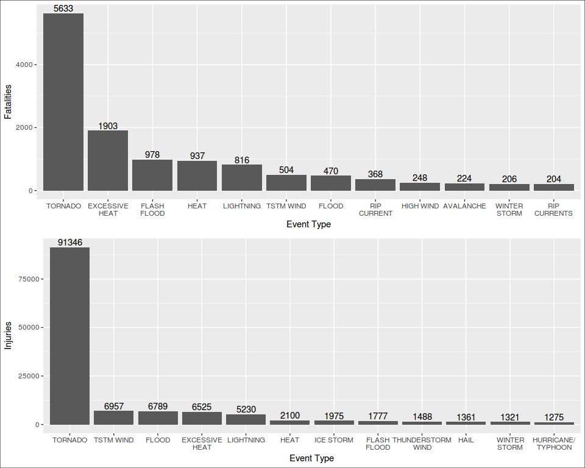

# Analysis of weather impact on people and the economy
Alfonso R. Reyes  


## Questions

1. Across the United States, which types of events (as indicated in the EVTYPE variable) are most harmful with respect to population health?

2. Across the United States, which types of events have the greatest economic consequences?

## Synopsis
<ten sentences>
weather impact on the economy: property and crops.
Does not take into account other effects such as defferred revenue, no income,
Years recorded from 1950 till 2011.
Investigate how much is the impact of the weather
Impact on the popuplation: fatalities, injured.
For the 1st question we will use the variables: EVTYPE, FATALITIES and INJURIES.
For the 2nd question, we will use the variables: EVTYPE, PROPDMG, CROPDMG, PROPDMGEXP and CROPDMGEXP.
Other analysis can later be performed such as if the weather effects have been improving or worsening, what states have suffered the largest impact, what counties have the highest economic loss, etc.


## Data Processing
The data processing consists in the following steps:

1. Download the raw data file from the internet theme(axis.text.x = element_text(angle = 30, hjust = 1))using the `download.file` function.
2. Unpack the downloaded file (535+ MB) with the function `bunzip` into a CSV file named as `dataset.csv`.
3. Load the CSV file in the object `stormdata.raw`: 902,297 observations and 37 variables.
4. Perform a quick analysis of the dataset `stormdata.raw` before applying data transformations.
5. Create a simplified dataset `stormdata` where some non-relevant variables have been removed but all observations kept. 902,297 observations and 13 variables.
6. Create a small dataset `stormdata.small` with only 12 variables and all observations still in place. The variable `BGN_DATE` converted to date type and renamed to `DATE`. The size of this file `stormdata.small.rda` is around 6 MB.
7. Clear the object `stormdata.raw` to save memory. Use only the new and smaller data frame `stormdata`
8. Create the data frames to respond the first question.
9. Create the data frame to respond to the second question.
10. Save an additional dataset to address other questions in the future.


```r
library(dplyr)
library(ggplot2)
library(gridExtra)
library(grid)
library(stringr)
library(rprojroot)
library(R.utils)
library(lubridate)
```

### Set up project folders with `rprojroot` package

```r
# package rprojroot required
root <- rprojroot::is_rstudio_project
root_file <- root$make_fix_file()
# root$find_file("REAME.md")
root_file()
cat("Setting up the project folders:\n")
project.data <- root_file("data")
project.extdata <- root_file("inst/extdata")
project.R <- root_file("R")

project.data
project.extdata
project.R
```

```
[1] "/home/superuser/git.projects/RR-PeerAsmnt2-NOAA_Storm"
Setting up the project folders:
[1] "/home/superuser/git.projects/RR-PeerAsmnt2-NOAA_Storm/data"
[1] "/home/superuser/git.projects/RR-PeerAsmnt2-NOAA_Storm/inst/extdata"
[1] "/home/superuser/git.projects/RR-PeerAsmnt2-NOAA_Storm/R"
```


### Downloading the data
We found a problem while trying to download the data file from the internet. The `bunzip2` format is not properly managed by the `download.file` function. So, we have to add a new function `bunzip2` from the package `R.utils` to download and unpack the compresed file. Of course, this could have been done by using the `read.csv` function to read the data file directly but that would be a "one-off" operation. To make the function `downloadZip` reusable for the future we used `bunzip2`. There is a flag in the function that allows the selection of that particular compression format.


```r
downloadZip <- function(fileUrl, outDir="./data", bzip2 = FALSE) {
  # function to download zipped and bunzip2 files and unpack
  temp <- tempfile()
  download.file(fileUrl, temp, mode = "wb")
  if (bzip2 == FALSE) {
    unzip(temp, exdir = outDir)
  }
  else {
    destfile <- paste(outDir, "dataset.csv", sep = "/")  # provide a filename
    bunzip2(temp, destname = destfile, overwrite = TRUE) # unpack bunzip2 file
  }
}
```


```r
# URL of the dataset file
fileUrl <- "https://d396qusza40orc.cloudfront.net/repdata%2Fdata%2FStormData.csv.bz2"
cat("Unpacking the raw data file:\n")
```

```
Unpacking the raw data file:
```

```r
outDir <- project.extdata             # folder for raw data
downloadZip(fileUrl, outDir = outDir, bzip2 = TRUE)   # download and unpack file
```


```r
# read the CSV file to memory
dataFile <- paste(project.extdata, "dataset.csv", sep = "/")
stormdata.raw <- read.csv(dataFile)
# stormdata <- stormdata.raw          # for the moment we will use a shorter name
```

### How our raw data look?

```r
# properties of the dataset
dims <- dim(stormdata.raw)
```

There are 902297 observations and 37 variables.

The names of the variables are:

```r
names(stormdata.raw)
```

```
 [1] "STATE__"    "BGN_DATE"   "BGN_TIME"   "TIME_ZONE"  "COUNTY"    
 [6] "COUNTYNAME" "STATE"      "EVTYPE"     "BGN_RANGE"  "BGN_AZI"   
[11] "BGN_LOCATI" "END_DATE"   "END_TIME"   "COUNTY_END" "COUNTYENDN"
[16] "END_RANGE"  "END_AZI"    "END_LOCATI" "LENGTH"     "WIDTH"     
[21] "F"          "MAG"        "FATALITIES" "INJURIES"   "PROPDMG"   
[26] "PROPDMGEXP" "CROPDMG"    "CROPDMGEXP" "WFO"        "STATEOFFIC"
[31] "ZONENAMES"  "LATITUDE"   "LONGITUDE"  "LATITUDE_E" "LONGITUDE_"
[36] "REMARKS"    "REFNUM"    
```

This is how the raw data looks:

```r
as_data_frame(stormdata.raw)
```

```
# A tibble: 902,297 × 37
   STATE__           BGN_DATE BGN_TIME TIME_ZONE COUNTY COUNTYNAME  STATE
     <dbl>             <fctr>   <fctr>    <fctr>  <dbl>     <fctr> <fctr>
1        1  4/18/1950 0:00:00     0130       CST     97     MOBILE     AL
2        1  4/18/1950 0:00:00     0145       CST      3    BALDWIN     AL
3        1  2/20/1951 0:00:00     1600       CST     57    FAYETTE     AL
4        1   6/8/1951 0:00:00     0900       CST     89    MADISON     AL
5        1 11/15/1951 0:00:00     1500       CST     43    CULLMAN     AL
6        1 11/15/1951 0:00:00     2000       CST     77 LAUDERDALE     AL
7        1 11/16/1951 0:00:00     0100       CST      9     BLOUNT     AL
8        1  1/22/1952 0:00:00     0900       CST    123 TALLAPOOSA     AL
9        1  2/13/1952 0:00:00     2000       CST    125 TUSCALOOSA     AL
10       1  2/13/1952 0:00:00     2000       CST     57    FAYETTE     AL
# ... with 902,287 more rows, and 30 more variables: EVTYPE <fctr>,
#   BGN_RANGE <dbl>, BGN_AZI <fctr>, BGN_LOCATI <fctr>, END_DATE <fctr>,
#   END_TIME <fctr>, COUNTY_END <dbl>, COUNTYENDN <lgl>, END_RANGE <dbl>,
#   END_AZI <fctr>, END_LOCATI <fctr>, LENGTH <dbl>, WIDTH <dbl>, F <int>,
#   MAG <dbl>, FATALITIES <dbl>, INJURIES <dbl>, PROPDMG <dbl>,
#   PROPDMGEXP <fctr>, CROPDMG <dbl>, CROPDMGEXP <fctr>, WFO <fctr>,
#   STATEOFFIC <fctr>, ZONENAMES <fctr>, LATITUDE <dbl>, LONGITUDE <dbl>,
#   LATITUDE_E <dbl>, LONGITUDE_ <dbl>, REMARKS <fctr>, REFNUM <dbl>
```


### What variables do we keep for our analysis?

These are the variables that we consider important for the analysis:

        REFNUM, BGN_DATE, STATE, COUNTY, COUNTYNAME, EVTYPE, 
        FATALITIES, INJURIES, PROPDMG, PROPDMGEXP, CROPDMG, CROPDMGEXP, REMARKS

### Clean up the dataset
We will transform the variable `BGN_DATE` from a factor to a date variable. We will later use it for our summaries. We will also take out some variables that are not relevant to our study.


```r
# read the raw data from original source and load to object stormdata
# stormdata will be cleaned up, some variables converted and some corrections made.
stormdata <- stormdata.raw %>%
  select(REFNUM, BGN_DATE, STATE, COUNTY, COUNTYNAME, EVTYPE, 
         FATALITIES, INJURIES, PROPDMG, PROPDMGEXP, CROPDMG, CROPDMGEXP, REMARKS) %>%
  # convert BGN_DATE to date format
  mutate(DATE = mdy_hms(as.character(BGN_DATE))) %>%    # convert to date
  select(REFNUM, DATE, STATE, COUNTY, COUNTYNAME, EVTYPE, 
         FATALITIES, INJURIES, PROPDMG, PROPDMGEXP, CROPDMG, CROPDMGEXP, REMARKS) %>%
  # convert *EXP to uppercase and remove trailing spaces
  mutate(PROPDMGEXP = as.factor(toupper(str_trim(PROPDMGEXP))),      # clean the string
         CROPDMGEXP = as.factor(toupper(str_trim(CROPDMGEXP)))) %>%
  mutate(REMARKS = as.character(REMARKS))
  
# rm(stormdata.raw)     # release big dataset
# save(stormdata, file = paste(project.data, "stormdata.rda", sep = "/"))
```


### IMPORTANT

There is a typo in one of the observations in the California flood 2005/2006. We noticed this while plotting the economic impact of the weather events. This code below will filter the event that started on Christmas 2005 and persisted around 2006 New Year.

We are saving the correction in `stormdata.rda`. So, if the reader wants to reproduce the error, it wil be necessary to load the data from scratch, starting with downloading the file from the original source. The code above wll reproduce the steps necessary. To see the observation with the typo (it was writen "B" instead of "M" in the variable `PROPDMGEXP`), it corresponds to observation 605943 as identified by the variable `REFNUM`.


```r
# floods in California from Xmas 2005 to around New Year 2006
# one record improperly entered as Billions instead of millions REFNUM=605943
ca.flood <- stormdata %>%
  filter(DATE >= "2005-12-25" & DATE <= "2006-01-02" & STATE == "CA" & PROPDMG > 0) %>%
  arrange(DATE) %>%
  select(REFNUM, DATE, STATE, PROPDMG, PROPDMGEXP, CROPDMG, CROPDMGEXP, REMARKS)

as_data_frame(ca.flood)
```

```
# A tibble: 59 × 8
   REFNUM       DATE  STATE PROPDMG PROPDMGEXP CROPDMG CROPDMGEXP
    <dbl>     <dttm> <fctr>   <dbl>     <fctr>   <dbl>     <fctr>
1  567175 2005-12-26     CA    20.0          K       0           
2  567179 2005-12-28     CA    55.9          M       0           
3  567180 2005-12-28     CA    10.0          K       0           
4  567184 2005-12-29     CA    60.8          M       8          M
5  567185 2005-12-29     CA     5.0          K       0           
6  567186 2005-12-30     CA     5.0          K       0           
7  567187 2005-12-30     CA     5.0          K       0           
8  567193 2005-12-30     CA     1.0          M       0           
9  567197 2005-12-31     CA     1.0          M       0           
10 567198 2005-12-31     CA     1.0          M       0           
# ... with 49 more rows, and 1 more variables: REMARKS <chr>
```


Event occurring in January 2006 (id=605943) has been improperly recorded as economic losses of 150 Billion US dollars. After some research we found that the numbers are more in the 300 million dollars range. See paper USGS _____.

Replace the "B" of billions by "M" (millons):

```r
stormdata[stormdata$REFNUM==605943, c("PROPDMGEXP")] <- "M"
stormdata[stormdata$REFNUM==605943, c("PROPDMGEXP")]
```

```
[1] M
Levels:  - ? + 0 1 2 3 4 5 6 7 8 B H K M
```


Add a new comment on correction to the `REMARKS` variable:

```r
# Get the remark if stormdata.raw was loaded
remarks.605943 <- stormdata[stormdata$REFNUM==605943, c("REMARKS")]
remarks.605943
```

```
[1] "Major flooding continued into the early hours of January 1st, before the Napa River finally fell below flood stage and the water receeded. Flooding was severe in Downtown Napa from the Napa Creek and the City and Parks Department was hit with $6 million in damage alone. The City of Napa had 600 homes with moderate damage, 150 damaged businesses with costs of at least $70 million."
```

```r
text.was <- "Major flooding continued into the early hours of January 1st, before the Napa River finally fell below flood stage and the water receeded. Flooding was severe in Downtown Napa from the Napa Creek and the City and Parks Department was hit with $6 million in damage alone. The City of Napa had 600 homes with moderate damage, 150 damaged businesses with costs of at least $70 million."

# this is the new remark
remarks.605943 <- paste("Correct typo in property damage from 'B' (biilion) to 'M' (million).", text.was, sep = "| ")

# impute the new remark
stormdata[stormdata$REFNUM==605943, c("REMARKS")] <- remarks.605943

# save stormdata after corrections
save(stormdata, file = paste(project.data, "stormdata.rda", sep = "/"))
```


This is a view of the data frame that we will use in our analysis.

```r
as_data_frame(stormdata)
```

```
# A tibble: 902,297 × 13
   REFNUM       DATE  STATE COUNTY COUNTYNAME  EVTYPE FATALITIES INJURIES
    <dbl>     <dttm> <fctr>  <dbl>     <fctr>  <fctr>      <dbl>    <dbl>
1       1 1950-04-18     AL     97     MOBILE TORNADO          0       15
2       2 1950-04-18     AL      3    BALDWIN TORNADO          0        0
3       3 1951-02-20     AL     57    FAYETTE TORNADO          0        2
4       4 1951-06-08     AL     89    MADISON TORNADO          0        2
5       5 1951-11-15     AL     43    CULLMAN TORNADO          0        2
6       6 1951-11-15     AL     77 LAUDERDALE TORNADO          0        6
7       7 1951-11-16     AL      9     BLOUNT TORNADO          0        1
8       8 1952-01-22     AL    123 TALLAPOOSA TORNADO          0        0
9       9 1952-02-13     AL    125 TUSCALOOSA TORNADO          1       14
10     10 1952-02-13     AL     57    FAYETTE TORNADO          0        0
# ... with 902,287 more rows, and 5 more variables: PROPDMG <dbl>,
#   PROPDMGEXP <fctr>, CROPDMG <dbl>, CROPDMGEXP <fctr>, REMARKS <chr>
```


```r
load(paste(project.data, "stormdata.rda", sep = "/"))  # load the data
```

Create a small data frame without the `REMARKS` variable.

```r
stormdata.small <- stormdata %>% 
  select(REFNUM, DATE, STATE, COUNTY, COUNTYNAME, EVTYPE,     # reorder
         FATALITIES, INJURIES, PROPDMG, PROPDMGEXP, CROPDMG, CROPDMGEXP) 

as_data_frame(stormdata.small)
```

```
# A tibble: 902,297 × 12
   REFNUM       DATE  STATE COUNTY COUNTYNAME  EVTYPE FATALITIES INJURIES
    <dbl>     <dttm> <fctr>  <dbl>     <fctr>  <fctr>      <dbl>    <dbl>
1       1 1950-04-18     AL     97     MOBILE TORNADO          0       15
2       2 1950-04-18     AL      3    BALDWIN TORNADO          0        0
3       3 1951-02-20     AL     57    FAYETTE TORNADO          0        2
4       4 1951-06-08     AL     89    MADISON TORNADO          0        2
5       5 1951-11-15     AL     43    CULLMAN TORNADO          0        2
6       6 1951-11-15     AL     77 LAUDERDALE TORNADO          0        6
7       7 1951-11-16     AL      9     BLOUNT TORNADO          0        1
8       8 1952-01-22     AL    123 TALLAPOOSA TORNADO          0        0
9       9 1952-02-13     AL    125 TUSCALOOSA TORNADO          1       14
10     10 1952-02-13     AL     57    FAYETTE TORNADO          0        0
# ... with 902,287 more rows, and 4 more variables: PROPDMG <dbl>,
#   PROPDMGEXP <fctr>, CROPDMG <dbl>, CROPDMGEXP <fctr>
```


### Saving a portion of the dataset
If we save the data frame `stormdata` as an .rda file the size is 46 megabytes. On the other hand, if we omit the `REMARKS` variable, the new dataset shrinks to only 4.6 megabytes. We will take this route of saving the smaller file as well.


```r
# save unique events by year
save(stormdata.small, file = paste(project.data, "stormdata.small.rda", sep = "/"))
```

## The 1st Question
### Create data frames for 1st question
We want to find now which type of events is more harmful to population health. We could group by `EVTYPE` and showing the variables FATALITIES and INJURIES.


```r
# byEvent.0: dataset where main sort criteria is FATALITIES
byEvent.0 <- stormdata %>%
  select(EVTYPE, FATALITIES, INJURIES) %>%
  group_by(EVTYPE) %>%
  summarize(fatal.sum = sum(FATALITIES), injur.sum = sum(INJURIES)) %>%
  arrange(desc(fatal.sum), desc(injur.sum))

byEvent.0
```

```
# A tibble: 985 × 3
           EVTYPE fatal.sum injur.sum
           <fctr>     <dbl>     <dbl>
1         TORNADO      5633     91346
2  EXCESSIVE HEAT      1903      6525
3     FLASH FLOOD       978      1777
4            HEAT       937      2100
5       LIGHTNING       816      5230
6       TSTM WIND       504      6957
7           FLOOD       470      6789
8     RIP CURRENT       368       232
9       HIGH WIND       248      1137
10      AVALANCHE       224       170
# ... with 975 more rows
```


```r
# byEvent.1: dataset where the main sort criteria is INJURIES
byEvent.1 <- stormdata %>%
  select(EVTYPE, FATALITIES, INJURIES) %>%
  group_by(EVTYPE) %>%
  summarize(injur.sum = sum(INJURIES), fatal.sum = sum(FATALITIES)) %>%
  arrange(desc(injur.sum), desc(fatal.sum))

byEvent.1
```

```
# A tibble: 985 × 3
              EVTYPE injur.sum fatal.sum
              <fctr>     <dbl>     <dbl>
1            TORNADO     91346      5633
2          TSTM WIND      6957       504
3              FLOOD      6789       470
4     EXCESSIVE HEAT      6525      1903
5          LIGHTNING      5230       816
6               HEAT      2100       937
7          ICE STORM      1975        89
8        FLASH FLOOD      1777       978
9  THUNDERSTORM WIND      1488       133
10              HAIL      1361        15
# ... with 975 more rows
```


### Plots that address the 1st question     
We plot now the top 5 events that cause more harm on the population:


```r
byEvent.Fat <- byEvent.0[1:12, ]
byEvent.Inj <- byEvent.1[1:12, ]

# plot sorted by number of fatalities
p1 <- ggplot(byEvent.Fat, aes(x = reorder(EVTYPE, -fatal.sum), y = fatal.sum)) +
  geom_bar(stat = "identity") +
  xlab("Event Type") + ylab("Fatalities") +
  geom_text(aes(label=fatal.sum, vjust = -0.25)) +  
  scale_x_discrete(labels = function(EVTYPE) str_wrap(EVTYPE, width = 10))

# plot sorted by number of injuries
p2 <- ggplot(byEvent.Inj, aes(x = reorder(EVTYPE, -injur.sum), y = injur.sum)) +
  geom_bar(stat = "identity") +
  xlab("Event Type") + ylab("Injuries") +
  geom_text(aes(label=injur.sum, vjust = -0.25)) +  
  scale_x_discrete(labels = function(EVTYPE) str_wrap(EVTYPE, width = 10))

gridExtra::grid.arrange(p1, p2)
grid.rect(gp=gpar(fill=NA))
```

<!-- -->

Tornados, Excessive heat, flash floods, heat and lightning are the weather events most harmful to the population accross the United States. 


## The 2nd Question

## Assessing the Economic Damage
The property and crop damage are not in a unique monetary units; they use thousands, millions and billions. They are specified in the variables `PROPDMGEXP` and `CROPDMGEXP`. In addition, other characters are used under these variables. In the *Appendix* is explained how many more identifiers are used as a monetary identifier.

We will start by converting the monetary damages to a consistent units. We will choose thousands.


```r
byDamage <- stormdata %>%
  select(EVTYPE, PROPDMG, PROPDMGEXP, CROPDMG, CROPDMGEXP) %>%
  group_by(EVTYPE) %>%
  # convert to unique dollar multiplier
  mutate(PROPDMG.K = ifelse(PROPDMGEXP == "K", PROPDMG * 1,
                     ifelse(PROPDMGEXP == "M", PROPDMG * 1000,
                     ifelse(PROPDMGEXP == "B", PROPDMG * 1E6, 0)))) %>%
  mutate(CROPDMG.K = ifelse(CROPDMGEXP == "K", CROPDMG * 1,
                     ifelse(CROPDMGEXP == "M", CROPDMG * 1000,
                     ifelse(CROPDMGEXP == "B", CROPDMG * 1E6, 0))))
byDamage
```

```
Source: local data frame [902,297 x 7]
Groups: EVTYPE [985]

    EVTYPE PROPDMG PROPDMGEXP CROPDMG CROPDMGEXP PROPDMG.K CROPDMG.K
    <fctr>   <dbl>     <fctr>   <dbl>     <fctr>     <dbl>     <dbl>
1  TORNADO    25.0          K       0                 25.0         0
2  TORNADO     2.5          K       0                  2.5         0
3  TORNADO    25.0          K       0                 25.0         0
4  TORNADO     2.5          K       0                  2.5         0
5  TORNADO     2.5          K       0                  2.5         0
6  TORNADO     2.5          K       0                  2.5         0
7  TORNADO     2.5          K       0                  2.5         0
8  TORNADO     2.5          K       0                  2.5         0
9  TORNADO    25.0          K       0                 25.0         0
10 TORNADO    25.0          K       0                 25.0         0
# ... with 902,287 more rows
```

We convert the thousands to millions of US$ and only one variable, the total economic damage.

```r
byDamage.mm <- byDamage %>%
  summarize(propdmg.k = sum(PROPDMG.K), cropdmg.k = sum(CROPDMG.K)) %>%
  mutate(propdmg.m = propdmg.k / 1000, cropdmg.m = cropdmg.k / 1000) %>%
  select(EVTYPE, propdmg.m, cropdmg.m) %>%
  mutate(totaldmg.mm = propdmg.m + cropdmg.m) %>%
  mutate(totaldmg.bi = totaldmg.mm / 1000) %>%
  # arrange(desc(propdmg.m), desc(cropdmg.m))
  arrange(desc(totaldmg.mm))

byDamage.mm
```

```
# A tibble: 985 × 5
              EVTYPE propdmg.m  cropdmg.m totaldmg.mm totaldmg.bi
              <fctr>     <dbl>      <dbl>       <dbl>       <dbl>
1  HURRICANE/TYPHOON 69305.840  2607.8728   71913.713   71.913713
2            TORNADO 56937.160   414.9531   57352.114   57.352114
3        STORM SURGE 43323.536     0.0050   43323.541   43.323541
4              FLOOD 29772.710  5661.9685   35434.678   35.434678
5               HAIL 15732.267  3025.9545   18758.221   18.758221
6        FLASH FLOOD 16140.812  1421.3171   17562.129   17.562129
7            DROUGHT  1046.106 13972.5660   15018.672   15.018672
8          HURRICANE 11868.319  2741.9100   14610.229   14.610229
9        RIVER FLOOD  5118.945  5029.4590   10148.405   10.148404
10         ICE STORM  3944.928  5022.1135    8967.041    8.967041
# ... with 975 more rows
```


### Plots for the 2nd question
Get the top 5 and top 10 causes of economic damage.

```r
byDamage.mm.top5 <- byDamage.mm[1:10, ]
byDamage.mm.top5
```

```
# A tibble: 10 × 5
              EVTYPE propdmg.m  cropdmg.m totaldmg.mm totaldmg.bi
              <fctr>     <dbl>      <dbl>       <dbl>       <dbl>
1  HURRICANE/TYPHOON 69305.840  2607.8728   71913.713   71.913713
2            TORNADO 56937.160   414.9531   57352.114   57.352114
3        STORM SURGE 43323.536     0.0050   43323.541   43.323541
4              FLOOD 29772.710  5661.9685   35434.678   35.434678
5               HAIL 15732.267  3025.9545   18758.221   18.758221
6        FLASH FLOOD 16140.812  1421.3171   17562.129   17.562129
7            DROUGHT  1046.106 13972.5660   15018.672   15.018672
8          HURRICANE 11868.319  2741.9100   14610.229   14.610229
9        RIVER FLOOD  5118.945  5029.4590   10148.405   10.148404
10         ICE STORM  3944.928  5022.1135    8967.041    8.967041
```


```r
# plots for total economic losses
r1 <- ggplot(byDamage.mm.top5, aes(x = reorder(EVTYPE, -totaldmg.bi), y = totaldmg.bi)) +
  geom_bar(stat = "identity") +
  labs(y = "Billions US$", x = "Weather event") +
  ggtitle("Total impact on Economy") +
  geom_text(aes(label=round(totaldmg.bi, 0), vjust = -0.25)) +
  theme(axis.text.x = element_text(angle = 40, hjust = 1)) + 
  scale_x_discrete(labels = function(EVTYPE) str_wrap(EVTYPE, width = 10))

# plot for impact on property
propdmg.bi <- byDamage.mm.top5$propdmg.m/1000
r2 <- ggplot(byDamage.mm.top5, aes(x = reorder(EVTYPE, -propdmg.bi), y = propdmg.bi)) +
  geom_bar(stat = "identity") +
  labs(y = "Billions US$", x = "Weather event") +
  ggtitle("Economic impact on Property") +
  geom_text(aes(label=round(propdmg.bi, 0), vjust = -0.05)) + 
  theme(axis.text.x = element_text(angle = 40, hjust = 1)) +
  scale_x_discrete(labels = function(EVTYPE) str_wrap(EVTYPE, width = 10))

# plot for impact on crops
cropdmg.bi <- byDamage.mm.top5$cropdmg.m/1000
r3 <- ggplot(byDamage.mm.top5, aes(x = reorder(EVTYPE, -cropdmg.bi), y = cropdmg.bi)) +
  geom_bar(stat = "identity") +
  labs(y = "Billions US$", x = "Weather event") +
  ggtitle("Economic impact on Crops") +
  geom_text(aes(label=round(cropdmg.bi, 1), vjust = -0.05)) +
  theme(axis.text.x = element_text(angle = 40, hjust = 1)) +
  scale_x_discrete(labels = function(EVTYPE) str_wrap(EVTYPE, width = 10))

gridExtra::grid.arrange(r1, arrangeGrob(r2, r3), ncol=2)  # 3-in-1 figure
grid.rect(gp=gpar(fill=NA))
```

<!-- -->


## Results
These are the results:

1. Tornados, excessive heat, flash floods, heat and lightning are the weather events most harmful to human life accross the United States. In the case of injuries caused to humans, tornados, excessive heat, lightning, heat and flash floods are the events causing them in descending order.

2. Even though **hurricanes/typhons** are the most detrimental to the economy, they are not the main threat to human life; it is **tornados** by their *unpredictability*. Hurricanes are pretty well forecast nowadays with help of satellite. Hurricanes are 25th cause of human mortality.

3. On the economic impact, we classified the weather events from the most damaging to the economy to the less. They are: flood, hurricane/typhoon, tornados, storm surge, hail, flash flodd, drought, river flood and ice storms. The economic impact totals both, property and crops. The scale of the plots is in Billions of USD.

4. Other additional findings were that the weather events have been **significantly increasing its damage to the economy** and for the population in general. From the plots in the appendix, we can see that from 1992 onwards, the effects have been disastrous. The losses in the economic have ascended from few millions to tens or hundreds of billions! On the population we can appreciate an increase in mortality from about a hundred in average (end of the 80s) to five hundred to fifteen hundred fatalities. 

5. Over the years, weather events have had less devastating effect on injuries on humans. Injuries have not duplicated or triplicated as in the case of the economy or loss of life. Additional studies may be advisable to find the reason to the relative control in injuries dure to the weather events. We can also notice some cyclical shape on the injuries accross the years but the slope is mildly ascending.

6. There are a couple of major weather events in 2005  where we can see a drastic impact on the economy of 100 billion dollars. That was Katrina affecting several states in the South.

7. Besides the identifiers `B`, `M` and `K`, in the variables `PROPDMGEXP` and `CROPDMGEXP`, there are additional characters and numbers entered in this variable. Since there is no way to etermine the units for the property or crop damage we are not considering these amounts. 

8. Anoher interesting thing we noticed from the plot in the appendix is that until 1979 the economy damage due to weather events was below 1 billion USD, with exception of 1973 and 1974. From then onwards it just keep increasing, peaking in Katrina in 2005 with $100 billion in property and crop damage. The average impact on the economy in the past 25 years has been averaging 25 billion USD.


## Appendix

### Have the number of fatalities and injuries increased over the years?
We have generated a couple of datasets that are much smaller in size than the original dataset.

* byYearEvent: is a dataset that contains a summary of the events, fatalities, injuries, economic losses in property and crops in millions of US$. 

* byYearSummary: a dataset showing the year and the wather impact on life and the economy. Four variables: year, fatalities, injured and economy losses in millions of USD.


```r
# By year, by event
byYearEvent <- stormdata %>%
  group_by(DATE, EVTYPE) %>%
  mutate(PROPDMG.K = ifelse(PROPDMGEXP == "K", PROPDMG * 1,
                     ifelse(PROPDMGEXP == "M", PROPDMG * 1000,
                     ifelse(PROPDMGEXP == "B", PROPDMG * 1E6, 0)))) %>%
  mutate(CROPDMG.K = ifelse(CROPDMGEXP == "K", CROPDMG * 1,
                     ifelse(CROPDMGEXP == "M", CROPDMG * 1000,
                     ifelse(CROPDMGEXP == "B", CROPDMG * 1E6, 0)))) %>%
  summarize(fatalities = sum(FATALITIES), 
            injuries   = sum(INJURIES),
            propdmg.M  = sum(PROPDMG.K) / 1000,
            cropdmg.M  = sum(CROPDMG.K) /1000
            )
# save unique events by year
save(byYearEvent, file = paste(project.data, "byYearEvent.rda", sep = "/"))

byYearEvent
```

```
Source: local data frame [83,144 x 6]
Groups: DATE [?]

         DATE  EVTYPE fatalities injuries propdmg.M cropdmg.M
       <dttm>  <fctr>      <dbl>    <dbl>     <dbl>     <dbl>
1  1950-01-03 TORNADO          0        7    3.0250         0
2  1950-01-13 TORNADO          1        1    0.0025         0
3  1950-01-25 TORNADO          0        5    0.5000         0
4  1950-01-26 TORNADO          0        2    0.0000         0
5  1950-02-11 TORNADO          1       23    0.5500         0
6  1950-02-12 TORNADO         35      169    3.1525         0
7  1950-02-13 TORNADO          9        9    0.0275         0
8  1950-02-27 TORNADO          0        0    0.0250         0
9  1950-03-01 TORNADO          0        0    0.0000         0
10 1950-03-16 TORNADO          0        0    0.0025         0
# ... with 83,134 more rows
```


```r
#load(paste(project.data, "byYearEvent.rda", sep = "/"))  # load the data

byYearSummary <- byYearEvent %>%
  mutate(year = year(DATE)) %>%           # get only the year
  group_by(year) %>%                      # group by year
  summarize(fatalities = sum(fatalities), # calculate total fatalities and injuries
            injuries = sum(injuries),
            damage.mm = round(sum(propdmg.M) + sum(cropdmg.M), 0), # total in millions
            damage.bb = round(damage.mm / 1000, 2)) %>%       # total damage in billions
  arrange(desc(damage.bb))

byYearSummary
```

```
# A tibble: 62 × 5
    year fatalities injuries damage.mm damage.bb
   <dbl>      <dbl>    <dbl>     <dbl>     <dbl>
1   2005        469     1834    100825    100.83
2   2004        370     2426     26799     26.80
3   1993        298     2149     21987     21.99
4   2011       1002     7792     21556     21.56
5   2008        488     2703     17778     17.78
6   1998        687    11177     16111     16.11
7   1995       1491     4480     12733     12.73
8   1999        908     5148     12254     12.25
9   2001        469     2721     11844     11.84
10  2003        443     2931     11398     11.40
# ... with 52 more rows
```

There are two years with the most economic damage: 2006 and 2006.

```r
q1 <- ggplot(byYearSummary, aes(x = year, y = damage.bb)) +
  geom_point() + 
  ggtitle("Impact on economy 1950-2011") + 
  labs(y = "Billions US$") +
  theme(plot.title = element_text(hjust=0.5))
q2 <- ggplot(byYearSummary, aes(x = year, y = fatalities)) +
  geom_point() +
  ggtitle("impact on human life, 1950-2011") +
  labs(y = "Fatalities") +
    theme(plot.title = element_text(hjust=0.5))

q3 <- ggplot(byYearSummary, aes(x = year, y = injuries)) +
  geom_point() +
  ggtitle("impact on health, 1950-2011") +
  labs(y = "Injured") +
    theme(plot.title = element_text(hjust=0.5))
  

gridExtra::grid.arrange(q1, arrangeGrob(q2, q3), ncol=2)
grid.rect(gp=gpar(fill=NA))
```

<!-- -->


```r
# save losses by year
save(byYearSummary, file = paste(project.data, "byYearSummary.rda", sep = "/"))
```

### what is the worst weather event in 2005?

```r
# what is the worst weather event in 2005?
worst <- stormdata.small %>%
  select(REFNUM, DATE, STATE, EVTYPE, PROPDMG, PROPDMGEXP) %>%
  arrange(desc(PROPDMG))

as_data_frame(worst)
```

```
# A tibble: 902,297 × 6
   REFNUM       DATE  STATE            EVTYPE PROPDMG PROPDMGEXP
    <dbl>     <dttm> <fctr>            <fctr>   <dbl>     <fctr>
1  778558 2009-07-26     NC THUNDERSTORM WIND    5000          K
2  808182 2010-05-13     IL       FLASH FLOOD    5000          K
3  808183 2010-05-13     IL       FLASH FLOOD    5000          K
4  900646 2011-10-29     AM        WATERSPOUT    5000          K
5  791393 2009-12-25     PR         LANDSLIDE    4800          K
6  750915 2009-03-28     TN           TORNADO    4410          K
7  762379 2009-05-12     OK THUNDERSTORM WIND    3500          K
8  815064 2010-06-24     CT THUNDERSTORM WIND    3200          K
9  749008 2009-02-11     IL         HIGH WIND    3000          K
10 755010 2009-04-29     IN             FLOOD    3000          K
# ... with 902,287 more rows
```

Show some events with doubtful monetary units.

```r
events <- stormdata %>%
  select(REFNUM, DATE, EVTYPE, REMARKS) %>%
  filter(REFNUM %in% c(605943, 577616, 577615, 581535))
as_data_frame(events)
```

```
# A tibble: 4 × 4
  REFNUM       DATE            EVTYPE
   <dbl>     <dttm>            <fctr>
1 577615 2005-08-28 HURRICANE/TYPHOON
2 577616 2005-08-29       STORM SURGE
3 581535 2005-08-29       STORM SURGE
4 605943 2006-01-01             FLOOD
# ... with 1 more variables: REMARKS <chr>
```


### Unknown identifiers for monetary units
There are some unspecified units in `PROPDMGEXP` and `CROPDMGEXP`.
There is no a reasonable way to determine the units or damage value from the remarks. Sometimes is thousands or in 10K, or other. 

In two cases, we found that instead of "M" for millions the lowercase version of it "m" was used. We converted them to uppercase before summarizing the data. Other characters or digits did not bring a special meaning to the dollar amount, so we didn't convert them even thoiugh we read the remarks to find some relationship.


```r
unique(byDamage$PROPDMGEXP)
```

```
 [1] K M   B + 0 5 6 ? 4 2 3 H 7 - 1 8
Levels:  - ? + 0 1 2 3 4 5 6 7 8 B H K M
```


```r
unique(byDamage$CROPDMGEXP)
```

```
[1]   M K B ? 0 2
Levels:  ? 0 2 B K M
```


```r
summary(byDamage)
```

```
               EVTYPE          PROPDMG          PROPDMGEXP    
 HAIL             :288661   Min.   :   0.00          :465934  
 TSTM WIND        :219940   1st Qu.:   0.00   K      :424665  
 THUNDERSTORM WIND: 82563   Median :   0.00   M      : 11338  
 TORNADO          : 60652   Mean   :  12.06   0      :   216  
 FLASH FLOOD      : 54277   3rd Qu.:   0.50   B      :    39  
 FLOOD            : 25326   Max.   :5000.00   5      :    28  
 (Other)          :170878                     (Other):    77  
    CROPDMG        CROPDMGEXP   PROPDMG.K          CROPDMG.K      
 Min.   :  0.000    :618413   Min.   :       0   Min.   :      0  
 1st Qu.:  0.000   ?:     7   1st Qu.:       0   1st Qu.:      0  
 Median :  0.000   0:    19   Median :       0   Median :      0  
 Mean   :  1.527   2:     1   Mean   :     346   Mean   :     54  
 3rd Qu.:  0.000   B:     9   3rd Qu.:       0   3rd Qu.:      0  
 Max.   :990.000   K:281853   Max.   :31300000   Max.   :5000000  
                   M:  1995                                       
```


Here is how we know how many observations do not carry the "K", "M" and "B" identifiers.


```r
unknown <- stormdata %>%
  select(STATE, EVTYPE, PROPDMGEXP, CROPDMGEXP, REMARKS) %>%
  filter(!toupper(PROPDMGEXP) %in% c("K", "M", "B") | !toupper(CROPDMGEXP) %in% c("K", "M", "B"))
```

There are 622760 observations which dollar amount units are not properly identified in `PROPDMGEXP` and `CROPDMGEXP` variables.


### The observation ID
We have observation IDs in the variable `REFNUM`. We check if all its values are unique:

```r
# REFNUM is the record id of the observation and is unique.
length(unique(stormdata$REFNUM))
range(unique(stormdata$REFNUM))
```

```
[1] 902297
[1]      1 902297
```


### The recorded weather events
Event Types `EVTYPE`

```r
# want to know how many levels this factor has
as_data_frame(unique(stormdata$EVTYPE), 10)
```

```
Warning in as.data.frame.factor(value, stringsAsFactors = FALSE, ...):
'row.names' is not a character vector of length 985 -- omitting it. Will be
an error!
```

```
# A tibble: 985 × 1
                       value
                      <fctr>
1                    TORNADO
2                  TSTM WIND
3                       HAIL
4              FREEZING RAIN
5                       SNOW
6      ICE STORM/FLASH FLOOD
7                   SNOW/ICE
8               WINTER STORM
9  HURRICANE OPAL/HIGH WINDS
10        THUNDERSTORM WINDS
# ... with 975 more rows
```

There are 985 different type of events.
