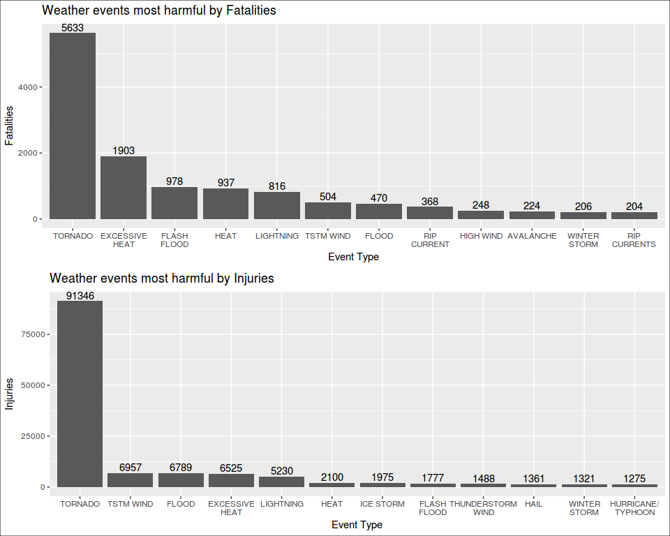
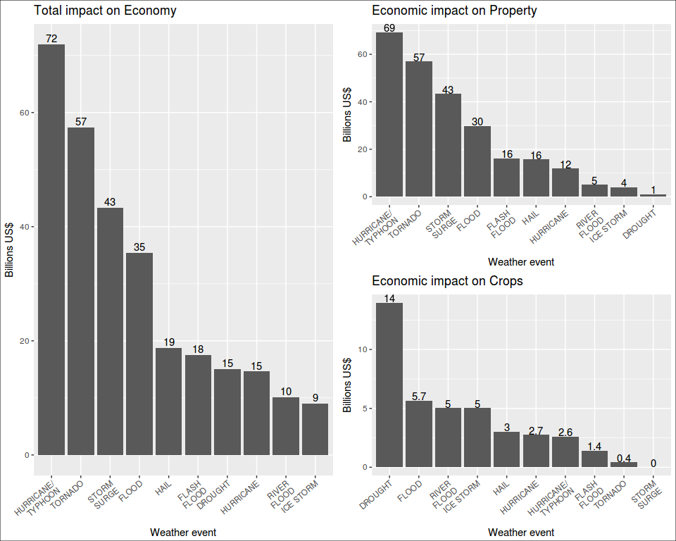

# main


## Questions

1. Across the United States, which types of events (as indicated in the EVTYPE variable) are most harmful with respect to population health?

2. Across the United States, which types of events have the greatest economic consequences?

## Synopsis


## Data Processing


```r
library(dplyr)
library(ggplot2)
library(gridExtra)
library(stringr)
library(rprojroot)
library(R.utils)
library(lubridate)
```

### Set up project folders with `rprojroot`

```r
# package rprojroot required
root <- rprojroot::is_rstudio_project
root_file <- root$make_fix_file()
# root$find_file("REAME.md")
root_file()
cat("Setting up the project folders:\n")
project.data <- root_file("data")
project.extdata <- root_file("inst/extdata")
project.R <- root_file("R")

project.data
project.extdata
project.R
```

```
[1] "/home/superuser/git.projects/RR-PeerAsmnt2-NOAA_Storm"
Setting up the project folders:
[1] "/home/superuser/git.projects/RR-PeerAsmnt2-NOAA_Storm/data"
[1] "/home/superuser/git.projects/RR-PeerAsmnt2-NOAA_Storm/inst/extdata"
[1] "/home/superuser/git.projects/RR-PeerAsmnt2-NOAA_Storm/R"
```

### Downloading the data
We found a problem while trying to download the data file from the internet. The `bunzip2` format is not properly managed by the `download.file` function. So, we have to add a new function `bunzip2` from the package `R.utils` to download and unpack the compresed file. Of course, this could have been done by using the `read.csv` function to read the data file directly but that would be a "one-off" operation. To make the function `downloadZip` reusable for the future we used `bunzip2`. There is a flag in the function that allows the selection of that particular compression format.


```r
downloadZip <- function(fileUrl, outDir="./data", bzip2 = FALSE) {
  # function to download zipped and bunzip2 files and unpack
  temp <- tempfile()
  download.file(fileUrl, temp, mode = "wb")
  if (bzip2 == FALSE) {
    unzip(temp, exdir = outDir)
  }
  else {
    destfile <- paste(outDir, "dataset.csv", sep = "/")  # provide a filename
    bunzip2(temp, destname = destfile, overwrite = TRUE) # unpack bunzip2 file
  }
}
```


```r
# URL of the dataset file
fileUrl <- "https://d396qusza40orc.cloudfront.net/repdata%2Fdata%2FStormData.csv.bz2"
cat("Unpacking the raw data file:\n")
```

```
Unpacking the raw data file:
```

```r
outDir <- project.extdata             # folder for raw data
downloadZip(fileUrl, outDir = outDir, bzip2 = TRUE)   # download and unpack file
```


```r
# read the CSV file to memory
dataFile <- paste(project.extdata, "dataset.csv", sep = "/")
stormdata.raw <- read.csv(dataFile)
stormdata <- stormdata.raw          # for the moment we will use a shorter name
```


```r
# properties of the dataset
dim(stormdata.raw)
```

```
[1] 902297     37
```

There are 902297 observations and 37 variables.

The names of the variables are:

```r
names(stormdata.raw)
```

```
 [1] "STATE__"    "BGN_DATE"   "BGN_TIME"   "TIME_ZONE"  "COUNTY"    
 [6] "COUNTYNAME" "STATE"      "EVTYPE"     "BGN_RANGE"  "BGN_AZI"   
[11] "BGN_LOCATI" "END_DATE"   "END_TIME"   "COUNTY_END" "COUNTYENDN"
[16] "END_RANGE"  "END_AZI"    "END_LOCATI" "LENGTH"     "WIDTH"     
[21] "F"          "MAG"        "FATALITIES" "INJURIES"   "PROPDMG"   
[26] "PROPDMGEXP" "CROPDMG"    "CROPDMGEXP" "WFO"        "STATEOFFIC"
[31] "ZONENAMES"  "LATITUDE"   "LONGITUDE"  "LATITUDE_E" "LONGITUDE_"
[36] "REMARKS"    "REFNUM"    
```


```r
#str(stormdata.raw)
summary(stormdata.raw)
```

```
    STATE__                  BGN_DATE             BGN_TIME     
 Min.   : 1.0   5/25/2011 0:00:00:  1202   12:00:00 AM: 10163  
 1st Qu.:19.0   4/27/2011 0:00:00:  1193   06:00:00 PM:  7350  
 Median :30.0   6/9/2011 0:00:00 :  1030   04:00:00 PM:  7261  
 Mean   :31.2   5/30/2004 0:00:00:  1016   05:00:00 PM:  6891  
 3rd Qu.:45.0   4/4/2011 0:00:00 :  1009   12:00:00 PM:  6703  
 Max.   :95.0   4/2/2006 0:00:00 :   981   03:00:00 PM:  6700  
                (Other)          :895866   (Other)    :857229  
   TIME_ZONE          COUNTY           COUNTYNAME         STATE       
 CST    :547493   Min.   :  0.0   JEFFERSON :  7840   TX     : 83728  
 EST    :245558   1st Qu.: 31.0   WASHINGTON:  7603   KS     : 53440  
 MST    : 68390   Median : 75.0   JACKSON   :  6660   OK     : 46802  
 PST    : 28302   Mean   :100.6   FRANKLIN  :  6256   MO     : 35648  
 AST    :  6360   3rd Qu.:131.0   LINCOLN   :  5937   IA     : 31069  
 HST    :  2563   Max.   :873.0   MADISON   :  5632   NE     : 30271  
 (Other):  3631                   (Other)   :862369   (Other):621339  
               EVTYPE         BGN_RANGE           BGN_AZI      
 HAIL             :288661   Min.   :   0.000          :547332  
 TSTM WIND        :219940   1st Qu.:   0.000   N      : 86752  
 THUNDERSTORM WIND: 82563   Median :   0.000   W      : 38446  
 TORNADO          : 60652   Mean   :   1.484   S      : 37558  
 FLASH FLOOD      : 54277   3rd Qu.:   1.000   E      : 33178  
 FLOOD            : 25326   Max.   :3749.000   NW     : 24041  
 (Other)          :170878                      (Other):134990  
         BGN_LOCATI                  END_DATE             END_TIME     
              :287743                    :243411              :238978  
 COUNTYWIDE   : 19680   4/27/2011 0:00:00:  1214   06:00:00 PM:  9802  
 Countywide   :   993   5/25/2011 0:00:00:  1196   05:00:00 PM:  8314  
 SPRINGFIELD  :   843   6/9/2011 0:00:00 :  1021   04:00:00 PM:  8104  
 SOUTH PORTION:   810   4/4/2011 0:00:00 :  1007   12:00:00 PM:  7483  
 NORTH PORTION:   784   5/30/2004 0:00:00:   998   11:59:00 PM:  7184  
 (Other)      :591444   (Other)          :653450   (Other)    :622432  
   COUNTY_END COUNTYENDN       END_RANGE           END_AZI      
 Min.   :0    Mode:logical   Min.   :  0.0000          :724837  
 1st Qu.:0    NA's:902297    1st Qu.:  0.0000   N      : 28082  
 Median :0                   Median :  0.0000   S      : 22510  
 Mean   :0                   Mean   :  0.9862   W      : 20119  
 3rd Qu.:0                   3rd Qu.:  0.0000   E      : 20047  
 Max.   :0                   Max.   :925.0000   NE     : 14606  
                                                (Other): 72096  
           END_LOCATI         LENGTH              WIDTH         
                :499225   Min.   :   0.0000   Min.   :   0.000  
 COUNTYWIDE     : 19731   1st Qu.:   0.0000   1st Qu.:   0.000  
 SOUTH PORTION  :   833   Median :   0.0000   Median :   0.000  
 NORTH PORTION  :   780   Mean   :   0.2301   Mean   :   7.503  
 CENTRAL PORTION:   617   3rd Qu.:   0.0000   3rd Qu.:   0.000  
 SPRINGFIELD    :   575   Max.   :2315.0000   Max.   :4400.000  
 (Other)        :380536                                         
       F               MAG            FATALITIES          INJURIES        
 Min.   :0.0      Min.   :    0.0   Min.   :  0.0000   Min.   :   0.0000  
 1st Qu.:0.0      1st Qu.:    0.0   1st Qu.:  0.0000   1st Qu.:   0.0000  
 Median :1.0      Median :   50.0   Median :  0.0000   Median :   0.0000  
 Mean   :0.9      Mean   :   46.9   Mean   :  0.0168   Mean   :   0.1557  
 3rd Qu.:1.0      3rd Qu.:   75.0   3rd Qu.:  0.0000   3rd Qu.:   0.0000  
 Max.   :5.0      Max.   :22000.0   Max.   :583.0000   Max.   :1700.0000  
 NA's   :843563                                                           
    PROPDMG          PROPDMGEXP        CROPDMG          CROPDMGEXP    
 Min.   :   0.00          :465934   Min.   :  0.000          :618413  
 1st Qu.:   0.00   K      :424665   1st Qu.:  0.000   K      :281832  
 Median :   0.00   M      : 11330   Median :  0.000   M      :  1994  
 Mean   :  12.06   0      :   216   Mean   :  1.527   k      :    21  
 3rd Qu.:   0.50   B      :    40   3rd Qu.:  0.000   0      :    19  
 Max.   :5000.00   5      :    28   Max.   :990.000   B      :     9  
                   (Other):    84                     (Other):     9  
      WFO                                       STATEOFFIC    
        :142069                                      :248769  
 OUN    : 17393   TEXAS, North                       : 12193  
 JAN    : 13889   ARKANSAS, Central and North Central: 11738  
 LWX    : 13174   IOWA, Central                      : 11345  
 PHI    : 12551   KANSAS, Southwest                  : 11212  
 TSA    : 12483   GEORGIA, North and Central         : 11120  
 (Other):690738   (Other)                            :595920  
                                                                                                                                                                                                    ZONENAMES     
                                                                                                                                                                                                         :594029  
                                                                                                                                                                                                         :205988  
 GREATER RENO / CARSON CITY / M - GREATER RENO / CARSON CITY / M                                                                                                                                         :   639  
 GREATER LAKE TAHOE AREA - GREATER LAKE TAHOE AREA                                                                                                                                                       :   592  
 JEFFERSON - JEFFERSON                                                                                                                                                                                   :   303  
 MADISON - MADISON                                                                                                                                                                                       :   302  
 (Other)                                                                                                                                                                                                 :100444  
    LATITUDE      LONGITUDE        LATITUDE_E     LONGITUDE_    
 Min.   :   0   Min.   :-14451   Min.   :   0   Min.   :-14455  
 1st Qu.:2802   1st Qu.:  7247   1st Qu.:   0   1st Qu.:     0  
 Median :3540   Median :  8707   Median :   0   Median :     0  
 Mean   :2875   Mean   :  6940   Mean   :1452   Mean   :  3509  
 3rd Qu.:4019   3rd Qu.:  9605   3rd Qu.:3549   3rd Qu.:  8735  
 Max.   :9706   Max.   : 17124   Max.   :9706   Max.   :106220  
 NA's   :47                      NA's   :40                     
                                           REMARKS           REFNUM      
                                               :287433   Min.   :     1  
                                               : 24013   1st Qu.:225575  
 Trees down.\n                                 :  1110   Median :451149  
 Several trees were blown down.\n              :   568   Mean   :451149  
 Trees were downed.\n                          :   446   3rd Qu.:676723  
 Large trees and power lines were blown down.\n:   432   Max.   :902297  
 (Other)                                       :588295                   
```

```r
head(stormdata.raw)
```

```
  STATE__           BGN_DATE BGN_TIME TIME_ZONE COUNTY COUNTYNAME STATE
1       1  4/18/1950 0:00:00     0130       CST     97     MOBILE    AL
2       1  4/18/1950 0:00:00     0145       CST      3    BALDWIN    AL
3       1  2/20/1951 0:00:00     1600       CST     57    FAYETTE    AL
4       1   6/8/1951 0:00:00     0900       CST     89    MADISON    AL
5       1 11/15/1951 0:00:00     1500       CST     43    CULLMAN    AL
6       1 11/15/1951 0:00:00     2000       CST     77 LAUDERDALE    AL
   EVTYPE BGN_RANGE BGN_AZI BGN_LOCATI END_DATE END_TIME COUNTY_END
1 TORNADO         0                                               0
2 TORNADO         0                                               0
3 TORNADO         0                                               0
4 TORNADO         0                                               0
5 TORNADO         0                                               0
6 TORNADO         0                                               0
  COUNTYENDN END_RANGE END_AZI END_LOCATI LENGTH WIDTH F MAG FATALITIES
1         NA         0                      14.0   100 3   0          0
2         NA         0                       2.0   150 2   0          0
3         NA         0                       0.1   123 2   0          0
4         NA         0                       0.0   100 2   0          0
5         NA         0                       0.0   150 2   0          0
6         NA         0                       1.5   177 2   0          0
  INJURIES PROPDMG PROPDMGEXP CROPDMG CROPDMGEXP WFO STATEOFFIC ZONENAMES
1       15    25.0          K       0                                    
2        0     2.5          K       0                                    
3        2    25.0          K       0                                    
4        2     2.5          K       0                                    
5        2     2.5          K       0                                    
6        6     2.5          K       0                                    
  LATITUDE LONGITUDE LATITUDE_E LONGITUDE_ REMARKS REFNUM
1     3040      8812       3051       8806              1
2     3042      8755          0          0              2
3     3340      8742          0          0              3
4     3458      8626          0          0              4
5     3412      8642          0          0              5
6     3450      8748          0          0              6
```

### Event Types `EVTYPE`


```r
# want to know how levels this factor has
head(unique(stormdata.raw$EVTYPE), 10)
```

```
 [1] TORNADO                   TSTM WIND                
 [3] HAIL                      FREEZING RAIN            
 [5] SNOW                      ICE STORM/FLASH FLOOD    
 [7] SNOW/ICE                  WINTER STORM             
 [9] HURRICANE OPAL/HIGH WINDS THUNDERSTORM WINDS       
985 Levels: ? ABNORMALLY DRY ABNORMALLY WET ... WND
```

There are 985 different type of events.

We want to find now which type of events is more harmful to population health. We could group by `EVTYPE` and showing the variables FATALITIES and INJURIES.


```r
byEvent.0 <- stormdata %>%
  select(EVTYPE, FATALITIES, INJURIES) %>%
  group_by(EVTYPE) %>%
  summarize(fatal.sum = sum(FATALITIES), injur.sum = sum(INJURIES)) %>%
  arrange(desc(fatal.sum), desc(injur.sum))

byEvent.0
```

```
# A tibble: 985 × 3
           EVTYPE fatal.sum injur.sum
           <fctr>     <dbl>     <dbl>
1         TORNADO      5633     91346
2  EXCESSIVE HEAT      1903      6525
3     FLASH FLOOD       978      1777
4            HEAT       937      2100
5       LIGHTNING       816      5230
6       TSTM WIND       504      6957
7           FLOOD       470      6789
8     RIP CURRENT       368       232
9       HIGH WIND       248      1137
10      AVALANCHE       224       170
# ... with 975 more rows
```


```r
byEvent.1 <- stormdata %>%
  select(EVTYPE, FATALITIES, INJURIES) %>%
  group_by(EVTYPE) %>%
  summarize(injur.sum = sum(INJURIES), fatal.sum = sum(FATALITIES)) %>%
  arrange(desc(injur.sum), desc(fatal.sum))

byEvent.1
```

```
# A tibble: 985 × 3
              EVTYPE injur.sum fatal.sum
              <fctr>     <dbl>     <dbl>
1            TORNADO     91346      5633
2          TSTM WIND      6957       504
3              FLOOD      6789       470
4     EXCESSIVE HEAT      6525      1903
5          LIGHTNING      5230       816
6               HEAT      2100       937
7          ICE STORM      1975        89
8        FLASH FLOOD      1777       978
9  THUNDERSTORM WIND      1488       133
10              HAIL      1361        15
# ... with 975 more rows
```

We plot now the top 5 events that cause more harm on the population:


```r
byEvent.005 <- byEvent.0[1:5, ]

p1 <- ggplot(byEvent.005, aes(x = EVTYPE, y = fatal.sum)) +
  geom_bar(stat = "identity") +
  xlab("Event Type") + ylab("Fatalities") +
  geom_text(aes(label=fatal.sum, vjust = -0.25))

p2 <- ggplot(byEvent.005, aes(EVTYPE, injur.sum)) +
  geom_bar(stat = "identity") +
  xlab("Event Type") + ylab("Injuries") +
  geom_text(aes(label=injur.sum, vjust = -0.25))

gridExtra::grid.arrange(p1, p2)
```

<!-- -->

Tornados, Excessive heat, flash floods, heat and lightning are the weather events most harmful to the population accross the United States.

## Economic Damage
The property and crop damage are not in a unique monetary units; they use thousands, millions and billions. They are specified in the variables `PROPDMGEXP` and `CROPDMGEXP`.

We will start by converting the monetary damages to a consistent units. We will choose thousands.


```r
byDamage <- stormdata %>%
  select(EVTYPE, PROPDMG, PROPDMGEXP, CROPDMG, CROPDMGEXP) %>%
  group_by(EVTYPE) %>%
  mutate(PROPDMGEXP = as.factor(toupper(str_trim(PROPDMGEXP))), 
         CROPDMGEXP = as.factor(toupper(str_trim(CROPDMGEXP)))) %>%
  mutate(PROPDMG.K = ifelse(PROPDMGEXP == "K", PROPDMG * 1,
                                    ifelse(PROPDMGEXP == "M", PROPDMG * 1000,
                                           ifelse(PROPDMGEXP == "B", PROPDMG * 1E6, 0)))) %>%
  mutate(CROPDMG.K = ifelse(CROPDMGEXP == "K", CROPDMG * 1,
                                    ifelse(CROPDMGEXP == "M", CROPDMG * 1000,
                                           ifelse(CROPDMGEXP == "B", CROPDMG * 1E6, 0))))
byDamage
```

```
Source: local data frame [902,297 x 7]
Groups: EVTYPE [985]

    EVTYPE PROPDMG PROPDMGEXP CROPDMG CROPDMGEXP PROPDMG.K CROPDMG.K
    <fctr>   <dbl>     <fctr>   <dbl>     <fctr>     <dbl>     <dbl>
1  TORNADO    25.0          K       0                 25.0         0
2  TORNADO     2.5          K       0                  2.5         0
3  TORNADO    25.0          K       0                 25.0         0
4  TORNADO     2.5          K       0                  2.5         0
5  TORNADO     2.5          K       0                  2.5         0
6  TORNADO     2.5          K       0                  2.5         0
7  TORNADO     2.5          K       0                  2.5         0
8  TORNADO     2.5          K       0                  2.5         0
9  TORNADO    25.0          K       0                 25.0         0
10 TORNADO    25.0          K       0                 25.0         0
# ... with 902,287 more rows
```

We converts the thousands to millions of US$ and only one variable, the total economic damage.


```r
byDamage.m <- byDamage %>%
  
  summarize(propdmg.k = sum(PROPDMG.K), cropdmg.k = sum(CROPDMG.K)) %>%
  mutate(propdmg.m = propdmg.k / 1000, cropdmg.m = cropdmg.k / 1000) %>%
  select(EVTYPE, propdmg.m, cropdmg.m) %>%
  mutate(totaldmg.m = propdmg.m + cropdmg.m) %>%
  # arrange(desc(propdmg.m), desc(cropdmg.m))
  arrange(desc(totaldmg.m))

byDamage.m
```

```
# A tibble: 985 × 4
              EVTYPE  propdmg.m  cropdmg.m totaldmg.m
              <fctr>      <dbl>      <dbl>      <dbl>
1              FLOOD 144657.710  5661.9685 150319.678
2  HURRICANE/TYPHOON  69305.840  2607.8728  71913.713
3            TORNADO  56937.160   414.9531  57352.114
4        STORM SURGE  43323.536     0.0050  43323.541
5               HAIL  15732.267  3025.9545  18758.221
6        FLASH FLOOD  16140.812  1421.3171  17562.129
7            DROUGHT   1046.106 13972.5660  15018.672
8          HURRICANE  11868.319  2741.9100  14610.229
9        RIVER FLOOD   5118.945  5029.4590  10148.405
10         ICE STORM   3944.928  5022.1135   8967.041
# ... with 975 more rows
```

Get the top 5 and top 10 causes of economic damage.

```r
byDamage.m.top5 <- byDamage.m[1:5, ]
byDamage.m.top5
```

```
# A tibble: 5 × 4
             EVTYPE propdmg.m cropdmg.m totaldmg.m
             <fctr>     <dbl>     <dbl>      <dbl>
1             FLOOD 144657.71 5661.9685  150319.68
2 HURRICANE/TYPHOON  69305.84 2607.8728   71913.71
3           TORNADO  56937.16  414.9531   57352.11
4       STORM SURGE  43323.54    0.0050   43323.54
5              HAIL  15732.27 3025.9545   18758.22
```

```r
byDamage.m.top10 <- byDamage.m[1:10, ]
byDamage.m.top10
```

```
# A tibble: 10 × 4
              EVTYPE  propdmg.m  cropdmg.m totaldmg.m
              <fctr>      <dbl>      <dbl>      <dbl>
1              FLOOD 144657.710  5661.9685 150319.678
2  HURRICANE/TYPHOON  69305.840  2607.8728  71913.713
3            TORNADO  56937.160   414.9531  57352.114
4        STORM SURGE  43323.536     0.0050  43323.541
5               HAIL  15732.267  3025.9545  18758.221
6        FLASH FLOOD  16140.812  1421.3171  17562.129
7            DROUGHT   1046.106 13972.5660  15018.672
8          HURRICANE  11868.319  2741.9100  14610.229
9        RIVER FLOOD   5118.945  5029.4590  10148.405
10         ICE STORM   3944.928  5022.1135   8967.041
```


```r
ggplot(byDamage.m.top5, aes(EVTYPE, totaldmg.m)) +
  geom_bar(stat = "identity")
```

<!-- -->


### Multiple identifiers for monetary units
There are some unspecified units in `PROPDMGEXP` and `CROPDMGEXP`.
There is no a reasonable way to determine the units or damage value from the remarks. Sometimes is thousands or in 10K, or other. Besides the identifiers `B`, `M` and `K`, there are additional characters and numbers entered in this variable. Since there is no way to etermine the units for the property or crop damage we are not considering these amounts. In two cases, we found that instead of "M" for millions the lowercase version of it "m" was used. We converted them to uppercase before summarizing the data.

Other characters or digits did not bring a special meaning to the dollar amount, so we didn't convert them even thoiugh we read the remarks to find some relationship.


```r
unique(byDamage$PROPDMGEXP)
```

```
 [1] K M   B + 0 5 6 ? 4 2 3 H 7 - 1 8
Levels: K  M + ? 0 4 5 7 B 1 2 8 H - 3 6
```


```r
unique(byDamage$CROPDMGEXP)
```

```
[1]   M K B ? 0 2
Levels:  M K 0 B ? 2
```


```r
summary(byDamage)
```

```
               EVTYPE          PROPDMG          PROPDMGEXP    
 HAIL             :288661   Min.   :   0.00          :465934  
 TSTM WIND        :219940   1st Qu.:   0.00   K      :424665  
 THUNDERSTORM WIND: 82563   Median :   0.00   M      : 11337  
 TORNADO          : 60652   Mean   :  12.06   0      :   216  
 FLASH FLOOD      : 54277   3rd Qu.:   0.50   B      :    40  
 FLOOD            : 25326   Max.   :5000.00   5      :    28  
 (Other)          :170878                     (Other):    77  
    CROPDMG        CROPDMGEXP   PROPDMG.K          CROPDMG.K      
 Min.   :  0.000    :618413   Min.   :0.00e+00   Min.   :      0  
 1st Qu.:  0.000   M:  1995   1st Qu.:0.00e+00   1st Qu.:      0  
 Median :  0.000   K:281853   Median :0.00e+00   Median :      0  
 Mean   :  1.527   0:    19   Mean   :4.74e+02   Mean   :     54  
 3rd Qu.:  0.000   B:     9   3rd Qu.:0.00e+00   3rd Qu.:      0  
 Max.   :990.000   ?:     7   Max.   :1.15e+08   Max.   :5000000  
                   2:     1                                       
```


Here is how we know how many observations do not carry the "K", "M" and "B" identifiers.


```r
unknown <- stormdata %>%
  select(STATE, EVTYPE, PROPDMGEXP, CROPDMGEXP, REMARKS) %>%
  filter(!toupper(PROPDMGEXP) %in% c("K", "M", "B") | !toupper(CROPDMGEXP) %in% c("K", "M", "B"))

dim(unknown)[1]
```

```
[1] 622760
```

There are 622760 observations which dollar amount units are not properly identified in `PROPDMGEXP` and `CROPDMGEXP` variables.

### Saving some data
We save few datasets that are much smaller in size than the original dataset.

1. byYearEvent: is a dataset that contains a summary of the events, fatalities, injuries, economic losses in property and crops in millions of US$. TO-DO: convert dates to year.

2. byYearSummary: a dataset showing the year and the wather impact on life and the economy. Four variables: year, fatalities, injured and economy losses in millions of USD.


```r
# By year, by event
byYearEvent <- stormdata %>%
  group_by(BGN_DATE, EVTYPE) %>%
  mutate(PROPDMGEXP = as.factor(toupper(str_trim(PROPDMGEXP))), 
         CROPDMGEXP = as.factor(toupper(str_trim(CROPDMGEXP))))     %>%
  mutate(PROPDMG.K = ifelse(PROPDMGEXP == "K", PROPDMG * 1,
                     ifelse(PROPDMGEXP == "M", PROPDMG * 1000,
                     ifelse(PROPDMGEXP == "B", PROPDMG * 1E6, 0)))) %>%
  mutate(CROPDMG.K = ifelse(CROPDMGEXP == "K", CROPDMG * 1,
                     ifelse(CROPDMGEXP == "M", CROPDMG * 1000,
                     ifelse(CROPDMGEXP == "B", CROPDMG * 1E6, 0)))) %>%
  summarize(fatalities = sum(FATALITIES), 
            injuries   = sum(INJURIES),
            propdmg.M  = sum(PROPDMG.K) / 1000,
            cropdmg.M  = sum(CROPDMG.K) /1000
            )

byYearEvent
```

```
Source: local data frame [83,144 x 6]
Groups: BGN_DATE [?]

             BGN_DATE    EVTYPE fatalities injuries propdmg.M cropdmg.M
               <fctr>    <fctr>      <dbl>    <dbl>     <dbl>     <dbl>
1  10/10/1954 0:00:00   TORNADO          0        0    0.0250         0
2  10/10/1958 0:00:00   TORNADO          2        7    0.2500         0
3  10/10/1958 0:00:00 TSTM WIND          0        0    0.0000         0
4  10/10/1959 0:00:00      HAIL          0        0    0.0000         0
5  10/10/1959 0:00:00   TORNADO          0        0    0.2750         0
6  10/10/1959 0:00:00 TSTM WIND          0        0    0.0000         0
7  10/10/1960 0:00:00      HAIL          0        0    0.0000         0
8  10/10/1961 0:00:00   TORNADO          0        0    0.0025         0
9  10/10/1962 0:00:00      HAIL          0        0    0.0000         0
10 10/10/1962 0:00:00   TORNADO          0        0    0.0250         0
# ... with 83,134 more rows
```


```r
# save unique events by year
save(byYearEvent, file = paste(project.data, "byYearEvent.rda", sep = "/"))
```

### Have the number of fatalities and injuries increased over the years?


```r
load(paste(project.data, "byYearEvent.rda", sep = "/"))  # load the data

byYearSummary <- byYearEvent %>%
  mutate(year = year(mdy_hms(as.character(BGN_DATE)))) %>%
  group_by(year) %>%
  summarize(fatalities = sum(fatalities), 
            injuries = sum(injuries),
            damage.mm = sum(propdmg.M) + sum(cropdmg.M)
            )

byYearSummary
```

```
# A tibble: 62 × 4
    year fatalities injuries damage.mm
   <dbl>      <dbl>    <dbl>     <dbl>
1   1950         70      659  34.48165
2   1951         34      524  65.50599
3   1952        230     1915  94.10224
4   1953        519     5131 596.10470
5   1954         36      715  85.80532
6   1955        129      926  82.66063
7   1956         83     1355 116.91235
8   1957        193     1976 224.38889
9   1958         67      535 128.99461
10  1959         58      734  87.45304
# ... with 52 more rows
```


```r
ggplot(byYearSummary, aes(x = year, y = damage.mm)) +
  geom_point()
```

<!-- -->


```r
ggplot(byYearSummary, aes(x = year, y = fatalities)) +
  geom_point()
```

<!-- -->


```r
ggplot(byYearSummary, aes(x = year, y = injuries)) +
  geom_point()
```

<!-- -->


```r
# save losses by year
save(byYearSummary, file = paste(project.data, "byYearSummary.rda", sep = "/"))
```

## Results

## Figures
Maximum: 03. Can use panels.

## Code
